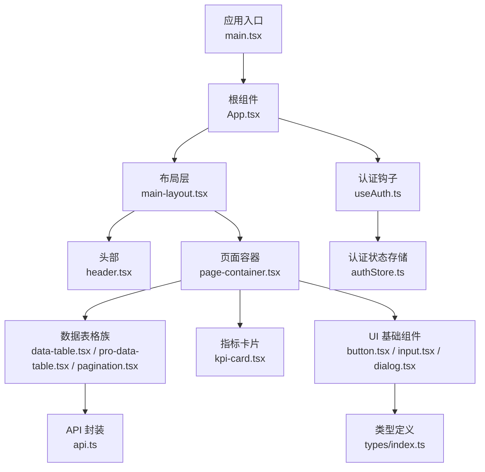
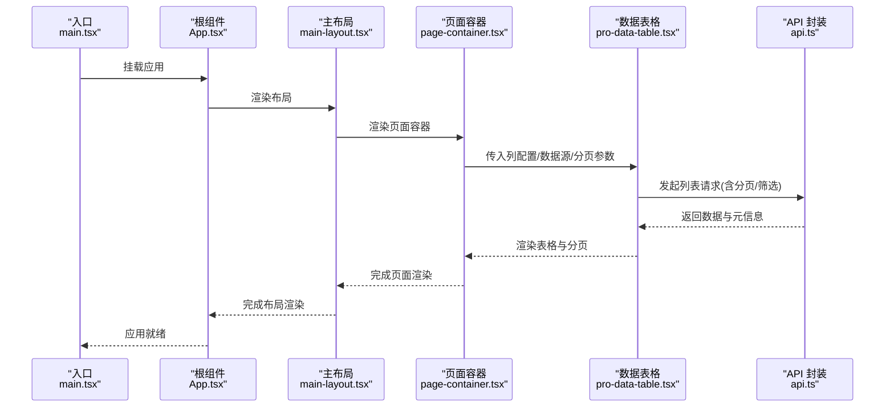
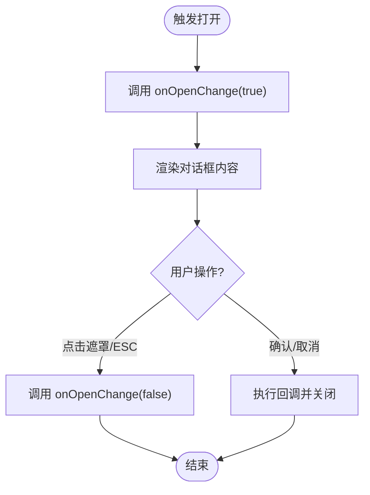
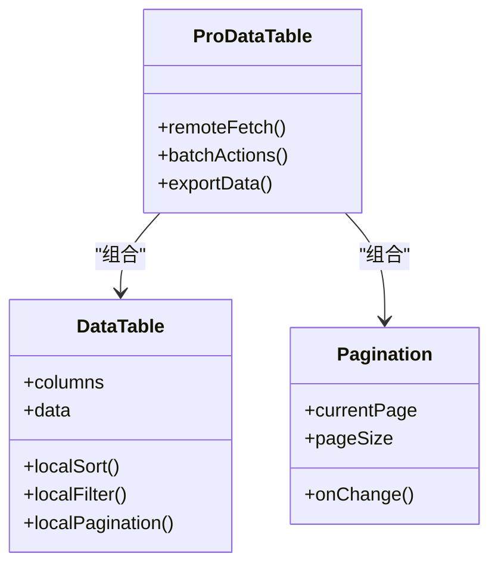
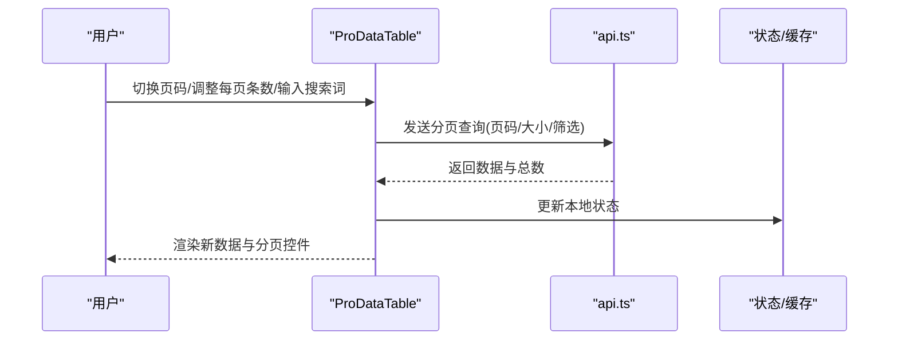
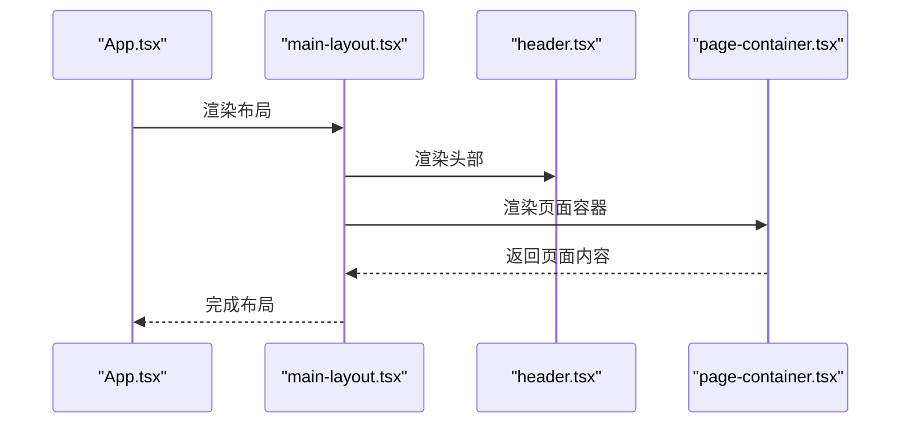
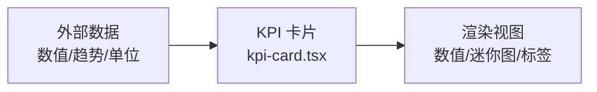
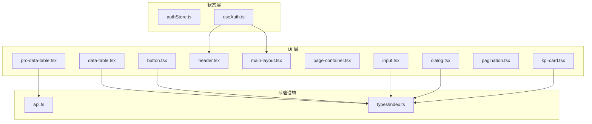

# 组件架构

<cite>
**本文引用的文件**   
- [web/src/App.tsx](file://web/src/App.tsx)
- [web/src/main.tsx](file://web/src/main.tsx)
- [web/src/components/ui/button.tsx](file://web/src/components/ui/button.tsx)
- [web/src/components/ui/input.tsx](file://web/src/components/ui/dialog.tsx)
- [web/src/components/data-table/data-table.tsx](file://web/src/components/data-table/data-table.tsx)
- [web/src/components/data-table/pro-data-table.tsx](file://web/src/components/data-table/pro-data-table.tsx)
- [web/src/components/data-table/pagination.tsx](file://web/src/components/data-table/pagination.tsx)
- [web/src/components/layout/header.tsx](file://web/src/components/layout/header.tsx)
- [web/src/components/layout/main-layout.tsx](file://web/src/components/layout/main-layout.tsx)
- [web/src/components/layout/page-container.tsx](file://web/src/components/layout/page-container.tsx)
- [web/src/components/charts/kpi-card.tsx](file://web/src/components/charts/kpi-card.tsx)
- [web/src/hooks/useAuth.ts](file://web/src/hooks/useAuth.ts)
- [web/src/stores/authStore.ts](file://web/src/stores/authStore.ts)
- [web/src/lib/api.ts](file://web/src/lib/api.ts)
- [web/src/types/index.ts](file://web/src/types/index.ts)
</cite>

## 目录
1. [简介](#简介)
2. [项目结构](#项目结构)
3. [核心组件](#核心组件)
4. [架构总览](#架构总览)
5. [详细组件分析](#详细组件分析)
6. [依赖关系分析](#依赖关系分析)
7. [性能考虑](#性能考虑)
8. [故障排查指南](#故障排查指南)
9. [结论](#结论)
10. [附录](#附录)

## 简介
本文件面向 pj3 项目的 React 前端，系统化梳理组件化架构与实现方式。重点覆盖：
- 组件层次结构与职责分离原则
- UI 基础组件库（button、input、dialog 等）的 Props 接口设计与事件处理机制
- 业务组件封装模式（data-table、kpi-card 等复杂组件的组合逻辑）
- 布局组件设计（header、main-layout、page-container 等页面框架）
- 组件间通信模式（props 传递、事件回调、上下文共享）
- 组件开发最佳实践与设计规范

## 项目结构
项目采用“按功能域分层 + 按组件类型分组”的组织方式：
- ui：原子级基础组件，强调可复用与一致性
- data-table：数据展示与交互的复合组件族
- layout：页面级布局与权限控制容器
- charts：图表与指标卡片等业务可视化组件
- hooks / stores：状态与副作用抽象
- lib：通用工具、API 封装、常量与类型
- pages：页面路由入口，组合布局与业务组件

图示来源
- [web/src/main.tsx](file://web/src/main.tsx)
- [web/src/App.tsx](file://web/src/App.tsx)
- [web/src/components/layout/main-layout.tsx](file://web/src/components/layout/main-layout.tsx)
- [web/src/components/layout/header.tsx](file://web/src/components/layout/header.tsx)
- [web/src/components/layout/page-container.tsx](file://web/src/components/layout/page-container.tsx)
- [web/src/components/data-table/data-table.tsx](file://web/src/components/data-table/data-table.tsx)
- [web/src/components/data-table/pro-data-table.tsx](file://web/src/components/data-table/pro-data-table.tsx)
- [web/src/components/data-table/pagination.tsx](file://web/src/components/data-table/pagination.tsx)
- [web/src/components/charts/kpi-card.tsx](file://web/src/components/charts/kpi-card.tsx)
- [web/src/components/ui/button.tsx](file://web/src/components/ui/button.tsx)
- [web/src/components/ui/input.tsx](file://web/src/components/ui/input.tsx)
- [web/src/components/ui/dialog.tsx](file://web/src/components/ui/dialog.tsx)
- [web/src/hooks/useAuth.ts](file://web/src/hooks/useAuth.ts)
- [web/src/stores/authStore.ts](file://web/src/stores/authStore.ts)
- [web/src/lib/api.ts](file://web/src/lib/api.ts)
- [web/src/types/index.ts](file://web/src/types/index.ts)

章节来源
- [web/src/main.tsx](file://web/src/main.tsx)
- [web/src/App.tsx](file://web/src/App.tsx)

## 核心组件
本节聚焦三类关键组件族：UI 基础组件、数据表格族、布局组件。

- UI 基础组件
  - button：提供受控/非受控点击、禁用态、加载态、尺寸与变体；通过 onClick 回调与 loading 状态驱动交互反馈。
  - input：支持受控与非受控输入、占位符、前缀/后缀图标、校验提示；通过 onChange/onBlur 与 value 属性完成双向绑定。
  - dialog：管理打开/关闭、遮罩、焦点陷阱与键盘事件；通过 open 与 onOpenChange 暴露受控能力。
- 数据表格族
  - data-table：负责列定义、行渲染、排序/筛选/分页的基础编排。
  - pro-data-table：在 data-table 之上叠加服务端分页、远程搜索、批量操作等高级能力。
  - pagination：独立分页控件，与表格联动更新当前页码与每页条数。
- 布局组件
  - header：站点导航、用户信息、全局搜索与通知入口。
  - main-layout：左右侧边栏+顶部+内容区的整体骨架。
  - page-container：统一页面内边距、标题区、面包屑与内容承载。

章节来源
- [web/src/components/ui/button.tsx](file://web/src/components/ui/button.tsx)
- [web/src/components/ui/input.tsx](file://web/src/components/ui/input.tsx)
- [web/src/components/ui/dialog.tsx](file://web/src/components/ui/dialog.tsx)
- [web/src/components/data-table/data-table.tsx](file://web/src/components/data-table/data-table.tsx)
- [web/src/components/data-table/pro-data-table.tsx](file://web/src/components/data-table/pro-data-table.tsx)
- [web/src/components/data-table/pagination.tsx](file://web/src/components/data-table/pagination.tsx)
- [web/src/components/layout/header.tsx](file://web/src/components/layout/header.tsx)
- [web/src/components/layout/main-layout.tsx](file://web/src/components/layout/main-layout.tsx)
- [web/src/components/layout/page-container.tsx](file://web/src/components/layout/page-container.tsx)

## 架构总览
从应用启动到页面渲染的关键路径如下：

图示来源
- [web/src/main.tsx](file://web/src/main.tsx)
- [web/src/App.tsx](file://web/src/App.tsx)
- [web/src/components/layout/main-layout.tsx](file://web/src/components/layout/main-layout.tsx)
- [web/src/components/layout/page-container.tsx](file://web/src/components/layout/page-container.tsx)
- [web/src/components/data-table/pro-data-table.tsx](file://web/src/components/data-table/pro-data-table.tsx)
- [web/src/lib/api.ts](file://web/src/lib/api.ts)

## 详细组件分析

### UI 基础组件族
- 设计要点
  - 受控优先：对外暴露 value/checked/open 等状态与对应变更回调，由父组件持有真实状态。
  - 事件契约：onClick/onOpenChange/onBlur 等命名清晰，避免隐式副作用。
  - 样式与主题：通过 className 透传与 Tailwind 类名组合，保持可扩展性。
  - 无障碍：为按钮、输入框、对话框提供必要的 aria-* 属性与焦点管理。
- 典型交互流程（以 Dialog 为例）

图示来源
- [web/src/components/ui/dialog.tsx](file://web/src/components/ui/dialog.tsx)

章节来源
- [web/src/components/ui/button.tsx](file://web/src/components/ui/button.tsx)
- [web/src/components/ui/input.tsx](file://web/src/components/ui/input.tsx)
- [web/src/components/ui/dialog.tsx](file://web/src/components/ui/dialog.tsx)

### 数据表格族
- 组件职责
  - data-table：列定义、单元格渲染、本地排序/筛选/分页。
  - pro-data-table：在 data-table 基础上集成服务端分页、搜索、批量操作、导出等能力。
  - pagination：仅负责页码与每页条数的展示与变更事件。
- 组合关系

图示来源
- [web/src/components/data-table/data-table.tsx](file://web/src/components/data-table/data-table.tsx)
- [web/src/components/data-table/pro-data-table.tsx](file://web/src/components/data-table/pro-data-table.tsx)
- [web/src/components/data-table/pagination.tsx](file://web/src/components/data-table/pagination.tsx)

- 服务端分页流程（序列图）

图示来源
- [web/src/components/data-table/pro-data-table.tsx](file://web/src/components/data-table/pro-data-table.tsx)
- [web/src/lib/api.ts](file://web/src/lib/api.ts)

章节来源
- [web/src/components/data-table/data-table.tsx](file://web/src/components/data-table/data-table.tsx)
- [web/src/components/data-table/pro-data-table.tsx](file://web/src/components/data-table/pro-data-table.tsx)
- [web/src/components/data-table/pagination.tsx](file://web/src/components/data-table/pagination.tsx)

### 布局组件族
- 职责划分
  - header：导航、用户菜单、全局搜索与通知。
  - main-layout：整体页面骨架，包含侧边栏、头部与内容区域。
  - page-container：统一页面内边距、标题、面包屑与内容承载。
- 渲染顺序

图示来源
- [web/src/App.tsx](file://web/src/App.tsx)
- [web/src/components/layout/main-layout.tsx](file://web/src/components/layout/main-layout.tsx)
- [web/src/components/layout/header.tsx](file://web/src/components/layout/header.tsx)
- [web/src/components/layout/page-container.tsx](file://web/src/components/layout/page-container.tsx)

章节来源
- [web/src/components/layout/header.tsx](file://web/src/components/layout/header.tsx)
- [web/src/components/layout/main-layout.tsx](file://web/src/components/layout/main-layout.tsx)
- [web/src/components/layout/page-container.tsx](file://web/src/components/layout/page-container.tsx)

### 指标卡片组件
- 设计要点
  - 将数值、趋势、单位、时间范围等作为 Props 传入，内部负责格式化与可视化。
  - 与图表组件解耦，便于替换或扩展不同视觉风格。
- 使用示意（概念图）

图示来源
- [web/src/components/charts/kpi-card.tsx](file://web/src/components/charts/kpi-card.tsx)

章节来源
- [web/src/components/charts/kpi-card.tsx](file://web/src/components/charts/kpi-card.tsx)

## 依赖关系分析
- 组件耦合
  - UI 基础组件无业务依赖，低耦合高内聚。
  - 数据表格族对 api.ts 存在直接依赖，用于获取数据。
  - 布局组件主要聚合其他组件，不直接访问 API。
- 状态与上下文
  - useAuth 钩子读取 authStore 中的认证状态，供布局与页面进行鉴权判断。
- 类型系统
  - types/index.ts 集中定义公共类型，确保跨组件一致性与可维护性。

图示来源
- [web/src/stores/authStore.ts](file://web/src/stores/authStore.ts)
- [web/src/hooks/useAuth.ts](file://web/src/hooks/useAuth.ts)
- [web/src/components/ui/button.tsx](file://web/src/components/ui/button.tsx)
- [web/src/components/ui/input.tsx](file://web/src/components/ui/input.tsx)
- [web/src/components/ui/dialog.tsx](file://web/src/components/ui/dialog.tsx)
- [web/src/components/layout/header.tsx](file://web/src/components/layout/header.tsx)
- [web/src/components/layout/main-layout.tsx](file://web/src/components/layout/main-layout.tsx)
- [web/src/components/layout/page-container.tsx](file://web/src/components/layout/page-container.tsx)
- [web/src/components/data-table/data-table.tsx](file://web/src/components/data-table/data-table.tsx)
- [web/src/components/data-table/pro-data-table.tsx](file://web/src/components/data-table/pro-data-table.tsx)
- [web/src/components/data-table/pagination.tsx](file://web/src/components/data-table/pagination.tsx)
- [web/src/components/charts/kpi-card.tsx](file://web/src/components/charts/kpi-card.tsx)
- [web/src/lib/api.ts](file://web/src/lib/api.ts)
- [web/src/types/index.ts](file://web/src/types/index.ts)

章节来源
- [web/src/hooks/useAuth.ts](file://web/src/hooks/useAuth.ts)
- [web/src/stores/authStore.ts](file://web/src/stores/authStore.ts)
- [web/src/lib/api.ts](file://web/src/lib/api.ts)
- [web/src/types/index.ts](file://web/src/types/index.ts)

## 性能考虑
- 列表渲染优化
  - 为表格行提供稳定 key，避免不必要的重渲染。
  - 大数据量场景启用虚拟滚动或分页加载。
- 状态提升与局部状态
  - 将频繁变化的状态尽量下沉至最小必要组件，减少上层重渲染。
- 网络请求节流与去抖
  - 搜索输入使用防抖，分页切换合并请求，避免抖动导致的重复请求。
- 组件拆分与懒加载
  - 将重型图表或弹窗按需加载，降低首屏体积。
- 样式与主题
  - 利用 Tailwind 原子类减少自定义 CSS 体积，避免过度嵌套。

[本节为通用指导，无需源码引用]

## 故障排查指南
- 常见问题定位
  - 表格数据不更新：检查分页参数是否正确传递、服务端响应字段是否与组件约定一致。
  - 表单无法提交：确认受控组件的 value 与 onChange 是否成对出现且类型正确。
  - 对话框无法关闭：检查 onOpenChange 是否被正确调用，是否存在阻止冒泡的逻辑。
  - 权限相关异常：核对 useAuth 返回的状态与路由守卫逻辑是否匹配。
- 调试建议
  - 在关键回调处打印入参与返回值，确认数据流。
  - 使用浏览器开发者工具的组件树与网络面板定位问题。
  - 对复杂表格增加日志输出，记录排序/筛选/分页变化。

章节来源
- [web/src/components/data-table/pro-data-table.tsx](file://web/src/components/data-table/pro-data-table.tsx)
- [web/src/components/ui/dialog.tsx](file://web/src/components/ui/dialog.tsx)
- [web/src/components/ui/input.tsx](file://web/src/components/ui/input.tsx)
- [web/src/hooks/useAuth.ts](file://web/src/hooks/useAuth.ts)

## 结论
pj3 的前端组件体系遵循清晰的层次与职责分离：UI 基础组件提供稳定的原子能力，数据表格族封装复杂的数据交互，布局组件统一页面骨架，图表与指标卡片专注可视化表达。通过 props 传递、事件回调与上下文共享的组合，实现了良好的可复用性与可维护性。建议在后续迭代中持续完善类型定义、错误边界与测试覆盖，进一步提升稳定性与可观测性。

[本节为总结性内容，无需源码引用]

## 附录
- 组件开发最佳实践
  - 单一职责：每个组件只做一件事，并通过组合形成复杂能力。
  - 受控优先：对外暴露状态与变更回调，由父组件持有真实状态。
  - 类型先行：使用 TypeScript 明确 Props 与返回值，减少运行时错误。
  - 可访问性：为交互元素提供语义化标签与必要的 aria 属性。
  - 可测试性：为关键组件编写单元测试，覆盖正常与异常路径。
  - 文档化：为复杂组件提供使用示例与约束说明，降低上手成本。

[本节为通用指导，无需源码引用]