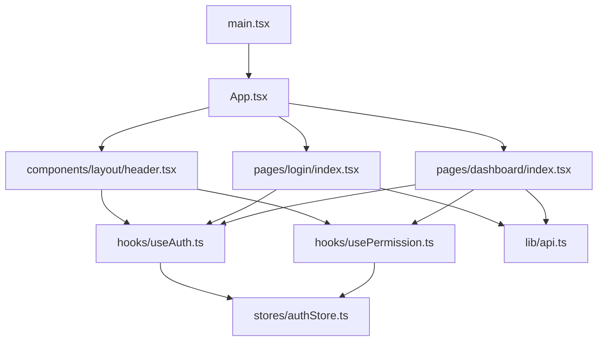
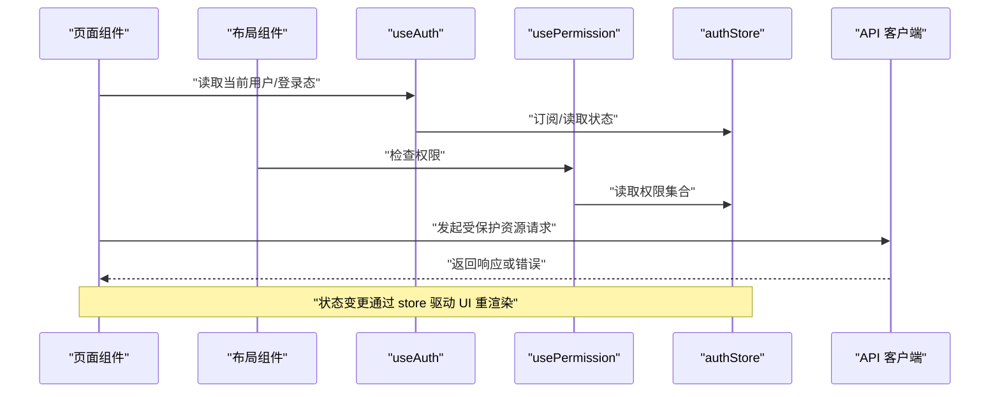
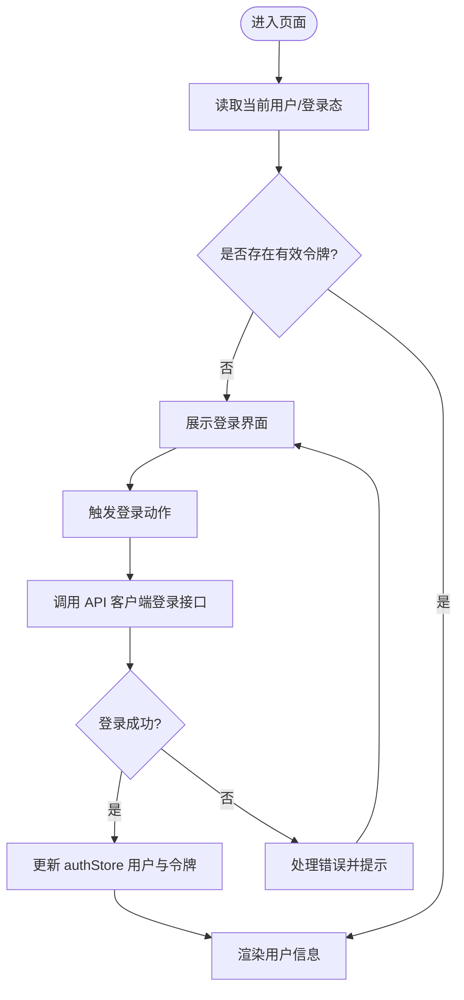
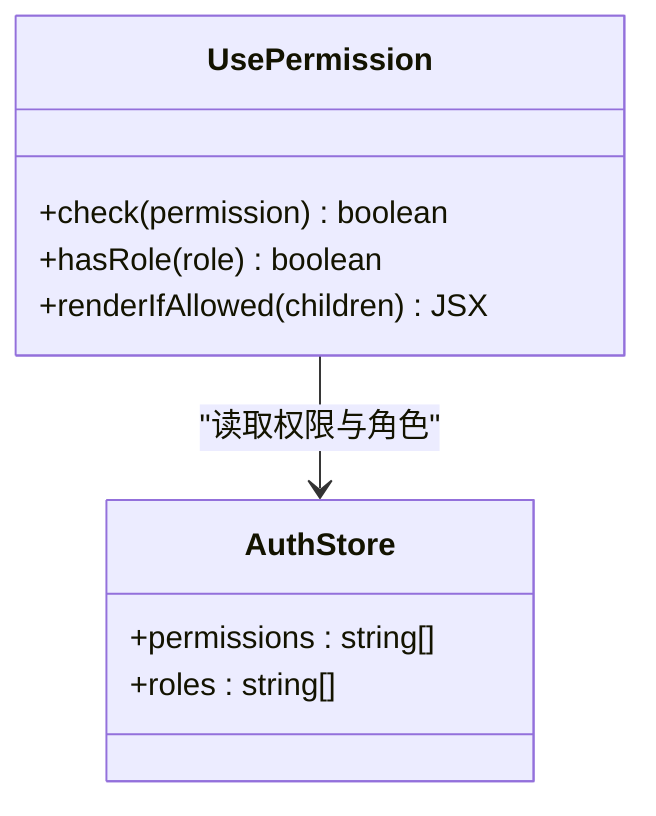
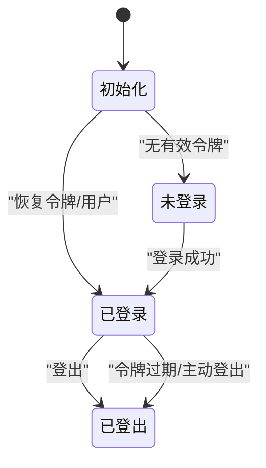
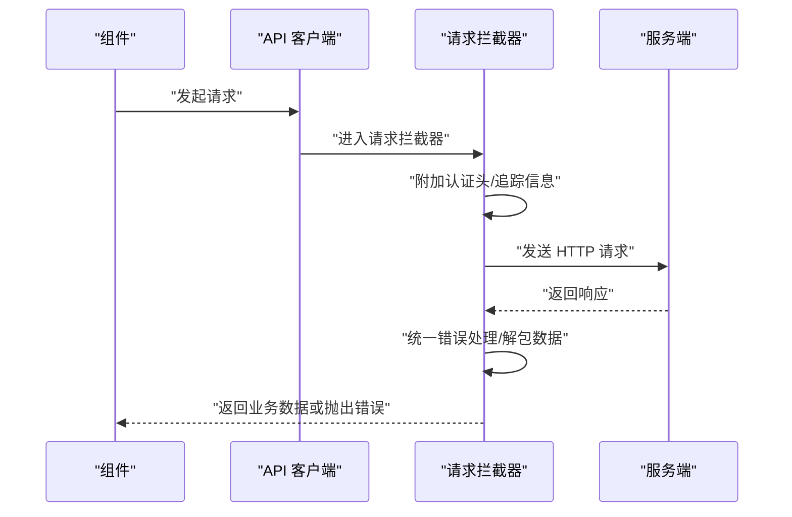
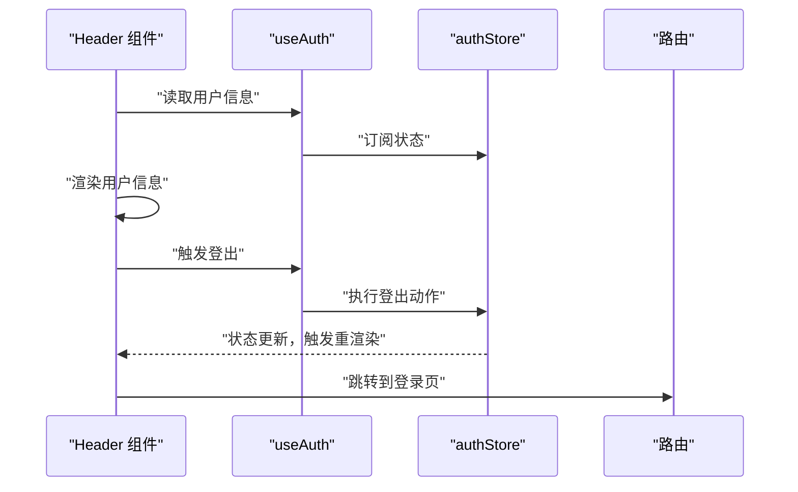
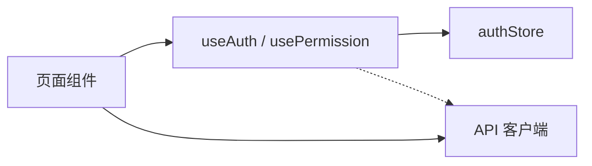

# 组件通信机制

<cite>
**本文引用的文件**   
- [useAuth.ts](file://web/src/hooks/useAuth.ts)
- [usePermission.ts](file://web/src/hooks/usePermission.ts)
- [authStore.ts](file://web/src/stores/authStore.ts)
- [api.ts](file://web/src/lib/api.ts)
- [main.tsx](file://web/src/main.tsx)
- [App.tsx](file://web/src/App.tsx)
- [header.tsx](file://web/src/components/layout/header.tsx)
- [require-permission.tsx](file://web/src/components/layout/require-permission.tsx)
- [login/index.tsx](file://web/src/pages/login/index.tsx)
- [dashboard/index.tsx](file://web/src/pages/dashboard/index.tsx)
</cite>

## 目录
1. [简介](#简介)
2. [项目结构](#项目结构)
3. [核心组件与通信模式](#核心组件与通信模式)
4. [架构总览](#架构总览)
5. [详细组件分析](#详细组件分析)
6. [依赖关系分析](#依赖关系分析)
7. [性能考虑](#性能考虑)
8. [故障排查指南](#故障排查指南)
9. [结论](#结论)
10. [附录](#附录)

## 简介
本文件聚焦 pj3 项目的组件通信机制，围绕 React 组件间数据传递、事件回调、上下文共享、状态提升与单向数据流原则展开。重点解析认证与权限相关能力：useAuth 与 usePermission 钩子实现原理与使用场景；authStore 状态管理架构（含持久化与同步）；API 客户端封装与请求拦截器；并提供最佳实践与性能优化建议，帮助读者构建可维护、可扩展且高性能的前端应用。

## 项目结构
本项目采用按功能域组织的前端结构，关键目录与职责如下：
- hooks：自定义 Hook，封装认证与权限逻辑（useAuth、usePermission）
- stores：全局状态存储（authStore）
- lib：通用工具与网络层封装（api.ts）
- components：UI 与布局组件（如 header、require-permission）
- pages：页面级组件（登录、仪表盘等）
- main.tsx / App.tsx：应用入口与根组件

图表来源
- [main.tsx](file://web/src/main.tsx)
- [App.tsx](file://web/src/App.tsx)
- [header.tsx](file://web/src/components/layout/header.tsx)
- [require-permission.tsx](file://web/src/components/layout/require-permission.tsx)
- [login/index.tsx](file://web/src/pages/login/index.tsx)
- [dashboard/index.tsx](file://web/src/pages/dashboard/index.tsx)
- [useAuth.ts](file://web/src/hooks/useAuth.ts)
- [usePermission.ts](file://web/src/hooks/usePermission.ts)
- [authStore.ts](file://web/src/stores/authStore.ts)
- [api.ts](file://web/src/lib/api.ts)

章节来源
- [main.tsx](file://web/src/main.tsx)
- [App.tsx](file://web/src/App.tsx)
- [header.tsx](file://web/src/components/layout/header.tsx)
- [require-permission.tsx](file://web/src/components/layout/require-permission.tsx)
- [login/index.tsx](file://web/src/pages/login/index.tsx)
- [dashboard/index.tsx](file://web/src/pages/dashboard/index.tsx)
- [useAuth.ts](file://web/src/hooks/useAuth.ts)
- [usePermission.ts](file://web/src/hooks/usePermission.ts)
- [authStore.ts](file://web/src/stores/authStore.ts)
- [api.ts](file://web/src/lib/api.ts)

## 核心组件与通信模式
- Props 传递
  - 父到子：通过 props 将用户信息、权限集合或操作回调传递给子组件，例如在布局或页面中向 header 或业务卡片传入当前用户与权限。
  - 子到父：通过回调函数（如 onClick、onSubmit）由子组件触发，父组件处理副作用并更新自身状态。
- 事件回调
  - 在表单提交、按钮点击等交互中，子组件仅负责发出事件，父组件集中处理副作用（如调用 API、更新 store）。
- 上下文共享
  - 对于跨层级频繁访问的数据（如当前用户、主题），可通过 React Context 提供与消费，减少 props 透传。
- 状态提升
  - 将多个兄弟组件共享的状态提升到最近的共同父组件或全局 store，保证单一数据源与可预测的更新路径。
- 单向数据流
  - 数据从顶层（store/context）流向 UI，UI 通过事件回调触发状态变更，避免双向绑定导致的复杂依赖。

章节来源
- [header.tsx](file://web/src/components/layout/header.tsx)
- [require-permission.tsx](file://web/src/components/layout/require-permission.tsx)
- [login/index.tsx](file://web/src/pages/login/index.tsx)
- [dashboard/index.tsx](file://web/src/pages/dashboard/index.tsx)

## 架构总览
下图展示了认证与权限相关的组件通信与数据流：页面与布局组件通过 useAuth/usePermission 获取认证与权限信息，authStore 作为唯一状态源，API 客户端负责与后端交互。

图表来源
- [useAuth.ts](file://web/src/hooks/useAuth.ts)
- [usePermission.ts](file://web/src/hooks/usePermission.ts)
- [authStore.ts](file://web/src/stores/authStore.ts)
- [api.ts](file://web/src/lib/api.ts)
- [header.tsx](file://web/src/components/layout/header.tsx)
- [dashboard/index.tsx](file://web/src/pages/dashboard/index.tsx)

## 详细组件分析

### useAuth 钩子
- 职责
  - 暴露当前用户信息与登录态，提供登录/登出方法。
  - 与 authStore 协作，读取与更新认证状态。
- 典型用法
  - 在页面或布局中读取用户信息以显示头像、用户名。
  - 在登录页调用登录方法，成功后跳转至受保护页面。
- 与 store 的关系
  - 通过订阅 authStore 的用户字段与 token 字段，确保 UI 随状态变化而更新。
- 错误处理
  - 对网络异常、令牌失效等情况进行统一提示与清理。

图表来源
- [useAuth.ts](file://web/src/hooks/useAuth.ts)
- [authStore.ts](file://web/src/stores/authStore.ts)
- [api.ts](file://web/src/lib/api.ts)
- [login/index.tsx](file://web/src/pages/login/index.tsx)

章节来源
- [useAuth.ts](file://web/src/hooks/useAuth.ts)
- [authStore.ts](file://web/src/stores/authStore.ts)
- [api.ts](file://web/src/lib/api.ts)
- [login/index.tsx](file://web/src/pages/login/index.tsx)

### usePermission 钩子
- 职责
  - 基于当前用户的权限集合判断是否具备某项权限或角色。
  - 为路由守卫、按钮显隐、菜单过滤等提供便捷方法。
- 典型用法
  - 在 require-permission 组件中包裹需要权限控制的区域。
  - 在页面内根据权限动态渲染不同内容或禁用操作。
- 与 store 的关系
  - 从 authStore 读取权限集合，结合本地规则进行判定。

图表来源
- [usePermission.ts](file://web/src/hooks/usePermission.ts)
- [authStore.ts](file://web/src/stores/authStore.ts)
- [require-permission.tsx](file://web/src/components/layout/require-permission.tsx)

章节来源
- [usePermission.ts](file://web/src/hooks/usePermission.ts)
- [authStore.ts](file://web/src/stores/authStore.ts)
- [require-permission.tsx](file://web/src/components/layout/require-permission.tsx)

### authStore 状态管理
- 设计要点
  - 单一状态源：集中管理用户信息、令牌、权限集合与加载状态。
  - 订阅与派发：组件通过 hook 订阅状态变化，触发更新时派发 action。
  - 持久化：将关键状态（如 token、用户基本信息）持久化到浏览器存储，保障刷新后恢复。
  - 同步机制：监听存储变化或在应用启动时初始化状态，确保多标签页一致性。
- 生命周期
  - 初始化：从持久化存储恢复状态。
  - 登录：更新用户与令牌，设置权限集合。
  - 登出：清空敏感状态，重置权限。
  - 刷新：监听存储事件或重新拉取最新状态。

图表来源
- [authStore.ts](file://web/src/stores/authStore.ts)

章节来源
- [authStore.ts](file://web/src/stores/authStore.ts)

### API 客户端封装与请求拦截器
- 封装模式
  - 统一 baseURL、超时、重试策略。
  - 自动附加认证头（token），并在响应中处理通用错误码。
- 请求拦截器
  - 在发送前注入鉴权信息、追踪 ID、时间戳等。
  - 针对特定错误（如 401）触发登出或刷新令牌流程。
- 响应拦截器
  - 统一解包业务数据、转换错误格式、记录日志。
  - 对分页、列表、详情等常见响应结构做适配。

图表来源
- [api.ts](file://web/src/lib/api.ts)
- [useAuth.ts](file://web/src/hooks/useAuth.ts)
- [authStore.ts](file://web/src/stores/authStore.ts)

章节来源
- [api.ts](file://web/src/lib/api.ts)
- [useAuth.ts](file://web/src/hooks/useAuth.ts)
- [authStore.ts](file://web/src/stores/authStore.ts)

### 布局与权限控制组件
- header 组件
  - 通过 useAuth 获取用户信息，展示头像与用户名。
  - 提供“退出”按钮，触发登出流程并跳转登录页。
- require-permission 组件
  - 基于 usePermission 判断权限，决定是否渲染子节点或降级展示。
  - 可与路由守卫配合，实现细粒度访问控制。

图表来源
- [header.tsx](file://web/src/components/layout/header.tsx)
- [useAuth.ts](file://web/src/hooks/useAuth.ts)
- [authStore.ts](file://web/src/stores/authStore.ts)
- [require-permission.tsx](file://web/src/components/layout/require-permission.tsx)

章节来源
- [header.tsx](file://web/src/components/layout/header.tsx)
- [require-permission.tsx](file://web/src/components/layout/require-permission.tsx)
- [useAuth.ts](file://web/src/hooks/useAuth.ts)
- [authStore.ts](file://web/src/stores/authStore.ts)

## 依赖关系分析
- 组件到 Hook
  - 页面与布局组件依赖 useAuth 与 usePermission，用于认证与权限判断。
- Hook 到 Store
  - useAuth 与 usePermission 均依赖 authStore 提供的状态与动作。
- 组件到 API
  - 页面组件直接调用 api.ts 中的封装方法，完成数据获取与提交。
- 潜在循环依赖
  - 应避免在 store 中反向引用组件或 Hook，保持单向依赖链。

图表来源
- [dashboard/index.tsx](file://web/src/pages/dashboard/index.tsx)
- [login/index.tsx](file://web/src/pages/login/index.tsx)
- [useAuth.ts](file://web/src/hooks/useAuth.ts)
- [usePermission.ts](file://web/src/hooks/usePermission.ts)
- [authStore.ts](file://web/src/stores/authStore.ts)
- [api.ts](file://web/src/lib/api.ts)

章节来源
- [dashboard/index.tsx](file://web/src/pages/dashboard/index.tsx)
- [login/index.tsx](file://web/src/pages/login/index.tsx)
- [useAuth.ts](file://web/src/hooks/useAuth.ts)
- [usePermission.ts](file://web/src/hooks/usePermission.ts)
- [authStore.ts](file://web/src/stores/authStore.ts)
- [api.ts](file://web/src/lib/api.ts)

## 性能考虑
- 避免不必要的重渲染
  - 使用 memo 包裹纯展示组件，减少因父组件更新导致的子树重渲染。
  - 拆分大对象为小片段，通过 props 精确传递所需字段。
  - 在 useAuth/usePermission 中只订阅必要字段，避免全量订阅导致频繁更新。
- 状态提升与局部状态
  - 将高频更新的局部状态保留在组件内部，避免污染全局 store。
  - 将跨组件共享的稳定数据放入 context 或 store，降低 props 透传成本。
- 请求与缓存
  - 对读多写少的数据使用缓存策略（如内存缓存或请求去重）。
  - 合理设置超时与重试，避免雪崩效应。
- 懒加载与代码分割
  - 对非首屏页面与重型组件进行按需加载，缩短首屏时间。
- 权限计算优化
  - 将权限判定结果缓存，避免重复计算。
  - 在 require-permission 中使用稳定比较函数，防止无效渲染。

[本节为通用指导，不直接分析具体文件]

## 故障排查指南
- 登录失败
  - 检查 API 客户端的错误拦截器是否正确处理 401/403。
  - 确认 useAuth 的登录流程是否成功更新 authStore 并持久化令牌。
- 权限不生效
  - 核对 usePermission 的权限集合是否与后端一致。
  - 检查 require-permission 的包裹范围是否正确。
- 状态不同步
  - 验证 authStore 的持久化与同步机制是否正常工作（如 localStorage 事件监听）。
  - 在多标签页场景下，确认状态广播与恢复逻辑。
- 性能问题
  - 使用浏览器性能面板定位重渲染热点。
  - 检查是否有大对象或函数在每次渲染中创建，导致子组件无法复用。

章节来源
- [api.ts](file://web/src/lib/api.ts)
- [useAuth.ts](file://web/src/hooks/useAuth.ts)
- [usePermission.ts](file://web/src/hooks/usePermission.ts)
- [authStore.ts](file://web/src/stores/authStore.ts)
- [require-permission.tsx](file://web/src/components/layout/require-permission.tsx)

## 结论
pj3 的组件通信遵循单向数据流与状态提升原则，通过 useAuth 与 usePermission 将认证与权限逻辑抽象为可复用的 Hook，authStore 作为单一状态源提供持久化与同步能力，API 客户端封装统一了请求与错误处理。该架构清晰、可扩展，便于在不同页面与布局中复用认证与权限能力。结合 memo、缓存与懒加载等优化手段，可进一步提升性能与用户体验。

[本节为总结性内容，不直接分析具体文件]

## 附录
- 最佳实践清单
  - 明确数据边界：尽量让最小必要组件持有状态。
  - 事件冒泡：子组件只发事件，父组件处理副作用。
  - 权限优先：在路由与组件层双重校验，确保安全。
  - 错误归一：在 API 层统一错误格式，便于前端处理。
  - 可观测性：为关键流程添加日志与埋点，便于定位问题。

[本节为通用指导，不直接分析具体文件]