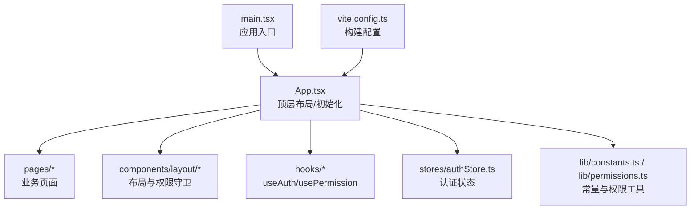
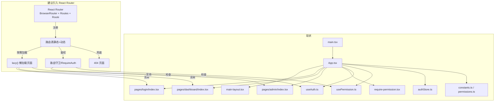
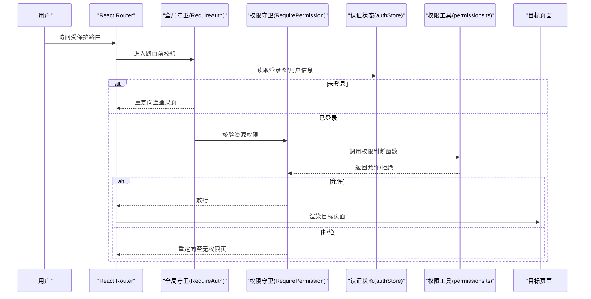
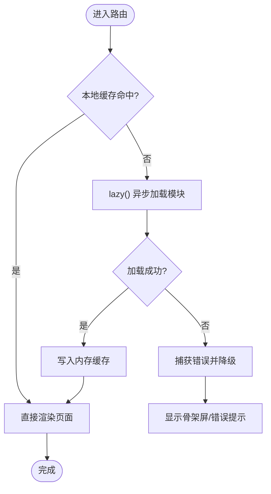
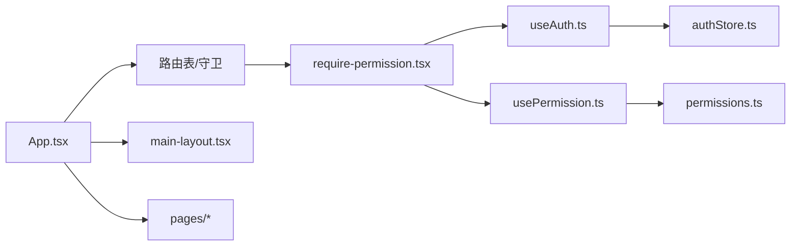

# 路由设计

<cite>
**本文引用的文件**   
- [web/src/main.tsx](file://web/src/main.tsx)
- [web/src/App.tsx](file://web/src/App.tsx)
- [web/src/pages/login/index.tsx](file://web/src/pages/login/index.tsx)
- [web/src/pages/dashboard/index.tsx](file://web/src/pages/dashboard/index.tsx)
- [web/src/pages/admin/index.tsx](file://web/src/pages/admin/index.tsx)
- [web/src/components/layout/main-layout.tsx](file://web/src/components/layout/main-layout.tsx)
- [web/src/components/layout/require-permission.tsx](file://web/src/components/layout/require-permission.tsx)
- [web/src/hooks/useAuth.ts](file://web/src/hooks/useAuth.ts)
- [web/src/hooks/usePermission.ts](file://web/src/hooks/usePermission.ts)
- [web/src/stores/authStore.ts](file://web/src/stores/authStore.ts)
- [web/src/lib/constants.ts](file://web/src/lib/constants.ts)
- [web/src/lib/permissions.ts](file://web/src/lib/permissions.ts)
- [web/vite.config.ts](file://web/vite.config.ts)
</cite>

## 目录
1. [简介](#简介)
2. [项目结构](#项目结构)
3. [核心组件](#核心组件)
4. [架构总览](#架构总览)
5. [详细组件分析](#详细组件分析)
6. [依赖分析](#依赖分析)
7. [性能考虑](#性能考虑)
8. [故障排查指南](#故障排查指南)
9. [结论](#结论)
10. [附录](#附录)

## 简介
本文件面向 pj3 项目的路由架构设计与实现，聚焦以下目标：
- React Router 的路由配置与组织方式（含嵌套路由、动态路由、参数处理）
- 基于角色的访问控制（RBAC）的路由守卫与权限校验
- 懒加载与代码分割策略，优化大型应用首屏与导航性能
- 路由与权限系统的集成方案（动态路由生成、菜单权限控制）
- 404 页面与路由错误边界的设计
- 路由性能优化技巧（预加载、缓存等）
- 提供用户导航与权限验证的完整流程图

说明：当前仓库未包含显式的 React Router 配置文件。本文在“现状”与“建议”两部分分别阐述现有入口与组件职责，并给出可落地的路由设计方案与最佳实践。

## 项目结构
前端工程位于 web 子目录，采用 Vite + React + TypeScript 技术栈。关键目录与职责如下：
- src/main.tsx：应用启动入口，负责挂载根组件与全局样式
- src/App.tsx：顶层布局与全局状态初始化
- src/pages/*：按功能域划分的页面模块（登录、仪表盘、管理后台等）
- src/components/layout/*：通用布局与权限守卫组件
- src/hooks/*：认证与权限相关 Hook
- src/stores/*：全局状态存储（如认证状态）
- src/lib/*：常量、权限工具函数等
- vite.config.ts：构建与开发服务器配置（可用于路由相关的构建优化）

图表来源
- [web/src/main.tsx](file://web/src/main.tsx)
- [web/src/App.tsx](file://web/src/App.tsx)
- [web/src/components/layout/main-layout.tsx](file://web/src/components/layout/main-layout.tsx)
- [web/src/hooks/useAuth.ts](file://web/src/hooks/useAuth.ts)
- [web/src/hooks/usePermission.ts](file://web/src/hooks/usePermission.ts)
- [web/src/stores/authStore.ts](file://web/src/stores/authStore.ts)
- [web/src/lib/constants.ts](file://web/src/lib/constants.ts)
- [web/src/lib/permissions.ts](file://web/src/lib/permissions.ts)
- [web/vite.config.ts](file://web/vite.config.ts)

章节来源
- [web/src/main.tsx](file://web/src/main.tsx)
- [web/src/App.tsx](file://web/src/App.tsx)
- [web/vite.config.ts](file://web/vite.config.ts)

## 核心组件
- 应用入口与顶层布局
  - main.tsx：负责创建 React 根节点并挂载到 DOM，通常在此处引入全局样式与必要的 Provider
  - App.tsx：承载全局布局与初始化逻辑，后续可在其中集中定义路由表与路由守卫
- 布局与权限守卫
  - main-layout.tsx：主布局容器，用于包裹受保护页面，统一侧边栏、头部与内容区
  - require-permission.tsx：权限守卫组件，根据角色/权限判定是否渲染目标组件或重定向至无权限页
- 认证与权限 Hook
  - useAuth.ts：封装登录态、用户信息、登出动作等
  - usePermission.ts：封装权限判断逻辑（如角色集合、资源权限）
- 认证状态存储
  - authStore.ts：集中管理认证与权限数据，供多组件共享
- 权限工具与常量
  - constants.ts：系统常量（如默认角色、路由白名单等）
  - permissions.ts：权限计算与匹配工具函数

章节来源
- [web/src/main.tsx](file://web/src/main.tsx)
- [web/src/App.tsx](file://web/src/App.tsx)
- [web/src/components/layout/main-layout.tsx](file://web/src/components/layout/main-layout.tsx)
- [web/src/components/layout/require-permission.tsx](file://web/src/components/layout/require-permission.tsx)
- [web/src/hooks/useAuth.ts](file://web/src/hooks/useAuth.ts)
- [web/src/hooks/usePermission.ts](file://web/src/hooks/usePermission.ts)
- [web/src/stores/authStore.ts](file://web/src/stores/authStore.ts)
- [web/src/lib/constants.ts](file://web/src/lib/constants.ts)
- [web/src/lib/permissions.ts](file://web/src/lib/permissions.ts)

## 架构总览
下图展示“现状”与“建议”的双层视图：现状以现有入口与组件为主；建议在 App.tsx 中引入 React Router，并通过懒加载与权限守卫实现 RBAC 路由保护。

图表来源
- [web/src/main.tsx](file://web/src/main.tsx)
- [web/src/App.tsx](file://web/src/App.tsx)
- [web/src/components/layout/main-layout.tsx](file://web/src/components/layout/main-layout.tsx)
- [web/src/components/layout/require-permission.tsx](file://web/src/components/layout/require-permission.tsx)
- [web/src/hooks/useAuth.ts](file://web/src/hooks/useAuth.ts)
- [web/src/hooks/usePermission.ts](file://web/src/hooks/usePermission.ts)
- [web/src/stores/authStore.ts](file://web/src/stores/authStore.ts)
- [web/src/lib/constants.ts](file://web/src/lib/constants.ts)
- [web/src/lib/permissions.ts](file://web/src/lib/permissions.ts)

## 详细组件分析

### 路由配置与组织方式（建议方案）
- 路由表结构
  - 将路由分为公共路由（登录、注册、404）与受保护路由（仪表盘、管理后台等）
  - 支持嵌套路由：例如 admin 下再分多个子路由（报表、库存、交易等），通过 children 字段组织
  - 支持动态路由：使用占位符（如 :id）并在页面内通过路由参数 Hook 获取
- 路由参数处理
  - 路径参数：通过 useParams 获取
  - 查询参数：通过 useSearchParams 获取
  - 状态传递：通过 useLocation.state 传递一次性状态
- 路由元信息
  - 为每个路由附加元信息（标题、图标、所需角色/权限、是否在菜单显示等），便于统一渲染菜单与权限校验

章节来源
- [web/src/App.tsx](file://web/src/App.tsx)
- [web/src/pages/admin/index.tsx](file://web/src/pages/admin/index.tsx)
- [web/src/pages/dashboard/index.tsx](file://web/src/pages/dashboard/index.tsx)
- [web/src/pages/login/index.tsx](file://web/src/pages/login/index.tsx)

### 嵌套路由与动态路由（建议方案）
- 嵌套路由
  - 父路由负责布局（侧边栏、面包屑等），子路由负责具体页面内容
  - 通过 Outlet 渲染子路由内容，避免重复布局
- 动态路由
  - 使用 :param 形式声明动态段，页面内通过参数 Hook 读取
  - 对动态路由进行权限校验时，可结合资源 ID 做细粒度授权

章节来源
- [web/src/components/layout/main-layout.tsx](file://web/src/components/layout/main-layout.tsx)
- [web/src/pages/admin/index.tsx](file://web/src/pages/admin/index.tsx)

### 路由守卫与 RBAC（建议方案）
- 守卫层级
  - 路由级守卫：在进入路由前校验登录态与角色/权限，不满足则重定向至登录或无权限页
  - 组件级守卫：在页面内部针对特定操作或区块进行二次校验
- 角色与权限模型
  - 角色（Role）：如 admin、operator、viewer
  - 权限（Permission）：如 resource:action 格式，或基于菜单项标识
- 实现要点
  - RequireAuth：校验登录态与基础角色
  - RequirePermission：校验资源级权限
  - 路由元信息与权限工具函数配合，实现声明式权限控制

图表来源
- [web/src/components/layout/require-permission.tsx](file://web/src/components/layout/require-permission.tsx)
- [web/src/hooks/useAuth.ts](file://web/src/hooks/useAuth.ts)
- [web/src/hooks/usePermission.ts](file://web/src/hooks/usePermission.ts)
- [web/src/stores/authStore.ts](file://web/src/stores/authStore.ts)
- [web/src/lib/permissions.ts](file://web/src/lib/permissions.ts)

章节来源
- [web/src/components/layout/require-permission.tsx](file://web/src/components/layout/require-permission.tsx)
- [web/src/hooks/useAuth.ts](file://web/src/hooks/useAuth.ts)
- [web/src/hooks/usePermission.ts](file://web/src/hooks/usePermission.ts)
- [web/src/stores/authStore.ts](file://web/src/stores/authStore.ts)
- [web/src/lib/permissions.ts](file://web/src/lib/permissions.ts)

### 懒加载与代码分割（建议方案）
- 使用 lazy() 对页面组件进行按需加载，减少首屏体积
- 结合 Suspense 与 fallback 提升用户体验
- 对第三方大依赖进行分包，避免阻塞主包
- 利用 Vite 的预构建与按需导入特性，进一步降低打包体积

图表来源
- [web/vite.config.ts](file://web/vite.config.ts)

章节来源
- [web/vite.config.ts](file://web/vite.config.ts)

### 路由与权限系统集成（建议方案）
- 动态路由生成
  - 从后端或本地配置拉取菜单与路由元信息，过滤出当前用户可见的路由
  - 将不可见路由从路由表中剔除，避免前端硬编码
- 菜单权限控制
  - 菜单渲染与路由表同源，确保导航与路由一致
  - 对隐藏路由仍保留守卫，防止通过 URL 直接访问

章节来源
- [web/src/lib/constants.ts](file://web/src/lib/constants.ts)
- [web/src/lib/permissions.ts](file://web/src/lib/permissions.ts)

### 404 页面与路由错误边界（建议方案）
- 404 页面
  - 在路由表末尾添加通配符路由，指向 404 页面
  - 对于嵌套路由，确保子路由不存在时也回退到 404
- 路由错误边界
  - 使用错误边界组件捕获渲染异常，避免整应用崩溃
  - 对懒加载失败进行友好提示与重试机制

章节来源
- [web/src/App.tsx](file://web/src/App.tsx)

## 依赖分析
- 组件耦合关系
  - App.tsx 作为顶层编排者，聚合布局、路由、权限与页面
  - 路由守卫依赖认证与权限 Hook，Hook 依赖认证状态存储
  - 权限工具与常量被多处复用，保证一致性
- 外部依赖
  - React Router（建议引入）：提供路由能力
  - Vite：提供构建与开发体验优化

图表来源
- [web/src/App.tsx](file://web/src/App.tsx)
- [web/src/components/layout/require-permission.tsx](file://web/src/components/layout/require-permission.tsx)
- [web/src/hooks/useAuth.ts](file://web/src/hooks/useAuth.ts)
- [web/src/hooks/usePermission.ts](file://web/src/hooks/usePermission.ts)
- [web/src/stores/authStore.ts](file://web/src/stores/authStore.ts)
- [web/src/lib/permissions.ts](file://web/src/lib/permissions.ts)

章节来源
- [web/src/App.tsx](file://web/src/App.tsx)
- [web/src/components/layout/require-permission.tsx](file://web/src/components/layout/require-permission.tsx)
- [web/src/hooks/useAuth.ts](file://web/src/hooks/useAuth.ts)
- [web/src/hooks/usePermission.ts](file://web/src/hooks/usePermission.ts)
- [web/src/stores/authStore.ts](file://web/src/stores/authStore.ts)
- [web/src/lib/permissions.ts](file://web/src/lib/permissions.ts)

## 性能考虑
- 首屏优化
  - 仅加载必要路由与组件，其余使用懒加载
  - 对第三方库进行分包与按需引入
- 导航性能
  - 对热点页面启用内存缓存，避免重复请求
  - 对频繁切换的子路由进行预取
- 构建优化
  - 合理拆分 chunk，避免单包过大
  - 开启生产环境压缩与 Tree Shaking
- 运行时优化
  - 使用 Suspense 与骨架屏提升感知性能
  - 对长列表与大数据量页面采用虚拟滚动与分页

[本节为通用指导，无需源码引用]

## 故障排查指南
- 常见路由问题
  - 404 无法命中：检查通配符路由位置与嵌套路由的 Outlet 是否正确
  - 动态参数为空：确认路径占位符与页面内参数读取一致
  - 权限拦截误判：核对角色/权限映射与路由元信息
- 调试建议
  - 在守卫中打印关键状态（登录态、角色、权限结果）
  - 使用浏览器网络面板查看懒加载模块是否成功加载
  - 对懒加载失败增加重试与错误上报

章节来源
- [web/src/components/layout/require-permission.tsx](file://web/src/components/layout/require-permission.tsx)
- [web/src/hooks/useAuth.ts](file://web/src/hooks/useAuth.ts)
- [web/src/hooks/usePermission.ts](file://web/src/hooks/usePermission.ts)

## 结论
- 现状：当前仓库未包含显式路由配置，但已具备完善的布局、权限与认证基础设施
- 建议：在 App.tsx 中引入 React Router，采用“路由表 + 懒加载 + 守卫”的模式，结合 RBAC 实现声明式权限控制
- 收益：清晰的架构、更好的可维护性与可扩展性，以及更优的首屏与导航性能

[本节为总结性内容，无需源码引用]

## 附录
- 术语
  - RBAC：基于角色的访问控制
  - 懒加载：按需加载模块，减少初始体积
  - 代码分割：将应用拆分为多个可独立加载的包
- 参考文件
  - 入口与布局：[web/src/main.tsx](file://web/src/main.tsx)、[web/src/App.tsx](file://web/src/App.tsx)、[web/src/components/layout/main-layout.tsx](file://web/src/components/layout/main-layout.tsx)
  - 权限与认证：[web/src/components/layout/require-permission.tsx](file://web/src/components/layout/require-permission.tsx)、[web/src/hooks/useAuth.ts](file://web/src/hooks/useAuth.ts)、[web/src/hooks/usePermission.ts](file://web/src/hooks/usePermission.ts)、[web/src/stores/authStore.ts](file://web/src/stores/authStore.ts)
  - 工具与常量：[web/src/lib/permissions.ts](file://web/src/lib/permissions.ts)、[web/src/lib/constants.ts](file://web/src/lib/constants.ts)
  - 构建配置：[web/vite.config.ts](file://web/vite.config.ts)