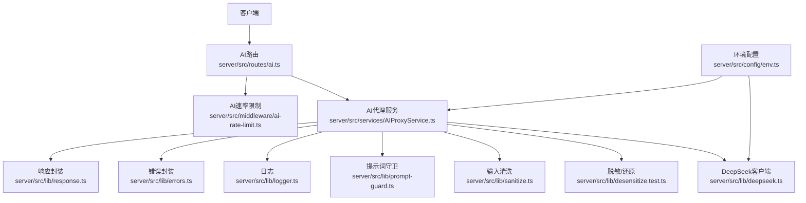
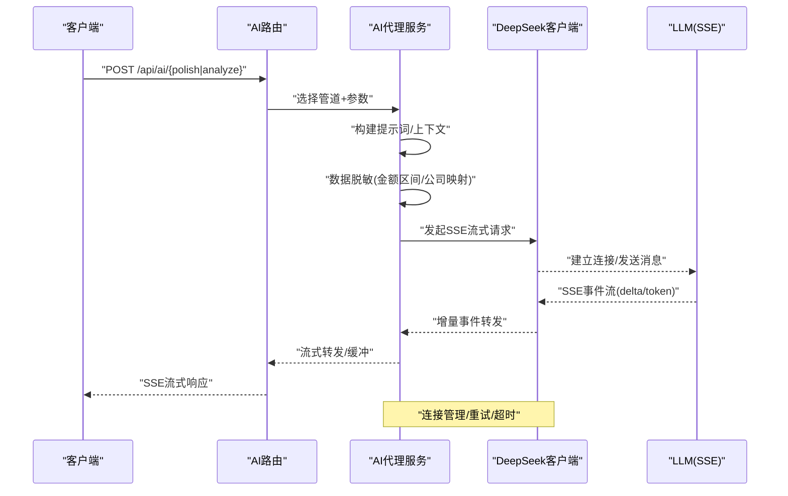
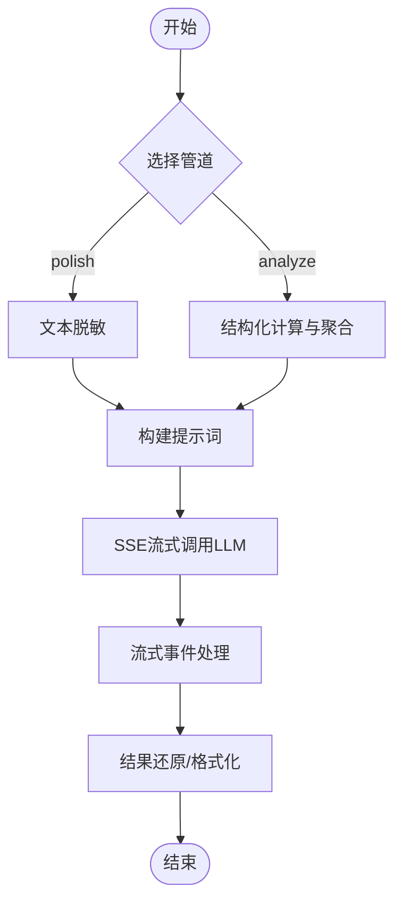
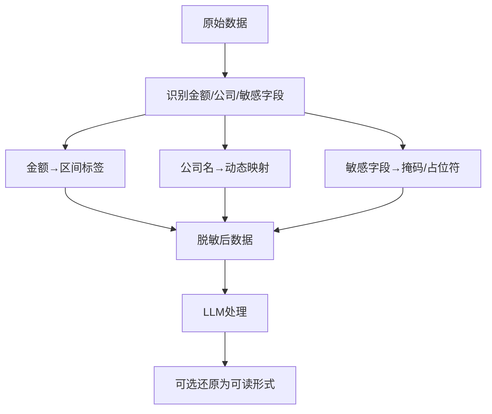
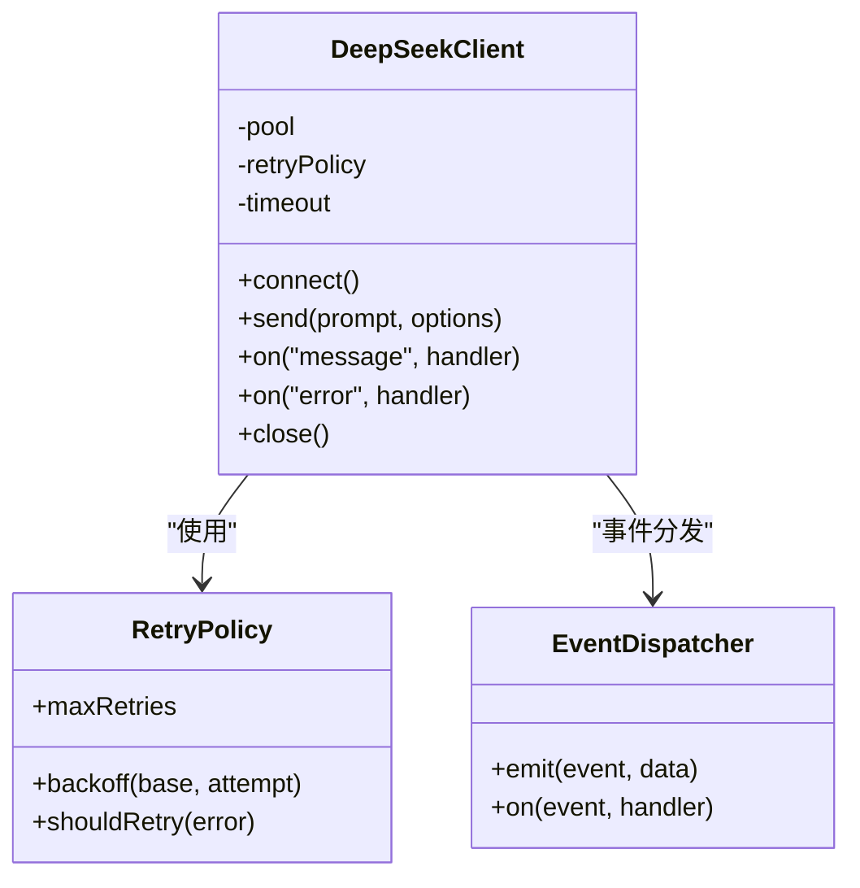
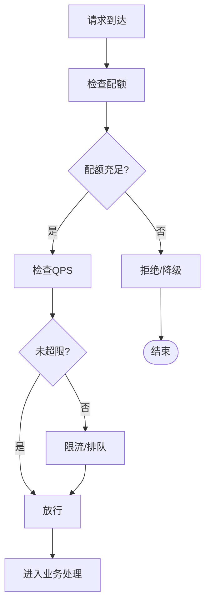
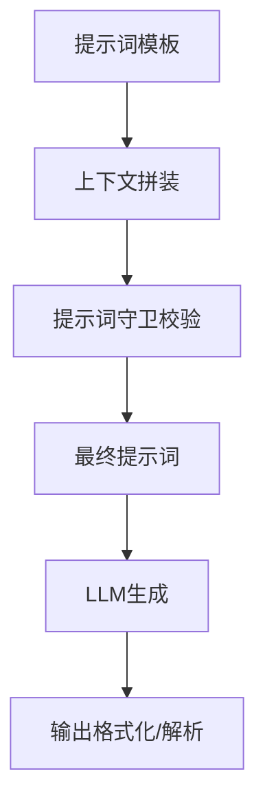
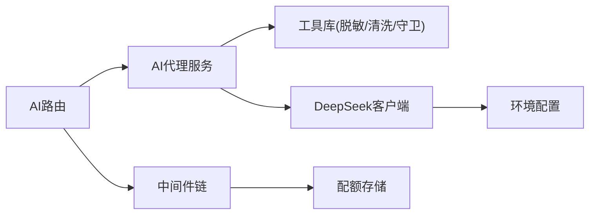

# AI分析功能

<cite>
**本文引用的文件**   
- [server/src/routes/ai.ts](file://server/src/routes/ai.ts)
- [server/src/services/AIProxyService.ts](file://server/src/services/AIProxyService.ts)
- [server/src/lib/deepseek.ts](file://server/src/lib/deepseek.ts)
- [server/src/middleware/ai-rate-limit.ts](file://server/src/middleware/ai-rate-limit.ts)
- [server/src/lib/desensitize.test.ts](file://server/src/lib/desensitize.test.ts)
- [server/src/lib/sanitize.ts](file://server/src/lib/sanitize.ts)
- [server/src/lib/prompt-guard.ts](file://server/src/lib/prompt-guard.ts)
- [server/src/config/env.ts](file://server/src/config/env.ts)
- [server/src/lib/logger.ts](file://server/src/lib/logger.ts)
- [server/src/lib/errors.ts](file://server/src/lib/errors.ts)
- [server/src/lib/response.ts](file://server/src/lib/response.ts)
- [server/scripts/ai-pipeline-smoke.ts](file://server/scripts/ai-pipeline-smoke.ts)
- [server/scripts/ai-http-live.ts](file://server/scripts/ai-http-live.ts)
</cite>

## 目录
1. [简介](#简介)
2. [项目结构](#项目结构)
3. [核心组件](#核心组件)
4. [架构总览](#架构总览)
5. [详细组件分析](#详细组件分析)
6. [依赖关系分析](#依赖关系分析)
7. [性能与成本](#性能与成本)
8. [故障排查指南](#故障排查指南)
9. [结论](#结论)
10. [附录：使用示例与提示词工程](#附录使用示例与提示词工程)

## 简介
本文件面向“AI分析功能”的完整技术文档，聚焦双管道架构（polish文本润色、analyze结构化分析）、数据脱敏机制、DeepSeek API集成（SSE流式、连接管理、错误重试）、速率限制策略、提示词工程模板与上下文构建、以及完整的端到端使用示例。同时提供性能监控、成本控制与故障排查建议，帮助开发者快速落地并稳定运行。

## 项目结构
AI相关能力主要分布在以下模块：
- 路由层：对外暴露AI接口，统一鉴权、限流、审计等中间件链后进入业务处理
- 服务层：封装AI代理、请求编排、结果解析与还原
- 工具库：DeepSeek客户端、脱敏、提示词守卫、日志、错误与响应封装
- 配置与环境：API密钥、模型参数、超时与重试策略
- 脚本：冒烟测试与HTTP联调脚本

**图表来源** 
- [server/src/routes/ai.ts](file://server/src/routes/ai.ts)
- [server/src/middleware/ai-rate-limit.ts](file://server/src/middleware/ai-rate-limit.ts)
- [server/src/services/AIProxyService.ts](file://server/src/services/AIProxyService.ts)
- [server/src/lib/deepseek.ts](file://server/src/lib/deepseek.ts)
- [server/src/lib/desensitize.test.ts](file://server/src/lib/desensitize.test.ts)
- [server/src/lib/sanitize.ts](file://server/src/lib/sanitize.ts)
- [server/src/lib/prompt-guard.ts](file://server/src/lib/prompt-guard.ts)
- [server/src/config/env.ts](file://server/src/config/env.ts)
- [server/src/lib/logger.ts](file://server/src/lib/logger.ts)
- [server/src/lib/errors.ts](file://server/src/lib/errors.ts)
- [server/src/lib/response.ts](file://server/src/lib/response.ts)

**章节来源**
- [server/src/routes/ai.ts](file://server/src/routes/ai.ts)
- [server/src/services/AIProxyService.ts](file://server/src/services/AIProxyService.ts)
- [server/src/lib/deepseek.ts](file://server/src/lib/deepseek.ts)
- [server/src/middleware/ai-rate-limit.ts](file://server/src/middleware/ai-rate-limit.ts)
- [server/src/config/env.ts](file://server/src/config/env.ts)

## 核心组件
- AI路由：接收请求、校验参数、选择管道（polish/analyze），调用代理服务并返回流式或一次性响应
- AI代理服务：编排提示词构建、数据脱敏、LLM调用、结果解析与还原、指标计算与格式化
- DeepSeek客户端：封装SSE流式调用、连接池、超时与重试、事件分发
- 脱敏与还原：金额区间化、公司名动态映射、敏感字段保护
- 提示词守卫：白名单校验、注入防护、输出格式约束
- 速率限制：按用户/IP/租户维度控制QPS与配额，支持降级
- 日志与错误：结构化日志、错误码与可观测性埋点
- 响应封装：统一成功/失败结构与分页/流式兼容

**章节来源**
- [server/src/routes/ai.ts](file://server/src/routes/ai.ts)
- [server/src/services/AIProxyService.ts](file://server/src/services/AIProxyService.ts)
- [server/src/lib/deepseek.ts](file://server/src/lib/deepseek.ts)
- [server/src/lib/desensitize.test.ts](file://server/src/lib/desensitize.test.ts)
- [server/src/lib/prompt-guard.ts](file://server/src/lib/prompt-guard.ts)
- [server/src/middleware/ai-rate-limit.ts](file://server/src/middleware/ai-rate-limit.ts)
- [server/src/lib/logger.ts](file://server/src/lib/logger.ts)
- [server/src/lib/errors.ts](file://server/src/lib/errors.ts)
- [server/src/lib/response.ts](file://server/src/lib/response.ts)

## 架构总览
双管道架构说明：
- polish管道（文本润色）：输入为自然语言文本，经脱敏→提示词组装→LLM流式生成→还原→输出
- analyze管道（结构化分析）：输入为结构化数据（如指标表/时间序列），后端先进行计算与聚合→脱敏→提示词组装→LLM流式生成→结构化还原→输出

**图表来源** 
- [server/src/routes/ai.ts](file://server/src/routes/ai.ts)
- [server/src/services/AIProxyService.ts](file://server/src/services/AIProxyService.ts)
- [server/src/lib/deepseek.ts](file://server/src/lib/deepseek.ts)

## 详细组件分析

### 双管道处理流程
- polish管道
  - 输入：原始文本
  - 步骤：脱敏→提示词组装（角色/任务/约束/输出格式）→SSE流式生成→还原→返回
- analyze管道
  - 输入：结构化数据（指标、时间维度、公司维度等）
  - 步骤：计算与聚合（同比/环比/累计）→脱敏→提示词组装（含数据摘要/约束）→SSE流式生成→结构化还原→返回

**图表来源** 
- [server/src/services/AIProxyService.ts](file://server/src/services/AIProxyService.ts)
- [server/src/lib/desensitize.test.ts](file://server/src/lib/desensitize.test.ts)
- [server/src/lib/prompt-guard.ts](file://server/src/lib/prompt-guard.ts)

**章节来源**
- [server/src/services/AIProxyService.ts](file://server/src/services/AIProxyService.ts)
- [server/src/lib/desensitize.test.ts](file://server/src/lib/desensitize.test.ts)
- [server/src/lib/prompt-guard.ts](file://server/src/lib/prompt-guard.ts)

### 数据脱敏机制
- 金额区间化处理：将绝对金额替换为区间标签（如“小于X万”、“X~Y万”、“大于Y万”），避免泄露具体数值
- 公司名动态映射：根据上下文或配置将真实公司名映射为占位符或别名，防止敏感实体暴露
- 敏感信息保护：对手机号、邮箱、身份证号等模式进行识别与替换；保留必要元数据用于还原
- 还原策略：在LLM输出阶段，依据占位符映射表还原为可读内容（可选）

**图表来源** 
- [server/src/lib/desensitize.test.ts](file://server/src/lib/desensitize.test.ts)
- [server/src/lib/sanitize.ts](file://server/src/lib/sanitize.ts)

**章节来源**
- [server/src/lib/desensitize.test.ts](file://server/src/lib/desensitize.test.ts)
- [server/src/lib/sanitize.ts](file://server/src/lib/sanitize.ts)

### DeepSeek API集成
- SSE流式响应：基于Server-Sent Events实现增量token推送，降低首屏延迟
- 连接管理：连接池、心跳检测、断线重连、超时控制
- 错误重试：指数退避、最大重试次数、熔断与降级
- 事件分发：将SSE事件转换为内部事件流，供上层消费与转发

**图表来源** 
- [server/src/lib/deepseek.ts](file://server/src/lib/deepseek.ts)

**章节来源**
- [server/src/lib/deepseek.ts](file://server/src/lib/deepseek.ts)

### 速率限制策略
- 频率控制：按用户/IP/租户维度设置QPS上限，超限返回429
- 配额管理：每日/每小时调用配额，达到阈值后拒绝或降级
- 降级处理：当上游不可用或配额耗尽时，返回缓存结果或简化版分析

**图表来源** 
- [server/src/middleware/ai-rate-limit.ts](file://server/src/middleware/ai-rate-limit.ts)

**章节来源**
- [server/src/middleware/ai-rate-limit.ts](file://server/src/middleware/ai-rate-limit.ts)

### 提示词工程
- 模板设计：角色设定、任务描述、约束条件、输出格式（JSON/Markdown）
- 上下文构建：数据摘要、关键指标、时间窗口、对比基准
- 输出格式化：强制结构化输出，便于后端解析与渲染
- 安全加固：提示词注入防护、白名单算子、敏感词过滤

**图表来源** 
- [server/src/lib/prompt-guard.ts](file://server/src/lib/prompt-guard.ts)
- [server/src/services/AIProxyService.ts](file://server/src/services/AIProxyService.ts)

**章节来源**
- [server/src/lib/prompt-guard.ts](file://server/src/lib/prompt-guard.ts)
- [server/src/services/AIProxyService.ts](file://server/src/services/AIProxyService.ts)

## 依赖关系分析
- 路由依赖中间件（鉴权、权限、范围、软删除、审计）与服务层
- 服务层依赖工具库（脱敏、清洗、提示词守卫、日志、错误、响应）
- DeepSeek客户端依赖配置与环境变量
- 速率限制中间件依赖存储（内存/Redis）记录配额与计数

**图表来源** 
- [server/src/routes/ai.ts](file://server/src/routes/ai.ts)
- [server/src/services/AIProxyService.ts](file://server/src/services/AIProxyService.ts)
- [server/src/lib/deepseek.ts](file://server/src/lib/deepseek.ts)
- [server/src/config/env.ts](file://server/src/config/env.ts)
- [server/src/middleware/ai-rate-limit.ts](file://server/src/middleware/ai-rate-limit.ts)

**章节来源**
- [server/src/routes/ai.ts](file://server/src/routes/ai.ts)
- [server/src/services/AIProxyService.ts](file://server/src/services/AIProxyService.ts)
- [server/src/lib/deepseek.ts](file://server/src/lib/deepseek.ts)
- [server/src/config/env.ts](file://server/src/config/env.ts)
- [server/src/middleware/ai-rate-limit.ts](file://server/src/middleware/ai-rate-limit.ts)

## 性能与成本
- 流式传输：SSE减少首字节延迟，提升用户体验
- 批量化与缓存：对重复查询结果进行短期缓存，降低LLM调用成本
- 并发控制：限制并发请求数，避免资源争用
- 成本优化：精简上下文长度、选择性字段、按需启用高级模型
- 监控指标：QPS、延迟分布、错误率、Token用量、费用统计

[本节为通用指导，不直接分析具体文件]

## 故障排查指南
- 常见问题
  - SSE连接失败：检查网络、代理、超时配置
  - 令牌耗尽：检查配额与速率限制策略
  - 输出解析失败：检查提示词约束与输出格式
  - 脱敏还原异常：检查映射表与占位符一致性
- 诊断步骤
  - 查看结构化日志与错误码
  - 复现最小用例，逐步定位
  - 启用调试模式，捕获SSE事件流
- 恢复策略
  - 自动重试与降级
  - 熔断与隔离
  - 回滚到缓存或默认结果

**章节来源**
- [server/src/lib/logger.ts](file://server/src/lib/logger.ts)
- [server/src/lib/errors.ts](file://server/src/lib/errors.ts)
- [server/src/lib/response.ts](file://server/src/lib/response.ts)

## 结论
本AI分析功能通过双管道架构实现了灵活的文本润色与结构化分析能力，结合严格的脱敏机制、稳定的SSE流式集成、完善的速率限制与提示词工程，确保安全性、可用性与可观测性。配合性能监控与成本控制策略，可在生产环境中稳定运行。

[本节为总结性内容，不直接分析具体文件]

## 附录：使用示例与提示词工程

### 端到端使用示例
- polish管道示例
  - 场景：将原始财务说明文本润色为管理层可读报告
  - 输入：原始文本
  - 处理：脱敏→提示词组装→SSE流式生成→还原
  - 输出：结构化段落/要点
- analyze管道示例
  - 场景：月度经营指标分析
  - 输入：指标表（收入、成本、利润、同比/环比）
  - 处理：计算→脱敏→提示词组装→SSE流式生成→结构化还原
  - 输出：JSON/Markdown分析报告

**章节来源**
- [server/scripts/ai-pipeline-smoke.ts](file://server/scripts/ai-pipeline-smoke.ts)
- [server/scripts/ai-http-live.ts](file://server/scripts/ai-http-live.ts)

### 提示词模板设计
- 角色与任务：明确AI角色（如“财务分析师”）与任务目标
- 上下文：提供数据摘要、时间窗口、对比基准
- 约束：禁止泄露敏感信息、强制输出格式
- 示例：给出输入输出样例，提高稳定性

**章节来源**
- [server/src/lib/prompt-guard.ts](file://server/src/lib/prompt-guard.ts)
- [server/src/services/AIProxyService.ts](file://server/src/services/AIProxyService.ts)

### 结果处理与还原
- 结构化解析：JSON Schema校验、字段缺失处理
- 还原策略：占位符映射、区间反查、公司名还原
- 渲染适配：前端表格/图表/富文本展示

**章节来源**
- [server/src/services/AIProxyService.ts](file://server/src/services/AIProxyService.ts)
- [server/src/lib/desensitize.test.ts](file://server/src/lib/desensitize.test.ts)