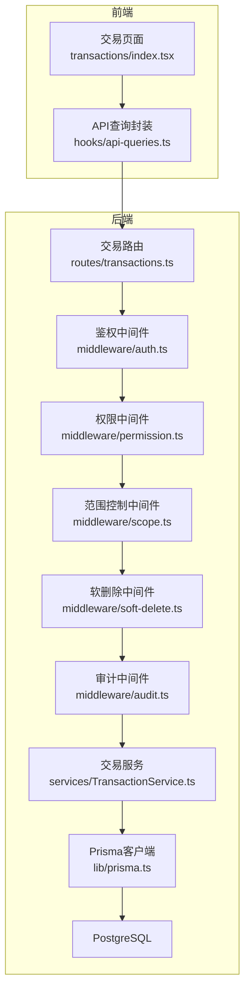
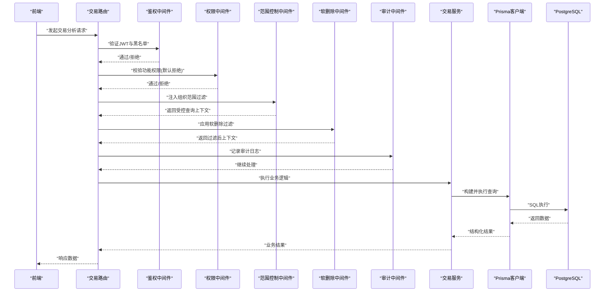
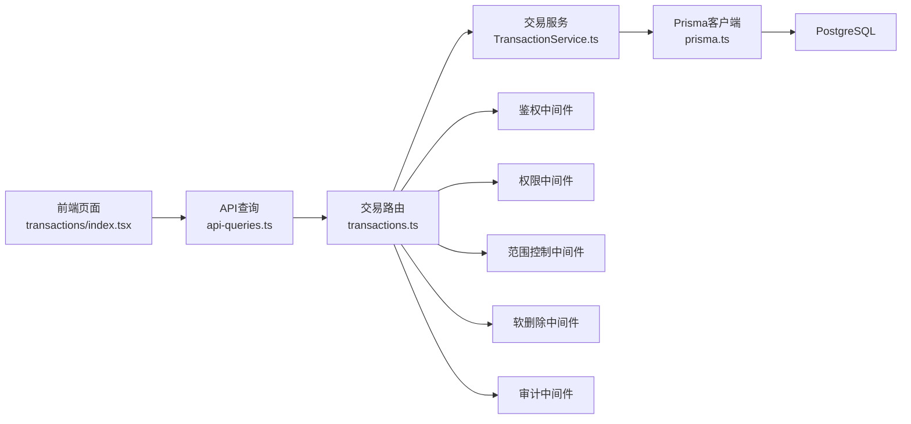

<docs>
# 交易分析模块

<cite>
**本文引用的文件**   
- [server/src/routes/transactions.ts](file://server/src/routes/transactions.ts)
- [server/src/services/TransactionService.ts](file://server/src/services/TransactionService.ts)
- [server/src/middleware/auth.ts](file://server/src/middleware/auth.ts)
- [server/src/middleware/permission.ts](file://server/src/middleware/permission.ts)
- [server/src/middleware/scope.ts](file://server/src/middleware/scope.ts)
- [server/src/middleware/soft-delete.ts](file://server/src/middleware/soft-delete.ts)
- [server/src/middleware/audit.ts](file://server/src/middleware/audit.ts)
- [server/src/lib/prisma.ts](file://server/src/lib/prisma.ts)
- [server/prisma/schema.prisma](file://server/prisma/schema.prisma)
- [web/src/pages/transactions/index.tsx](file://web/src/pages/transactions/index.tsx)
- [web/src/hooks/api-queries.ts](file://web/src/hooks/api-queries.ts)
</cite>

## 目录
1. [简介](#简介)
2. [项目结构](#项目结构)
3. [核心组件](#核心组件)
4. [架构总览](#架构总览)
5. [详细组件分析](#详细组件分析)
6. [依赖关系分析](#依赖关系分析)
7. [性能考量](#性能考量)
8. [故障排查指南](#故障排查指南)
9. [结论](#结论)
10. [附录](#附录)

## 简介
本文件聚焦“交易分析模块”，围绕交易数据的导入、清洗、重分类、指标计算与报表输出，提供端到端的技术说明。该模块遵循平台“Excel进、看板/报表出”的定位，单位统一为万元/人民币；计算类指标采用安全公式解析（白名单算子），同比/环比由后端实时计算不入库；AI双管道用于文本与结构化数据的安全处理。

## 项目结构
交易分析模块涉及前后端协作：
- 前端页面与查询封装位于 web 层，负责用户交互、参数收集与结果展示。
- 后端路由与服务位于 server 层，承载权限校验、范围控制、审计记录、业务逻辑与数据库访问。
- 数据模型与迁移位于 prisma 层，定义交易相关实体与字段演进。

图表来源 
- [server/src/routes/transactions.ts](file://server/src/routes/transactions.ts)
- [server/src/services/TransactionService.ts](file://server/src/services/TransactionService.ts)
- [server/src/middleware/auth.ts](file://server/src/middleware/auth.ts)
- [server/src/middleware/permission.ts](file://server/src/middleware/permission.ts)
- [server/src/middleware/scope.ts](file://server/src/middleware/scope.ts)
- [server/src/middleware/soft-delete.ts](file://server/src/middleware/soft-delete.ts)
- [server/src/middleware/audit.ts](file://server/src/middleware/audit.ts)
- [server/src/lib/prisma.ts](file://server/src/lib/prisma.ts)

章节来源
- [server/src/routes/transactions.ts](file://server/src/routes/transactions.ts)
- [server/src/services/TransactionService.ts](file://server/src/services/TransactionService.ts)
- [web/src/pages/transactions/index.tsx](file://web/src/pages/transactions/index.tsx)
- [web/src/hooks/api-queries.ts](file://web/src/hooks/api-queries.ts)

## 核心组件
- 路由层：暴露交易相关的REST接口，如导入、重分类、查询与分析聚合等。
- 服务层：实现交易导入、清洗、科目映射、公式计算、同比/环比计算、导出等核心业务。
- 中间件链：按顺序执行安全与治理策略（鉴权→权限→范围→软删除→审计）。
- 数据层：通过 Prisma 访问 PostgreSQL，使用扩展注入组织范围过滤。
- 前端：交易页面与API查询封装，驱动用户操作并渲染结果。

章节来源
- [server/src/routes/transactions.ts](file://server/src/routes/transactions.ts)
- [server/src/services/TransactionService.ts](file://server/src/services/TransactionService.ts)
- [server/src/middleware/auth.ts](file://server/src/middleware/auth.ts)
- [server/src/middleware/permission.ts](file://server/src/middleware/permission.ts)
- [server/src/middleware/scope.ts](file://server/src/middleware/scope.ts)
- [server/src/middleware/soft-delete.ts](file://server/src/middleware/soft-delete.ts)
- [server/src/middleware/audit.ts](file://server/src/middleware/audit.ts)
- [server/src/lib/prisma.ts](file://server/src/lib/prisma.ts)
- [web/src/pages/transactions/index.tsx](file://web/src/pages/transactions/index.tsx)
- [web/src/hooks/api-queries.ts](file://web/src/hooks/api-queries.ts)

## 架构总览
交易分析模块的请求链路严格遵循平台中间件执行顺序，确保安全性、可追溯性与数据隔离。

图表来源 
- [server/src/routes/transactions.ts](file://server/src/routes/transactions.ts)
- [server/src/middleware/auth.ts](file://server/src/middleware/auth.ts)
- [server/src/middleware/permission.ts](file://server/src/middleware/permission.ts)
- [server/src/middleware/scope.ts](file://server/src/middleware/scope.ts)
- [server/src/middleware/soft-delete.ts](file://server/src/middleware/soft-delete.ts)
- [server/src/middleware/audit.ts](file://server/src/middleware/audit.ts)
- [server/src/lib/prisma.ts](file://server/src/lib/prisma.ts)

## 详细组件分析

### 路由层：交易接口
- 职责：接收HTTP请求，绑定中间件链，调用服务层方法，返回标准化响应。
- 关键能力：导入交易数据、触发重分类、查询明细与汇总、导出报表。
- 错误处理：统一错误码与消息，结合审计与异常捕获。

章节来源
- [server/src/routes/transactions.ts](file://server/src/routes/transactions.ts)

### 服务层：交易服务
- 职责：实现交易导入、清洗、科目映射、公式计算、同比/环比计算、导出等。
- 关键点：
  - 导入流程：读取Excel → 校验格式 → 脱敏规则 → 写入临时表或批量插入 → 生成批次详情计数。
  - 重分类：基于规则引擎与科目树进行自动/半自动调整，记录重分类日志。
  - 指标计算：使用安全公式解析器（仅允许 +-*/()），禁止eval；同比/环比实时计算。
  - 导出：按维度聚合生成报表数据，支持分页与筛选。
- 复杂度与优化：批量写入、索引利用、避免N+1查询、流式导出大结果集。

章节来源
- [server/src/services/TransactionService.ts](file://server/src/services/TransactionService.ts)

### 中间件链：鉴权、权限、范围、软删除、审计
- 鉴权中间件：校验JWT令牌有效性及黑名单，设置用户上下文。
- 权限中间件：默认拒绝，显式授权后才放行，确保最小权限原则。
- 范围控制中间件：通过Prisma扩展注入组织范围过滤条件，保证数据隔离。
- 软删除中间件：自动附加 is_deleted=false 的过滤条件。
- 审计中间件：记录关键操作的审计日志，便于追踪与合规。

章节来源
- [server/src/middleware/auth.ts](file://server/src/middleware/auth.ts)
- [server/src/middleware/permission.ts](file://server/src/middleware/permission.ts)
- [server/src/middleware/scope.ts](file://server/src/middleware/scope.ts)
- [server/src/middleware/soft-delete.ts](file://server/src/middleware/soft-delete.ts)
- [server/src/middleware/audit.ts](file://server/src/middleware/audit.ts)

### 数据层：Prisma与PostgreSQL
- 模型设计：交易主表、批次表、重分类日志表、企业信息等。
- 迁移管理：通过Prisma Migrations维护schema演进，包含导入批次详情计数、公司简称、重分类日志等。
- 查询优化：合理使用索引、分页、预加载关联数据，避免全表扫描。

章节来源
- [server/prisma/schema.prisma](file://server/prisma/schema.prisma)
- [server/src/lib/prisma.ts](file://server/src/lib/prisma.ts)

### 前端：交易页面与API查询
- 页面职责：提供交易导入、重分类、查询与分析界面，展示KPI与趋势。
- API封装：集中管理请求参数、分页、错误处理与缓存策略。
- 用户体验：加载骨架屏、错误提示、导出进度反馈。

章节来源
- [web/src/pages/transactions/index.tsx](file://web/src/pages/transactions/index.tsx)
- [web/src/hooks/api-queries.ts](file://web/src/hooks/api-queries.ts)

## 依赖关系分析
交易分析模块的依赖关系清晰分层，低耦合高内聚：
- 路由依赖服务，服务依赖Prisma客户端。
- 中间件按固定顺序串联，形成安全与治理屏障。
- 前端依赖API封装，间接依赖后端路由。

图表来源 
- [web/src/pages/transactions/index.tsx](file://web/src/pages/transactions/index.tsx)
- [web/src/hooks/api-queries.ts](file://web/src/hooks/api-queries.ts)
- [server/src/routes/transactions.ts](file://server/src/routes/transactions.ts)
- [server/src/services/TransactionService.ts](file://server/src/services/TransactionService.ts)
- [server/src/lib/prisma.ts](file://server/src/lib/prisma.ts)
- [server/src/middleware/auth.ts](file://server/src/middleware/auth.ts)
- [server/src/middleware/permission.ts](file://server/src/middleware/permission.ts)
- [server/src/middleware/scope.ts](file://server/src/middleware/scope.ts)
- [server/src/middleware/soft-delete.ts](file://server/src/middleware/soft-delete.ts)
- [server/src/middleware/audit.ts](file://server/src/middleware/audit.ts)

## 性能考量
- 导入性能：采用批量插入与事务控制，减少IO次数；对关键字段建立索引提升查询效率。
- 计算性能：同比/环比实时计算，避免冗余存储；公式解析器限制算子集合，降低解析开销。
- 查询优化：分页与筛选前置，避免全量拉取；使用Prisma关联预加载减少N+1问题。
- 导出优化：流式生成大文件，内存占用可控；支持增量导出与断点续传（若实现）。

[本节为通用指导，无需特定文件引用]

## 故障排查指南
- 鉴权失败：检查JWT有效期、黑名单状态与签名密钥配置。
- 权限拒绝：确认用户角色与资源权限映射是否正确。
- 数据为空：核查组织范围过滤条件、软删除标记与筛选参数。
- 导入失败：查看Excel格式校验错误、脱敏规则冲突与重复键约束。
- 审计缺失：确认审计中间件是否启用且日志写入正常。

章节来源
- [server/src/middleware/auth.ts](file://server/src/middleware/auth.ts)
- [server/src/middleware/permission.ts](file://server/src/middleware/permission.ts)
- [server/src/middleware/scope.ts](file://server/src/middleware/scope.ts)
- [server/src/middleware/soft-delete.ts](file://server/src/middleware/soft-delete.ts)
- [server/src/middleware/audit.ts](file://server/src/middleware/audit.ts)

## 结论
交易分析模块以清晰的层次结构与严格的中间件链保障数据安全与合规，通过安全公式解析与实时计算满足财务口径需求。前后端协作良好，具备可扩展性与可维护性。建议持续优化导入与查询性能，完善错误诊断与监控告警。

[本节为总结性内容，无需特定文件引用]

## 附录
- 术语表：交易、重分类、科目树、同比/环比、批