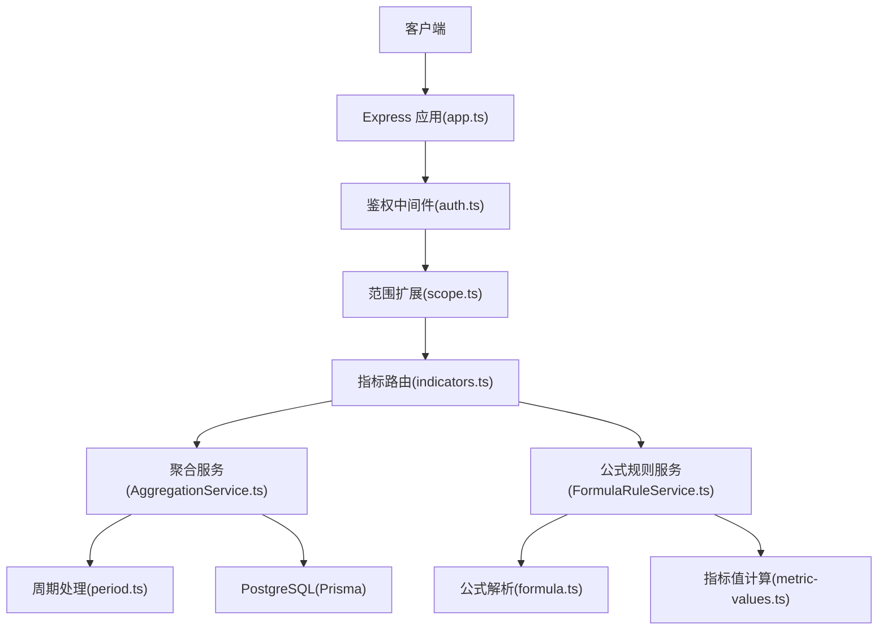
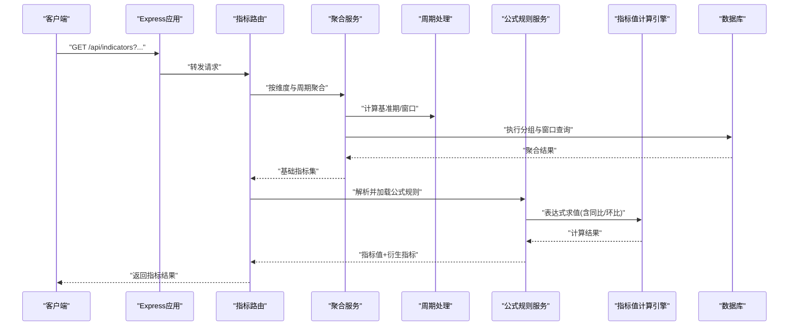
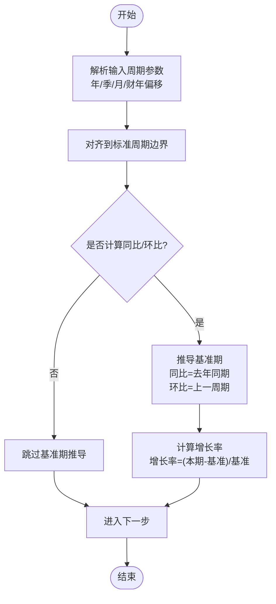
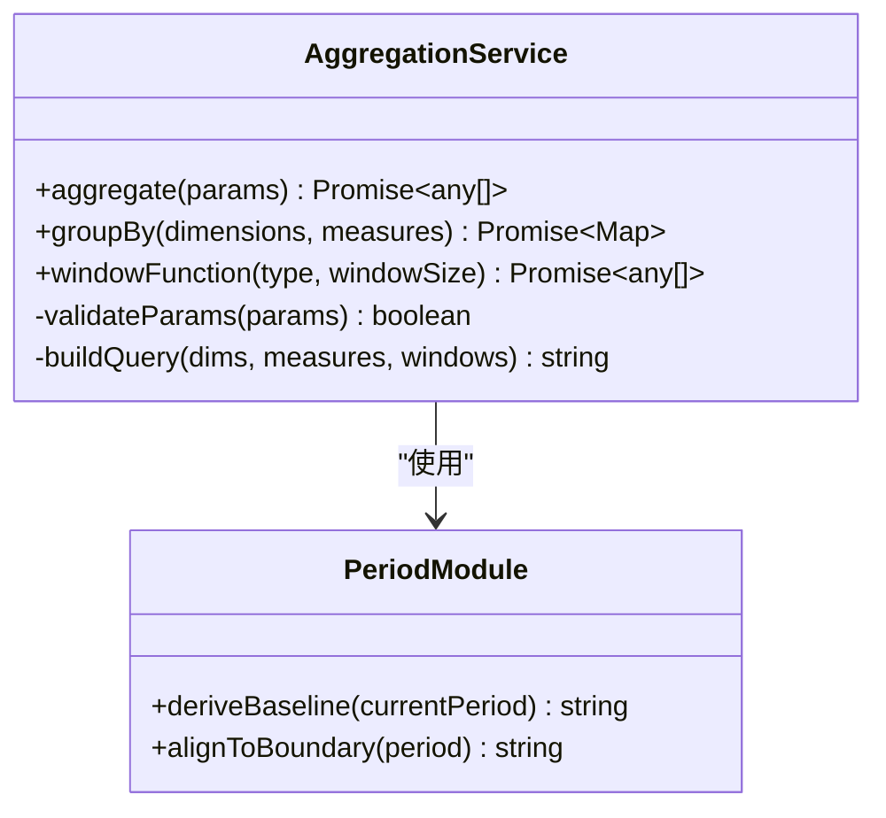
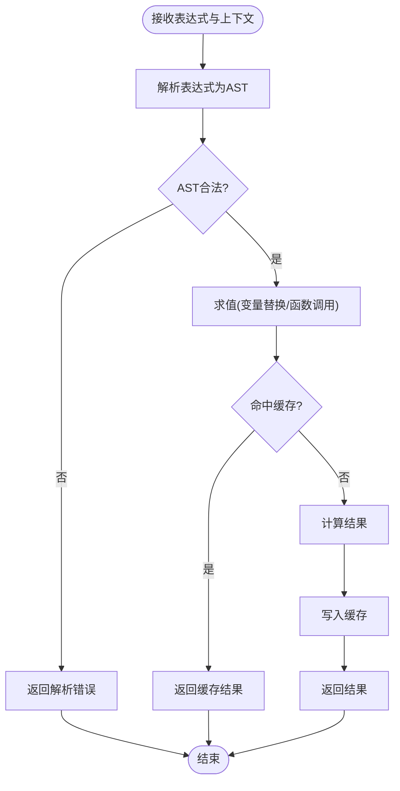
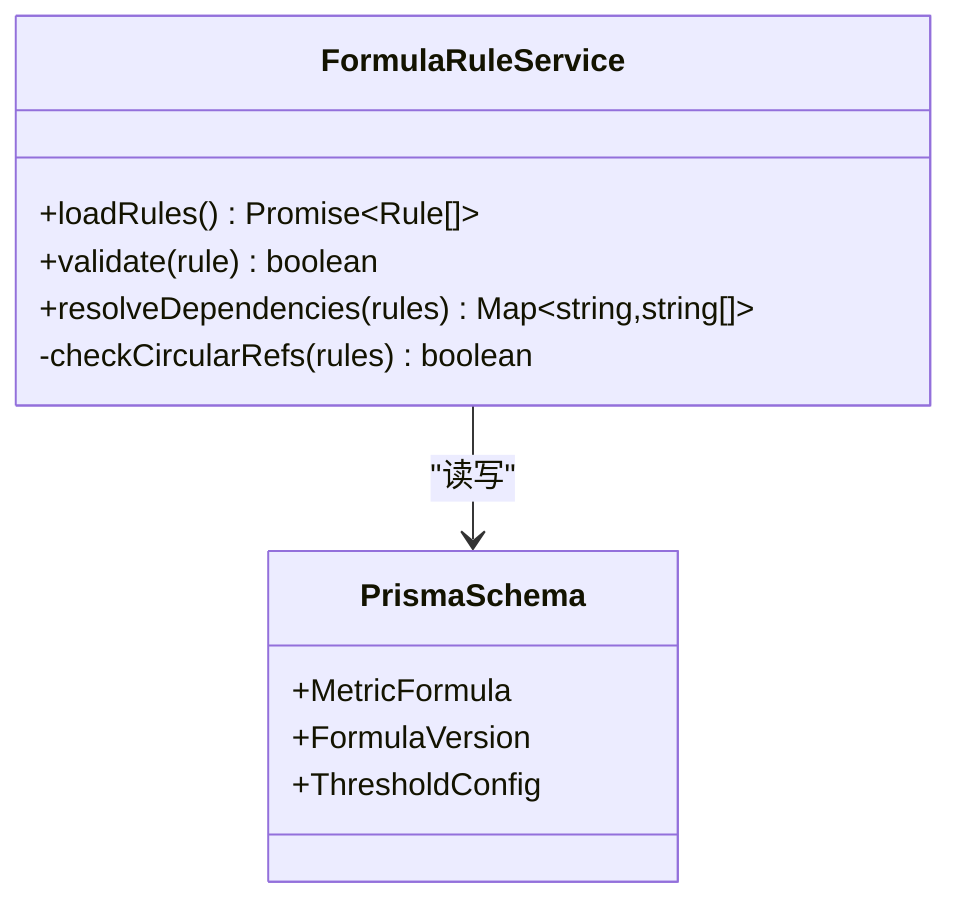
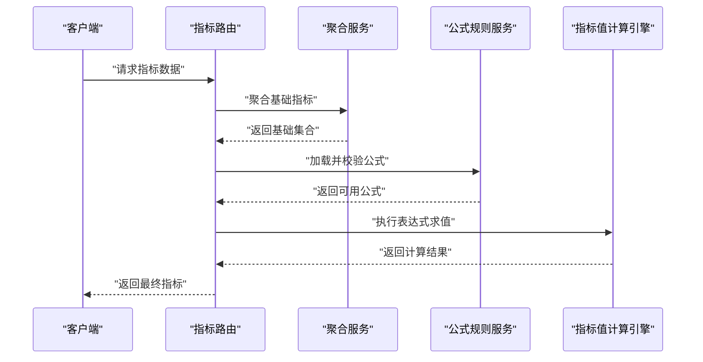
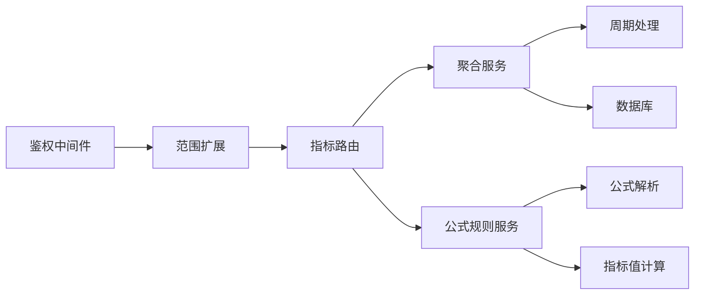

# 指标分析引擎

<cite>
**本文引用的文件**   
- [server/src/lib/period.ts](file://server/src/lib/period.ts)
- [server/src/lib/formula.ts](file://server/src/lib/formula.ts)
- [server/src/lib/metric-values.ts](file://server/src/lib/metric-values.ts)
- [server/src/services/AggregationService.ts](file://server/src/services/AggregationService.ts)
- [server/src/services/FormulaRuleService.ts](file://server/src/services/FormulaRuleService.ts)
- [server/src/routes/indicators.ts](file://server/src/routes/indicators.ts)
- [server/prisma/schema.prisma](file://server/prisma/schema.prisma)
- [server/src/config/env.ts](file://server/src/config/env.ts)
- [server/src/middleware/auth.ts](file://server/src/middleware/auth.ts)
- [server/src/middleware/scope.ts](file://server/src/middleware/scope.ts)
- [server/src/app.ts](file://server/src/app.ts)
</cite>

## 目录
1. [引言](#引言)
2. [项目结构](#项目结构)
3. [核心组件](#核心组件)
4. [架构总览](#架构总览)
5. [详细组件分析](#详细组件分析)
6. [依赖关系分析](#依赖关系分析)
7. [性能考虑](#性能考虑)
8. [故障排查指南](#故障排查指南)
9. [结论](#结论)
10. [附录](#附录)

## 引言
本文件面向“指标分析引擎”的完整技术文档，聚焦以下目标：
- 同比环比实时计算算法：时间周期识别、基准期选择、增长率计算公式。
- 数据聚合服务：多维度聚合、分组统计、窗口函数应用。
- 指标值计算引擎：公式解析、表达式求值、缓存策略。
- 周期处理逻辑：财年定义、季度划分、月度计算。
- KPI 计算：权重配置、评分算法、阈值判断。
- 指标配置示例：复杂公式与嵌套计算。
- 性能优化：查询优化、结果缓存、异步计算。

本项目为浙江壹品慧财年经营数据分析平台，定位“Excel进、看板/报表出”的内部管理口径财务数据平台，单位统一为万元/人民币。后端采用 Express + Prisma + PostgreSQL，计算类指标使用安全公式解析（白名单算子），同比/环比由后端实时计算不存库。

## 项目结构
围绕指标分析引擎的核心代码分布在 server 层的 lib、services、routes、prisma 以及中间件与配置中：
- 周期与时间处理：lib/period.ts
- 公式解析与求值：lib/formula.ts、lib/metric-values.ts
- 聚合服务：services/AggregationService.ts
- 公式规则服务：services/FormulaRuleService.ts
- 指标路由：routes/indicators.ts
- 数据库模型：prisma/schema.prisma
- 环境变量：config/env.ts
- 鉴权与权限：middleware/auth.ts、middleware/scope.ts
- 应用入口：app.ts

**图表来源** 
- [server/src/app.ts](file://server/src/app.ts)
- [server/src/middleware/auth.ts](file://server/src/middleware/auth.ts)
- [server/src/middleware/scope.ts](file://server/src/middleware/scope.ts)
- [server/src/routes/indicators.ts](file://server/src/routes/indicators.ts)
- [server/src/services/AggregationService.ts](file://server/src/services/AggregationService.ts)
- [server/src/services/FormulaRuleService.ts](file://server/src/services/FormulaRuleService.ts)
- [server/src/lib/period.ts](file://server/src/lib/period.ts)
- [server/src/lib/formula.ts](file://server/src/lib/formula.ts)
- [server/src/lib/metric-values.ts](file://server/src/lib/metric-values.ts)

**章节来源**
- [server/src/app.ts](file://server/src/app.ts)
- [server/src/middleware/auth.ts](file://server/src/middleware/auth.ts)
- [server/src/middleware/scope.ts](file://server/src/middleware/scope.ts)
- [server/src/routes/indicators.ts](file://server/src/routes/indicators.ts)
- [server/src/services/AggregationService.ts](file://server/src/services/AggregationService.ts)
- [server/src/services/FormulaRuleService.ts](file://server/src/services/FormulaRuleService.ts)
- [server/src/lib/period.ts](file://server/src/lib/period.ts)
- [server/src/lib/formula.ts](file://server/src/lib/formula.ts)
- [server/src/lib/metric-values.ts](file://server/src/lib/metric-values.ts)

## 核心组件
- 周期处理模块：负责财年、季度、月度的识别与对齐，提供基准期推导能力。
- 聚合服务：按维度分组、窗口函数（如累计、移动平均）与多粒度聚合。
- 公式规则服务：读取并校验公式规则，驱动指标值计算引擎。
- 指标值计算引擎：基于白名单的安全表达式解析与求值，支持嵌套与函数调用。
- 指标路由：对外暴露指标查询接口，串联鉴权、范围、聚合与公式计算。

**章节来源**
- [server/src/lib/period.ts](file://server/src/lib/period.ts)
- [server/src/services/AggregationService.ts](file://server/src/services/AggregationService.ts)
- [server/src/services/FormulaRuleService.ts](file://server/src/services/FormulaRuleService.ts)
- [server/src/lib/formula.ts](file://server/src/lib/formula.ts)
- [server/src/lib/metric-values.ts](file://server/src/lib/metric-values.ts)
- [server/src/routes/indicators.ts](file://server/src/routes/indicators.ts)

## 架构总览
指标分析引擎的请求链路如下：
- 客户端发起指标查询请求到 Express 应用。
- 经过鉴权与范围限制后进入指标路由。
- 路由调用聚合服务获取基础数据，再调用公式规则服务进行指标计算。
- 周期处理模块在聚合与计算过程中提供时间对齐与基准期推导。
- 最终返回包含原始值、同比/环比、KPI 评分等结果的响应。

**图表来源** 
- [server/src/app.ts](file://server/src/app.ts)
- [server/src/routes/indicators.ts](file://server/src/routes/indicators.ts)
- [server/src/services/AggregationService.ts](file://server/src/services/AggregationService.ts)
- [server/src/lib/period.ts](file://server/src/lib/period.ts)
- [server/src/services/FormulaRuleService.ts](file://server/src/services/FormulaRuleService.ts)
- [server/src/lib/formula.ts](file://server/src/lib/formula.ts)
- [server/src/lib/metric-values.ts](file://server/src/lib/metric-values.ts)

## 详细组件分析

### 周期处理模块（同比/环比与基准期）
- 时间周期识别：支持年、季、月的标准划分，并提供财年起始偏移（例如从某月开始作为财年起始）。
- 基准期选择：根据当前周期自动推导对比期（去年同期、上一季度、上一月），用于同比/环比计算。
- 增长率计算公式：
  - 同比增长率 = (本期值 - 同期值) / 同期值
  - 环比增长率 = (本期值 - 上期值) / 上期值
  - 当分母为零或空时，返回空或特殊标记，避免除零错误。
- 窗口函数支持：累计（YTD）、移动平均（N期）等，结合周期对齐保证正确性。

**图表来源** 
- [server/src/lib/period.ts](file://server/src/lib/period.ts)

**章节来源**
- [server/src/lib/period.ts](file://server/src/lib/period.ts)

### 数据聚合服务（多维度聚合、分组统计、窗口函数）
- 多维度聚合：按公司、部门、科目、区域等多维度进行分组汇总。
- 分组统计：支持 SUM、AVG、COUNT、MIN、MAX 等常用聚合函数。
- 窗口函数应用：
  - 累计（YTD）：按周期累计求和。
  - 移动平均：按 N 期滑动窗口计算平均值。
  - 排名/百分位：按维度内排序与分位计算。
- 性能优化：
  - 利用数据库索引与分区键加速分组与过滤。
  - 预聚合物化视图或临时表减少重复计算。
  - 分页与投影裁剪减少数据传输量。

**图表来源** 
- [server/src/services/AggregationService.ts](file://server/src/services/AggregationService.ts)
- [server/src/lib/period.ts](file://server/src/lib/period.ts)

**章节来源**
- [server/src/services/AggregationService.ts](file://server/src/services/AggregationService.ts)
- [server/src/lib/period.ts](file://server/src/lib/period.ts)

### 指标值计算引擎（公式解析、表达式求值、缓存策略）
- 公式解析：
  - 白名单算子：仅允许 +-*/() 与受信任函数，禁止 eval。
  - AST 构建与校验：确保表达式语法合法且无危险操作。
- 表达式求值：
  - 支持变量替换、函数调用、嵌套表达式。
  - 数值类型统一为万元/人民币，处理精度与舍入。
- 缓存策略：
  - 基于“维度+周期+公式哈希”的键生成缓存键。
  - 短期内存缓存（LRU）与可选持久化缓存（Redis）。
  - 失效策略：数据更新或公式变更触发失效。

**图表来源** 
- [server/src/lib/formula.ts](file://server/src/lib/formula.ts)
- [server/src/lib/metric-values.ts](file://server/src/lib/metric-values.ts)

**章节来源**
- [server/src/lib/formula.ts](file://server/src/lib/formula.ts)
- [server/src/lib/metric-values.ts](file://server/src/lib/metric-values.ts)

### 公式规则服务（指标配置与规则管理）
- 规则存储：通过 Prisma 模型管理指标公式、权重、阈值等配置。
- 规则校验：加载时进行语法与依赖校验，防止循环引用与非法引用。
- 动态生效：支持热更新与版本控制，保障生产环境稳定性。

**图表来源** 
- [server/src/services/FormulaRuleService.ts](file://server/src/services/FormulaRuleService.ts)
- [server/prisma/schema.prisma](file://server/prisma/schema.prisma)

**章节来源**
- [server/src/services/FormulaRuleService.ts](file://server/src/services/FormulaRuleService.ts)
- [server/prisma/schema.prisma](file://server/prisma/schema.prisma)

### 指标路由（API 入口与流程编排）
- 参数校验：周期、维度、指标ID、是否计算同比/环比等。
- 流程编排：先聚合基础数据，再应用公式规则，最后返回结果。
- 错误处理：统一错误码与消息，便于前端展示与监控。

**图表来源** 
- [server/src/routes/indicators.ts](file://server/src/routes/indicators.ts)
- [server/src/services/AggregationService.ts](file://server/src/services/AggregationService.ts)
- [server/src/services/FormulaRuleService.ts](file://server/src/services/FormulaRuleService.ts)
- [server/src/lib/formula.ts](file://server/src/lib/formula.ts)
- [server/src/lib/metric-values.ts](file://server/src/lib/metric-values.ts)

**章节来源**
- [server/src/routes/indicators.ts](file://server/src/routes/indicators.ts)

## 依赖关系分析
- 中间件链：helmet → cors → express.json → rate-limit → auth(JWT+黑名单) → permission(默认拒绝) → scope(Prisma extension) → softDelete → audit → Service → Prisma → PostgreSQL。
- 指标路由依赖聚合服务与公式规则服务；聚合服务依赖周期处理模块；公式规则服务依赖 Prisma 模型与公式解析器。
- 潜在循环依赖：需确保公式规则与服务层之间单向依赖，避免环状引用。

**图表来源** 
- [server/src/middleware/auth.ts](file://server/src/middleware/auth.ts)
- [server/src/middleware/scope.ts](file://server/src/middleware/scope.ts)
- [server/src/routes/indicators.ts](file://server/src/routes/indicators.ts)
- [server/src/services/AggregationService.ts](file://server/src/services/AggregationService.ts)
- [server/src/services/FormulaRuleService.ts](file://server/src/services/FormulaRuleService.ts)
- [server/src/lib/period.ts](file://server/src/lib/period.ts)
- [server/src/lib/formula.ts](file://server/src/lib/formula.ts)
- [server/src/lib/metric-values.ts](file://server/src/lib/metric-values.ts)

**章节来源**
- [server/src/middleware/auth.ts](file://server/src/middleware/auth.ts)
- [server/src/middleware/scope.ts](file://server/src/middleware/scope.ts)
- [server/src/routes/indicators.ts](file://server/src/routes/indicators.ts)
- [server/src/services/AggregationService.ts](file://server/src/services/AggregationService.ts)
- [server/src/services/FormulaRuleService.ts](file://server/src/services/FormulaRuleService.ts)
- [server/src/lib/period.ts](file://server/src/lib/period.ts)
- [server/src/lib/formula.ts](file://server/src/lib/formula.ts)
- [server/src/lib/metric-values.ts](file://server/src/lib/metric-values.ts)

## 性能考虑
- 查询优化：
  - 合理设计索引（维度字段、时间戳、财年偏移）。
  - 使用覆盖索引与分区表提升大表查询效率。
  - 避免 SELECT *，只投影必要字段。
- 结果缓存：
  - 基于“维度+周期+公式哈希”的缓存键，短生命周期内存缓存优先。
  - 热点指标可引入 Redis 分布式缓存，设置 TTL 与失效策略。
- 异步计算：
  - 对耗时聚合任务使用队列（如 BullMQ）异步执行，前端轮询或 SSE 推送。
  - 增量更新：仅重算受影响维度与周期。
- 并发控制：
  - 限流与熔断保护，避免雪崩。
  - 连接池调优（Prisma 连接数、超时、重试）。

[本节为通用指导，无需具体文件来源]

## 故障排查指南
- 公式解析失败：检查白名单算子与函数名，确认 AST 合法性与变量存在性。
- 同比/环比异常：核对基准期推导是否正确，分母是否为 0 或空。
- 聚合结果偏差：验证分组维度与窗口函数参数，检查数据库索引与分区键。
- 缓存不一致：确认缓存键生成规则与失效时机，必要时强制刷新。
- 鉴权与范围问题：检查 JWT 令牌状态与 Prisma 扩展的范围条件。

**章节来源**
- [server/src/lib/formula.ts](file://server/src/lib/formula.ts)
- [server/src/lib/period.ts](file://server/src/lib/period.ts)
- [server/src/services/AggregationService.ts](file://server/src/services/AggregationService.ts)
- [server/src/middleware/auth.ts](file://server/src/middleware/auth.ts)
- [server/src/middleware/scope.ts](file://server/src/middleware/scope.ts)

## 结论
指标分析引擎以周期处理、聚合服务、公式规则与指标值计算为核心，形成高内聚、低耦合的架构。通过白名单公式解析与安全求值、灵活的基准期推导与窗口函数、完善的缓存与异步机制，满足复杂财务指标的实时计算需求。建议在生产环境中持续优化索引与缓存策略，并结合监控与告警保障稳定性。

[本节为总结，无需具体文件来源]

## 附录

### KPI 计算说明
- 权重配置：每个指标可配置权重，用于加权评分。
- 评分算法：线性加权或非线性映射（如分段函数），支持阈值区间与等级划分。
- 阈值判断：设定上下限与警告线，输出达标/预警/不达标状态。

[本节为概念说明，无需具体文件来源]

### 指标配置示例（描述性）
- 简单公式：收入 = 销售额 - 退货额
- 复合公式：毛利率 = (收入 - 成本) / 收入
- 嵌套计算：净利润 = (毛利 - 费用) * (1 - 税率)
- 同比/环比：增长率 = (本期 - 基准) / 基准
- 窗口函数：YTD 累计收入 = SUM(按月累计)

[本节为示例说明，无需具体文件来源]