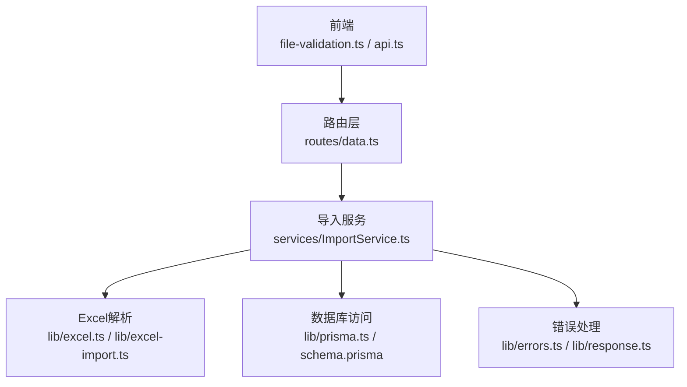
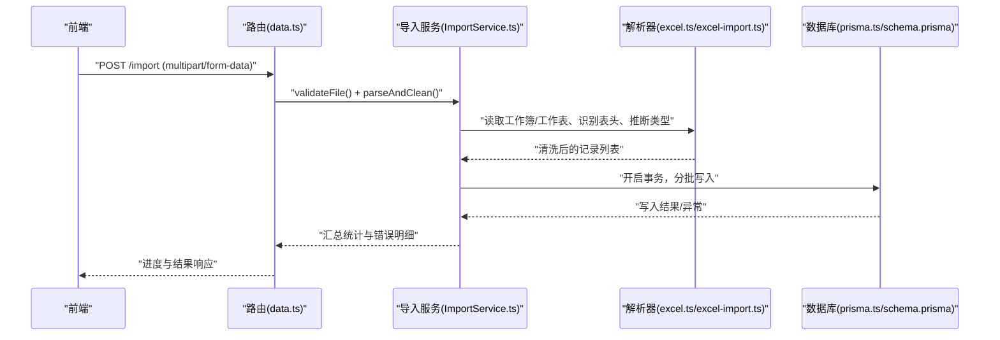
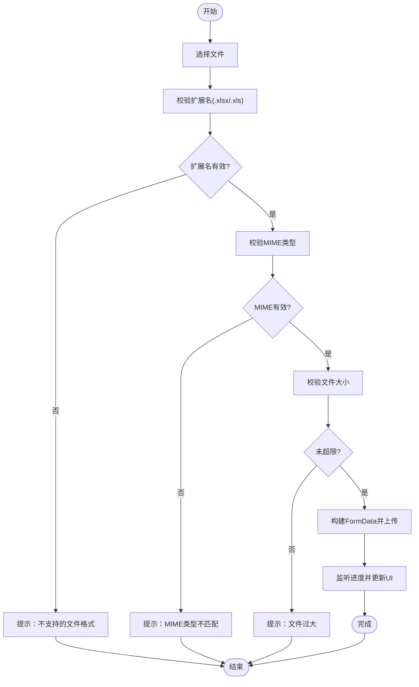
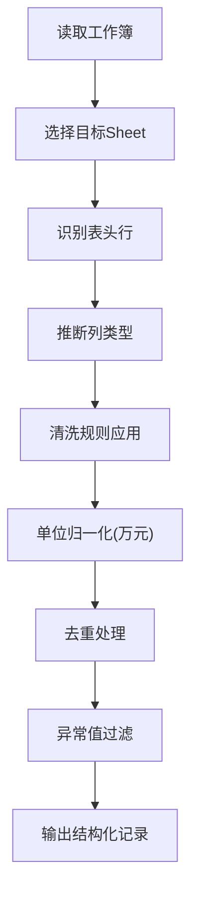
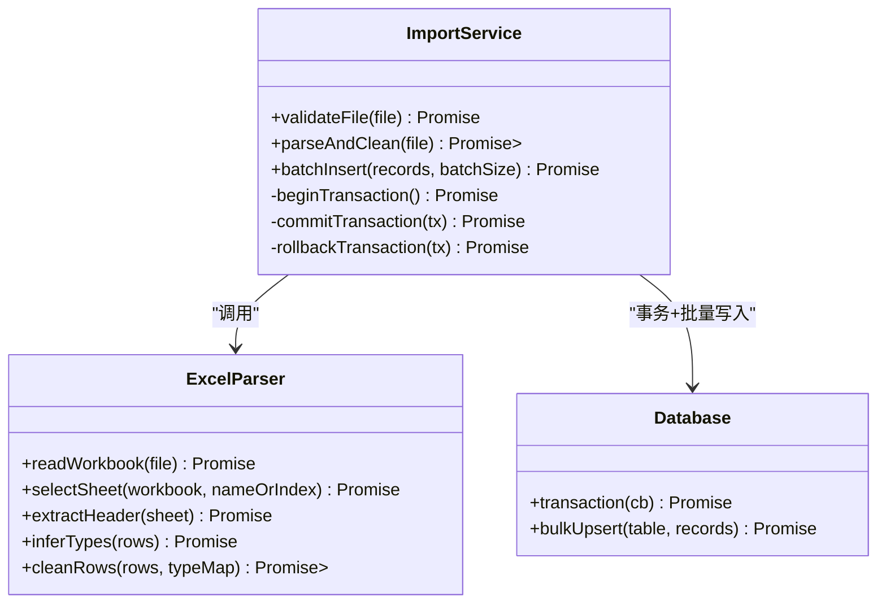
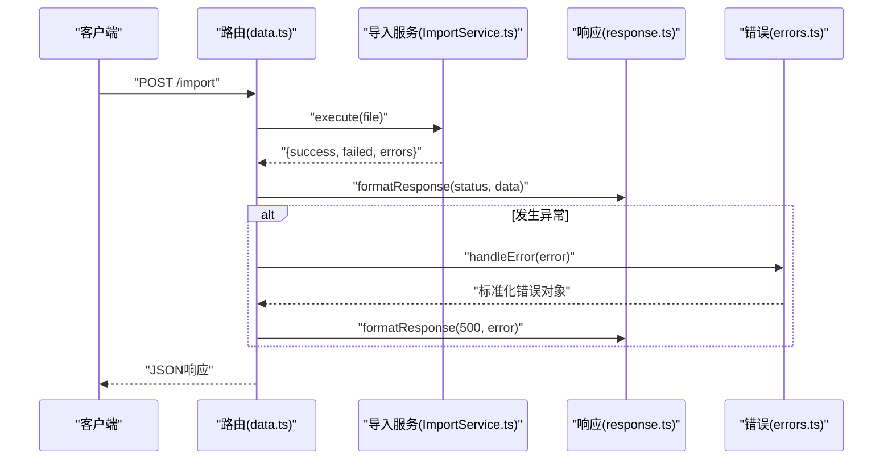
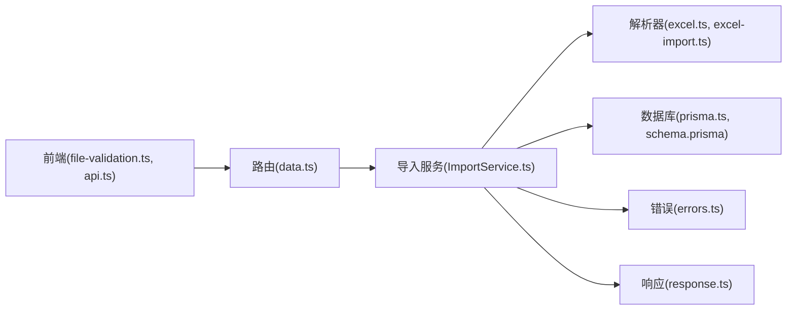

# Excel导入处理

<cite>
**本文引用的文件**   
- [excel-import.ts](file://server/src/lib/excel-import.ts)
- [excel.ts](file://server/src/lib/excel.ts)
- [ImportService.ts](file://server/src/services/ImportService.ts)
- [data.ts](file://server/src/routes/data.ts)
- [errors.ts](file://server/src/lib/errors.ts)
- [response.ts](file://server/src/lib/response.ts)
- [env.ts](file://server/src/config/env.ts)
- [prisma.ts](file://server/src/lib/prisma.ts)
- [schema.prisma](file://server/prisma/schema.prisma)
- [file-validation.ts](file://web/src/lib/file-validation.ts)
- [api.ts](file://web/src/lib/api.ts)
</cite>

## 目录
1. [简介](#简介)
2. [项目结构](#项目结构)
3. [核心组件](#核心组件)
4. [架构总览](#架构总览)
5. [详细组件分析](#详细组件分析)
6. [依赖关系分析](#依赖关系分析)
7. [性能考虑](#性能考虑)
8. [故障排查指南](#故障排查指南)
9. [结论](#结论)
10. [附录：端到端示例与最佳实践](#附录：端到端示例与最佳实践)

## 简介
本文件面向“Excel进、看板/报表出”的财务数据平台，聚焦Excel导入全链路：从前端文件选择到后端解析、清洗、批量入库，再到进度反馈与错误提示。重点覆盖：
- 文件格式验证（.xlsx/.xls）、大小限制、MIME类型检查
- 数据解析：Sheet选择、表头识别、数据类型推断、空值处理
- 数据清洗：格式标准化、单位统一为万元、重复数据处理、异常值过滤
- 批量插入优化：事务、分批提交、内存管理、错误回滚
- 完整导入示例：前端上传、后端处理、进度反馈
- 常见错误与用户友好提示
- 性能优化：流式处理、内存池复用、并发控制

## 项目结构
围绕Excel导入的关键代码分布在服务端库与服务层、路由层以及前端校验与API调用模块中：
- 服务端解析与清洗：lib/excel.ts、lib/excel-import.ts
- 服务编排与事务：services/ImportService.ts
- 路由与鉴权中间件：routes/data.ts
- 配置与环境：config/env.ts、lib/prisma.ts、prisma/schema.prisma
- 前端校验与上传：web/src/lib/file-validation.ts、web/src/lib/api.ts

**图示来源** 
- [data.ts](file://server/src/routes/data.ts)
- [ImportService.ts](file://server/src/services/ImportService.ts)
- [excel.ts](file://server/src/lib/excel.ts)
- [excel-import.ts](file://server/src/lib/excel-import.ts)
- [prisma.ts](file://server/src/lib/prisma.ts)
- [schema.prisma](file://server/prisma/schema.prisma)
- [errors.ts](file://server/src/lib/errors.ts)
- [response.ts](file://server/src/lib/response.ts)
- [file-validation.ts](file://web/src/lib/file-validation.ts)
- [api.ts](file://web/src/lib/api.ts)

**章节来源**
- [data.ts](file://server/src/routes/data.ts)
- [ImportService.ts](file://server/src/services/ImportService.ts)
- [excel.ts](file://server/src/lib/excel.ts)
- [excel-import.ts](file://server/src/lib/excel-import.ts)
- [file-validation.ts](file://web/src/lib/file-validation.ts)
- [api.ts](file://web/src/lib/api.ts)

## 核心组件
- 文件校验与上传（前端）
  - 支持.xlsx/.xls扩展名校验、MIME类型白名单、文件大小上限
  - 基于FormData构建请求体，携带进度事件回调
- Excel解析器（服务端）
  - 读取工作簿与工作表，定位表头行，推断列类型
  - 空值与异常值处理，数值单位归一化（万元）
- 导入服务（服务端）
  - 组装清洗后的记录，开启事务，分批写入，失败回滚
  - 统计成功/失败数量，返回结构化结果
- 路由层（服务端）
  - 接收multipart/form-data，调用导入服务，统一响应封装
- 配置与环境
  - 导入大小限制、批大小、并发度等参数集中管理
- 数据库访问
  - 通过Prisma进行批量upsert或insertMany，结合事务保证一致性

**章节来源**
- [file-validation.ts](file://web/src/lib/file-validation.ts)
- [api.ts](file://web/src/lib/api.ts)
- [excel.ts](file://server/src/lib/excel.ts)
- [excel-import.ts](file://server/src/lib/excel-import.ts)
- [ImportService.ts](file://server/src/services/ImportService.ts)
- [data.ts](file://server/src/routes/data.ts)
- [env.ts](file://server/src/config/env.ts)
- [prisma.ts](file://server/src/lib/prisma.ts)
- [schema.prisma](file://server/prisma/schema.prisma)

## 架构总览
下图展示一次完整的Excel导入流程：前端选择并校验文件，发起上传；后端路由接收后交由导入服务处理；导入服务调用解析器完成数据清洗；最终在事务中批量写入数据库并返回进度与结果。

**图示来源** 
- [data.ts](file://server/src/routes/data.ts)
- [ImportService.ts](file://server/src/services/ImportService.ts)
- [excel.ts](file://server/src/lib/excel.ts)
- [excel-import.ts](file://server/src/lib/excel-import.ts)
- [prisma.ts](file://server/src/lib/prisma.ts)
- [schema.prisma](file://server/prisma/schema.prisma)

## 详细组件分析

### 文件上传与校验（前端）
- 支持的格式：.xlsx、.xls
- MIME类型白名单：application/vnd.openxmlformats-officedocument.spreadsheetml.sheet、application/vnd.ms-excel
- 大小限制：根据环境变量或默认阈值限制（如10MB），超出即拒绝
- 上传方式：FormData，携带文件对象；可选分片上传（大文件场景）
- 进度反馈：监听onprogress事件，更新UI进度条

**图示来源** 
- [file-validation.ts](file://web/src/lib/file-validation.ts)
- [api.ts](file://web/src/lib/api.ts)

**章节来源**
- [file-validation.ts](file://web/src/lib/file-validation.ts)
- [api.ts](file://web/src/lib/api.ts)

### Excel解析与数据清洗（服务端）
- Sheet选择策略
  - 默认选择第一个非空Sheet，或按名称/索引指定
- 表头识别
  - 首行作为表头；支持跳过前N行；列名映射到业务字段
- 数据类型推断
  - 数字、日期、文本；对日期字符串进行规范化
- 空值处理
  - 空字符串转null；必填字段缺失时标记错误
- 数据清洗
  - 数值单位统一为万元（如输入为元则除以10000）
  - 去除前后空白、统一小数位数
  - 重复数据去重（基于业务主键或组合键）
  - 异常值过滤（如负数金额、越界指标）

**图示来源** 
- [excel.ts](file://server/src/lib/excel.ts)
- [excel-import.ts](file://server/src/lib/excel-import.ts)

**章节来源**
- [excel.ts](file://server/src/lib/excel.ts)
- [excel-import.ts](file://server/src/lib/excel-import.ts)

### 导入服务与批量插入（服务端）
- 事务处理
  - 使用Prisma事务包裹整个批次写入，任一失败整体回滚
- 分批提交
  - 将清洗后的记录按固定批大小切分，逐批提交
- 内存管理
  - 流式读取避免一次性加载全部数据；记录池复用减少GC压力
- 错误回滚
  - 单条失败记录收集错误明细，不影响其他记录；整批失败触发回滚
- 结果聚合
  - 统计成功/失败数量、错误原因分类，返回结构化响应

**图示来源** 
- [ImportService.ts](file://server/src/services/ImportService.ts)
- [excel.ts](file://server/src/lib/excel.ts)
- [excel-import.ts](file://server/src/lib/excel-import.ts)
- [prisma.ts](file://server/src/lib/prisma.ts)
- [schema.prisma](file://server/prisma/schema.prisma)

**章节来源**
- [ImportService.ts](file://server/src/services/ImportService.ts)
- [prisma.ts](file://server/src/lib/prisma.ts)
- [schema.prisma](file://server/prisma/schema.prisma)

### 路由层与响应封装（服务端）
- 接收multipart/form-data，解析文件流
- 调用导入服务执行校验、解析、清洗、批量写入
- 统一响应封装，包含状态码、消息、统计数据与错误明细
- 错误处理中间件捕获异常，返回用户友好的提示信息

**图示来源** 
- [data.ts](file://server/src/routes/data.ts)
- [ImportService.ts](file://server/src/services/ImportService.ts)
- [response.ts](file://server/src/lib/response.ts)
- [errors.ts](file://server/src/lib/errors.ts)

**章节来源**
- [data.ts](file://server/src/routes/data.ts)
- [response.ts](file://server/src/lib/response.ts)
- [errors.ts](file://server/src/lib/errors.ts)

### 配置与环境变量
- 导入大小限制：MAX_UPLOAD_SIZE（字节）
- 批大小：BATCH_SIZE（建议100~1000）
- 并发度：CONCURRENCY（控制并行任务数）
- 日志级别：LOG_LEVEL
- 这些参数影响内存占用、吞吐与稳定性

**章节来源**
- [env.ts](file://server/src/config/env.ts)

## 依赖关系分析
- 前端依赖：file-validation.ts负责文件校验，api.ts负责HTTP请求与进度回调
- 服务端依赖：
  - routes/data.ts依赖services/ImportService.ts
  - services/ImportService.ts依赖lib/excel.ts、lib/excel-import.ts
  - services/ImportService.ts依赖lib/prisma.ts与schema.prisma
  - 错误与响应由lib/errors.ts与lib/response.ts提供

**图示来源** 
- [file-validation.ts](file://web/src/lib/file-validation.ts)
- [api.ts](file://web/src/lib/api.ts)
- [data.ts](file://server/src/routes/data.ts)
- [ImportService.ts](file://server/src/services/ImportService.ts)
- [excel.ts](file://server/src/lib/excel.ts)
- [excel-import.ts](file://server/src/lib/excel-import.ts)
- [prisma.ts](file://server/src/lib/prisma.ts)
- [schema.prisma](file://server/prisma/schema.prisma)
- [errors.ts](file://server/src/lib/errors.ts)
- [response.ts](file://server/src/lib/response.ts)

**章节来源**
- [file-validation.ts](file://web/src/lib/file-validation.ts)
- [api.ts](file://web/src/lib/api.ts)
- [data.ts](file://server/src/routes/data.ts)
- [ImportService.ts](file://server/src/services/ImportService.ts)
- [excel.ts](file://server/src/lib/excel.ts)
- [excel-import.ts](file://server/src/lib/excel-import.ts)
- [prisma.ts](file://server/src/lib/prisma.ts)
- [schema.prisma](file://server/prisma/schema.prisma)
- [errors.ts](file://server/src/lib/errors.ts)
- [response.ts](file://server/src/lib/response.ts)

## 性能考虑
- 流式处理
  - 使用流式读取Excel，避免一次性加载大文件到内存
  - 边读边清洗，降低峰值内存
- 内存池复用
  - 记录对象池复用，减少频繁分配与GC
- 并发控制
  - 限制同时处理的导入任务数，防止资源争用
- 批量写入
  - 合理设置批大小，平衡吞吐与内存占用
  - 使用Prisma的事务与批量操作提升写入效率
- 缓存与去重
  - 对高频重复数据进行本地缓存，减少重复计算与写入

[本节为通用指导，无需特定文件引用]

## 故障排查指南
- 常见错误类型
  - 文件格式不支持：扩展名或MIME类型不匹配
  - 文件过大：超过最大上传限制
  - 表头缺失或错位：无法识别列映射
  - 数据类型错误：日期/数字格式不正确
  - 单位不一致：未转换为万元导致数值异常
  - 重复数据：主键冲突
  - 异常值：负数金额、越界指标
- 错误定位步骤
  - 检查前端校验日志与网络请求
  - 查看服务端错误日志与响应体中的错误明细
  - 核对环境变量配置（大小限制、批大小、并发度）
  - 确认数据库约束与唯一索引
- 用户友好提示
  - 明确错误原因与修复建议
  - 提供下载模板与样例文件
  - 显示成功/失败统计与错误行号

**章节来源**
- [errors.ts](file://server/src/lib/errors.ts)
- [response.ts](file://server/src/lib/response.ts)

## 结论
本方案实现了从前端文件校验到后端解析、清洗、批量入库的完整Excel导入流程。通过流式处理、事务保障、分批写入与并发控制，兼顾了性能与稳定性。配合完善的错误处理与用户友好提示，确保导入过程可观测、可恢复、可维护。

[本节为总结性内容，无需特定文件引用]

## 附录：端到端示例与最佳实践
- 前端示例要点
  - 使用FormData上传文件，监听onprogress更新进度
  - 校验扩展名与MIME类型，限制文件大小
  - 上传成功后轮询或等待后端返回结果
- 后端示例要点
  - 路由接收multipart/form-data，调用导入服务
  - 导入服务执行校验、解析、清洗、批量写入
  - 统一响应封装，包含统计与错误明细
- 最佳实践
  - 提供标准模板与校验规则说明
  - 对大文件启用分片上传与断点续传
  - 记录导入审计日志，便于追踪与回溯
  - 定期清理临时文件与缓存

[本节为概念性指导，无需特定文件引用]