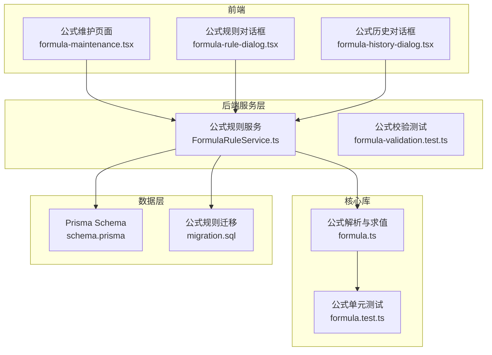
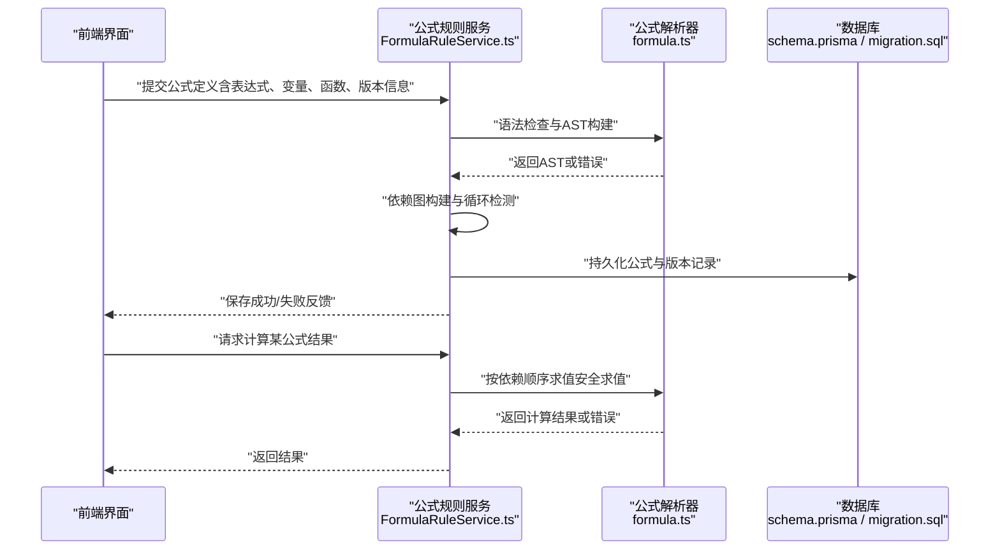
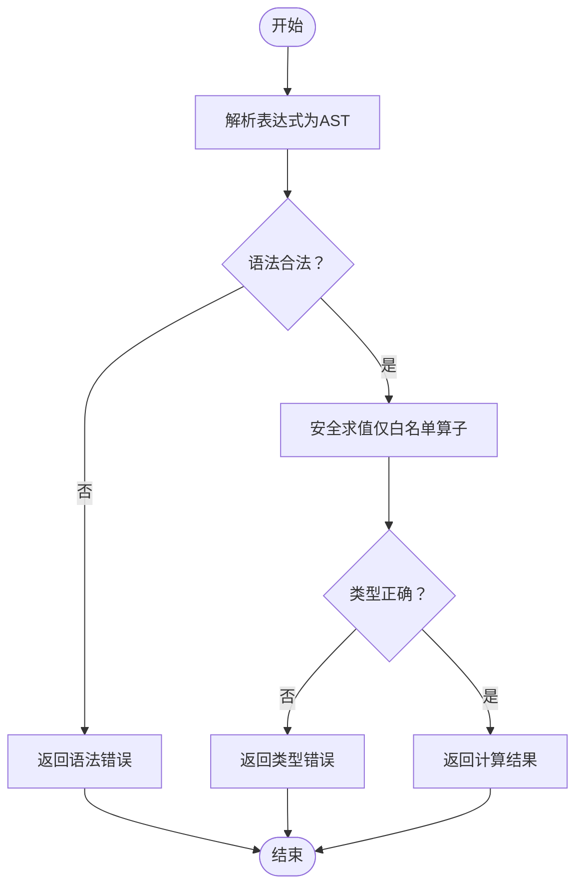
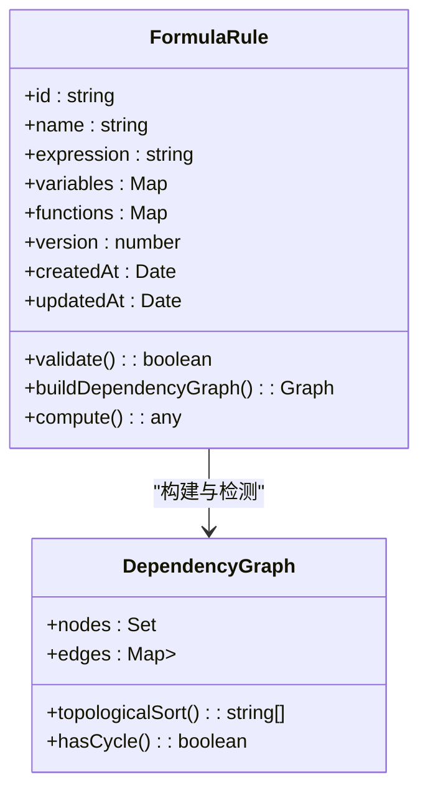
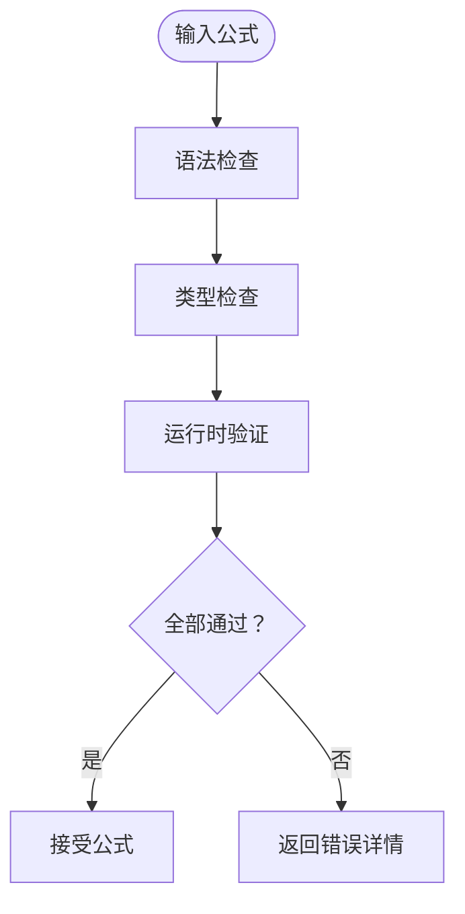
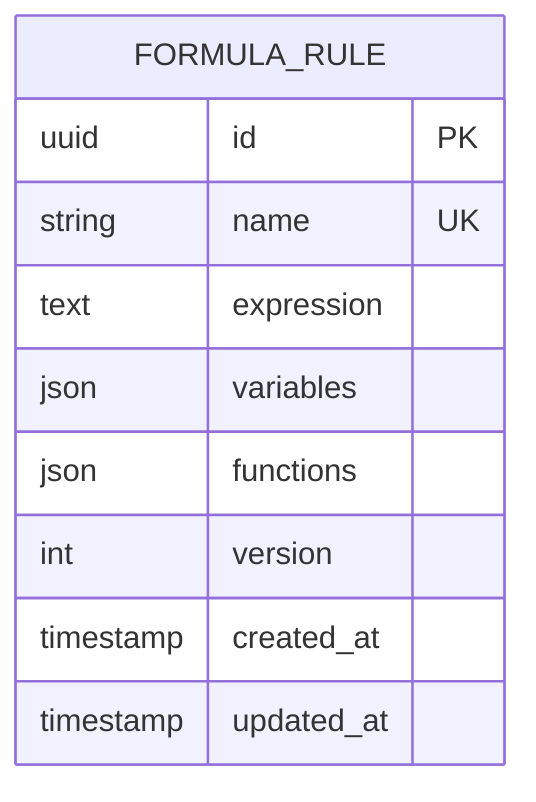
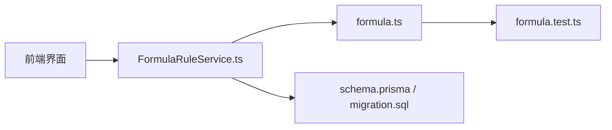

# 公式引擎

<cite>
**本文引用的文件**   
- [server/src/lib/formula.ts](file://server/src/lib/formula.ts)
- [server/src/lib/formula.test.ts](file://server/src/lib/formula.test.ts)
- [server/src/services/FormulaRuleService.ts](file://server/src/services/FormulaRuleService.ts)
- [server/src/services/formula-validation.test.ts](file://server/src/services/formula-validation.test.ts)
- [server/prisma/schema.prisma](file://server/prisma/schema.prisma)
- [server/prisma/migrations/20260722142144_add_formula_rule/migration.sql](file://server/prisma/migrations/20260722142144_add_formula_rule/migration.sql)
- [web/src/pages/data/formula-maintenance.tsx](file://web/src/pages/data/formula-maintenance.tsx)
- [web/src/pages/data/formula-rule-dialog.tsx](file://web/src/pages/data/formula-rule-dialog.tsx)
- [web/src/pages/data/formula-history-dialog.tsx](file://web/src/pages/data/formula-history-dialog.tsx)
</cite>

## 目录
1. [简介](#简介)
2. [项目结构](#项目结构)
3. [核心组件](#核心组件)
4. [架构总览](#架构总览)
5. [详细组件分析](#详细组件分析)
6. [依赖关系分析](#依赖关系分析)
7. [性能考虑](#性能考虑)
8. [故障排查指南](#故障排查指南)
9. [结论](#结论)
10. [附录](#附录)

## 简介
本文件面向“安全公式解析器与公式引擎”的完整实现与使用，覆盖以下关键主题：
- 安全公式解析：白名单算子（+-*/()）实现、语法树构建、表达式求值。
- 公式定义结构：变量引用、函数调用、条件逻辑、嵌套表达式。
- 依赖关系管理：公式间依赖图构建、循环依赖检测、计算顺序优化。
- 版本控制：历史版本管理、变更追踪、兼容性检查。
- 验证机制：语法检查、类型检查、运行时验证。
- 开发指南：自定义函数扩展、调试工具使用。
- 性能优化：缓存机制、增量计算、并行执行。

本项目为浙江壹品慧财年经营数据分析平台，定位“Excel进、看板/报表出”的内部管理口径财务数据平台，单位统一为万元/人民币。计算类指标使用安全公式解析（白名单算子 +-*/()，禁止 eval），同比/环比由后端实时计算不存库。

## 项目结构
围绕公式引擎的核心代码分布在服务端与服务层、数据库模型以及前端维护界面中：
- 服务端公式解析与求值：server/src/lib/formula.ts
- 公式规则服务与校验：server/src/services/FormulaRuleService.ts、server/src/services/formula-validation.test.ts
- 数据库模型与迁移：server/prisma/schema.prisma、server/prisma/migrations/.../add_formula_rule/migration.sql
- 前端公式维护界面：web/src/pages/data/formula-maintenance.tsx、formula-rule-dialog.tsx、formula-history-dialog.tsx

图表来源
- [server/src/lib/formula.ts](file://server/src/lib/formula.ts)
- [server/src/lib/formula.test.ts](file://server/src/lib/formula.test.ts)
- [server/src/services/FormulaRuleService.ts](file://server/src/services/FormulaRuleService.ts)
- [server/src/services/formula-validation.test.ts](file://server/src/services/formula-validation.test.ts)
- [server/prisma/schema.prisma](file://server/prisma/schema.prisma)
- [server/prisma/migrations/20260722142144_add_formula_rule/migration.sql](file://server/prisma/migrations/20260722142144_add_formula_rule/migration.sql)
- [web/src/pages/data/formula-maintenance.tsx](file://web/src/pages/data/formula-maintenance.tsx)
- [web/src/pages/data/formula-rule-dialog.tsx](file://web/src/pages/data/formula-rule-dialog.tsx)
- [web/src/pages/data/formula-history-dialog.tsx](file://web/src/pages/data/formula-history-dialog.tsx)

章节来源
- [server/src/lib/formula.ts](file://server/src/lib/formula.ts)
- [server/src/lib/formula.test.ts](file://server/src/lib/formula.test.ts)
- [server/src/services/FormulaRuleService.ts](file://server/src/services/FormulaRuleService.ts)
- [server/src/services/formula-validation.test.ts](file://server/src/services/formula-validation.test.ts)
- [server/prisma/schema.prisma](file://server/prisma/schema.prisma)
- [server/prisma/migrations/20260722142144_add_formula_rule/migration.sql](file://server/prisma/migrations/20260722142144_add_formula_rule/migration.sql)
- [web/src/pages/data/formula-maintenance.tsx](file://web/src/pages/data/formula-maintenance.tsx)
- [web/src/pages/data/formula-rule-dialog.tsx](file://web/src/pages/data/formula-rule-dialog.tsx)
- [web/src/pages/data/formula-history-dialog.tsx](file://web/src/pages/data/formula-history-dialog.tsx)

## 核心组件
- 安全公式解析器（formula.ts）
  - 白名单算子：仅允许 +、-、*、/ 与括号 ()，拒绝任意代码执行（禁止 eval）。
  - 语法树构建：将字符串表达式解析为 AST，便于静态分析与安全校验。
  - 表达式求值：基于 AST 进行安全求值，支持数值运算与错误处理。
- 公式规则服务（FormulaRuleService.ts）
  - 公式定义与存储：提供公式规则的增删改查、版本管理与历史回溯。
  - 依赖图构建：根据公式中的变量/函数引用构建依赖图，用于计算顺序优化与循环检测。
  - 校验与兼容：在保存/发布时进行语法与类型校验，并做兼容性检查。
- 公式校验（formula-validation.test.ts）
  - 覆盖常见边界场景：非法字符、未定义变量、除零、类型不匹配等。
- 前端维护界面（formula-maintenance.tsx、formula-rule-dialog.tsx、formula-history-dialog.tsx）
  - 公式编辑、保存、版本对比与回滚、依赖可视化与诊断。

章节来源
- [server/src/lib/formula.ts](file://server/src/lib/formula.ts)
- [server/src/services/FormulaRuleService.ts](file://server/src/services/FormulaRuleService.ts)
- [server/src/services/formula-validation.test.ts](file://server/src/services/formula-validation.test.ts)
- [web/src/pages/data/formula-maintenance.tsx](file://web/src/pages/data/formula-maintenance.tsx)
- [web/src/pages/data/formula-rule-dialog.tsx](file://web/src/pages/data/formula-rule-dialog.tsx)
- [web/src/pages/data/formula-history-dialog.tsx](file://web/src/pages/data/formula-history-dialog.tsx)

## 架构总览
下图展示了从前端到后端的公式维护与计算流程，包括解析、校验、依赖图构建与求值。

图表来源
- [server/src/services/FormulaRuleService.ts](file://server/src/services/FormulaRuleService.ts)
- [server/src/lib/formula.ts](file://server/src/lib/formula.ts)
- [server/prisma/schema.prisma](file://server/prisma/schema.prisma)
- [server/prisma/migrations/20260722142144_add_formula_rule/migration.sql](file://server/prisma/migrations/20260722142144_add_formula_rule/migration.sql)

## 详细组件分析

### 安全公式解析器（formula.ts）
- 白名单算子与语法限制
  - 仅允许 +、-、*、/ 与括号 ()，其他符号将被拒绝。
  - 不支持函数调用、条件语句、变量赋值等危险构造。
- 语法树构建
  - 将表达式解析为 AST，节点包含操作符、操作数、括号层级等信息。
  - 构建过程中进行语法合法性校验，提前发现非法字符与结构错误。
- 表达式求值
  - 基于 AST 递归求值，确保只执行受控的算术运算。
  - 错误处理：除零、类型不匹配、未定义变量等均有明确错误路径。

图表来源
- [server/src/lib/formula.ts](file://server/src/lib/formula.ts)

章节来源
- [server/src/lib/formula.ts](file://server/src/lib/formula.ts)
- [server/src/lib/formula.test.ts](file://server/src/lib/formula.test.ts)

### 公式规则服务（FormulaRuleService.ts）
- 公式定义结构
  - 变量引用：通过占位符或命名变量在表达式中引用外部值。
  - 函数调用：受限的内置函数（如四则运算封装），可扩展自定义函数。
  - 条件逻辑：当前阶段以白名单算子为主，复杂条件建议拆分为多步公式。
  - 嵌套表达式：通过括号组织优先级，支持多层嵌套。
- 依赖关系管理
  - 依赖图构建：扫描表达式中的变量/函数引用，生成有向无环图（DAG）。
  - 循环依赖检测：拓扑排序检测环，阻止非法定义。
  - 计算顺序优化：按依赖层次批量计算，减少重复求值。
- 版本控制
  - 历史版本管理：每次保存生成新版本，保留变更轨迹。
  - 兼容性检查：比较新旧版本的变量/函数签名变化，提示潜在破坏性更新。

图表来源
- [server/src/services/FormulaRuleService.ts](file://server/src/services/FormulaRuleService.ts)

章节来源
- [server/src/services/FormulaRuleService.ts](file://server/src/services/FormulaRuleService.ts)

### 公式校验（formula-validation.test.ts）
- 语法检查：非法字符、括号不匹配、运算符滥用等。
- 类型检查：变量类型与期望类型不一致时报错。
- 运行时验证：除零、溢出、空值等边界情况。

图表来源
- [server/src/services/formula-validation.test.ts](file://server/src/services/formula-validation.test.ts)

章节来源
- [server/src/services/formula-validation.test.ts](file://server/src/services/formula-validation.test.ts)

### 数据库模型与迁移（schema.prisma、migration.sql）
- 公式规则表字段设计：标识、名称、表达式、变量映射、函数注册、版本号、时间戳等。
- 迁移脚本：创建/更新公式规则相关表结构，确保版本一致性。

图表来源
- [server/prisma/schema.prisma](file://server/prisma/schema.prisma)
- [server/prisma/migrations/20260722142144_add_formula_rule/migration.sql](file://server/prisma/migrations/20260722142144_add_formula_rule/migration.sql)

章节来源
- [server/prisma/schema.prisma](file://server/prisma/schema.prisma)
- [server/prisma/migrations/20260722142144_add_formula_rule/migration.sql](file://server/prisma/migrations/20260722142144_add_formula_rule/migration.sql)

### 前端公式维护界面（formula-maintenance.tsx、formula-rule-dialog.tsx、formula-history-dialog.tsx）
- 公式编辑与保存：在线编辑器支持语法高亮与即时校验。
- 版本对比与回滚：展示历史版本差异，支持一键回滚。
- 依赖可视化：显示公式间的依赖关系，辅助定位问题。

章节来源
- [web/src/pages/data/formula-maintenance.tsx](file://web/src/pages/data/formula-maintenance.tsx)
- [web/src/pages/data/formula-rule-dialog.tsx](file://web/src/pages/data/formula-rule-dialog.tsx)
- [web/src/pages/data/formula-history-dialog.tsx](file://web/src/pages/data/formula-history-dialog.tsx)

## 依赖关系分析
- 组件耦合与内聚
  - formula.ts 专注解析与求值，低耦合、高内聚。
  - FormulaRuleService.ts 负责业务编排（校验、依赖图、版本控制），对 formula.ts 有直接依赖。
- 外部依赖
  - Prisma 与 PostgreSQL 用于持久化公式定义与版本历史。
  - 前端 React 组件用于交互与可视化。
- 潜在循环依赖
  - 通过依赖图检测避免公式间循环引用，保证 DAG 性质。

图表来源
- [server/src/services/FormulaRuleService.ts](file://server/src/services/FormulaRuleService.ts)
- [server/src/lib/formula.ts](file://server/src/lib/formula.ts)
- [server/src/lib/formula.test.ts](file://server/src/lib/formula.test.ts)
- [server/prisma/schema.prisma](file://server/prisma/schema.prisma)
- [server/prisma/migrations/20260722142144_add_formula_rule/migration.sql](file://server/prisma/migrations/20260722142144_add_formula_rule/migration.sql)

章节来源
- [server/src/services/FormulaRuleService.ts](file://server/src/services/FormulaRuleService.ts)
- [server/src/lib/formula.ts](file://server/src/lib/formula.ts)
- [server/src/lib/formula.test.ts](file://server/src/lib/formula.test.ts)
- [server/prisma/schema.prisma](file://server/prisma/schema.prisma)
- [server/prisma/migrations/20260722142144_add_formula_rule/migration.sql](file://server/prisma/migrations/20260722142144_add_formula_rule/migration.sql)

## 性能考虑
- 缓存机制
  - 对中间结果与常用变量进行缓存，避免重复计算。
  - 缓存失效策略：当依赖变量或函数实现变更时自动失效。
- 增量计算
  - 仅重新计算受影响的子图，降低整体计算成本。
- 并行执行
  - 对无依赖的子树进行并行求值，提升吞吐。
- 内存与并发
  - 控制 AST 大小与缓存容量，防止内存泄漏。
  - 使用线程池或异步任务队列管理并发求值。

[本节为通用指导，无需特定文件来源]

## 故障排查指南
- 常见问题
  - 语法错误：检查括号匹配、运算符位置与非法字符。
  - 类型错误：确认变量类型与期望一致，必要时进行类型转换。
  - 运行时错误：除零、空值、越界等边界情况。
  - 循环依赖：通过依赖图检测并修复引用关系。
- 调试工具
  - 单元测试：利用 formula.test.ts 快速验证解析与求值逻辑。
  - 校验测试：参考 formula-validation.test.ts 覆盖边界场景。
  - 前端诊断：在公式维护界面查看依赖图与错误提示。

章节来源
- [server/src/lib/formula.test.ts](file://server/src/lib/formula.test.ts)
- [server/src/services/formula-validation.test.ts](file://server/src/services/formula-validation.test.ts)
- [web/src/pages/data/formula-maintenance.tsx](file://web/src/pages/data/formula-maintenance.tsx)

## 结论
本公式引擎以“安全优先、可演进、高性能”为核心目标，通过白名单算子与 AST 驱动的安全求值，结合依赖图与版本控制，为财务指标计算提供了可靠基础。建议在后续迭代中持续完善函数扩展、调试能力与性能优化，以满足复杂业务场景需求。

[本节为总结性内容，无需特定文件来源]

## 附录
- 自定义函数扩展指南
  - 在 FormulaRuleService 中注册新函数，确保类型安全与异常处理。
  - 在 formula.ts 中扩展 AST 节点与求值逻辑，保持白名单约束。
- 调试工具使用
  - 使用单元测试框架快速验证解析与求值路径。
  - 在前端界面启用日志输出，定位依赖与计算问题。

[本节为补充说明，无需特定文件来源]