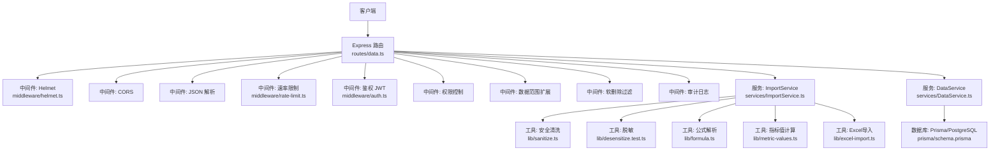
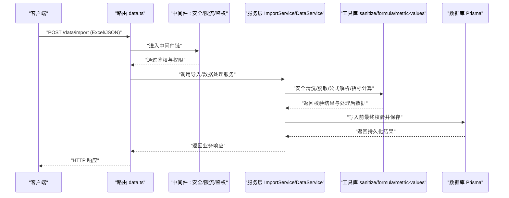
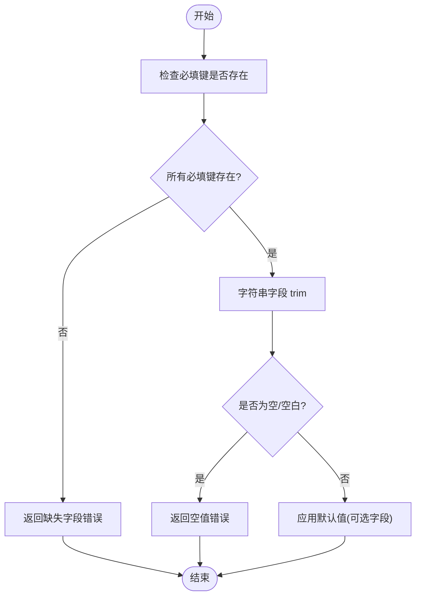
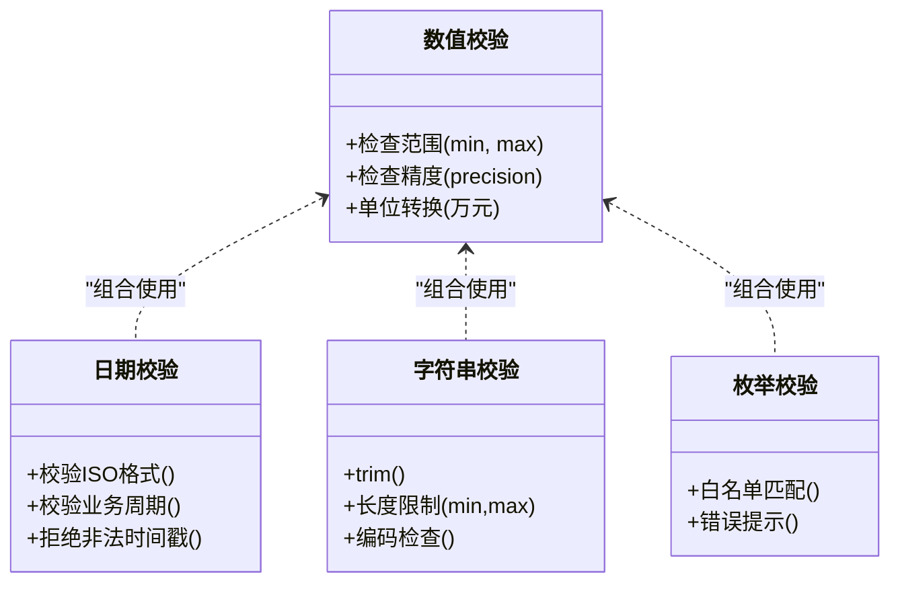
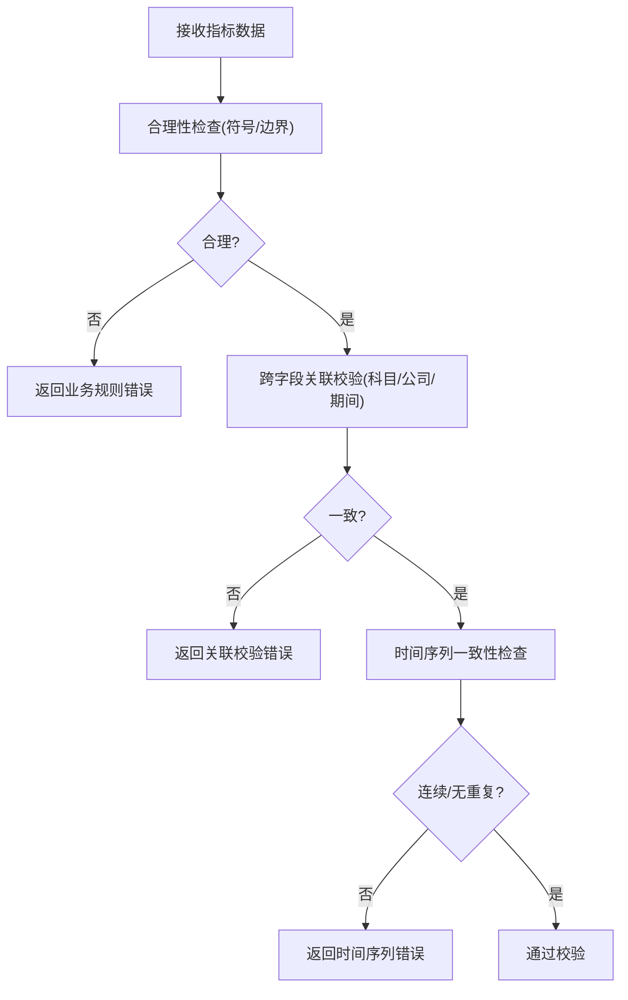
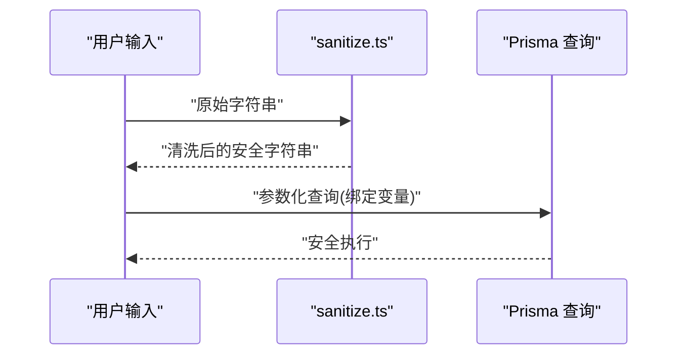
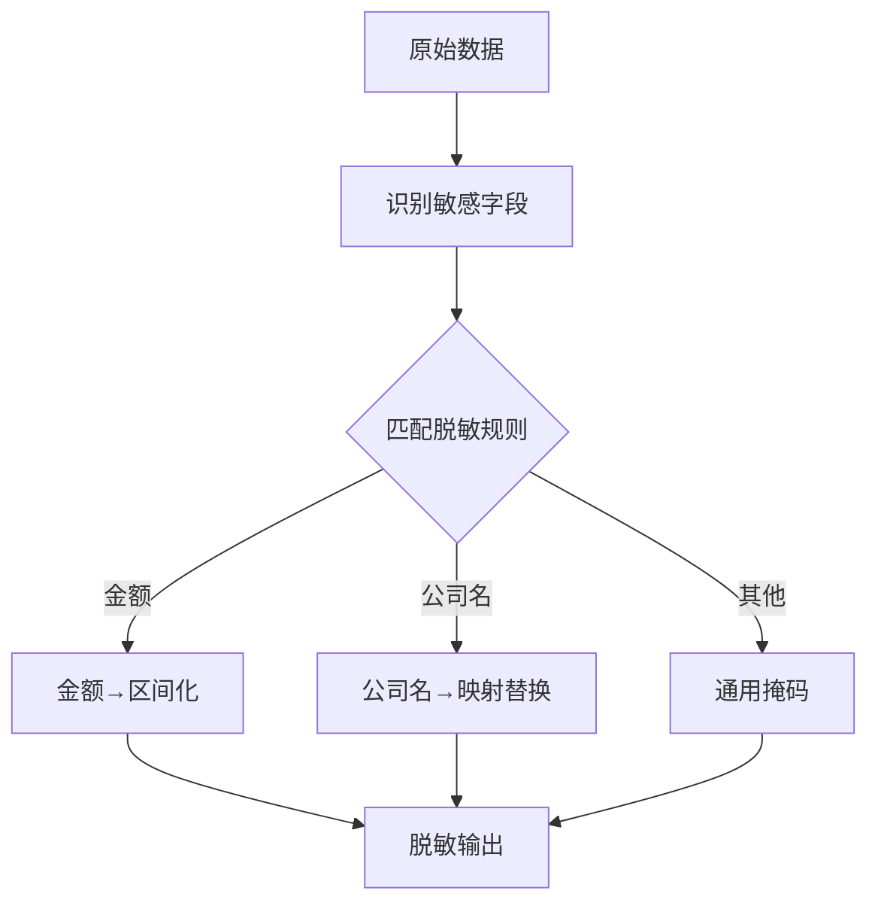
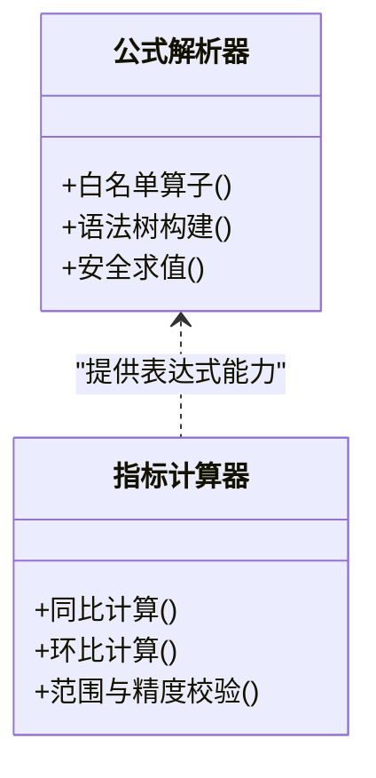
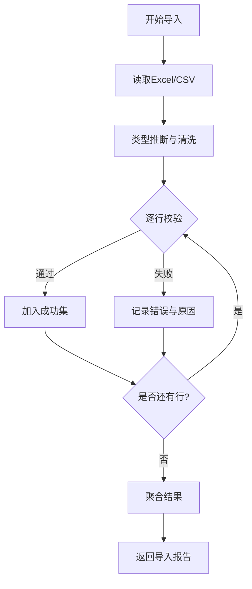
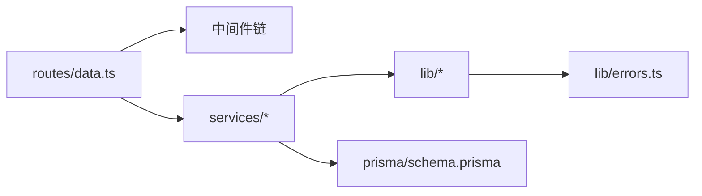

# 数据校验系统

<cite>
**本文引用的文件**   
- [server/src/lib/sanitize.ts](file://server/src/lib/sanitize.ts)
- [server/src/lib/desensitize.test.ts](file://server/src/lib/desensitize.test.ts)
- [server/src/lib/formula.ts](file://server/src/lib/formula.ts)
- [server/src/lib/metric-values.ts](file://server/src/lib/metric-values.ts)
- [server/src/lib/excel-import.ts](file://server/src/lib/excel-import.ts)
- [server/src/lib/schema.ts](file://server/src/lib/schema.ts)
- [server/src/lib/errors.ts](file://server/src/lib/errors.ts)
- [server/src/middleware/auth.ts](file://server/src/middleware/auth.ts)
- [server/src/middleware/rate-limit.ts](file://server/src/middleware/rate-limit.ts)
- [server/src/middleware/helmet.ts](file://server/src/middleware/helmet.ts)
- [server/src/services/ImportService.ts](file://server/src/services/ImportService.ts)
- [server/src/services/DataService.ts](file://server/src/services/DataService.ts)
- [server/src/routes/data.ts](file://server/src/routes/data.ts)
- [server/prisma/schema.prisma](file://server/prisma/schema.prisma)
</cite>

## 目录
1. [简介](#简介)
2. [项目结构](#项目结构)
3. [核心组件](#核心组件)
4. [架构总览](#架构总览)
5. [详细组件分析](#详细组件分析)
6. [依赖关系分析](#依赖关系分析)
7. [性能考虑](#性能考虑)
8. [故障排查指南](#故障排查指南)
9. [结论](#结论)
10. [附录](#附录)

## 简介
本文件面向“浙江壹品慧财年经营数据分析平台”的数据校验子系统，围绕以下目标展开：必填字段验证、数据类型验证、业务规则校验、安全输入处理、数据脱敏机制，并提供配置示例与自定义校验函数实现思路。同时给出大数据量批量校验的性能优化建议与策略。

## 项目结构
后端采用 Express + Prisma + PostgreSQL，中间件链顺序为 helmet → cors → express.json → rate-limit → auth(JWT+黑名单) → permission(默认拒绝) → scope(Prisma extension) → softDelete → audit → Service → Prisma → PostgreSQL。数据校验贯穿请求入口到服务层，关键位置包括：
- 路由层：参数解析与基础格式校验
- 中间件层：安全头、限流、鉴权与权限控制
- 服务层：业务规则校验、跨字段关联校验、时间序列一致性检查
- 工具库：安全清洗、脱敏、公式解析、指标值计算、Excel导入校验

图表来源
- [server/src/routes/data.ts](file://server/src/routes/data.ts)
- [server/src/middleware/helmet.ts](file://server/src/middleware/helmet.ts)
- [server/src/middleware/rate-limit.ts](file://server/src/middleware/rate-limit.ts)
- [server/src/middleware/auth.ts](file://server/src/middleware/auth.ts)
- [server/src/services/ImportService.ts](file://server/src/services/ImportService.ts)
- [server/src/services/DataService.ts](file://server/src/services/DataService.ts)
- [server/src/lib/sanitize.ts](file://server/src/lib/sanitize.ts)
- [server/src/lib/desensitize.test.ts](file://server/src/lib/desensitize.test.ts)
- [server/src/lib/formula.ts](file://server/src/lib/formula.ts)
- [server/src/lib/metric-values.ts](file://server/src/lib/metric-values.ts)
- [server/src/lib/excel-import.ts](file://server/src/lib/excel-import.ts)
- [server/prisma/schema.prisma](file://server/prisma/schema.prisma)

章节来源
- [server/src/routes/data.ts](file://server/src/routes/data.ts)
- [server/src/middleware/helmet.ts](file://server/src/middleware/helmet.ts)
- [server/src/middleware/rate-limit.ts](file://server/src/middleware/rate-limit.ts)
- [server/src/middleware/auth.ts](file://server/src/middleware/auth.ts)
- [server/src/services/ImportService.ts](file://server/src/services/ImportService.ts)
- [server/src/services/DataService.ts](file://server/src/services/DataService.ts)
- [server/src/lib/sanitize.ts](file://server/src/lib/sanitize.ts)
- [server/src/lib/desensitize.test.ts](file://server/src/lib/desensitize.test.ts)
- [server/src/lib/formula.ts](file://server/src/lib/formula.ts)
- [server/src/lib/metric-values.ts](file://server/src/lib/metric-values.ts)
- [server/src/lib/excel-import.ts](file://server/src/lib/excel-import.ts)
- [server/prisma/schema.prisma](file://server/prisma/schema.prisma)

## 核心组件
- 安全清洗（sanitize）：对字符串进行转义与危险字符过滤，防止 SQL 注入与 XSS。
- 脱敏（desensitize）：对敏感信息（金额、公司名等）按规则动态脱敏，支持区间化与映射替换。
- 公式解析（formula）：白名单算子解析表达式，禁止 eval，保障计算安全。
- 指标值计算（metric-values）：同比/环比等计算逻辑，确保数值范围与精度。
- Excel导入（excel-import）：读取、类型推断、行级校验与错误聚合。
- 数据模型（schema）：Prisma 定义字段约束、唯一性、索引等。
- 错误处理（errors）：统一错误码与消息封装。

章节来源
- [server/src/lib/sanitize.ts](file://server/src/lib/sanitize.ts)
- [server/src/lib/desensitize.test.ts](file://server/src/lib/desensitize.test.ts)
- [server/src/lib/formula.ts](file://server/src/lib/formula.ts)
- [server/src/lib/metric-values.ts](file://server/src/lib/metric-values.ts)
- [server/src/lib/excel-import.ts](file://server/src/lib/excel-import.ts)
- [server/src/lib/schema.ts](file://server/src/lib/schema.ts)
- [server/src/lib/errors.ts](file://server/src/lib/errors.ts)
- [server/prisma/schema.prisma](file://server/prisma/schema.prisma)

## 架构总览
数据校验在请求生命周期中的关键节点如下：
- 请求进入：Helmet/CORS/JSON 解析
- 安全与访问控制：速率限制、JWT 鉴权、权限与数据范围
- 业务处理：导入服务或数据服务执行校验与计算
- 持久化：Prisma 写入前再次校验并落库

图表来源
- [server/src/routes/data.ts](file://server/src/routes/data.ts)
- [server/src/middleware/rate-limit.ts](file://server/src/middleware/rate-limit.ts)
- [server/src/middleware/auth.ts](file://server/src/middleware/auth.ts)
- [server/src/services/ImportService.ts](file://server/src/services/ImportService.ts)
- [server/src/services/DataService.ts](file://server/src/services/DataService.ts)
- [server/src/lib/sanitize.ts](file://server/src/lib/sanitize.ts)
- [server/src/lib/formula.ts](file://server/src/lib/formula.ts)
- [server/src/lib/metric-values.ts](file://server/src/lib/metric-values.ts)
- [server/prisma/schema.prisma](file://server/prisma/schema.prisma)

## 详细组件分析

### 必填字段验证
- 字段存在性检查：在服务层对入参对象进行键存在性校验，缺失则返回明确错误。
- 空值判断：对字符串 trim 后判空；对数字/日期进行 NaN/InvalidDate 检测。
- 默认值处理：对可选字段提供默认值，避免下游逻辑出现 undefined。

章节来源
- [server/src/services/ImportService.ts](file://server/src/services/ImportService.ts)
- [server/src/services/DataService.ts](file://server/src/services/DataService.ts)
- [server/src/lib/schema.ts](file://server/src/lib/schema.ts)

### 数据类型验证
- 数值范围检查：对金额、比率、百分比等进行上下界校验，单位统一为万元。
- 日期格式验证：严格校验 ISO 日期或业务约定格式，拒绝非法时间戳。
- 字符串长度限制：对名称、描述等字段设置最小/最大长度。
- 枚举值校验：对状态、类型等字段限定合法取值集合。

章节来源
- [server/src/lib/metric-values.ts](file://server/src/lib/metric-values.ts)
- [server/src/lib/schema.ts](file://server/src/lib/schema.ts)
- [server/src/services/ImportService.ts](file://server/src/services/ImportService.ts)

### 业务规则校验
- 财务指标合理性检查：如收入/成本/利润的符号与大小关系、比率边界。
- 跨字段关联验证：如科目树层级、公司与组织范围、期间一致性。
- 时间序列一致性：同比/环比计算需保证时间维度连续且无重复。

章节来源
- [server/src/services/DataService.ts](file://server/src/services/DataService.ts)
- [server/src/lib/metric-values.ts](file://server/src/lib/metric-values.ts)
- [server/prisma/schema.prisma](file://server/prisma/schema.prisma)

### 安全输入处理
- SQL注入防护：使用参数化查询（Prisma），并对用户输入进行清洗。
- XSS攻击防护：输出前进行 HTML 转义与标签过滤。
- 恶意字符过滤：移除或转义危险字符（如脚本标签、事件属性）。

章节来源
- [server/src/lib/sanitize.ts](file://server/src/lib/sanitize.ts)
- [server/prisma/schema.prisma](file://server/prisma/schema.prisma)

### 数据脱敏机制
- 敏感信息识别：金额、公司名、个人标识等。
- 动态脱敏规则：金额→区间；公司名→动态映射；文本→掩码。
- 隐私保护策略：仅在必要场景暴露，默认脱敏输出。

章节来源
- [server/src/lib/desensitize.test.ts](file://server/src/lib/desensitize.test.ts)
- [server/src/services/ImportService.ts](file://server/src/services/ImportService.ts)

### 公式解析与指标计算
- 安全公式解析：仅允许白名单算子（加减乘除括号），禁止 eval。
- 指标计算：同比/环比实时计算，不存库，确保口径一致。

章节来源
- [server/src/lib/formula.ts](file://server/src/lib/formula.ts)
- [server/src/lib/metric-values.ts](file://server/src/lib/metric-values.ts)

### Excel导入校验流程
- 读取与类型推断：自动推断列类型，处理异常单元格。
- 行级校验：必填、类型、范围、枚举、业务规则。
- 错误聚合：汇总失败行与原因，支持部分成功。

章节来源
- [server/src/lib/excel-import.ts](file://server/src/lib/excel-import.ts)
- [server/src/services/ImportService.ts](file://server/src/services/ImportService.ts)

## 依赖关系分析
- 路由依赖中间件与服务的组合，形成清晰的职责边界。
- 服务层依赖工具库完成具体校验与计算。
- 工具库之间低耦合，便于单元测试与替换实现。
- 数据库层通过 Prisma 提供强类型与约束。

图表来源
- [server/src/routes/data.ts](file://server/src/routes/data.ts)
- [server/src/services/ImportService.ts](file://server/src/services/ImportService.ts)
- [server/src/services/DataService.ts](file://server/src/services/DataService.ts)
- [server/src/lib/sanitize.ts](file://server/src/lib/sanitize.ts)
- [server/src/lib/formula.ts](file://server/src/lib/formula.ts)
- [server/src/lib/metric-values.ts](file://server/src/lib/metric-values.ts)
- [server/src/lib/excel-import.ts](file://server/src/lib/excel-import.ts)
- [server/src/lib/errors.ts](file://server/src/lib/errors.ts)
- [server/prisma/schema.prisma](file://server/prisma/schema.prisma)

章节来源
- [server/src/routes/data.ts](file://server/src/routes/data.ts)
- [server/src/services/ImportService.ts](file://server/src/services/ImportService.ts)
- [server/src/services/DataService.ts](file://server/src/services/DataService.ts)
- [server/src/lib/sanitize.ts](file://server/src/lib/sanitize.ts)
- [server/src/lib/formula.ts](file://server/src/lib/formula.ts)
- [server/src/lib/metric-values.ts](file://server/src/lib/metric-values.ts)
- [server/src/lib/excel-import.ts](file://server/src/lib/excel-import.ts)
- [server/src/lib/errors.ts](file://server/src/lib/errors.ts)
- [server/prisma/schema.prisma](file://server/prisma/schema.prisma)

## 性能考虑
- 批量校验策略：
  - 分块处理：将大文件拆分为固定大小的批次，降低内存峰值。
  - 并行校验：对独立行使用并发队列（限制并发度）提升吞吐。
  - 短路失败：遇到致命错误立即中断并返回，减少无效计算。
- 缓存与复用：
  - 枚举与字典预加载，避免重复查询。
  - 公式解析结果缓存（相同表达式复用 AST）。
- 数据库优化：
  - 批量插入/更新，减少往返次数。
  - 使用事务包裹整批操作，保证一致性。
- 资源控制：
  - 速率限制与超时控制，防止雪崩。
  - 日志采样与结构化输出，降低 IO 压力。

[本节为通用性能指导，不直接分析具体文件]

## 故障排查指南
- 常见错误定位：
  - 必填字段缺失：检查入参结构与默认值处理。
  - 类型不匹配：确认类型推断与转换逻辑。
  - 业务规则失败：核对财务指标合理性、跨字段关联与时间序列。
  - 安全清洗失败：查看清洗规则与白名单配置。
  - 脱敏异常：检查敏感字段识别与规则映射。
- 调试建议：
  - 启用结构化日志，记录入参与校验步骤。
  - 使用测试用例覆盖边界条件与异常路径。
  - 对导入任务生成错误报告，包含行号与原因。

章节来源
- [server/src/lib/errors.ts](file://server/src/lib/errors.ts)
- [server/src/services/ImportService.ts](file://server/src/services/ImportService.ts)
- [server/src/services/DataService.ts](file://server/src/services/DataService.ts)

## 结论
本数据校验系统以“安全优先、规则清晰、可观测可维护”为原则，贯穿从请求入口到持久化的全链路。通过安全清洗、脱敏、公式解析与指标计算等工具库，结合服务层的业务规则与跨字段校验，确保数据质量与安全。配合批量校验与性能优化策略，可在大数据量场景下保持稳定与高效。

[本节为总结性内容，不直接分析具体文件]

## 附录

### 校验规则配置示例（概念性）
- 必填字段清单：字段名、是否必填、默认值、错误提示。
- 类型与范围：字段名、类型、最小/最大值、精度、单位。
- 日期格式：字段名、格式模板、时区、合法性规则。
- 字符串限制：字段名、最小/最大长度、编码要求。
- 枚举白名单：字段名、允许值集合、错误提示。
- 业务规则：指标合理性阈值、跨字段关联约束、时间序列连续性。
- 安全清洗：危险字符列表、转义策略、输出净化。
- 脱敏规则：敏感字段识别、脱敏方式（区间/映射/掩码）、适用场景。

[本节为概念性配置说明，不直接分析具体文件]

### 自定义校验函数实现（概念性）
- 输入：待校验对象或数组
- 输出：校验结果（通过/失败及原因）
- 步骤：
  - 遍历字段，执行存在性与空值检查
  - 执行类型与范围校验
  - 执行业务规则校验（含跨字段与时间序列）
  - 执行安全清洗与脱敏
  - 聚合错误并返回

[本节为概念性实现说明，不直接分析具体文件]