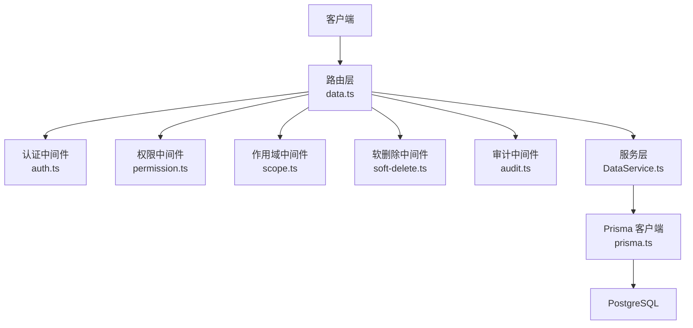
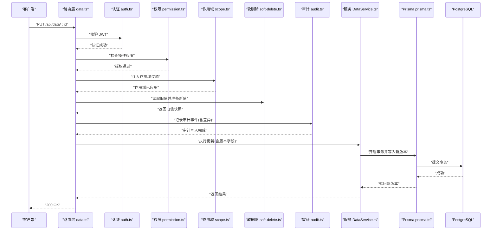
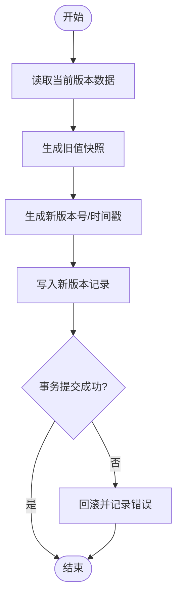
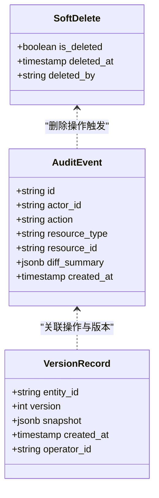
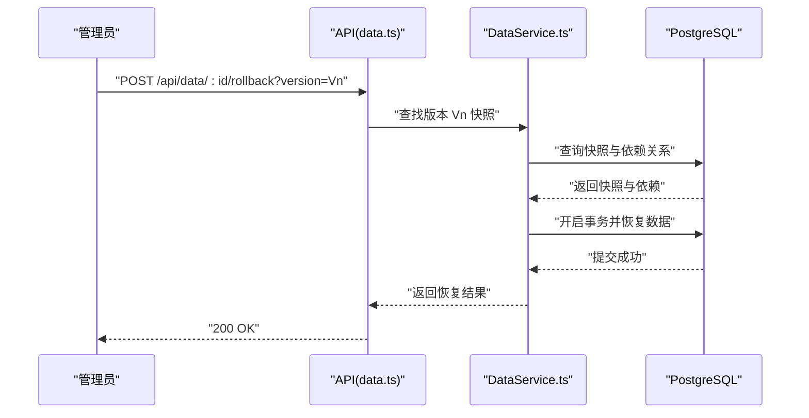
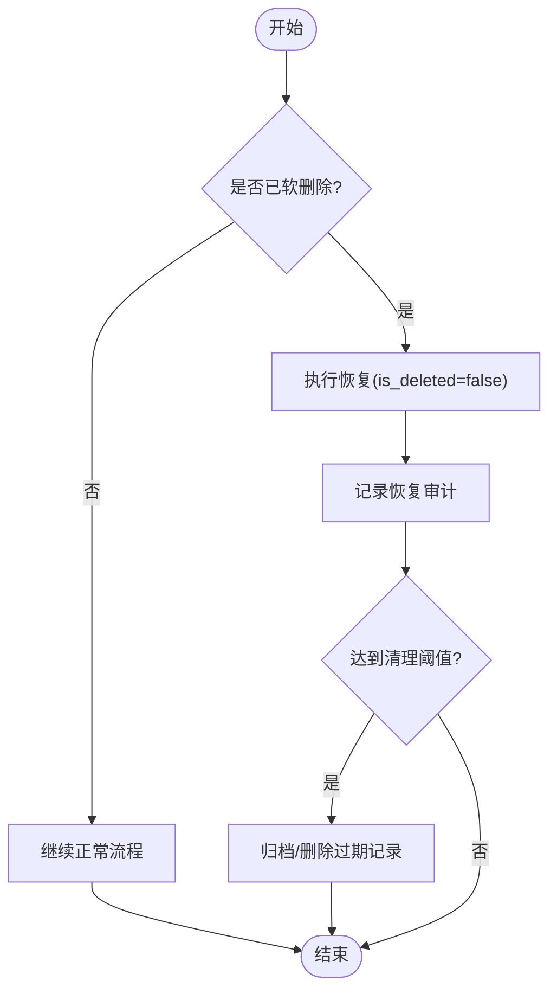
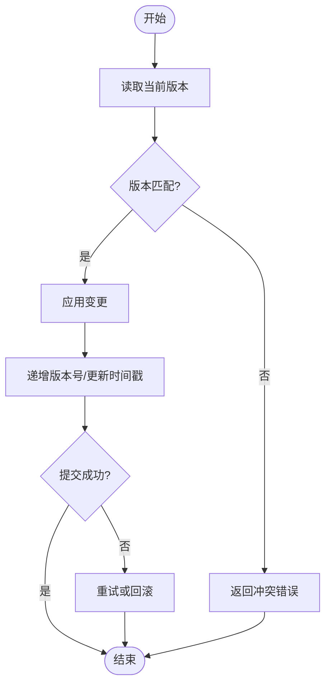
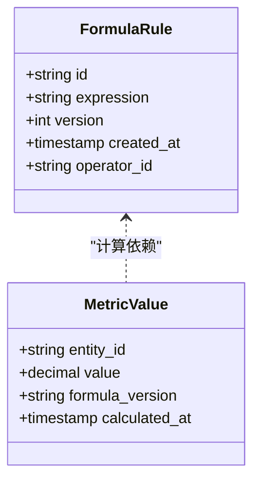
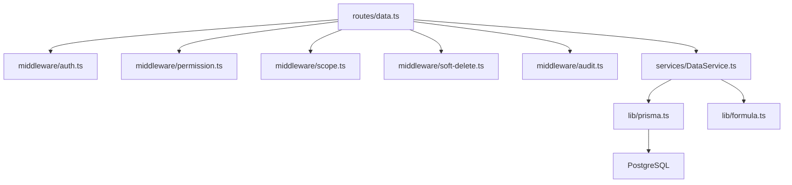

# 数据版本控制

<cite>
**本文引用的文件**   
- [server/src/middleware/soft-delete.ts](file://server/src/middleware/soft-delete.ts)
- [server/src/middleware/audit.ts](file://server/src/middleware/audit.ts)
- [server/src/lib/prisma.ts](file://server/src/lib/prisma.ts)
- [server/prisma/schema.prisma](file://server/prisma/schema.prisma)
- [server/prisma/migrations/20260722121714_init/migration.sql](file://server/prisma/migrations/20260722121714_init/migration.sql)
- [server/prisma/init-audit.sql](file://server/prisma/init-audit.sql)
- [server/src/services/DataService.ts](file://server/src/services/DataService.ts)
- [server/src/routes/data.ts](file://server/src/routes/data.ts)
- [server/src/middleware/auth.ts](file://server/src/middleware/auth.ts)
- [server/src/middleware/scope.ts](file://server/src/middleware/scope.ts)
- [server/src/lib/formula.ts](file://server/src/lib/formula.ts)
- [server/src/lib/errors.ts](file://server/src/lib/errors.ts)
</cite>

## 目录
1. [简介](#简介)
2. [项目结构](#项目结构)
3. [核心组件](#核心组件)
4. [架构总览](#架构总览)
5. [详细组件分析](#详细组件分析)
6. [依赖关系分析](#依赖关系分析)
7. [性能考虑](#性能考虑)
8. [故障排查指南](#故障排查指南)
9. [结论](#结论)
10. [附录：完整操作示例](#附录完整操作示例)

## 简介
本文件面向“浙江壹品慧财年经营数据分析平台”的数据版本控制设计与实现，围绕历史版本管理、变更追踪、回滚机制、软删除策略与版本冲突解决展开，并结合现有代码库中的中间件、服务层与数据库迁移进行落地说明。文档同时提供可操作的版本查询、比较与恢复示例，以及索引与存储优化建议，帮助读者在保障一致性与可审计性的前提下高效演进数据模型与业务数据。

## 项目结构
后端采用 Express + Prisma + PostgreSQL 的三层架构，关键路径包括路由层（routes）、中间件链（middleware）、服务层（services）与数据访问（Prisma）。与版本控制直接相关的模块集中在：
- 软删除中间件：为表级逻辑删除提供统一能力
- 审计中间件：记录操作日志与用户行为
- Prisma 扩展与权限作用域：基于 scope 的细粒度数据隔离
- 公式解析器：安全计算指标，避免运行时风险
- 错误处理：统一的异常与错误码

**图表来源**
- [server/src/routes/data.ts](file://server/src/routes/data.ts)
- [server/src/middleware/auth.ts](file://server/src/middleware/auth.ts)
- [server/src/middleware/scope.ts](file://server/src/middleware/scope.ts)
- [server/src/middleware/soft-delete.ts](file://server/src/middleware/soft-delete.ts)
- [server/src/middleware/audit.ts](file://server/src/middleware/audit.ts)
- [server/src/services/DataService.ts](file://server/src/services/DataService.ts)
- [server/src/lib/prisma.ts](file://server/src/lib/prisma.ts)

**章节来源**
- [server/src/middleware/soft-delete.ts](file://server/src/middleware/soft-delete.ts)
- [server/src/middleware/audit.ts](file://server/src/middleware/audit.ts)
- [server/src/lib/prisma.ts](file://server/src/lib/prisma.ts)
- [server/prisma/schema.prisma](file://server/prisma/schema.prisma)
- [server/prisma/migrations/20260722121714_init/migration.sql](file://server/prisma/migrations/20260722121714_init/migration.sql)
- [server/prisma/init-audit.sql](file://server/prisma/init-audit.sql)
- [server/src/services/DataService.ts](file://server/src/services/DataService.ts)
- [server/src/routes/data.ts](file://server/src/routes/data.ts)
- [server/src/middleware/auth.ts](file://server/src/middleware/auth.ts)
- [server/src/middleware/scope.ts](file://server/src/middleware/scope.ts)
- [server/src/lib/formula.ts](file://server/src/lib/formula.ts)
- [server/src/lib/errors.ts](file://server/src/lib/errors.ts)

## 核心组件
- 软删除中间件：为受支持表注入 is_deleted 标记与过滤条件，确保删除为逻辑删除，便于恢复与审计。
- 审计中间件：捕获请求上下文（用户、动作、资源、差异摘要），写入审计日志表，支撑合规与回溯。
- Prisma 客户端与作用域：通过 Prisma extension 注入租户/组织范围，限制数据可见性，降低越权风险。
- 公式解析器：以白名单算子实现安全计算，避免 eval 风险，保证指标一致性。
- 错误处理：集中定义错误类型与响应格式，便于上层统一处理与降级。

**章节来源**
- [server/src/middleware/soft-delete.ts](file://server/src/middleware/soft-delete.ts)
- [server/src/middleware/audit.ts](file://server/src/middleware/audit.ts)
- [server/src/lib/prisma.ts](file://server/src/lib/prisma.ts)
- [server/src/middleware/scope.ts](file://server/src/middleware/scope.ts)
- [server/src/lib/formula.ts](file://server/src/lib/formula.ts)
- [server/src/lib/errors.ts](file://server/src/lib/errors.ts)

## 架构总览
下图展示一次数据更新的生命周期，涵盖认证、权限、作用域、软删除、审计、服务层与数据库事务，体现版本控制的入口与落点。

**图表来源**
- [server/src/routes/data.ts](file://server/src/routes/data.ts)
- [server/src/middleware/auth.ts](file://server/src/middleware/auth.ts)
- [server/src/middleware/scope.ts](file://server/src/middleware/scope.ts)
- [server/src/middleware/soft-delete.ts](file://server/src/middleware/soft-delete.ts)
- [server/src/middleware/audit.ts](file://server/src/middleware/audit.ts)
- [server/src/services/DataService.ts](file://server/src/services/DataService.ts)
- [server/src/lib/prisma.ts](file://server/src/lib/prisma.ts)

## 详细组件分析

### 历史版本管理：快照、标识与时间戳
- 数据快照机制：在每次写操作前，由软删除中间件或审计中间件生成旧值快照，作为版本基线；后续变更以增量形式追加到版本表或主表的版本列中。
- 版本标识：使用自增版本号或单调递增的时间戳作为版本键，结合实体主键形成唯一复合键，确保同一实体的版本序列不重复。
- 时间戳记录：所有版本记录均包含创建时间、修改时间与操作人信息，便于按时间轴检索与对比。

**图表来源**
- [server/src/middleware/soft-delete.ts](file://server/src/middleware/soft-delete.ts)
- [server/src/middleware/audit.ts](file://server/src/middleware/audit.ts)
- [server/src/services/DataService.ts](file://server/src/services/DataService.ts)
- [server/src/lib/prisma.ts](file://server/src/lib/prisma.ts)

**章节来源**
- [server/prisma/schema.prisma](file://server/prisma/schema.prisma)
- [server/prisma/migrations/20260722121714_init/migration.sql](file://server/prisma/migrations/20260722121714_init/migration.sql)
- [server/prisma/init-audit.sql](file://server/prisma/init-audit.sql)

### 变更追踪系统：操作日志、审计与差异对比
- 操作日志记录：审计中间件在请求进入时捕获用户、动作、资源标识与参数摘要，并在写操作完成后记录结果状态。
- 用户行为审计：将操作主体（用户ID、角色、IP）与操作对象（实体类型、主键）关联，形成可追溯的行为链。
- 数据差异对比：对旧值与新值进行结构化对比，输出差异摘要（新增、修改、删除字段），用于前端展示与审计报表。

**图表来源**
- [server/prisma/init-audit.sql](file://server/prisma/init-audit.sql)
- [server/src/middleware/audit.ts](file://server/src/middleware/audit.ts)
- [server/src/middleware/soft-delete.ts](file://server/src/middleware/soft-delete.ts)

**章节来源**
- [server/src/middleware/audit.ts](file://server/src/middleware/audit.ts)
- [server/prisma/init-audit.sql](file://server/prisma/init-audit.sql)

### 回滚机制实现：版本恢复、级联更新与事务回滚
- 版本恢复：根据目标版本号定位快照，重建实体状态；若存在依赖关系，需先验证引用完整性再恢复。
- 级联更新：当被恢复的实体被其他实体引用时，应同步更新相关版本或触发下游重算（如指标聚合）。
- 事务回滚：所有写操作必须包裹在事务中，失败时自动回滚，保证原子性与一致性。

**图表来源**
- [server/src/routes/data.ts](file://server/src/routes/data.ts)
- [server/src/services/DataService.ts](file://server/src/services/DataService.ts)
- [server/src/lib/prisma.ts](file://server/src/lib/prisma.ts)

**章节来源**
- [server/src/services/DataService.ts](file://server/src/services/DataService.ts)
- [server/src/lib/prisma.ts](file://server/src/lib/prisma.ts)

### 软删除策略：逻辑删除标记、数据恢复与清理策略
- 逻辑删除标记：通过 is_deleted 字段标记删除状态，查询默认过滤已删除记录，避免误删影响。
- 数据恢复：将 is_deleted 重置为 false，并记录恢复操作至审计日志。
- 清理策略：定期归档或删除超过保留期的软删除记录，释放存储空间。

**图表来源**
- [server/src/middleware/soft-delete.ts](file://server/src/middleware/soft-delete.ts)
- [server/src/middleware/audit.ts](file://server/src/middleware/audit.ts)

**章节来源**
- [server/src/middleware/soft-delete.ts](file://server/src/middleware/soft-delete.ts)
- [server/src/middleware/audit.ts](file://server/src/middleware/audit.ts)

### 版本冲突解决：并发控制、合并策略与冲突检测
- 并发控制：使用乐观锁（版本号或时间戳）防止覆盖写入；写前校验当前版本与期望版本一致。
- 合并策略：针对字段级冲突，采用“最后写入优先”或“字段级合并”，需在服务层明确规则。
- 冲突检测：在服务层比较新旧值，若检测到不一致则返回冲突错误，提示用户重试或手动合并。

**图表来源**
- [server/src/services/DataService.ts](file://server/src/services/DataService.ts)
- [server/src/lib/errors.ts](file://server/src/lib/errors.ts)

**章节来源**
- [server/src/services/DataService.ts](file://server/src/services/DataService.ts)
- [server/src/lib/errors.ts](file://server/src/lib/errors.ts)

### 公式与指标计算的安全版本化
- 安全公式解析：仅允许白名单算子（加减乘除与括号），禁止任意表达式执行，确保计算过程可审计与可重现。
- 指标版本化：公式变更需生成新版本，历史指标计算基于当时版本的公式快照，避免回溯不一致。

**图表来源**
- [server/src/lib/formula.ts](file://server/src/lib/formula.ts)
- [server/prisma/schema.prisma](file://server/prisma/schema.prisma)

**章节来源**
- [server/src/lib/formula.ts](file://server/src/lib/formula.ts)
- [server/prisma/schema.prisma](file://server/prisma/schema.prisma)

## 依赖关系分析
- 路由层依赖认证、权限、作用域、软删除与审计中间件，形成严格的请求处理链。
- 服务层依赖 Prisma 客户端与公式解析器，负责业务逻辑与数据一致性。
- 数据库层通过迁移脚本初始化审计与版本相关表结构。

**图表来源**
- [server/src/routes/data.ts](file://server/src/routes/data.ts)
- [server/src/middleware/auth.ts](file://server/src/middleware/auth.ts)
- [server/src/middleware/scope.ts](file://server/src/middleware/scope.ts)
- [server/src/middleware/soft-delete.ts](file://server/src/middleware/soft-delete.ts)
- [server/src/middleware/audit.ts](file://server/src/middleware/audit.ts)
- [server/src/services/DataService.ts](file://server/src/services/DataService.ts)
- [server/src/lib/prisma.ts](file://server/src/lib/prisma.ts)
- [server/src/lib/formula.ts](file://server/src/lib/formula.ts)

**章节来源**
- [server/src/routes/data.ts](file://server/src/routes/data.ts)
- [server/src/middleware/auth.ts](file://server/src/middleware/auth.ts)
- [server/src/middleware/scope.ts](file://server/src/middleware/scope.ts)
- [server/src/middleware/soft-delete.ts](file://server/src/middleware/soft-delete.ts)
- [server/src/middleware/audit.ts](file://server/src/middleware/audit.ts)
- [server/src/services/DataService.ts](file://server/src/services/DataService.ts)
- [server/src/lib/prisma.ts](file://server/src/lib/prisma.ts)
- [server/src/lib/formula.ts](file://server/src/lib/formula.ts)

## 性能考虑
- 索引设计
  - 为实体主键与版本字段建立复合索引，加速按实体与版本查询。
  - 为审计日志的 actor_id、resource_id、created_at 建立索引，提升审计检索性能。
  - 为 is_deleted 字段建立部分索引，优化软删除过滤查询。
- 存储优化
  - 使用 JSONB 存储快照与差异摘要，减少冗余列，提高灵活性。
  - 对大文本字段启用压缩或分表归档，降低主表体积。
- 查询加速
  - 分页查询时使用游标或基于时间戳的分页，避免深分页开销。
  - 热点数据引入缓存（如 Redis），缩短读路径延迟。
  - 指标计算异步化，避免阻塞主流程。

[本节为通用指导，无需具体文件来源]

## 故障排查指南
- 常见错误
  - 版本冲突：检查并发写入与乐观锁校验逻辑，确认期望版本与当前版本一致。
  - 软删除恢复失败：确认 is_deleted 字段与审计记录是否一致，检查外键约束。
  - 审计缺失：检查审计中间件是否生效，确认数据库写入权限。
- 诊断步骤
  - 查看审计日志表，定位最近操作与差异摘要。
  - 检查 Prisma 事务日志与错误堆栈，确认回滚原因。
  - 核对公式版本与指标计算结果，确保公式未变更导致不一致。

**章节来源**
- [server/src/lib/errors.ts](file://server/src/lib/errors.ts)
- [server/src/middleware/audit.ts](file://server/src/middleware/audit.ts)
- [server/src/lib/prisma.ts](file://server/src/lib/prisma.ts)

## 结论
本项目的数据版本控制在中间件与服务层协同下实现了完整的快照、审计、回滚与软删除能力。通过乐观锁与事务保障一致性，借助审计与公式版本化提升可追溯性与安全性。建议在大规模场景下进一步优化索引与缓存策略，确保高并发下的稳定与性能。

[本节为总结，无需具体文件来源]

## 附录：完整操作示例
以下示例描述典型的数据版本操作流程，涵盖版本查询、比较与恢复。请根据实际接口调整参数与路径。

- 版本查询
  - 获取实体最新版本：GET /api/data/:id/latest
  - 获取指定版本快照：GET /api/data/:id/version?version=Vn
- 版本比较
  - 比较两个版本差异：GET /api/data/:id/diff?v1=Vn&v2=Vm
- 版本恢复
  - 恢复到指定版本：POST /api/data/:id/rollback?version=Vn
- 审计检索
  - 按用户与时间范围检索操作日志：GET /api/audit?actor_id=...&from=...&to=...

[本节为概念性示例，无需具体文件来源]