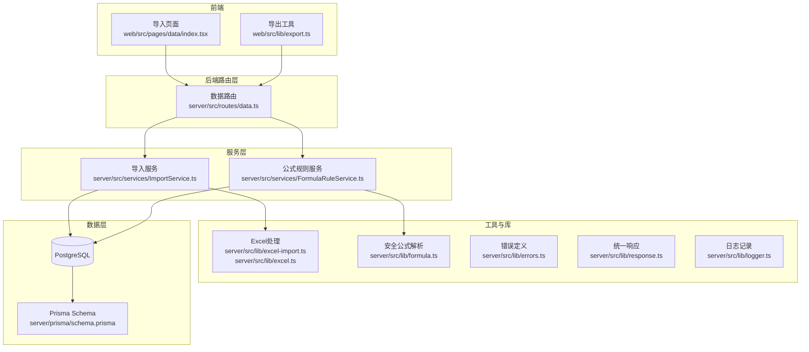
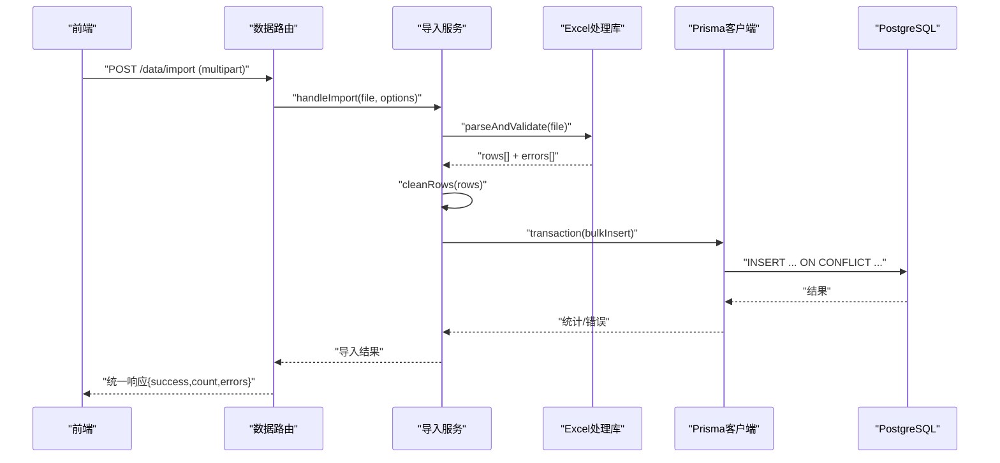
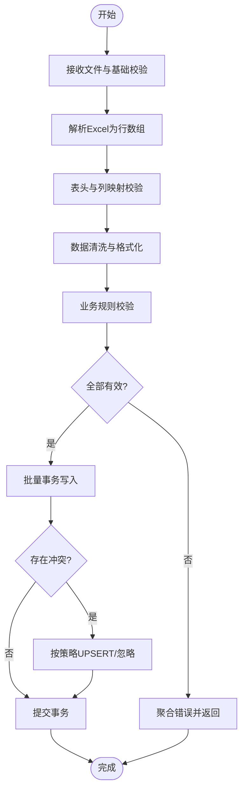
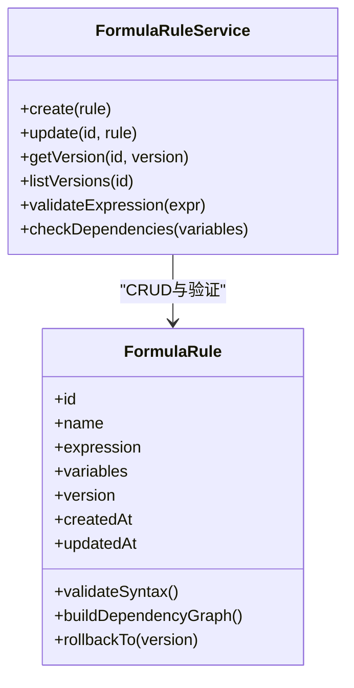
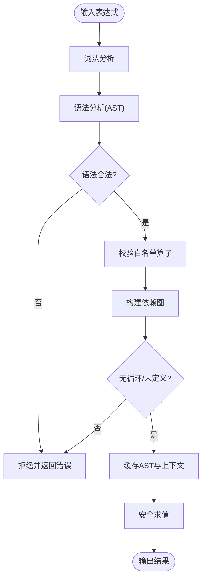
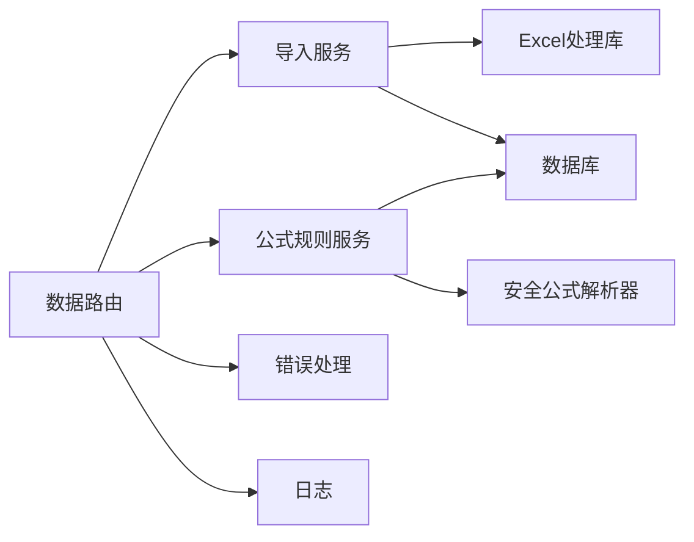

# 数据管理模块

<cite>
**本文引用的文件**   
- [server/src/lib/excel-import.ts](file://server/src/lib/excel-import.ts)
- [server/src/lib/excel.ts](file://server/src/lib/excel.ts)
- [server/src/services/ImportService.ts](file://server/src/services/ImportService.ts)
- [server/src/routes/data.ts](file://server/src/routes/data.ts)
- [server/src/middleware/error-handler.ts](file://server/src/middleware/error-handler.ts)
- [server/src/lib/formula.ts](file://server/src/lib/formula.ts)
- [server/src/services/FormulaRuleService.ts](file://server/src/services/FormulaRuleService.ts)
- [server/prisma/schema.prisma](file://server/prisma/schema.prisma)
- [server/prisma/migrations/20260722142144_add_formula_rule/migration.sql](file://server/prisma/migrations/20260722142144_add_formula_rule/migration.sql)
- [server/src/lib/errors.ts](file://server/src/lib/errors.ts)
- [server/src/lib/logger.ts](file://server/src/lib/logger.ts)
- [server/src/lib/response.ts](file://server/src/lib/response.ts)
- [web/src/pages/data/index.tsx](file://web/src/pages/data/index.tsx)
- [web/src/lib/export.ts](file://web/src/lib/export.ts)
</cite>

## 目录
1. [简介](#简介)
2. [项目结构](#项目结构)
3. [核心组件](#核心组件)
4. [架构总览](#架构总览)
5. [详细组件分析](#详细组件分析)
6. [依赖关系分析](#依赖关系分析)
7. [性能考虑](#性能考虑)
8. [故障排查指南](#故障排查指南)
9. [结论](#结论)
10. [附录](#附录)

## 简介
本模块聚焦“Excel进、看板/报表出”的数据管理能力，覆盖从Excel导入、格式校验、数据清洗、批量插入优化，到公式规则维护与安全解析、数据版本控制与回滚、以及导入导出全流程示例与异常恢复策略。系统后端采用 Express + Prisma + PostgreSQL，计算类指标通过安全公式解析器（白名单算子）实时计算，不直接落库，确保口径一致性与安全性。

## 项目结构
数据管理相关代码主要分布在服务端 lib、services、routes、prisma 以及前端 pages 与 lib 中：
- Excel 导入与处理：lib/excel-import.ts、lib/excel.ts、services/ImportService.ts、routes/data.ts
- 公式规则与维护：lib/formula.ts、services/FormulaRuleService.ts、prisma schema 与迁移
- 错误与日志：middleware/error-handler.ts、lib/errors.ts、lib/logger.ts、lib/response.ts
- 前端导入导出：web/src/pages/data/index.tsx、web/src/lib/export.ts

图表来源
- [server/src/routes/data.ts](file://server/src/routes/data.ts)
- [server/src/services/ImportService.ts](file://server/src/services/ImportService.ts)
- [server/src/services/FormulaRuleService.ts](file://server/src/services/FormulaRuleService.ts)
- [server/src/lib/excel-import.ts](file://server/src/lib/excel-import.ts)
- [server/src/lib/excel.ts](file://server/src/lib/excel.ts)
- [server/src/lib/formula.ts](file://server/src/lib/formula.ts)
- [server/prisma/schema.prisma](file://server/prisma/schema.prisma)

章节来源
- [server/src/routes/data.ts](file://server/src/routes/data.ts)
- [server/src/services/ImportService.ts](file://server/src/services/ImportService.ts)
- [server/src/services/FormulaRuleService.ts](file://server/src/services/FormulaRuleService.ts)
- [server/src/lib/excel-import.ts](file://server/src/lib/excel-import.ts)
- [server/src/lib/excel.ts](file://server/src/lib/excel.ts)
- [server/src/lib/formula.ts](file://server/src/lib/formula.ts)
- [server/prisma/schema.prisma](file://server/prisma/schema.prisma)

## 核心组件
- Excel 导入处理器：负责文件上传接收、格式校验、数据清洗、批量写入数据库。
- 导入服务：编排导入流程，协调校验、清洗、事务与重试、错误聚合。
- 公式规则服务：维护公式定义、语法验证、依赖关系管理与版本历史。
- 安全公式解析器：基于白名单算子的表达式解析与求值，防止代码注入并优化性能。
- 错误与响应：统一错误类型、HTTP状态码映射、结构化响应体。
- 日志：关键操作审计与问题定位。

章节来源
- [server/src/lib/excel-import.ts](file://server/src/lib/excel-import.ts)
- [server/src/services/ImportService.ts](file://server/src/services/ImportService.ts)
- [server/src/services/FormulaRuleService.ts](file://server/src/services/FormulaRuleService.ts)
- [server/src/lib/formula.ts](file://server/src/lib/formula.ts)
- [server/src/lib/errors.ts](file://server/src/lib/errors.ts)
- [server/src/lib/response.ts](file://server/src/lib/response.ts)
- [server/src/lib/logger.ts](file://server/src/lib/logger.ts)

## 架构总览
整体调用链遵循中间件顺序：helmet → cors → express.json → rate-limit → auth(JWT+黑名单) → permission(默认拒绝) → scope(Prisma extension) → softDelete → audit → Service → Prisma → PostgreSQL。数据导入与公式维护均在此链路下执行，保证鉴权、权限、范围与审计。

图表来源
- [server/src/routes/data.ts](file://server/src/routes/data.ts)
- [server/src/services/ImportService.ts](file://server/src/services/ImportService.ts)
- [server/src/lib/excel-import.ts](file://server/src/lib/excel-import.ts)
- [server/prisma/schema.prisma](file://server/prisma/schema.prisma)

## 详细组件分析

### Excel 导入处理流程
- 文件上传与格式验证
  - 支持常见Excel扩展名与MIME类型校验，限制文件大小与Sheet数量。
  - 表头标准化与列映射，缺失列或非法列名触发字段级错误。
- 数据清洗
  - 去除空白字符、统一日期/数值格式、空值填充策略、去重与重复行合并。
  - 业务规则校验：必填字段检查、数据类型验证、取值范围与枚举校验。
- 批量插入优化
  - 使用Prisma事务分批写入，避免单条插入开销；冲突时按策略更新或忽略。
  - 失败行隔离与错误聚合，返回明细以便前端展示与下载。

图表来源
- [server/src/lib/excel-import.ts](file://server/src/lib/excel-import.ts)
- [server/src/lib/excel.ts](file://server/src/lib/excel.ts)
- [server/src/services/ImportService.ts](file://server/src/services/ImportService.ts)

章节来源
- [server/src/lib/excel-import.ts](file://server/src/lib/excel-import.ts)
- [server/src/lib/excel.ts](file://server/src/lib/excel.ts)
- [server/src/services/ImportService.ts](file://server/src/services/ImportService.ts)

### 数据校验规则
- 必填字段检查：对关键字段进行非空校验，缺失则标记错误并跳过该行。
- 数据类型验证：字符串、数字、日期等类型转换与边界检查。
- 业务规则校验：单位统一（万元）、区间约束、枚举值、跨行一致性（如科目树层级）。
- 错误聚合：逐行错误收集，支持下载错误报告与定位问题。

章节来源
- [server/src/lib/excel-import.ts](file://server/src/lib/excel-import.ts)
- [server/src/services/ImportService.ts](file://server/src/services/ImportService.ts)

### 公式规则维护系统
- 公式定义：以结构化方式存储公式模板、变量映射、适用场景与版本信息。
- 语法验证：基于安全解析器的语法检查，确保仅允许白名单算子与函数。
- 依赖关系管理：构建变量/指标间的依赖图，检测循环依赖与未定义引用。
- 版本控制：每次变更生成新版本，保留历史快照，支持对比与回滚。

图表来源
- [server/src/services/FormulaRuleService.ts](file://server/src/services/FormulaRuleService.ts)
- [server/prisma/schema.prisma](file://server/prisma/schema.prisma)
- [server/prisma/migrations/20260722142144_add_formula_rule/migration.sql](file://server/prisma/migrations/20260722142144_add_formula_rule/migration.sql)

章节来源
- [server/src/services/FormulaRuleService.ts](file://server/src/services/FormulaRuleService.ts)
- [server/prisma/schema.prisma](file://server/prisma/schema.prisma)
- [server/prisma/migrations/20260722142144_add_formula_rule/migration.sql](file://server/prisma/migrations/20260722142144_add_formula_rule/migration.sql)

### 安全公式解析器
- 白名单算子：仅允许 +-*/() 及必要常量，禁止 eval 与任意代码执行。
- 语法验证：AST构建阶段校验表达式合法性，提前拦截非法输入。
- 依赖关系管理：解析变量引用，构建依赖图，检测循环与未定义。
- 性能优化：缓存已编译的表达式AST，复用求值上下文，减少重复解析。

图表来源
- [server/src/lib/formula.ts](file://server/src/lib/formula.ts)

章节来源
- [server/src/lib/formula.ts](file://server/src/lib/formula.ts)

### 数据版本控制
- 历史版本管理：每次公式或导入配置变更生成新版本，记录元数据与差异。
- 变更追踪：记录操作人、时间戳、变更内容摘要，便于审计与回溯。
- 回滚机制：支持一键回滚至指定版本，保证业务连续性。

章节来源
- [server/src/services/FormulaRuleService.ts](file://server/src/services/FormulaRuleService.ts)
- [server/prisma/schema.prisma](file://server/prisma/schema.prisma)

### 数据导入导出完整示例
- 导入示例
  - 前端选择Excel文件，发起上传请求。
  - 后端接收后执行格式校验、数据清洗、业务规则校验。
  - 批量事务写入数据库，返回成功计数与错误明细。
  - 若失败，提供错误文件下载与重试入口。
- 导出示例
  - 前端根据筛选条件发起导出请求。
  - 后端查询数据并生成Excel流式响应。
  - 前端接收并保存文件，支持进度提示与错误处理。

章节来源
- [server/src/routes/data.ts](file://server/src/routes/data.ts)
- [server/src/services/ImportService.ts](file://server/src/services/ImportService.ts)
- [web/src/pages/data/index.tsx](file://web/src/pages/data/index.tsx)
- [web/src/lib/export.ts](file://web/src/lib/export.ts)

## 依赖关系分析
- 路由层依赖服务层，服务层依赖工具库与数据层。
- 公式规则服务依赖安全公式解析器与数据库。
- 导入服务依赖Excel处理库与数据库事务能力。
- 错误与日志贯穿各层，保障可观测性。

图表来源
- [server/src/routes/data.ts](file://server/src/routes/data.ts)
- [server/src/services/ImportService.ts](file://server/src/services/ImportService.ts)
- [server/src/services/FormulaRuleService.ts](file://server/src/services/FormulaRuleService.ts)
- [server/src/lib/excel-import.ts](file://server/src/lib/excel-import.ts)
- [server/src/lib/formula.ts](file://server/src/lib/formula.ts)

章节来源
- [server/src/routes/data.ts](file://server/src/routes/data.ts)
- [server/src/services/ImportService.ts](file://server/src/services/ImportService.ts)
- [server/src/services/FormulaRuleService.ts](file://server/src/services/FormulaRuleService.ts)
- [server/src/lib/excel-import.ts](file://server/src/lib/excel-import.ts)
- [server/src/lib/formula.ts](file://server/src/lib/formula.ts)

## 性能考虑
- 导入性能
  - 使用Prisma事务批量写入，减少网络往返与锁竞争。
  - 分片处理大文件，避免内存峰值过高。
  - 预校验与快速失败，尽早返回错误，降低无效计算。
- 公式解析性能
  - 缓存AST与求值上下文，避免重复解析。
  - 限制表达式复杂度与变量数量，防止恶意构造。
- 数据库优化
  - 合理索引设计，提升查询与冲突检测效率。
  - 使用UPSERT策略减少重复写入成本。
- 前端体验
  - 分块上传与进度反馈，提升用户感知。
  - 错误文件下载与重试机制，提高成功率。

[本节为通用指导，无需特定文件来源]

## 故障排查指南
- 常见问题
  - 文件格式不支持或损坏：检查扩展名与MIME类型，确认文件完整性。
  - 表头不匹配：核对列映射与命名规范，必要时提供模板。
  - 数据类型错误：检查日期、数值格式，统一单位与精度。
  - 业务规则失败：查看错误明细，修正数据后再试。
- 错误处理
  - 统一错误类型与HTTP状态码映射，便于前端处理。
  - 结构化响应体包含错误详情与建议修复步骤。
- 日志与审计
  - 关键操作记录日志，包括用户、时间、参数与结果。
  - 结合审计中间件追踪变更与访问。

章节来源
- [server/src/middleware/error-handler.ts](file://server/src/middleware/error-handler.ts)
- [server/src/lib/errors.ts](file://server/src/lib/errors.ts)
- [server/src/lib/logger.ts](file://server/src/lib/logger.ts)
- [server/src/lib/response.ts](file://server/src/lib/response.ts)

## 结论
本数据管理模块围绕Excel导入与公式规则维护构建了完整闭环，兼顾安全性、性能与可维护性。通过严格校验、批量优化、安全解析与版本控制，确保数据口径一致与系统稳定。未来可进一步引入异步任务队列、增量导入与更细粒度的权限控制，以提升大规模数据处理能力与用户体验。

[本节为总结，无需特定文件来源]

## 附录
- 术语表
  - 白名单算子：仅允许的运算符集合，用于限制表达式能力。
  - UPSERT：插入或更新操作，避免重复数据。
  - AST：抽象语法树，用于表达式解析与验证。
- 参考链接
  - 中间件执行链说明见项目文档。
  - 数据库模式与迁移见Prisma目录。

[本节为补充信息，无需特定文件来源]