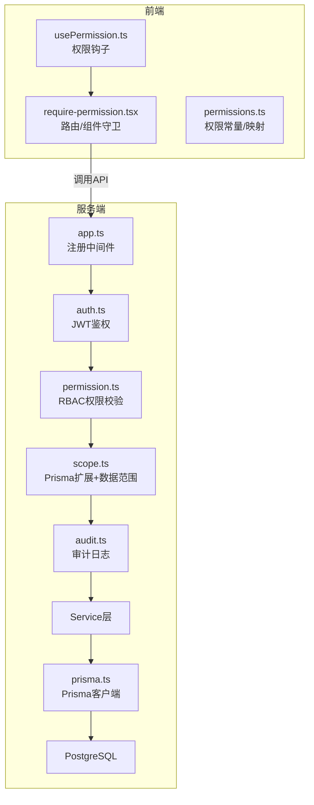
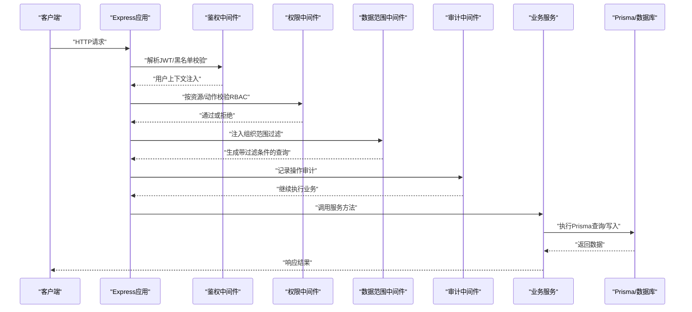
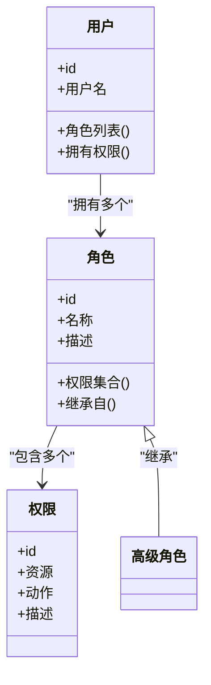
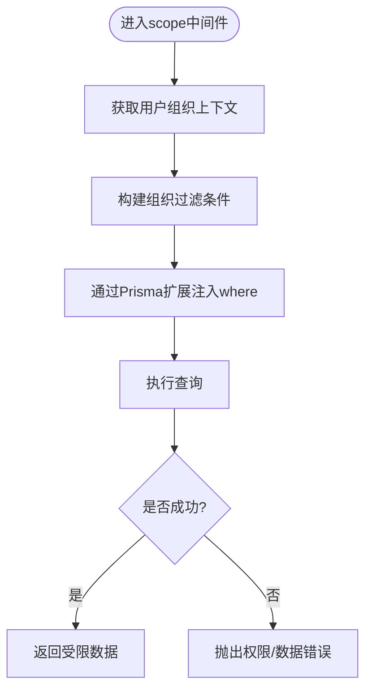
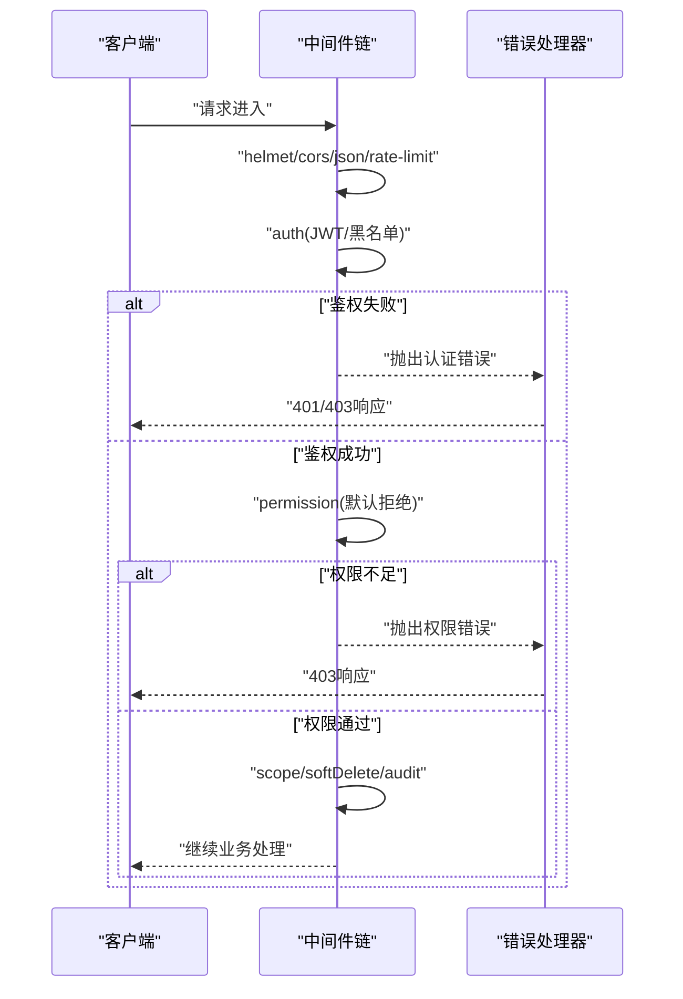
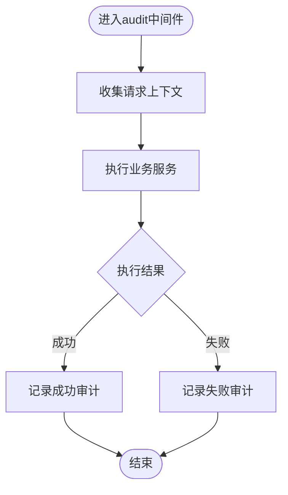
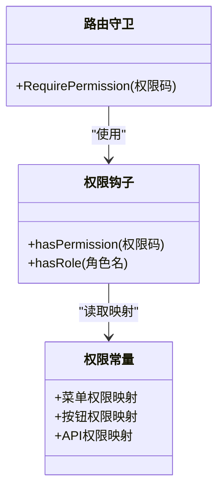
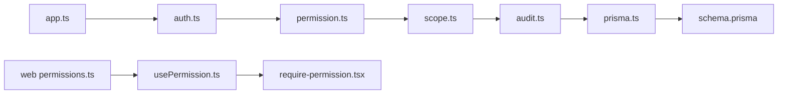

# 权限控制系统

<cite>
**本文引用的文件**   
- [server/src/middleware/auth.ts](file://server/src/middleware/auth.ts)
- [server/src/middleware/permission.ts](file://server/src/middleware/permission.ts)
- [server/src/middleware/scope.ts](file://server/src/middleware/scope.ts)
- [server/src/middleware/audit.ts](file://server/src/middleware/audit.ts)
- [server/src/middleware/error-handler.ts](file://server/src/middleware/error-handler.ts)
- [server/src/lib/jwt.ts](file://server/src/lib/jwt.ts)
- [server/src/lib/prisma.ts](file://server/src/lib/prisma.ts)
- [server/src/app.ts](file://server/src/app.ts)
- [server/src/server.ts](file://server/src/server.ts)
- [server/prisma/schema.prisma](file://server/prisma/schema.prisma)
- [server/prisma/init-audit.sql](file://server/prisma/init-audit.sql)
- [web/src/hooks/usePermission.ts](file://web/src/hooks/usePermission.ts)
- [web/src/components/layout/require-permission.tsx](file://web/src/components/layout/require-permission.tsx)
- [web/src/lib/permissions.ts](file://web/src/lib/permissions.ts)
</cite>

## 目录
1. [简介](#简介)
2. [项目结构](#项目结构)
3. [核心组件](#核心组件)
4. [架构总览](#架构总览)
5. [详细组件分析](#详细组件分析)
6. [依赖关系分析](#依赖关系分析)
7. [性能考量](#性能考量)
8. [故障排查指南](#故障排查指南)
9. [结论](#结论)
10. [附录](#附录)

## 简介
本文件面向“浙江壹品慧财年经营数据分析平台”的权限控制系统，围绕RBAC模型、数据范围控制（基于组织）、中间件执行链与审计日志进行系统化说明。文档覆盖角色与权限定义、继承关系、动态菜单/按钮/API权限控制、Prisma扩展实现的数据过滤、错误处理策略以及测试方法与最佳实践，帮助开发者快速理解并安全落地权限体系。

## 项目结构
后端采用Express中间件链式处理请求，权限相关能力集中在middleware层：鉴权(auth)、权限校验(permission)、数据范围(scope)、审计(audit)、错误处理(error-handler)。Prisma负责数据库访问与扩展注入，JWT用于令牌签发与校验。前端通过hooks与组件封装权限判断与UI级控制。

**图示来源**
- [server/src/app.ts](file://server/src/app.ts)
- [server/src/middleware/auth.ts](file://server/src/middleware/auth.ts)
- [server/src/middleware/permission.ts](file://server/src/middleware/permission.ts)
- [server/src/middleware/scope.ts](file://server/src/middleware/scope.ts)
- [server/src/middleware/audit.ts](file://server/src/middleware/audit.ts)
- [server/src/lib/prisma.ts](file://server/src/lib/prisma.ts)

**章节来源**
- [server/src/app.ts](file://server/src/app.ts)
- [server/src/server.ts](file://server/src/server.ts)

## 核心组件
- RBAC权限模型：角色定义、权限分配、继承关系由后端权限中间件与数据库模型共同支撑，结合前端权限常量与钩子实现端到端控制。
- 数据范围控制：通过Prisma扩展在查询时自动注入组织维度过滤条件，确保多租户/多组织数据隔离。
- 中间件执行链：helmet → cors → express.json → rate-limit → auth → permission(默认拒绝) → scope → softDelete → audit → Service → Prisma → PostgreSQL。
- 审计日志：记录关键操作、变更轨迹与合规报告所需字段，便于追溯与审计。

**章节来源**
- [server/src/middleware/auth.ts](file://server/src/middleware/auth.ts)
- [server/src/middleware/permission.ts](file://server/src/middleware/permission.ts)
- [server/src/middleware/scope.ts](file://server/src/middleware/scope.ts)
- [server/src/middleware/audit.ts](file://server/src/middleware/audit.ts)
- [server/src/lib/prisma.ts](file://server/src/lib/prisma.ts)
- [server/prisma/schema.prisma](file://server/prisma/schema.prisma)

## 架构总览
下图展示一次受保护API请求从进入服务到返回响应的完整流程，重点标注权限与数据范围控制点。

**图示来源**
- [server/src/app.ts](file://server/src/app.ts)
- [server/src/middleware/auth.ts](file://server/src/middleware/auth.ts)
- [server/src/middleware/permission.ts](file://server/src/middleware/permission.ts)
- [server/src/middleware/scope.ts](file://server/src/middleware/scope.ts)
- [server/src/middleware/audit.ts](file://server/src/middleware/audit.ts)
- [server/src/lib/prisma.ts](file://server/src/lib/prisma.ts)

## 详细组件分析

### RBAC权限模型：角色、权限与继承
- 角色定义：系统内定义若干角色（如管理员、财务、分析师等），每个角色拥有一组权限集合。
- 权限分配：用户可被赋予一个或多个角色，从而获得相应权限；支持细粒度到资源与动作级别（如“报表:查看”、“指标:编辑”）。
- 继承关系：角色之间可存在继承（如“高级分析师”继承“分析师”的权限），减少重复配置与维护成本。
- 前端配合：通过权限常量与映射表，将后端权限码映射为菜单项可见性与按钮可用性。

**图示来源**
- [server/prisma/schema.prisma](file://server/prisma/schema.prisma)
- [server/src/middleware/permission.ts](file://server/src/middleware/permission.ts)
- [web/src/lib/permissions.ts](file://web/src/lib/permissions.ts)

**章节来源**
- [server/src/middleware/permission.ts](file://server/src/middleware/permission.ts)
- [web/src/lib/permissions.ts](file://web/src/lib/permissions.ts)

### 数据范围控制：基于组织的访问控制与Prisma扩展
- 设计目标：确保用户仅能访问其所属组织及其授权范围内的数据，避免越权访问。
- 实现方式：在scope中间件中通过Prisma扩展对查询对象注入where条件，自动附加组织ID过滤；写操作同样受控。
- 动态过滤：根据当前用户的组织上下文与角色权限动态决定过滤规则，支持跨组织只读、子组织继承等场景。
- 性能优化：尽量在数据库层完成过滤，减少内存计算与网络传输开销。

**图示来源**
- [server/src/middleware/scope.ts](file://server/src/middleware/scope.ts)
- [server/src/lib/prisma.ts](file://server/src/lib/prisma.ts)

**章节来源**
- [server/src/middleware/scope.ts](file://server/src/middleware/scope.ts)
- [server/src/lib/prisma.ts](file://server/src/lib/prisma.ts)

### 中间件执行链：顺序、短路逻辑与错误处理
- 执行顺序：helmet → cors → express.json → rate-limit → auth → permission(默认拒绝) → scope → softDelete → audit → Service → Prisma → PostgreSQL。
- 短路逻辑：任一中间件失败即中断后续执行，直接返回错误响应；例如permission未通过则不再进入scope与业务层。
- 错误处理：统一由error-handler捕获并格式化输出，保证前后端一致的错误码与消息格式。

**图示来源**
- [server/src/app.ts](file://server/src/app.ts)
- [server/src/middleware/auth.ts](file://server/src/middleware/auth.ts)
- [server/src/middleware/permission.ts](file://server/src/middleware/permission.ts)
- [server/src/middleware/scope.ts](file://server/src/middleware/scope.ts)
- [server/src/middleware/error-handler.ts](file://server/src/middleware/error-handler.ts)

**章节来源**
- [server/src/app.ts](file://server/src/app.ts)
- [server/src/middleware/error-handler.ts](file://server/src/middleware/error-handler.ts)

### 审计日志系统：操作记录、变更追踪与合规报告
- 记录内容：操作主体、时间、IP、资源、动作、结果、影响行数、变更快照（可选）等。
- 触发时机：在audit中间件中统一收集上下文信息，并在业务完成后追加审计条目。
- 存储与查询：审计表独立于业务表，支持按用户、时间、资源类型检索，便于合规审计与问题回溯。
- 脱敏策略：敏感字段（金额、公司名）按规范脱敏后再落库，满足隐私与合规要求。

**图示来源**
- [server/src/middleware/audit.ts](file://server/src/middleware/audit.ts)
- [server/prisma/init-audit.sql](file://server/prisma/init-audit.sql)

**章节来源**
- [server/src/middleware/audit.ts](file://server/src/middleware/audit.ts)
- [server/prisma/init-audit.sql](file://server/prisma/init-audit.sql)

### 权限配置：菜单、按钮与API的动态控制
- 菜单权限：前端根据用户权限集合渲染导航菜单，无权限项隐藏或禁用。
- 按钮权限：页面内操作按钮依据权限码控制显示/禁用，避免越权操作入口。
- API权限：后端permission中间件以“资源:动作”形式校验，未通过直接拒绝。
- 动态更新：权限变更后无需重启服务，前端缓存刷新即可生效。

**图示来源**
- [web/src/lib/permissions.ts](file://web/src/lib/permissions.ts)
- [web/src/hooks/usePermission.ts](file://web/src/hooks/usePermission.ts)
- [web/src/components/layout/require-permission.tsx](file://web/src/components/layout/require-permission.tsx)

**章节来源**
- [web/src/lib/permissions.ts](file://web/src/lib/permissions.ts)
- [web/src/hooks/usePermission.ts](file://web/src/hooks/usePermission.ts)
- [web/src/components/layout/require-permission.tsx](file://web/src/components/layout/require-permission.tsx)

### JWT与鉴权细节
- 令牌结构：access token有效期短（如15分钟），refresh token有效期长（如7天），支持轮转机制。
- 校验流程：解析签名、验证过期、检查黑名单（若启用），成功后注入用户上下文供后续中间件使用。
- 安全加固：严格白名单校验、最小化payload、防重放攻击（可选nonce/序列号）。

**章节来源**
- [server/src/lib/jwt.ts](file://server/src/lib/jwt.ts)
- [server/src/middleware/auth.ts](file://server/src/middleware/auth.ts)

## 依赖关系分析
权限系统的关键依赖如下：
- Express中间件链依赖顺序严格，任何环节异常都会导致短路。
- Prisma扩展与数据库模型强耦合，数据范围过滤需在schema层面明确组织字段。
- 前端权限常量与后端权限码需保持一致，避免不一致导致的越权或误拒。

**图示来源**
- [server/src/app.ts](file://server/src/app.ts)
- [server/src/middleware/auth.ts](file://server/src/middleware/auth.ts)
- [server/src/middleware/permission.ts](file://server/src/middleware/permission.ts)
- [server/src/middleware/scope.ts](file://server/src/middleware/scope.ts)
- [server/src/middleware/audit.ts](file://server/src/middleware/audit.ts)
- [server/src/lib/prisma.ts](file://server/src/lib/prisma.ts)
- [server/prisma/schema.prisma](file://server/prisma/schema.prisma)
- [web/src/lib/permissions.ts](file://web/src/lib/permissions.ts)
- [web/src/hooks/usePermission.ts](file://web/src/hooks/usePermission.ts)
- [web/src/components/layout/require-permission.tsx](file://web/src/components/layout/require-permission.tsx)

**章节来源**
- [server/src/app.ts](file://server/src/app.ts)
- [server/src/lib/prisma.ts](file://server/src/lib/prisma.ts)
- [server/prisma/schema.prisma](file://server/prisma/schema.prisma)

## 性能考量
- 查询过滤下沉至数据库层，减少内存与网络开销。
- 权限校验尽量使用索引字段（如组织ID、角色ID），避免全表扫描。
- 审计日志异步落盘或批量写入，降低主链路延迟。
- 前端权限缓存与增量更新，避免频繁拉取权限清单。

[本节为通用指导，不直接分析具体文件]

## 故障排查指南
- 常见错误码：
  - 401：JWT无效或已过期，检查令牌签发与黑名单。
  - 403：权限不足，核对角色-权限映射与资源动作码。
  - 500：内部错误，查看错误处理器与日志堆栈。
- 定位步骤：
  - 开启trace-id，串联请求链路。
  - 检查中间件顺序与短路点。
  - 确认Prisma扩展是否正确注入组织过滤。
  - 审计日志中查找操作前后状态差异。
- 修复建议：
  - 修正权限码命名与前后端一致性。
  - 调整role继承关系与权限分配。
  - 优化scope过滤条件，避免过度限制。

**章节来源**
- [server/src/middleware/error-handler.ts](file://server/src/middleware/error-handler.ts)
- [server/src/middleware/audit.ts](file://server/src/middleware/audit.ts)

## 结论
本权限控制系统以RBAC为核心，结合组织维度的数据范围控制与严格的中间件执行链，实现了端到端的权限保障。通过Prisma扩展与审计日志，既保证了数据安全与合规，又提供了良好的可观测性与可维护性。遵循最小权限原则与安全加固策略，可有效降低越权风险并提升系统整体安全性。

[本节为总结性内容，不直接分析具体文件]

## 附录
- 最佳实践：
  - 最小权限原则：仅授予完成任务所需的最小权限。
  - 默认拒绝：权限中间件默认拒绝，显式放行必要路径。
  - 分离关注点：权限校验、数据范围、审计各自独立，便于测试与演进。
  - 脱敏与加密：敏感数据入库前脱敏，传输层启用HTTPS。
- 测试方法：
  - 单元测试：覆盖权限判定分支、scope过滤条件、审计记录完整性。
  - 集成测试：模拟真实请求链路，验证中间件顺序与错误处理。
  - 前端测试：验证菜单/按钮渲染与路由守卫行为。
- 常见问题解决方案：
  - 权限不生效：检查权限码映射与中间件顺序。
  - 数据越界：确认scope扩展注入的组织过滤条件。
  - 审计缺失：核对audit中间件位置与异常分支。

[本节为通用指导，不直接分析具体文件]