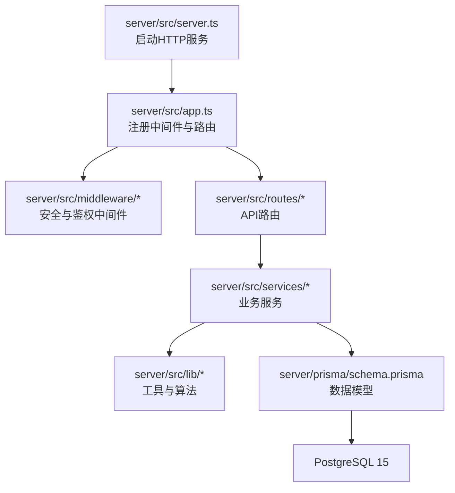
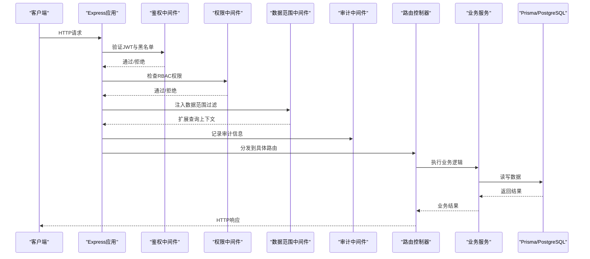
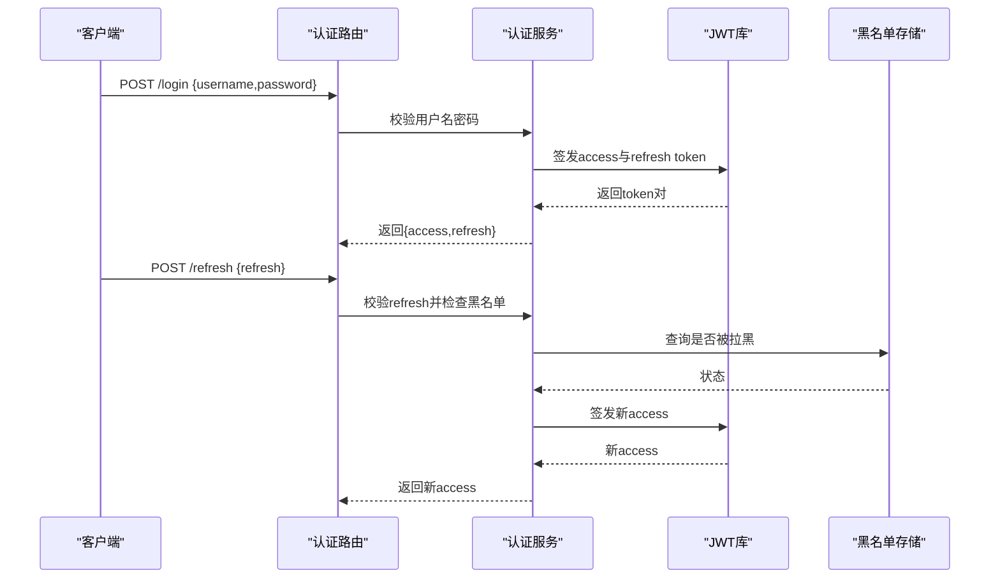
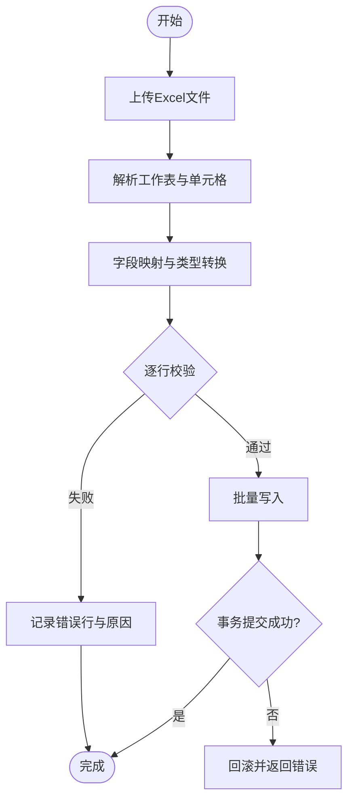
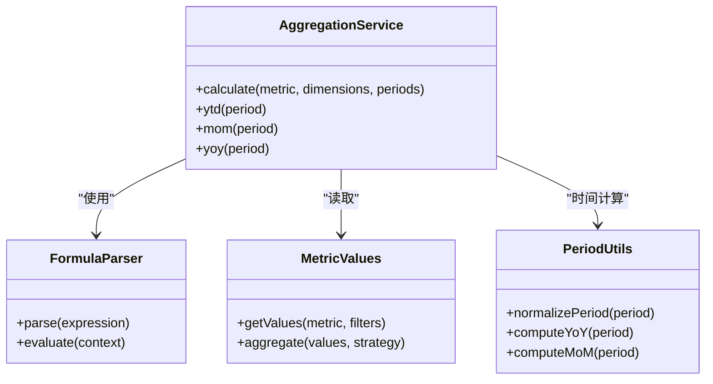
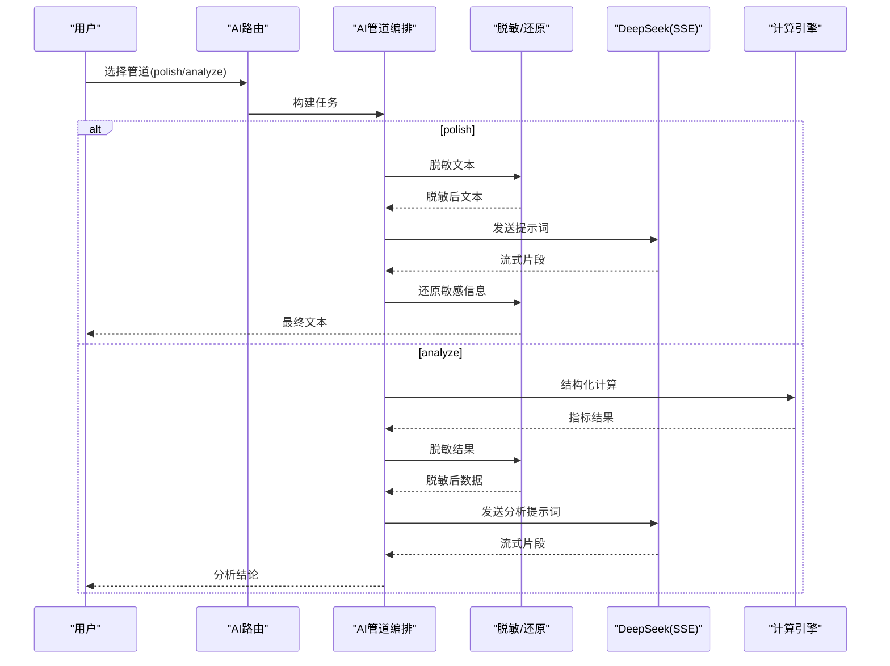
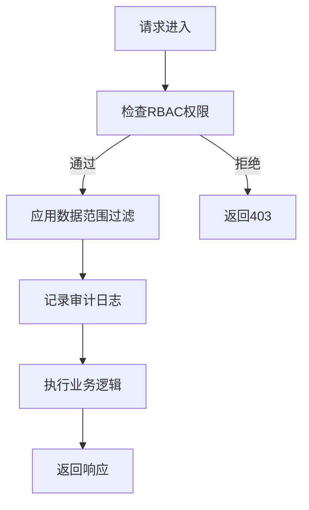
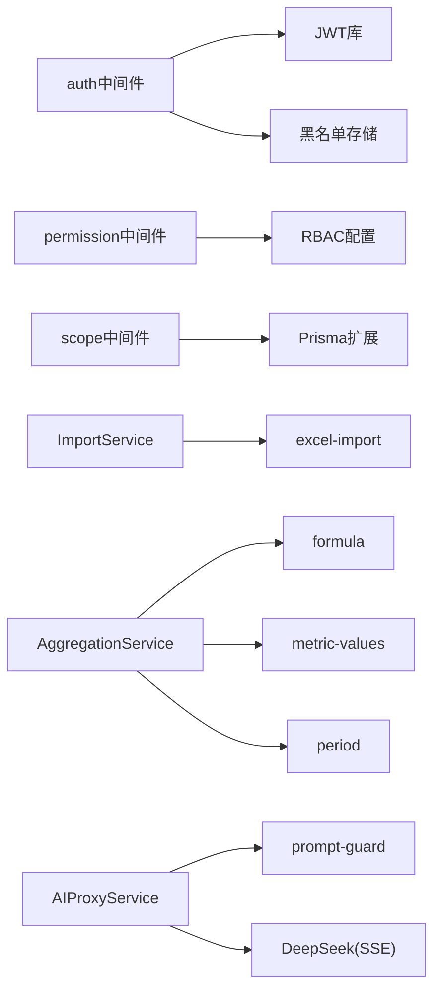

# 核心功能模块

<cite>
**本文引用的文件**   
- [server/src/app.ts](file://server/src/app.ts)
- [server/src/server.ts](file://server/src/server.ts)
- [server/src/config/env.ts](file://server/src/config/env.ts)
- [server/src/middleware/auth.ts](file://server/src/middleware/auth.ts)
- [server/src/middleware/permission.ts](file://server/src/middleware/permission.ts)
- [server/src/middleware/scope.ts](file://server/src/middleware/scope.ts)
- [server/src/middleware/audit.ts](file://server/src/middleware/audit.ts)
- [server/src/middleware/rate-limit.ts](file://server/src/middleware/rate-limit.ts)
- [server/src/middleware/helmet.ts](file://server/src/middleware/helmet.ts)
- [server/src/middleware/cors.ts](file://server/src/middleware/cors.ts)
- [server/src/lib/jwt.ts](file://server/src/lib/jwt.ts)
- [server/src/lib/excel-import.ts](file://server/src/lib/excel-import.ts)
- [server/src/lib/formula.ts](file://server/src/lib/formula.ts)
- [server/src/lib/metric-values.ts](file://server/src/lib/metric-values.ts)
- [server/src/lib/period.ts](file://server/src/lib/period.ts)
- [server/src/lib/desensitize.test.ts](file://server/src/lib/desensitize.test.ts)
- [server/src/lib/prompt-guard.ts](file://server/src/lib/prompt-guard.ts)
- [server/src/services/AuthService.ts](file://server/src/services/AuthService.ts)
- [server/src/services/ImportService.ts](file://server/src/services/ImportService.ts)
- [server/src/services/DataService.ts](file://server/src/services/DataService.ts)
- [server/src/services/FormulaRuleService.ts](file://server/src/services/FormulaRuleService.ts)
- [server/src/services/AggregationService.ts](file://server/src/services/AggregationService.ts)
- [server/src/services/AIProxyService.ts](file://server/src/services/AIProxyService.ts)
- [server/src/routes/auth.ts](file://server/src/routes/auth.ts)
- [server/src/routes/data.ts](file://server/src/routes/data.ts)
- [server/src/routes/indicators.ts](file://server/src/routes/indicators.ts)
- [server/src/routes/ai.ts](file://server/src/routes/ai.ts)
- [server/prisma/schema.prisma](file://server/prisma/schema.prisma)
</cite>

## 目录
1. [简介](#简介)
2. [项目结构](#项目结构)
3. [核心组件](#核心组件)
4. [架构总览](#架构总览)
5. [详细组件分析](#详细组件分析)
6. [依赖关系分析](#依赖关系分析)
7. [性能考量](#性能考量)
8. [故障排查指南](#故障排查指南)
9. [结论](#结论)
10. [附录](#附录)

## 简介
本文件面向FY200财年经营数据分析平台的核心后端能力，聚焦以下关键主题：
- 用户认证系统：JWT双令牌机制（access 15分钟 + refresh 7天轮转）、黑名单管理、权限控制。
- 数据管理模块：Excel导入处理、数据校验规则、公式规则维护。
- 指标分析引擎：安全公式解析（白名单算子+-*/()，禁止eval）、同比环比实时计算与数据聚合。
- AI分析双管道：polish（文本→脱敏→LLM→还原）与analyze（结构化→计算→脱敏→LLM→生成）。
- 权限控制系统：RBAC模型、数据范围控制、审计日志。
- 各模块配置项、使用示例与最佳实践。

本项目定位“Excel进、看板/报表出”的内部管理口径财务数据平台，单位统一为万元/人民币。中间件执行链顺序为：helmet → cors → express.json → rate-limit → auth(JWT+黑名单) → permission(默认拒绝) → scope(Prisma extension) → softDelete → audit → Service → Prisma → PostgreSQL。

## 项目结构
后端采用Express路由分层与模块化服务设计：
- 入口与装配：app.ts、server.ts
- 配置与环境：config/env.ts
- 中间件：auth、permission、scope、audit、rate-limit、helmet、cors等
- 业务服务：AuthService、ImportService、DataService、FormulaRuleService、AggregationService、AIProxyService等
- 路由层：auth、data、indicators、ai等
- 数据库：Prisma schema与迁移

图表来源
- [server/src/server.ts](file://server/src/server.ts)
- [server/src/app.ts](file://server/src/app.ts)
- [server/prisma/schema.prisma](file://server/prisma/schema.prisma)

章节来源
- [server/src/app.ts](file://server/src/app.ts)
- [server/src/server.ts](file://server/src/server.ts)

## 核心组件
- 认证与授权：基于JWT的双令牌轮转、黑名单拦截、RBAC权限与数据范围控制。
- 数据导入与校验：Excel批量导入、字段校验、错误回滚与结果汇总。
- 公式与指标：安全表达式解析器、同比环比计算、多维度聚合。
- AI分析：双管道（polish/analyze），含脱敏与还原、结构化计算、SSE流式输出。
- 审计与可观测性：请求审计、速率限制、安全头与CORS策略。

章节来源
- [server/src/middleware/auth.ts](file://server/src/middleware/auth.ts)
- [server/src/middleware/permission.ts](file://server/src/middleware/permission.ts)
- [server/src/middleware/scope.ts](file://server/src/middleware/scope.ts)
- [server/src/middleware/audit.ts](file://server/src/middleware/audit.ts)
- [server/src/lib/jwt.ts](file://server/src/lib/jwt.ts)
- [server/src/lib/excel-import.ts](file://server/src/lib/excel-import.ts)
- [server/src/lib/formula.ts](file://server/src/lib/formula.ts)
- [server/src/lib/metric-values.ts](file://server/src/lib/metric-values.ts)
- [server/src/lib/period.ts](file://server/src/lib/period.ts)
- [server/src/services/AIProxyService.ts](file://server/src/services/AIProxyService.ts)

## 架构总览
整体调用链路从HTTP请求进入，经安全与鉴权中间件后到达路由与服务层，最终通过Prisma访问数据库。

图表来源
- [server/src/app.ts](file://server/src/app.ts)
- [server/src/middleware/auth.ts](file://server/src/middleware/auth.ts)
- [server/src/middleware/permission.ts](file://server/src/middleware/permission.ts)
- [server/src/middleware/scope.ts](file://server/src/middleware/scope.ts)
- [server/src/middleware/audit.ts](file://server/src/middleware/audit.ts)
- [server/src/routes/auth.ts](file://server/src/routes/auth.ts)
- [server/src/services/AuthService.ts](file://server/src/services/AuthService.ts)

## 详细组件分析

### 用户认证系统（JWT双令牌与黑名单）
- 双令牌机制：access token有效期短（约15分钟），refresh token有效期长（约7天）。登录成功后返回两者；后续刷新流程使用refresh token换取新的access token。
- 黑名单管理：支持将已注销或主动退出的token加入黑名单，鉴权时拦截黑名单中的token。
- 权限控制：在鉴权通过后进行RBAC权限校验，未显式授权的接口默认拒绝。

图表来源
- [server/src/routes/auth.ts](file://server/src/routes/auth.ts)
- [server/src/services/AuthService.ts](file://server/src/services/AuthService.ts)
- [server/src/lib/jwt.ts](file://server/src/lib/jwt.ts)
- [server/src/middleware/auth.ts](file://server/src/middleware/auth.ts)

章节来源
- [server/src/lib/jwt.ts](file://server/src/lib/jwt.ts)
- [server/src/middleware/auth.ts](file://server/src/middleware/auth.ts)
- [server/src/services/AuthService.ts](file://server/src/services/AuthService.ts)
- [server/src/routes/auth.ts](file://server/src/routes/auth.ts)

### 数据管理模块（Excel导入、校验与公式规则）
- Excel导入：支持批量上传，解析工作表与单元格，按模板映射字段，批量写入前进行数据校验与格式转换。
- 数据校验：字段类型、必填、数值范围、唯一性等规则校验，失败行记录错误原因并继续处理其他行。
- 公式规则维护：集中维护指标计算公式，提供校验与版本化管理，确保计算口径一致。

图表来源
- [server/src/lib/excel-import.ts](file://server/src/lib/excel-import.ts)
- [server/src/services/ImportService.ts](file://server/src/services/ImportService.ts)
- [server/src/services/DataService.ts](file://server/src/services/DataService.ts)
- [server/src/services/FormulaRuleService.ts](file://server/src/services/FormulaRuleService.ts)

章节来源
- [server/src/lib/excel-import.ts](file://server/src/lib/excel-import.ts)
- [server/src/services/ImportService.ts](file://server/src/services/ImportService.ts)
- [server/src/services/DataService.ts](file://server/src/services/DataService.ts)
- [server/src/services/FormulaRuleService.ts](file://server/src/services/FormulaRuleService.ts)

### 指标分析引擎（安全公式、同比环比与聚合）
- 安全公式解析：仅允许白名单算子（加减乘除与括号），禁止任意代码执行（如eval），保障计算安全。
- 同比环比计算：根据时间维度动态计算同比与环比，不持久化，保证实时性与一致性。
- 数据聚合：支持按公司、期间、科目等多维度聚合，结合Prisma扩展实现数据范围过滤。

图表来源
- [server/src/services/AggregationService.ts](file://server/src/services/AggregationService.ts)
- [server/src/lib/formula.ts](file://server/src/lib/formula.ts)
- [server/src/lib/metric-values.ts](file://server/src/lib/metric-values.ts)
- [server/src/lib/period.ts](file://server/src/lib/period.ts)

章节来源
- [server/src/lib/formula.ts](file://server/src/lib/formula.ts)
- [server/src/lib/metric-values.ts](file://server/src/lib/metric-values.ts)
- [server/src/lib/period.ts](file://server/src/lib/period.ts)
- [server/src/services/AggregationService.ts](file://server/src/services/AggregationService.ts)

### AI分析双管道（polish与analyze）
- polish管道：输入原始文本→脱敏→LLM处理→还原敏感信息，适用于报告润色、摘要生成等场景。
- analyze管道：输入结构化数据→计算衍生指标→脱敏→LLM生成分析结论，适用于经营分析与洞察生成。
- 脱敏规则：绝对金额映射为区间，公司名称动态映射，避免泄露真实值。
- 输出方式：SSE流式输出，提升交互体验。

图表来源
- [server/src/routes/ai.ts](file://server/src/routes/ai.ts)
- [server/src/services/AIProxyService.ts](file://server/src/services/AIProxyService.ts)
- [server/src/lib/prompt-guard.ts](file://server/src/lib/prompt-guard.ts)
- [server/src/lib/desensitize.test.ts](file://server/src/lib/desensitize.test.ts)

章节来源
- [server/src/routes/ai.ts](file://server/src/routes/ai.ts)
- [server/src/services/AIProxyService.ts](file://server/src/services/AIProxyService.ts)
- [server/src/lib/prompt-guard.ts](file://server/src/lib/prompt-guard.ts)
- [server/src/lib/desensitize.test.ts](file://server/src/lib/desensitize.test.ts)

### 权限控制系统（RBAC、数据范围与审计）
- RBAC模型：角色-权限分离，接口级权限控制，默认拒绝未授权访问。
- 数据范围控制：通过Prisma扩展注入当前用户的数据范围（如公司、组织），自动附加WHERE条件。
- 审计日志：记录关键操作、请求上下文与结果，便于追溯与合规。

图表来源
- [server/src/middleware/permission.ts](file://server/src/middleware/permission.ts)
- [server/src/middleware/scope.ts](file://server/src/middleware/scope.ts)
- [server/src/middleware/audit.ts](file://server/src/middleware/audit.ts)

章节来源
- [server/src/middleware/permission.ts](file://server/src/middleware/permission.ts)
- [server/src/middleware/scope.ts](file://server/src/middleware/scope.ts)
- [server/src/middleware/audit.ts](file://server/src/middleware/audit.ts)

## 依赖关系分析
- 中间件依赖：auth依赖jwt与黑名单存储；permission依赖RBAC配置；scope依赖Prisma扩展；audit依赖日志与存储。
- 服务依赖：ImportService依赖excel解析与校验；AggregationService依赖formula、metric-values、period；AIProxyService依赖prompt-guard与LLM客户端。
- 路由依赖：auth/data/indicators/ai路由分别绑定对应服务。

图表来源
- [server/src/middleware/auth.ts](file://server/src/middleware/auth.ts)
- [server/src/middleware/permission.ts](file://server/src/middleware/permission.ts)
- [server/src/middleware/scope.ts](file://server/src/middleware/scope.ts)
- [server/src/lib/jwt.ts](file://server/src/lib/jwt.ts)
- [server/src/lib/excel-import.ts](file://server/src/lib/excel-import.ts)
- [server/src/lib/formula.ts](file://server/src/lib/formula.ts)
- [server/src/lib/metric-values.ts](file://server/src/lib/metric-values.ts)
- [server/src/lib/period.ts](file://server/src/lib/period.ts)
- [server/src/lib/prompt-guard.ts](file://server/src/lib/prompt-guard.ts)
- [server/src/services/AIProxyService.ts](file://server/src/services/AIProxyService.ts)

章节来源
- [server/src/middleware/auth.ts](file://server/src/middleware/auth.ts)
- [server/src/middleware/permission.ts](file://server/src/middleware/permission.ts)
- [server/src/middleware/scope.ts](file://server/src/middleware/scope.ts)
- [server/src/lib/jwt.ts](file://server/src/lib/jwt.ts)
- [server/src/lib/excel-import.ts](file://server/src/lib/excel-import.ts)
- [server/src/lib/formula.ts](file://server/src/lib/formula.ts)
- [server/src/lib/metric-values.ts](file://server/src/lib/metric-values.ts)
- [server/src/lib/period.ts](file://server/src/lib/period.ts)
- [server/src/lib/prompt-guard.ts](file://server/src/lib/prompt-guard.ts)
- [server/src/services/AIProxyService.ts](file://server/src/services/AIProxyService.ts)

## 性能考量
- 公式计算：避免复杂递归与重复计算，缓存常用指标结果；合理分页与批处理导入。
- 并发与限流：启用rate-limit保护热点接口；SSE流式输出降低内存峰值。
- 数据库：使用Prisma扩展减少不必要字段加载；索引覆盖高频查询维度（公司、期间、科目）。
- 内存与GC：大文件导入分块处理；避免在循环中创建大对象。

[本节为通用指导，无需特定文件引用]

## 故障排查指南
- 认证失败：检查JWT签名与过期时间；确认黑名单是否误拦截；核对refresh token有效性。
- 权限拒绝：确认RBAC配置是否正确分配；检查接口是否需要显式授权。
- 导入失败：查看错误行明细与原因；校验字段映射与数据类型；必要时回滚并重试。
- 公式报错：检查表达式是否包含非法字符或函数；确认变量名与上下文匹配。
- AI输出异常：检查提示词与脱敏规则；确认LLM服务可用性与限流策略。

章节来源
- [server/src/middleware/auth.ts](file://server/src/middleware/auth.ts)
- [server/src/middleware/permission.ts](file://server/src/middleware/permission.ts)
- [server/src/lib/excel-import.ts](file://server/src/lib/excel-import.ts)
- [server/src/lib/formula.ts](file://server/src/lib/formula.ts)
- [server/src/services/AIProxyService.ts](file://server/src/services/AIProxyService.ts)

## 结论
FY200核心模块围绕“安全、准确、高效”的目标构建：
- 认证与授权以JWT双令牌与RBAC为核心，配合黑名单与数据范围控制，确保访问安全与数据隔离。
- 数据管理与公式体系保障导入质量与计算口径一致性。
- 指标引擎提供安全的表达式解析与实时计算能力。
- AI双管道在脱敏与还原的基础上，提供流畅的文本与分析生成体验。
建议在生产环境严格配置环境变量、开启审计与限流，并持续优化索引与缓存策略。

[本节为总结性内容，无需特定文件引用]

## 附录

### 配置选项与环境变量
- JWT相关：access与refresh有效期、密钥、黑名单存储地址。
- 安全策略：CORS源、速率限制阈值、Helmet策略。
- 数据库：PostgreSQL连接串、Prisma调试开关。
- AI服务：DeepSeek API密钥、超时与重试策略。

章节来源
- [server/src/config/env.ts](file://server/src/config/env.ts)
- [server/src/middleware/helmet.ts](file://server/src/middleware/helmet.ts)
- [server/src/middleware/cors.ts](file://server/src/middleware/cors.ts)
- [server/src/middleware/rate-limit.ts](file://server/src/middleware/rate-limit.ts)

### 使用示例与最佳实践
- 认证流程：登录后保存access与refresh；刷新时使用refresh换取新access；退出时将access加入黑名单。
- 导入规范：遵循模板字段与类型；分批上传大文件；保留错误明细以便修正。
- 公式编写：仅使用白名单算子；避免嵌套过深；优先使用内置指标函数。
- AI提示词：明确目标与约束；避免敏感信息；合理使用分段与流式输出。
- 权限与范围：最小权限原则；按公司/组织划分数据范围；定期审计操作日志。

章节来源
- [server/src/routes/auth.ts](file://server/src/routes/auth.ts)
- [server/src/services/AuthService.ts](file://server/src/services/AuthService.ts)
- [server/src/lib/excel-import.ts](file://server/src/lib/excel-import.ts)
- [server/src/lib/formula.ts](file://server/src/lib/formula.ts)
- [server/src/services/AIProxyService.ts](file://server/src/services/AIProxyService.ts)
- [server/src/middleware/permission.ts](file://server/src/middleware/permission.ts)
- [server/src/middleware/scope.ts](file://server/src/middleware/scope.ts)
- [server/src/middleware/audit.ts](file://server/src/middleware/audit.ts)