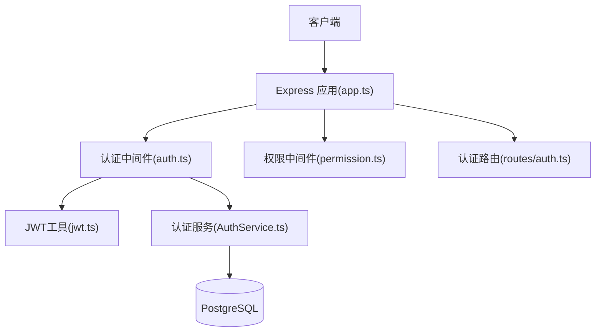
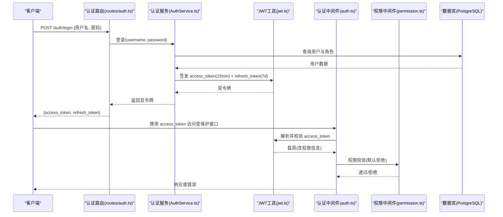
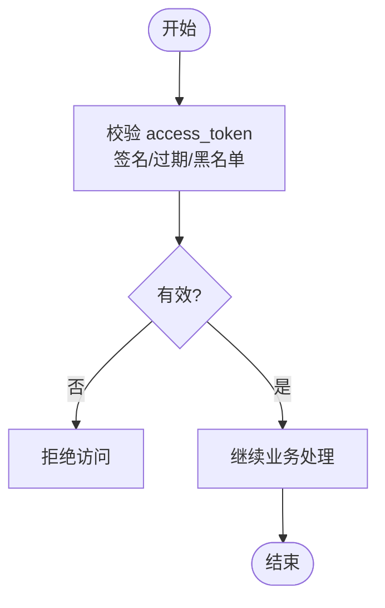
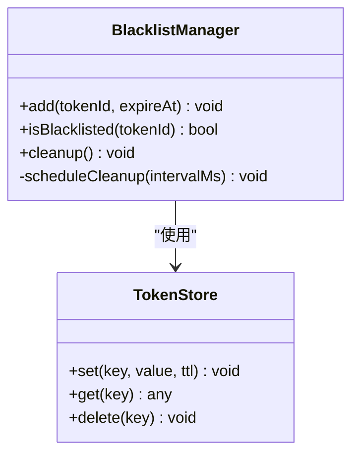
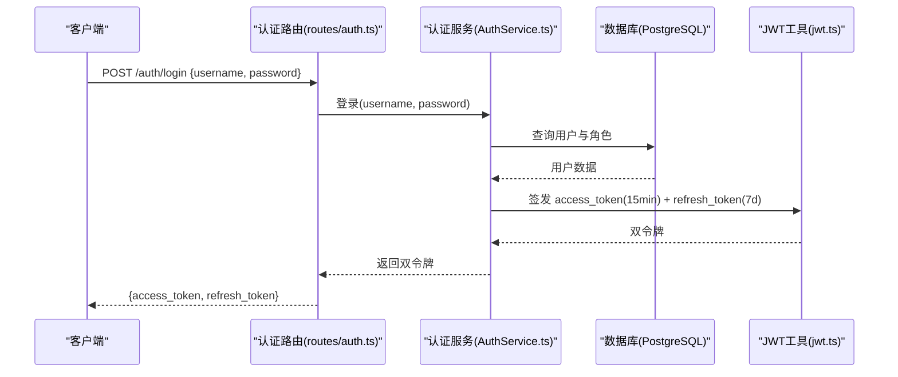
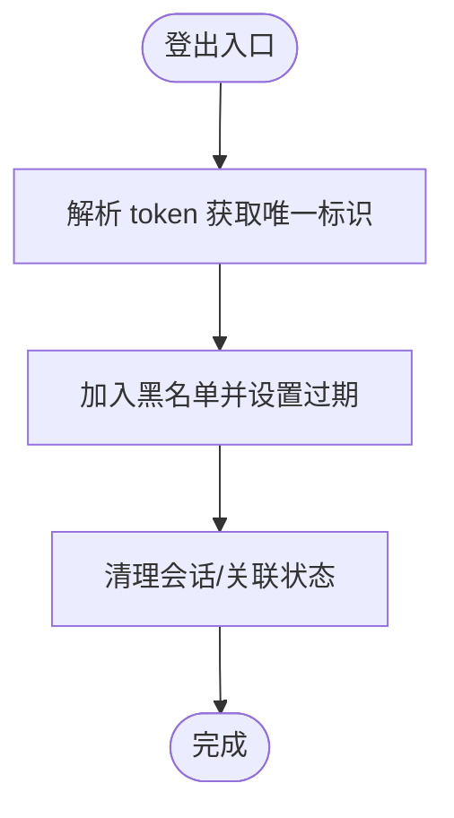
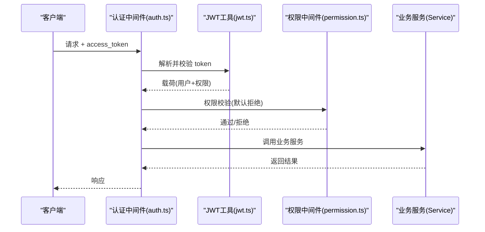
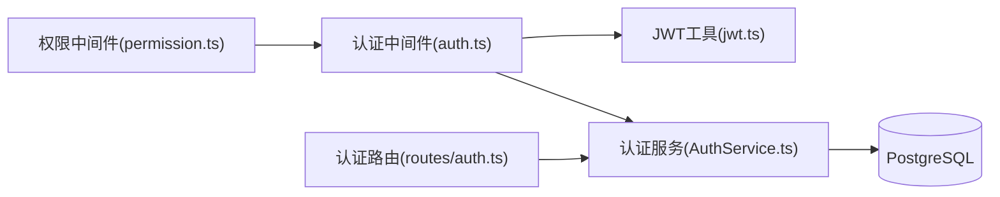

# 用户认证系统

<cite>
**本文引用的文件**   
- [server/src/lib/jwt.ts](file://server/src/lib/jwt.ts)
- [server/src/middleware/auth.ts](file://server/src/middleware/auth.ts)
- [server/src/routes/auth.ts](file://server/src/routes/auth.ts)
- [server/src/services/AuthService.ts](file://server/src/services/AuthService.ts)
- [server/src/config/env.ts](file://server/src/config/env.ts)
- [server/src/middleware/permission.ts](file://server/src/middleware/permission.ts)
- [server/src/app.ts](file://server/src/app.ts)
</cite>

## 目录
1. [简介](#简介)
2. [项目结构](#项目结构)
3. [核心组件](#核心组件)
4. [架构总览](#架构总览)
5. [详细组件分析](#详细组件分析)
6. [依赖关系分析](#依赖关系分析)
7. [性能考虑](#性能考虑)
8. [故障排查指南](#故障排查指南)
9. [结论](#结论)
10. [附录：API接口文档](#附录api接口文档)

## 简介
本文件面向“浙江壹品慧财年经营数据分析平台”的用户认证子系统，聚焦JWT双令牌机制（access token与refresh token）的生成、验证与轮转策略，以及黑名单管理与中间件链中的认证处理。系统采用Express 4 + Prisma 5 + PostgreSQL 15 + JWT（access 15分钟 + refresh 7天轮转）技术栈，中间件执行顺序为：helmet → cors → express.json → rate-limit → auth(JWT+黑名单) → permission(默认拒绝) → scope(Prisma extension) → softDelete → audit → Service → Prisma → PostgreSQL。

## 项目结构
认证相关代码主要分布在以下模块：
- lib/jwt.ts：JWT签发、解析、校验与黑名单判断逻辑
- middleware/auth.ts：请求级认证中间件，拦截并解析token，结合黑名单进行鉴权
- routes/auth.ts：登录、刷新、登出等认证路由
- services/AuthService.ts：认证业务编排（密码校验、权限信息组装、令牌签发与轮转）
- config/env.ts：环境变量配置（如密钥、过期时间、黑名单存储策略）
- middleware/permission.ts：基于角色的权限控制中间件
- app.ts：应用初始化与中间件注册

图表来源 
- [server/src/app.ts](file://server/src/app.ts)
- [server/src/middleware/auth.ts](file://server/src/middleware/auth.ts)
- [server/src/lib/jwt.ts](file://server/src/lib/jwt.ts)
- [server/src/services/AuthService.ts](file://server/src/services/AuthService.ts)
- [server/src/routes/auth.ts](file://server/src/routes/auth.ts)

章节来源
- [server/src/app.ts](file://server/src/app.ts)
- [server/src/middleware/auth.ts](file://server/src/middleware/auth.ts)
- [server/src/lib/jwt.ts](file://server/src/lib/jwt.ts)
- [server/src/services/AuthService.ts](file://server/src/services/AuthService.ts)
- [server/src/routes/auth.ts](file://server/src/routes/auth.ts)

## 核心组件
- JWT工具库：负责access token与refresh token的签发、解析、过期校验、黑名单判定
- 认证中间件：在请求进入业务前完成token解析、黑名单检查、上下文注入
- 认证服务：封装登录、刷新、登出等业务流程，协调密码校验、权限信息嵌入、令牌轮转
- 权限中间件：默认拒绝访问，按角色或资源白名单放行
- 配置中心：集中管理密钥、过期时间、黑名单存储策略等敏感参数

章节来源
- [server/src/lib/jwt.ts](file://server/src/lib/jwt.ts)
- [server/src/middleware/auth.ts](file://server/src/middleware/auth.ts)
- [server/src/services/AuthService.ts](file://server/src/services/AuthService.ts)
- [server/src/middleware/permission.ts](file://server/src/middleware/permission.ts)
- [server/src/config/env.ts](file://server/src/config/env.ts)

## 架构总览
下图展示从客户端发起登录到获取双令牌的完整调用链，以及后续受保护接口的认证流程。

图表来源 
- [server/src/routes/auth.ts](file://server/src/routes/auth.ts)
- [server/src/services/AuthService.ts](file://server/src/services/AuthService.ts)
- [server/src/lib/jwt.ts](file://server/src/lib/jwt.ts)
- [server/src/middleware/auth.ts](file://server/src/middleware/auth.ts)
- [server/src/middleware/permission.ts](file://server/src/middleware/permission.ts)

## 详细组件分析

### JWT双令牌机制（access 15分钟 + refresh 7天）
- 签发策略
  - access token：短生命周期（15分钟），用于高频API调用，减少泄露风险
  - refresh token：长生命周期（7天），用于无感续期，降低频繁登录体验
  - 载荷设计：包含用户标识、角色、权限集合等必要信息，避免重复查库
- 验证策略
  - access token：每次请求由认证中间件解析，校验签名与过期时间，并检查黑名单
  - refresh token：仅在刷新接口使用，校验签名、过期时间与黑名单
- 轮转策略
  - 刷新时签发新的access token与refresh token，旧refresh token加入黑名单
  - 支持滑动窗口式续期，避免并发刷新导致的状态不一致

图表来源 
- [server/src/lib/jwt.ts](file://server/src/lib/jwt.ts)
- [server/src/middleware/auth.ts](file://server/src/middleware/auth.ts)

章节来源
- [server/src/lib/jwt.ts](file://server/src/lib/jwt.ts)
- [server/src/middleware/auth.ts](file://server/src/middleware/auth.ts)

### 黑名单管理机制（内存缓存）
- 目标：实现即时失效能力，支持登出、强制下线、安全事件处置
- 存储策略：进程内内存缓存（Map/Set），键为token指纹或唯一ID，值为失效时间戳
- 清理策略：惰性删除（访问时清理过期项）+ 定时任务（周期性清理）
- 扩展性：可替换为Redis等外部缓存以支持多实例共享

图表来源 
- [server/src/lib/jwt.ts](file://server/src/lib/jwt.ts)

章节来源
- [server/src/lib/jwt.ts](file://server/src/lib/jwt.ts)

### 登录流程（用户名密码验证、JWT签发、权限信息嵌入）
- 步骤
  - 接收用户名与密码
  - 查询用户与角色，校验密码哈希
  - 组装权限信息（角色、资源、操作）
  - 签发access token与refresh token
  - 返回双令牌给客户端
- 安全要点
  - 密码哈希比较（bcrypt/scrypt）
  - 最小化载荷，避免敏感信息泄露
  - 记录审计日志（登录成功/失败）

图表来源 
- [server/src/routes/auth.ts](file://server/src/routes/auth.ts)
- [server/src/services/AuthService.ts](file://server/src/services/AuthService.ts)
- [server/src/lib/jwt.ts](file://server/src/lib/jwt.ts)

章节来源
- [server/src/routes/auth.ts](file://server/src/routes/auth.ts)
- [server/src/services/AuthService.ts](file://server/src/services/AuthService.ts)
- [server/src/lib/jwt.ts](file://server/src/lib/jwt.ts)

### 登出流程（token加入黑名单、会话清理）
- 步骤
  - 接收access token或refresh token
  - 解析token并提取唯一标识
  - 将token加入黑名单，设置过期时间
  - 可选：清理服务端会话或关联状态
- 注意事项
  - 支持批量登出（按用户ID）
  - 幂等处理（重复登出不报错）

图表来源 
- [server/src/lib/jwt.ts](file://server/src/lib/jwt.ts)

章节来源
- [server/src/lib/jwt.ts](file://server/src/lib/jwt.ts)

### 中间件链中的认证处理（请求拦截、token解析、权限校验）
- 认证中间件职责
  - 拦截请求，提取Authorization头中的Bearer token
  - 解析并校验access token（签名、过期、黑名单）
  - 将用户信息与权限注入请求上下文
- 权限中间件职责
  - 默认拒绝所有访问
  - 根据路由配置或资源白名单放行
  - 记录未授权访问日志

图表来源 
- [server/src/middleware/auth.ts](file://server/src/middleware/auth.ts)
- [server/src/middleware/permission.ts](file://server/src/middleware/permission.ts)
- [server/src/lib/jwt.ts](file://server/src/lib/jwt.ts)

章节来源
- [server/src/middleware/auth.ts](file://server/src/middleware/auth.ts)
- [server/src/middleware/permission.ts](file://server/src/middleware/permission.ts)
- [server/src/lib/jwt.ts](file://server/src/lib/jwt.ts)

## 依赖关系分析
- 模块耦合
  - 认证中间件依赖JWT工具与黑名单管理器
  - 认证服务依赖数据库与JWT工具
  - 权限中间件依赖路由配置与用户权限上下文
- 外部依赖
  - PostgreSQL：用户、角色、权限数据持久化
  - 可选Redis：分布式黑名单与缓存（当前为内存实现）

图表来源 
- [server/src/middleware/auth.ts](file://server/src/middleware/auth.ts)
- [server/src/lib/jwt.ts](file://server/src/lib/jwt.ts)
- [server/src/services/AuthService.ts](file://server/src/services/AuthService.ts)
- [server/src/middleware/permission.ts](file://server/src/middleware/permission.ts)
- [server/src/routes/auth.ts](file://server/src/routes/auth.ts)

章节来源
- [server/src/middleware/auth.ts](file://server/src/middleware/auth.ts)
- [server/src/lib/jwt.ts](file://server/src/lib/jwt.ts)
- [server/src/services/AuthService.ts](file://server/src/services/AuthService.ts)
- [server/src/middleware/permission.ts](file://server/src/middleware/permission.ts)
- [server/src/routes/auth.ts](file://server/src/routes/auth.ts)

## 性能考虑
- 令牌解析开销：JWT无状态，解析轻量；建议缓存用户权限以减少数据库压力
- 黑名单查询：内存Map查找O(1)，适合高并发；注意内存占用与清理策略
- 刷新频率：合理设置refresh token过期时间，平衡安全性与用户体验
- 并发刷新：使用分布式锁或原子操作避免重复签发

## 故障排查指南
- 常见问题
  - 401未授权：检查access token是否过期、是否被拉黑、Authorization头格式是否正确
  - 403禁止访问：检查权限中间件配置与用户角色是否匹配
  - 刷新失败：确认refresh token未被拉黑且未过期
- 调试建议
  - 启用详细日志记录token解析过程与黑名单命中情况
  - 使用测试账号模拟不同角色与权限场景
  - 监控内存使用量与黑名单大小，防止内存泄漏

章节来源
- [server/src/middleware/auth.ts](file://server/src/middleware/auth.ts)
- [server/src/lib/jwt.ts](file://server/src/lib/jwt.ts)

## 结论
本认证系统采用JWT双令牌机制，结合内存黑名单与中间件链，实现了高效、安全的用户认证与授权。通过合理的过期策略与轮转机制，在保证安全性的同时提升了用户体验。建议在生产环境中引入Redis以实现分布式黑名单与缓存，进一步提升可扩展性与可靠性。

## 附录：API接口文档

### 登录接口
- 路径：POST /auth/login
- 请求体：{ username: string, password: string }
- 响应体：{ access_token: string, refresh_token: string }
- 错误码：401（用户名或密码错误）、429（请求过于频繁）

### 刷新令牌接口
- 路径：POST /auth/refresh
- 请求体：{ refresh_token: string }
- 响应体：{ access_token: string, refresh_token: string }
- 错误码：401（refresh token无效或已过期）、403（refresh token已被拉黑）

### 登出接口
- 路径：POST /auth/logout
- 请求体：{ access_token?: string, refresh_token?: string }
- 响应体：{ message: string }
- 错误码：401（token无效或已过期）

章节来源
- [server/src/routes/auth.ts](file://server/src/routes/auth.ts)
- [server/src/services/AuthService.ts](file://server/src/services/AuthService.ts)
- [server/src/lib/jwt.ts](file://server/src/lib/jwt.ts)