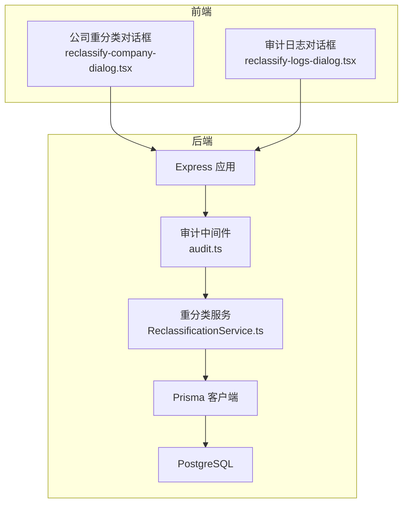
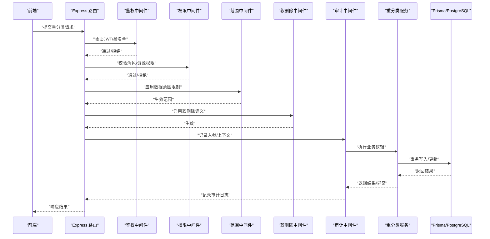
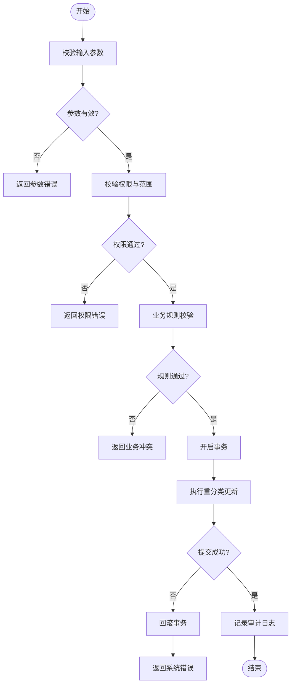
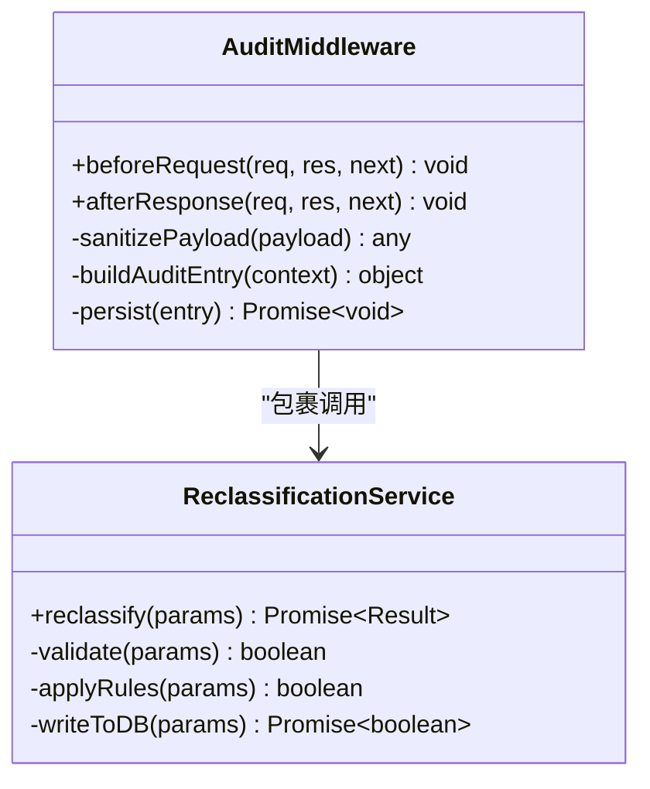
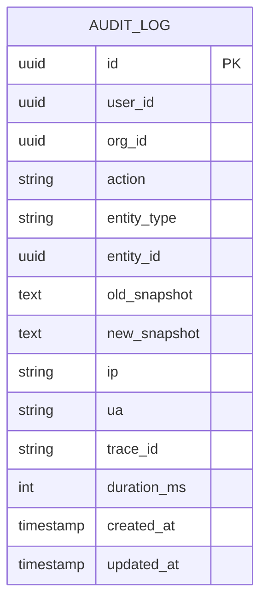
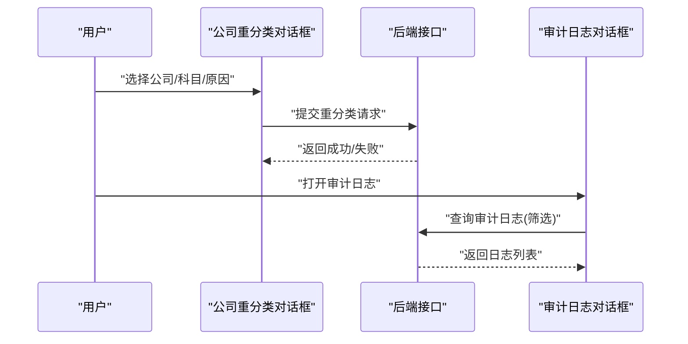
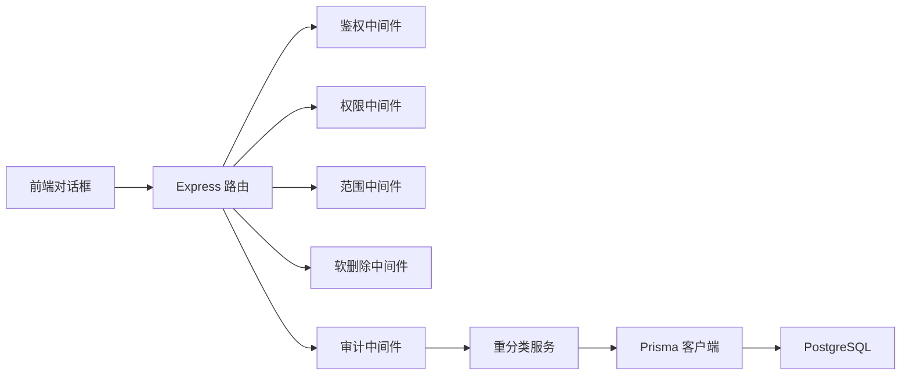

# 重分类与审计追踪系统

<cite>
**本文引用的文件**   
- [server/src/services/ReclassificationService.ts](file://server/src/services/ReclassificationService.ts)
- [server/src/middleware/audit.ts](file://server/src/middleware/audit.ts)
- [server/prisma/schema.prisma](file://server/prisma/schema.prisma)
- [server/prisma/migrations/20260726130000_add_reclassification_log/migration.sql](file://server/prisma/migrations/20260726130000_add_reclassification_log/migration.sql)
- [web/src/components/reclassify/reclassify-company-dialog.tsx](file://web/src/components/reclassify/reclassify-company-dialog.tsx)
- [web/src/components/reclassify/reclassify-logs-dialog.tsx](file://web/src/components/reclassify/reclassify-logs-dialog.tsx)
</cite>

## 目录
1. [简介](#简介)
2. [项目结构](#项目结构)
3. [核心组件](#核心组件)
4. [架构总览](#架构总览)
5. [详细组件分析](#详细组件分析)
6. [依赖分析](#依赖分析)
7. [性能考虑](#性能考虑)
8. [故障排查指南](#故障排查指南)
9. [结论](#结论)
10. [附录](#附录)

## 简介
本系统聚焦“重分类”与“审计追踪”两大能力，服务于浙江壹品慧财年经营数据分析平台。其目标是在保证数据口径一致性的前提下，提供可追溯、可回滚、可审计的科目重分类操作，并通过中间件链将关键变更持久化到审计日志中，满足内控与合规要求。

- 业务定位：Excel进、看板/报表出；单位统一为万元/人民币。
- 技术栈：Express 4 + Prisma 5 + PostgreSQL 15 + JWT（access 15min + refresh 7day 轮转）+ DeepSeek API（SSE 流式）。
- 中间件执行链顺序：helmet → cors → express.json → rate-limit → auth(JWT+黑名单) → permission(默认拒绝) → scope(Prisma extension) → softDelete → audit → Service → Prisma → PostgreSQL。
- 计算类指标使用安全公式解析（白名单算子 +-*/()，禁止 eval），同比/环比由后端实时计算不存库。
- AI 双管道架构：polish（文本→脱敏→LLM→还原）/ analyze（结构化→计算→脱敏→LLM→生成），脱敏规则：绝对金额→区间，公司名→动态映射。

## 项目结构
围绕重分类与审计追踪的关键代码分布如下：
- 服务端服务层：ReclassificationService.ts 负责重分类事务编排、校验与落库。
- 审计中间件：audit.ts 在请求链路中捕获并记录关键操作。
- 数据库模型与迁移：schema.prisma 与 add_reclassification_log 迁移定义审计表结构与字段。
- 前端交互：reclassify-company-dialog.tsx 触发重分类；reclassify-logs-dialog.tsx 展示审计日志。

图表来源
- [server/src/services/ReclassificationService.ts](file://server/src/services/ReclassificationService.ts)
- [server/src/middleware/audit.ts](file://server/src/middleware/audit.ts)
- [web/src/components/reclassify/reclassify-company-dialog.tsx](file://web/src/components/reclassify/reclassify-company-dialog.tsx)
- [web/src/components/reclassify/reclassify-logs-dialog.tsx](file://web/src/components/reclassify/reclassify-logs-dialog.tsx)

章节来源
- [server/src/services/ReclassificationService.ts](file://server/src/services/ReclassificationService.ts)
- [server/src/middleware/audit.ts](file://server/src/middleware/audit.ts)
- [server/prisma/schema.prisma](file://server/prisma/schema.prisma)
- [server/prisma/migrations/20260726130000_add_reclassification_log/migration.sql](file://server/prisma/migrations/20260726130000_add_reclassification_log/migration.sql)
- [web/src/components/reclassify/reclassify-company-dialog.tsx](file://web/src/components/reclassify/reclassify-company-dialog.tsx)
- [web/src/components/reclassify/reclassify-logs-dialog.tsx](file://web/src/components/reclassify/reclassify-logs-dialog.tsx)

## 核心组件
- 重分类服务（ReclassificationService）
  - 职责：接收重分类请求，进行参数校验、权限与范围检查、业务规则校验（如科目树约束）、事务性写入与审计事件触发。
  - 关键点：采用事务确保一致性；对敏感信息做脱敏处理；失败时回滚并记录错误上下文。
- 审计中间件（audit）
  - 职责：在请求进入 Service 之前或之后，提取用户身份、操作类型、影响范围、前后状态快照等，写入审计日志表。
  - 关键点：支持按路由/动作过滤；避免记录超大负载；异常时降级记录。
- 数据库模型与迁移
  - 职责：定义审计日志表结构（如操作人、时间、实体ID、动作、旧值/新值摘要、IP、UA、TraceId 等），并提供增量迁移脚本。
  - 关键点：索引优化查询；字段长度与枚举约束；软删除策略与审计隔离。
- 前端对话框
  - 公司重分类对话框：收集重分类参数（公司、原科目、目标科目、原因等），调用后端接口并提交。
  - 审计日志对话框：分页拉取审计日志，支持筛选（操作人、时间、动作、实体等）。

章节来源
- [server/src/services/ReclassificationService.ts](file://server/src/services/ReclassificationService.ts)
- [server/src/middleware/audit.ts](file://server/src/middleware/audit.ts)
- [server/prisma/schema.prisma](file://server/prisma/schema.prisma)
- [server/prisma/migrations/20260726130000_add_reclassification_log/migration.sql](file://server/prisma/migrations/20260726130000_add_reclassification_log/migration.sql)
- [web/src/components/reclassify/reclassify-company-dialog.tsx](file://web/src/components/reclassify/reclassify-company-dialog.tsx)
- [web/src/components/reclassify/reclassify-logs-dialog.tsx](file://web/src/components/reclassify/reclassify-logs-dialog.tsx)

## 架构总览
重分类与审计追踪的整体流程如下：

图表来源
- [server/src/middleware/audit.ts](file://server/src/middleware/audit.ts)
- [server/src/services/ReclassificationService.ts](file://server/src/services/ReclassificationService.ts)

## 详细组件分析

### 重分类服务（ReclassificationService）
- 设计要点
  - 输入校验：公司标识、原科目、目标科目、批次号、原因等必填项校验。
  - 权限与范围：结合当前用户与组织范围，确保仅允许操作授权范围内的公司/科目。
  - 业务规则：科目树层级、父子关系、冲突检测（如重复映射、循环引用）。
  - 事务性：批量更新需在一个事务内完成，失败全量回滚。
  - 审计事件：成功/失败均触发审计事件，包含差异摘要与上下文。
- 复杂度与性能
  - 批量重分类的时间复杂度与受影响行数线性相关；建议分批提交与并发控制。
  - 索引建议：按公司ID、科目ID、时间戳建立索引以加速查询与统计。
- 错误处理
  - 参数错误：快速失败，返回明确错误码与提示。
  - 业务冲突：抛出领域异常，附带冲突详情以便前端提示。
  - 系统异常：捕获并记录堆栈，对外返回通用错误码。

图表来源
- [server/src/services/ReclassificationService.ts](file://server/src/services/ReclassificationService.ts)

章节来源
- [server/src/services/ReclassificationService.ts](file://server/src/services/ReclassificationService.ts)

### 审计中间件（audit）
- 设计要点
  - 拦截点：在 Service 调用前后分别记录入参与出参摘要。
  - 内容脱敏：金额绝对值转为区间，公司名称动态映射，避免泄露敏感信息。
  - 上下文采集：用户ID、租户/组织、IP、UA、TraceId、耗时等。
  - 异步落盘：优先非阻塞记录，失败不影响主流程。
- 性能与安全
  - 大负载裁剪：对请求体/响应体进行大小限制与采样。
  - 异常降级：写入失败时记录本地缓冲或告警，保障可用性。

图表来源
- [server/src/middleware/audit.ts](file://server/src/middleware/audit.ts)
- [server/src/services/ReclassificationService.ts](file://server/src/services/ReclassificationService.ts)

章节来源
- [server/src/middleware/audit.ts](file://server/src/middleware/audit.ts)

### 数据库模型与迁移
- 审计日志表关键字段
  - 标识：自增主键/UUID
  - 操作主体：用户ID、组织ID、租户ID
  - 操作元数据：动作类型、实体类型、实体ID、TraceId、IP、UA、耗时
  - 数据快照：旧值摘要、新值摘要（脱敏后）
  - 时间戳：创建时间、更新时间
- 迁移脚本
  - 新增审计日志表及必要索引
  - 约束与默认值设置
  - 兼容历史数据的初始化策略

图表来源
- [server/prisma/schema.prisma](file://server/prisma/schema.prisma)
- [server/prisma/migrations/20260726130000_add_reclassification_log/migration.sql](file://server/prisma/migrations/20260726130000_add_reclassification_log/migration.sql)

章节来源
- [server/prisma/schema.prisma](file://server/prisma/schema.prisma)
- [server/prisma/migrations/20260726130000_add_reclassification_log/migration.sql](file://server/prisma/migrations/20260726130000_add_reclassification_log/migration.sql)

### 前端交互
- 公司重分类对话框
  - 功能：选择公司、原科目、目标科目、填写原因与批次号，提交重分类请求。
  - 交互：加载科目树、校验冲突、显示进度与结果。
- 审计日志对话框
  - 功能：分页查询审计日志，支持按操作人、时间、动作、实体筛选。
  - 交互：导出、展开详情查看脱敏后的新旧摘要。

图表来源
- [web/src/components/reclassify/reclassify-company-dialog.tsx](file://web/src/components/reclassify/reclassify-company-dialog.tsx)
- [web/src/components/reclassify/reclassify-logs-dialog.tsx](file://web/src/components/reclassify/reclassify-logs-dialog.tsx)

章节来源
- [web/src/components/reclassify/reclassify-company-dialog.tsx](file://web/src/components/reclassify/reclassify-company-dialog.tsx)
- [web/src/components/reclassify/reclassify-logs-dialog.tsx](file://web/src/components/reclassify/reclassify-logs-dialog.tsx)

## 依赖分析
- 模块耦合
  - 审计中间件依赖 Express 请求上下文与配置（脱敏规则、采样阈值）。
  - 重分类服务依赖 Prisma 客户端与事务能力，以及权限/范围中间件注入的用户上下文。
  - 前端依赖后端接口契约（请求/响应结构、错误码）。
- 外部依赖
  - PostgreSQL：存储审计日志与业务数据。
  - JWT：鉴权与用户上下文传递。
  - DeepSeek API：AI 管道（与本模块解耦，但整体系统遵循脱敏规范）。

图表来源
- [server/src/middleware/audit.ts](file://server/src/middleware/audit.ts)
- [server/src/services/ReclassificationService.ts](file://server/src/services/ReclassificationService.ts)

章节来源
- [server/src/middleware/audit.ts](file://server/src/middleware/audit.ts)
- [server/src/services/ReclassificationService.ts](file://server/src/services/ReclassificationService.ts)

## 性能考虑
- 事务与批处理
  - 批量重分类建议分批次提交，避免长事务锁竞争。
  - 合理设置事务超时与重试策略。
- 审计写入
  - 采用异步写入与限流，避免阻塞主流程。
  - 对大负载进行裁剪与采样，降低IO压力。
- 索引与查询
  - 审计日志表按时间、用户、实体类型建立复合索引，提升筛选效率。
  - 分页查询使用游标或基于时间的范围扫描，减少深分页开销。
- 内存与序列化
  - 脱敏与快照序列化注意对象深度与字段裁剪，防止内存峰值。

[本节为通用指导，不直接分析具体文件]

## 故障排查指南
- 常见问题
  - 权限不足：确认用户角色与组织范围是否覆盖目标公司/科目。
  - 业务冲突：检查科目树约束（父子关系、重复映射、循环引用）。
  - 审计缺失：检查中间件链顺序与审计写入是否被跳过或失败。
  - 性能问题：关注事务时长、审计写入延迟、数据库锁等待。
- 排查步骤
  - 查看 TraceId 串联日志，定位请求链路。
  - 核对审计日志中的旧值/新值摘要，确认变更是否符合预期。
  - 检查数据库索引命中率与慢查询日志。
  - 审查中间件配置（脱敏规则、采样阈值、限流策略）。

章节来源
- [server/src/middleware/audit.ts](file://server/src/middleware/audit.ts)
- [server/src/services/ReclassificationService.ts](file://server/src/services/ReclassificationService.ts)

## 结论
本系统通过清晰的分层与中间件链，实现了重分类操作的强一致性与完整审计追踪。借助脱敏与异步写入，系统在安全性与性能之间取得平衡。建议持续优化批处理与索引策略，完善监控与告警，进一步提升稳定性与可观测性。

[本节为总结性内容，不直接分析具体文件]

## 附录
- 术语
  - 重分类：将财务科目或公司归属从一个科目调整至另一个科目的操作。
  - 审计追踪：记录关键操作的上下文与数据快照，用于事后审计与回溯。
  - 脱敏：对敏感信息进行模糊化处理，如金额区间化、公司名称映射。
- 最佳实践
  - 所有写操作必须经过事务与审计中间件。
  - 前端表单需进行二次校验与冲突提示。
  - 定期归档审计日志，控制表规模与查询成本。

[本节为补充说明，不直接分析具体文件]