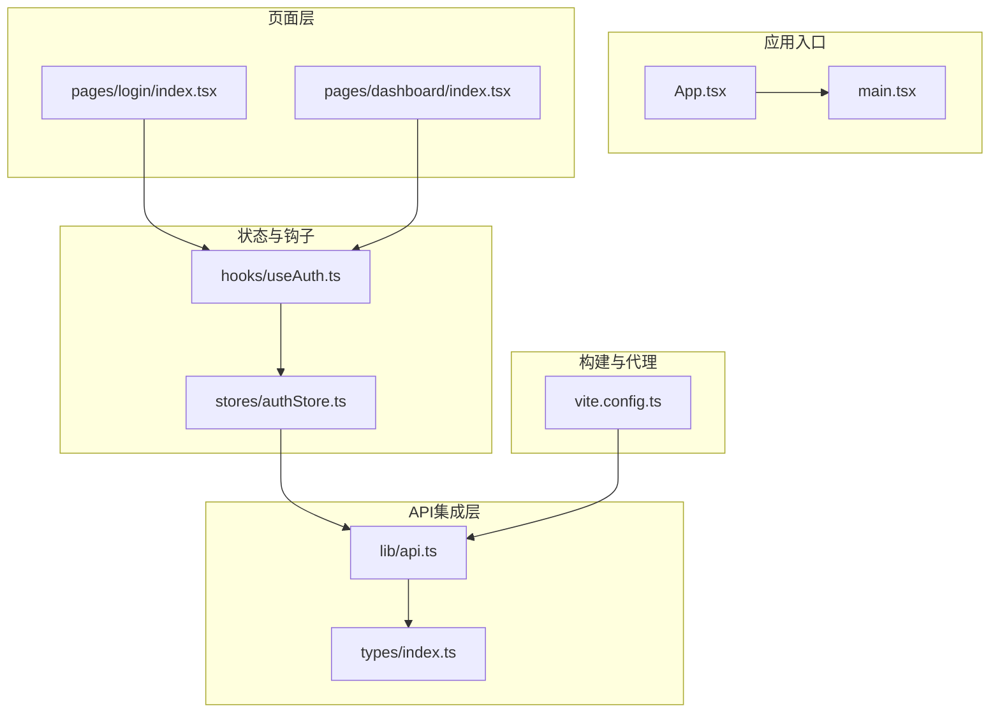
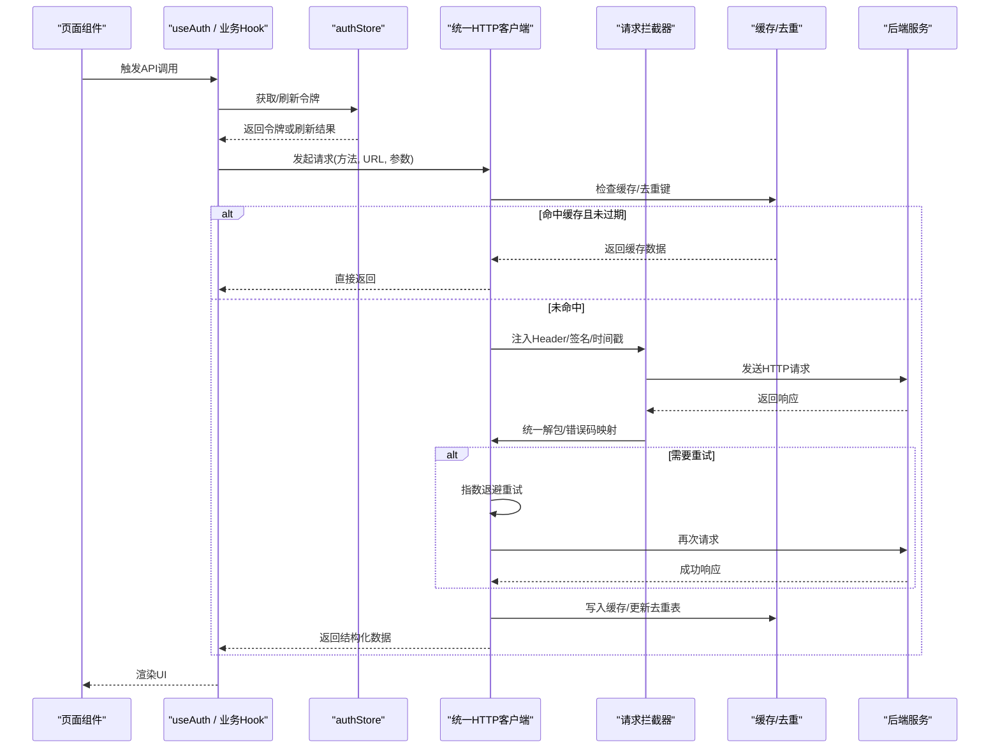
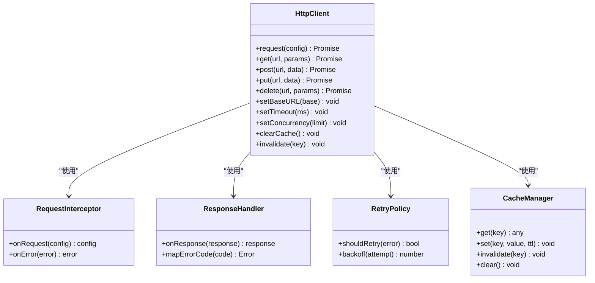
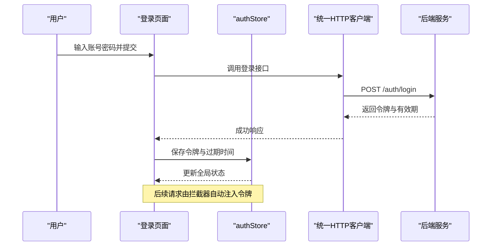
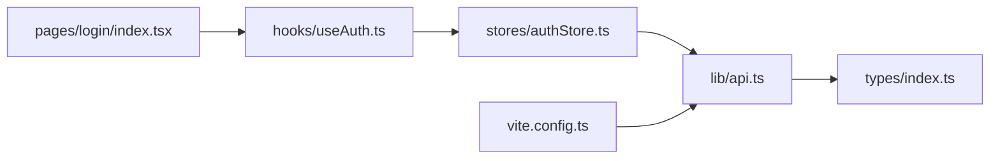

# API集成层

<cite>
**本文引用的文件**   
- [web/src/lib/api.ts](file://web/src/lib/api.ts)
- [web/src/types/index.ts](file://web/src/types/index.ts)
- [web/src/pages/login/index.tsx](file://web/src/pages/login/index.tsx)
- [web/src/stores/authStore.ts](file://web/src/stores/authStore.ts)
- [web/src/hooks/useAuth.ts](file://web/src/hooks/useAuth.ts)
- [web/vite.config.ts](file://web/vite.config.ts)
</cite>

## 目录
1. [简介](#简介)
2. [项目结构](#项目结构)
3. [核心组件](#核心组件)
4. [架构总览](#架构总览)
5. [详细组件分析](#详细组件分析)
6. [依赖分析](#依赖分析)
7. [性能考虑](#性能考虑)
8. [故障排查指南](#故障排查指南)
9. [结论](#结论)
10. [附录](#附录)

## 简介
本文件面向前端工程中的API集成层，聚焦统一HTTP客户端的设计与实现、请求拦截器与响应处理器、错误重试机制、RESTful封装最佳实践、参数校验与响应数据转换、请求配置管理（基础URL、超时、并发控制）、错误处理策略（网络异常、业务错误码映射、用户友好提示）、缓存机制（请求去重、响应缓存、失效策略），并提供完整的调用示例与性能优化技巧。文档以仓库中现有代码为依据，结合通用前端工程实践给出可落地的方案与图示。

## 项目结构
本项目采用基于功能域的模块化组织方式，API相关能力集中在lib目录下的统一客户端模块，类型定义集中于types目录，页面与状态管理通过hooks和stores进行组合使用。

图表来源
- [web/src/lib/api.ts](file://web/src/lib/api.ts)
- [web/src/types/index.ts](file://web/src/types/index.ts)
- [web/src/pages/login/index.tsx](file://web/src/pages/login/index.tsx)
- [web/src/stores/authStore.ts](file://web/src/stores/authStore.ts)
- [web/src/hooks/useAuth.ts](file://web/src/hooks/useAuth.ts)
- [web/vite.config.ts](file://web/vite.config.ts)

章节来源
- [web/src/lib/api.ts](file://web/src/lib/api.ts)
- [web/src/types/index.ts](file://web/src/types/index.ts)
- [web/src/pages/login/index.tsx](file://web/src/pages/login/index.tsx)
- [web/src/stores/authStore.ts](file://web/src/stores/authStore.ts)
- [web/src/hooks/useAuth.ts](file://web/src/hooks/useAuth.ts)
- [web/vite.config.ts](file://web/vite.config.ts)

## 核心组件
- 统一HTTP客户端：提供统一的请求/响应生命周期管理，包括请求拦截器（注入鉴权头、公共参数、日志等）、响应处理器（统一解包、错误码映射、类型化返回）、重试与退避策略、取消与并发控制、缓存与请求去重。
- 类型系统：集中定义请求参数、响应体、分页、错误对象、枚举等类型，确保前后端契约一致。
- 认证与令牌管理：在登录成功后持久化并注入访问令牌，支持自动刷新与无感续期。
- 构建期代理：开发环境通过Vite代理转发到后端服务，屏蔽跨域问题。

章节来源
- [web/src/lib/api.ts](file://web/src/lib/api.ts)
- [web/src/types/index.ts](file://web/src/types/index.ts)
- [web/src/stores/authStore.ts](file://web/src/stores/authStore.ts)
- [web/vite.config.ts](file://web/vite.config.ts)

## 架构总览
下图展示了从页面发起请求到服务端响应的完整链路，包含拦截器、认证、重试、缓存与错误处理的交互关系。

图表来源
- [web/src/lib/api.ts](file://web/src/lib/api.ts)
- [web/src/stores/authStore.ts](file://web/src/stores/authStore.ts)
- [web/src/hooks/useAuth.ts](file://web/src/hooks/useAuth.ts)

## 详细组件分析

### 统一HTTP客户端设计
- 请求拦截器
  - 注入鉴权头：从认证存储读取令牌并设置Authorization头。
  - 公共参数：附加时间戳、设备信息、追踪ID等。
  - 请求签名：对关键参数进行签名，防止篡改。
  - 日志与埋点：记录请求路径、耗时、状态码等。
- 响应处理器
  - 统一解包：将后端标准响应包装转换为业务数据结构。
  - 错误码映射：将业务错误码映射为前端友好的错误对象，便于全局提示。
  - 类型安全：基于泛型约束返回类型，配合TS类型推断。
- 重试与退避
  - 针对幂等GET请求或特定错误码进行自动重试。
  - 指数退避+抖动，避免雪崩。
  - 最大重试次数与超时兜底。
- 取消与并发控制
  - 基于AbortController的取消机制，组件卸载时自动取消。
  - 并发限制：通过信号量或队列控制同时进行的请求数。
- 缓存与请求去重
  - 请求去重：相同URL+参数的并发请求合并为一次真实请求。
  - 响应缓存：按Key缓存响应体与元数据，支持TTL与手动失效。
  - 失效策略：按资源维度或标签批量失效，写操作后主动失效。

章节来源
- [web/src/lib/api.ts](file://web/src/lib/api.ts)
- [web/src/types/index.ts](file://web/src/types/index.ts)

#### 类图（概念映射）

图表来源
- [web/src/lib/api.ts](file://web/src/lib/api.ts)

### RESTful API封装最佳实践
- 方法封装
  - GET：查询列表、详情；支持分页、排序、过滤。
  - POST：创建资源；支持表单与JSON两种提交。
  - PUT/PATCH：更新资源；区分全量与增量更新。
  - DELETE：删除资源；支持批量删除。
- 参数验证
  - 入参校验：必填、格式、范围、白名单校验。
  - 边界处理：空值、超长、特殊字符转义。
- 响应数据转换
  - 标准化字段：统一分页结构、时间格式化、枚举映射。
  - 类型断言：结合TS类型确保字段存在性与取值范围。

章节来源
- [web/src/lib/api.ts](file://web/src/lib/api.ts)
- [web/src/types/index.ts](file://web/src/types/index.ts)

### 请求配置管理
- 基础URL设置
  - 开发环境：通过Vite代理转发至后端，避免跨域。
  - 生产环境：通过环境变量注入域名与协议。
- 超时配置
  - 全局默认超时与接口级覆盖。
  - 大文件上传/下载单独配置较长超时。
- 并发控制
  - 全局并发上限，避免阻塞浏览器线程。
  - 优先级队列：关键请求优先执行。

章节来源
- [web/vite.config.ts](file://web/vite.config.ts)
- [web/src/lib/api.ts](file://web/src/lib/api.ts)

### 错误处理策略
- 网络异常
  - 连接失败、超时、DNS解析错误分类处理。
  - 离线检测与重试提示。
- 业务错误码映射
  - 将后端错误码映射为前端错误对象，包含消息、建议动作、是否可重试。
- 用户友好提示
  - 全局错误提示中心：Toast、Modal、路由跳转等。
  - 敏感信息脱敏与国际化文案。

章节来源
- [web/src/lib/api.ts](file://web/src/lib/api.ts)
- [web/src/types/index.ts](file://web/src/types/index.ts)

### 缓存机制实现
- 请求去重
  - 同一时刻相同请求只发一次，其余等待复用结果。
- 响应缓存
  - 按URL+参数生成Key，缓存响应体与元数据。
  - TTL过期自动失效，支持按需刷新。
- 失效策略
  - 写操作后主动失效相关Key。
  - 标签式失效：按资源族批量清理。

章节来源
- [web/src/lib/api.ts](file://web/src/lib/api.ts)

### 认证与令牌管理
- 登录流程
  - 页面触发登录 -> 调用认证接口 -> 存储令牌 -> 更新全局状态。
- 自动续期
  - 令牌即将过期时后台静默刷新。
  - 刷新失败则引导重新登录。

章节来源
- [web/src/pages/login/index.tsx](file://web/src/pages/login/index.tsx)
- [web/src/stores/authStore.ts](file://web/src/stores/authStore.ts)
- [web/src/hooks/useAuth.ts](file://web/src/hooks/useAuth.ts)

#### 序列图：登录与令牌注入

图表来源
- [web/src/pages/login/index.tsx](file://web/src/pages/login/index.tsx)
- [web/src/stores/authStore.ts](file://web/src/stores/authStore.ts)
- [web/src/lib/api.ts](file://web/src/lib/api.ts)

### 文件上传与下载
- 上传
  - 支持FormData分片上传、进度回调、断点续传（可选）。
  - 大文件并发分块上传，完成后合并。
- 下载
  - Blob流式下载，支持进度与取消。
  - 文件名与MIME类型解析。

章节来源
- [web/src/lib/api.ts](file://web/src/lib/api.ts)

### 流式数据处理
- SSE/事件流
  - 建立EventSource连接，订阅事件并逐步渲染。
- WebSocket
  - 心跳保活、断线重连、消息队列。
- 长轮询
  - 降级方案，兼容不支持SSE的环境。

章节来源
- [web/src/lib/api.ts](file://web/src/lib/api.ts)

### 完整API调用示例（说明性）
- GET：获取列表与详情
  - 用法：传入分页与过滤参数，返回结构化数据。
- POST：创建资源
  - 用法：提交表单或JSON，返回新资源ID与状态。
- PUT/PATCH：更新资源
  - 用法：全量或增量更新，返回最新状态。
- DELETE：删除资源
  - 用法：单条或批量删除，返回确认结果。
- 文件上传/下载
  - 用法：选择文件后上传，显示进度；下载文件并保存到本地。
- 流式数据
  - 用法：订阅实时事件，逐步更新UI。

章节来源
- [web/src/lib/api.ts](file://web/src/lib/api.ts)

## 依赖分析
- 内部依赖
  - 页面与Hooks依赖统一客户端进行数据交互。
  - 认证存储与拦截器协作，保证请求携带有效令牌。
  - 类型定义贯穿各层，保障契约一致性。
- 外部依赖
  - 构建期代理（Vite）用于开发环境转发。
  - 浏览器原生Fetch/AbortController/EventSource/WebSocket。

图表来源
- [web/src/pages/login/index.tsx](file://web/src/pages/login/index.tsx)
- [web/src/hooks/useAuth.ts](file://web/src/hooks/useAuth.ts)
- [web/src/stores/authStore.ts](file://web/src/stores/authStore.ts)
- [web/src/lib/api.ts](file://web/src/lib/api.ts)
- [web/src/types/index.ts](file://web/src/types/index.ts)
- [web/vite.config.ts](file://web/vite.config.ts)

章节来源
- [web/src/lib/api.ts](file://web/src/lib/api.ts)
- [web/src/types/index.ts](file://web/src/types/index.ts)
- [web/src/stores/authStore.ts](file://web/src/stores/authStore.ts)
- [web/src/hooks/useAuth.ts](file://web/src/hooks/useAuth.ts)
- [web/src/pages/login/index.tsx](file://web/src/pages/login/index.tsx)
- [web/vite.config.ts](file://web/vite.config.ts)

## 性能考虑
- 请求合并
  - 相同请求在窗口期内合并，减少重复网络开销。
- 懒加载
  - 按需加载页面与数据，首屏更快。
- 预取策略
  - 预测用户行为，提前拉取可能用到的数据。
- 并发控制
  - 限制并发数，避免阻塞主线程与带宽拥塞。
- 缓存命中率
  - 合理设置TTL与失效策略，提升命中率。
- 传输优化
  - Gzip/Brotli压缩、图片WebP、CDN加速。

[本节为通用指导，不直接分析具体文件]

## 故障排查指南
- 常见问题
  - 401未授权：检查令牌是否存在与是否过期，必要时触发刷新或重新登录。
  - 5xx服务器错误：查看服务端日志，判断是否为瞬时错误并启用重试。
  - 网络异常：检查DNS、代理、证书与跨域配置。
- 定位手段
  - 开启请求日志与埋点，记录URL、耗时、状态码、错误堆栈。
  - 使用浏览器开发者工具Network面板与Console输出。
- 恢复策略
  - 自动重试与退避、降级到静态数据或缓存、引导用户重试。

章节来源
- [web/src/lib/api.ts](file://web/src/lib/api.ts)
- [web/src/types/index.ts](file://web/src/types/index.ts)

## 结论
通过统一HTTP客户端与完善的拦截器、响应处理器、重试与缓存机制，API集成层实现了高内聚、低耦合的前端数据访问能力。结合类型系统与错误映射，提升了稳定性与可维护性。在生产环境中，应持续监控性能指标与错误率，并根据业务特性调优缓存与并发策略。

[本节为总结性内容，不直接分析具体文件]

## 附录
- 术语
  - 请求去重：同一时刻相同请求仅发起一次，其他请求复用结果。
  - 指数退避：重试间隔随尝试次数呈指数增长，降低冲突概率。
  - 失效策略：根据TTL或写操作触发缓存清理的规则。
- 参考
  - 后端接口规范与错误码定义请参考后端文档与错误码规范。

[本节为补充说明，不直接分析具体文件]