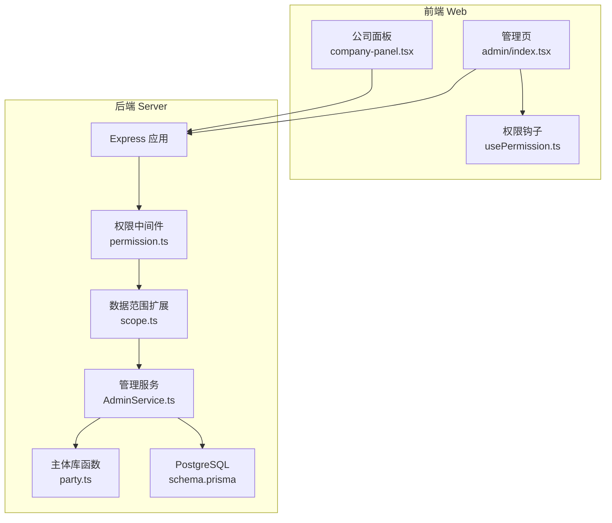
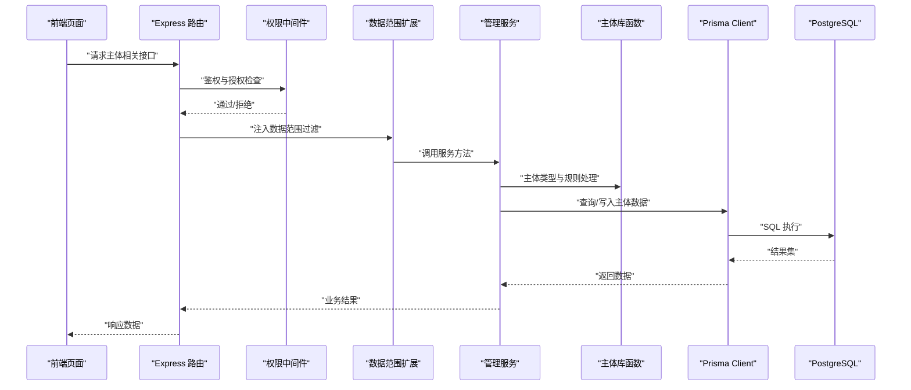
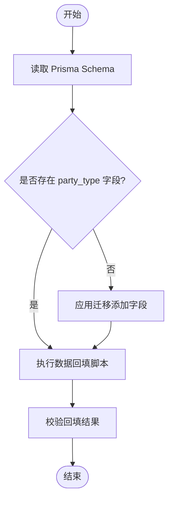
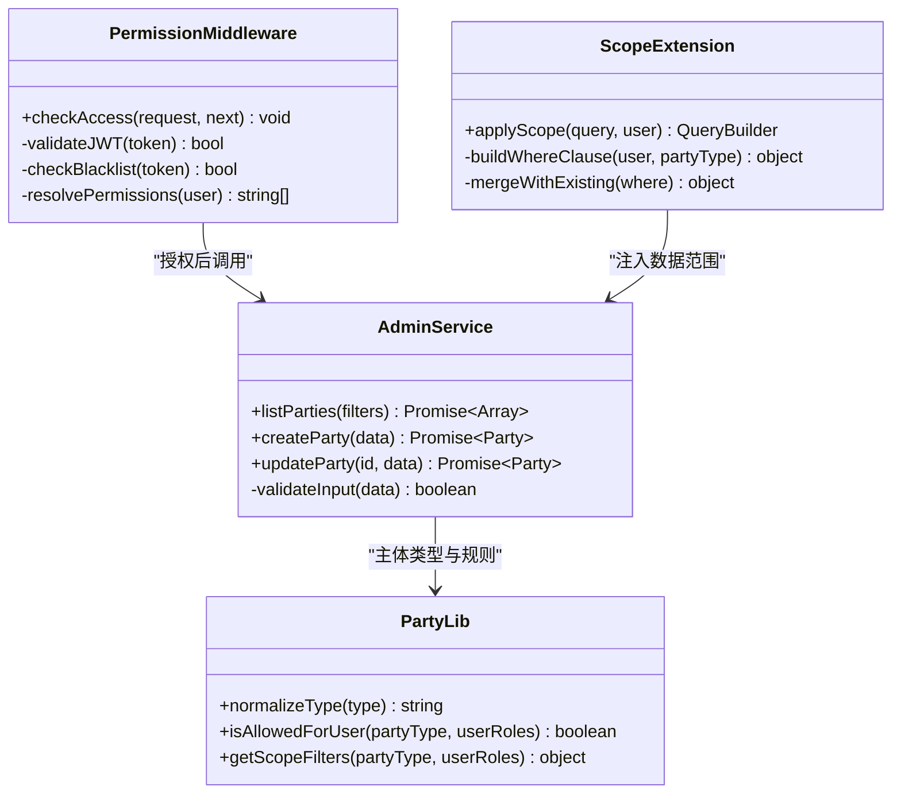
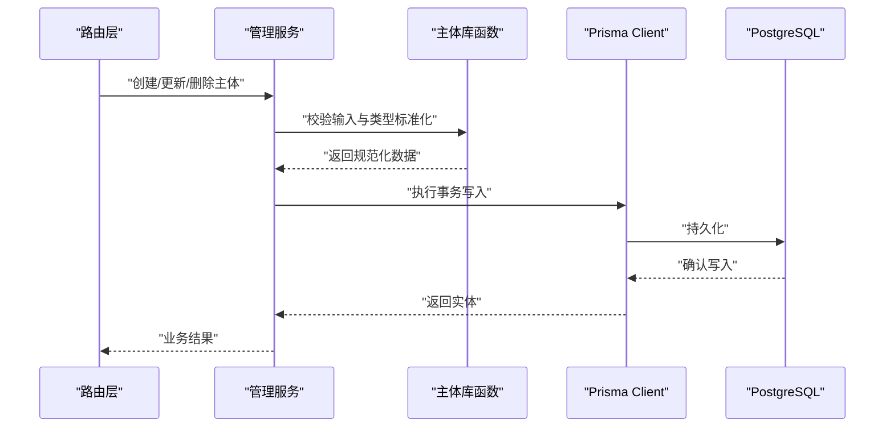
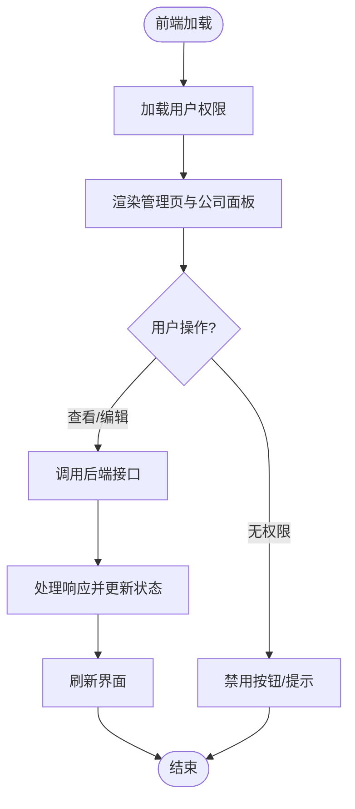
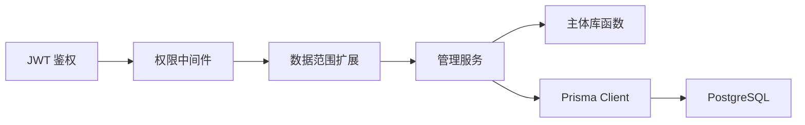

# Party主体管理系统

<cite>
**本文引用的文件**   
- [server/src/lib/party.ts](file://server/src/lib/party.ts)
- [server/src/middleware/permission.ts](file://server/src/middleware/permission.ts)
- [server/src/middleware/scope.ts](file://server/src/middleware/scope.ts)
- [server/src/services/AdminService.ts](file://server/src/services/AdminService.ts)
- [server/prisma/schema.prisma](file://server/prisma/schema.prisma)
- [server/prisma/migrations/20260730025638_add_party_type/migration.sql](file://server/prisma/migrations/20260730025638_add_party_type/migration.sql)
- [server/scripts/backfill-party-type.ts](file://server/scripts/backfill-party-type.ts)
- [web/src/pages/admin/index.tsx](file://web/src/pages/admin/index.tsx)
- [web/src/components/dimension/company-panel.tsx](file://web/src/components/dimension/company-panel.tsx)
- [web/src/hooks/usePermission.ts](file://web/src/hooks/usePermission.ts)
</cite>

## 目录
1. [引言](#引言)
2. [项目结构](#项目结构)
3. [核心组件](#核心组件)
4. [架构总览](#架构总览)
5. [详细组件分析](#详细组件分析)
6. [依赖关系分析](#依赖关系分析)
7. [性能考量](#性能考量)
8. [故障排查指南](#故障排查指南)
9. [结论](#结论)
10. [附录](#附录)

## 引言
本文件围绕“Party主体管理系统”进行系统化文档化，聚焦于企业、组织与业务单元等“主体（Party）”的建模、权限控制、数据范围与前端管理界面的整体设计与实现。系统定位为浙江壹品慧财年经营数据分析平台，采用 Express + Prisma + PostgreSQL + JWT 技术栈，中间件执行链遵循严格顺序：helmet → cors → express.json → rate-limit → auth(JWT+黑名单) → permission(默认拒绝) → scope(Prisma extension) → softDelete → audit → Service → Prisma → PostgreSQL。计算类指标使用安全公式解析，AI 双管道架构用于文本与结构化数据的脱敏与生成。

## 项目结构
本项目为前后端分离架构：
- 后端 server：Express 应用、路由、中间件、服务层、Prisma 数据模型与迁移、脚本工具。
- 前端 web：React + Vite + Tailwind，包含页面、组件、状态与权限钩子等。

**图示来源** 
- [web/src/pages/admin/index.tsx](file://web/src/pages/admin/index.tsx)
- [web/src/components/dimension/company-panel.tsx](file://web/src/components/dimension/company-panel.tsx)
- [web/src/hooks/usePermission.ts](file://web/src/hooks/usePermission.ts)
- [server/src/middleware/permission.ts](file://server/src/middleware/permission.ts)
- [server/src/middleware/scope.ts](file://server/src/middleware/scope.ts)
- [server/src/services/AdminService.ts](file://server/src/services/AdminService.ts)
- [server/src/lib/party.ts](file://server/src/lib/party.ts)
- [server/prisma/schema.prisma](file://server/prisma/schema.prisma)

**章节来源**
- [server/src/lib/party.ts](file://server/src/lib/party.ts)
- [server/src/middleware/permission.ts](file://server/src/middleware/permission.ts)
- [server/src/middleware/scope.ts](file://server/src/middleware/scope.ts)
- [server/src/services/AdminService.ts](file://server/src/services/AdminService.ts)
- [server/prisma/schema.prisma](file://server/prisma/schema.prisma)
- [web/src/pages/admin/index.tsx](file://web/src/pages/admin/index.tsx)
- [web/src/components/dimension/company-panel.tsx](file://web/src/components/dimension/company-panel.tsx)
- [web/src/hooks/usePermission.ts](file://web/src/hooks/usePermission.ts)

## 核心组件
- 主体类型与建模：通过 Prisma schema 定义 Party 实体及类型字段，支持企业、组织、业务单元等多维主体。
- 权限与数据范围：基于中间件链实现“默认拒绝”的权限策略，结合 Prisma extension 的数据范围过滤，确保主体级数据隔离。
- 管理服务：提供主体的增删改查、批量操作与校验逻辑，封装对底层库函数的调用。
- 前端管理界面：管理页与公司面板负责展示与交互，权限钩子控制可见性与操作按钮。

**章节来源**
- [server/prisma/schema.prisma](file://server/prisma/schema.prisma)
- [server/src/middleware/permission.ts](file://server/src/middleware/permission.ts)
- [server/src/middleware/scope.ts](file://server/src/middleware/scope.ts)
- [server/src/services/AdminService.ts](file://server/src/services/AdminService.ts)
- [web/src/pages/admin/index.tsx](file://web/src/pages/admin/index.tsx)
- [web/src/components/dimension/company-panel.tsx](file://web/src/components/dimension/company-panel.tsx)
- [web/src/hooks/usePermission.ts](file://web/src/hooks/usePermission.ts)

## 架构总览
下图展示了从前端到数据库的完整调用链路，突出 Party 主体在权限与数据范围中的关键作用。

**图示来源** 
- [server/src/middleware/permission.ts](file://server/src/middleware/permission.ts)
- [server/src/middleware/scope.ts](file://server/src/middleware/scope.ts)
- [server/src/services/AdminService.ts](file://server/src/services/AdminService.ts)
- [server/src/lib/party.ts](file://server/src/lib/party.ts)
- [server/prisma/schema.prisma](file://server/prisma/schema.prisma)

## 详细组件分析

### 主体类型与数据模型
- 主体类型字段：在迁移中新增 party_type 枚举或字符串字段，用于区分企业、组织、业务单元等类型。
- 数据模型设计：Prisma schema 中定义 Party 实体及其关联关系，确保主体维度可被权限与范围过滤有效利用。
- 数据回填脚本：提供 backfill 脚本以兼容历史数据，确保新字段在所有记录上具备合理默认值。

**图示来源** 
- [server/prisma/migrations/20260730025638_add_party_type/migration.sql](file://server/prisma/migrations/20260730025638_add_party_type/migration.sql)
- [server/scripts/backfill-party-type.ts](file://server/scripts/backfill-party-type.ts)
- [server/prisma/schema.prisma](file://server/prisma/schema.prisma)

**章节来源**
- [server/prisma/migrations/20260730025638_add_party_type/migration.sql](file://server/prisma/migrations/20260730025638_add_party_type/migration.sql)
- [server/scripts/backfill-party-type.ts](file://server/scripts/backfill-party-type.ts)
- [server/prisma/schema.prisma](file://server/prisma/schema.prisma)

### 权限与数据范围中间件
- 权限中间件：采用“默认拒绝”策略，显式白名单放行受控路径；结合 JWT 鉴权与黑名单校验。
- 数据范围扩展：通过 Prisma extension 注入 where 条件，按用户角色与主体类型自动过滤数据，避免越权访问。
- 软删除与审计：在中间件链中统一处理软删除标记与审计日志，保证数据一致性与可追溯性。

**图示来源** 
- [server/src/middleware/permission.ts](file://server/src/middleware/permission.ts)
- [server/src/middleware/scope.ts](file://server/src/middleware/scope.ts)
- [server/src/services/AdminService.ts](file://server/src/services/AdminService.ts)
- [server/src/lib/party.ts](file://server/src/lib/party.ts)

**章节来源**
- [server/src/middleware/permission.ts](file://server/src/middleware/permission.ts)
- [server/src/middleware/scope.ts](file://server/src/middleware/scope.ts)
- [server/src/services/AdminService.ts](file://server/src/services/AdminService.ts)
- [server/src/lib/party.ts](file://server/src/lib/party.ts)

### 管理服务与主体库函数
- 管理服务：封装主体 CRUD、批量导入与校验逻辑，统一错误处理与事务边界。
- 主体库函数：提供类型标准化、权限判定与范围过滤构建等通用能力，供服务层复用。

**图示来源** 
- [server/src/services/AdminService.ts](file://server/src/services/AdminService.ts)
- [server/src/lib/party.ts](file://server/src/lib/party.ts)
- [server/prisma/schema.prisma](file://server/prisma/schema.prisma)

**章节来源**
- [server/src/services/AdminService.ts](file://server/src/services/AdminService.ts)
- [server/src/lib/party.ts](file://server/src/lib/party.ts)

### 前端管理与权限控制
- 管理页：集中展示主体列表、筛选与操作入口，调用后端 API 完成数据交互。
- 公司面板：针对公司维度的主体信息展示与编辑，支持按主体类型过滤。
- 权限钩子：根据当前用户角色与资源权限动态控制 UI 渲染与操作可用性。

**图示来源** 
- [web/src/pages/admin/index.tsx](file://web/src/pages/admin/index.tsx)
- [web/src/components/dimension/company-panel.tsx](file://web/src/components/dimension/company-panel.tsx)
- [web/src/hooks/usePermission.ts](file://web/src/hooks/usePermission.ts)

**章节来源**
- [web/src/pages/admin/index.tsx](file://web/src/pages/admin/index.tsx)
- [web/src/components/dimension/company-panel.tsx](file://web/src/components/dimension/company-panel.tsx)
- [web/src/hooks/usePermission.ts](file://web/src/hooks/usePermission.ts)

## 依赖关系分析
- 模块耦合：权限与范围中间件强依赖用户上下文与角色配置；管理服务依赖主体库函数进行输入校验与规则判断；Prisma 扩展将数据范围注入查询层。
- 外部依赖：JWT 鉴权、PostgreSQL 存储、DeepSeek API（AI 管道）、Excel 导入导出工具。
- 潜在循环：应避免在服务层直接调用中间件；通过路由层协调中间件与服务层，保持单向依赖。

**图示来源** 
- [server/src/middleware/permission.ts](file://server/src/middleware/permission.ts)
- [server/src/middleware/scope.ts](file://server/src/middleware/scope.ts)
- [server/src/services/AdminService.ts](file://server/src/services/AdminService.ts)
- [server/src/lib/party.ts](file://server/src/lib/party.ts)
- [server/prisma/schema.prisma](file://server/prisma/schema.prisma)

**章节来源**
- [server/src/middleware/permission.ts](file://server/src/middleware/permission.ts)
- [server/src/middleware/scope.ts](file://server/src/middleware/scope.ts)
- [server/src/services/AdminService.ts](file://server/src/services/AdminService.ts)
- [server/src/lib/party.ts](file://server/src/lib/party.ts)
- [server/prisma/schema.prisma](file://server/prisma/schema.prisma)

## 性能考量
- 查询优化：通过 Prisma 扩展注入精确 where 条件，减少不必要的数据扫描；对高频字段建立索引（如主体类型、公司标识）。
- 事务与批处理：批量导入与更新使用事务包裹，降低锁竞争与回滚成本。
- 缓存策略：对静态字典（如主体类型映射）进行内存缓存，减少重复计算。
- AI 管道：文本与结构化数据脱敏后流式传输，避免大对象阻塞。

[本节为通用指导，不直接分析具体文件]

## 故障排查指南
- 权限拒绝：检查 JWT 是否有效、是否在黑名单、用户角色是否具备所需权限；确认路由白名单配置。
- 数据范围异常：验证 Prisma 扩展是否正确注入 where 条件；检查用户上下文中的主体类型与角色映射。
- 数据不一致：核对迁移脚本与回填脚本执行顺序；确认事务边界与错误回滚逻辑。
- 前端显示异常：确认权限钩子返回值与 UI 渲染逻辑一致性；检查 API 响应结构与状态码。

**章节来源**
- [server/src/middleware/permission.ts](file://server/src/middleware/permission.ts)
- [server/src/middleware/scope.ts](file://server/src/middleware/scope.ts)
- [server/src/services/AdminService.ts](file://server/src/services/AdminService.ts)
- [web/src/hooks/usePermission.ts](file://web/src/hooks/usePermission.ts)

## 结论
Party 主体管理系统通过严谨的中间件链与 Prisma 数据范围扩展，实现了主体级别的权限控制与数据隔离。配合完善的迁移与回填脚本，系统在演进过程中保持了数据一致性与向后兼容。前端通过权限钩子与组件化设计，提供了直观的管理体验。建议在后续迭代中持续优化查询性能与缓存策略，并完善监控与告警机制。

[本节为总结性内容，不直接分析具体文件]

## 附录
- 术语表：Party（主体）、权限（Authorization）、数据范围（Data Scope）、软删除（Soft Delete）、审计（Audit）。
- 最佳实践：始终使用“默认拒绝”的权限策略；通过 Prisma 扩展集中处理数据范围；对敏感数据进行脱敏后再进入 AI 管道。

[本节为概念性内容，不直接分析具体文件]