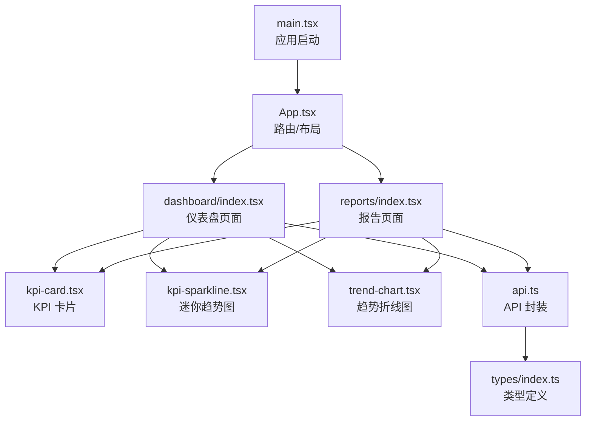
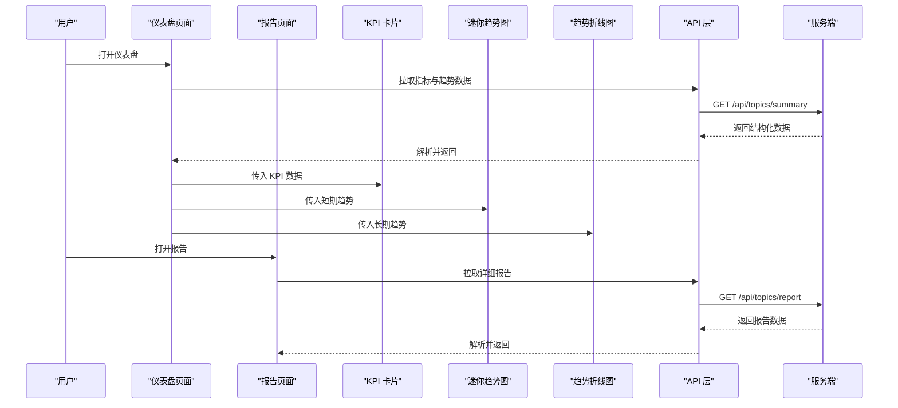
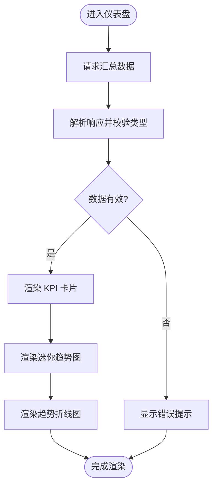
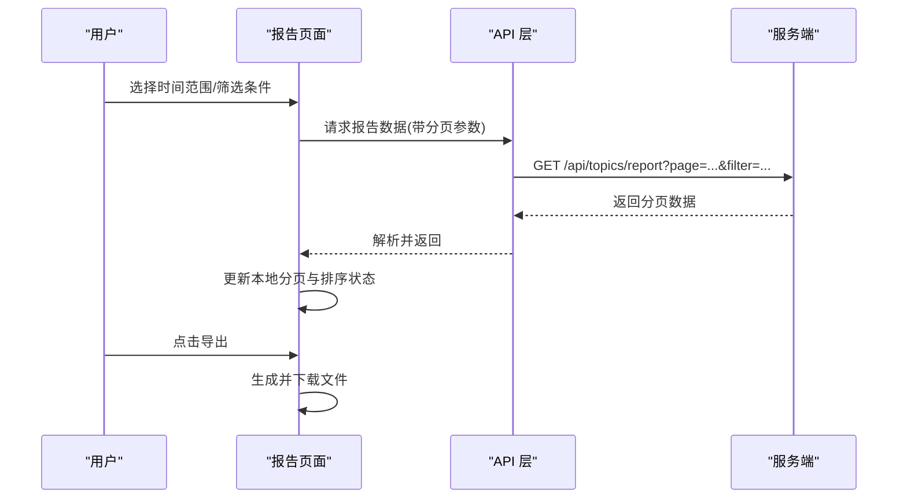
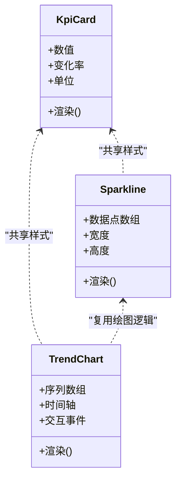
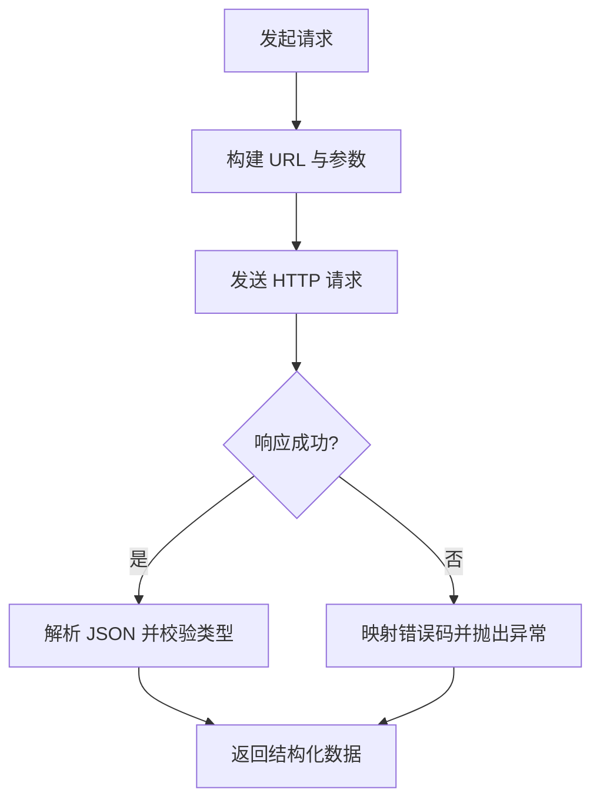
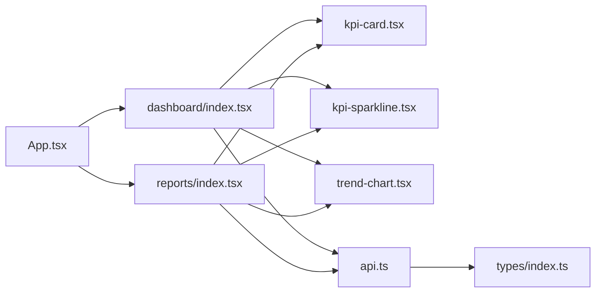

# 主题分析模块

<cite>
**本文引用的文件**   
- [web/src/pages/dashboard/index.tsx](file://web/src/pages/dashboard/index.tsx)
- [web/src/pages/reports/index.tsx](file://web/src/pages/reports/index.tsx)
- [web/src/components/charts/kpi-card.tsx](file://web/src/components/charts/kpi-card.tsx)
- [web/src/components/charts/kpi-sparkline.tsx](file://web/src/components/charts/kpi-sparkline.tsx)
- [web/src/components/charts/trend-chart.tsx](file://web/src/components/charts/trend-chart.tsx)
- [web/src/lib/api.ts](file://web/src/lib/api.ts)
- [web/src/types/index.ts](file://web/src/types/index.ts)
- [web/src/App.tsx](file://web/src/App.tsx)
- [web/src/main.tsx](file://web/src/main.tsx)
</cite>

## 目录
1. [简介](#简介)
2. [项目结构](#项目结构)
3. [核心组件](#核心组件)
4. [架构总览](#架构总览)
5. [详细组件分析](#详细组件分析)
6. [依赖关系分析](#依赖关系分析)
7. [性能考虑](#性能考虑)
8. [故障排查指南](#故障排查指南)
9. [结论](#结论)
10. [附录](#附录)

## 简介
本文件围绕“主题分析模块”进行系统化文档化，聚焦于前端侧的数据可视化与指标展示能力。该模块由仪表盘页面、报告页面以及一组图表组件构成，通过统一的 API 层获取数据，并在类型系统约束下完成渲染与交互。文档从架构、组件职责、数据流、错误处理与性能优化等维度展开，帮助读者快速理解并扩展该模块。

## 项目结构
主题分析模块位于 web 子工程中，主要涉及以下目录与文件：
- 页面层：仪表盘与报告页作为入口，组织图表与业务逻辑
- 图表组件：KPI 卡片、迷你趋势图、趋势折线图
- 数据层：API 封装与类型定义
- 应用入口：路由与挂载点

图示来源
- [web/src/main.tsx:1-200](file://web/src/main.tsx#L1-L200)
- [web/src/App.tsx:1-200](file://web/src/App.tsx#L1-L200)
- [web/src/pages/dashboard/index.tsx:1-200](file://web/src/pages/dashboard/index.tsx#L1-L200)
- [web/src/pages/reports/index.tsx:1-200](file://web/src/pages/reports/index.tsx#L1-L200)
- [web/src/components/charts/kpi-card.tsx:1-200](file://web/src/components/charts/kpi-card.tsx#L1-L200)
- [web/src/components/charts/kpi-sparkline.tsx:1-200](file://web/src/components/charts/kpi-sparkline.tsx#L1-L200)
- [web/src/components/charts/trend-chart.tsx:1-200](file://web/src/components/charts/trend-chart.tsx#L1-L200)
- [web/src/lib/api.ts:1-200](file://web/src/lib/api.ts#L1-L200)
- [web/src/types/index.ts:1-200](file://web/src/types/index.ts#L1-L200)

章节来源
- [web/src/main.tsx:1-200](file://web/src/main.tsx#L1-L200)
- [web/src/App.tsx:1-200](file://web/src/App.tsx#L1-L200)
- [web/src/pages/dashboard/index.tsx:1-200](file://web/src/pages/dashboard/index.tsx#L1-L200)
- [web/src/pages/reports/index.tsx:1-200](file://web/src/pages/reports/index.tsx#L1-L200)
- [web/src/components/charts/kpi-card.tsx:1-200](file://web/src/components/charts/kpi-card.tsx#L1-L200)
- [web/src/components/charts/kpi-sparkline.tsx:1-200](file://web/src/components/charts/kpi-sparkline.tsx#L1-L200)
- [web/src/components/charts/trend-chart.tsx:1-200](file://web/src/components/charts/trend-chart.tsx#L1-L200)
- [web/src/lib/api.ts:1-200](file://web/src/lib/api.ts#L1-L200)
- [web/src/types/index.ts:1-200](file://web/src/types/index.ts#L1-L200)

## 核心组件
- 仪表盘页面：聚合关键指标与趋势视图，提供时间范围筛选与刷新能力
- 报告页面：以表格或卡片形式呈现更详细的分析结果，支持导出与分页
- KPI 卡片：展示单一指标及其变化方向与幅度
- 迷你趋势图：在有限空间内展示短期走势
- 趋势折线图：展示较长周期的趋势变化，支持多序列对比
- API 层：统一请求封装、错误处理与重试策略
- 类型定义：为前后端数据结构提供强类型保障

章节来源
- [web/src/pages/dashboard/index.tsx:1-200](file://web/src/pages/dashboard/index.tsx#L1-L200)
- [web/src/pages/reports/index.tsx:1-200](file://web/src/pages/reports/index.tsx#L1-L200)
- [web/src/components/charts/kpi-card.tsx:1-200](file://web/src/components/charts/kpi-card.tsx#L1-L200)
- [web/src/components/charts/kpi-sparkline.tsx:1-200](file://web/src/components/charts/kpi-sparkline.tsx#L1-L200)
- [web/src/components/charts/trend-chart.tsx:1-200](file://web/src/components/charts/trend-chart.tsx#L1-L200)
- [web/src/lib/api.ts:1-200](file://web/src/lib/api.ts#L1-L200)
- [web/src/types/index.ts:1-200](file://web/src/types/index.ts#L1-L200)

## 架构总览
主题分析模块采用“页面-组件-数据”分层架构：
- 页面负责编排与状态管理（如时间范围、筛选条件）
- 图表组件专注于渲染与交互
- API 层负责网络请求、错误码映射与缓存策略
- 类型系统贯穿全链路，确保数据结构一致性与可维护性

图示来源
- [web/src/pages/dashboard/index.tsx:1-200](file://web/src/pages/dashboard/index.tsx#L1-L200)
- [web/src/pages/reports/index.tsx:1-200](file://web/src/pages/reports/index.tsx#L1-L200)
- [web/src/components/charts/kpi-card.tsx:1-200](file://web/src/components/charts/kpi-card.tsx#L1-L200)
- [web/src/components/charts/kpi-sparkline.tsx:1-200](file://web/src/components/charts/kpi-sparkline.tsx#L1-L200)
- [web/src/components/charts/trend-chart.tsx:1-200](file://web/src/components/charts/trend-chart.tsx#L1-L200)
- [web/src/lib/api.ts:1-200](file://web/src/lib/api.ts#L1-L200)

## 详细组件分析

### 仪表盘页面
- 职责：组合 KPI 卡片、迷你趋势图与趋势折线图；管理时间范围与刷新状态
- 数据流：调用 API 获取汇总数据，按字段分发至各图表组件
- 交互：支持切换时间范围、手动刷新、错误提示与加载态

图示来源
- [web/src/pages/dashboard/index.tsx:1-200](file://web/src/pages/dashboard/index.tsx#L1-L200)
- [web/src/lib/api.ts:1-200](file://web/src/lib/api.ts#L1-L200)
- [web/src/types/index.ts:1-200](file://web/src/types/index.ts#L1-L200)

章节来源
- [web/src/pages/dashboard/index.tsx:1-200](file://web/src/pages/dashboard/index.tsx#L1-L200)
- [web/src/lib/api.ts:1-200](file://web/src/lib/api.ts#L1-L200)
- [web/src/types/index.ts:1-200](file://web/src/types/index.ts#L1-L200)

### 报告页面
- 职责：展示详细分析结果，支持分页、排序与导出
- 数据流：按需拉取报告数据，结合本地状态实现分页与过滤
- 交互：导出 CSV/Excel、翻页、列排序、搜索关键词

图示来源
- [web/src/pages/reports/index.tsx:1-200](file://web/src/pages/reports/index.tsx#L1-L200)
- [web/src/lib/api.ts:1-200](file://web/src/lib/api.ts#L1-L200)

章节来源
- [web/src/pages/reports/index.tsx:1-200](file://web/src/pages/reports/index.tsx#L1-L200)
- [web/src/lib/api.ts:1-200](file://web/src/lib/api.ts#L1-L200)

### 图表组件族
- KPI 卡片：展示数值、同比/环比变化、颜色语义
- 迷你趋势图：在紧凑区域内绘制短期走势
- 趋势折线图：支持多序列、缩放、悬停详情

图示来源
- [web/src/components/charts/kpi-card.tsx:1-200](file://web/src/components/charts/kpi-card.tsx#L1-L200)
- [web/src/components/charts/kpi-sparkline.tsx:1-200](file://web/src/components/charts/kpi-sparkline.tsx#L1-L200)
- [web/src/components/charts/trend-chart.tsx:1-200](file://web/src/components/charts/trend-chart.tsx#L1-L200)

章节来源
- [web/src/components/charts/kpi-card.tsx:1-200](file://web/src/components/charts/kpi-card.tsx#L1-L200)
- [web/src/components/charts/kpi-sparkline.tsx:1-200](file://web/src/components/charts/kpi-sparkline.tsx#L1-L200)
- [web/src/components/charts/trend-chart.tsx:1-200](file://web/src/components/charts/trend-chart.tsx#L1-L200)

### 数据与类型
- API 层：统一封装请求方法、错误码映射、超时与重试配置
- 类型定义：为指标、趋势、报告等数据结构提供强类型约束，减少运行时错误

图示来源
- [web/src/lib/api.ts:1-200](file://web/src/lib/api.ts#L1-L200)
- [web/src/types/index.ts:1-200](file://web/src/types/index.ts#L1-L200)

章节来源
- [web/src/lib/api.ts:1-200](file://web/src/lib/api.ts#L1-L200)
- [web/src/types/index.ts:1-200](file://web/src/types/index.ts#L1-L200)

## 依赖关系分析
- 页面依赖图表组件与 API 层
- 图表组件仅依赖类型定义与通用工具
- API 层依赖类型定义与网络库
- 应用入口负责挂载与路由初始化

图示来源
- [web/src/App.tsx:1-200](file://web/src/App.tsx#L1-L200)
- [web/src/pages/dashboard/index.tsx:1-200](file://web/src/pages/dashboard/index.tsx#L1-L200)
- [web/src/pages/reports/index.tsx:1-200](file://web/src/pages/reports/index.tsx#L1-L200)
- [web/src/components/charts/kpi-card.tsx:1-200](file://web/src/components/charts/kpi-card.tsx#L1-L200)
- [web/src/components/charts/kpi-sparkline.tsx:1-200](file://web/src/components/charts/kpi-sparkline.tsx#L1-L200)
- [web/src/components/charts/trend-chart.tsx:1-200](file://web/src/components/charts/trend-chart.tsx#L1-L200)
- [web/src/lib/api.ts:1-200](file://web/src/lib/api.ts#L1-L200)
- [web/src/types/index.ts:1-200](file://web/src/types/index.ts#L1-L200)

章节来源
- [web/src/App.tsx:1-200](file://web/src/App.tsx#L1-L200)
- [web/src/pages/dashboard/index.tsx:1-200](file://web/src/pages/dashboard/index.tsx#L1-L200)
- [web/src/pages/reports/index.tsx:1-200](file://web/src/pages/reports/index.tsx#L1-L200)
- [web/src/components/charts/kpi-card.tsx:1-200](file://web/src/components/charts/kpi-card.tsx#L1-L200)
- [web/src/components/charts/kpi-sparkline.tsx:1-200](file://web/src/components/charts/kpi-sparkline.tsx#L1-L200)
- [web/src/components/charts/trend-chart.tsx:1-200](file://web/src/components/charts/trend-chart.tsx#L1-L200)
- [web/src/lib/api.ts:1-200](file://web/src/lib/api.ts#L1-L200)
- [web/src/types/index.ts:1-200](file://web/src/types/index.ts#L1-L200)

## 性能考虑
- 数据缓存：对热点指标使用短周期缓存，降低重复请求
- 增量更新：趋势数据采用增量拉取与合并，避免全量重绘
- 虚拟列表：报告页大数据集启用虚拟化渲染
- 懒加载：图表组件按需引入与渲染
- 防抖节流：搜索与筛选输入进行节流，减少频繁请求
- 错误降级：网络失败时回退到最近一次成功数据

[本节为通用指导，不直接分析具体文件]

## 故障排查指南
- 常见错误码映射：检查 API 层的错误码转换逻辑，确认是否覆盖所有业务场景
- 类型不一致：核对 types 定义与后端返回结构，必要时增加断言与日志
- 渲染异常：检查图表组件的边界条件（空数据、负值、NaN）
- 网络问题：确认超时与重试策略，查看浏览器控制台与网络面板
- 权限与鉴权：若接口需要鉴权，检查令牌有效期与刷新流程

章节来源
- [web/src/lib/api.ts:1-200](file://web/src/lib/api.ts#L1-L200)
- [web/src/types/index.ts:1-200](file://web/src/types/index.ts#L1-L200)

## 结论
主题分析模块通过清晰的页面-组件-数据分层，结合强类型与统一 API 封装，实现了稳定的指标展示与报告输出能力。建议在后续迭代中持续完善错误处理、性能优化与可观测性，以提升用户体验与可维护性。

[本节为总结性内容，不直接分析具体文件]

## 附录
- 相关入口文件
  - 应用启动：[web/src/main.tsx](file://web/src/main.tsx)
  - 路由与布局：[web/src/App.tsx](file://web/src/App.tsx)
- 页面与组件
  - 仪表盘：[web/src/pages/dashboard/index.tsx](file://web/src/pages/dashboard/index.tsx)
  - 报告：[web/src/pages/reports/index.tsx](file://web/src/pages/reports/index.tsx)
  - KPI 卡片：[web/src/components/charts/kpi-card.tsx](file://web/src/components/charts/kpi-card.tsx)
  - 迷你趋势图：[web/src/components/charts/kpi-sparkline.tsx](file://web/src/components/charts/kpi-sparkline.tsx)
  - 趋势折线图：[web/src/components/charts/trend-chart.tsx](file://web/src/components/charts/trend-chart.tsx)
- 数据与类型
  - API 封装：[web/src/lib/api.ts](file://web/src/lib/api.ts)
  - 类型定义：[web/src/types/index.ts](file://web/src/types/index.ts)