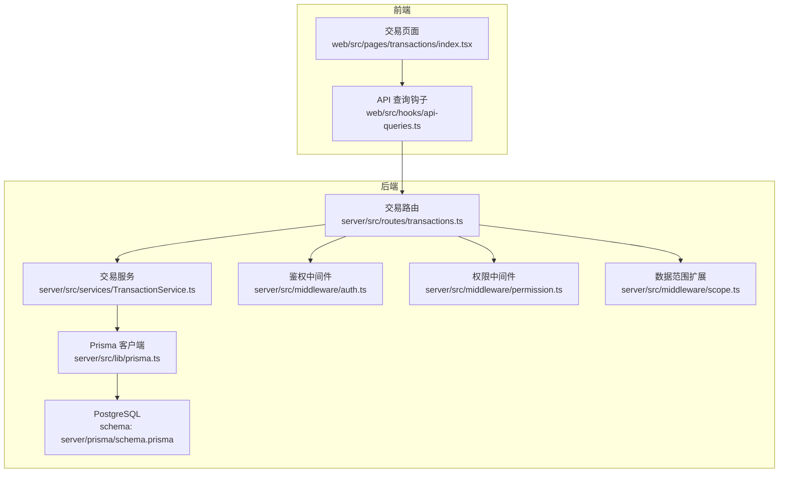
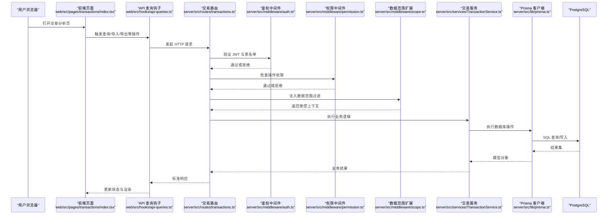
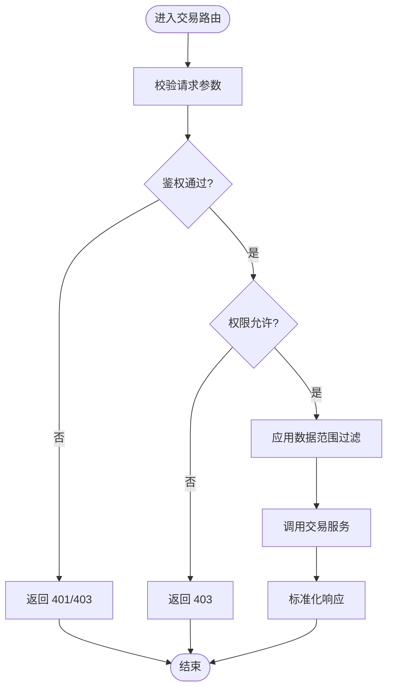
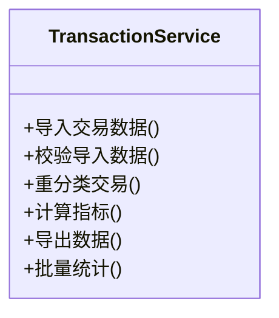
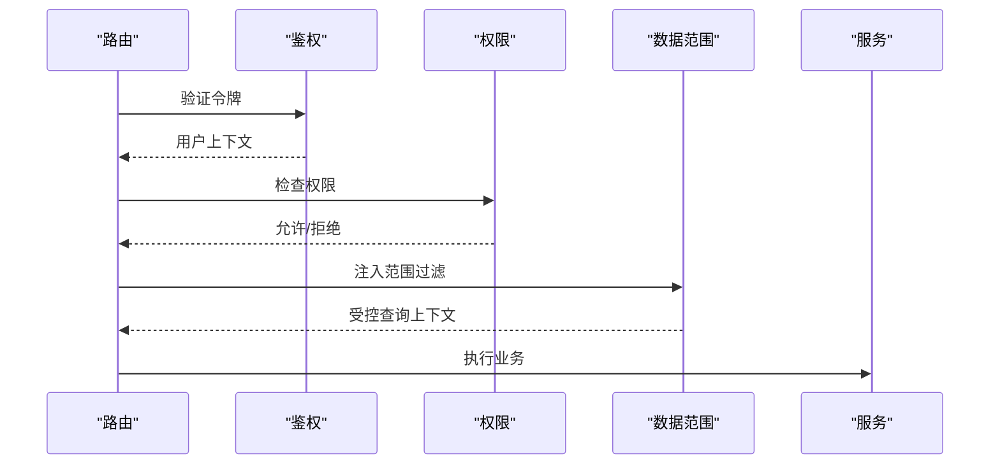
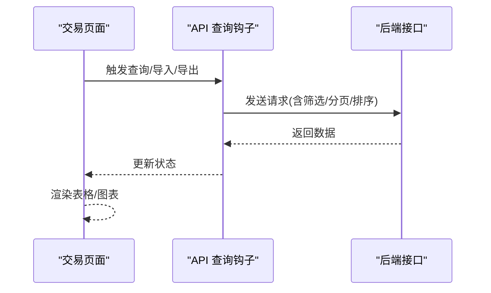
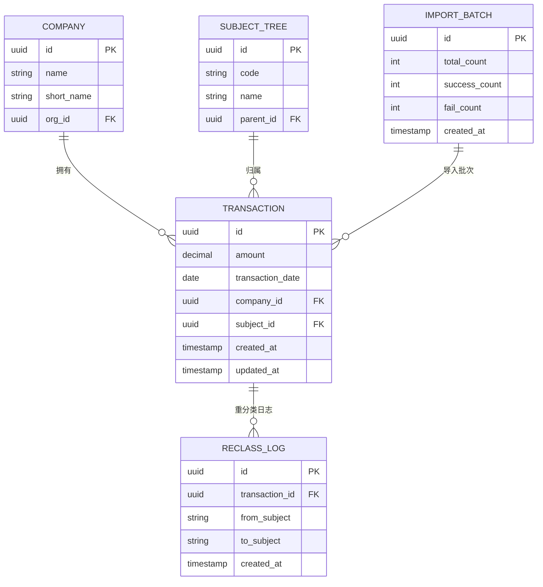
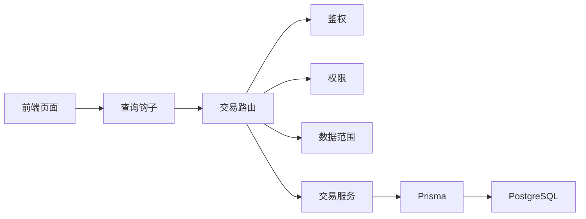

# 交易分析模块

<cite>
**本文引用的文件**   
- [server/src/routes/transactions.ts](file://server/src/routes/transactions.ts)
- [server/src/services/TransactionService.ts](file://server/src/services/TransactionService.ts)
- [server/src/middleware/auth.ts](file://server/src/middleware/auth.ts)
- [server/src/middleware/permission.ts](file://server/src/middleware/permission.ts)
- [server/src/middleware/scope.ts](file://server/src/middleware/scope.ts)
- [server/src/lib/prisma.ts](file://server/src/lib/prisma.ts)
- [server/prisma/schema.prisma](file://server/prisma/schema.prisma)
- [web/src/pages/transactions/index.tsx](file://web/src/pages/transactions/index.tsx)
- [web/src/hooks/api-queries.ts](file://web/src/hooks/api-queries.ts)
</cite>

## 目录
1. [简介](#简介)
2. [项目结构](#项目结构)
3. [核心组件](#核心组件)
4. [架构总览](#架构总览)
5. [详细组件分析](#详细组件分析)
6. [依赖分析](#依赖分析)
7. [性能考虑](#性能考虑)
8. [故障排查指南](#故障排查指南)
9. [结论](#结论)

## 简介
本章节面向“交易分析模块”，该模块为浙江壹品慧财年经营数据分析平台的核心能力之一，围绕“Excel进、看板/报表出”的内部管理口径财务数据平台定位，提供交易数据的导入、清洗、重分类、指标计算与可视化展示。后端采用 Express + Prisma + PostgreSQL，前端基于 React + Vite，通过 REST API 进行交互。计算类指标使用安全公式解析（白名单算子），同比/环比由后端实时计算不入库；AI 双管道用于文本与结构化分析的脱敏与生成。

## 项目结构
交易分析模块涉及前后端协同：
- 后端路由层暴露交易相关接口，服务层封装业务逻辑与数据库访问，中间件负责鉴权、权限、数据范围等横切关注点。
- 前端页面与查询钩子负责请求编排、状态管理与 UI 渲染。

**图表来源** 
- [server/src/routes/transactions.ts](file://server/src/routes/transactions.ts)
- [server/src/services/TransactionService.ts](file://server/src/services/TransactionService.ts)
- [server/src/middleware/auth.ts](file://server/src/middleware/auth.ts)
- [server/src/middleware/permission.ts](file://server/src/middleware/permission.ts)
- [server/src/middleware/scope.ts](file://server/src/middleware/scope.ts)
- [server/src/lib/prisma.ts](file://server/src/lib/prisma.ts)
- [server/prisma/schema.prisma](file://server/prisma/schema.prisma)
- [web/src/pages/transactions/index.tsx](file://web/src/pages/transactions/index.tsx)
- [web/src/hooks/api-queries.ts](file://web/src/hooks/api-queries.ts)

**章节来源**
- [server/src/routes/transactions.ts](file://server/src/routes/transactions.ts)
- [server/src/services/TransactionService.ts](file://server/src/services/TransactionService.ts)
- [server/src/middleware/auth.ts](file://server/src/middleware/auth.ts)
- [server/src/middleware/permission.ts](file://server/src/middleware/permission.ts)
- [server/src/middleware/scope.ts](file://server/src/middleware/scope.ts)
- [server/src/lib/prisma.ts](file://server/src/lib/prisma.ts)
- [server/prisma/schema.prisma](file://server/prisma/schema.prisma)
- [web/src/pages/transactions/index.tsx](file://web/src/pages/transactions/index.tsx)
- [web/src/hooks/api-queries.ts](file://web/src/hooks/api-queries.ts)

## 核心组件
- 交易路由：定义交易相关的 HTTP 接口，挂载鉴权、权限、数据范围等中间件，调用服务层方法完成业务处理。
- 交易服务：封装交易数据的导入、校验、重分类、聚合计算、导出等核心逻辑，统一错误与响应格式。
- 中间件链：helmet → cors → express.json → rate-limit → auth(JWT+黑名单) → permission(默认拒绝) → scope(Prisma extension) → softDelete → audit → Service → Prisma → PostgreSQL。
- 前端页面与查询钩子：组织请求参数、分页、筛选、排序，并驱动表格与图表渲染。

**章节来源**
- [server/src/routes/transactions.ts](file://server/src/routes/transactions.ts)
- [server/src/services/TransactionService.ts](file://server/src/services/TransactionService.ts)
- [server/src/middleware/auth.ts](file://server/src/middleware/auth.ts)
- [server/src/middleware/permission.ts](file://server/src/middleware/permission.ts)
- [server/src/middleware/scope.ts](file://server/src/middleware/scope.ts)
- [web/src/pages/transactions/index.tsx](file://web/src/pages/transactions/index.tsx)
- [web/src/hooks/api-queries.ts](file://web/src/hooks/api-queries.ts)

## 架构总览
交易分析模块的请求链路遵循统一的中间件执行顺序，确保安全性、可审计性与数据隔离。

**图表来源** 
- [server/src/routes/transactions.ts](file://server/src/routes/transactions.ts)
- [server/src/middleware/auth.ts](file://server/src/middleware/auth.ts)
- [server/src/middleware/permission.ts](file://server/src/middleware/permission.ts)
- [server/src/middleware/scope.ts](file://server/src/middleware/scope.ts)
- [server/src/services/TransactionService.ts](file://server/src/services/TransactionService.ts)
- [server/src/lib/prisma.ts](file://server/src/lib/prisma.ts)
- [web/src/pages/transactions/index.tsx](file://web/src/pages/transactions/index.tsx)
- [web/src/hooks/api-queries.ts](file://web/src/hooks/api-queries.ts)

## 详细组件分析

### 交易路由（HTTP 接口）
- 职责：声明交易相关接口路径、请求体/查询参数校验、挂载中间件、委派到服务层。
- 典型流程：接收请求 → 鉴权 → 权限校验 → 数据范围注入 → 调用服务 → 统一响应。
- 关键设计：默认拒绝的权限策略，需显式授权；结合 scope 扩展实现按企业/组织维度的数据隔离。

**图表来源** 
- [server/src/routes/transactions.ts](file://server/src/routes/transactions.ts)
- [server/src/middleware/auth.ts](file://server/src/middleware/auth.ts)
- [server/src/middleware/permission.ts](file://server/src/middleware/permission.ts)
- [server/src/middleware/scope.ts](file://server/src/middleware/scope.ts)

**章节来源**
- [server/src/routes/transactions.ts](file://server/src/routes/transactions.ts)
- [server/src/middleware/auth.ts](file://server/src/middleware/auth.ts)
- [server/src/middleware/permission.ts](file://server/src/middleware/permission.ts)
- [server/src/middleware/scope.ts](file://server/src/middleware/scope.ts)

### 交易服务（业务逻辑）
- 职责：交易数据导入、校验、重分类、指标计算、导出、批量统计等。
- 关键点：
  - 导入：读取 Excel，字段映射，数据校验，批量写入，失败回滚与日志记录。
  - 重分类：根据规则将交易条目重新归类至科目树，支持审计日志。
  - 指标计算：使用安全公式解析（仅白名单算子），同比/环比实时计算。
  - 导出：按筛选条件生成报表，单位统一为万元/人民币。
- 错误处理：统一异常包装，区分业务错误与系统错误，便于前端提示与监控。

**图表来源** 
- [server/src/services/TransactionService.ts](file://server/src/services/TransactionService.ts)

**章节来源**
- [server/src/services/TransactionService.ts](file://server/src/services/TransactionService.ts)

### 中间件链（鉴权、权限、数据范围）
- 鉴权中间件：解析 JWT，校验有效期与黑名单，注入用户上下文。
- 权限中间件：默认拒绝，需显式配置资源与动作的允许列表。
- 数据范围扩展：通过 Prisma 扩展注入 where 条件，实现企业/组织维度隔离。

**图表来源** 
- [server/src/middleware/auth.ts](file://server/src/middleware/auth.ts)
- [server/src/middleware/permission.ts](file://server/src/middleware/permission.ts)
- [server/src/middleware/scope.ts](file://server/src/middleware/scope.ts)

**章节来源**
- [server/src/middleware/auth.ts](file://server/src/middleware/auth.ts)
- [server/src/middleware/permission.ts](file://server/src/middleware/permission.ts)
- [server/src/middleware/scope.ts](file://server/src/middleware/scope.ts)

### 前端页面与查询钩子
- 页面：交易分析页负责展示表格、筛选器、图表与操作按钮。
- 查询钩子：封装 API 调用、分页、排序、筛选参数构建与缓存策略。
- 交互流程：用户操作 → 钩子组装请求 → 调用后端接口 → 更新本地状态 → 渲染视图。

**图表来源** 
- [web/src/pages/transactions/index.tsx](file://web/src/pages/transactions/index.tsx)
- [web/src/hooks/api-queries.ts](file://web/src/hooks/api-queries.ts)

**章节来源**
- [web/src/pages/transactions/index.tsx](file://web/src/pages/transactions/index.tsx)
- [web/src/hooks/api-queries.ts](file://web/src/hooks/api-queries.ts)

### 数据模型与迁移
- 数据模型：交易表、科目树、企业/组织信息、导入批次、重分类日志等。
- 迁移：通过 Prisma Migrations 管理 schema 演进，确保一致性。
- 约束：主键、外键、唯一性、非空约束保障数据完整性。

**图表来源** 
- [server/prisma/schema.prisma](file://server/prisma/schema.prisma)

**章节来源**
- [server/prisma/schema.prisma](file://server/prisma/schema.prisma)

## 依赖分析
- 路由依赖服务层，服务层依赖 Prisma 客户端与数据库。
- 中间件链对路由形成横切依赖，确保安全与隔离。
- 前端依赖后端接口契约，保持数据结构一致。

**图表来源** 
- [server/src/routes/transactions.ts](file://server/src/routes/transactions.ts)
- [server/src/services/TransactionService.ts](file://server/src/services/TransactionService.ts)
- [server/src/middleware/auth.ts](file://server/src/middleware/auth.ts)
- [server/src/middleware/permission.ts](file://server/src/middleware/permission.ts)
- [server/src/middleware/scope.ts](file://server/src/middleware/scope.ts)
- [server/src/lib/prisma.ts](file://server/src/lib/prisma.ts)
- [web/src/pages/transactions/index.tsx](file://web/src/pages/transactions/index.tsx)
- [web/src/hooks/api-queries.ts](file://web/src/hooks/api-queries.ts)

**章节来源**
- [server/src/routes/transactions.ts](file://server/src/routes/transactions.ts)
- [server/src/services/TransactionService.ts](file://server/src/services/TransactionService.ts)
- [server/src/middleware/auth.ts](file://server/src/middleware/auth.ts)
- [server/src/middleware/permission.ts](file://server/src/middleware/permission.ts)
- [server/src/middleware/scope.ts](file://server/src/middleware/scope.ts)
- [server/src/lib/prisma.ts](file://server/src/lib/prisma.ts)
- [web/src/pages/transactions/index.tsx](file://web/src/pages/transactions/index.tsx)
- [web/src/hooks/api-queries.ts](file://web/src/hooks/api-queries.ts)

## 性能考虑
- 导入优化：分批写入、事务回滚、并发控制，避免大文件阻塞。
- 查询优化：合理使用索引（日期、公司、科目）、分页与投影减少数据传输。
- 指标计算：避免重复计算，缓存热点指标，同比/环比实时计算但限制时间窗口。
- 导出优化：流式生成、异步任务队列，避免长连接超时。

[本节为通用指导，无需特定文件引用]

## 故障排查指南
- 鉴权失败：检查 JWT 是否过期、是否在黑名单中，确认中间件顺序与配置。
- 权限拒绝：确认资源与动作已授权，检查权限中间件的默认拒绝策略。
- 数据范围异常：核查 scope 扩展是否正确注入 where 条件，确认企业/组织上下文。
- 导入失败：查看导入批次与失败明细，核对字段映射与校验规则。
- 指标异常：检查公式白名单与参数合法性，确认同比/环比时间窗口。

**章节来源**
- [server/src/middleware/auth.ts](file://server/src/middleware/auth.ts)
- [server/src/middleware/permission.ts](file://server/src/middleware/permission.ts)
- [server/src/middleware/scope.ts](file://server/src/middleware/scope.ts)
- [server/src/services/TransactionService.ts](file://server/src/services/TransactionService.ts)

## 结论
交易分析模块以清晰的层次结构与严格的中间件链保障安全与数据隔离，通过服务层封装复杂业务逻辑，前端以钩子化方式组织请求与状态。在性能与可维护性方面，建议持续优化导入与查询路径，完善监控与告警，确保在高并发与大数据量场景下的稳定性。

[本节为总结性内容，无需特定文件引用]