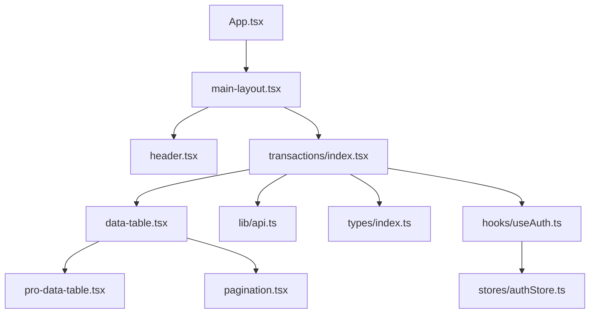
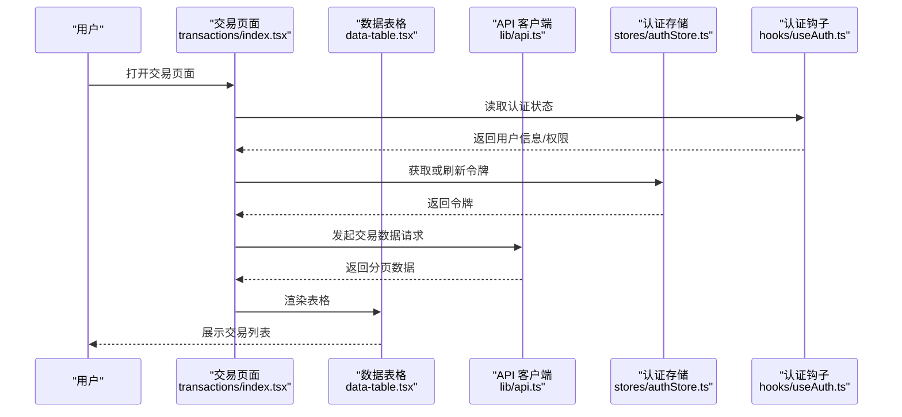
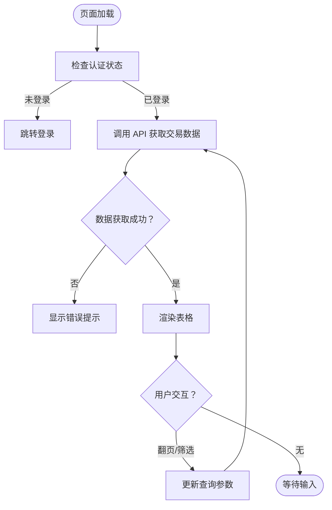
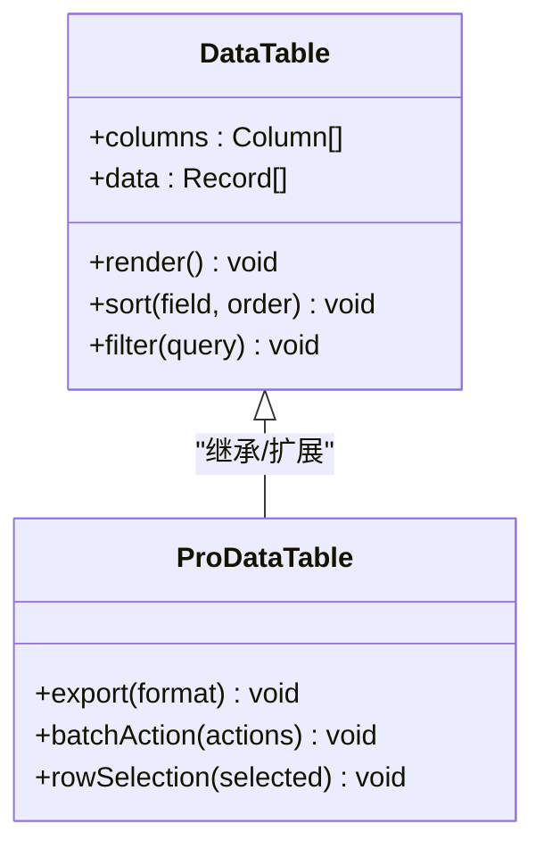
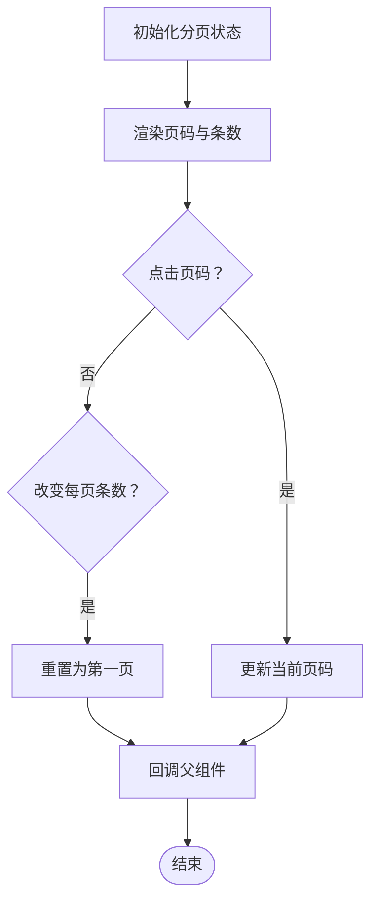
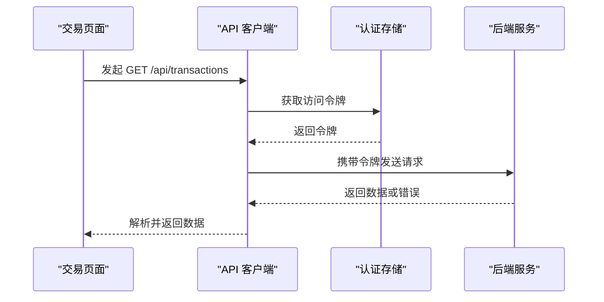
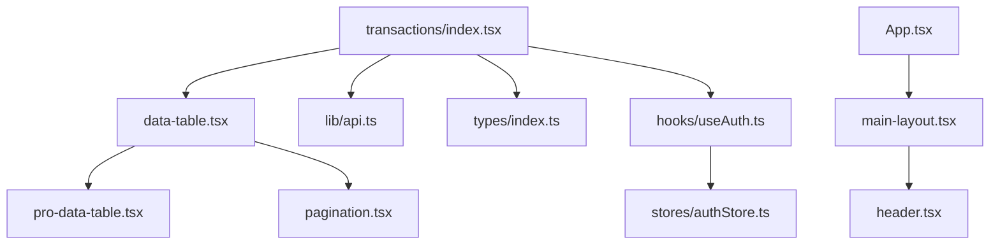

# 交易账户模块

<cite>
**本文引用的文件**   
- [web/src/pages/transactions/index.tsx](file://web/src/pages/transactions/index.tsx)
- [web/src/components/data-table/data-table.tsx](file://web/src/components/data-table/data-table.tsx)
- [web/src/components/data-table/pro-data-table.tsx](file://web/src/components/data-table/pro-data-table.tsx)
- [web/src/components/data-table/pagination.tsx](file://web/src/components/data-table/pagination.tsx)
- [web/src/lib/api.ts](file://web/src/lib/api.ts)
- [web/src/types/index.ts](file://web/src/types/index.ts)
- [web/src/stores/authStore.ts](file://web/src/stores/authStore.ts)
- [web/src/hooks/useAuth.ts](file://web/src/hooks/useAuth.ts)
- [web/src/components/layout/header.tsx](file://web/src/components/layout/header.tsx)
- [web/src/components/layout/main-layout.tsx](file://web/src/components/layout/main-layout.tsx)
- [web/src/App.tsx](file://web/src/App.tsx)
- [web/package.json](file://web/package.json)
</cite>

## 目录
1. [简介](#简介)
2. [项目结构](#项目结构)
3. [核心组件](#核心组件)
4. [架构总览](#架构总览)
5. [详细组件分析](#详细组件分析)
6. [依赖分析](#依赖分析)
7. [性能考虑](#性能考虑)
8. [故障排查指南](#故障排查指南)
9. [结论](#结论)
10. [附录](#附录)

## 简介
本模块聚焦“交易账户”相关的前端能力，提供交易数据的表格展示、分页与基础交互，并与后端 API 进行数据交互。结合项目的整体技术栈（Express + Prisma + PostgreSQL + JWT），前端通过统一的 API 层访问后端服务，使用权限与认证状态控制页面可见性与操作权限。

## 项目结构
交易账户模块位于 web 前端工程内，主要涉及以下目录与文件：
- 页面入口：web/src/pages/transactions/index.tsx
- 数据表格组件：web/src/components/data-table/*
- API 客户端：web/src/lib/api.ts
- 类型定义：web/src/types/index.ts
- 认证与权限：web/src/stores/authStore.ts、web/src/hooks/useAuth.ts
- 布局与导航：web/src/components/layout/*、web/src/App.tsx
- 构建配置：web/package.json

图表来源
- [web/src/App.tsx](file://web/src/App.tsx)
- [web/src/components/layout/main-layout.tsx](file://web/src/components/layout/main-layout.tsx)
- [web/src/components/layout/header.tsx](file://web/src/components/layout/header.tsx)
- [web/src/pages/transactions/index.tsx](file://web/src/pages/transactions/index.tsx)
- [web/src/components/data-table/data-table.tsx](file://web/src/components/data-table/data-table.tsx)
- [web/src/components/data-table/pro-data-table.tsx](file://web/src/components/data-table/pro-data-table.tsx)
- [web/src/components/data-table/pagination.tsx](file://web/src/components/data-table/pagination.tsx)
- [web/src/lib/api.ts](file://web/src/lib/api.ts)
- [web/src/types/index.ts](file://web/src/types/index.ts)
- [web/src/hooks/useAuth.ts](file://web/src/hooks/useAuth.ts)
- [web/src/stores/authStore.ts](file://web/src/stores/authStore.ts)

章节来源
- [web/src/pages/transactions/index.tsx](file://web/src/pages/transactions/index.tsx)
- [web/src/components/data-table/data-table.tsx](file://web/src/components/data-table/data-table.tsx)
- [web/src/components/data-table/pro-data-table.tsx](file://web/src/components/data-table/pro-data-table.tsx)
- [web/src/components/data-table/pagination.tsx](file://web/src/components/data-table/pagination.tsx)
- [web/src/lib/api.ts](file://web/src/lib/api.ts)
- [web/src/types/index.ts](file://web/src/types/index.ts)
- [web/src/stores/authStore.ts](file://web/src/stores/authStore.ts)
- [web/src/hooks/useAuth.ts](file://web/src/hooks/useAuth.ts)
- [web/src/components/layout/header.tsx](file://web/src/components/layout/header.tsx)
- [web/src/components/layout/main-layout.tsx](file://web/src/components/layout/main-layout.tsx)
- [web/src/App.tsx](file://web/src/App.tsx)
- [web/package.json](file://web/package.json)

## 核心组件
- 交易页面（transactions/index.tsx）
  - 负责加载交易数据、渲染表格、处理分页与筛选等交互。
  - 通过 API 客户端调用后端接口获取数据，并绑定到表格组件。
- 数据表格（data-table.tsx / pro-data-table.tsx）
  - 通用表格渲染与列配置；专业版表格支持更丰富的功能（如排序、过滤、导出）。
- 分页器（pagination.tsx）
  - 提供页码切换、每页条数选择等分页交互。
- API 客户端（api.ts）
  - 封装 HTTP 请求、错误处理、鉴权头注入等。
- 类型定义（types/index.ts）
  - 定义交易记录、分页响应、API 返回结构等 TypeScript 类型。
- 认证与权限（authStore.ts / useAuth.ts）
  - 管理用户登录态、JWT 令牌、权限判断与拦截。

章节来源
- [web/src/pages/transactions/index.tsx](file://web/src/pages/transactions/index.tsx)
- [web/src/components/data-table/data-table.tsx](file://web/src/components/data-table/data-table.tsx)
- [web/src/components/data-table/pro-data-table.tsx](file://web/src/components/data-table/pro-data-table.tsx)
- [web/src/components/data-table/pagination.tsx](file://web/src/components/data-table/pagination.tsx)
- [web/src/lib/api.ts](file://web/src/lib/api.ts)
- [web/src/types/index.ts](file://web/src/types/index.ts)
- [web/src/stores/authStore.ts](file://web/src/stores/authStore.ts)
- [web/src/hooks/useAuth.ts](file://web/src/hooks/useAuth.ts)

## 架构总览
交易账户模块采用“页面 → 表格 → API”的分层结构，配合认证与权限控制，确保数据安全与可维护性。

图表来源
- [web/src/pages/transactions/index.tsx](file://web/src/pages/transactions/index.tsx)
- [web/src/components/data-table/data-table.tsx](file://web/src/components/data-table/data-table.tsx)
- [web/src/lib/api.ts](file://web/src/lib/api.ts)
- [web/src/stores/authStore.ts](file://web/src/stores/authStore.ts)
- [web/src/hooks/useAuth.ts](file://web/src/hooks/useAuth.ts)

## 详细组件分析

### 交易页面（transactions/index.tsx）
- 职责
  - 初始化并管理交易数据状态（列表、分页、筛选条件）。
  - 调用 API 获取数据，并将结果传递给表格组件。
  - 处理用户交互（翻页、筛选、搜索等）。
- 关键流程
  - 页面加载时触发数据拉取。
  - 根据分页参数更新查询。
  - 将表格数据与分页控件联动。
- 错误处理
  - 捕获网络异常与业务错误，提示用户并重试。

图表来源
- [web/src/pages/transactions/index.tsx](file://web/src/pages/transactions/index.tsx)
- [web/src/lib/api.ts](file://web/src/lib/api.ts)
- [web/src/stores/authStore.ts](file://web/src/stores/authStore.ts)
- [web/src/hooks/useAuth.ts](file://web/src/hooks/useAuth.ts)

章节来源
- [web/src/pages/transactions/index.tsx](file://web/src/pages/transactions/index.tsx)

### 数据表格（data-table.tsx / pro-data-table.tsx）
- 职责
  - 接收列定义与数据源，渲染表格行与列。
  - 支持排序、过滤、选择、导出等专业功能（专业版）。
- 数据结构
  - 列配置：字段名、标题、格式化函数、是否可排序/过滤。
  - 数据源：数组对象，每项代表一条交易记录。
- 性能优化
  - 虚拟滚动（大数据量场景）。
  - 防抖搜索与延迟渲染。

图表来源
- [web/src/components/data-table/data-table.tsx](file://web/src/components/data-table/data-table.tsx)
- [web/src/components/data-table/pro-data-table.tsx](file://web/src/components/data-table/pro-data-table.tsx)

章节来源
- [web/src/components/data-table/data-table.tsx](file://web/src/components/data-table/data-table.tsx)
- [web/src/components/data-table/pro-data-table.tsx](file://web/src/components/data-table/pro-data-table.tsx)

### 分页器（pagination.tsx）
- 职责
  - 展示当前页码、总页数、每页条数。
  - 监听用户翻页操作，回调父组件更新查询参数。
- 交互逻辑
  - 点击页码或输入页码触发翻页。
  - 改变每页条数时重置到第一页。

图表来源
- [web/src/components/data-table/pagination.tsx](file://web/src/components/data-table/pagination.tsx)

章节来源
- [web/src/components/data-table/pagination.tsx](file://web/src/components/data-table/pagination.tsx)

### API 客户端（api.ts）
- 职责
  - 封装 fetch/axios 请求，统一处理请求头、错误与重试。
  - 注入 JWT 令牌，处理 401/403 等鉴权错误。
- 关键方法
  - get/post/put/delete 等 HTTP 方法封装。
  - 错误拦截与用户提示。
  - 与认证存储集成，自动刷新令牌。

图表来源
- [web/src/lib/api.ts](file://web/src/lib/api.ts)
- [web/src/stores/authStore.ts](file://web/src/stores/authStore.ts)

章节来源
- [web/src/lib/api.ts](file://web/src/lib/api.ts)

### 类型定义（types/index.ts）
- 内容
  - 交易记录模型：字段包括交易时间、金额、账户、对手方、备注等。
  - 分页响应结构：包含数据数组、总数、页码、每页条数。
  - API 错误结构：错误码、消息、堆栈（开发环境）。
- 作用
  - 保证前后端数据结构一致性。
  - 提升代码可读性与可维护性。

章节来源
- [web/src/types/index.ts](file://web/src/types/index.ts)

### 认证与权限（authStore.ts / useAuth.ts）
- 职责
  - 管理用户登录态、JWT 令牌存储与过期刷新。
  - 提供权限判断钩子，控制页面与按钮的可见性。
- 关键逻辑
  - 登录成功后保存令牌与用户信息。
  - 路由守卫检查权限，未授权跳转登录。
  - 令牌过期自动刷新或退出登录。

章节来源
- [web/src/stores/authStore.ts](file://web/src/stores/authStore.ts)
- [web/src/hooks/useAuth.ts](file://web/src/hooks/useAuth.ts)

## 依赖分析
交易账户模块依赖以下核心库与内部模块：
- React 生态：用于组件化开发与状态管理。
- UI 组件库：表格、分页、表单等基础 UI。
- 网络请求库：fetch 或 axios，用于 API 调用。
- 类型系统：TypeScript，确保类型安全。
- 认证存储：本地存储或内存存储，管理用户会话。

图表来源
- [web/src/pages/transactions/index.tsx](file://web/src/pages/transactions/index.tsx)
- [web/src/components/data-table/data-table.tsx](file://web/src/components/data-table/data-table.tsx)
- [web/src/components/data-table/pro-data-table.tsx](file://web/src/components/data-table/pro-data-table.tsx)
- [web/src/components/data-table/pagination.tsx](file://web/src/components/data-table/pagination.tsx)
- [web/src/lib/api.ts](file://web/src/lib/api.ts)
- [web/src/types/index.ts](file://web/src/types/index.ts)
- [web/src/hooks/useAuth.ts](file://web/src/hooks/useAuth.ts)
- [web/src/stores/authStore.ts](file://web/src/stores/authStore.ts)
- [web/src/App.tsx](file://web/src/App.tsx)
- [web/src/components/layout/main-layout.tsx](file://web/src/components/layout/main-layout.tsx)
- [web/src/components/layout/header.tsx](file://web/src/components/layout/header.tsx)

章节来源
- [web/package.json](file://web/package.json)

## 性能考虑
- 表格渲染优化
  - 大数据量时使用虚拟滚动减少 DOM 节点数量。
  - 对排序与过滤操作进行防抖处理，避免频繁重渲染。
- 网络请求优化
  - 合并重复请求，避免并发冲突。
  - 合理设置缓存策略，减少服务器压力。
- 内存管理
  - 及时清理定时器与事件监听器，防止内存泄漏。
  - 大对象使用弱引用或分片加载。

## 故障排查指南
- 常见问题
  - 页面空白：检查认证状态与路由守卫。
  - 表格不显示：确认 API 返回数据结构与类型定义一致。
  - 分页失效：验证分页参数传递与后端响应格式。
  - 权限不足：检查用户角色与权限配置。
- 调试技巧
  - 使用浏览器开发者工具查看网络请求与响应。
  - 在 API 客户端中添加日志输出，追踪请求链路。
  - 利用 React DevTools 检查组件状态与 props。

章节来源
- [web/src/lib/api.ts](file://web/src/lib/api.ts)
- [web/src/stores/authStore.ts](file://web/src/stores/authStore.ts)
- [web/src/hooks/useAuth.ts](file://web/src/hooks/useAuth.ts)

## 结论
交易账户模块通过清晰的分层架构与组件化设计，实现了交易数据的展示与管理。结合认证与权限控制，确保了数据的安全性与操作的合规性。未来可进一步优化性能与用户体验，如引入更智能的缓存策略与更丰富的交互功能。

## 附录
- 相关文档
  - 后端技术栈说明：Express + Prisma + PostgreSQL + JWT + DeepSeek API
  - 中间件执行链顺序与安全规范
  - AI 双管道架构与脱敏规则