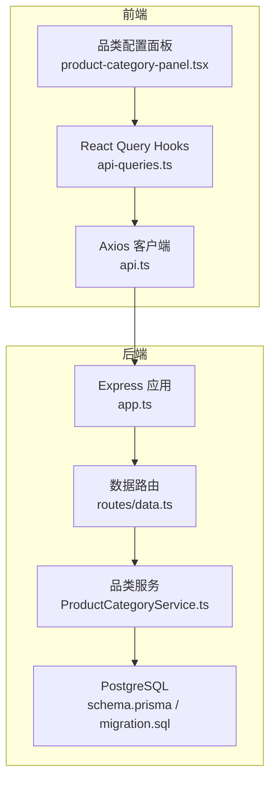
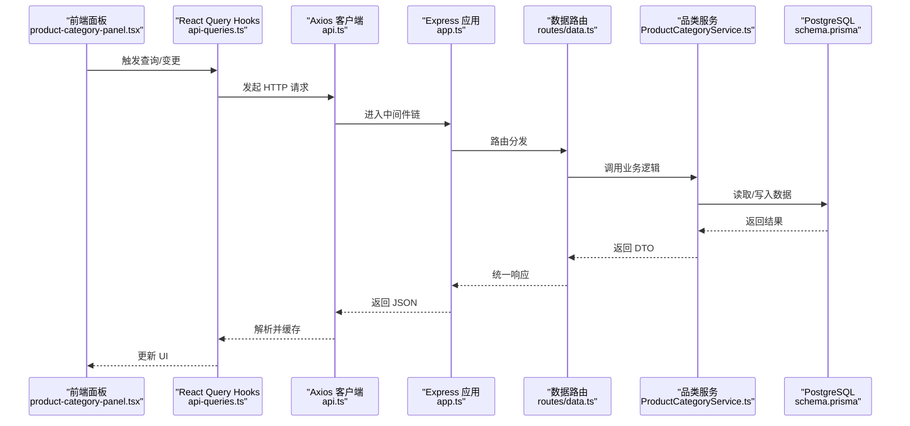
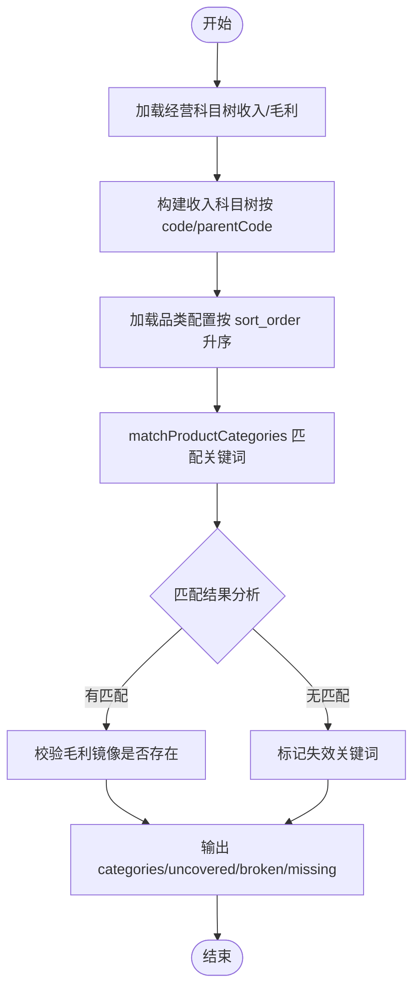
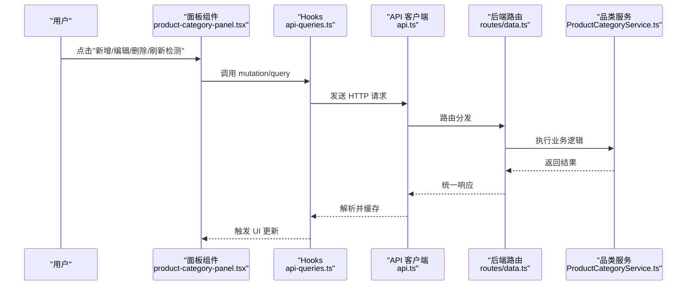
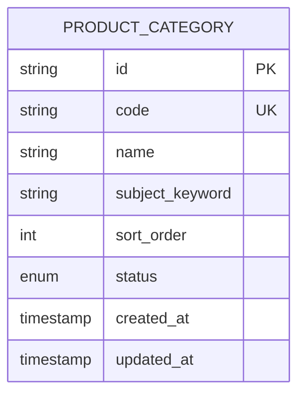
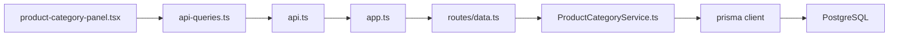

# 产品类别管理系统

<cite>
**本文引用的文件**   
- [server/src/services/ProductCategoryService.ts](file://server/src/services/ProductCategoryService.ts)
- [server/src/routes/data.ts](file://server/src/routes/data.ts)
- [server/prisma/schema.prisma](file://server/prisma/schema.prisma)
- [server/prisma/migrations/20260801071520_add_product_category/migration.sql](file://server/prisma/migrations/20260801071520_add_product_category/migration.sql)
- [web/src/components/dimension/product-category-panel.tsx](file://web/src/components/dimension/product-category-panel.tsx)
- [web/src/hooks/api-queries.ts](file://web/src/hooks/api-queries.ts)
- [web/src/lib/api.ts](file://web/src/lib/api.ts)
- [server/src/app.ts](file://server/src/app.ts)
</cite>

## 更新摘要
**变更内容**   
- 产品类别管理系统已完全实现，包含完整的服务层、数据库模型、前端组件和API集成
- 支持关键词匹配收入科目和预算达成分析的核心功能
- 实现了品类配置的CRUD操作和科目树变化检测
- 前端面板提供完整的可视化界面和交互功能

## 目录
1. [简介](#简介)
2. [项目结构](#项目结构)
3. [核心组件](#核心组件)
4. [架构总览](#架构总览)
5. [详细组件分析](#详细组件分析)
6. [依赖关系分析](#依赖关系分析)
7. [性能考量](#性能考量)
8. [故障排查指南](#故障排查指南)
9. [结论](#结论)
10. [附录](#附录)

## 简介
本系统为"浙江壹品慧财年经营数据分析平台"的产品类别管理模块，面向"品类预算达成分析"的数据维护与校验。其核心能力包括：
- 维护"品类 ↔ 收入科目关键词"的映射配置（支持排序、启停）。
- 基于经营科目树进行匹配与覆盖检测，提示未覆盖科目、失效关键词、毛利镜像缺失等问题。
- 提供前端可视化面板，支持新增、编辑、删除与一键刷新检测。

后端采用 Express + Prisma + PostgreSQL；中间件链遵循 helmet → cors → express.json → rate-limit → auth(JWT+黑名单) → permission(默认拒绝) → scope(Prisma extension) → softDelete → audit → Service → Prisma → PostgreSQL 的顺序。计算类指标使用安全公式解析，同比/环比由后端实时计算不存库。

## 项目结构
围绕"产品类别管理"的前后端关键文件组织如下：
- 后端服务层：ProductCategoryService.ts（CRUD 与 check 检测）
- 路由层：data.ts（REST 接口定义与权限控制）
- 数据模型：schema.prisma 中的 ProductCategory 模型与迁移脚本
- 前端展示：product-category-panel.tsx（表格、对话框、检测结果警示）
- 前端请求封装：api.ts（HTTP 客户端）、api-queries.ts（React Query hooks）
- 应用装配：app.ts（Express 中间件与路由挂载）

**图表来源** 
- [web/src/components/dimension/product-category-panel.tsx:1-364](file://web/src/components/dimension/product-category-panel.tsx#L1-L364)
- [web/src/hooks/api-queries.ts:78-115](file://web/src/hooks/api-queries.ts#L78-L115)
- [web/src/lib/api.ts:234-271](file://web/src/lib/api.ts#L234-L271)
- [server/src/app.ts:63-77](file://server/src/app.ts#L63-L77)
- [server/src/routes/data.ts:194-214](file://server/src/routes/data.ts#L194-L214)
- [server/src/services/ProductCategoryService.ts:71-150](file://server/src/services/ProductCategoryService.ts#L71-L150)
- [server/prisma/schema.prisma:214-226](file://server/prisma/schema.prisma#L214-L226)
- [server/prisma/migrations/20260801071520_add_product_category/migration.sql:1-20](file://server/prisma/migrations/20260801071520_add_product_category/migration.sql#L1-L20)

**章节来源**
- [server/src/app.ts:63-77](file://server/src/app.ts#L63-L77)
- [server/src/routes/data.ts:194-214](file://server/src/routes/data.ts#L194-L214)
- [server/src/services/ProductCategoryService.ts:71-150](file://server/src/services/ProductCategoryService.ts#L71-L150)
- [server/prisma/schema.prisma:214-226](file://server/prisma/schema.prisma#L214-L226)
- [server/prisma/migrations/20260801071520_add_product_category/migration.sql:1-20](file://server/prisma/migrations/20260801071520_add_product_category/migration.sql#L1-L20)
- [web/src/components/dimension/product-category-panel.tsx:1-364](file://web/src/components/dimension/product-category-panel.tsx#L1-L364)
- [web/src/hooks/api-queries.ts:78-115](file://web/src/hooks/api-queries.ts#L78-L115)
- [web/src/lib/api.ts:234-271](file://web/src/lib/api.ts#L234-L271)

## 核心组件
- 品类配置服务（ProductCategoryService）
  - 提供 list、create、update、remove、check 五大能力。
  - check 方法结合经营科目树（收入/毛利类别）与品类关键词，输出匹配结果、未覆盖科目、失效关键词与毛利镜像缺失清单。
- 数据路由（routes/data.ts）
  - 暴露 REST 接口：GET/POST/PUT/DELETE 品类配置，以及 GET 检查接口。
  - 通过 requirePermission 进行权限控制（view/create/update/delete）。
- 前端面板（product-category-panel.tsx）
  - 展示品类列表、匹配科目、毛利镜像状态，并提供新增/编辑/删除操作。
  - 集成"刷新检测"按钮，显示未覆盖科目、失效关键词、毛利镜像缺失等警示信息。
- 前端 API 封装（api.ts 与 api-queries.ts）
  - api.ts 统一 Axios 实例、拦截器、错误处理与品类相关接口调用。
  - api-queries.ts 封装 React Query hooks，实现缓存、失效与写操作后的自动刷新。

**章节来源**
- [server/src/services/ProductCategoryService.ts:71-150](file://server/src/services/ProductCategoryService.ts#L71-L150)
- [server/src/routes/data.ts:194-214](file://server/src/routes/data.ts#L194-L214)
- [web/src/components/dimension/product-category-panel.tsx:1-364](file://web/src/components/dimension/product-category-panel.tsx#L1-L364)
- [web/src/lib/api.ts:234-271](file://web/src/lib/api.ts#L234-L271)
- [web/src/hooks/api-queries.ts:78-115](file://web/src/hooks/api-queries.ts#L78-L115)

## 架构总览
从请求到响应的完整链路如下：
- 前端发起 HTTP 请求（品类列表、检查、增删改）。
- Express 应用装配中间件链（限流、鉴权、权限、审计等）。
- 路由分发至 data.ts 对应处理器，调用 ProductCategoryService。
- Service 层通过 Prisma 访问 PostgreSQL 数据库。
- 响应经统一格式返回前端，React Query 更新缓存并驱动 UI 渲染。

**图表来源** 
- [web/src/components/dimension/product-category-panel.tsx:1-364](file://web/src/components/dimension/product-category-panel.tsx#L1-L364)
- [web/src/hooks/api-queries.ts:78-115](file://web/src/hooks/api-queries.ts#L78-L115)
- [web/src/lib/api.ts:234-271](file://web/src/lib/api.ts#L234-L271)
- [server/src/app.ts:63-77](file://server/src/app.ts#L63-L77)
- [server/src/routes/data.ts:194-214](file://server/src/routes/data.ts#L194-L214)
- [server/src/services/ProductCategoryService.ts:71-150](file://server/src/services/ProductCategoryService.ts#L71-L150)
- [server/prisma/schema.prisma:214-226](file://server/prisma/schema.prisma#L214-L226)

## 详细组件分析

### 品类配置服务（ProductCategoryService）
- 职责
  - CRUD 品类配置（code 唯一且不可变，name/subjectKeyword/sortOrder/status 可更新）。
  - 科目树变化检测（check），输出 matchedSubjects、profitOk、uncoveredSubjects、brokenKeywords、missingProfitMirror。
- 数据结构
  - ProductCategoryDto：id/code/name/subjectKeyword/sortOrder/status/createdAt/updatedAt。
  - ProductCategoryCheckResult：categories（含 matchedSubjects/profitOk）、uncoveredSubjects、brokenKeywords、missingProfitMirror。
- 算法要点
  - 构建收入科目树（按 code/parentCode），后代节点视为已覆盖。
  - 使用 matchProductCategories 进行关键词匹配与求和，profitMirrorName 生成镜像科目名。
  - 校验毛利镜像是否齐全（matched 非空且每个科目存在同名"XX毛利"）。

**图表来源** 
- [server/src/services/ProductCategoryService.ts:127-150](file://server/src/services/ProductCategoryService.ts#L127-L150)

**章节来源**
- [server/src/services/ProductCategoryService.ts:71-150](file://server/src/services/ProductCategoryService.ts#L71-L150)

### 数据路由（routes/data.ts）
- 接口定义
  - GET /data/product-categories：获取全部品类（需 view 权限）。
  - GET /data/product-categories/check：检查科目树覆盖情况（需 view 权限）。
  - POST /data/product-categories：新增品类（需 create 权限）。
  - PUT /data/product-categories/:id：更新品类（需 update 权限）。
  - DELETE /data/product-categories/:id：删除品类（需 delete 权限）。
- 权限控制
  - 通过 requirePermission 绑定资源与动作，默认拒绝未授权访问。

**章节来源**
- [server/src/routes/data.ts:194-214](file://server/src/routes/data.ts#L194-L214)

### 前端面板（product-category-panel.tsx）
- 功能点
  - 展示品类列表（名称、关键词、排序、状态、匹配科目、毛利镜像状态）。
  - 新增/编辑弹窗（code 创建后不可修改，必填 name/subjectKeyword）。
  - 删除确认与失败提示。
  - "刷新检测"按钮触发 check 接口，展示未覆盖科目、失效关键词、毛利镜像缺失。
- 交互流程
  - 用户操作 → mutations.create/update/remove → 成功则 invalidate 列表缓存 → UI 刷新。

**图表来源** 
- [web/src/components/dimension/product-category-panel.tsx:1-364](file://web/src/components/dimension/product-category-panel.tsx#L1-L364)
- [web/src/hooks/api-queries.ts:78-115](file://web/src/hooks/api-queries.ts#L78-L115)
- [web/src/lib/api.ts:234-271](file://web/src/lib/api.ts#L234-L271)
- [server/src/routes/data.ts:194-214](file://server/src/routes/data.ts#L194-L214)
- [server/src/services/ProductCategoryService.ts:71-150](file://server/src/services/ProductCategoryService.ts#L71-L150)

**章节来源**
- [web/src/components/dimension/product-category-panel.tsx:1-364](file://web/src/components/dimension/product-category-panel.tsx#L1-L364)
- [web/src/hooks/api-queries.ts:78-115](file://web/src/hooks/api-queries.ts#L78-L115)

### 数据模型（schema.prisma 与迁移）
- 模型字段
  - id（主键）、code（唯一）、name、subject_keyword、sort_order、status（active/inactive）、created_at、updated_at。
- 索引与约束
  - product_category_code_key（唯一索引）、product_category_status_idx（状态索引）。
- 迁移脚本
  - 建表与索引创建，确保生产环境一致性。

**图表来源** 
- [server/prisma/schema.prisma:214-226](file://server/prisma/schema.prisma#L214-L226)
- [server/prisma/migrations/20260801071520_add_product_category/migration.sql:1-20](file://server/prisma/migrations/20260801071520_add_product_category/migration.sql#L1-L20)

**章节来源**
- [server/prisma/schema.prisma:214-226](file://server/prisma/schema.prisma#L214-L226)
- [server/prisma/migrations/20260801071520_add_product_category/migration.sql:1-20](file://server/prisma/migrations/20260801071520_add_product_category/migration.sql#L1-L20)

## 依赖关系分析
- 前端依赖
  - product-category-panel.tsx 依赖 api-queries.ts（hooks）与 api.ts（HTTP 客户端）。
  - hooks 依赖 @tanstack/react-query 进行缓存与失效管理。
- 后端依赖
  - routes/data.ts 依赖 ProductCategoryService 与权限中间件。
  - ProductCategoryService 依赖 prisma、errors、audit、DashboardService（匹配逻辑）。
- 数据库依赖
  - schema.prisma 定义模型与索引，migration.sql 保证结构一致。

**图表来源** 
- [web/src/components/dimension/product-category-panel.tsx:1-364](file://web/src/components/dimension/product-category-panel.tsx#L1-L364)
- [web/src/hooks/api-queries.ts:78-115](file://web/src/hooks/api-queries.ts#L78-L115)
- [web/src/lib/api.ts:234-271](file://web/src/lib/api.ts#L234-L271)
- [server/src/app.ts:63-77](file://server/src/app.ts#L63-L77)
- [server/src/routes/data.ts:194-214](file://server/src/routes/data.ts#L194-L214)
- [server/src/services/ProductCategoryService.ts:71-150](file://server/src/services/ProductCategoryService.ts#L71-L150)

**章节来源**
- [web/src/components/dimension/product-category-panel.tsx:1-364](file://web/src/components/dimension/product-category-panel.tsx#L1-L364)
- [web/src/hooks/api-queries.ts:78-115](file://web/src/hooks/api-queries.ts#L78-L115)
- [web/src/lib/api.ts:234-271](file://web/src/lib/api.ts#L234-L271)
- [server/src/app.ts:63-77](file://server/src/app.ts#L63-L77)
- [server/src/routes/data.ts:194-214](file://server/src/routes/data.ts#L194-L214)
- [server/src/services/ProductCategoryService.ts:71-150](file://server/src/services/ProductCategoryService.ts#L71-L150)

## 性能考量
- 前端缓存策略
  - React Query 设置 staleTime=30s，减少重复请求。
  - 写操作成功后 invalidate 列表缓存，避免全量刷新。
- 后端查询优化
  - 列表按 sortOrder 升序，避免前端排序开销。
  - check 仅读取 active 的经营科目与品类配置，降低无关数据扫描。
- 中间件与限流
  - 通用限流 100 次/分钟保护 API，防止滥用。
- 建议
  - 对高频 check 场景考虑短期缓存或增量差异对比。
  - 科目树较大时，可分页或按需加载子树以提升响应速度。

[本节为通用指导，无需特定文件引用]

## 故障排查指南
- 常见错误
  - 参数校验失败：缺少 code/name/subjectKeyword 将触发 badRequest。
  - 编码冲突：code 已存在时返回 conflict。
  - 未找到记录：更新/删除时 id 不存在返回 notFound。
  - 权限不足：未具备相应 resource:action 将被拒绝。
- 排查步骤
  - 检查前端表单必填项与输入格式。
  - 查看浏览器网络面板，确认请求路径与参数。
  - 核对后端日志与审计日志（module=data, action=create/update/delete）。
  - 验证科目树中是否存在匹配的"收入/毛利"科目。
- 定位工具
  - 前端错误提示来自 api.ts 的统一错误处理。
  - 后端错误通过 errors.badRequest/conflict/notFound 抛出。

**章节来源**
- [server/src/services/ProductCategoryService.ts:78-120](file://server/src/services/ProductCategoryService.ts#L78-L120)
- [web/src/lib/api.ts:115-130](file://web/src/lib/api.ts#L115-L130)

## 结论
产品类别管理系统以清晰的职责分层与稳健的中间件链为基础，实现了品类配置的便捷维护与科目树变化的智能检测。前端面板直观展示匹配结果与问题警示，后端服务保证数据一致性与可追溯性。建议在后续迭代中进一步优化 check 性能与科目树加载策略，提升用户体验与系统稳定性。

[本节为总结性内容，无需特定文件引用]

## 附录
- 术语说明
  - 品类：用于预算达成分析的维度分类，通过关键词匹配收入科目。
  - 毛利镜像：与收入科目同名的"XX毛利"科目，用于利润分析。
  - 未覆盖科目：科目树中存在但未在品类配置中命中的收入科目。
  - 失效关键词：配置中关键词无法匹配任何收入科目。
  - 毛利镜像缺失：匹配到的收入科目缺少对应的毛利镜像科目。

[本节为概念性内容，无需特定文件引用]