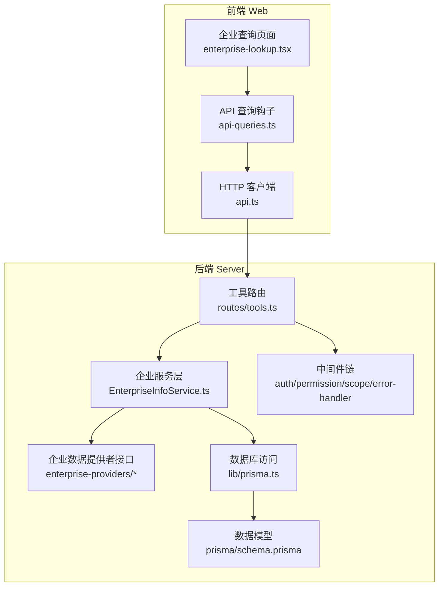
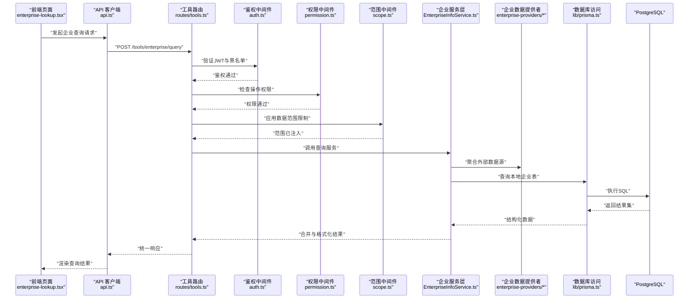
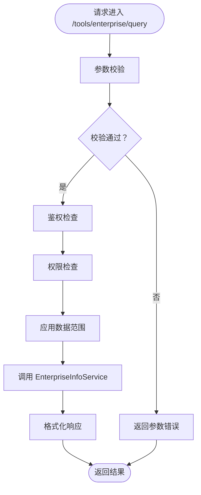
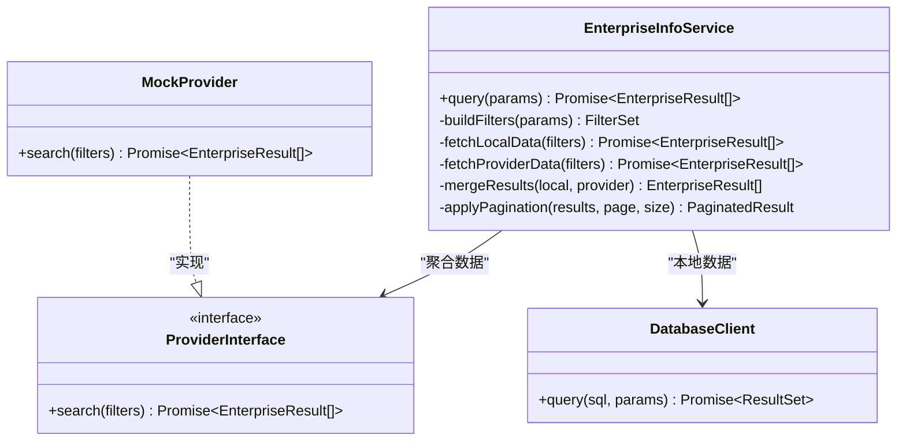
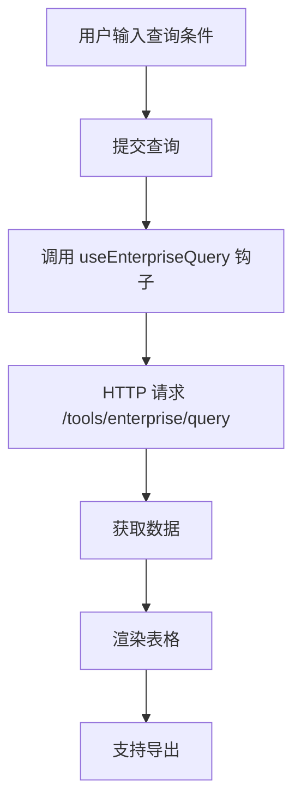
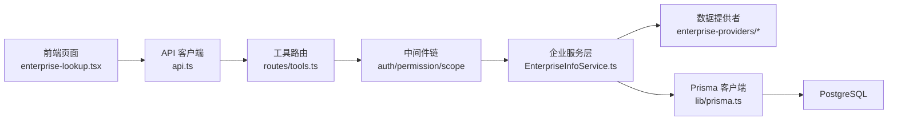

# 企业信息查询工具

<cite>
**本文引用的文件**   
- [server/src/app.ts](file://server/src/app.ts)
- [server/src/server.ts](file://server/src/server.ts)
- [server/src/routes/tools.ts](file://server/src/routes/tools.ts)
- [server/src/services/EnterpriseInfoService.ts](file://server/src/services/EnterpriseInfoService.ts)
- [server/src/services/enterprise-providers/index.ts](file://server/src/services/enterprise-providers/index.ts)
- [server/src/services/enterprise-providers/types.ts](file://server/src/services/enterprise-providers/types.ts)
- [server/src/middleware/auth.ts](file://server/src/middleware/auth.ts)
- [server/src/middleware/permission.ts](file://server/src/middleware/permission.ts)
- [server/src/middleware/scope.ts](file://server/src/middleware/scope.ts)
- [server/src/middleware/error-handler.ts](file://server/src/middleware/error-handler.ts)
- [server/src/lib/prisma.ts](file://server/src/lib/prisma.ts)
- [server/prisma/schema.prisma](file://server/prisma/schema.prisma)
- [web/src/pages/tools/enterprise-lookup.tsx](file://web/src/pages/tools/enterprise-lookup.tsx)
- [web/src/hooks/api-queries.ts](file://web/src/hooks/api-queries.ts)
- [web/src/lib/api.ts](file://web/src/lib/api.ts)
</cite>

## 目录
1. [简介](#简介)
2. [项目结构](#项目结构)
3. [核心组件](#核心组件)
4. [架构总览](#架构总览)
5. [详细组件分析](#详细组件分析)
6. [依赖关系分析](#依赖关系分析)
7. [性能考量](#性能考量)
8. [故障排查指南](#故障排查指南)
9. [结论](#结论)
10. [附录](#附录)

## 简介
本项目为浙江壹品慧财年经营数据分析平台的企业信息查询工具，面向内部用户提供企业基础信息、标签与分类等数据的查询能力。后端采用 Express + Prisma + PostgreSQL，前端基于 React（Vite）构建。系统遵循“Excel进、看板/报表出”的管理口径，单位统一为万元/人民币；认证使用 JWT（access 15分钟、refresh 7天轮转），中间件执行链顺序严格：helmet → cors → express.json → rate-limit → auth(JWT+黑名单) → permission(默认拒绝) → scope(Prisma extension) → softDelete → audit → Service → Prisma → PostgreSQL。计算类指标由后端安全公式解析实时计算，AI 双管道用于文本与结构化数据的安全处理。

## 项目结构
本仓库包含前后端两个子工程：
- server：Express 后端服务，提供 REST API，集成 Prisma ORM 与 PostgreSQL，实现鉴权、权限、范围控制、审计、错误处理等通用能力，以及企业服务层与路由。
- web：React 前端应用，提供企业查询页面、API 调用封装与状态管理。



**图表来源** 
- [server/src/routes/tools.ts](file://server/src/routes/tools.ts)
- [server/src/services/EnterpriseInfoService.ts](file://server/src/services/EnterpriseInfoService.ts)
- [server/src/services/enterprise-providers/index.ts](file://server/src/services/enterprise-providers/index.ts)
- [server/src/lib/prisma.ts](file://server/src/lib/prisma.ts)
- [server/prisma/schema.prisma](file://server/prisma/schema.prisma)
- [web/src/pages/tools/enterprise-lookup.tsx](file://web/src/pages/tools/enterprise-lookup.tsx)
- [web/src/hooks/api-queries.ts](file://web/src/hooks/api-queries.ts)
- [web/src/lib/api.ts](file://web/src/lib/api.ts)

**章节来源**
- [server/src/app.ts](file://server/src/app.ts)
- [server/src/server.ts](file://server/src/server.ts)

## 核心组件
- 工具路由（tools.ts）：暴露企业查询相关 API 端点，挂载于 /tools 路径下，负责参数校验、权限与范围控制、调用服务层并返回统一响应。
- 企业服务层（EnterpriseInfoService.ts）：封装企业查询的业务逻辑，聚合多数据源（本地数据库与外部提供者），实现去重、过滤、排序与分页。
- 企业数据提供者（enterprise-providers/*）：定义统一的查询接口与 Mock 实现，便于扩展第三方企业数据源。
- 中间件链（auth/permission/scope/error-handler）：保障请求安全、权限最小化、数据范围隔离与异常统一处理。
- 数据库访问（lib/prisma.ts）：通过 Prisma Client 连接 PostgreSQL，提供类型安全的查询能力。
- 前端页面（enterprise-lookup.tsx）：企业查询 UI，支持关键词搜索、筛选、分页与结果展示。
- 前端 API 封装（api.ts, api-queries.ts）：统一 HTTP 请求封装与 React Query 风格的查询钩子。

**章节来源**
- [server/src/routes/tools.ts](file://server/src/routes/tools.ts)
- [server/src/services/EnterpriseInfoService.ts](file://server/src/services/EnterpriseInfoService.ts)
- [server/src/services/enterprise-providers/index.ts](file://server/src/services/enterprise-providers/index.ts)
- [server/src/services/enterprise-providers/types.ts](file://server/src/services/enterprise-providers/types.ts)
- [server/src/middleware/auth.ts](file://server/src/middleware/auth.ts)
- [server/src/middleware/permission.ts](file://server/src/middleware/permission.ts)
- [server/src/middleware/scope.ts](file://server/src/middleware/scope.ts)
- [server/src/middleware/error-handler.ts](file://server/src/middleware/error-handler.ts)
- [server/src/lib/prisma.ts](file://server/src/lib/prisma.ts)
- [web/src/pages/tools/enterprise-lookup.tsx](file://web/src/pages/tools/enterprise-lookup.tsx)
- [web/src/hooks/api-queries.ts](file://web/src/hooks/api-queries.ts)
- [web/src/lib/api.ts](file://web/src/lib/api.ts)

## 架构总览
企业查询工具采用前后端分离架构，前端通过 REST API 调用后端服务，后端通过 Prisma 访问 PostgreSQL，同时可聚合外部企业数据提供者。鉴权与授权贯穿整个请求链路，确保数据安全与合规。



**图表来源** 
- [server/src/routes/tools.ts](file://server/src/routes/tools.ts)
- [server/src/middleware/auth.ts](file://server/src/middleware/auth.ts)
- [server/src/middleware/permission.ts](file://server/src/middleware/permission.ts)
- [server/src/middleware/scope.ts](file://server/src/middleware/scope.ts)
- [server/src/services/EnterpriseInfoService.ts](file://server/src/services/EnterpriseInfoService.ts)
- [server/src/services/enterprise-providers/index.ts](file://server/src/services/enterprise-providers/index.ts)
- [server/src/lib/prisma.ts](file://server/src/lib/prisma.ts)

## 详细组件分析

### 工具路由（tools.ts）
- 职责：定义企业查询的 API 端点，接收查询参数（如企业名称、统一社会信用代码、行业、地区等），进行输入校验后调用服务层。
- 关键点：
  - 参数校验：对必填字段、格式进行校验，避免非法输入进入业务层。
  - 权限控制：结合 permission 中间件，确保用户具备“企业查询”操作权限。
  - 范围控制：通过 scope 中间件注入当前用户的数据范围（如组织、部门）。
  - 统一响应：使用 response 库包装成功/失败响应，保证前端一致性。



**图表来源** 
- [server/src/routes/tools.ts](file://server/src/routes/tools.ts)
- [server/src/middleware/auth.ts](file://server/src/middleware/auth.ts)
- [server/src/middleware/permission.ts](file://server/src/middleware/permission.ts)
- [server/src/middleware/scope.ts](file://server/src/middleware/scope.ts)

**章节来源**
- [server/src/routes/tools.ts](file://server/src/routes/tools.ts)

### 企业服务层（EnterpriseInfoService.ts）
- 职责：实现企业查询的核心业务逻辑，包括多数据源聚合、过滤、排序、分页与结果格式化。
- 关键点：
  - 数据聚合：优先从本地数据库查询，若未命中则回退至外部提供者（Mock 或真实 API）。
  - 过滤与排序：支持按企业名称、信用代码、行业、地区等多维度过滤，支持按更新时间排序。
  - 分页：采用游标或偏移量分页，避免大数据量下的性能问题。
  - 缓存策略：可选缓存热点查询结果，提升响应速度。



**图表来源** 
- [server/src/services/EnterpriseInfoService.ts](file://server/src/services/EnterpriseInfoService.ts)
- [server/src/services/enterprise-providers/index.ts](file://server/src/services/enterprise-providers/index.ts)
- [server/src/services/enterprise-providers/types.ts](file://server/src/services/enterprise-providers/types.ts)
- [server/src/lib/prisma.ts](file://server/src/lib/prisma.ts)

**章节来源**
- [server/src/services/EnterpriseInfoService.ts](file://server/src/services/EnterpriseInfoService.ts)
- [server/src/services/enterprise-providers/index.ts](file://server/src/services/enterprise-providers/index.ts)
- [server/src/services/enterprise-providers/types.ts](file://server/src/services/enterprise-providers/types.ts)

### 中间件链（auth/permission/scope/error-handler）
- 鉴权（auth.ts）：验证 JWT Token，检查黑名单，注入用户上下文。
- 权限（permission.ts）：基于角色与资源的最小权限控制，默认拒绝未明确授权的请求。
- 范围（scope.ts）：通过 Prisma Extension 注入数据范围（如组织、部门），确保数据隔离。
- 错误处理（error-handler.ts）：统一捕获异常，转换为标准错误响应，记录日志。

```mermaid
sequenceDiagram
participant Req as "HTTP 请求"
participant Helmet as "Helmet"
participant CORS as "CORS"
JSON as "express.json"
RL as "Rate Limit"
AUTH as "Auth"
PERM as "Permission"
SCOPE as "Scope"
SD as "Soft Delete"
AUDIT as "Audit"
SVC as "Service"
PRISMA as "Prisma"
DB as "PostgreSQL"
Req->>Helmet : "设置安全头"
Helmet->>CORS : "跨域配置"
CORS->>JSON : "解析JSON"
JSON->>RL : "限流检查"
RL->>AUTH : "鉴权"
AUTH->>PERM : "权限检查"
PERM->>SCOPE : "范围注入"
SCOPE->>SD : "软删除过滤"
SD->>AUDIT : "审计记录"
AUDIT->>SVC : "调用服务"
SVC->>PRISMA : "数据库查询"
PRISMA->>DB : "执行SQL"
DB-->>PRISMA : "返回结果"
PRISMA-->>SVC : "结构化数据"
SVC-->>Req : "响应结果"
```

**图表来源** 
- [server/src/middleware/auth.ts](file://server/src/middleware/auth.ts)
- [server/src/middleware/permission.ts](file://server/src/middleware/permission.ts)
- [server/src/middleware/scope.ts](file://server/src/middleware/scope.ts)
- [server/src/middleware/error-handler.ts](file://server/src/middleware/error-handler.ts)

**章节来源**
- [server/src/middleware/auth.ts](file://server/src/middleware/auth.ts)
- [server/src/middleware/permission.ts](file://server/src/middleware/permission.ts)
- [server/src/middleware/scope.ts](file://server/src/middleware/scope.ts)
- [server/src/middleware/error-handler.ts](file://server/src/middleware/error-handler.ts)

### 前端企业查询页面（enterprise-lookup.tsx）
- 职责：提供企业查询的用户界面，支持关键词搜索、筛选条件、分页与结果展示。
- 关键点：
  - 表单交互：收集用户输入的查询条件，触发 API 调用。
  - 数据获取：通过 api-queries.ts 中的查询钩子获取数据，支持缓存与重试。
  - 结果渲染：表格展示企业基本信息，支持导出与详情查看。



**图表来源** 
- [web/src/pages/tools/enterprise-lookup.tsx](file://web/src/pages/tools/enterprise-lookup.tsx)
- [web/src/hooks/api-queries.ts](file://web/src/hooks/api-queries.ts)
- [web/src/lib/api.ts](file://web/src/lib/api.ts)

**章节来源**
- [web/src/pages/tools/enterprise-lookup.tsx](file://web/src/pages/tools/enterprise-lookup.tsx)
- [web/src/hooks/api-queries.ts](file://web/src/hooks/api-queries.ts)
- [web/src/lib/api.ts](file://web/src/lib/api.ts)

## 依赖关系分析
- 模块耦合：
  - 路由层依赖中间件链进行安全控制，低耦合高内聚。
  - 服务层依赖数据提供者接口，便于替换与扩展。
  - 前端依赖 API 客户端与查询钩子，解耦 UI 与数据逻辑。
- 外部依赖：
  - Prisma ORM 与 PostgreSQL 作为数据存储层。
  - JWT 用于身份认证，配合黑名单机制增强安全性。
  - 可选的外部企业数据提供者（Mock 或真实 API）。



**图表来源** 
- [web/src/pages/tools/enterprise-lookup.tsx](file://web/src/pages/tools/enterprise-lookup.tsx)
- [web/src/lib/api.ts](file://web/src/lib/api.ts)
- [server/src/routes/tools.ts](file://server/src/routes/tools.ts)
- [server/src/middleware/auth.ts](file://server/src/middleware/auth.ts)
- [server/src/middleware/permission.ts](file://server/src/middleware/permission.ts)
- [server/src/middleware/scope.ts](file://server/src/middleware/scope.ts)
- [server/src/services/EnterpriseInfoService.ts](file://server/src/services/EnterpriseInfoService.ts)
- [server/src/services/enterprise-providers/index.ts](file://server/src/services/enterprise-providers/index.ts)
- [server/src/lib/prisma.ts](file://server/src/lib/prisma.ts)

**章节来源**
- [server/src/app.ts](file://server/src/app.ts)
- [server/src/server.ts](file://server/src/server.ts)

## 性能考量
- 查询优化：
  - 使用 Prisma 的类型安全查询，避免 N+1 问题。
  - 对高频查询字段建立索引（如企业名称、信用代码）。
  - 分页查询采用游标或偏移量，避免全表扫描。
- 缓存策略：
  - 热点企业数据可加入内存缓存（如 Redis），减少数据库压力。
  - 前端使用 React Query 缓存与失效策略，提升用户体验。
- 并发控制：
  - 通过 rate-limit 中间件限制请求频率，防止滥用。
  - 异步任务队列处理耗时操作（如批量导入、报表生成）。

[本节为通用指导，不直接分析具体文件]

## 故障排查指南
- 常见问题：
  - 鉴权失败：检查 JWT Token 是否有效，是否在黑名单中。
  - 权限不足：确认用户角色与资源权限配置是否正确。
  - 数据范围错误：检查 scope 中间件是否正确注入用户范围。
  - 数据库连接失败：验证 PostgreSQL 连接配置与网络连通性。
- 调试建议：
  - 启用详细日志，记录请求链路关键节点。
  - 使用 Postman 或 curl 测试 API 端点，定位问题环节。
  - 前端打开开发者工具，检查网络请求与响应。

**章节来源**
- [server/src/middleware/error-handler.ts](file://server/src/middleware/error-handler.ts)
- [server/src/lib/logger.ts](file://server/src/lib/logger.ts)

## 结论
企业信息查询工具通过清晰的分层架构与严格的中间件链，实现了安全、高效的企业数据查询能力。前端提供友好的交互界面，后端通过服务层聚合多数据源，结合 Prisma 与 PostgreSQL 提供稳定可靠的数据访问。未来可扩展更多企业数据源，优化查询性能，增强用户权限控制。

[本节为总结性内容，不直接分析具体文件]

## 附录
- 数据模型参考：企业表结构定义在 schema.prisma 中，包含企业名称、信用代码、行业、地区等字段。
- API 文档：详见 routes/tools.ts 中的端点定义与参数说明。
- 部署指南：参考 server/package.json 中的脚本命令与环境变量配置。

**章节来源**
- [server/prisma/schema.prisma](file://server/prisma/schema.prisma)
- [server/src/routes/tools.ts](file://server/src/routes/tools.ts)
- [server/package.json](file://server/package.json)