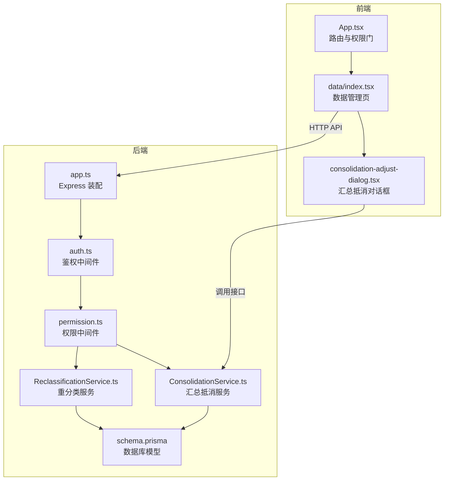
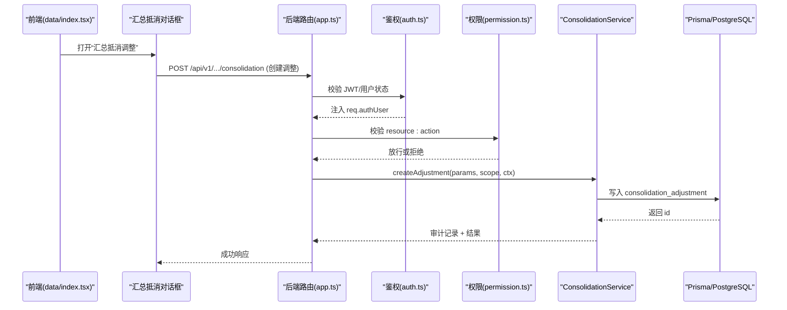
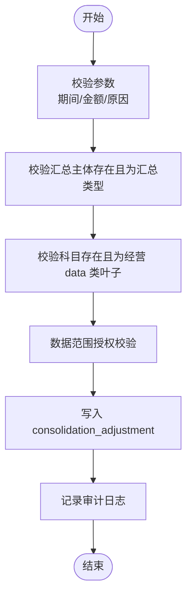
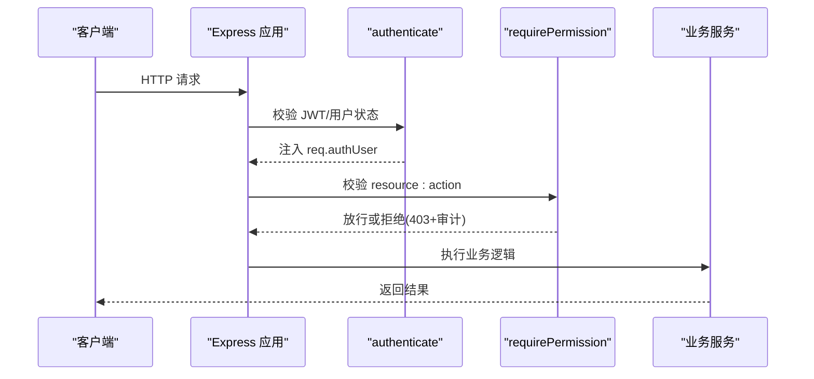
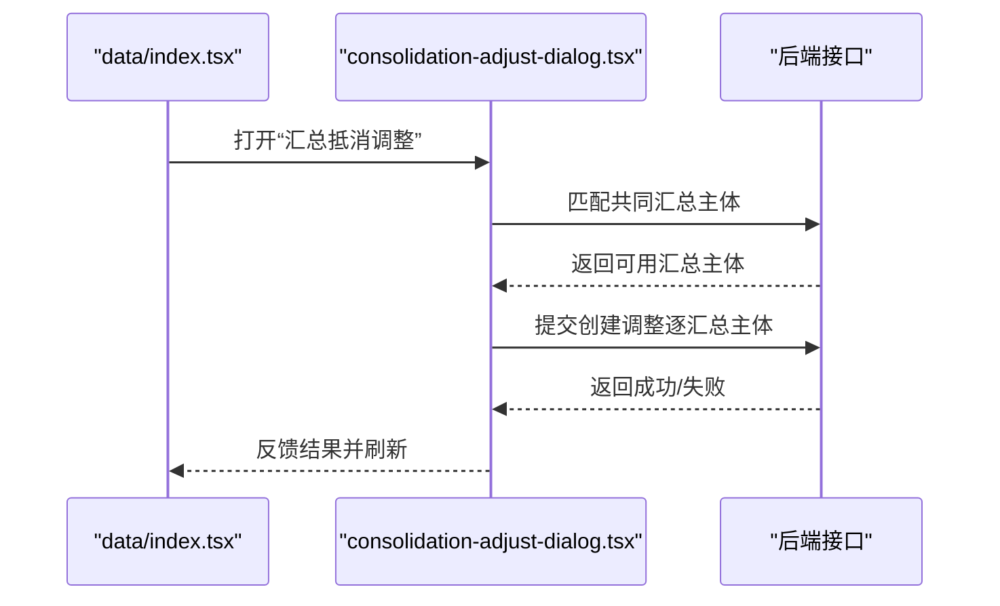
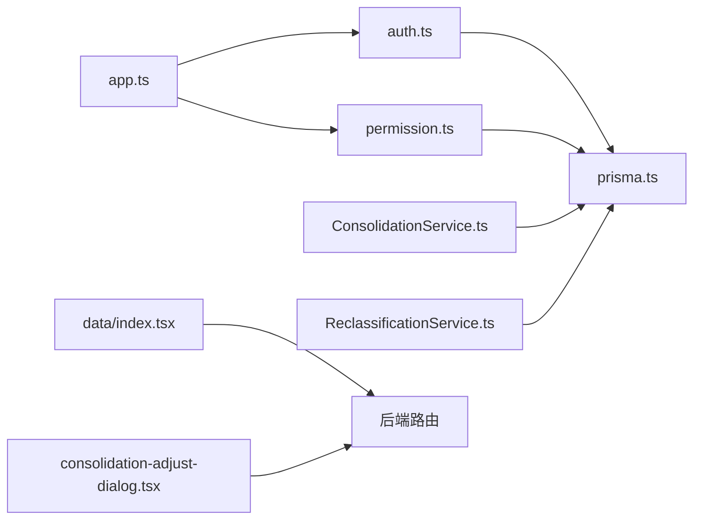

# 合并调整系统

<cite>
**本文引用的文件**   
- [server/src/app.ts](file://server/src/app.ts)
- [server/src/server.ts](file://server/src/server.ts)
- [server/prisma/schema.prisma](file://server/prisma/schema.prisma)
- [server/src/middleware/auth.ts](file://server/src/middleware/auth.ts)
- [server/src/middleware/permission.ts](file://server/src/middleware/permission.ts)
- [server/src/services/ConsolidationService.ts](file://server/src/services/ConsolidationService.ts)
- [server/src/services/ReclassificationService.ts](file://server/src/services/ReclassificationService.ts)
- [web/src/App.tsx](file://web/src/App.tsx)
- [web/src/pages/data/index.tsx](file://web/src/pages/data/index.tsx)
- [web/src/components/reclassify/consolidation-adjust-dialog.tsx](file://web/src/components/reclassify/consolidation-adjust-dialog.tsx)
- [docs/plans/数据模型规范.md](file://docs/plans/数据模型规范.md)
</cite>

## 目录
1. [简介](#简介)
2. [项目结构](#项目结构)
3. [核心组件](#核心组件)
4. [架构总览](#架构总览)
5. [详细组件分析](#详细组件分析)
6. [依赖关系分析](#依赖关系分析)
7. [性能考量](#性能考量)
8. [故障排查指南](#故障排查指南)
9. [结论](#结论)
10. [附录](#附录)

## 简介
本系统为浙江壹品慧财年经营数据分析平台的“合并调整”能力，聚焦在集团汇总口径上的内部交易抵消与数据重分类。其目标是在不改动单体公司事实数据的前提下，通过“汇总抵消调整”和“跨公司/科目间重分类”，确保汇总报表的准确性与可审计性。系统采用 Express + Prisma + PostgreSQL 技术栈，前后端分离，权限与安全由中间件链统一保障，计算类指标使用安全公式解析，AI 双管道用于脱敏与生成。

## 项目结构
后端以 Express 应用为中心，中间件链按固定顺序执行：helmet → cors → express.json → rate-limit → auth(JWT+黑名单) → permission(默认拒绝) → scope(Prisma extension) → softDelete → audit → Service → Prisma → PostgreSQL。前端基于 React Router + TanStack Query，页面路由与权限门禁配合，数据管理页提供导入、浏览、重分类与汇总抵消调整入口。



**图表来源** 
- [server/src/app.ts:26-84](file://server/src/app.ts#L26-L84)
- [server/src/middleware/auth.ts:27-82](file://server/src/middleware/auth.ts#L27-L82)
- [server/src/middleware/permission.ts:14-48](file://server/src/middleware/permission.ts#L14-L48)
- [server/src/services/ConsolidationService.ts:105-148](file://server/src/services/ConsolidationService.ts#L105-L148)
- [server/src/services/ReclassificationService.ts:1-200](file://server/src/services/ReclassificationService.ts#L1-L200)
- [web/src/App.tsx:32-66](file://web/src/App.tsx#L32-L66)
- [web/src/pages/data/index.tsx:88-136](file://web/src/pages/data/index.tsx#L88-L136)
- [web/src/components/reclassify/consolidation-adjust-dialog.tsx:42-181](file://web/src/components/reclassify/consolidation-adjust-dialog.tsx#L42-L181)

**章节来源**
- [server/src/app.ts:26-84](file://server/src/app.ts#L26-L84)
- [server/src/server.ts:10-32](file://server/src/server.ts#L10-L32)
- [web/src/App.tsx:32-66](file://web/src/App.tsx#L32-L66)

## 核心组件
- 汇总抵消调整（ConsolidationService）：在汇总主体（ET*）上按科目/期间叠加抵消金额，软删除即撤销；仅影响汇总口径，单体不受影响。
- 重分类服务（ReclassificationService）：支持跨公司重分类（整行迁移/按比例/按金额）与同公司科目间调整（调增/调减/双向），保留行级快照支持撤销，并记录审计日志。
- 权限与鉴权（auth/permission）：JWT 校验、首次改密豁免路径、RBAC 权限判定（默认拒绝）。
- 数据模型（Prisma Schema）：定义公司、科目、事实表、重分类日志、汇总抵消调整等实体与约束。

**章节来源**
- [server/src/services/ConsolidationService.ts:1-218](file://server/src/services/ConsolidationService.ts#L1-L218)
- [server/src/services/ReclassificationService.ts:1-200](file://server/src/services/ReclassificationService.ts#L1-L200)
- [server/src/middleware/auth.ts:27-82](file://server/src/middleware/auth.ts#L27-L82)
- [server/src/middleware/permission.ts:14-48](file://server/src/middleware/permission.ts#L14-L48)
- [server/prisma/schema.prisma:419-435](file://server/prisma/schema.prisma#L419-L435)

## 架构总览
请求从前端发起，经路由进入后端中间件链，依次完成安全头、CORS、限流、鉴权、权限、范围控制、软删除过滤、审计注入，最终到达具体 Service 层操作 Prisma 客户端访问数据库。汇总抵消与重分类两条关键链路如下：



**图表来源** 
- [server/src/app.ts:66-77](file://server/src/app.ts#L66-L77)
- [server/src/middleware/auth.ts:27-82](file://server/src/middleware/auth.ts#L27-L82)
- [server/src/middleware/permission.ts:14-48](file://server/src/middleware/permission.ts#L14-L48)
- [server/src/services/ConsolidationService.ts:105-148](file://server/src/services/ConsolidationService.ts#L105-L148)

## 详细组件分析

### 汇总抵消调整（ConsolidationService）
- 功能要点
  - 仅对汇总主体生效，单体公司不可直接操作。
  - 科目必须为经营科目树且为 data 类叶子，避免被公式覆盖。
  - 金额非 0，正=调增、负=调减，单位万元。
  - 软删除即撤销，聚合查询只取未删除记录。
  - 每次操作写审计日志，包含明细与操作人。
- 关键流程
  - 参数校验（期间格式、金额非 0、原因必填）
  - 主体与科目存在性与类型校验
  - 数据范围授权校验（全有或全无）
  - 写入 consolidation_adjustment 并记录审计
- 复杂度与优化
  - 列表查询并行拉取用户/公司/科目名称映射，减少 N+1 查询。
  - 分页计数与数据获取并发执行。



**图表来源** 
- [server/src/services/ConsolidationService.ts:105-148](file://server/src/services/ConsolidationService.ts#L105-L148)

**章节来源**
- [server/src/services/ConsolidationService.ts:1-218](file://server/src/services/ConsolidationService.ts#L1-L218)

### 重分类服务（ReclassificationService）
- 功能要点
  - 跨公司重分类：all/ratio/amount 三种模式，保证总额守恒。
  - 同公司科目间调整：both/decrease/increase 三种模式，允许净差变化。
  - 期间口径：单月 YYYY-MM；预算模板按期所属财年匹配。
  - 行级快照与撤销：reclassification_log 含 snapshot，支持 revert。
  - 审计留痕：所有变更均记录审计日志。
- 关键流程
  - 参数校验（transferMode/adjustMode、比例/金额合法性）
  - 公司/科目存在性与值类型一致性校验
  - 构造 where 条件与期间过滤器
  - 更新/新建/删除事实行，生成快照与审计

```mermaid
classDiagram
class ReclassificationService {
+previewCompany(params, scope) PreviewResult
+reclassifyCompany(params, scope, ctx) Result
+previewAdjustSubject(params, scope) AdjustSubjectPreview
+adjustSubject(params, scope, ctx) Result
}
class FactFilter {
+accountCodes? : string[]
+periodFrom? : string
+periodTo? : string
+fiscalYear? : string
}
class RowSnapshot {
+updated : {id : string; data : Record}[]
+created : string[]
+deleted : Record[]
}
ReclassificationService --> FactFilter : "构造查询条件"
ReclassificationService --> RowSnapshot : "生成行级快照"
```

**图表来源** 
- [server/src/services/ReclassificationService.ts:1-200](file://server/src/services/ReclassificationService.ts#L1-L200)

**章节来源**
- [server/src/services/ReclassificationService.ts:1-200](file://server/src/services/ReclassificationService.ts#L1-L200)

### 权限与鉴权（auth/permission）
- 鉴权中间件
  - 校验 Authorization 头与 access token，失败返回 401。
  - 加载用户与角色，检查状态与首次改密标志，必要时限制访问路径。
- 权限中间件
  - 默认拒绝策略，需持有对应 resource:action 权限。
  - 支持任一权限命中放行（多模块共享主数据场景）。
  - 拒绝时补记审计，便于越权尝试追溯。



**图表来源** 
- [server/src/middleware/auth.ts:27-82](file://server/src/middleware/auth.ts#L27-L82)
- [server/src/middleware/permission.ts:14-48](file://server/src/middleware/permission.ts#L14-L48)

**章节来源**
- [server/src/middleware/auth.ts:27-82](file://server/src/middleware/auth.ts#L27-L82)
- [server/src/middleware/permission.ts:14-48](file://server/src/middleware/permission.ts#L14-L48)

### 前端交互（data/index.tsx 与 consolidation-adjust-dialog.tsx）
- 数据管理页提供“数据调整”下拉菜单，根据权限显隐“科目调整/跨公司重分类/汇总抵消调整”。
- 汇总抵消对话框引导用户选择两个单体公司，自动匹配共同汇总主体，设置科目/期间/金额/原因，确认后逐汇总主体创建调整记录。
- 错误提示与确认弹窗保障操作安全，成功后刷新看板与指标。



**图表来源** 
- [web/src/pages/data/index.tsx:56-86](file://web/src/pages/data/index.tsx#L56-L86)
- [web/src/components/reclassify/consolidation-adjust-dialog.tsx:86-181](file://web/src/components/reclassify/consolidation-adjust-dialog.tsx#L86-L181)

**章节来源**
- [web/src/pages/data/index.tsx:88-136](file://web/src/pages/data/index.tsx#L88-L136)
- [web/src/components/reclassify/consolidation-adjust-dialog.tsx:42-181](file://web/src/components/reclassify/consolidation-adjust-dialog.tsx#L42-L181)

## 依赖关系分析
- 中间件依赖
  - app.ts 装配中间件与路由，health 探针直连 basePrisma。
  - auth.ts 依赖 prisma.user 与 jwt 验证。
  - permission.ts 依赖 prisma.permission 与审计记录。
- 服务依赖
  - ConsolidationService 依赖 prisma.consolidationAdjustment、company、accountSubject、metric 与 effectiveScope。
  - ReclassificationService 依赖 fact_operating/static/budget、reclassification_log、importBatch 与 period 工具。
- 前端依赖
  - data/index.tsx 依赖 api-queries、subject-tree、company-panel、aggregation-map-panel 等。
  - consolidation-adjust-dialog.tsx 依赖 useCommonSummaries、useCreateConsolidationAdjustment 等。



**图表来源** 
- [server/src/app.ts:26-84](file://server/src/app.ts#L26-L84)
- [server/src/middleware/auth.ts:27-82](file://server/src/middleware/auth.ts#L27-L82)
- [server/src/middleware/permission.ts:14-48](file://server/src/middleware/permission.ts#L14-L48)
- [server/src/services/ConsolidationService.ts:1-218](file://server/src/services/ConsolidationService.ts#L1-L218)
- [server/src/services/ReclassificationService.ts:1-200](file://server/src/services/ReclassificationService.ts#L1-L200)
- [web/src/pages/data/index.tsx:88-136](file://web/src/pages/data/index.tsx#L88-L136)
- [web/src/components/reclassify/consolidation-adjust-dialog.tsx:42-181](file://web/src/components/reclassify/consolidation-adjust-dialog.tsx#L42-L181)

**章节来源**
- [server/src/app.ts:26-84](file://server/src/app.ts#L26-L84)
- [server/src/middleware/auth.ts:27-82](file://server/src/middleware/auth.ts#L27-L82)
- [server/src/middleware/permission.ts:14-48](file://server/src/middleware/permission.ts#L14-L48)
- [server/src/services/ConsolidationService.ts:1-218](file://server/src/services/ConsolidationService.ts#L1-L218)
- [server/src/services/ReclassificationService.ts:1-200](file://server/src/services/ReclassificationService.ts#L1-L200)
- [web/src/pages/data/index.tsx:88-136](file://web/src/pages/data/index.tsx#L88-L136)
- [web/src/components/reclassify/consolidation-adjust-dialog.tsx:42-181](file://web/src/components/reclassify/consolidation-adjust-dialog.tsx#L42-L181)

## 性能考量
- 中间件链最短化：健康检查与通用限流前置，减少无效请求处理。
- 数据库查询优化：列表查询并行拉取关联名称映射，避免 N+1；分页计数与数据获取并发。
- 连接复用：Node keepAliveTimeout 与 headersTimeout 对齐 nginx，降低网络层错误。
- 计算类指标实时派生：同比/环比不存库，减少存储与同步成本。

[本节为通用指导，无需特定文件引用]

## 故障排查指南
- 鉴权失败（401）
  - 检查 Authorization 头是否携带有效 Bearer token。
  - 确认用户状态 active 且角色状态 active。
  - 首次登录须改密的用户仅能访问豁免路径。
- 权限拒绝（403）
  - 确认角色拥有对应 resource:action 权限。
  - 查看审计日志中 denied 记录定位越权尝试。
- 汇总抵消调整失败
  - 校验期间格式（YYYY-MM）、金额非 0、原因必填。
  - 确认汇总主体存在且为汇总类型，科目为经营 data 类叶子。
  - 检查数据范围授权（全有或全无）。
- 重分类异常
  - 校验 transferMode/adjustMode 参数合法性。
  - 确认源/目标公司与科目存在且值类型一致。
  - 查看 reclassification_log 快照与审计日志定位问题。

**章节来源**
- [server/src/middleware/auth.ts:27-82](file://server/src/middleware/auth.ts#L27-L82)
- [server/src/middleware/permission.ts:14-48](file://server/src/middleware/permission.ts#L14-L48)
- [server/src/services/ConsolidationService.ts:105-148](file://server/src/services/ConsolidationService.ts#L105-L148)
- [server/src/services/ReclassificationService.ts:117-164](file://server/src/services/ReclassificationService.ts#L117-L164)

## 结论
合并调整系统通过“汇总抵消调整”与“重分类服务”两大核心能力，在不破坏单体数据完整性的前提下，精准修正汇总口径的内部交易重复计算与跨公司/科目数据归属问题。严格的中间件链与 RBAC 权限模型保障了安全性与可审计性，Prisma 数据模型与长表设计确保了可扩展性与一致性。建议在生产环境持续监控审计日志与性能指标，定期评估数据范围授权与权限配置，确保系统稳定运行。

[本节为总结性内容，无需特定文件引用]

## 附录
- 数据模型规范参考：三范式、命名规范、编码规则、软删除策略、容量规划等详见数据模型规范文档。

**章节来源**
- [docs/plans/数据模型规范.md:1-200](file://docs/plans/数据模型规范.md#L1-L200)