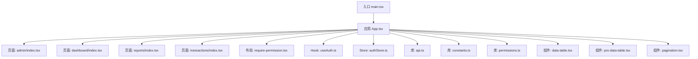
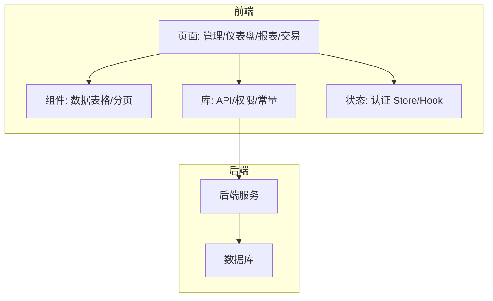
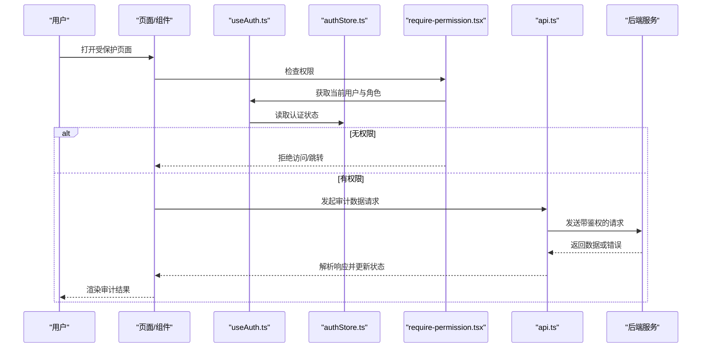
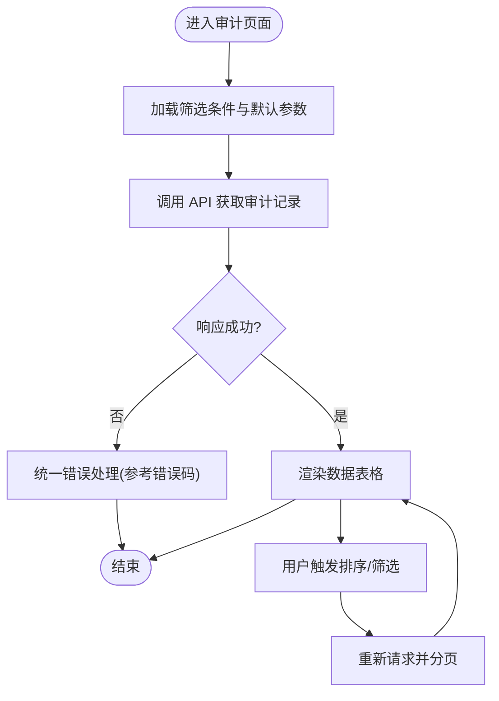
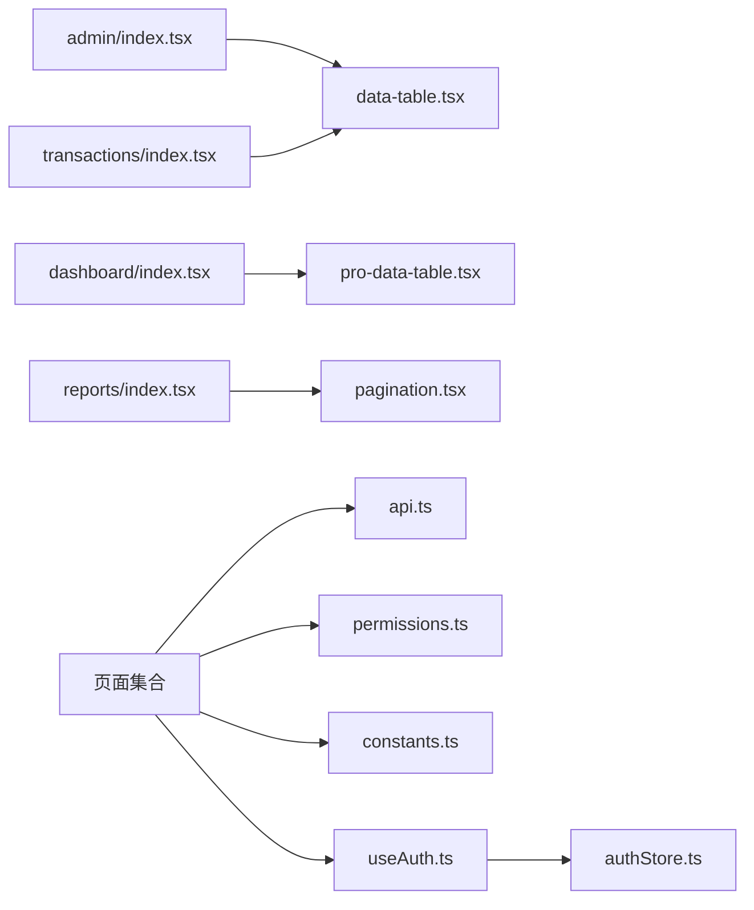

# 审计日志系统

<cite>
**本文引用的文件**   
- [package.json](file://web/package.json)
- [App.tsx](file://web/src/App.tsx)
- [main.tsx](file://web/src/main.tsx)
- [api.ts](file://web/src/lib/api.ts)
- [constants.ts](file://web/src/lib/constants.ts)
- [permissions.ts](file://web/src/lib/permissions.ts)
- [useAuth.ts](file://web/src/hooks/useAuth.ts)
- [authStore.ts](file://web/src/stores/authStore.ts)
- [require-permission.tsx](file://web/src/components/layout/require-permission.tsx)
- [data-table.tsx](file://web/src/components/data-table/data-table.tsx)
- [pro-data-table.tsx](file://web/src/components/data-table/pro-data-table.tsx)
- [pagination.tsx](file://web/src/components/data-table/pagination.tsx)
- [index.tsx](file://web/src/pages/admin/index.tsx)
- [index.tsx](file://web/src/pages/dashboard/index.tsx)
- [index.tsx](file://web/src/pages/reports/index.tsx)
- [index.tsx](file://web/src/pages/transactions/index.tsx)
- [errorcode.md](file://docs/references/errorcode.md)
- [backend.md](file://docs/references/backend.md)
</cite>

## 目录
1. [简介](#简介)
2. [项目结构](#项目结构)
3. [核心组件](#核心组件)
4. [架构总览](#架构总览)
5. [详细组件分析](#详细组件分析)
6. [依赖关系分析](#依赖关系分析)
7. [性能考虑](#性能考虑)
8. [故障排查指南](#故障排查指南)
9. [结论](#结论)
10. [附录](#附录)

## 简介
本仓库为“审计日志系统”的前端实现，聚焦于用户行为与关键操作的记录、查询与展示。系统采用 React + TypeScript 技术栈，通过统一的 API 层与权限控制，提供管理员与业务角色的审计数据查看能力。文档面向开发者与运维人员，帮助快速理解模块职责、调用链路、错误码约定与排障要点。

## 项目结构
前端位于 web 目录，主要包含：
- 应用入口与路由组织
- 通用库（API、常量、权限）
- 页面（管理、仪表盘、报表、交易等）
- 可复用 UI 与数据表格组件
- 状态与鉴权 Hook

图表来源
- [main.tsx](file://web/src/main.tsx)
- [App.tsx](file://web/src/App.tsx)
- [api.ts](file://web/src/lib/api.ts)
- [constants.ts](file://web/src/lib/constants.ts)
- [permissions.ts](file://web/src/lib/permissions.ts)
- [useAuth.ts](file://web/src/hooks/useAuth.ts)
- [authStore.ts](file://web/src/stores/authStore.ts)
- [require-permission.tsx](file://web/src/components/layout/require-permission.tsx)
- [data-table.tsx](file://web/src/components/data-table/data-table.tsx)
- [pro-data-table.tsx](file://web/src/components/data-table/pro-data-table.tsx)
- [pagination.tsx](file://web/src/components/data-table/pagination.tsx)
- [admin/index.tsx](file://web/src/pages/admin/index.tsx)
- [dashboard/index.tsx](file://web/src/pages/dashboard/index.tsx)
- [reports/index.tsx](file://web/src/pages/reports/index.tsx)
- [transactions/index.tsx](file://web/src/pages/transactions/index.tsx)

章节来源
- [package.json](file://web/package.json)
- [main.tsx](file://web/src/main.tsx)
- [App.tsx](file://web/src/App.tsx)

## 核心组件
- 统一 API 层：封装请求、拦截器、错误处理与重试策略，供各页面与组件调用。
- 权限与鉴权：基于角色/权限的访问控制，结合路由守卫与页面级权限校验。
- 数据表格与分页：用于审计记录的列表展示、筛选、排序与分页。
- 页面模块：管理员、仪表盘、报表、交易等视图，分别承载不同维度的审计数据展示。

章节来源
- [api.ts](file://web/src/lib/api.ts)
- [permissions.ts](file://web/src/lib/permissions.ts)
- [useAuth.ts](file://web/src/hooks/useAuth.ts)
- [authStore.ts](file://web/src/stores/authStore.ts)
- [data-table.tsx](file://web/src/components/data-table/data-table.tsx)
- [pro-data-table.tsx](file://web/src/components/data-table/pro-data-table.tsx)
- [pagination.tsx](file://web/src/components/data-table/pagination.tsx)
- [admin/index.tsx](file://web/src/pages/admin/index.tsx)
- [dashboard/index.tsx](file://web/src/pages/dashboard/index.tsx)
- [reports/index.tsx](file://web/src/pages/reports/index.tsx)
- [transactions/index.tsx](file://web/src/pages/transactions/index.tsx)

## 架构总览
整体采用“页面-组件-库-后端”的分层结构。页面负责业务视图与交互；组件提供通用 UI 与数据表格能力；库层统一网络请求、权限判断与常量定义；最终通过 API 与后端服务交互。

图表来源
- [App.tsx](file://web/src/App.tsx)
- [api.ts](file://web/src/lib/api.ts)
- [permissions.ts](file://web/src/lib/permissions.ts)
- [useAuth.ts](file://web/src/hooks/useAuth.ts)
- [authStore.ts](file://web/src/stores/authStore.ts)
- [data-table.tsx](file://web/src/components/data-table/data-table.tsx)
- [pro-data-table.tsx](file://web/src/components/data-table/pro-data-table.tsx)
- [pagination.tsx](file://web/src/components/data-table/pagination.tsx)
- [backend.md](file://docs/references/backend.md)

## 详细组件分析

### 认证与权限流程
该流程覆盖登录态维护、权限判定与受保护页面的访问控制。

图表来源
- [useAuth.ts](file://web/src/hooks/useAuth.ts)
- [authStore.ts](file://web/src/stores/authStore.ts)
- [require-permission.tsx](file://web/src/components/layout/require-permission.tsx)
- [api.ts](file://web/src/lib/api.ts)
- [backend.md](file://docs/references/backend.md)

章节来源
- [useAuth.ts](file://web/src/hooks/useAuth.ts)
- [authStore.ts](file://web/src/stores/authStore.ts)
- [require-permission.tsx](file://web/src/components/layout/require-permission.tsx)
- [api.ts](file://web/src/lib/api.ts)

### 审计数据查询与展示
审计数据通常以列表形式呈现，支持筛选、排序与分页。

图表来源
- [api.ts](file://web/src/lib/api.ts)
- [data-table.tsx](file://web/src/components/data-table/data-table.tsx)
- [pro-data-table.tsx](file://web/src/components/data-table/pro-data-table.tsx)
- [pagination.tsx](file://web/src/components/data-table/pagination.tsx)
- [errorcode.md](file://docs/references/errorcode.md)

章节来源
- [data-table.tsx](file://web/src/components/data-table/data-table.tsx)
- [pro-data-table.tsx](file://web/src/components/data-table/pro-data-table.tsx)
- [pagination.tsx](file://web/src/components/data-table/pagination.tsx)
- [api.ts](file://web/src/lib/api.ts)
- [errorcode.md](file://docs/references/errorcode.md)

### 页面模块职责
- 管理页面：集中展示系统级审计事件，如用户管理、配置变更等。
- 仪表盘：汇总关键指标与趋势，便于快速掌握审计概况。
- 报表：导出与深度分析审计数据，支持按时间范围与维度聚合。
- 交易：聚焦交易相关审计记录，便于追踪资金与订单生命周期。

章节来源
- [admin/index.tsx](file://web/src/pages/admin/index.tsx)
- [dashboard/index.tsx](file://web/src/pages/dashboard/index.tsx)
- [reports/index.tsx](file://web/src/pages/reports/index.tsx)
- [transactions/index.tsx](file://web/src/pages/transactions/index.tsx)

## 依赖关系分析
前端内部依赖关系如下：页面依赖组件与库；库层被多处复用；认证与权限贯穿整个流程。

图表来源
- [admin/index.tsx](file://web/src/pages/admin/index.tsx)
- [dashboard/index.tsx](file://web/src/pages/dashboard/index.tsx)
- [reports/index.tsx](file://web/src/pages/reports/index.tsx)
- [transactions/index.tsx](file://web/src/pages/transactions/index.tsx)
- [data-table.tsx](file://web/src/components/data-table/data-table.tsx)
- [pro-data-table.tsx](file://web/src/components/data-table/pro-data-table.tsx)
- [pagination.tsx](file://web/src/components/data-table/pagination.tsx)
- [api.ts](file://web/src/lib/api.ts)
- [permissions.ts](file://web/src/lib/permissions.ts)
- [constants.ts](file://web/src/lib/constants.ts)
- [useAuth.ts](file://web/src/hooks/useAuth.ts)
- [authStore.ts](file://web/src/stores/authStore.ts)

章节来源
- [api.ts](file://web/src/lib/api.ts)
- [permissions.ts](file://web/src/lib/permissions.ts)
- [constants.ts](file://web/src/lib/constants.ts)
- [useAuth.ts](file://web/src/hooks/useAuth.ts)
- [authStore.ts](file://web/src/stores/authStore.ts)
- [data-table.tsx](file://web/src/components/data-table/data-table.tsx)
- [pro-data-table.tsx](file://web/src/components/data-table/pro-data-table.tsx)
- [pagination.tsx](file://web/src/components/data-table/pagination.tsx)
- [admin/index.tsx](file://web/src/pages/admin/index.tsx)
- [dashboard/index.tsx](file://web/src/pages/dashboard/index.tsx)
- [reports/index.tsx](file://web/src/pages/reports/index.tsx)
- [transactions/index.tsx](file://web/src/pages/transactions/index.tsx)

## 性能考虑
- 列表与分页：优先使用服务端分页与增量加载，避免一次性拉取大量数据。
- 缓存策略：对不频繁变化的字典与配置进行本地缓存，减少重复请求。
- 渲染优化：大数据量表格启用虚拟滚动与按需渲染，降低主线程压力。
- 请求合并与去抖：搜索与筛选输入采用去抖，避免高频请求。
- 错误重试与降级：对瞬时失败进行有限次重试，并提供友好降级提示。

[本节为通用指导，无需代码引用]

## 故障排查指南
- 统一错误码：遵循错误码规范，定位问题层级（网络、鉴权、业务）。
- 鉴权失败：检查 Token 是否过期、权限是否缺失、路由守卫是否正确拦截。
- 数据为空：确认筛选条件、分页参数与后端接口契约一致。
- 表格卡顿：检查数据量、列渲染逻辑与分页策略。
- 网络异常：查看请求头、跨域配置与后端健康状态。

章节来源
- [errorcode.md](file://docs/references/errorcode.md)
- [api.ts](file://web/src/lib/api.ts)
- [require-permission.tsx](file://web/src/components/layout/require-permission.tsx)
- [useAuth.ts](file://web/src/hooks/useAuth.ts)

## 结论
本审计日志系统以前端分层架构为基础，通过统一的 API 与权限控制，实现了审计数据的采集、查询与可视化展示。建议在后续迭代中持续完善错误码体系、增强表格性能与扩展更多审计维度，以提升系统的可观测性与用户体验。

[本节为总结性内容，无需代码引用]

## 附录
- 后端参考：了解后端接口设计与部署建议，有助于前后端联调与问题定位。
- 错误码参考：统一错误码定义，便于前端统一处理与用户提示。

章节来源
- [backend.md](file://docs/references/backend.md)
- [errorcode.md](file://docs/references/errorcode.md)