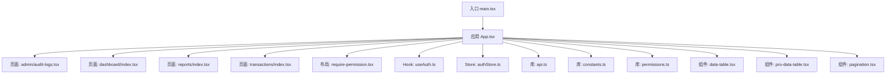
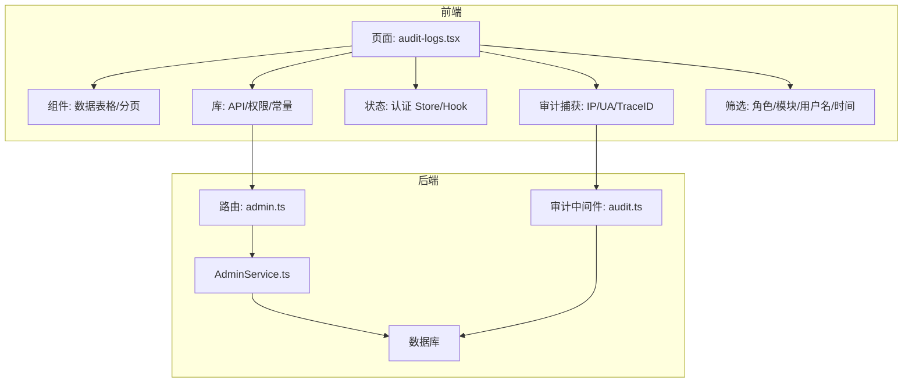
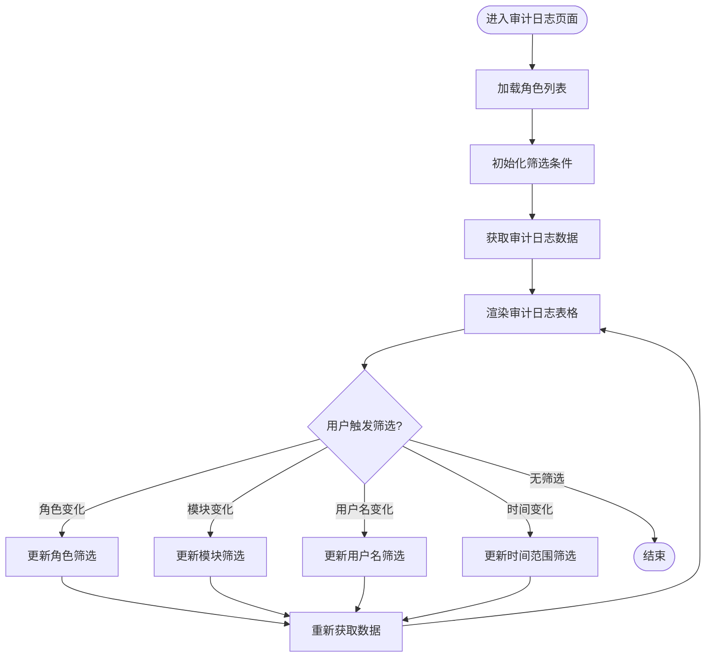
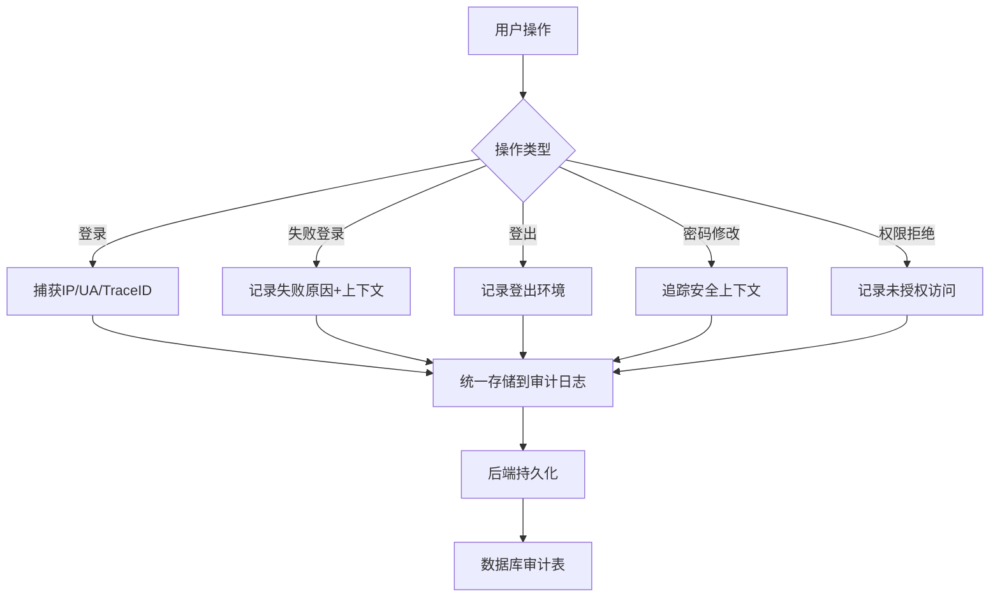
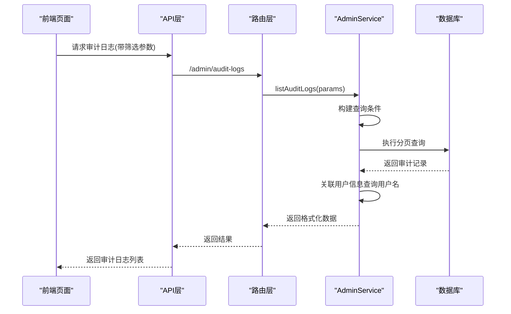
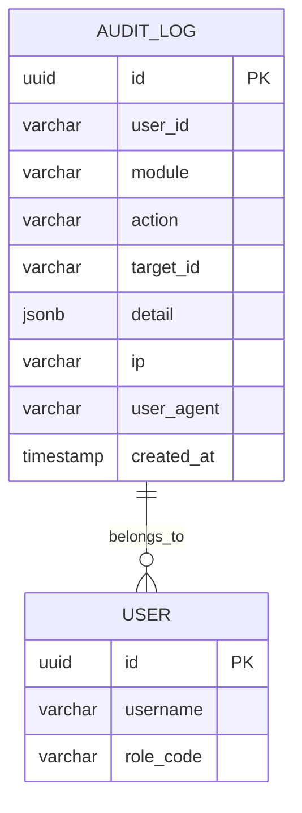
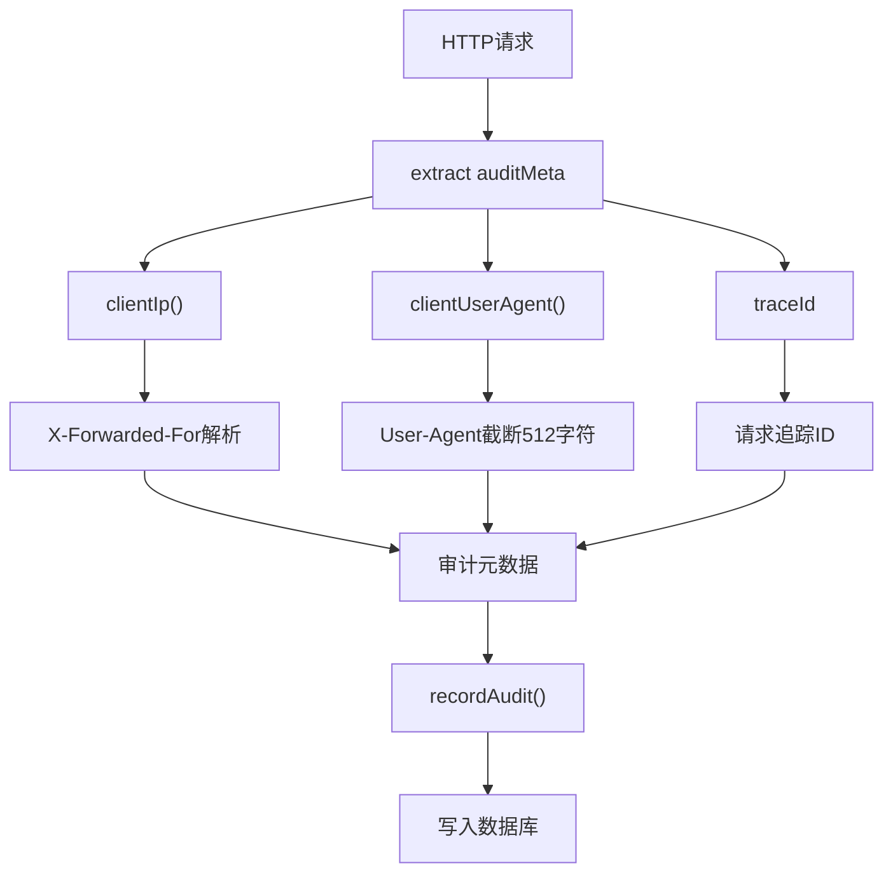
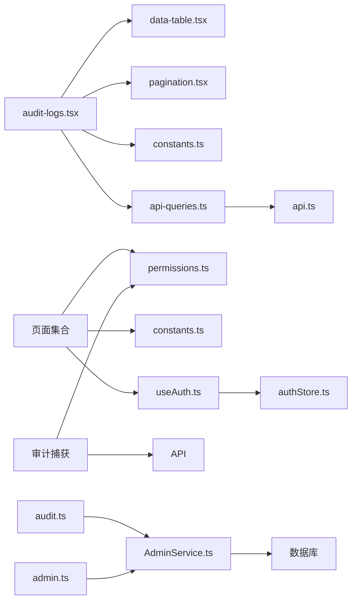

# 审计日志系统

<cite>
**本文引用的文件**
- [audit-logs.tsx](file://web/src/pages/admin/audit-logs.tsx)
- [constants.ts](file://web/src/lib/constants.ts)
- [api-queries.ts](file://web/src/hooks/api-queries.ts)
- [AdminService.ts](file://server/src/services/AdminService.ts)
- [audit.ts](file://server/src/middleware/audit.ts)
- [migration.sql](file://server/prisma/migrations/20260730120000_add_audit_user_agent_and_permission_action_enum/migration.sql)
- [init-audit.sql](file://server/prisma/init-audit.sql)
- [admin.ts](file://server/src/routes/admin.ts)
- [api.ts](file://web/src/lib/api.ts)
- [audit.test.ts](file://server/src/middleware/audit.test.ts)
</cite>

## 更新摘要
**变更内容**
- **增强的用户行为追踪查询界面**：支持按角色、模块、用户名关键字与日期范围的多维度筛选，提供完整的筛选界面和实时数据展示
- **统一的审计信息捕获机制**：新增IP地址、用户代理（User-Agent）和追踪ID的统一记录，覆盖登录、失败登录、登出、密码修改与权限拒绝等关键操作
- **完善的前端审计日志页面**：实现角色下拉选择、模块筛选、时间范围输入和用户搜索的完整交互界面
- **后端服务增强**：AdminService.listAuditLogs支持多维度筛选与分页查询，自动关联用户信息并返回用户名
- **数据库模型扩展**：新增user_agent字段支持，最大512字符限制，用于区分同IP的不同客户端

## 目录
1. [简介](#简介)
2. [项目结构](#项目结构)
3. [核心组件](#核心组件)
4. [架构总览](#架构总览)
5. [详细组件分析](#详细组件分析)
6. [依赖关系分析](#依赖关系分析)
7. [性能考虑](#性能考虑)
8. [故障排查指南](#故障排查指南)
9. [结论](#结论)
10. [附录](#附录)

## 简介
本仓库为"审计日志系统"的前端实现，聚焦于用户行为与关键操作的记录、查询与展示。系统采用 React + TypeScript 技术栈，通过统一的 API 层与权限控制，提供管理员与业务角色的审计数据查看能力。**最新更新**：系统已实现完整的用户行为追踪功能，支持按角色、模块、用户名关键字和日期范围进行多维筛选，同时增强了审计信息的完整性，包括IP地址、用户代理信息和追踪ID的统一捕获机制。文档面向开发者与运维人员，帮助快速理解模块职责、调用链路、错误码约定与排障要点。

## 项目结构
前端位于 web 目录，主要包含：
- 应用入口与路由组织
- 通用库（API、常量、权限）
- 页面（管理、仪表盘、报表、交易等）
- 可复用 UI 与数据表格组件
- 状态与鉴权 Hook

图表来源
- [main.tsx](file://web/src/main.tsx)
- [App.tsx](file://web/src/App.tsx)
- [api.ts](file://web/src/lib/api.ts)
- [constants.ts](file://web/src/lib/constants.ts)
- [permissions.ts](file://web/src/lib/permissions.ts)
- [useAuth.ts](file://web/src/hooks/useAuth.ts)
- [authStore.ts](file://web/src/stores/authStore.ts)
- [require-permission.tsx](file://web/src/components/layout/require-permission.tsx)
- [data-table.tsx](file://web/src/components/data-table/data-table.tsx)
- [pro-data-table.tsx](file://web/src/components/data-table/pro-data-table.tsx)
- [pagination.tsx](file://web/src/components/data-table/pagination.tsx)
- [audit-logs.tsx](file://web/src/pages/admin/audit-logs.tsx)

章节来源
- [package.json](file://web/package.json)
- [main.tsx](file://web/src/main.tsx)
- [App.tsx](file://web/src/App.tsx)

## 核心组件
- 统一 API 层：封装请求、拦截器、错误处理与重试策略，供各页面与组件调用。
- 权限与鉴权：基于角色/权限的访问控制，结合路由守卫与页面级权限校验。
- 数据表格与分页：用于审计记录的列表展示、筛选、排序与分页。
- 页面模块：管理员、仪表盘、报表、交易等视图，分别承载不同维度的审计数据展示。
- **新增功能**：增强的审计信息捕获机制，支持用户代理、IP地址和追踪ID的统一记录；完整的审计日志查询界面，支持角色、模块、用户名和时间范围的组合筛选。

章节来源
- [api.ts](file://web/src/lib/api.ts)
- [permissions.ts](file://web/src/lib/permissions.ts)
- [useAuth.ts](file://web/src/hooks/useAuth.ts)
- [authStore.ts](file://web/src/stores/authStore.ts)
- [data-table.tsx](file://web/src/components/data-table/data-table.tsx)
- [pro-data-table.tsx](file://web/src/components/data-table/pro-data-table.tsx)
- [pagination.tsx](file://web/src/components/data-table/pagination.tsx)
- [audit-logs.tsx](file://web/src/pages/admin/audit-logs.tsx)

## 架构总览
整体采用"页面-组件-库-后端"的分层结构。页面负责业务视图与交互；组件提供通用 UI 与数据表格能力；库层统一网络请求、权限判断与常量定义；最终通过 API 与后端服务交互。**更新后的架构**增强了审计信息的统一捕获和处理机制，支持多维度的审计日志查询。

图表来源
- [App.tsx](file://web/src/App.tsx)
- [api.ts](file://web/src/lib/api.ts)
- [permissions.ts](file://web/src/lib/permissions.ts)
- [useAuth.ts](file://web/src/hooks/useAuth.ts)
- [authStore.ts](file://web/src/stores/authStore.ts)
- [data-table.tsx](file://web/src/components/data-table/data-table.tsx)
- [pro-data-table.tsx](file://web/src/components/data-table/pro-data-table.tsx)
- [pagination.tsx](file://web/src/components/data-table/pagination.tsx)
- [AdminService.ts](file://server/src/services/AdminService.ts)
- [audit.ts](file://server/src/middleware/audit.ts)
- [admin.ts](file://server/src/routes/admin.ts)

## 详细组件分析

### 增强的审计日志查询界面
审计日志页面提供了完整的用户行为追踪查询界面，支持多维度筛选和实时数据展示。

图表来源
- [audit-logs.tsx](file://web/src/pages/admin/audit-logs.tsx)
- [api-queries.ts](file://web/src/hooks/api-queries.ts)
- [constants.ts](file://web/src/lib/constants.ts)

章节来源
- [audit-logs.tsx](file://web/src/pages/admin/audit-logs.tsx)
- [api-queries.ts](file://web/src/hooks/api-queries.ts)
- [constants.ts](file://web/src/lib/constants.ts)

### 统一的审计信息捕获机制
**新增**：系统实现了统一的审计信息捕获机制，涵盖以下关键操作：

- **登录操作**：捕获成功登录的用户代理、IP地址和追踪ID
- **失败登录**：记录失败的登录尝试及相关上下文信息
- **登出操作**：记录用户登出时的环境信息
- **密码修改**：追踪密码变更操作的安全上下文
- **权限拒绝**：记录未授权访问尝试的详细信息

[此流程图展示了新增的审计信息捕获机制，无需特定文件来源]

### 后端审计日志服务
后端 AdminService 提供了强大的审计日志查询功能，支持多维度筛选和分页处理。

图表来源
- [AdminService.ts](file://server/src/services/AdminService.ts)
- [audit.ts](file://server/src/middleware/audit.ts)
- [admin.ts](file://server/src/routes/admin.ts)

章节来源
- [AdminService.ts](file://server/src/services/AdminService.ts)
- [audit.ts](file://server/src/middleware/audit.ts)
- [admin.ts](file://server/src/routes/admin.ts)

### 审计数据模型与迁移
系统通过数据库迁移增强了审计日志的数据模型，新增了用户代理字段支持。

图表来源
- [migration.sql](file://server/prisma/migrations/20260730120000_add_audit_user_agent_and_permission_action_enum/migration.sql)
- [init-audit.sql](file://server/prisma/init-audit.sql)

章节来源
- [migration.sql](file://server/prisma/migrations/20260730120000_add_audit_user_agent_and_permission_action_enum/migration.sql)
- [init-audit.sql](file://server/prisma/init-audit.sql)

### 审计中间件功能
审计中间件提供了完整的审计信息提取和记录功能。

图表来源
- [audit.ts](file://server/src/middleware/audit.ts)

章节来源
- [audit.ts](file://server/src/middleware/audit.ts)
- [audit.test.ts](file://server/src/middleware/audit.test.ts)

## 依赖关系分析
前端内部依赖关系如下：页面依赖组件与库；库层被多处复用；认证与权限贯穿整个流程。**更新后**的依赖关系增加了审计信息捕获和相关筛选功能的依赖。

图表来源
- [audit-logs.tsx](file://web/src/pages/admin/audit-logs.tsx)
- [data-table.tsx](file://web/src/components/data-table/data-table.tsx)
- [pagination.tsx](file://web/src/components/data-table/pagination.tsx)
- [constants.ts](file://web/src/lib/constants.ts)
- [api-queries.ts](file://web/src/hooks/api-queries.ts)
- [api.ts](file://web/src/lib/api.ts)
- [permissions.ts](file://web/src/lib/permissions.ts)
- [useAuth.ts](file://web/src/hooks/useAuth.ts)
- [authStore.ts](file://web/src/stores/authStore.ts)
- [AdminService.ts](file://server/src/services/AdminService.ts)
- [audit.ts](file://server/src/middleware/audit.ts)
- [admin.ts](file://server/src/routes/admin.ts)

章节来源
- [api.ts](file://web/src/lib/api.ts)
- [permissions.ts](file://web/src/lib/permissions.ts)
- [constants.ts](file://web/src/lib/constants.ts)
- [useAuth.ts](file://web/src/hooks/useAuth.ts)
- [authStore.ts](file://web/src/stores/authStore.ts)
- [data-table.tsx](file://web/src/components/data-table/data-table.tsx)
- [pro-data-table.tsx](file://web/src/components/data-table/pro-data-table.tsx)
- [pagination.tsx](file://web/src/components/data-table/pagination.tsx)
- [audit-logs.tsx](file://web/src/pages/admin/audit-logs.tsx)
- [AdminService.ts](file://server/src/services/AdminService.ts)
- [audit.ts](file://server/src/middleware/audit.ts)
- [admin.ts](file://server/src/routes/admin.ts)

## 性能考虑
- 列表与分页：优先使用服务端分页与增量加载，避免一次性拉取大量数据。
- 缓存策略：对不频繁变化的字典与配置进行本地缓存，减少重复请求。
- 渲染优化：大数据量表格启用虚拟滚动与按需渲染，降低主线程压力。
- 请求合并与去抖：搜索与筛选输入采用去抖，避免高频请求。
- 错误重试与降级：对瞬时失败进行有限次重试，并提供友好降级提示。
- **新增优化**：审计信息捕获采用异步处理，避免阻塞主要业务流程；筛选条件变化时重置到第一页，确保用户体验一致性；User-Agent字段限制512字符，防止超长数据导致写入失败。

[本节为通用指导，无需代码引用]

## 故障排查指南
- 统一错误码：遵循错误码规范，定位问题层级（网络、鉴权、业务）。
- 鉴权失败：检查 Token 是否过期、权限是否缺失、路由守卫是否正确拦截。
- 数据为空：确认筛选条件、分页参数与后端接口契约一致。
- 表格卡顿：检查数据量、列渲染逻辑与分页策略。
- 网络异常：查看请求头、跨域配置与后端健康状态。
- **新增排查点**：审计信息缺失时，检查用户代理、IP地址和追踪ID的捕获逻辑是否正常；筛选功能异常时，验证前后端参数传递和数据映射是否正确；User-Agent字段超长时检查截断逻辑。

章节来源
- [errorcode.md](file://docs/references/errorcode.md)
- [api.ts](file://web/src/lib/api.ts)
- [require-permission.tsx](file://web/src/components/layout/require-permission.tsx)
- [useAuth.ts](file://web/src/hooks/useAuth.ts)
- [audit-logs.tsx](file://web/src/pages/admin/audit-logs.tsx)
- [AdminService.ts](file://server/src/services/AdminService.ts)
- [audit.ts](file://server/src/middleware/audit.ts)

## 结论
本审计日志系统以前端分层架构为基础，通过统一的 API 与权限控制，实现了审计数据的采集、查询与可视化展示。**最新更新**显著增强了系统的可观测性，通过统一的IP/用户代理/追踪ID捕获机制，为登录、失败登录、登出、密码修改和权限拒绝等关键操作提供了完整的审计信息。新增的完整用户行为追踪功能，支持按角色、模块、用户名关键字和日期范围进行多维度筛选，大幅提升了审计日志的查询效率和实用性。建议在后续迭代中持续完善错误码体系、增强表格性能与扩展更多审计维度，以提升系统的可观测性与用户体验。

[本节为总结性内容，无需代码引用]

## 附录
- 后端参考：了解后端接口设计与部署建议，有助于前后端联调与问题定位。
- 错误码参考：统一错误码定义，便于前端统一处理与用户提示。
- **新增**：审计信息格式规范，定义了用户代理、IP地址和追踪ID的标准格式；完整的审计日志筛选功能说明，包括角色、模块、用户名和时间范围的使用指南；User-Agent字段512字符限制的技术说明。

章节来源
- [backend.md](file://docs/references/backend.md)
- [errorcode.md](file://docs/references/errorcode.md)
- [audit-logs.tsx](file://web/src/pages/admin/audit-logs.tsx)
- [constants.ts](file://web/src/lib/constants.ts)
- [AdminService.ts](file://server/src/services/AdminService.ts)
- [audit.ts](file://server/src/middleware/audit.ts)
- [admin.ts](file://server/src/routes/admin.ts)
- [api.ts](file://web/src/lib/api.ts)