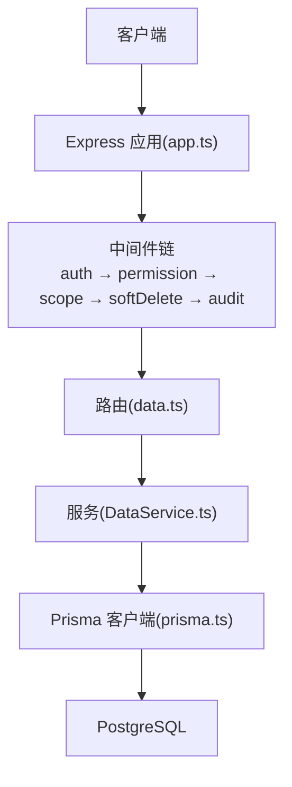
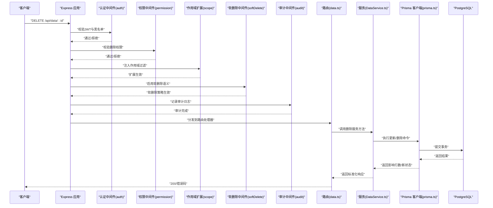
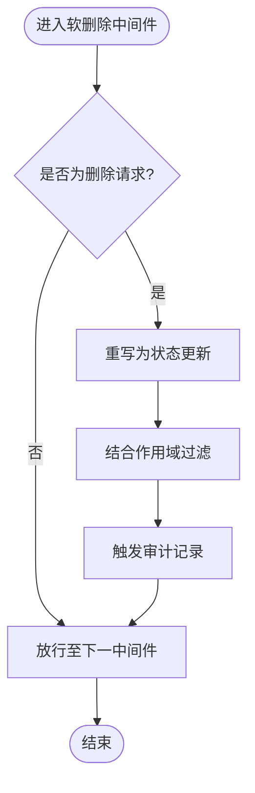
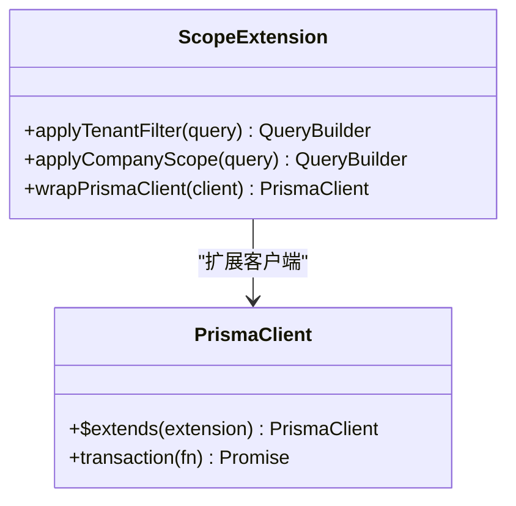
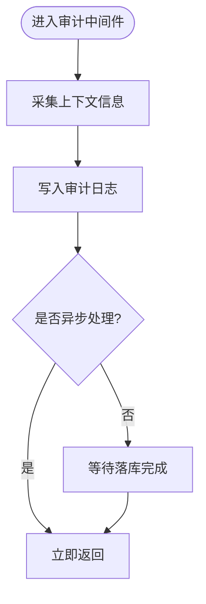
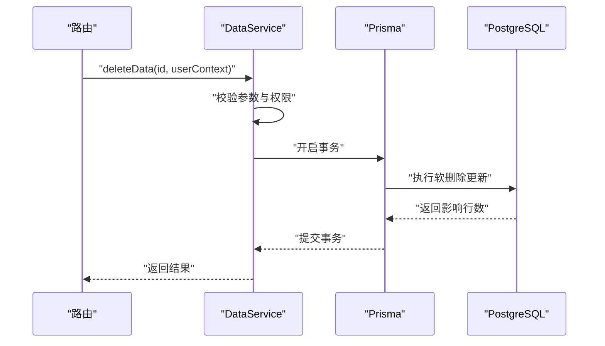
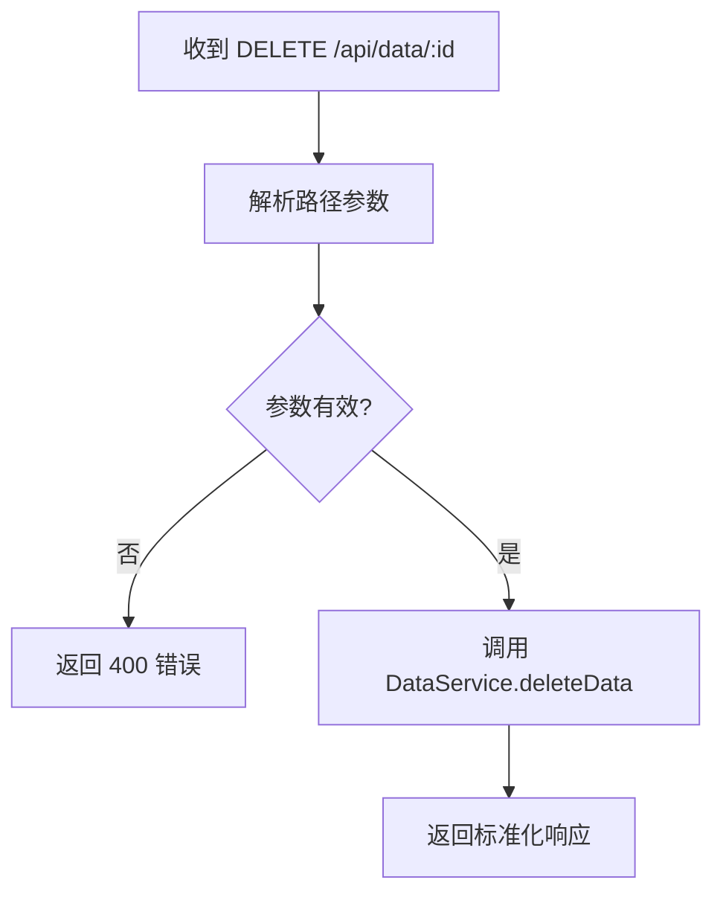
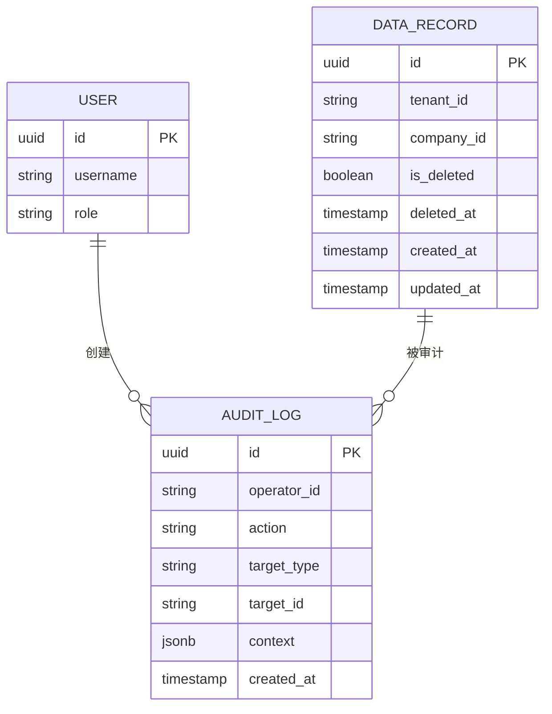
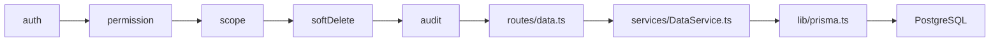

# 数据删除规则

<cite>
**本文引用的文件**   
- [server/src/middleware/soft-delete.test.ts](file://server/src/middleware/soft-delete.test.ts)
- [server/src/middleware/scope.ts](file://server/src/middleware/scope.ts)
- [server/src/lib/prisma.ts](file://server/src/lib/prisma.ts)
- [server/prisma/schema.prisma](file://server/prisma/schema.prisma)
- [server/src/routes/data.ts](file://server/src/routes/data.ts)
- [server/src/services/DataService.ts](file://server/src/services/DataService.ts)
- [server/src/app.ts](file://server/src/app.ts)
</cite>

## 目录
1. [简介](#简介)
2. [项目结构](#项目结构)
3. [核心组件](#核心组件)
4. [架构总览](#架构总览)
5. [详细组件分析](#详细组件分析)
6. [依赖关系分析](#依赖关系分析)
7. [性能考量](#性能考量)
8. [故障排查指南](#故障排查指南)
9. [结论](#结论)
10. [附录](#附录)

## 简介
本文件聚焦于“数据删除规则”的设计与实现，围绕软删除、权限控制、作用域隔离与审计追踪等关键机制，给出端到端的流程说明、约束条件与最佳实践。系统采用 Express + Prisma + PostgreSQL 技术栈，中间件执行链顺序为：helmet → cors → express.json → rate-limit → auth(JWT+黑名单) → permission(默认拒绝) → scope(Prisma extension) → softDelete → audit → Service → Prisma → PostgreSQL。删除操作需遵循最小权限原则与作用域隔离，确保数据可恢复性与一致性。

## 项目结构
与删除相关的关键位置包括：
- 中间件层：软删除中间件、作用域扩展、审计记录
- 服务层：业务逻辑封装（含删除入口）
- 路由层：对外暴露的删除接口
- 数据层：Prisma Schema 定义与数据库迁移
- 应用装配：中间件注册顺序与全局配置

**图示来源** 
- [server/src/app.ts](file://server/src/app.ts)
- [server/src/routes/data.ts](file://server/src/routes/data.ts)
- [server/src/services/DataService.ts](file://server/src/services/DataService.ts)
- [server/src/lib/prisma.ts](file://server/src/lib/prisma.ts)

**章节来源**
- [server/src/app.ts](file://server/src/app.ts)
- [server/src/routes/data.ts](file://server/src/routes/data.ts)
- [server/src/services/DataService.ts](file://server/src/services/DataService.ts)
- [server/src/lib/prisma.ts](file://server/src/lib/prisma.ts)

## 核心组件
- 软删除中间件：在请求进入 Service 前注入软删除语义，确保删除不物理移除，而是标记状态并保留历史。
- 作用域扩展（scope）：基于 Prisma Extension 对查询与写入施加组织/公司维度过滤，防止越权访问。
- 审计中间件：记录删除操作的主体、时间、对象标识与上下文，便于追溯与合规。
- 服务层删除方法：统一封装删除参数校验、权限检查、作用域绑定与事务边界。
- 路由层删除端点：接收请求、解析参数、调用服务层并返回标准化响应。

**章节来源**
- [server/src/middleware/soft-delete.test.ts](file://server/src/middleware/soft-delete.test.ts)
- [server/src/middleware/scope.ts](file://server/src/middleware/scope.ts)
- [server/src/lib/prisma.ts](file://server/src/lib/prisma.ts)
- [server/src/routes/data.ts](file://server/src/routes/data.ts)
- [server/src/services/DataService.ts](file://server/src/services/DataService.ts)

## 架构总览
下图展示一次删除请求从客户端到数据库的完整链路，以及各层职责与约束。

**图示来源** 
- [server/src/app.ts](file://server/src/app.ts)
- [server/src/routes/data.ts](file://server/src/routes/data.ts)
- [server/src/services/DataService.ts](file://server/src/services/DataService.ts)
- [server/src/lib/prisma.ts](file://server/src/lib/prisma.ts)

## 详细组件分析

### 软删除中间件（softDelete）
- 职责：在请求进入 Service 前，将硬删除转换为软删除；确保被删除记录仍存在于库中但不可见或标记为已删除。
- 行为要点：
  - 拦截 DELETE 请求或显式删除 API
  - 将删除操作改写为状态字段更新（如 is_deleted=true, deleted_at=now()）
  - 保证后续查询受作用域扩展与软删除策略共同约束
- 测试覆盖：通过单元测试验证软删除语义与查询可见性

**图示来源** 
- [server/src/middleware/soft-delete.test.ts](file://server/src/middleware/soft-delete.test.ts)

**章节来源**
- [server/src/middleware/soft-delete.test.ts](file://server/src/middleware/soft-delete.test.ts)

### 作用域扩展（scope）
- 职责：基于 Prisma Extension 动态注入组织/公司维度过滤条件，确保用户只能操作其作用域内的数据。
- 行为要点：
  - 在查询与写入时自动附加 where 条件
  - 与软删除策略协同，避免跨组织越权删除
  - 支持多租户场景下的数据隔离
- 集成点：在中间件链中位于权限之后、软删除之前

**图示来源** 
- [server/src/middleware/scope.ts](file://server/src/middleware/scope.ts)
- [server/src/lib/prisma.ts](file://server/src/lib/prisma.ts)

**章节来源**
- [server/src/middleware/scope.ts](file://server/src/middleware/scope.ts)
- [server/src/lib/prisma.ts](file://server/src/lib/prisma.ts)

### 审计中间件（audit）
- 职责：记录删除操作的主体、时间、对象标识、上下文信息，满足合规与可追溯要求。
- 行为要点：
  - 捕获请求上下文（用户ID、IP、UA、租户ID等）
  - 记录操作类型（删除）、目标实体与主键、影响范围
  - 异步落库，避免阻塞主流程

**图示来源** 
- [server/src/app.ts](file://server/src/app.ts)

**章节来源**
- [server/src/app.ts](file://server/src/app.ts)

### 服务层删除方法（DataService）
- 职责：封装删除的业务逻辑，包括参数校验、权限复核、作用域绑定、事务边界与错误处理。
- 行为要点：
  - 校验 ID 存在性与有效性
  - 再次确认当前用户具备删除权限
  - 使用 Prisma 事务确保一致性
  - 返回标准化结果（成功/失败原因）

**图示来源** 
- [server/src/services/DataService.ts](file://server/src/services/DataService.ts)
- [server/src/lib/prisma.ts](file://server/src/lib/prisma.ts)

**章节来源**
- [server/src/services/DataService.ts](file://server/src/services/DataService.ts)

### 路由层删除端点（data.ts）
- 职责：暴露删除 API，解析路径参数与查询参数，调用服务层并返回统一响应格式。
- 行为要点：
  - 限制 HTTP 方法为 DELETE
  - 校验路径参数格式
  - 调用 DataService.deleteData
  - 根据结果返回 200/4xx/5xx

**图示来源** 
- [server/src/routes/data.ts](file://server/src/routes/data.ts)

**章节来源**
- [server/src/routes/data.ts](file://server/src/routes/data.ts)

### 数据模型与迁移（schema.prisma）
- 职责：定义实体字段、索引、关联与软删除字段（如 is_deleted、deleted_at）。
- 行为要点：
  - 所有可删除实体应包含软删除字段
  - 为常用过滤字段建立索引以提升查询性能
  - 通过迁移脚本管理 schema 演进

**图示来源** 
- [server/prisma/schema.prisma](file://server/prisma/schema.prisma)

**章节来源**
- [server/prisma/schema.prisma](file://server/prisma/schema.prisma)

## 依赖关系分析
- 中间件依赖顺序严格：auth → permission → scope → softDelete → audit
- 作用域扩展依赖 Prisma 客户端扩展能力
- 服务层依赖 Prisma 事务与数据库一致性
- 路由层依赖服务层与统一响应格式

**图示来源** 
- [server/src/app.ts](file://server/src/app.ts)
- [server/src/routes/data.ts](file://server/src/routes/data.ts)
- [server/src/services/DataService.ts](file://server/src/services/DataService.ts)
- [server/src/lib/prisma.ts](file://server/src/lib/prisma.ts)

**章节来源**
- [server/src/app.ts](file://server/src/app.ts)
- [server/src/routes/data.ts](file://server/src/routes/data.ts)
- [server/src/services/DataService.ts](file://server/src/services/DataService.ts)
- [server/src/lib/prisma.ts](file://server/src/lib/prisma.ts)

## 性能考量
- 软删除避免物理删除带来的级联开销，适合高频删除场景
- 作用域过滤应在数据库层完成，减少不必要的数据传输
- 审计日志建议异步写入，避免阻塞主流程
- 为 is_deleted、tenant_id、company_id 等常用过滤字段建立索引
- 使用 Prisma 事务批量操作，降低往返次数

[本节为通用指导，无需特定文件引用]

## 故障排查指南
- 现象：删除后数据仍可见
  - 检查软删除中间件是否正确注入
  - 确认查询是否应用了 is_deleted=false 过滤
  - 核查作用域扩展是否生效
- 现象：权限不足导致删除失败
  - 检查 permission 中间件的授权策略
  - 确认用户角色与资源映射
- 现象：审计日志缺失
  - 检查审计中间件是否注册
  - 确认异步写入是否成功
- 现象：跨组织越权删除
  - 核查作用域扩展的 where 条件
  - 确认租户/公司 ID 传递正确

**章节来源**
- [server/src/middleware/soft-delete.test.ts](file://server/src/middleware/soft-delete.test.ts)
- [server/src/middleware/scope.ts](file://server/src/middleware/scope.ts)
- [server/src/app.ts](file://server/src/app.ts)

## 结论
数据删除规则在本系统中通过软删除、作用域隔离、权限控制与审计追踪形成闭环。中间件链确保删除操作安全、可控、可追溯；服务层提供一致的事务保障；数据模型与迁移支撑长期演进。遵循本文规范可有效避免数据丢失、越权访问与合规风险。

[本节为总结性内容，无需特定文件引用]

## 附录
- 最佳实践
  - 所有可删除实体必须包含 is_deleted 与 deleted_at 字段
  - 删除接口强制经过权限与作用域校验
  - 审计日志至少包含操作者、时间、目标与上下文
  - 定期归档已删除数据以满足合规要求
- 常见错误
  - 忘记在查询中添加 is_deleted 过滤
  - 作用域扩展未正确注入
  - 审计日志同步写入导致超时

[本节为补充信息，无需特定文件引用]