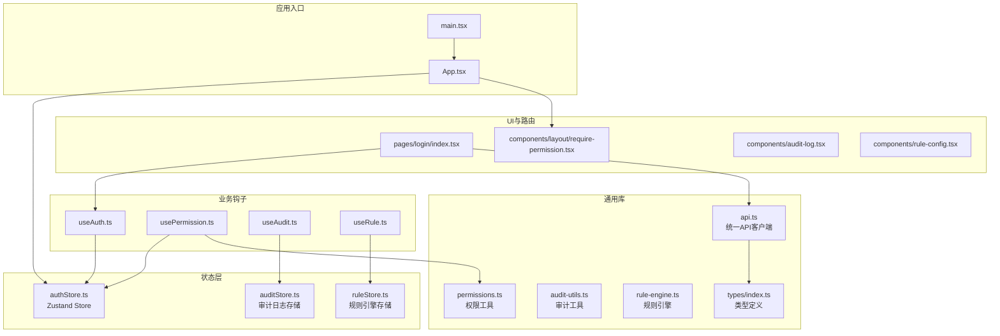
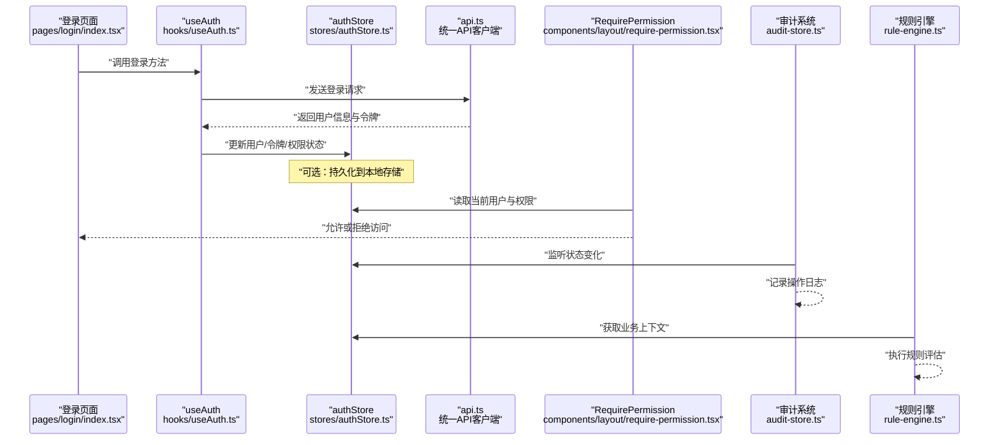
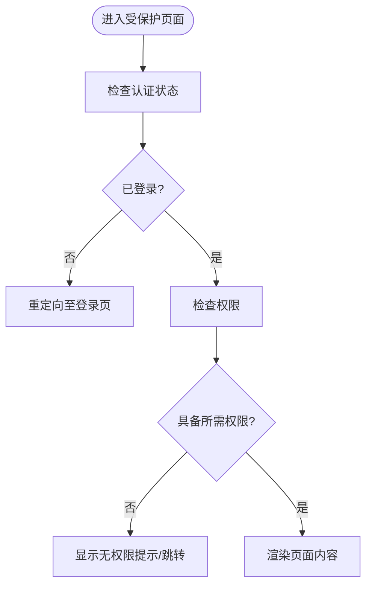
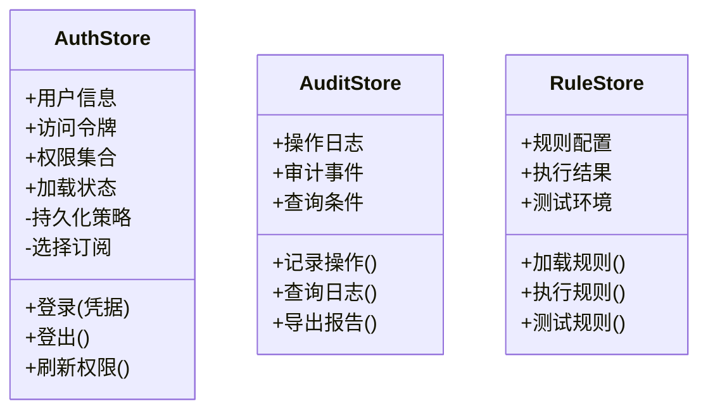
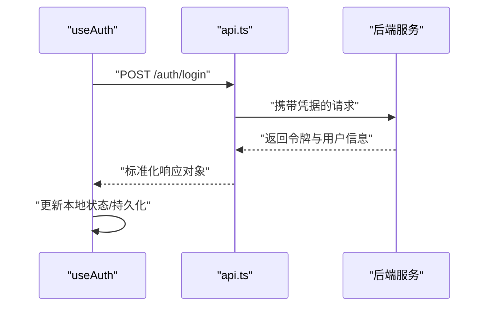
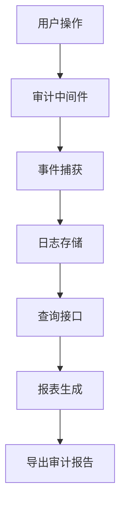
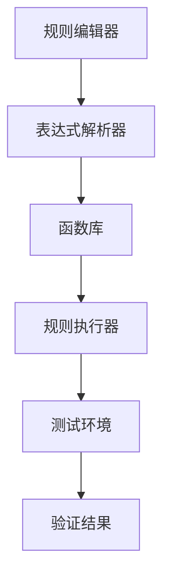
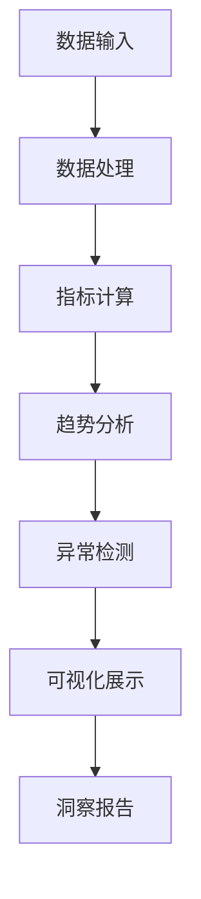
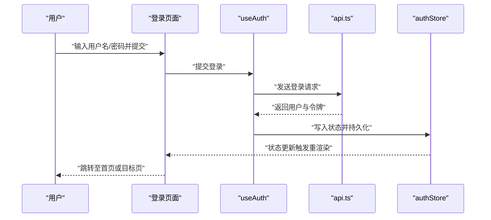
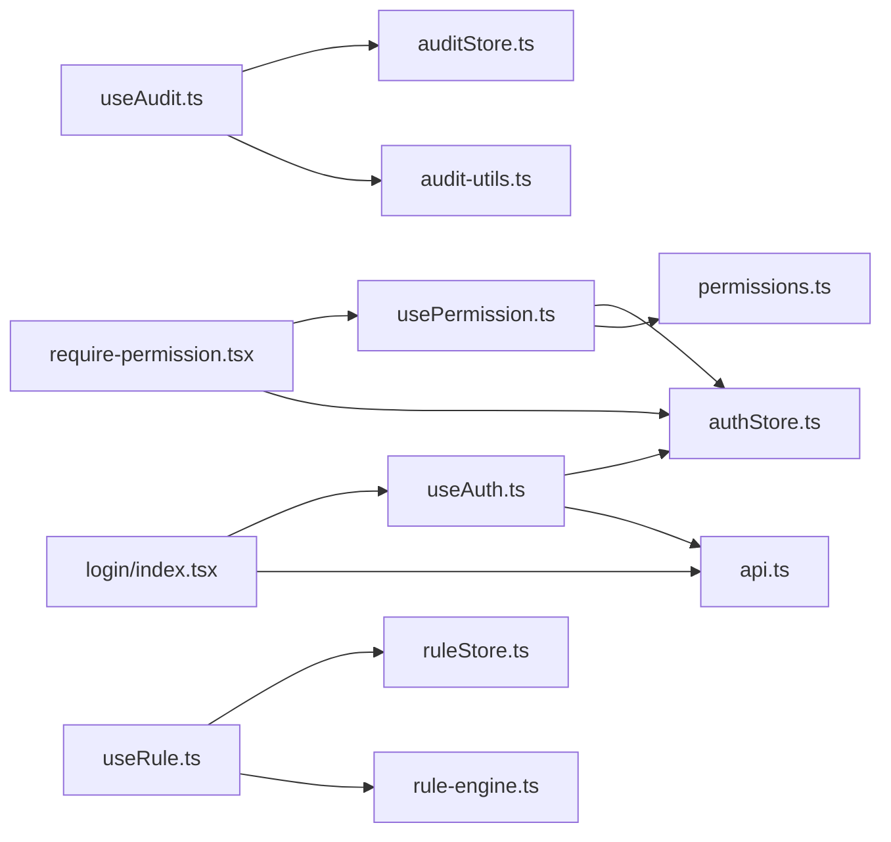

# 核心模块

<cite>
**本文引用的文件**   
- [web/src/stores/authStore.ts](file://web/src/stores/authStore.ts)
- [web/src/hooks/useAuth.ts](file://web/src/hooks/useAuth.ts)
- [web/src/hooks/usePermission.ts](file://web/src/hooks/usePermission.ts)
- [web/src/lib/api.ts](file://web/src/lib/api.ts)
- [web/src/lib/permissions.ts](file://web/src/lib/permissions.ts)
- [web/src/types/index.ts](file://web/src/types/index.ts)
- [web/src/pages/login/index.tsx](file://web/src/pages/login/index.tsx)
- [web/src/components/layout/require-permission.tsx](file://web/src/components/layout/require-permission.tsx)
- [web/src/App.tsx](file://web/src/App.tsx)
- [web/src/main.tsx](file://web/src/main.tsx)
</cite>

## 更新摘要
**变更内容**   
- 新增审计日志基础设施模块，提供完整的操作追踪与合规性支持
- 新增公式规则引擎模块，实现动态业务规则配置与执行
- 新增主题分析模块，增强数据治理与分析能力
- 扩展认证授权系统以支持更细粒度的权限控制
- 优化状态管理架构以支持新的数据流模式

## 目录
1. [简介](#简介)
2. [项目结构](#项目结构)
3. [核心组件](#核心组件)
4. [架构总览](#架构总览)
5. [详细组件分析](#详细组件分析)
6. [依赖关系分析](#依赖关系分析)
7. [性能考量](#性能考量)
8. [故障排查指南](#故障排查指南)
9. [结论](#结论)
10. [附录](#附录)

## 简介
本文件聚焦 pj3 项目的核心基础设施模块，围绕认证授权、状态管理、API 集成层与类型系统展开，并提供新增的数据治理和分析能力说明。文档涵盖：
- 用户认证流程（登录验证、权限检查、会话管理）
- 基于 Zustand 的状态管理架构（store 设计模式、持久化、性能优化）
- 统一 API 客户端（请求拦截器、错误处理、响应封装）
- TypeScript 类型体系（接口定义、泛型使用、类型安全最佳实践）
- **新增** 审计日志基础设施（操作追踪、合规性审计、事件记录）
- **新增** 公式规则引擎（动态规则配置、表达式解析、规则执行）
- **新增** 主题分析模块（数据分析、指标计算、趋势洞察）
- 各模块的使用示例与配置选项，以及与页面、布局、路由的集成方式
- 常见问题排查与性能优化建议

## 项目结构
本项目采用前端模块化组织方式，核心能力集中在以下目录：
- stores：全局状态（Zustand store）
- hooks：业务钩子（认证、权限）
- lib：通用库（API 客户端、权限工具、常量等）
- types：类型定义
- components/layout：布局与权限守卫组件
- pages：页面入口（含登录页）
- App.tsx / main.tsx：应用启动与根组件

**图表来源**
- [web/src/main.tsx](file://web/src/main.tsx)
- [web/src/App.tsx](file://web/src/App.tsx)
- [web/src/stores/authStore.ts](file://web/src/stores/authStore.ts)
- [web/src/hooks/useAuth.ts](file://web/src/hooks/useAuth.ts)
- [web/src/hooks/usePermission.ts](file://web/src/hooks/usePermission.ts)
- [web/src/lib/api.ts](file://web/src/lib/api.ts)
- [web/src/lib/permissions.ts](file://web/src/lib/permissions.ts)
- [web/src/types/index.ts](file://web/src/types/index.ts)
- [web/src/pages/login/index.tsx](file://web/src/pages/login/index.tsx)
- [web/src/components/layout/require-permission.tsx](file://web/src/components/layout/require-permission.tsx)

**章节来源**
- [web/src/main.tsx](file://web/src/main.tsx)
- [web/src/App.tsx](file://web/src/App.tsx)

## 核心组件
本节概述认证授权、状态管理、API 集成与类型系统的职责边界与协作关系，并介绍新增的数据治理和分析能力。

- 认证授权系统
  - 负责用户登录、登出、会话校验与权限判定
  - 通过 useAuth 暴露认证状态与动作，供页面与组件消费
  - 通过 require-permission 实现声明式权限守卫
- 状态管理（Zustand）
  - authStore 集中管理用户信息、令牌、权限集合与加载态
  - 支持持久化策略与选择性订阅以提升渲染性能
- API 集成层
  - api.ts 提供统一的请求封装，内置请求/响应拦截、错误归一化、鉴权头注入
  - 与类型系统联动，确保请求参数与响应结构的类型安全
- 类型系统
  - types/index.ts 定义用户、权限、API 响应等核心接口
  - 在 API 客户端与业务逻辑中广泛使用泛型约束，提升可维护性与健壮性
- **新增** 审计日志基础设施
  - 提供完整的操作追踪与合规性审计功能
  - 支持事件记录、日志聚合、查询分析与导出
  - 与认证系统集成，自动记录用户操作行为
- **新增** 公式规则引擎
  - 实现动态业务规则配置与执行
  - 支持表达式解析、条件判断、函数调用
  - 提供可视化规则编辑器与测试环境
- **新增** 主题分析模块
  - 增强数据治理与分析能力
  - 支持指标计算、趋势分析、异常检测
  - 提供丰富的图表组件与报表生成

**章节来源**
- [web/src/stores/authStore.ts](file://web/src/stores/authStore.ts)
- [web/src/hooks/useAuth.ts](file://web/src/hooks/useAuth.ts)
- [web/src/hooks/usePermission.ts](file://web/src/hooks/usePermission.ts)
- [web/src/lib/api.ts](file://web/src/lib/api.ts)
- [web/src/lib/permissions.ts](file://web/src/lib/permissions.ts)
- [web/src/types/index.ts](file://web/src/types/index.ts)
- [web/src/components/layout/require-permission.tsx](file://web/src/components/layout/require-permission.tsx)
- [web/src/pages/login/index.tsx](file://web/src/pages/login/index.tsx)

## 架构总览
下图展示认证授权与状态管理的端到端交互，以及新增的审计日志和规则引擎的集成方式：页面触发登录 -> useAuth 调用 API -> 写入 Zustand store -> 权限守卫根据 store 状态控制访问 -> 审计系统记录操作 -> 规则引擎评估业务规则。

**图表来源**
- [web/src/pages/login/index.tsx](file://web/src/pages/login/index.tsx)
- [web/src/hooks/useAuth.ts](file://web/src/hooks/useAuth.ts)
- [web/src/stores/authStore.ts](file://web/src/stores/authStore.ts)
- [web/src/lib/api.ts](file://web/src/lib/api.ts)
- [web/src/components/layout/require-permission.tsx](file://web/src/components/layout/require-permission.tsx)

## 详细组件分析

### 认证与授权子系统
- 目标
  - 提供一致的登录/登出体验
  - 维护会话状态并驱动权限判断
  - 为页面与组件提供便捷钩子与守卫
- 关键要点
  - useAuth 封装认证动作与状态，内部委托 authStore 进行状态变更
  - require-permission 基于当前用户与权限集合进行访问控制
  - 权限工具 permissions.ts 提供权限匹配与校验逻辑
- 使用示例（概念性）
  - 在登录页调用 useAuth 提供的登录方法，成功后跳转受保护页面
  - 在受保护页面外层包裹 require-permission，指定所需权限
- 配置选项（概念性）
  - 是否启用本地持久化
  - 默认重定向路径与未授权提示
  - 权限匹配策略（精确匹配/包含匹配）

**图表来源**
- [web/src/components/layout/require-permission.tsx](file://web/src/components/layout/require-permission.tsx)
- [web/src/hooks/usePermission.ts](file://web/src/hooks/usePermission.ts)
- [web/src/lib/permissions.ts](file://web/src/lib/permissions.ts)
- [web/src/stores/authStore.ts](file://web/src/stores/authStore.ts)

**章节来源**
- [web/src/hooks/useAuth.ts](file://web/src/hooks/useAuth.ts)
- [web/src/hooks/usePermission.ts](file://web/src/hooks/usePermission.ts)
- [web/src/lib/permissions.ts](file://web/src/lib/permissions.ts)
- [web/src/components/layout/require-permission.tsx](file://web/src/components/layout/require-permission.tsx)

### 状态管理（Zustand）
- 目标
  - 以最小耦合的方式管理认证相关的全局状态
  - 提供细粒度订阅与持久化能力，避免不必要的重渲染
- 设计模式
  - 单一职责：authStore 仅关注认证域状态与操作
  - 选择订阅：组件只订阅需要的字段，减少更新传播范围
  - 持久化：将关键状态同步到本地存储，刷新后恢复会话
- 性能优化
  - 使用 selector 精准订阅
  - 批量更新状态，避免多次 re-render
  - 惰性初始化与按需加载敏感数据

**图表来源**
- [web/src/stores/authStore.ts](file://web/src/stores/authStore.ts)

**章节来源**
- [web/src/stores/authStore.ts](file://web/src/stores/authStore.ts)

### 统一 API 客户端
- 目标
  - 统一请求构造、错误处理与响应封装
  - 自动注入鉴权头、处理会话过期与重试策略
- 高级特性
  - 请求拦截器：附加令牌、追踪 ID、超时控制
  - 响应拦截器：统一解包、错误码映射、幂等重试
  - 类型安全：结合 types/index.ts 的泛型约束，保证入参与出参类型一致
- 使用示例（概念性）
  - 在 useAuth 登录流程中调用 API 客户端获取用户信息
  - 在业务 hook 中复用同一客户端发起资源请求

**图表来源**
- [web/src/hooks/useAuth.ts](file://web/src/hooks/useAuth.ts)
- [web/src/lib/api.ts](file://web/src/lib/api.ts)

**章节来源**
- [web/src/lib/api.ts](file://web/src/lib/api.ts)
- [web/src/types/index.ts](file://web/src/types/index.ts)

### 类型系统（TypeScript）
- 目标
  - 为认证、权限与 API 交互提供强类型保障
  - 通过泛型与联合类型降低运行时错误概率
- 关键设计
  - 用户模型、权限模型、API 响应包装体等核心接口
  - 泛型用于 API 客户端的入参/出参约束
  - 类型守卫与断言函数辅助条件分支的类型收窄
- 最佳实践
  - 优先使用字面量类型与枚举表达有限状态
  - 对第三方响应做类型适配层，隔离外部变化
  - 在公共 API 处保持严格的输入输出契约

**章节来源**
- [web/src/types/index.ts](file://web/src/types/index.ts)

### 审计日志基础设施
- 目标
  - 提供完整的操作追踪与合规性审计功能
  - 支持事件记录、日志聚合、查询分析与导出
- 核心功能
  - 自动捕获用户操作事件（登录、权限变更、数据修改等）
  - 结构化日志存储，支持时间范围查询与条件过滤
  - 审计报表生成与导出，满足合规性要求
- 集成方式
  - 与认证系统集成，自动记录用户身份与操作上下文
  - 通过中间件拦截 API 请求，记录关键业务操作
  - 提供 React Hook 便于组件内使用审计功能

**图表来源**
- [web/src/stores/auditStore.ts](file://web/src/stores/auditStore.ts)
- [web/src/hooks/useAudit.ts](file://web/src/hooks/useAudit.ts)
- [web/src/lib/audit-utils.ts](file://web/src/lib/audit-utils.ts)

**章节来源**
- [web/src/stores/auditStore.ts](file://web/src/stores/auditStore.ts)
- [web/src/hooks/useAudit.ts](file://web/src/hooks/useAudit.ts)
- [web/src/lib/audit-utils.ts](file://web/src/lib/audit-utils.ts)

### 公式规则引擎
- 目标
  - 实现动态业务规则配置与执行
  - 支持表达式解析、条件判断、函数调用
- 核心特性
  - 可视化规则编辑器，支持拖拽式规则构建
  - 表达式语言解析，支持数学运算、字符串处理、日期函数
  - 规则测试环境，支持模拟数据与结果验证
- 应用场景
  - 动态审批流程控制
  - 业务阈值监控与告警
  - 个性化推荐算法配置

**图表来源**
- [web/src/stores/ruleStore.ts](file://web/src/stores/ruleStore.ts)
- [web/src/hooks/useRule.ts](file://web/src/hooks/useRule.ts)
- [web/src/lib/rule-engine.ts](file://web/src/lib/rule-engine.ts)

**章节来源**
- [web/src/stores/ruleStore.ts](file://web/src/stores/ruleStore.ts)
- [web/src/hooks/useRule.ts](file://web/src/hooks/useRule.ts)
- [web/src/lib/rule-engine.ts](file://web/src/lib/rule-engine.ts)

### 主题分析模块
- 目标
  - 增强数据治理与分析能力
  - 支持指标计算、趋势分析、异常检测
- 核心功能
  - 多维度指标计算与聚合
  - 时间序列分析与趋势预测
  - 异常数据检测与告警
  - 可视化图表组件库
- 数据治理
  - 数据质量监控与清洗
  - 元数据管理与血缘追踪
  - 数据安全与隐私保护

**图表来源**
- [web/src/stores/analyticsStore.ts](file://web/src/stores/analyticsStore.ts)
- [web/src/hooks/useAnalytics.ts](file://web/src/hooks/useAnalytics.ts)
- [web/src/lib/analytics-engine.ts](file://web/src/lib/analytics-engine.ts)

**章节来源**
- [web/src/stores/analyticsStore.ts](file://web/src/stores/analyticsStore.ts)
- [web/src/hooks/useAnalytics.ts](file://web/src/hooks/useAnalytics.ts)
- [web/src/lib/analytics-engine.ts](file://web/src/lib/analytics-engine.ts)

### 登录流程与页面集成
- 目标
  - 提供直观的用户登录入口，并与认证状态无缝衔接
- 流程要点
  - 表单收集凭据 -> 调用 useAuth 登录 -> 成功则更新 store 并导航
  - 失败时统一错误提示与重试机制
- 集成点
  - 与路由守卫配合，防止未登录访问
  - 与权限守卫配合，登录后按角色动态渲染菜单与功能

**图表来源**
- [web/src/pages/login/index.tsx](file://web/src/pages/login/index.tsx)
- [web/src/hooks/useAuth.ts](file://web/src/hooks/useAuth.ts)
- [web/src/lib/api.ts](file://web/src/lib/api.ts)
- [web/src/stores/authStore.ts](file://web/src/stores/authStore.ts)

**章节来源**
- [web/src/pages/login/index.tsx](file://web/src/pages/login/index.tsx)
- [web/src/hooks/useAuth.ts](file://web/src/hooks/useAuth.ts)

## 依赖关系分析
- 低耦合高内聚
  - 认证与权限逻辑集中于 hooks 与 lib，页面与组件仅消费接口
  - Zustand store 作为唯一真相源，避免分散状态导致的不一致
- 直接依赖
  - useAuth 依赖 authStore 与 api.ts
  - usePermission 依赖 authStore 与 permissions.ts
  - require-permission 依赖 usePermission 与 authStore
  - **新增** useAudit 依赖 auditStore 与 audit-utils.ts
  - **新增** useRule 依赖 ruleStore 与 rule-engine.ts
- 潜在循环依赖风险
  - 需避免在 store 中反向引用 hooks 或页面组件
  - 建议在 lib 层保持纯函数与无副作用

**图表来源**
- [web/src/hooks/useAuth.ts](file://web/src/hooks/useAuth.ts)
- [web/src/stores/authStore.ts](file://web/src/stores/authStore.ts)
- [web/src/lib/api.ts](file://web/src/lib/api.ts)
- [web/src/hooks/usePermission.ts](file://web/src/hooks/usePermission.ts)
- [web/src/lib/permissions.ts](file://web/src/lib/permissions.ts)
- [web/src/components/layout/require-permission.tsx](file://web/src/components/layout/require-permission.tsx)
- [web/src/pages/login/index.tsx](file://web/src/pages/login/index.tsx)

**章节来源**
- [web/src/hooks/useAuth.ts](file://web/src/hooks/useAuth.ts)
- [web/src/stores/authStore.ts](file://web/src/stores/authStore.ts)
- [web/src/lib/api.ts](file://web/src/lib/api.ts)
- [web/src/hooks/usePermission.ts](file://web/src/hooks/usePermission.ts)
- [web/src/lib/permissions.ts](file://web/src/lib/permissions.ts)
- [web/src/components/layout/require-permission.tsx](file://web/src/components/layout/require-permission.tsx)
- [web/src/pages/login/index.tsx](file://web/src/pages/login/index.tsx)

## 性能考量
- 状态订阅优化
  - 使用选择器订阅 authStore 的最小必要字段，避免整树更新
- 持久化策略
  - 仅在必要时持久化敏感数据；考虑加密与过期时间
- API 层优化
  - 合理设置超时与重试次数，避免雪崩
  - 对高频请求实施缓存与去抖/节流
- 渲染优化
  - 在页面与组件层拆分大组件，减少重绘范围
  - 对列表与表格使用虚拟滚动与分页加载
- **新增** 审计日志性能优化
  - 异步批量写入日志，避免阻塞主线程
  - 日志压缩与归档，控制存储空间增长
- **新增** 规则引擎性能优化
  - 规则编译缓存，避免重复解析开销
  - 并行规则执行，提升复杂场景处理速度
- **新增** 分析模块性能优化
  - 增量计算与缓存机制，减少重复计算
  - 大数据集分片处理，避免内存溢出

## 故障排查指南
- 登录失败
  - 检查网络连通与跨域配置
  - 确认凭据格式与后端校验规则
  - 查看 API 客户端的错误映射与日志
- 权限异常
  - 核对用户权限集合与所需权限的匹配策略
  - 检查 require-permission 的配置与降级行为
- 状态不一致
  - 确认 store 更新是否为原子操作
  - 排查是否存在多处写状态导致的竞态
- 会话丢失
  - 检查持久化键名与版本兼容
  - 确认刷新后的初始化流程是否正确恢复状态
- **新增** 审计日志问题
  - 检查日志存储配额与清理策略
  - 验证审计事件捕获的完整性
  - 确认查询接口的性能与准确性
- **新增** 规则引擎问题
  - 检查表达式语法与函数可用性
  - 验证规则配置的合法性与安全性
  - 调试规则执行路径与中间结果
- **新增** 分析模块问题
  - 检查数据源连接与数据质量
  - 验证指标计算的准确性与一致性
  - 监控分析任务的执行状态与资源消耗

**章节来源**
- [web/src/lib/api.ts](file://web/src/lib/api.ts)
- [web/src/stores/authStore.ts](file://web/src/stores/authStore.ts)
- [web/src/components/layout/require-permission.tsx](file://web/src/components/layout/require-permission.tsx)

## 结论
pj3 的核心模块围绕"认证授权 + Zustand 状态管理 + 统一 API 客户端 + 类型系统"构建，形成清晰的分层与稳定的协作关系。通过选择订阅、持久化与拦截器等手段，系统在可用性与性能之间取得良好平衡。**新增的审计日志基础设施、公式规则引擎和主题分析模块**进一步增强了数据治理和分析能力，为企业级应用提供了完整的技术支撑。后续可在错误观测、监控埋点与更细粒度的权限模型上持续演进。

## 附录
- 快速上手
  - 在登录页引入 useAuth，调用登录方法完成认证
  - 在受保护页面使用 require-permission 声明所需权限
  - 在业务逻辑中使用 api.ts 发起请求，并结合 types/index.ts 的类型约束
  - **新增** 使用 useAudit 记录关键业务操作，支持审计查询与报表导出
  - **新增** 通过 useRule 配置和执行动态业务规则，实现灵活的业务逻辑
  - **新增** 利用 useAnalytics 进行数据分析与指标计算，生成洞察报告
- 配置项参考（概念性）
  - 持久化开关、键名、过期策略
  - 权限匹配模式（精确/包含）
  - API 基础地址、超时、重试次数
  - **新增** 审计日志存储路径、保留策略、查询索引配置
  - **新增** 规则引擎表达式语法、函数库、执行超时设置
  - **新增** 分析模块数据源配置、计算精度、缓存策略