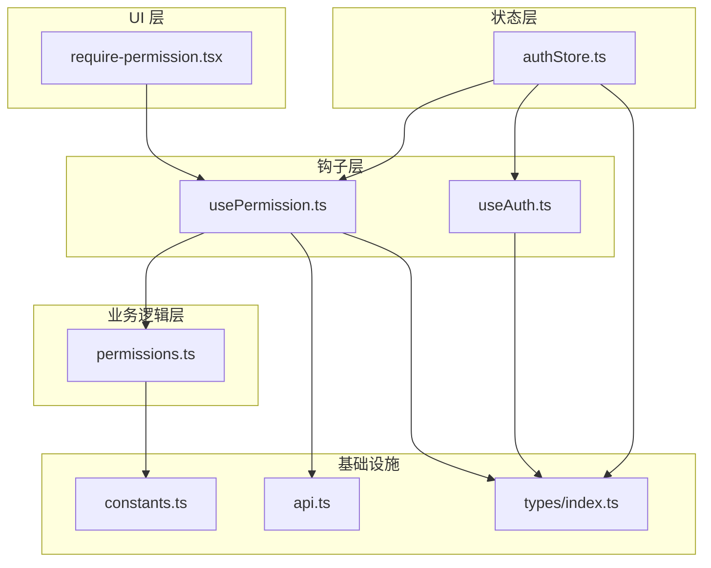
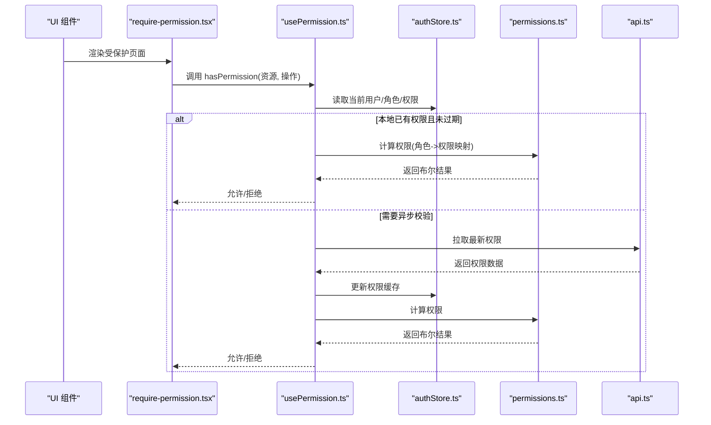
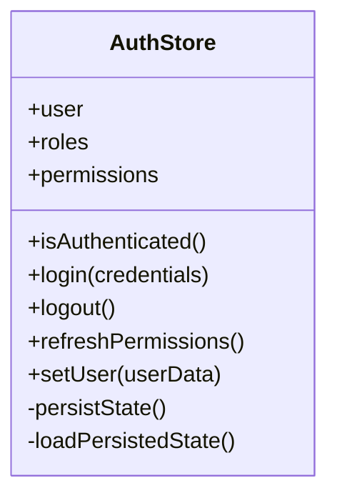
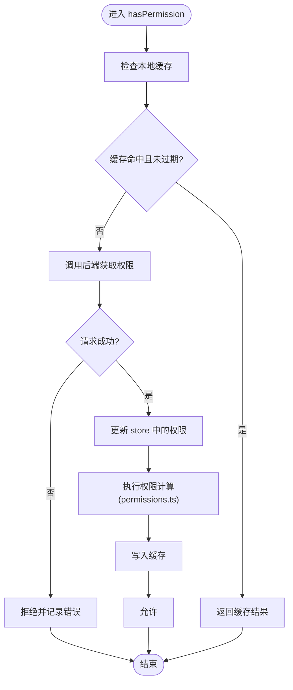
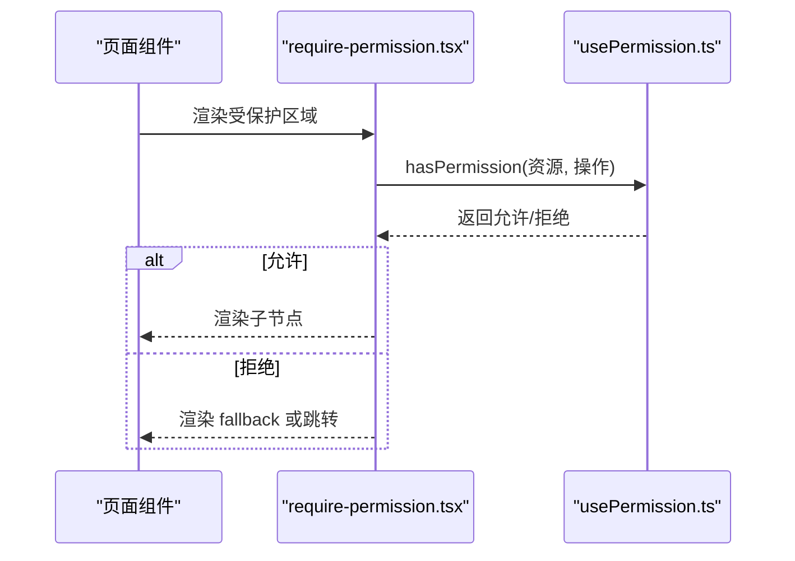
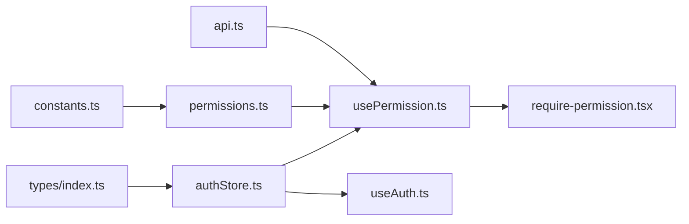

# 状态管理系统

<cite>
**本文引用的文件**   
- [authStore.ts](file://web/src/stores/authStore.ts)
- [usePermission.ts](file://web/src/hooks/usePermission.ts)
- [permissions.ts](file://web/src/lib/permissions.ts)
- [require-permission.tsx](file://web/src/components/layout/require-permission.tsx)
- [useAuth.ts](file://web/src/hooks/useAuth.ts)
- [api.ts](file://web/src/lib/api.ts)
- [constants.ts](file://web/src/lib/constants.ts)
- [index.ts](file://web/src/types/index.ts)
</cite>

## 目录
1. [简介](#简介)
2. [项目结构](#项目结构)
3. [核心组件](#核心组件)
4. [架构总览](#架构总览)
5. [详细组件分析](#详细组件分析)
6. [依赖关系分析](#依赖关系分析)
7. [性能考虑](#性能考虑)
8. [故障排查指南](#故障排查指南)
9. [结论](#结论)
10. [附录](#附录)

## 简介
本文件面向前端状态管理与权限系统，聚焦基于 Zustand 的状态管理架构与 RBAC 权限模型。文档覆盖：
- Store 创建模式、订阅机制与性能优化策略
- authStore 的实现细节：用户认证状态、角色与权限存储、持久化方案
- usePermission Hook 的设计模式：权限检查逻辑、缓存机制、异步验证
- 权限系统的核心算法：RBAC 模型、继承规则、动态计算
- 最佳实践：状态结构设计、更新策略、调试技巧
- 复杂场景：状态同步、冲突解决、批量更新

## 项目结构
本项目采用“按功能域组织”的目录结构，状态与权限相关代码集中在以下位置：
- stores/authStore.ts：Zustand store，负责认证与权限状态
- hooks/usePermission.ts：权限判断 Hook，封装常用权限检查
- lib/permissions.ts：权限计算与校验工具
- components/layout/require-permission.tsx：页面级权限守卫组件
- hooks/useAuth.ts：便捷访问认证状态的 Hook
- lib/api.ts：网络请求封装（用于异步权限加载）
- lib/constants.ts：常量定义（如默认角色、权限标识等）
- types/index.ts：类型定义（用户、角色、权限等）

图表来源
- [authStore.ts](file://web/src/stores/authStore.ts)
- [usePermission.ts](file://web/src/hooks/usePermission.ts)
- [permissions.ts](file://web/src/lib/permissions.ts)
- [require-permission.tsx](file://web/src/components/layout/require-permission.tsx)
- [useAuth.ts](file://web/src/hooks/useAuth.ts)
- [api.ts](file://web/src/lib/api.ts)
- [constants.ts](file://web/src/lib/constants.ts)
- [index.ts](file://web/src/types/index.ts)

章节来源
- [authStore.ts](file://web/src/stores/authStore.ts)
- [usePermission.ts](file://web/src/hooks/usePermission.ts)
- [permissions.ts](file://web/src/lib/permissions.ts)
- [require-permission.tsx](file://web/src/components/layout/require-permission.tsx)
- [useAuth.ts](file://web/src/hooks/useAuth.ts)
- [api.ts](file://web/src/lib/api.ts)
- [constants.ts](file://web/src/lib/constants.ts)
- [index.ts](file://web/src/types/index.ts)

## 核心组件
- authStore：基于 Zustand 的单一认证与权限状态源，提供登录、登出、刷新权限、设置用户信息等方法；支持可选持久化（如 localStorage）。
- usePermission：封装权限判断逻辑，支持直接资源权限、角色集合、以及异步权限校验；内部可缓存结果以减少重复计算。
- permissions：权限计算与校验工具，实现 RBAC 的核心算法（角色到权限映射、继承与合并、动态条件判断）。
- require-permission：页面级权限守卫，根据权限配置渲染或拦截路由/内容。
- useAuth：便捷 Hook，暴露当前用户、角色、是否已认证等常用状态与方法。
- api：统一网络请求封装，供权限初始化或刷新时调用后端接口。
- constants：集中定义默认角色、权限标识、过期时间等常量。
- types：统一的类型定义，确保状态与 API 交互的类型安全。

章节来源
- [authStore.ts](file://web/src/stores/authStore.ts)
- [usePermission.ts](file://web/src/hooks/usePermission.ts)
- [permissions.ts](file://web/src/lib/permissions.ts)
- [require-permission.tsx](file://web/src/components/layout/require-permission.tsx)
- [useAuth.ts](file://web/src/hooks/useAuth.ts)
- [api.ts](file://web/src/lib/api.ts)
- [constants.ts](file://web/src/lib/constants.ts)
- [index.ts](file://web/src/types/index.ts)

## 架构总览
整体架构围绕 Zustand store 作为唯一可信状态源，Hook 层消费状态并封装业务逻辑，UI 层通过组件或路由守卫进行权限控制。

图表来源
- [require-permission.tsx](file://web/src/components/layout/require-permission.tsx)
- [usePermission.ts](file://web/src/hooks/usePermission.ts)
- [authStore.ts](file://web/src/stores/authStore.ts)
- [permissions.ts](file://web/src/lib/permissions.ts)
- [api.ts](file://web/src/lib/api.ts)

## 详细组件分析

### authStore 分析
职责与能力
- 用户认证状态：登录态、用户基本信息、角色列表、权限集合
- 权限管理：加载、刷新、合并、缓存
- 持久化：将关键状态持久化到本地存储，提升首屏体验与容错性
- 方法：login、logout、refreshPermissions、setUser、clearCache 等

设计要点
- 使用 Zustand 的 subscribe 与 selector 精确订阅，避免不必要的重渲染
- 提供中间件或副作用处理以支持持久化与自动刷新
- 对敏感字段做最小暴露原则，仅导出必要方法与状态片段

图表来源
- [authStore.ts](file://web/src/stores/authStore.ts)
- [index.ts](file://web/src/types/index.ts)

章节来源
- [authStore.ts](file://web/src/stores/authStore.ts)
- [index.ts](file://web/src/types/index.ts)

### usePermission Hook 分析
职责与能力
- 提供 hasPermission(resource, action)、hasRole(role)、hasAnyRoles(roles) 等便捷方法
- 支持同步与异步权限校验，优先使用本地缓存，必要时触发后端校验
- 内部缓存权限结果，减少重复计算与网络请求

设计要点
- 缓存策略：基于资源+操作的键值缓存，带过期时间与失效策略
- 异步流程：先查缓存→命中则直接返回→未命中则调用 API→更新 store→重新计算
- 错误处理：网络失败降级为保守策略（拒绝），并提供重试与提示

图表来源
- [usePermission.ts](file://web/src/hooks/usePermission.ts)
- [permissions.ts](file://web/src/lib/permissions.ts)
- [api.ts](file://web/src/lib/api.ts)
- [authStore.ts](file://web/src/stores/authStore.ts)

章节来源
- [usePermission.ts](file://web/src/hooks/usePermission.ts)
- [permissions.ts](file://web/src/lib/permissions.ts)
- [api.ts](file://web/src/lib/api.ts)
- [authStore.ts](file://web/src/stores/authStore.ts)

### require-permission 组件分析
职责与能力
- 在页面或区块级别进行权限守卫
- 支持多种声明式用法：直接传入权限标识、角色数组、或自定义判断函数
- 当无权限时，可选择隐藏、跳转或展示占位内容

设计要点
- 与 usePermission 集成，复用缓存与异步校验逻辑
- 提供 loading 与 fallback 插槽，改善用户体验
- 与路由守卫结合，实现更细粒度的访问控制

图表来源
- [require-permission.tsx](file://web/src/components/layout/require-permission.tsx)
- [usePermission.ts](file://web/src/hooks/usePermission.ts)

章节来源
- [require-permission.tsx](file://web/src/components/layout/require-permission.tsx)
- [usePermission.ts](file://web/src/hooks/usePermission.ts)

### useAuth Hook 分析
职责与能力
- 便捷访问认证状态：用户信息、角色、是否已认证
- 提供快捷方法：isInRole、canAccess 等
- 与 authStore 解耦，便于替换实现或扩展

设计要点
- 使用 Zustand 的 selector 精确订阅，避免全量重渲染
- 暴露只读状态与写操作方法，保持单向数据流

章节来源
- [useAuth.ts](file://web/src/hooks/useAuth.ts)
- [authStore.ts](file://web/src/stores/authStore.ts)
- [index.ts](file://web/src/types/index.ts)

### permissions 工具分析
职责与能力
- 实现 RBAC 核心算法：角色到权限的映射、继承与合并
- 支持动态权限：基于上下文变量与条件的表达式计算
- 提供校验器：资源、操作、角色的规范化与去重

设计要点
- 幂等性与一致性：相同输入产生相同输出
- 可扩展性：插件式扩展新的权限规则与校验器
- 性能优化：预计算与缓存高频路径

章节来源
- [permissions.ts](file://web/src/lib/permissions.ts)
- [constants.ts](file://web/src/lib/constants.ts)
- [index.ts](file://web/src/types/index.ts)

## 依赖关系分析
- authStore 依赖 types 定义与可选的持久化实现
- usePermission 依赖 authStore、permissions、api
- require-permission 依赖 usePermission
- useAuth 依赖 authStore 与 types
- permissions 依赖 constants 与 types

图表来源
- [authStore.ts](file://web/src/stores/authStore.ts)
- [usePermission.ts](file://web/src/hooks/usePermission.ts)
- [permissions.ts](file://web/src/lib/permissions.ts)
- [require-permission.tsx](file://web/src/components/layout/require-permission.tsx)
- [useAuth.ts](file://web/src/hooks/useAuth.ts)
- [api.ts](file://web/src/lib/api.ts)
- [constants.ts](file://web/src/lib/constants.ts)
- [index.ts](file://web/src/types/index.ts)

章节来源
- [authStore.ts](file://web/src/stores/authStore.ts)
- [usePermission.ts](file://web/src/hooks/usePermission.ts)
- [permissions.ts](file://web/src/lib/permissions.ts)
- [require-permission.tsx](file://web/src/components/layout/require-permission.tsx)
- [useAuth.ts](file://web/src/hooks/useAuth.ts)
- [api.ts](file://web/src/lib/api.ts)
- [constants.ts](file://web/src/lib/constants.ts)
- [index.ts](file://web/src/types/index.ts)

## 性能考虑
- 精准订阅：使用 Zustand 的 selector 与浅比较，避免整树重渲染
- 缓存策略：usePermission 对权限结果进行缓存，设置合理过期时间
- 批处理更新：批量变更状态时使用单次 update，减少多次 re-render
- 懒加载：仅在需要时发起权限校验，避免首屏阻塞
- 防抖与节流：对频繁触发的权限检查进行节流，降低计算压力
- 内存管理：及时清理无效缓存与监听器，防止泄漏

[本节为通用指导，不直接分析具体文件]

## 故障排查指南
常见问题与定位建议
- 权限不一致：检查缓存是否过期、store 是否被其他模块覆盖、后端权限是否变更
- 登录态丢失：确认持久化是否生效、浏览器存储是否被清理、跨域策略是否限制
- 异步权限失败：查看网络请求日志、错误码与降级策略、重试机制是否启用
- 性能问题：监控重渲染次数、缓存命中率、网络请求频率

章节来源
- [authStore.ts](file://web/src/stores/authStore.ts)
- [usePermission.ts](file://web/src/hooks/usePermission.ts)
- [api.ts](file://web/src/lib/api.ts)

## 结论
本状态管理系统以 Zustand 为核心，结合 usePermission 与 RBAC 权限模型，实现了清晰的分层与良好的扩展性。通过缓存、精准订阅与批处理更新等策略，系统在可用性与性能之间取得平衡。建议在后续迭代中持续完善错误处理、监控与测试覆盖，进一步提升稳定性与可维护性。

[本节为总结，不直接分析具体文件]

## 附录
- 最佳实践
  - 状态结构设计：扁平化、原子化、最小暴露
  - 更新策略：不可变更新、批处理、事件驱动
  - 调试技巧：打印状态快照、断点追踪、埋点统计
- 复杂场景处理
  - 状态同步：使用事件总线或 store 订阅保证多模块一致
  - 冲突解决：乐观更新与回滚、版本戳与合并策略
  - 批量更新：合并多个变更、延迟提交、事务式更新

[本节为概念性内容，不直接分析具体文件]