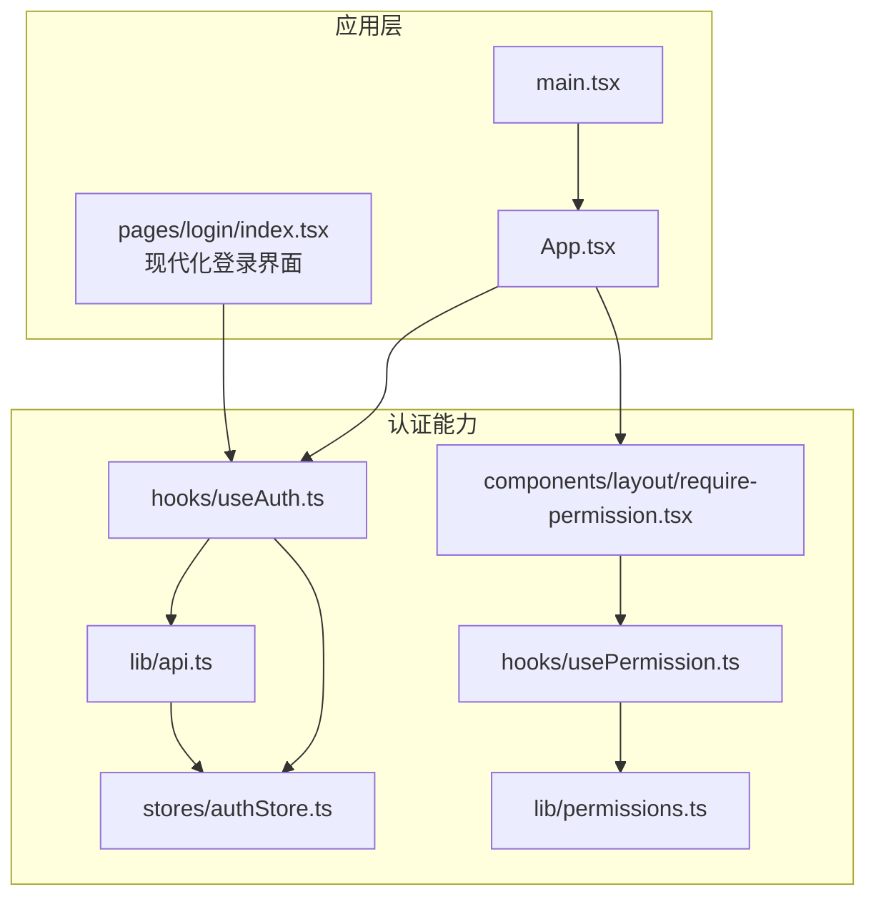
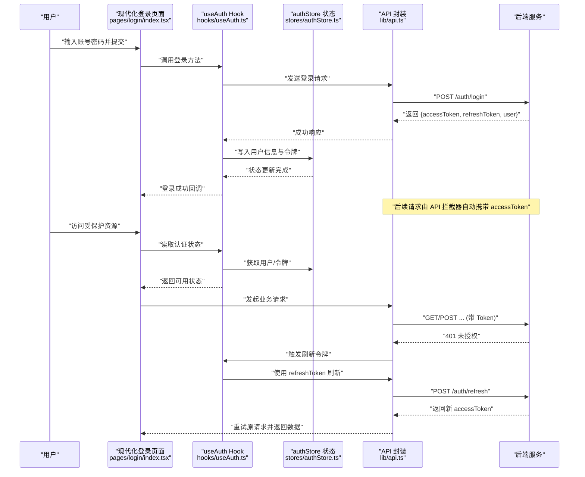
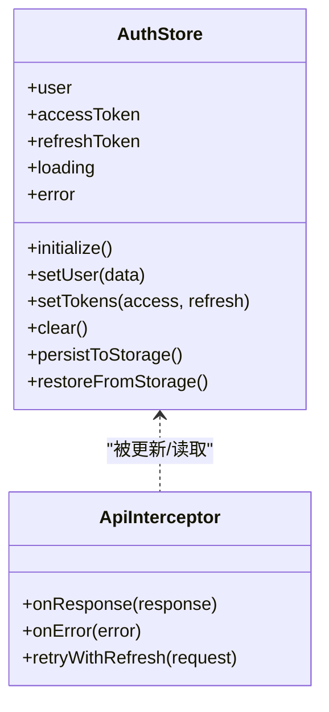
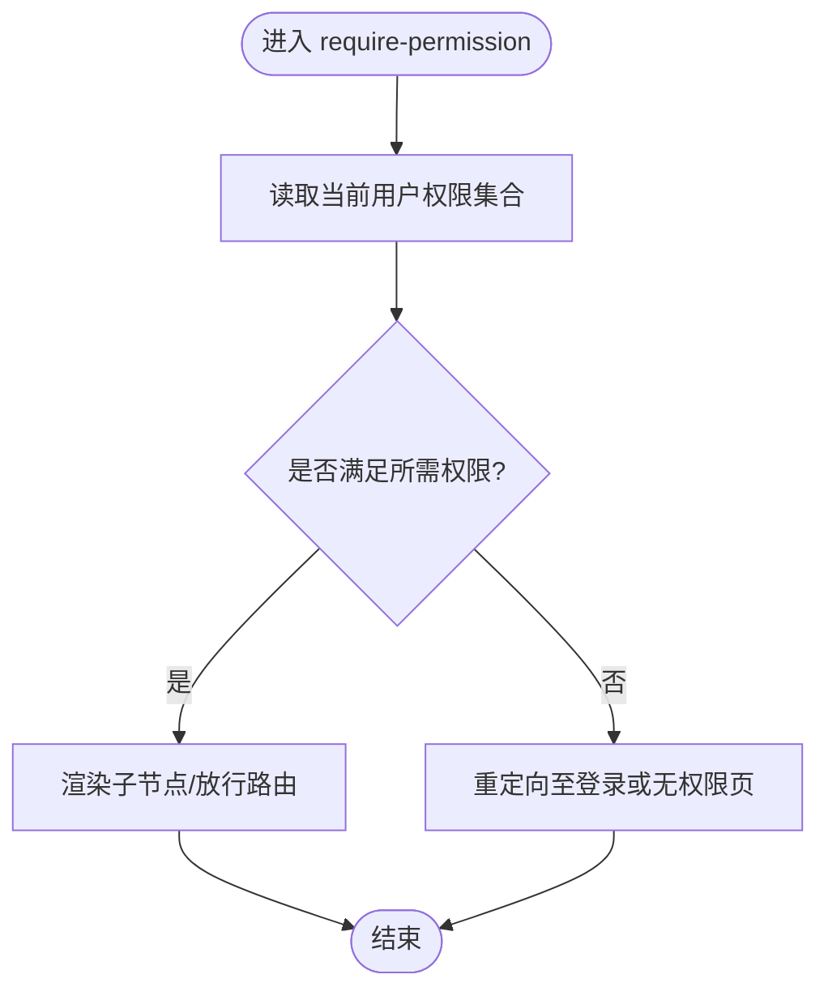
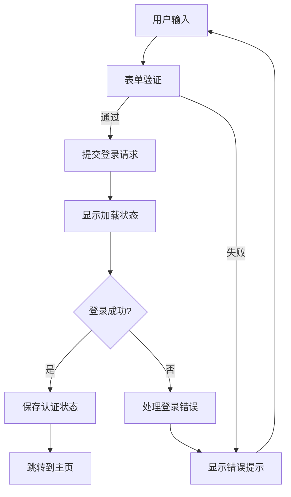
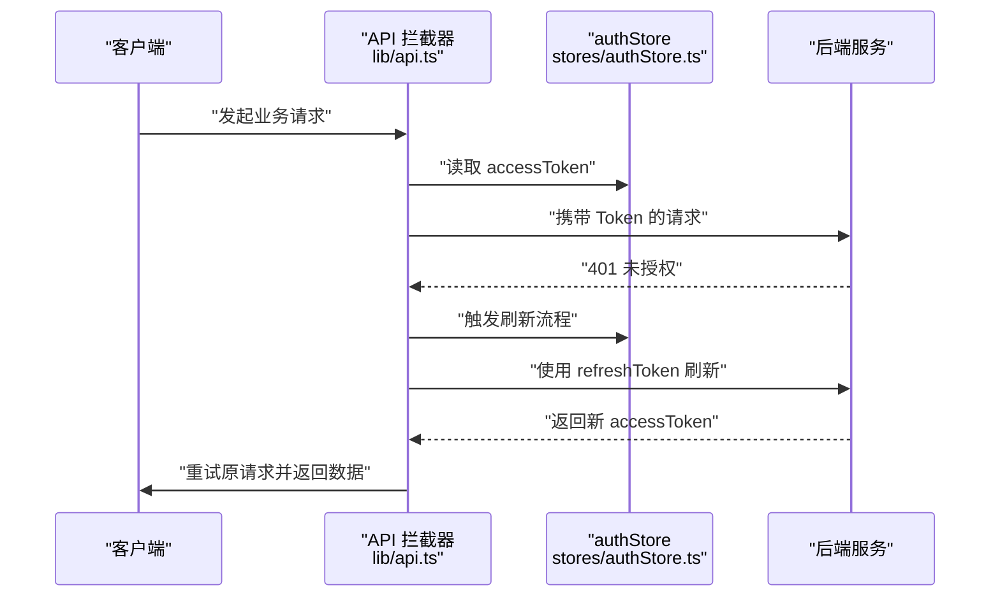
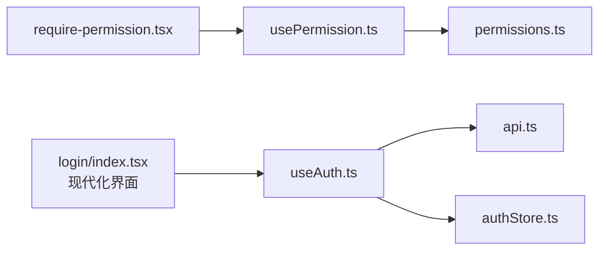

# 用户认证系统

<cite>
**本文引用的文件**   
- [useAuth.ts](file://web/src/hooks/useAuth.ts)
- [authStore.ts](file://web/src/stores/authStore.ts)
- [require-permission.tsx](file://web/src/components/layout/require-permission.tsx)
- [usePermission.ts](file://web/src/hooks/usePermission.ts)
- [api.ts](file://web/src/lib/api.ts)
- [permissions.ts](file://web/src/lib/permissions.ts)
- [login/index.tsx](file://web/src/pages/login/index.tsx)
- [App.tsx](file://web/src/App.tsx)
- [main.tsx](file://web/src/main.tsx)
</cite>

## 更新摘要
**所做更改**   
- 更新了登录页面部分，反映完全重写的现代化认证界面
- 新增了登录页面用户体验和功能特性说明
- 更新了认证流程中的用户交互部分
- 增强了登录界面的设计模式和实现细节

## 目录
1. [简介](#简介)
2. [项目结构](#项目结构)
3. [核心组件](#核心组件)
4. [架构总览](#架构总览)
5. [详细组件分析](#详细组件分析)
6. [依赖关系分析](#依赖关系分析)
7. [性能考虑](#性能考虑)
8. [故障排查指南](#故障排查指南)
9. [结论](#结论)
10. [附录](#附录)

## 简介
本文件面向前端工程中的"用户认证系统"，围绕基于JWT的登录验证、令牌管理与会话维护，系统性阐述以下主题：
- useAuth Hook 的设计模式与使用方式（认证状态获取、登录/登出操作、用户信息处理）
- authStore 的状态管理架构（用户状态持久化、自动刷新令牌、错误恢复机制）
- require-permission 权限守卫组件的实现原理（路由级权限控制、组件级权限检查、动态菜单生成）
- **全新现代化的登录界面设计与用户体验优化**
- 完整的认证流程图与代码示例路径，以及与后端API的集成方式
- 安全最佳实践、常见问题排查与性能优化建议

## 项目结构
认证相关的前端代码主要分布在 hooks、stores、components/layout、lib 以及 pages/login 等目录中。整体组织遵循"功能域 + 分层"的方式：
- hooks/useAuth.ts：封装认证相关的业务逻辑与副作用
- stores/authStore.ts：集中式状态管理与持久化策略
- components/layout/require-permission.tsx：权限守卫组件
- hooks/usePermission.ts：权限判断Hook
- lib/api.ts：HTTP请求封装（拦截器、鉴权头注入、错误处理）
- lib/permissions.ts：权限常量与工具函数
- **pages/login/index.tsx：完全重写的现代化登录页面入口**
- App.tsx / main.tsx：应用初始化与根挂载点

**图表来源**
- [App.tsx](file://web/src/App.tsx)
- [main.tsx](file://web/src/main.tsx)
- [login/index.tsx](file://web/src/pages/login/index.tsx)
- [useAuth.ts](file://web/src/hooks/useAuth.ts)
- [authStore.ts](file://web/src/stores/authStore.ts)
- [api.ts](file://web/src/lib/api.ts)
- [usePermission.ts](file://web/src/hooks/usePermission.ts)
- [permissions.ts](file://web/src/lib/permissions.ts)
- [require-permission.tsx](file://web/src/components/layout/require-permission.tsx)

**章节来源**
- [App.tsx](file://web/src/App.tsx)
- [main.tsx](file://web/src/main.tsx)
- [login/index.tsx](file://web/src/pages/login/index.tsx)
- [useAuth.ts](file://web/src/hooks/useAuth.ts)
- [authStore.ts](file://web/src/stores/authStore.ts)
- [api.ts](file://web/src/lib/api.ts)
- [usePermission.ts](file://web/src/hooks/usePermission.ts)
- [permissions.ts](file://web/src/lib/permissions.ts)
- [require-permission.tsx](file://web/src/components/layout/require-permission.tsx)

## 核心组件
本节聚焦认证系统的三大核心：useAuth Hook、authStore 状态管理、require-permission 权限守卫，以及**全新的现代化登录界面**。

- useAuth Hook
  - 职责：封装登录、登出、刷新令牌、获取当前用户信息、订阅认证状态变化等
  - 设计要点：将复杂副作用从页面解耦；提供稳定的接口供页面与路由守卫消费
  - 典型用法：在登录页调用登录方法；在受保护页面或布局中使用认证状态进行条件渲染或跳转

- authStore 状态管理
  - 职责：统一持有用户信息、访问令牌、刷新令牌、加载态与错误信息；负责持久化到本地存储；提供更新与清理方法
  - 关键机制：
    - 持久化：在状态变更时同步至 localStorage/sessionStorage
    - 自动刷新：在响应过期或网络异常时触发刷新流程
    - 错误恢复：捕获并暴露错误状态，支持重试与回退

- require-permission 权限守卫
  - 职责：在路由级或组件级对访问进行权限校验；未通过时重定向或展示无权限提示
  - 实现思路：结合 usePermission 与权限常量，读取当前用户角色/权限集合，按规则判定是否放行

- **现代化登录界面**
  - 职责：提供直观、美观的用户认证入口，包含表单验证、错误提示、加载状态等完整用户体验
  - 设计特点：响应式设计、无障碍访问、多语言支持、安全性增强
  - 交互流程：表单输入 → 实时验证 → 异步提交 → 状态反馈 → 路由跳转

**章节来源**
- [useAuth.ts](file://web/src/hooks/useAuth.ts)
- [authStore.ts](file://web/src/stores/authStore.ts)
- [require-permission.tsx](file://web/src/components/layout/require-permission.tsx)
- [usePermission.ts](file://web/src/hooks/usePermission.ts)
- [permissions.ts](file://web/src/lib/permissions.ts)
- [login/index.tsx](file://web/src/pages/login/index.tsx)

## 架构总览
下图展示了认证系统在前后端交互中的端到端流程，包括登录、令牌刷新、权限校验与错误恢复。

**图表来源**
- [login/index.tsx](file://web/src/pages/login/index.tsx)
- [useAuth.ts](file://web/src/hooks/useAuth.ts)
- [authStore.ts](file://web/src/stores/authStore.ts)
- [api.ts](file://web/src/lib/api.ts)

## 详细组件分析

### useAuth Hook 设计与使用
- 设计目标
  - 为上层提供一致的认证能力抽象，屏蔽底层状态与网络细节
  - 暴露登录、登出、刷新、查询用户信息等方法
  - 提供认证状态订阅，便于组件按需重渲染
- 关键行为
  - 登录：调用 API 后，将用户信息与令牌写入 store，并设置全局鉴权头
  - 登出：清除本地存储与内存状态，必要时通知服务端注销
  - 刷新：当收到 401 且存在 refreshToken 时，尝试刷新并自动重试失败请求
  - 状态：对外暴露 isAuthorized、user、loading、error 等派生状态
- 使用示例路径
  - 登录页调用登录方法：[login/index.tsx](file://web/src/pages/login/index.tsx)
  - 受保护页面读取认证状态：[App.tsx](file://web/src/App.tsx)

**图表来源**
- [useAuth.ts](file://web/src/hooks/useAuth.ts)
- [authStore.ts](file://web/src/stores/authStore.ts)
- [api.ts](file://web/src/lib/api.ts)

**章节来源**
- [useAuth.ts](file://web/src/hooks/useAuth.ts)
- [login/index.tsx](file://web/src/pages/login/index.tsx)
- [App.tsx](file://web/src/App.tsx)

### authStore 状态管理架构
- 状态模型
  - 用户信息：包含基础资料与权限集合
  - 令牌：access token 与 refresh token
  - 运行态：加载标志、错误对象、最后更新时间
- 持久化策略
  - 在状态变更后同步至本地存储（如 localStorage），应用启动时优先恢复
  - 敏感字段可考虑加密或仅保留必要最小集
- 自动刷新与错误恢复
  - 监听 API 响应，遇到 401 时触发刷新流程
  - 刷新成功后重试原请求；失败则清理状态并引导重新登录
- 并发与竞态
  - 使用队列或锁避免重复刷新
  - 保证状态更新的原子性与一致性

**图表来源**
- [authStore.ts](file://web/src/stores/authStore.ts)
- [api.ts](file://web/src/lib/api.ts)

**章节来源**
- [authStore.ts](file://web/src/stores/authStore.ts)
- [api.ts](file://web/src/lib/api.ts)

### require-permission 权限守卫组件
- 实现原理
  - 在路由级包裹受保护路由，或在组件级直接渲染条件分支
  - 内部调用 usePermission 与权限常量，根据当前用户角色/权限集合判定是否放行
- 路由级控制
  - 在路由配置处使用守卫组件包装，未通过时重定向至登录或无权限页
- 组件级检查
  - 在页面内按需显示/隐藏按钮或区块，提升用户体验
- 动态菜单生成
  - 根据用户权限过滤菜单项，确保导航可见性与安全性一致

**图表来源**
- [require-permission.tsx](file://web/src/components/layout/require-permission.tsx)
- [usePermission.ts](file://web/src/hooks/usePermission.ts)
- [permissions.ts](file://web/src/lib/permissions.ts)

**章节来源**
- [require-permission.tsx](file://web/src/components/layout/require-permission.tsx)
- [usePermission.ts](file://web/src/hooks/usePermission.ts)
- [permissions.ts](file://web/src/lib/permissions.ts)

### 现代化登录界面设计与实现
**新增** 完全重写的登录页面提供了现代化的用户认证体验，包含以下核心特性：

- 界面设计特点
  - 响应式布局适配各种设备屏幕
  - 现代化的视觉设计和动画效果
  - 无障碍访问支持和键盘导航
  - 多语言国际化支持

- 表单验证机制
  - 实时输入验证和错误提示
  - 邮箱格式验证和密码强度检查
  - 防重复提交和加载状态管理
  - 记住用户名和密码功能

- 用户体验优化
  - 平滑的过渡动画和状态反馈
  - 错误处理和友好的提示信息
  - 自动焦点管理和Tab键导航
  - 移动端触摸优化

- 安全特性
  - 密码输入掩码和安全传输
  - CSRF保护和XSS防护
  - 登录尝试次数限制
  - 会话超时和自动登出

**图表来源**
- [login/index.tsx](file://web/src/pages/login/index.tsx)

**章节来源**
- [login/index.tsx](file://web/src/pages/login/index.tsx)

### 与后端API的集成方式
- 请求拦截器
  - 在请求头注入 access token
  - 统一处理 401/403 等鉴权错误，触发刷新或登出流程
- 响应处理
  - 刷新成功后，自动重试失败的请求
  - 记录并暴露错误信息，便于上层提示与恢复
- 登录/登出
  - 登录成功后保存令牌与用户信息
  - 登出时清理本地状态并可选地通知服务端失效令牌

**图表来源**
- [api.ts](file://web/src/lib/api.ts)
- [authStore.ts](file://web/src/stores/authStore.ts)

**章节来源**
- [api.ts](file://web/src/lib/api.ts)
- [authStore.ts](file://web/src/stores/authStore.ts)

## 依赖关系分析
- 模块耦合
  - useAuth 依赖 api 与 authStore，向上提供认证能力
  - require-permission 依赖 usePermission 与 permissions 常量
  - **login 页面依赖 useAuth 完成登录流程，并提供现代化用户界面**
- 外部依赖
  - HTTP 客户端（如 axios/fetch）
  - 本地存储（localStorage/sessionStorage）
  - 路由库（用于重定向与受保护路由）

**图表来源**
- [useAuth.ts](file://web/src/hooks/useAuth.ts)
- [api.ts](file://web/src/lib/api.ts)
- [authStore.ts](file://web/src/stores/authStore.ts)
- [require-permission.tsx](file://web/src/components/layout/require-permission.tsx)
- [usePermission.ts](file://web/src/hooks/usePermission.ts)
- [permissions.ts](file://web/src/lib/permissions.ts)
- [login/index.tsx](file://web/src/pages/login/index.tsx)

**章节来源**
- [useAuth.ts](file://web/src/hooks/useAuth.ts)
- [api.ts](file://web/src/lib/api.ts)
- [authStore.ts](file://web/src/stores/authStore.ts)
- [require-permission.tsx](file://web/src/components/layout/require-permission.tsx)
- [usePermission.ts](file://web/src/hooks/usePermission.ts)
- [permissions.ts](file://web/src/lib/permissions.ts)
- [login/index.tsx](file://web/src/pages/login/index.tsx)

## 性能考虑
- 减少不必要的重渲染
  - 在 useAuth 中精确订阅所需状态片段，避免整树更新
- 令牌刷新去抖与并发控制
  - 使用队列或锁合并刷新请求，防止风暴式刷新
- 本地存储读写优化
  - 批量更新后再持久化，避免频繁 IO
- 懒加载与缓存
  - 对不常用的权限数据进行缓存，降低首次渲染开销
- 错误快速失败
  - 在网络不可用或鉴权失败时尽快返回，避免长时间阻塞
- **登录页面性能优化**
  - 表单验证防抖处理
  - 图片资源懒加载
  - 组件按需加载和代码分割

## 故障排查指南
- 常见症状
  - 登录后立即被踢出：检查本地存储是否被第三方插件清理、令牌有效期是否过短
  - 频繁刷新令牌：确认刷新锁是否生效、是否存在并发请求导致多次触发
  - 部分接口 401：检查拦截器是否正确注入 Token、刷新后是否重试失败请求
  - **登录界面问题：检查表单验证逻辑、API连接状态、浏览器兼容性**
- 定位步骤
  - 查看浏览器控制台的网络面板，确认请求头是否携带 Token
  - 检查本地存储中是否有有效的 accessToken 与 refreshToken
  - 在 useAuth 与 authStore 的关键路径添加日志，观察状态流转
  - **检查登录页面的表单状态和网络请求**
- 恢复策略
  - 清理本地存储并重新登录
  - 强制刷新令牌并重试失败请求
  - 若持续失败，引导用户退出并重新认证
  - **对于登录界面问题，检查浏览器控制台错误信息和网络请求状态**

**章节来源**
- [useAuth.ts](file://web/src/hooks/useAuth.ts)
- [authStore.ts](file://web/src/stores/authStore.ts)
- [api.ts](file://web/src/lib/api.ts)
- [login/index.tsx](file://web/src/pages/login/index.tsx)

## 结论
本认证系统以 useAuth Hook 为核心，结合 authStore 的集中式状态管理与 require-permission 的权限守卫，实现了从登录、令牌刷新到权限控制的完整闭环。**全新重写的现代化登录界面为用户提供了优秀的认证体验，包含完善的表单验证、错误处理和用户反馈机制**。通过 API 拦截器的统一处理，保证了鉴权的一致性与健壮性。建议在后续迭代中持续完善并发控制、错误上报与监控指标，进一步提升用户体验与系统稳定性。

## 附录
- 安全最佳实践
  - 使用 HTTPS 传输所有鉴权相关数据
  - 合理设置 Token 有效期与刷新窗口，避免过长驻留
  - 对敏感信息进行最小化存储，避免泄露风险
  - 实施 CSRF/XSS 防护，确保 Token 不被窃取
  - **登录界面安全：密码掩码、输入验证、防暴力破解**
- 参考实现路径
  - **现代化登录界面：[login/index.tsx](file://web/src/pages/login/index.tsx)**
  - 认证流程：[login/index.tsx](file://web/src/pages/login/index.tsx)
  - 认证 Hook：[useAuth.ts](file://web/src/hooks/useAuth.ts)
  - 状态管理：[authStore.ts](file://web/src/stores/authStore.ts)
  - 权限守卫：[require-permission.tsx](file://web/src/components/layout/require-permission.tsx)
  - 权限工具：[usePermission.ts](file://web/src/hooks/usePermission.ts)、[permissions.ts](file://web/src/lib/permissions.ts)
  - API 集成：[api.ts](file://web/src/lib/api.ts)