基于我对代码的分析，我现在了解了权限感知的主页重定向系统和新的高风险权限数据。让我更新用户认证系统文档：

# 用户认证系统

<cite>
**本文引用的文件**   
- [useAuth.ts](file://web/src/hooks/useAuth.ts)
- [authStore.ts](file://web/src/stores/authStore.ts)
- [require-permission.tsx](file://web/src/components/layout/require-permission.tsx)
- [usePermission.ts](file://web/src/hooks/usePermission.ts)
- [api.ts](file://web/src/lib/api.ts)
- [permissions.ts](file://web/src/lib/permissions.ts)
- [login/index.tsx](file://web/src/pages/login/index.tsx)
- [App.tsx](file://web/src/App.tsx)
- [main.tsx](file://web/src/main.tsx)
- [home-redirect.tsx](file://web/src/components/layout/home-redirect.tsx)
- [audit.ts](file://server/src/middleware/audit.ts)
- [permission.ts](file://server/src/middleware/permission.ts)
- [schema.prisma](file://server/prisma/schema.prisma)
- [change-password-dialog.tsx](file://web/src/components/layout/change-password-dialog.tsx)
- [main-layout.tsx](file://web/src/components/layout/main-layout.tsx)
- [AuthService.ts](file://server/src/services/AuthService.ts)
- [auth.ts](file://server/src/middleware/auth.ts)
- [auth.ts](file://server/src/routes/auth.ts)
</cite>

## 更新摘要
**所做更改**   
- 新增了权限感知的主页重定向系统，包含resolveHomePath函数和HomeRedirect组件
- 添加了新的高风险权限数据data:import:rollback，用于导入批次回滚操作
- 更新了登录页面集成，实现了基于用户权限的智能首页跳转
- 完善了权限矩阵和高危权限管理，确保只有超级管理员才能执行高危操作

## 目录
1. [简介](#简介)
2. [项目结构](#项目结构)
3. [核心组件](#核心组件)
4. [架构总览](#架构总览)
5. [详细组件分析](#详细组件分析)
6. [依赖关系分析](#依赖关系分析)
7. [性能考虑](#性能考虑)
8. [故障排查指南](#故障排查指南)
9. [结论](#结论)
10. [附录](#附录)

## 简介
本文件面向前端工程中的"用户认证系统"，围绕基于JWT的登录验证、令牌管理与会话维护，系统性阐述以下主题：
- useAuth Hook 的设计模式与使用方式（认证状态获取、登录/登出操作、用户信息处理）
- authStore 的状态管理架构（用户状态持久化、自动刷新令牌、错误恢复机制）
- require-permission 权限守卫组件的实现原理（路由级权限控制、组件级权限检查、动态菜单生成）
- **新增的权限感知主页重定向系统，根据用户权限智能选择默认首页**
- **全新的高风险权限管理机制，包括data:import:rollback等高危操作的权限控制**
- 完整的认证流程图与代码示例路径，以及与后端API的集成方式
- 安全最佳实践、常见问题排查与性能优化建议

## 项目结构
认证相关的前端代码主要分布在 hooks、stores、components/layout、lib 以及 pages/login 等目录中。整体组织遵循"功能域 + 分层"的方式：
- hooks/useAuth.ts：封装认证相关的业务逻辑与副作用
- stores/authStore.ts：集中式状态管理与持久化策略
- components/layout/require-permission.tsx：权限守卫组件
- components/layout/home-redirect.tsx：**新增的权限感知主页重定向组件**
- components/layout/change-password-dialog.tsx：强制密码修改对话框组件
- components/layout/main-layout.tsx：集成了强制密码修改功能的布局组件
- hooks/usePermission.ts：权限判断Hook
- lib/api.ts：HTTP请求封装（拦截器、鉴权头注入、错误处理）
- lib/permissions.ts：权限常量与工具函数，包含HOME_ROUTE_PRIORITY和resolveHomePath函数
- pages/login/index.tsx：现代化登录页面入口，集成了权限感知跳转
- App.tsx / main.tsx：应用初始化与根挂载点

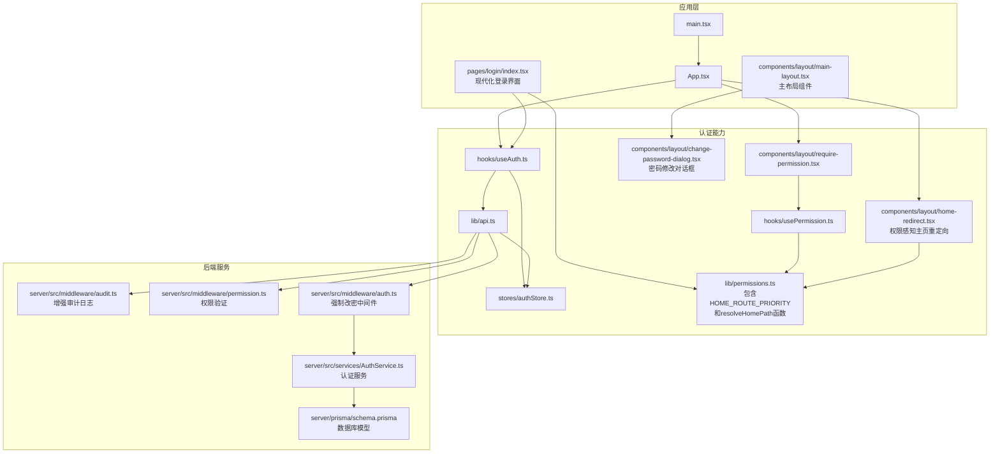

**图表来源**
- [App.tsx](file://web/src/App.tsx)
- [main.tsx](file://web/src/main.tsx)
- [login/index.tsx](file://web/src/pages/login/index.tsx)
- [main-layout.tsx](file://web/src/components/layout/main-layout.tsx)
- [useAuth.ts](file://web/src/hooks/useAuth.ts)
- [authStore.ts](file://web/src/stores/authStore.ts)
- [api.ts](file://web/src/lib/api.ts)
- [usePermission.ts](file://web/src/hooks/usePermission.ts)
- [permissions.ts](file://web/src/lib/permissions.ts)
- [require-permission.tsx](file://web/src/components/layout/require-permission.tsx)
- [change-password-dialog.tsx](file://web/src/components/layout/change-password-dialog.tsx)
- [home-redirect.tsx](file://web/src/components/layout/home-redirect.tsx)
- [audit.ts](file://server/src/middleware/audit.ts)
- [permission.ts](file://server/src/middleware/permission.ts)
- [auth.ts](file://server/src/middleware/auth.ts)
- [AuthService.ts](file://server/src/services/AuthService.ts)
- [schema.prisma](file://server/prisma/schema.prisma)

## 核心组件
本节聚焦认证系统的三大核心：useAuth Hook、authStore 状态管理、require-permission 权限守卫，以及**新增的权限感知主页重定向系统和高风险权限管理**。

- useAuth Hook
  - 职责：封装登录、登出、刷新令牌、获取当前用户信息、订阅认证状态变化等
  - 设计要点：将复杂副作用从页面解耦；提供稳定的接口供页面与路由守卫消费
  - 典型用法：在登录页调用登录方法；在受保护页面或布局中使用认证状态进行条件渲染或跳转

- authStore 状态管理
  - 职责：统一持有用户信息、访问令牌、刷新令牌、加载态与错误信息；负责持久化到本地存储；提供更新与清理方法
  - 关键机制：
    - 持久化：在状态变更时同步至 localStorage/sessionStorage
    - 自动刷新：在响应过期或网络异常时触发刷新流程
    - 错误恢复：捕获并暴露错误状态，支持重试与回退
    - 密码对话框状态管理：跟踪强制改密对话框的打开状态和模式

- require-permission 权限守卫
  - 职责：在路由级或组件级对访问进行权限校验；未通过时重定向或展示无权限提示
  - 实现思路：结合 usePermission 与权限常量，读取当前用户角色/权限集合，按规则判定是否放行

- **新增的权限感知主页重定向系统**
  - 职责：根据用户权限智能选择默认首页，提升用户体验
  - 核心特性：
    - HOME_ROUTE_PRIORITY：定义模块优先级顺序（dashboard > indicators > reports > transactions > inventory > data > admin）
    - resolveHomePath函数：遍历优先级列表，返回第一个用户有权限的模块路径
    - HomeRedirect组件：在根路径和未知路径时使用，无匹配权限时跳转到/no-access
    - 登录成功后自动跳转到用户权限范围内的最优先模块

- **新增的高风险权限管理机制**
  - 职责：严格控制高危操作的访问权限，确保只有超级管理员才能执行敏感操作
  - 核心特性：
    - HIGH_RISK_PERMISSIONS数组：包含data:import:rollback等高危权限码
    - 权限分离：admin角色不再拥有高危权限，仅superadmin可执行
    - 数据驱动：通过seed.ts中的HIGH_RISK_RESOURCES常量管理高危权限
    - 前端标识：在高危权限旁边显示"高危"标签，提醒用户操作风险

**章节来源**
- [useAuth.ts](file://web/src/hooks/useAuth.ts)
- [authStore.ts](file://web/src/stores/authStore.ts)
- [require-permission.tsx](file://web/src/components/layout/require-permission.tsx)
- [usePermission.ts](file://web/src/hooks/usePermission.ts)
- [permissions.ts](file://web/src/lib/permissions.ts)
- [login/index.tsx](file://web/src/pages/login/index.tsx)
- [home-redirect.tsx](file://web/src/components/layout/home-redirect.tsx)
- [change-password-dialog.tsx](file://web/src/components/layout/change-password-dialog.tsx)
- [main-layout.tsx](file://web/src/components/layout/main-layout.tsx)
- [auth.ts](file://server/src/middleware/auth.ts)
- [AuthService.ts](file://server/src/services/AuthService.ts)

## 架构总览
下图展示了认证系统在前后端交互中的端到端流程，包括登录、令牌刷新、权限校验、审计日志记录、强制密码修改流程、**权限感知主页重定向**与错误恢复。

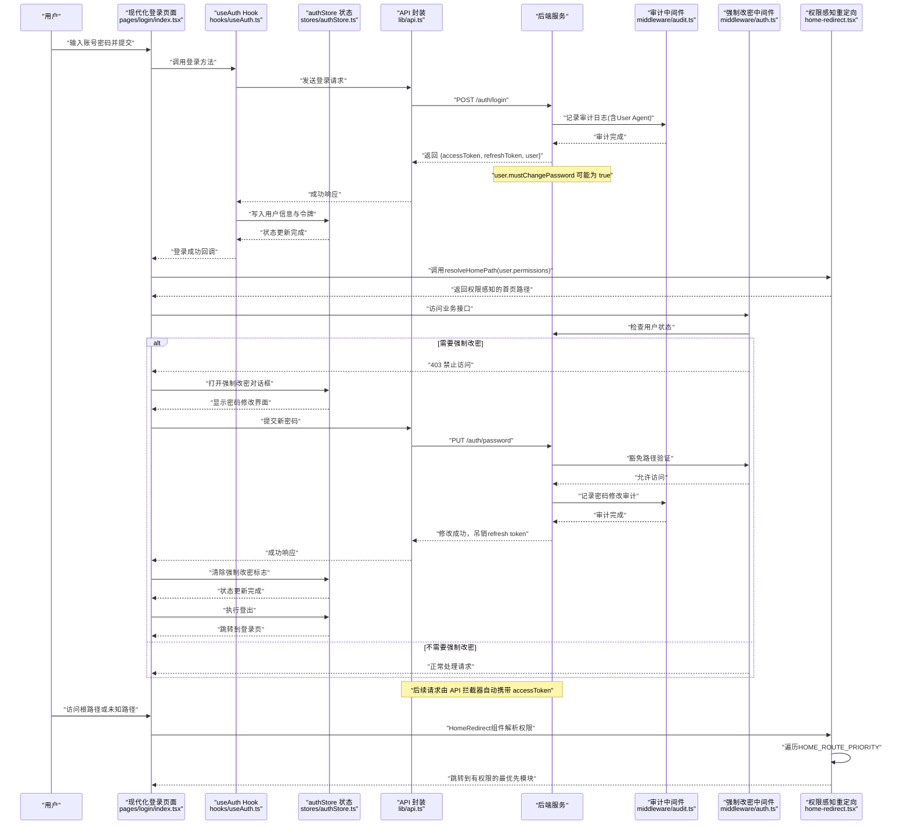

**图表来源**
- [login/index.tsx](file://web/src/pages/login/index.tsx)
- [useAuth.ts](file://web/src/hooks/useAuth.ts)
- [authStore.ts](file://web/src/stores/authStore.ts)
- [api.ts](file://web/src/lib/api.ts)
- [home-redirect.tsx](file://web/src/components/layout/home-redirect.tsx)
- [permissions.ts](file://web/src/lib/permissions.ts)
- [auth.ts](file://server/src/middleware/auth.ts)
- [AuthService.ts](file://server/src/services/AuthService.ts)

## 详细组件分析

### useAuth Hook 设计与使用
- 设计目标
  - 为上层提供一致的认证能力抽象，屏蔽底层状态与网络细节
  - 暴露登录、登出、刷新、查询用户信息等方法
  - 提供认证状态订阅，便于组件按需重渲染
- 关键行为
  - 登录：调用 API 后，将用户信息与令牌写入 store，并设置全局鉴权头
  - 登出：清除本地存储与内存状态，必要时通知服务端注销
  - 刷新：当收到 401 且存在 refreshToken 时，尝试刷新并自动重试失败请求
  - 状态：对外暴露 isAuthorized、user、loading、error 等派生状态
- 使用示例路径
  - 登录页调用登录方法：[login/index.tsx](file://web/src/pages/login/index.tsx)
  - 受保护页面读取认证状态：[App.tsx](file://web/src/App.tsx)

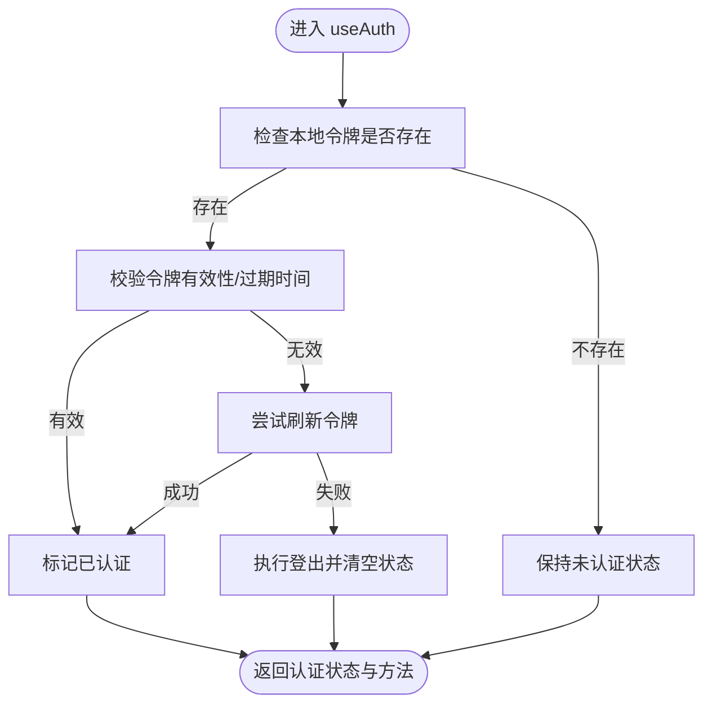

**图表来源**
- [useAuth.ts](file://web/src/hooks/useAuth.ts)
- [authStore.ts](file://web/src/stores/authStore.ts)
- [api.ts](file://web/src/lib/api.ts)

**章节来源**
- [useAuth.ts](file://web/src/hooks/useAuth.ts)
- [login/index.tsx](file://web/src/pages/login/index.tsx)
- [App.tsx](file://web/src/App.tsx)

### authStore 状态管理架构
- 状态模型
  - 用户信息：包含基础资料与权限集合
  - 令牌：access token 与 refresh token
  - 运行态：加载标志、错误对象、最后更新时间
  - 密码对话框状态：跟踪强制改密对话框的打开状态和模式
- 持久化策略
  - 在状态变更后同步至本地存储（如 localStorage），应用启动时优先恢复
  - 敏感字段可考虑加密或仅保留必要最小集
- 自动刷新与错误恢复
  - 监听 API 响应，遇到 401 时触发刷新流程
  - 刷新成功后重试原请求；失败则清理状态并引导重新登录
- 并发与竞态
  - 使用队列或锁避免重复刷新
  - 保证状态更新的原子性与一致性

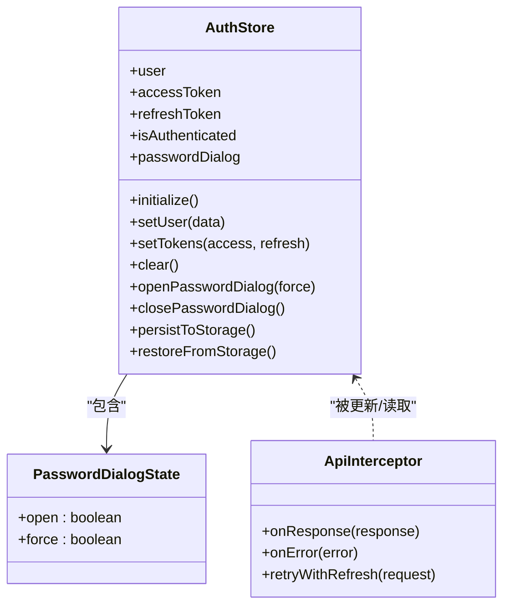

**图表来源**
- [authStore.ts](file://web/src/stores/authStore.ts)
- [api.ts](file://web/src/lib/api.ts)

**章节来源**
- [authStore.ts](file://web/src/stores/authStore.ts)
- [api.ts](file://web/src/lib/api.ts)

### require-permission 权限守卫组件
- 实现原理
  - 在路由级包裹受保护路由，或在组件级直接渲染条件分支
  - 内部调用 usePermission 与权限常量，根据当前用户角色/权限集合判定是否放行
- 路由级控制
  - 在路由配置处使用守卫组件包装，未通过时重定向至登录或无权限页
- 组件级检查
  - 在页面内按需显示/隐藏按钮或区块，提升用户体验
- 动态菜单生成
  - 根据用户权限过滤菜单项，确保导航可见性与安全性一致

**图表来源**
- [require-permission.tsx](file://web/src/components/layout/require-permission.tsx)
- [usePermission.ts](file://web/src/hooks/usePermission.ts)
- [permissions.ts](file://web/src/lib/permissions.ts)

**章节来源**
- [require-permission.tsx](file://web/src/components/layout/require-permission.tsx)
- [usePermission.ts](file://web/src/hooks/usePermission.ts)
- [permissions.ts](file://web/src/lib/permissions.ts)

### 权限感知主页重定向系统
**全新功能** 系统现在具备智能的权限感知主页重定向能力，根据用户权限自动选择最合适的默认首页：

- 核心组件
  - HomeRedirect组件：在根路径和未知路径时自动重定向到有权限的模块
  - resolveHomePath函数：根据用户权限列表和HOME_ROUTE_PRIORITY计算最优首页
  - HOME_ROUTE_PRIORITY常量：定义模块优先级顺序，确保用户体验一致性

- 优先级规则
  - dashboard:view → /dashboard（看板仪表板）
  - indicators:view → /indicators（指标分析）
  - reports:view → /reports（报表管理）
  - transactions:view → /transactions（交易管理）
  - inventory:view → /inventory（库存管理）
  - data:browse:view → /data（数据浏览）
  - admin:users:view → /admin/users（用户管理）

- 登录集成
  - 登录成功后立即调用resolveHomePath进行智能跳转
  - 已登录用户访问登录页时自动重定向到权限感知首页
  - 无匹配权限时统一跳转到/no-access页面

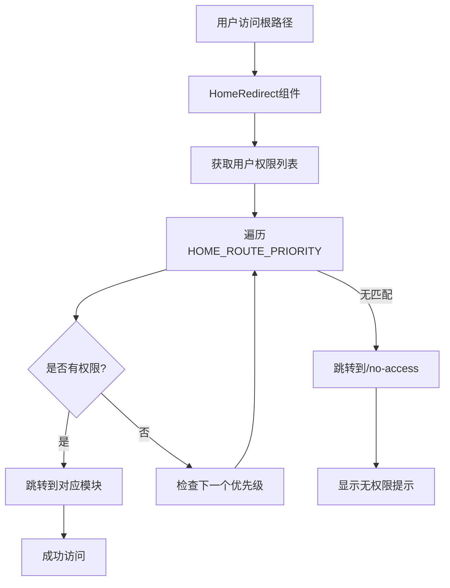

**图表来源**
- [home-redirect.tsx](file://web/src/components/layout/home-redirect.tsx)
- [permissions.ts](file://web/src/lib/permissions.ts)
- [login/index.tsx](file://web/src/pages/login/index.tsx)

**章节来源**
- [home-redirect.tsx](file://web/src/components/layout/home-redirect.tsx)
- [permissions.ts](file://web/src/lib/permissions.ts)
- [login/index.tsx](file://web/src/pages/login/index.tsx)
- [App.tsx](file://web/src/App.tsx)

### 现代化登录界面设计与实现
完全重写的登录页面提供了现代化的用户认证体验，包含以下核心特性：

- 界面设计特点
  - 响应式布局适配各种设备屏幕
  - 现代化的视觉设计和动画效果
  - 无障碍访问支持和键盘导航
  - 多语言国际化支持

- 表单验证机制
  - 实时输入验证和错误提示
  - 邮箱格式验证和密码强度检查
  - 防重复提交和加载状态管理
  - 记住用户名和密码功能

- 用户体验优化
  - 平滑的过渡动画和状态反馈
  - 错误处理和友好的提示信息
  - 自动焦点管理和Tab键导航
  - 移动端触摸优化

- 安全特性
  - 密码输入掩码和安全传输
  - CSRF保护和XSS防护
  - 登录尝试次数限制
  - 会话超时和自动登出

- **权限感知跳转集成**
  - 登录成功后调用resolveHomePath进行智能首页跳转
  - 已登录用户访问登录页时自动重定向
  - 无权限时统一跳转到/no-access页面

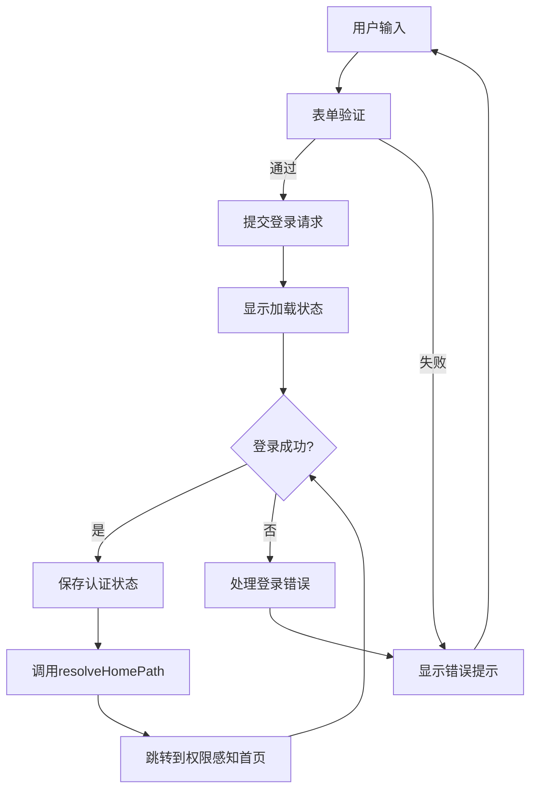

**图表来源**
- [login/index.tsx](file://web/src/pages/login/index.tsx)
- [permissions.ts](file://web/src/lib/permissions.ts)

**章节来源**
- [login/index.tsx](file://web/src/pages/login/index.tsx)

### 新增的高风险权限管理机制
**全新功能** 系统现在具备完善的高风险权限管理机制，严格控制敏感操作的访问权限：

- 高危权限定义
  - HIGH_RISK_PERMISSIONS数组：包含data:import:rollback等高危权限码
  - 权限分离：admin角色不再拥有高危权限，仅superadmin可执行
  - 数据驱动：通过seed.ts中的HIGH_RISK_RESOURCES常量管理高危权限

- 高危操作类型
  - data:import:rollback：导入批次回滚（恢复快照数据）
  - data:import:archive：批次归档操作
  - data:import:purge：批次物理清理
  - data:company:purge：公司物理删除
  - data:subject:purge：科目物理删除
  - data:metric:purge：指标物理删除
  - data:metric:convert：指标类型转换
  - data:metric:approve：指标口径审批
  - admin:users:purge：用户物理删除
  - admin:permissions:update：权限配置变更

- 前端标识与验证
  - 在高危权限旁边显示"高危"标签，提醒用户操作风险
  - 权限验证时严格检查HIGH_RISK_PERMISSIONS数组
  - 管理员界面中高权限操作需要额外确认

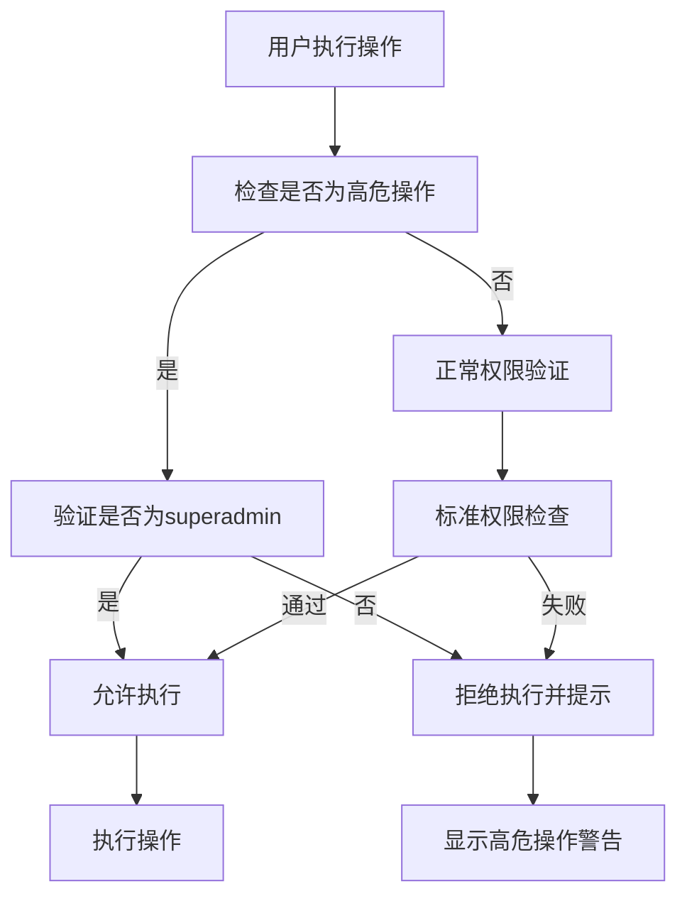

**图表来源**
- [permissions.ts](file://web/src/lib/permissions.ts)
- [data.ts](file://server/src/routes/data.ts)
- [ImportService.ts](file://server/src/services/ImportService.ts)

**章节来源**
- [permissions.ts](file://web/src/lib/permissions.ts)
- [data.ts](file://server/src/routes/data.ts)
- [ImportService.ts](file://server/src/services/ImportService.ts)

### 新增的强制密码修改功能
**全新功能** 系统现在具备完整的强制密码修改机制，确保用户首次登录时必须修改初始密码：

- 数据库层面
  - 新增 `must_change_password` 布尔字段，默认值为 false
  - 管理员创建用户或重置密码时可设置为 true
  - 改密成功后自动设置为 false

- 后端中间件验证
  - 在鉴权中间件中检查用户的 `mustChangePassword` 状态
  - 定义豁免路径列表：改密、登出、资料查询接口
  - 非豁免路径在强制改密状态下返回 403 错误

- 前端对话框组件
  - 现代化的密码修改界面，支持两种模式：强制模式和普通模式
  - 强制模式下对话框不可关闭，防止用户绕过改密流程
  - 内置密码强度验证和确认机制
  - 改密成功后自动登出并跳转到登录页

- 状态管理集成
  - 在 authStore 中添加 passwordDialog 状态管理
  - 主布局组件监听 mustChangePassword 状态变化
  - 自动弹出强制改密对话框

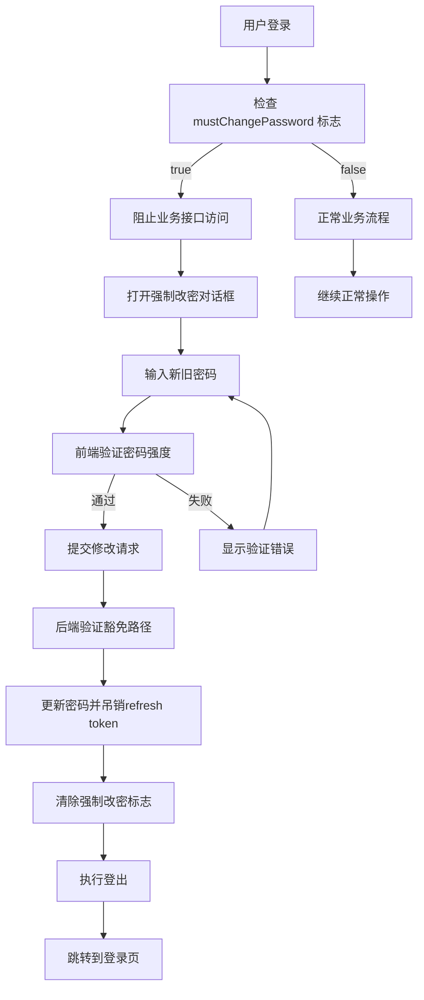

**图表来源**
- [change-password-dialog.tsx](file://web/src/components/layout/change-password-dialog.tsx)
- [main-layout.tsx](file://web/src/components/layout/main-layout.tsx)
- [auth.ts](file://server/src/middleware/auth.ts)
- [AuthService.ts](file://server/src/services/AuthService.ts)

**章节来源**
- [change-password-dialog.tsx](file://web/src/components/layout/change-password-dialog.tsx)
- [main-layout.tsx](file://web/src/components/layout/main-layout.tsx)
- [auth.ts](file://server/src/middleware/auth.ts)
- [AuthService.ts](file://server/src/services/AuthService.ts)

### 增强的审计日志系统
**新增** 系统现在具备完整的审计日志功能，用于追踪所有认证相关操作：

- 用户代理跟踪
  - 自动捕获浏览器User Agent信息
  - 记录设备类型、操作系统和浏览器版本
  - 支持移动设备和桌面设备的区分

- 权限动作枚举
  - 标准化的权限操作分类（READ、WRITE、DELETE、ADMIN等）
  - 统一的权限验证接口
  - 详细的操作审计记录

- 输入验证增强
  - 角色权限输入的严格验证
  - 防止SQL注入和XSS攻击
  - 数据类型检查和格式验证

- 审计数据结构
  - 用户ID和操作者信息
  - 操作类型和时间戳
  - IP地址和用户代理
  - 请求参数和响应状态

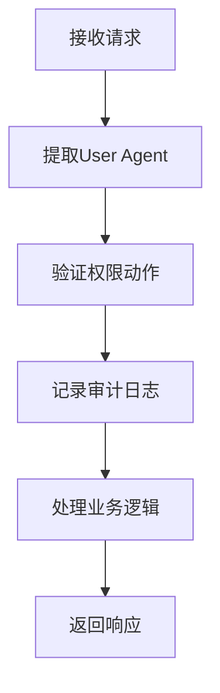

**图表来源**
- [audit.ts](file://server/src/middleware/audit.ts)
- [permission.ts](file://server/src/middleware/permission.ts)

**章节来源**
- [audit.ts](file://server/src/middleware/audit.ts)
- [permission.ts](file://server/src/middleware/permission.ts)

### 与后端API的集成方式
- 请求拦截器
  - 在请求头注入 access token
  - 统一处理 401/403 等鉴权错误，触发刷新或登出流程
- 响应处理
  - 刷新成功后，自动重试失败的请求
  - 记录并暴露错误信息，便于上层提示与恢复
- 登录/登出
  - 登录成功后保存令牌与用户信息
  - 登出时清理本地状态并可选地通知服务端失效令牌
- **强制密码修改集成**
  - 新增 `/auth/password` 接口用于密码修改
  - 中间件支持豁免路径机制
  - 改密成功后自动吊销refresh token
- **权限感知集成**
  - 登录后立即调用resolveHomePath进行智能跳转
  - 根路径和未知路径自动重定向到权限感知首页

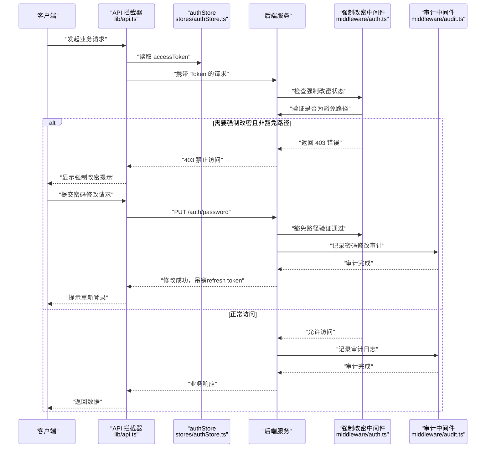

**图表来源**
- [api.ts](file://web/src/lib/api.ts)
- [authStore.ts](file://web/src/stores/authStore.ts)
- [auth.ts](file://server/src/middleware/auth.ts)
- [audit.ts](file://server/src/middleware/audit.ts)

**章节来源**
- [api.ts](file://web/src/lib/api.ts)
- [authStore.ts](file://web/src/stores/authStore.ts)

## 依赖关系分析
- 模块耦合
  - useAuth 依赖 api 与 authStore，向上提供认证能力
  - require-permission 依赖 usePermission 与 permissions 常量
  - login 页面依赖 useAuth 完成登录流程，并提供现代化用户界面
  - change-password-dialog 依赖 useAuthStore 和 api 进行密码修改操作
  - main-layout 依赖 change-password-dialog 和 useAuthStore 管理强制改密流程
  - **home-redirect 依赖 usePermission 和 resolveHomePath 进行权限感知重定向**
  - **permissions 模块包含HOME_ROUTE_PRIORITY和resolveHomePath函数**
- 外部依赖
  - HTTP 客户端（如 axios/fetch）
  - 本地存储（localStorage/sessionStorage）
  - 路由库（用于重定向与受保护路由）
- **新增依赖**
  - 审计中间件依赖数据库模型和日志服务
  - 权限验证依赖枚举定义和输入验证库
  - **强制改密功能依赖数据库字段和中间件验证**
  - **权限感知重定向依赖权限矩阵和优先级配置**

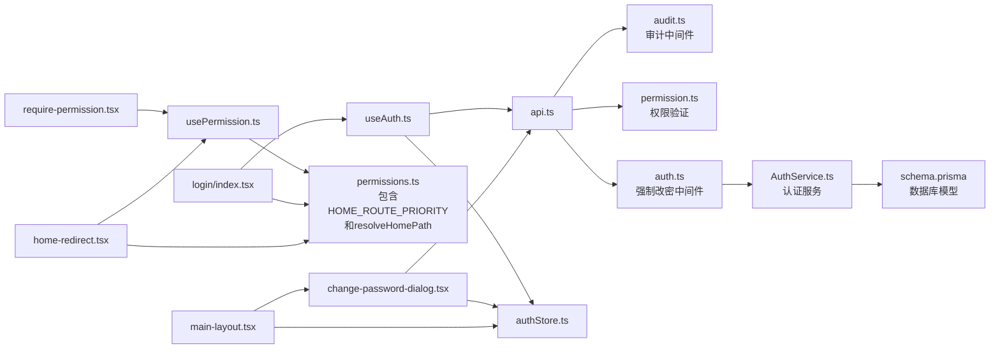

**图表来源**
- [useAuth.ts](file://web/src/hooks/useAuth.ts)
- [api.ts](file://web/src/lib/api.ts)
- [authStore.ts](file://web/src/stores/authStore.ts)
- [require-permission.tsx](file://web/src/components/layout/require-permission.tsx)
- [usePermission.ts](file://web/src/hooks/usePermission.ts)
- [permissions.ts](file://web/src/lib/permissions.ts)
- [login/index.tsx](file://web/src/pages/login/index.tsx)
- [home-redirect.tsx](file://web/src/components/layout/home-redirect.tsx)
- [change-password-dialog.tsx](file://web/src/components/layout/change-password-dialog.tsx)
- [main-layout.tsx](file://web/src/components/layout/main-layout.tsx)
- [audit.ts](file://server/src/middleware/audit.ts)
- [permission.ts](file://server/src/middleware/permission.ts)
- [auth.ts](file://server/src/middleware/auth.ts)
- [AuthService.ts](file://server/src/services/AuthService.ts)
- [schema.prisma](file://server/prisma/schema.prisma)

**章节来源**
- [useAuth.ts](file://web/src/hooks/useAuth.ts)
- [api.ts](file://web/src/lib/api.ts)
- [authStore.ts](file://web/src/stores/authStore.ts)
- [require-permission.tsx](file://web/src/components/layout/require-permission.tsx)
- [usePermission.ts](file://web/src/hooks/usePermission.ts)
- [permissions.ts](file://web/src/lib/permissions.ts)
- [login/index.tsx](file://web/src/pages/login/index.tsx)
- [home-redirect.tsx](file://web/src/components/layout/home-redirect.tsx)
- [change-password-dialog.tsx](file://web/src/components/layout/change-password-dialog.tsx)
- [main-layout.tsx](file://web/src/components/layout/main-layout.tsx)

## 性能考虑
- 减少不必要的重渲染
  - 在 useAuth 中精确订阅所需状态片段，避免整树更新
- 令牌刷新去抖与并发控制
  - 使用队列或锁合并刷新请求，防止风暴式刷新
- 本地存储读写优化
  - 批量更新后再持久化，避免频繁 IO
- 懒加载与缓存
  - 对不常用的权限数据进行缓存，降低首次渲染开销
- 错误快速失败
  - 在网络不可用或鉴权失败时尽快返回，避免长时间阻塞
- 登录页面性能优化
  - 表单验证防抖处理
  - 图片资源懒加载
  - 组件按需加载和代码分割
- **强制密码修改性能优化**
  - 对话框组件仅在需要时渲染
  - 密码验证在前端进行，减少后端请求
  - 状态更新采用增量方式，避免全量刷新
- **权限感知重定向性能优化**
  - HOME_ROUTE_PRIORITY使用只读数组，避免重复计算
  - resolveHomePath函数使用简单的线性搜索，复杂度O(n)
  - 权限列表缓存，避免重复解析
- **审计日志性能优化**
  - 异步日志记录，避免阻塞主流程
  - 批量写入数据库，减少IO操作
  - 合理的日志级别和过滤机制

## 故障排查指南
- 常见症状
  - 登录后立即被踢出：检查本地存储是否被第三方插件清理、令牌有效期是否过短
  - 频繁刷新令牌：确认刷新锁是否生效、是否存在并发请求导致多次触发
  - 部分接口 401：检查拦截器是否正确注入 Token、刷新后是否重试失败请求
  - 登录界面问题：检查表单验证逻辑、API连接状态、浏览器兼容性
  - **权限感知重定向问题：检查HOME_ROUTE_PRIORITY配置、用户权限列表完整性**
  - **高危权限访问失败：检查用户角色是否为superadmin、HIGH_RISK_PERMISSIONS配置**
  - **强制改密问题：检查用户 mustChangePassword 状态、中间件豁免路径配置**
  - **密码修改失败：检查密码强度验证、原密码正确性、网络连接状态**
  - **审计日志缺失：检查中间件是否正确注册、数据库连接是否正常**
- 定位步骤
  - 查看浏览器控制台的网络面板，确认请求头是否携带 Token
  - 检查本地存储中是否有有效的 accessToken 与 refreshToken
  - 在 useAuth 与 authStore 的关键路径添加日志，观察状态流转
  - 检查登录页面的表单状态和网络请求
  - **检查权限感知重定向的HOME_ROUTE_PRIORITY和resolveHomePath函数**
  - **验证高危权限的HIGH_RISK_PERMISSIONS数组配置**
  - **检查强制改密对话框的打开条件和关闭逻辑**
  - **验证后端中间件的豁免路径配置是否正确**
  - **查看审计日志表，确认用户代理和权限操作记录**
- 恢复策略
  - 清理本地存储并重新登录
  - 强制刷新令牌并重试失败请求
  - 若持续失败，引导用户退出并重新认证
  - 对于登录界面问题，检查浏览器控制台错误信息和网络请求状态
  - **对于权限感知问题，检查用户权限配置和HOME_ROUTE_PRIORITY**
  - **对于高危权限问题，验证用户角色和权限分配**
  - **对于强制改密问题，检查用户状态和中间件配置**
  - **对于密码修改问题，验证密码规则和后端接口响应**
  - **对于审计问题，检查中间件配置和数据库迁移状态**

**章节来源**
- [useAuth.ts](file://web/src/hooks/useAuth.ts)
- [authStore.ts](file://web/src/stores/authStore.ts)
- [api.ts](file://web/src/lib/api.ts)
- [login/index.tsx](file://web/src/pages/login/index.tsx)
- [home-redirect.tsx](file://web/src/components/layout/home-redirect.tsx)
- [permissions.ts](file://web/src/lib/permissions.ts)
- [change-password-dialog.tsx](file://web/src/components/layout/change-password-dialog.tsx)
- [auth.ts](file://server/src/middleware/auth.ts)
- [audit.ts](file://server/src/middleware/audit.ts)

## 结论
本认证系统以 useAuth Hook 为核心，结合 authStore 的集中式状态管理与 require-permission 的权限守卫，实现了从登录、令牌刷新到权限控制的完整闭环。**全新重写的现代化登录界面为用户提供了优秀的认证体验，包含完善的表单验证、错误处理和用户反馈机制**。系统现在具备**全新的权限感知主页重定向功能，根据用户权限智能选择默认首页，大幅提升用户体验**。该功能通过HOME_ROUTE_PRIORITY配置和resolveHomePath函数实现，确保用户登录后直接进入最有用的模块。**同时，系统还具备完善的高风险权限管理机制，严格控制data:import:rollback等敏感操作的访问权限，确保只有超级管理员才能执行高危操作**。系统还具备**全新的强制密码修改功能，确保用户首次登录时必须修改初始密码，大幅提升账户安全性**。该功能通过数据库字段标记、后端中间件验证、前端对话框组件和状态管理的完整集成，实现了安全的密码修改流程。**此外，系统还具备增强的审计日志功能，支持用户代理跟踪、权限动作枚举和输入验证**，确保了操作的可追溯性和安全性。通过 API 拦截器的统一处理，保证了鉴权的一致性与健壮性。建议在后续迭代中持续完善并发控制、错误上报与监控指标，进一步提升用户体验与系统稳定性。

## 附录
- 安全最佳实践
  - 使用 HTTPS 传输所有鉴权相关数据
  - 合理设置 Token 有效期与刷新窗口，避免过长驻留
  - 对敏感信息进行最小化存储，避免泄露风险
  - 实施 CSRF/XSS 防护，确保 Token 不被窃取
  - 登录界面安全：密码掩码、输入验证、防暴力破解
  - **权限感知重定向：确保用户只能访问有权限的模块，提升用户体验**
  - **高危权限管理：严格限制敏感操作，仅授权给超级管理员**
  - **强制密码修改：确保用户必须修改初始密码，防止弱密码使用**
  - **审计安全：完整的操作追踪、用户代理记录、权限动作分类**
- 参考实现路径
  - **权限感知主页重定向：[home-redirect.tsx](file://web/src/components/layout/home-redirect.tsx)**
  - **权限解析函数：[permissions.ts](file://web/src/lib/permissions.ts)**
  - **现代化登录界面：[login/index.tsx](file://web/src/pages/login/index.tsx)**
  - **强制密码修改对话框：[change-password-dialog.tsx](file://web/src/components/layout/change-password-dialog.tsx)**
  - **主布局集成：[main-layout.tsx](file://web/src/components/layout/main-layout.tsx)**
  - **强制改密中间件：[auth.ts](file://server/src/middleware/auth.ts)**
  - **认证服务：[AuthService.ts](file://server/src/services/AuthService.ts)**
  - **增强的审计日志：[audit.ts](file://server/src/middleware/audit.ts)**
  - **权限验证中间件：[permission.ts](file://server/src/middleware/permission.ts)**
  - **数据库模型：[schema.prisma](file://server/prisma/schema.prisma)**
  - 认证流程：[login/index.tsx](file://web/src/pages/login/index.tsx)
  - 认证 Hook：[useAuth.ts](file://web/src/hooks/useAuth.ts)
  - 状态管理：[authStore.ts](file://web/src/stores/authStore.ts)
  - 权限守卫：[require-permission.tsx](file://web/src/components/layout/require-permission.tsx)
  - 权限工具：[usePermission.ts](file://web/src/hooks/usePermission.ts)、[permissions.ts](file://web/src/lib/permissions.ts)
  - API 集成：[api.ts](file://web/src/lib/api.ts)
</docs>