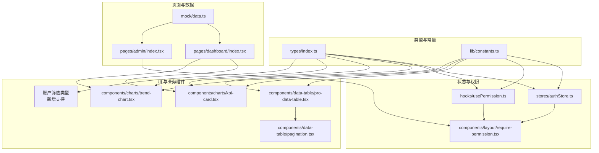
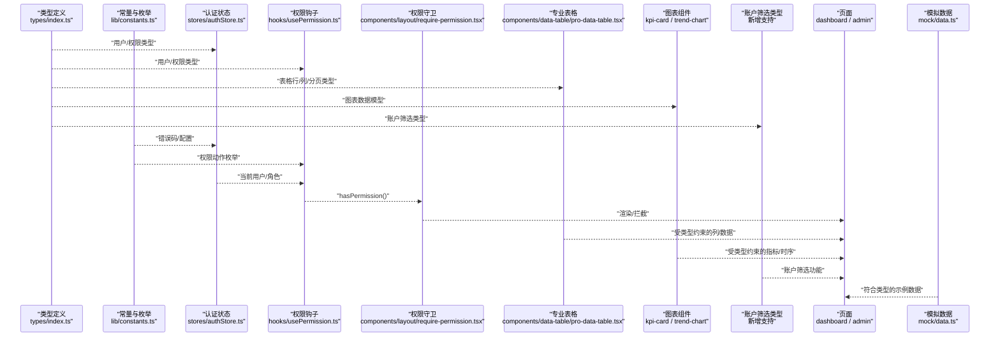
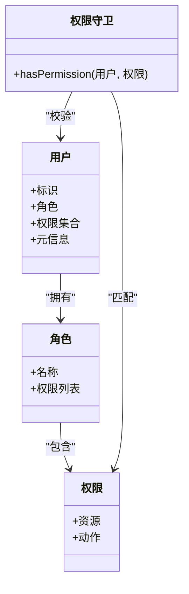
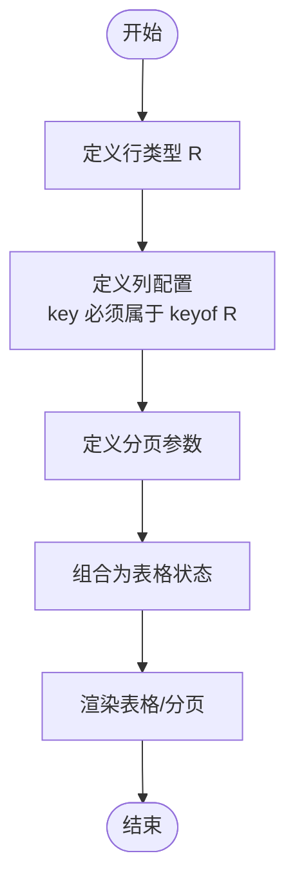
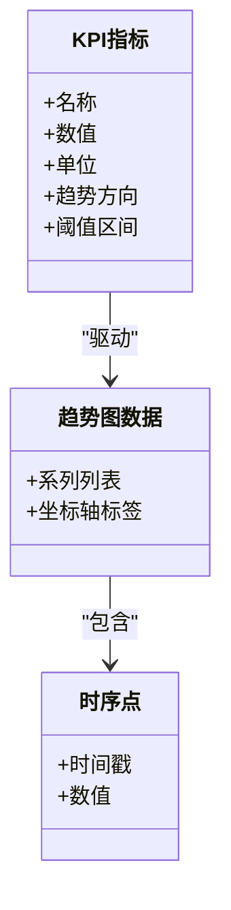
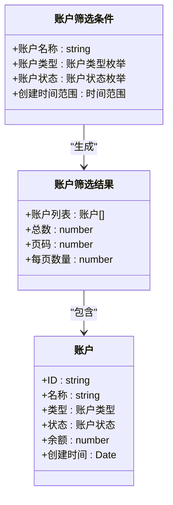
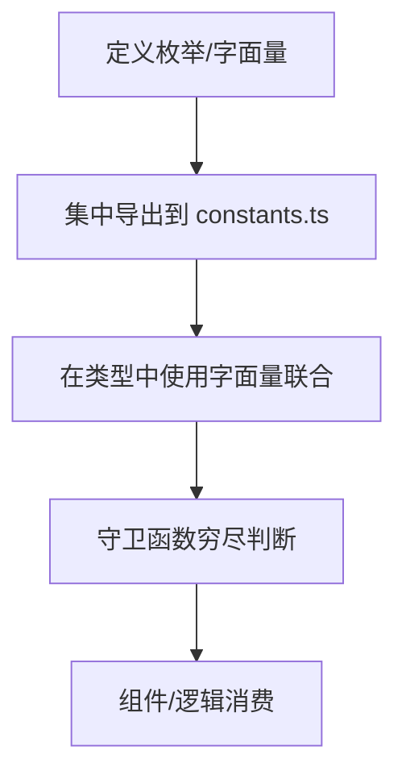
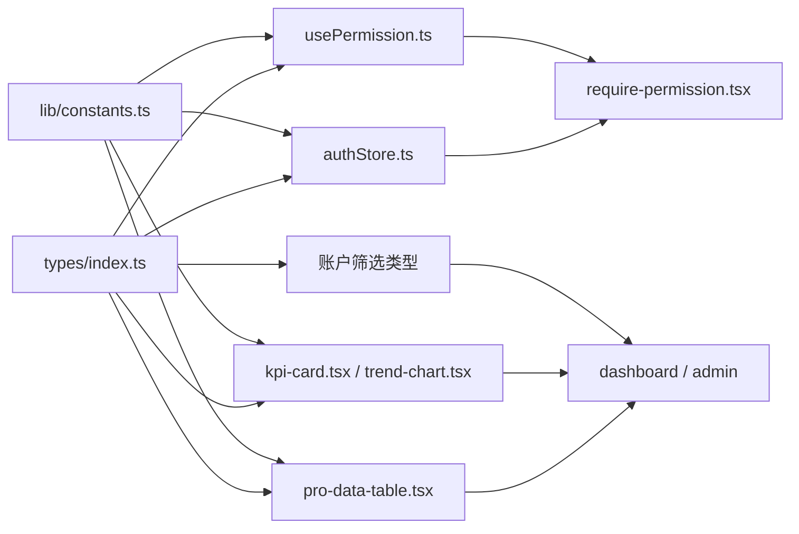

# 类型定义系统

<cite>
**本文引用的文件**   
- [web/src/types/index.ts](file://web/src/types/index.ts)
- [web/src/lib/constants.ts](file://web/src/lib/constants.ts)
- [web/src/stores/authStore.ts](file://web/src/stores/authStore.ts)
- [web/src/hooks/usePermission.ts](file://web/src/hooks/usePermission.ts)
- [web/src/components/layout/require-permission.tsx](file://web/src/components/layout/require-permission.tsx)
- [web/src/components/data-table/pro-data-table.tsx](file://web/src/components/data-table/pro-data-table.tsx)
- [web/src/components/data-table/pagination.tsx](file://web/src/components/data-table/pagination.tsx)
- [web/src/components/charts/kpi-card.tsx](file://web/src/components/charts/kpi-card.tsx)
- [web/src/components/charts/trend-chart.tsx](file://web/src/components/charts/trend-chart.tsx)
- [web/src/pages/dashboard/index.tsx](file://web/src/pages/dashboard/index.tsx)
- [web/src/pages/admin/index.tsx](file://web/src/pages/admin/index.tsx)
- [web/src/mock/data.ts](file://web/src/mock/data.ts)
- [web/tsconfig.json](file://web/tsconfig.json)
</cite>

## 更新摘要
**所做更改**
- 新增账户筛选功能类型定义支持
- 更新了核心组件分析章节以包含账户筛选相关类型
- 完善了依赖关系图和架构图以反映新的类型结构

## 目录
1. [简介](#简介)
2. [项目结构](#项目结构)
3. [核心组件](#核心组件)
4. [架构总览](#架构总览)
5. [详细组件分析](#详细组件分析)
6. [依赖分析](#依赖分析)
7. [性能考虑](#性能考虑)
8. [故障排查指南](#故障排查指南)
9. [结论](#结论)
10. [附录](#附录)

## 简介
本文件系统性梳理前端 TypeScript 类型定义体系，围绕接口规范、泛型与推导策略、核心数据模型（用户、权限、表格配置、图表数据、账户筛选）、常量管理（枚举、配置、错误码）、类型扩展与模块化组织、维护升级策略以及常见类型错误的排查方法展开。目标是帮助开发者在保持类型安全的前提下高效协作与演进。

## 项目结构
类型相关代码主要分布在以下位置：
- 类型集中定义：types 目录
- 常量与枚举：lib/constants.ts
- 状态与权限：stores/authStore.ts、hooks/usePermission.ts、components/layout/require-permission.tsx
- 通用 UI 与业务组件：data-table、charts 等
- 页面集成：pages/*
- 测试与 Mock：mock/data.ts、__tests__/*
- 构建与类型检查：tsconfig.json

图示来源
- [web/src/types/index.ts](file://web/src/types/index.ts)
- [web/src/lib/constants.ts](file://web/src/lib/constants.ts)
- [web/src/stores/authStore.ts](file://web/src/stores/authStore.ts)
- [web/src/hooks/usePermission.ts](file://web/src/hooks/usePermission.ts)
- [web/src/components/layout/require-permission.tsx](file://web/src/components/layout/require-permission.tsx)
- [web/src/components/data-table/pro-data-table.tsx](file://web/src/components/data-table/pro-data-table.tsx)
- [web/src/components/data-table/pagination.tsx](file://web/src/components/data-table/pagination.tsx)
- [web/src/components/charts/kpi-card.tsx](file://web/src/components/charts/kpi-card.tsx)
- [web/src/components/charts/trend-chart.tsx](file://web/src/components/charts/trend-chart.tsx)
- [web/src/pages/dashboard/index.tsx](file://web/src/pages/dashboard/index.tsx)
- [web/src/pages/admin/index.tsx](file://web/src/pages/admin/index.tsx)
- [web/src/mock/data.ts](file://web/src/mock/data.ts)

章节来源
- [web/src/types/index.ts](file://web/src/types/index.ts)
- [web/src/lib/constants.ts](file://web/src/lib/constants.ts)
- [web/src/stores/authStore.ts](file://web/src/stores/authStore.ts)
- [web/src/hooks/usePermission.ts](file://web/src/hooks/usePermission.ts)
- [web/src/components/layout/require-permission.tsx](file://web/src/components/layout/require-permission.tsx)
- [web/src/components/data-table/pro-data-table.tsx](file://web/src/components/data-table/pro-data-table.tsx)
- [web/src/components/data-table/pagination.tsx](file://web/src/components/data-table/pagination.tsx)
- [web/src/components/charts/kpi-card.tsx](file://web/src/components/charts/kpi-card.tsx)
- [web/src/components/charts/trend-chart.tsx](file://web/src/components/charts/trend-chart.tsx)
- [web/src/pages/dashboard/index.tsx](file://web/src/pages/dashboard/index.tsx)
- [web/src/pages/admin/index.tsx](file://web/src/pages/admin/index.tsx)
- [web/src/mock/data.ts](file://web/src/mock/data.ts)

## 核心组件
本节聚焦类型系统的"核心"：用户、权限、表格配置、图表数据、账户筛选等关键实体的类型设计与使用方式。

- 用户与权限模型
  - 用户实体包含基础标识、角色、权限集合等字段；权限模型以资源-动作维度描述访问控制；角色作为权限的聚合载体。
  - 推荐采用联合类型表达多态状态（如登录态、会话过期），条件类型用于根据角色或权限动态推断可用操作。
  - 建议将用户与权限类型集中在 types/index.ts 中导出，供 stores、hooks、组件统一消费。

- 表格配置与分页
  - 表格列配置通过泛型约束行数据类型，确保列键与行字段一致；排序、筛选、分页参数以独立接口表达，避免 any。
  - 分页状态与请求参数分离，便于复用与测试。

- 图表数据
  - KPI 卡片与趋势图的数据模型分别定义指标项与时间序列点，支持可选字段与默认值处理。
  - 通过映射类型对数值字段进行归一化或格式化，保证渲染层类型安全。

- **账户筛选类型（新增）**
  - 新增账户筛选相关的类型定义，支持按账户名称、类型、状态等多维度筛选。
  - 提供筛选条件的联合类型和条件类型，确保筛选逻辑的类型安全。
  - 与交易数据模型集成，支持账户级别的过滤和查询。

- 常量与错误码
  - 枚举用于稳定键空间（如权限动作、图表类型）；配置常量集中管理环境差异；错误码以字面量联合类型表达，配合守卫函数实现穷尽分支。

章节来源
- [web/src/types/index.ts](file://web/src/types/index.ts)
- [web/src/lib/constants.ts](file://web/src/lib/constants.ts)
- [web/src/components/data-table/pro-data-table.tsx](file://web/src/components/data-table/pro-data-table.tsx)
- [web/src/components/data-table/pagination.tsx](file://web/src/components/data-table/pagination.tsx)
- [web/src/components/charts/kpi-card.tsx](file://web/src/components/charts/kpi-card.tsx)
- [web/src/components/charts/trend-chart.tsx](file://web/src/components/charts/trend-chart.tsx)

## 架构总览
下图展示类型在各模块间的流转关系：类型定义位于中心，被状态、权限、组件、页面消费；常量与错误码贯穿各层；Mock 数据遵循同一类型契约，保障开发期一致性。

图示来源
- [web/src/types/index.ts](file://web/src/types/index.ts)
- [web/src/lib/constants.ts](file://web/src/lib/constants.ts)
- [web/src/stores/authStore.ts](file://web/src/stores/authStore.ts)
- [web/src/hooks/usePermission.ts](file://web/src/hooks/usePermission.ts)
- [web/src/components/layout/require-permission.tsx](file://web/src/components/layout/require-permission.tsx)
- [web/src/components/data-table/pro-data-table.tsx](file://web/src/components/data-table/pro-data-table.tsx)
- [web/src/components/charts/kpi-card.tsx](file://web/src/components/charts/kpi-card.tsx)
- [web/src/components/charts/trend-chart.tsx](file://web/src/components/charts/trend-chart.tsx)
- [web/src/pages/dashboard/index.tsx](file://web/src/pages/dashboard/index.tsx)
- [web/src/pages/admin/index.tsx](file://web/src/pages/admin/index.tsx)
- [web/src/mock/data.ts](file://web/src/mock/data.ts)

## 详细组件分析

### 用户与权限类型设计
- 设计要点
  - 用户模型：标识、角色、权限集合、元信息；提供只读视图与可写更新视图的区分。
  - 权限模型：资源 + 动作的二维矩阵；支持基于角色的快速判定。
  - 条件类型：根据用户角色推断可用操作集；联合类型表达多种会话状态。
  - 映射类型：从权限集合派生布尔开关对象，便于模板渲染。

图示来源
- [web/src/types/index.ts](file://web/src/types/index.ts)
- [web/src/stores/authStore.ts](file://web/src/stores/authStore.ts)
- [web/src/hooks/usePermission.ts](file://web/src/hooks/usePermission.ts)
- [web/src/components/layout/require-permission.tsx](file://web/src/components/layout/require-permission.tsx)

章节来源
- [web/src/types/index.ts](file://web/src/types/index.ts)
- [web/src/stores/authStore.ts](file://web/src/stores/authStore.ts)
- [web/src/hooks/usePermission.ts](file://web/src/hooks/usePermission.ts)
- [web/src/components/layout/require-permission.tsx](file://web/src/components/layout/require-permission.tsx)

### 表格配置与分页类型
- 设计要点
  - 泛型行类型 R：列键必须为 keyof R，避免越界访问。
  - 列配置：标题、键、是否可排序/筛选、渲染器类型。
  - 分页参数：页码、每页条数、总条数、排序字段与方向。
  - 组合类型：将列配置与分页参数组合为统一的表格状态。

图示来源
- [web/src/components/data-table/pro-data-table.tsx](file://web/src/components/data-table/pro-data-table.tsx)
- [web/src/components/data-table/pagination.tsx](file://web/src/components/data-table/pagination.tsx)

章节来源
- [web/src/components/data-table/pro-data-table.tsx](file://web/src/components/data-table/pro-data-table.tsx)
- [web/src/components/data-table/pagination.tsx](file://web/src/components/data-table/pagination.tsx)

### 图表数据模型
- 设计要点
  - KPI 指标：名称、数值、单位、趋势方向、阈值区间。
  - 时序数据：时间点与数值对的数组，支持可选的分组维度。
  - 映射类型：对数值字段做归一化或格式化，保证渲染层一致。

图示来源
- [web/src/components/charts/kpi-card.tsx](file://web/src/components/charts/kpi-card.tsx)
- [web/src/components/charts/trend-chart.tsx](file://web/src/components/charts/trend-chart.tsx)

章节来源
- [web/src/components/charts/kpi-card.tsx](file://web/src/components/charts/kpi-card.tsx)
- [web/src/components/charts/trend-chart.tsx](file://web/src/components/charts/trend-chart.tsx)

### **账户筛选类型（新增）**
- 设计要点
  - 账户筛选条件：支持按账户名称模糊搜索、账户类型筛选、账户状态过滤等多维度条件。
  - 筛选结果类型：定义筛选后的账户数据结构和分页信息。
  - 条件组合：使用联合类型和条件类型实现灵活的筛选条件组合。
  - 与交易系统集成：筛选结果可直接用于交易数据的过滤和展示。

图示来源
- [web/src/types/index.ts](file://web/src/types/index.ts)

章节来源
- [web/src/types/index.ts](file://web/src/types/index.ts)

### 常量与错误码管理
- 设计要点
  - 枚举：权限动作、图表类型、排序方向等稳定键空间。
  - 配置常量：主题、语言、功能开关等与环境无关的静态配置。
  - 错误码：字面量联合类型 + 守卫函数，确保穷尽分支与友好提示。

图示来源
- [web/src/lib/constants.ts](file://web/src/lib/constants.ts)

章节来源
- [web/src/lib/constants.ts](file://web/src/lib/constants.ts)

## 依赖分析
类型与常量的依赖关系如下：类型定义是核心依赖源，被状态、权限、组件、页面广泛消费；常量与错误码作为辅助依赖注入到各层。

图示来源
- [web/src/types/index.ts](file://web/src/types/index.ts)
- [web/src/lib/constants.ts](file://web/src/lib/constants.ts)
- [web/src/stores/authStore.ts](file://web/src/stores/authStore.ts)
- [web/src/hooks/usePermission.ts](file://web/src/hooks/usePermission.ts)
- [web/src/components/layout/require-permission.tsx](file://web/src/components/layout/require-permission.tsx)
- [web/src/components/data-table/pro-data-table.tsx](file://web/src/components/data-table/pro-data-table.tsx)
- [web/src/components/charts/kpi-card.tsx](file://web/src/components/charts/kpi-card.tsx)
- [web/src/components/charts/trend-chart.tsx](file://web/src/components/charts/trend-chart.tsx)
- [web/src/pages/dashboard/index.tsx](file://web/src/pages/dashboard/index.tsx)
- [web/src/pages/admin/index.tsx](file://web/src/pages/admin/index.tsx)

章节来源
- [web/src/types/index.ts](file://web/src/types/index.ts)
- [web/src/lib/constants.ts](file://web/src/lib/constants.ts)
- [web/src/stores/authStore.ts](file://web/src/stores/authStore.ts)
- [web/src/hooks/usePermission.ts](file://web/src/hooks/usePermission.ts)
- [web/src/components/layout/require-permission.tsx](file://web/src/components/layout/require-permission.tsx)
- [web/src/components/data-table/pro-data-table.tsx](file://web/src/components/data-table/pro-data-table.tsx)
- [web/src/components/charts/kpi-card.tsx](file://web/src/components/charts/kki-card.tsx)
- [web/src/components/charts/trend-chart.tsx](file://web/src/components/charts/trend-chart.tsx)
- [web/src/pages/dashboard/index.tsx](file://web/src/pages/dashboard/index.tsx)
- [web/src/pages/admin/index.tsx](file://web/src/pages/admin/index.tsx)

## 性能考虑
- 类型计算复杂度
  - 复杂条件类型与深度递归映射类型会增加编译时开销，建议在大型项目中拆分类型、减少不必要的嵌套。
- 泛型实例化成本
  - 表格泛型列配置应避免过度复杂的推导链，必要时引入中间类型简化推导。
- 运行时零开销
  - 类型系统在编译后不产生运行时代码，合理组织类型不会带来运行时性能影响。
- **账户筛选性能优化**
  - 筛选条件类型设计考虑了编译时优化，避免运行时类型检查开销。
  - 联合类型的使用确保了筛选逻辑的类型安全且性能最优。

[本节为通用指导，无需源码引用]

## 故障排查指南
- 常见类型错误
  - 属性不存在：检查列键是否为 keyof 行类型；确认导入的类型版本一致。
  - 联合类型不可分配：使用守卫函数收窄类型；为可选字段提供默认值或空对象。
  - 泛型推导失败：显式传入泛型参数或使用更具体的上下文类型。
- **账户筛选类型错误排查**
  - 筛选条件类型不匹配：检查筛选条件的联合类型是否正确组合。
  - 账户数据结构变更：确保账户类型定义与实际数据结构保持一致。
  - 筛选结果类型推导：验证筛选结果的类型推导是否符合预期。
- 调试技巧
  - 使用类型断言前的条件检查；利用 IDE 的悬停类型提示定位推导结果。
  - 将复杂类型拆分为中间类型并单独测试其推导行为。
  - 借助 Mock 数据验证类型与实际数据结构的一致性。

章节来源
- [web/src/mock/data.ts](file://web/src/mock/data.ts)
- [web/src/components/data-table/pro-data-table.tsx](file://web/src/components/data-table/pro-data-table.tsx)
- [web/src/components/charts/kpi-card.tsx](file://web/src/components/charts/kpi-card.tsx)
- [web/src/types/index.ts](file://web/src/types/index.ts)

## 结论
通过将用户、权限、表格、图表、账户筛选等核心实体的类型集中管理，并以常量与错误码作为稳定支撑，本项目实现了高内聚、低耦合的类型体系。结合泛型、联合与条件类型，既保证了类型安全，又提升了组件复用性与可维护性。新增的账户筛选类型进一步增强了系统的功能完整性和类型安全性。后续应持续优化复杂类型推导路径，完善类型测试与迁移策略，确保长期演进的稳定性。

[本节为总结性内容，无需源码引用]

## 附录

### 类型最佳实践清单
- 接口优先：对外暴露稳定的接口类型，内部实现细节隐藏。
- 联合与条件类型：用联合类型表达多态，用条件类型做分支推导。
- 映射类型：从已有类型派生新类型，减少重复定义。
- 常量与枚举：集中管理键空间，避免魔法字符串。
- 类型测试：为关键类型编写最小用例，确保推导正确。
- **账户筛选类型实践**：使用联合类型组合筛选条件，确保类型安全和性能。

[本节为通用指导，无需源码引用]

### 类型维护与升级策略
- 版本兼容性
  - 新增字段时保持向后兼容，旧字段标记可选并提供默认值。
  - 破坏性变更通过命名空间或版本后缀隔离，逐步迁移。
- 迁移指南
  - 分阶段替换旧类型，保留适配器类型桥接新旧接口。
  - 使用类型别名逐步过渡，最终移除废弃类型。
- 类型测试
  - 针对关键推导路径编写单测，覆盖边界与异常分支。
  - 在 CI 中加入类型检查与严格模式，防止退化。
- **账户筛选类型升级**
  - 新增筛选条件时保持向后兼容，确保现有筛选逻辑不受影响。
  - 提供类型迁移工具，帮助开发者平滑升级到新版本。

[本节为通用指导，无需源码引用]

### 类型导入导出与命名空间
- 导出策略
  - 按领域划分导出入口，避免一次性全量导出造成循环依赖。
- 命名空间
  - 对大型类型集合使用命名空间或模块级分组，提升可读性与查找效率。
- 第三方类型声明
  - 为外部库补充缺失的类型声明，尽量收敛至单一声明文件。
- **账户筛选类型导出**
  - 将账户筛选相关类型按功能模块分组导出，便于按需导入。
  - 提供统一的筛选类型入口，简化使用方式。

[本节为通用指导，无需源码引用]

### 构建与类型检查配置
- tsconfig.json 建议
  - 启用严格模式与无隐式 any；开启精确模块解析；合理设置目标与库。
  - 将类型定义与业务代码解耦，便于增量编译。

章节来源
- [web/tsconfig.json](file://web/tsconfig.json)