# 重分类系统

<cite>
**本文引用的文件**   
- [ReclassificationService.ts](file://server/src/services/ReclassificationService.ts)
- [ConsolidationService.ts](file://server/src/services/ConsolidationService.ts)
- [AggregationService.ts](file://server/src/services/AggregationService.ts)
- [data.ts](file://server/src/routes/data.ts)
- [schema.prisma](file://server/prisma/schema.prisma)
- [20260805100000_add_consolidation_adjustment/migration.sql](file://server/prisma/migrations/20260805100000_add_consolidation_adjustment/migration.sql)
- [auth.ts](file://server/src/middleware/auth.ts)
- [permission.ts](file://server/src/middleware/permission.ts)
- [scope.ts](file://server/src/middleware/scope.ts)
- [audit.ts](file://server/src/middleware/audit.ts)
- [error-handler.ts](file://server/src/middleware/error-handler.ts)
- [app.ts](file://server/src/app.ts)
- [reclassify-company-dialog.tsx](file://web/src/components/reclassify/reclassify-company-dialog.tsx)
- [reclassify-logs-panel.tsx](file://web/src/components/reclassify/reclassify-logs-panel.tsx)
- [reclassify-subject-dialog.tsx](file://web/src/components/reclassify/reclassify-subject-dialog.tsx)
- [consolidation-adjust-dialog.tsx](file://web/src/components/reclassify/consolidation-adjust-dialog.tsx)
- [consolidation-adjustments-panel.tsx](file://web/src/components/reclassify/consolidation-adjustments-panel.tsx)
- [api.ts](file://web/src/lib/api.ts)
</cite>

## 更新摘要
**所做更改**   
- 新增跨公司部分金额转账功能，支持不同公司间的资金调拨
- 增强科目重分类操作，提供更灵活的科目调整能力
- 新增API端点 /reclassify/subject 和 /reclassify/subject/preview，用于科目重分类预览和执行
- 实现完整的对话框界面，包括公司级重分类、科目重分类和日志查看功能
- 扩展重分类服务以支持更复杂的业务场景
- **新增** 在重分类期间添加撤销功能，支持状态管理和撤销操作
- **新增** 合并调整系统与重分类系统的深度集成，支持汇总抵消调整功能
- **新增** 汇总主体级别的内部交易抵消机制，解决集团内重复计算问题
- **新增** AggregationService中的合并调整数据聚合逻辑，支持多维度抵消计算

## 目录
1. [简介](#简介)
2. [项目结构](#项目结构)
3. [核心组件](#核心组件)
4. [架构总览](#架构总览)
5. [详细组件分析](#详细组件分析)
6. [依赖关系分析](#依赖关系分析)
7. [性能考量](#性能考量)
8. [故障排查指南](#故障排查指南)
9. [结论](#结论)
10. [附录](#附录)

## 简介
本仓库为"浙江壹品慧财年经营数据分析平台"的后端与前端实现，聚焦于财务数据的"Excel进、看板/报表出"。重分类系统是其中的关键能力之一，用于对交易明细的科目归属进行批量或单条调整，并记录审计日志。后端采用 Express + Prisma + PostgreSQL，中间件链包含鉴权、权限、数据范围、软删除与审计；计算类指标通过安全公式解析实现，AI 提供双管道（polish/analyze）支持。单位统一为万元/人民币。

**更新** 重分类系统现已大幅增强，支持跨公司部分金额转账、科目重分类操作以及新的API端点和完整的对话框界面。最新增强的撤销功能允许在重分类期间执行状态管理和撤销操作，进一步提升系统的灵活性和可靠性。**重大更新** 系统现已集成合并调整功能，支持汇总主体级别的内部交易抵消，解决集团内重复计算问题，为复杂的财务合并场景提供了强大的技术支持。

## 项目结构
- server：Express 后端服务，包含路由、中间件、服务层、Prisma 模型与迁移、脚本与测试等。
- web：React/Vite 前端，包含页面、组件、hooks、API 封装与工具库。
- docs：项目文档、规范与交接材料。

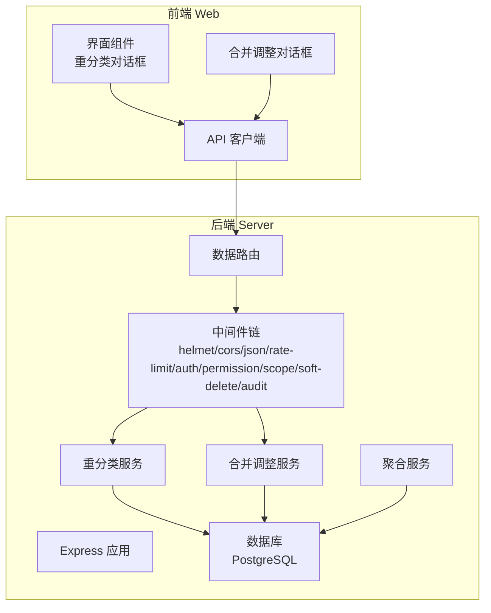

**图表来源**
- [app.ts](file://server/src/app.ts)
- [data.ts](file://server/src/routes/data.ts)
- [ReclassificationService.ts](file://server/src/services/ReclassificationService.ts)
- [ConsolidationService.ts](file://server/src/services/ConsolidationService.ts)
- [AggregationService.ts](file://server/src/services/AggregationService.ts)
- [schema.prisma](file://server/prisma/schema.prisma)

## 核心组件
- 重分类服务（ReclassificationService）：封装重分类的业务逻辑，包括校验、批量更新、事务控制、审计日志写入等。现已支持跨公司转账、科目重分类和撤销操作。
- **新增** 合并调整服务（ConsolidationService）：处理汇总主体级别的内部交易抵消，支持两个单体公司共同所属汇总主体的自动匹配和抵消金额叠加。
- **新增** 聚合服务增强（AggregationService）：在聚合计算中集成合并调整数据，支持多维度抵消计算和本期/同期/年初等不同时间维度的抵消逻辑。
- 数据路由（data.ts）：暴露重分类和合并调整相关的 HTTP 接口，挂载中间件链，调用服务层。新增 /consolidation/adjustments 相关端点。
- 数据模型与迁移（schema.prisma + migration.sql）：定义交易明细、重分类日志、合并调整表等表结构与字段约束。
- 中间件链：确保请求经过安全与合规处理（鉴权、权限、范围、软删除、审计）。
- 前端重分类组件：提供公司级重分类、科目重分类操作与日志查看交互。
- **新增** 前端合并调整组件：提供汇总抵消调整的完整用户界面，包括两个单体公司的选择、汇总主体匹配、抵消设置等功能。

**更新** 新增了合并调整对话框组件、增强的重分类服务功能和撤销操作能力，以及与聚合服务的深度集成。

## 架构总览
重分类流程从前端发起，经后端路由进入中间件链，最终由服务层完成数据变更与审计记录。合并调整流程则专注于汇总主体级别的数据调整，不影响单体报表。

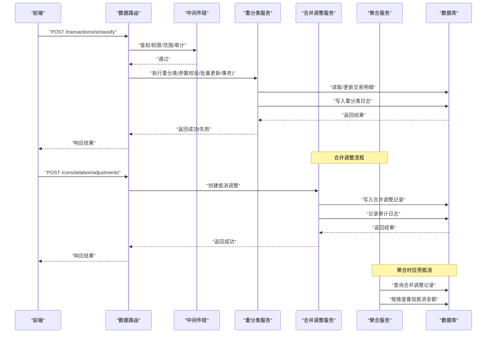

**图表来源**
- [data.ts](file://server/src/routes/data.ts)
- [ReclassificationService.ts](file://server/src/services/ReclassificationService.ts)
- [ConsolidationService.ts](file://server/src/services/ConsolidationService.ts)
- [AggregationService.ts](file://server/src/services/AggregationService.ts)
- [schema.prisma](file://server/prisma/schema.prisma)
- [20260805100000_add_consolidation_adjustment/migration.sql](file://server/prisma/migrations/20260805100000_add_consolidation_adjustment/migration.sql)

## 详细组件分析

### 重分类服务（ReclassificationService）
- 职责
  - 接收重分类请求参数并进行校验（如公司、科目、期间、金额等）。
  - 在事务中批量更新交易明细的科目归属。
  - 记录重分类审计日志，便于追溯与复盘。
  - 返回标准化响应，包含受影响行数与错误信息。
  - **新增** 支持跨公司部分金额转账功能。
  - **新增** 支持科目重分类操作和预览功能。
  - **新增** 支持重分类期间的撤销操作和状态管理。
- 关键点
  - 使用 Prisma 事务保证一致性。
  - 结合权限与范围中间件，确保仅可操作授权范围内的数据。
  - 审计日志写入需与业务更新在同一事务内，避免不一致。
  - **新增** 跨公司转账时需要进行额外的权限验证和数据完整性检查。
  - **新增** 撤销操作需要维护完整的事务状态和回滚机制。

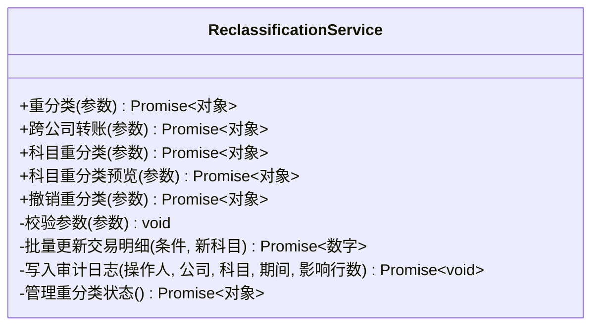

**图表来源**
- [ReclassificationService.ts](file://server/src/services/ReclassificationService.ts)

**章节来源**
- [ReclassificationService.ts](file://server/src/services/ReclassificationService.ts)

### **新增** 合并调整服务（ConsolidationService）
- 职责
  - 处理汇总主体级别的内部交易抵消调整。
  - 自动匹配两个单体公司共同所属的汇总主体。
  - 在汇总口径上叠加抵消金额，不影响单体报表。
  - 支持软删除撤销机制，删除即恢复原口径。
  - 记录完整的审计日志和操作上下文。
- 核心功能
  - `commonSummariesOf()`：解析两个单体公司共同所属的汇总主体，考虑权限过滤。
  - `createAdjustment()`：创建抵消调整记录，包含完整的参数校验和权限验证。
  - `listAdjustments()`：分页查询抵消调整记录，支持数据范围过滤。
  - `deleteAdjustment()`：软删除撤销抵消调整，同时记录审计日志。
- 关键特性
  - 严格的参数校验：期间格式、金额非零、科目类型验证。
  - 完整的数据权限控制：汇总主体必须被完整授权。
  - 智能的汇总主体匹配：基于 company_aggregation_map 自动计算交集。
  - 多维度抵消支持：本期实际、本年累计、同期实际、同期累计等不同时间维度。

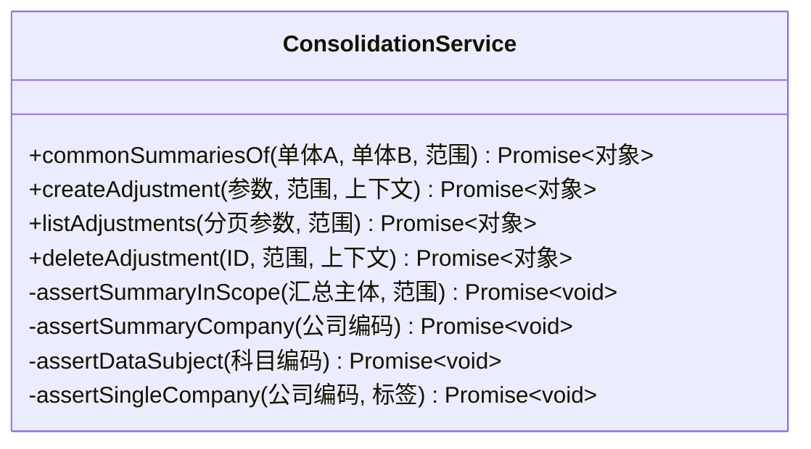

**图表来源**
- [ConsolidationService.ts](file://server/src/services/ConsolidationService.ts)

**章节来源**
- [ConsolidationService.ts](file://server/src/services/ConsolidationService.ts)

### **新增** 聚合服务增强（AggregationService）
- 职责
  - 在构建经营指标树时集成合并调整数据。
  - 按不同时间维度应用抵消金额：本期、本年累计、同期、同期累计。
  - 确保抵消逻辑与财务合并准则一致。
  - 支持软删除的撤销机制，删除记录立即生效。
- 核心逻辑
  - 在 `buildOperatingTree()` 方法中集成合并调整查询。
  - 根据抵消期间与应用期间的关系，将抵消金额应用到相应的维度。
  - 本期实际：直接应用当期抵消金额。
  - 本年累计：应用财年起始至当期的所有抵消金额。
  - 同期实际：应用去年同期抵消金额。
  - 同期累计：应用上年财年起始至去年同期的抵消金额。
- 关键特性
  - 四维度统一叠加：确保同比口径的可比性。
  - 软删除支持：deletedAt 字段控制抵消记录的生效状态。
  - 索引优化：针对汇总主体、模板类型、期间、科目的复合索引。

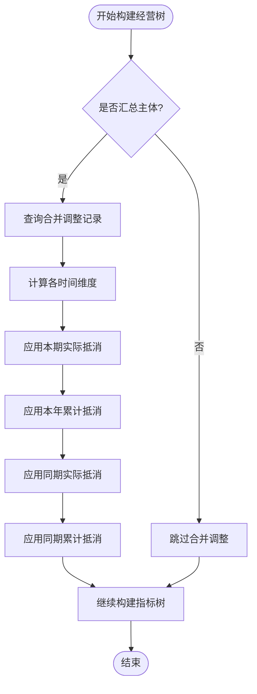

**图表来源**
- [AggregationService.ts](file://server/src/services/AggregationService.ts)

**章节来源**
- [AggregationService.ts](file://server/src/services/AggregationService.ts)

### 数据路由（data.ts）
- 职责
  - 暴露重分类和合并调整相关接口（如批量重分类、查询重分类日志、合并调整CRUD等）。
  - 挂载中间件链，确保请求安全与合规。
  - 调用服务层执行业务逻辑并返回响应。
- 关键点
  - 参数校验与错误处理。
  - 与权限、范围、审计中间件协作。
  - 统一的响应格式与错误码。
  - **新增** /consolidation/adjustments 端点用于合并调整CRUD操作。
  - **新增** /consolidation/common-summaries 端点用于汇总主体匹配。
  - **新增** 撤销重分类的API端点。

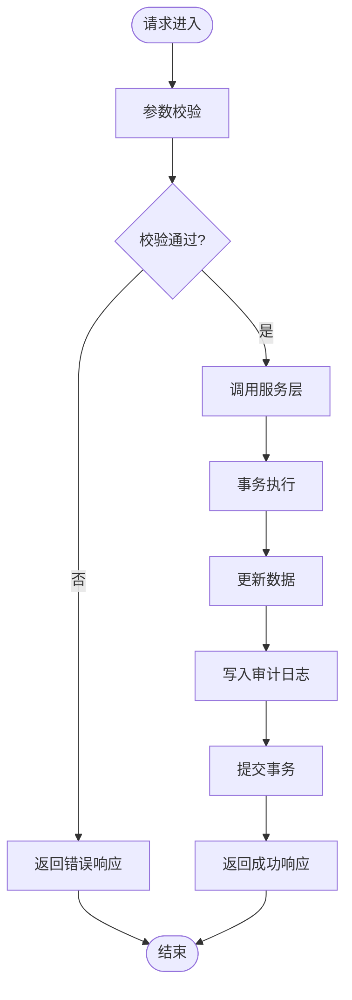

**图表来源**
- [data.ts](file://server/src/routes/data.ts)
- [ReclassificationService.ts](file://server/src/services/ReclassificationService.ts)
- [ConsolidationService.ts](file://server/src/services/ConsolidationService.ts)

**章节来源**
- [data.ts](file://server/src/routes/data.ts)

### 数据模型与迁移（schema.prisma + migration.sql）
- 交易明细表
  - 关键字段：公司、科目、期间、金额、币种、创建/更新时间等。
  - 索引策略：按公司、期间、科目建立常用查询索引以提升性能。
- 重分类日志表
  - 关键字段：操作人、公司、原科目、新科目、期间、影响行数、时间戳等。
  - 约束：外键关联用户与公司，确保可追溯性。
- **新增** 合并调整表
  - 关键字段：汇总主体、科目、期间、抵消金额、原因、创建/更新时间、软删除标记等。
  - 索引策略：针对汇总主体、模板类型、期间、科目的复合索引优化查询性能。
  - 约束：确保仅汇总主体可进行抵消调整，金额非零验证。
- 迁移
  - 新增重分类日志表的迁移脚本，确保数据库结构与代码一致。
  - **新增** 支持撤销操作的数据库结构变更。
  - **新增** 合并调整表的完整迁移脚本，包含索引和约束定义。

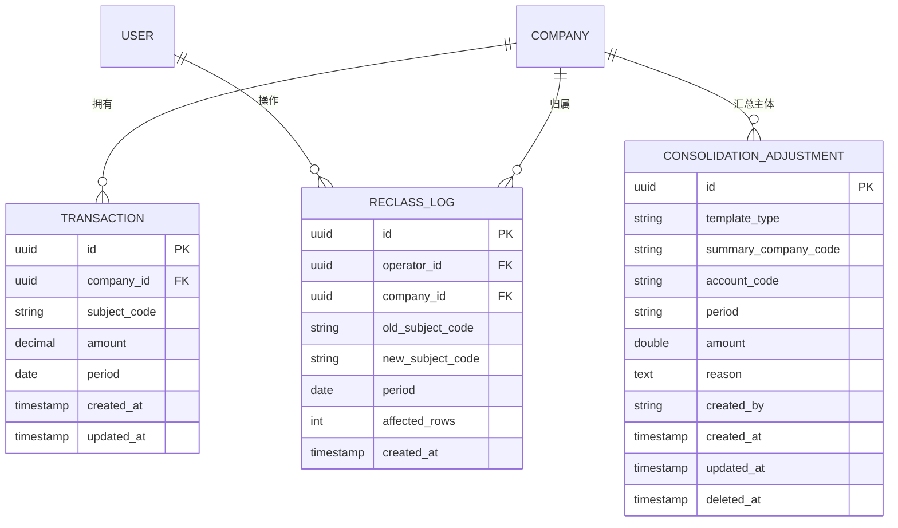

**图表来源**
- [schema.prisma](file://server/prisma/schema.prisma)
- [20260805100000_add_consolidation_adjustment/migration.sql](file://server/prisma/migrations/20260805100000_add_consolidation_adjustment/migration.sql)

**章节来源**
- [schema.prisma](file://server/prisma/schema.prisma)
- [20260805100000_add_consolidation_adjustment/migration.sql](file://server/prisma/migrations/20260805100000_add_consolidation_adjustment/migration.sql)

### 中间件链（auth → permission → scope → softDelete → audit）
- 鉴权（auth.ts）
  - JWT 验证 access token，刷新机制轮转 refresh token。
  - 黑名单检查防止已失效令牌继续使用。
- 权限（permission.ts）
  - 默认拒绝策略，显式放行所需权限。
- 范围（scope.ts）
  - 基于 Prisma extension 注入数据范围过滤，确保仅访问授权实体。
- 软删除（softDelete）
  - 查询自动排除已删除记录，写操作标记删除而非物理删除。
- 审计（audit.ts）
  - 记录关键操作的上下文（用户、IP、路径、耗时等），供后续审计与分析。

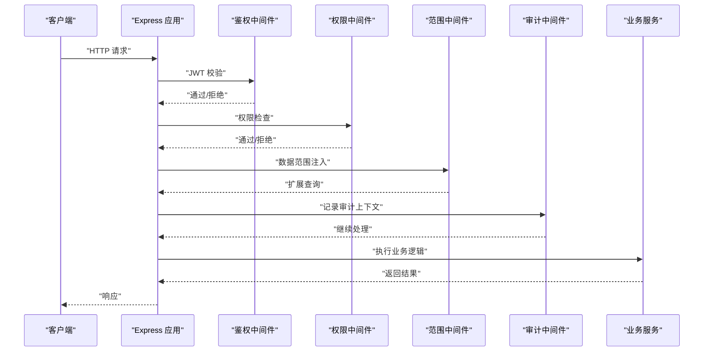

**图表来源**
- [auth.ts](file://server/src/middleware/auth.ts)
- [permission.ts](file://server/src/middleware/permission.ts)
- [scope.ts](file://server/src/middleware/scope.ts)
- [audit.ts](file://server/src/middleware/audit.ts)
- [app.ts](file://server/src/app.ts)

**章节来源**
- [auth.ts](file://server/src/middleware/auth.ts)
- [permission.ts](file://server/src/middleware/permission.ts)
- [scope.ts](file://server/src/middleware/scope.ts)
- [audit.ts](file://server/src/middleware/audit.ts)
- [app.ts](file://server/src/app.ts)

### 前端重分类组件
- 公司级重分类对话框（reclassify-company-dialog.tsx）
  - 选择公司、科目、期间，提交批量重分类请求。
  - 展示操作进度与结果反馈。
- 科目重分类对话框（reclassify-subject-dialog.tsx）
  - **新增** 提供科目重分类操作界面，支持预览和确认。
  - 显示重分类影响分析和风险提示。
- 重分类日志面板（reclassify-logs-panel.tsx）
  - 查询并展示历史重分类记录，支持筛选与导出。
  - **新增** 支持撤销操作的查看和管理。

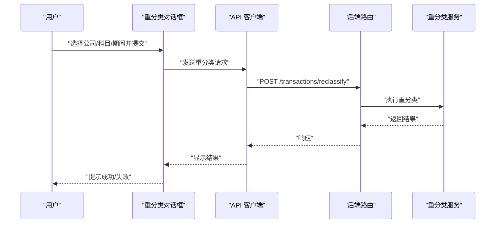

**图表来源**
- [reclassify-company-dialog.tsx](file://web/src/components/reclassify/reclassify-company-dialog.tsx)
- [reclassify-subject-dialog.tsx](file://web/src/components/reclassify/reclassify-subject-dialog.tsx)
- [reclassify-logs-panel.tsx](file://web/src/components/reclassify/reclassify-logs-panel.tsx)
- [api.ts](file://web/src/lib/api.ts)
- [data.ts](file://server/src/routes/data.ts)
- [ReclassificationService.ts](file://server/src/services/ReclassificationService.ts)

**章节来源**
- [reclassify-company-dialog.tsx](file://web/src/components/reclassify/reclassify-company-dialog.tsx)
- [reclassify-subject-dialog.tsx](file://web/src/components/reclassify/reclassify-subject-dialog.tsx)
- [reclassify-logs-panel.tsx](file://web/src/components/reclassify/reclassify-logs-panel.tsx)
- [api.ts](file://web/src/lib/api.ts)

### **新增** 前端合并调整组件
- 汇总抵消调整对话框（consolidation-adjust-dialog.tsx）
  - **新增** 提供完整的汇总抵消调整操作流程。
  - 支持两个单体公司的选择和自动匹配共同汇总主体。
  - 提供科目选择、期间设置、金额输入和原因填写。
  - 实时验证和错误提示，确保数据完整性。
  - 支持多汇总主体的批量创建操作。
- 汇总抵消调整记录面板（consolidation-adjustments-panel.tsx）
  - **新增** 分页展示汇总口径的抵消调整历史。
  - 支持行点击展开查看调整原因和生效范围。
  - 提供撤销功能，删除即恢复原汇总口径。
  - 显示操作人和时间戳等详细信息。

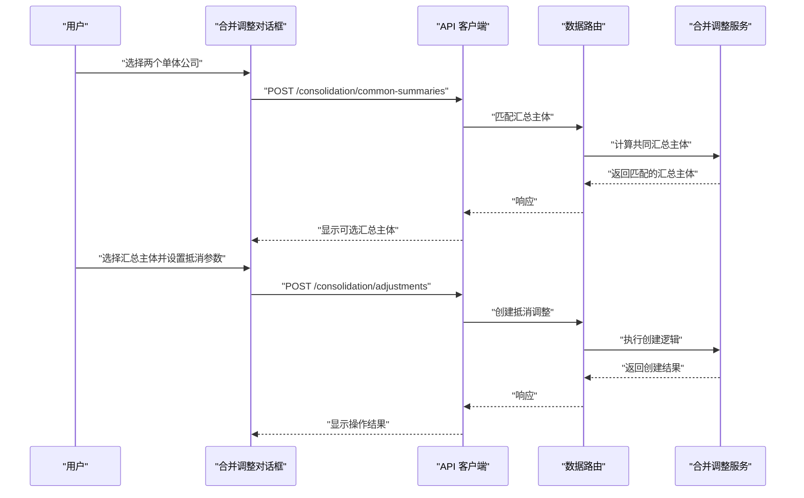

**图表来源**
- [consolidation-adjust-dialog.tsx](file://web/src/components/reclassify/consolidation-adjust-dialog.tsx)
- [consolidation-adjustments-panel.tsx](file://web/src/components/reclassify/consolidation-adjustments-panel.tsx)
- [api.ts](file://web/src/lib/api.ts)
- [data.ts](file://server/src/routes/data.ts)
- [ConsolidationService.ts](file://server/src/services/ConsolidationService.ts)

**章节来源**
- [consolidation-adjust-dialog.tsx](file://web/src/components/reclassify/consolidation-adjust-dialog.tsx)
- [consolidation-adjustments-panel.tsx](file://web/src/components/reclassify/consolidation-adjustments-panel.tsx)
- [api.ts](file://web/src/lib/api.ts)

## 依赖关系分析
- 路由依赖中间件链，确保请求安全与合规。
- 服务层依赖 Prisma 客户端与数据库，执行数据变更与审计日志写入。
- 前端依赖 API 客户端与后端路由，完成交互与数据获取。
- **新增** 合并调整服务依赖聚合服务进行数据整合。
- **新增** 聚合服务依赖合并调整数据进行抵消计算。

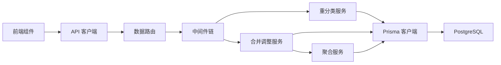

**图表来源**
- [data.ts](file://server/src/routes/data.ts)
- [ReclassificationService.ts](file://server/src/services/ReclassificationService.ts)
- [ConsolidationService.ts](file://server/src/services/ConsolidationService.ts)
- [AggregationService.ts](file://server/src/services/AggregationService.ts)
- [schema.prisma](file://server/prisma/schema.prisma)

**章节来源**
- [data.ts](file://server/src/routes/data.ts)
- [ReclassificationService.ts](file://server/src/services/ReclassificationService.ts)
- [ConsolidationService.ts](file://server/src/services/ConsolidationService.ts)
- [AggregationService.ts](file://server/src/services/AggregationService.ts)
- [schema.prisma](file://server/prisma/schema.prisma)

## 性能考量
- 批量更新与事务
  - 使用 Prisma 事务减少往返次数，提升一致性。
  - 合理拆分批次，避免单次事务过大导致锁竞争。
- 索引优化
  - 针对公司、期间、科目的查询建立复合索引，提升扫描效率。
  - **新增** 合并调整表的复合索引：`(summary_company_code, template_type, period, account_code)`。
- 中间件开销
  - 鉴权与权限检查尽量缓存必要信息，减少重复计算。
- 审计日志
  - 异步写入或批量落盘，降低主流程延迟。
- **新增** 跨公司转账优化
  - 预验证目标公司存在性和权限，避免无效事务。
  - 使用批量操作减少数据库往返次数。
- **新增** 撤销操作优化
  - 使用增量撤销策略，避免全量回滚的性能问题。
  - 缓存重分类状态，提高撤销操作响应速度。
- **新增** 合并调整性能优化
  - 聚合查询时使用有效的 where 条件过滤已删除记录。
  - 批量加载用户、公司、科目信息减少 N+1 查询问题。
  - 利用数据库索引优化合并调整记录的查询性能。

## 故障排查指南
- 常见错误
  - 鉴权失败：检查 JWT 是否过期、是否在黑名单。
  - 权限不足：确认当前用户具备重分类权限。
  - 数据范围限制：确认操作的公司与期间在授权范围内。
  - 事务失败：检查并发冲突与约束违反。
  - **新增** 跨公司转账失败：检查目标公司权限和余额充足性。
  - **新增** 科目重分类失败：检查科目层级关系和会计规则。
  - **新增** 撤销操作失败：检查重分类状态和事务完整性。
  - **新增** 合并调整失败：检查汇总主体权限、科目类型和期间格式。
  - **新增** 汇总主体匹配失败：检查 company_aggregation_map 配置和数据权限。
- 定位方法
  - 查看审计日志，确认操作上下文与影响行数。
  - 检查错误处理中间件的堆栈与错误码。
  - 使用 Prisma 查询日志定位 SQL 问题。
  - **新增** 检查跨公司转账的权限验证日志。
  - **新增** 验证科目重分类的会计规则检查结果。
  - **新增** 监控撤销操作的状态流转和事务日志。
  - **新增** 检查合并调整的权限验证和汇总主体匹配日志。
  - **新增** 验证聚合服务中的抵消计算逻辑和数据一致性。

**章节来源**
- [error-handler.ts](file://server/src/middleware/error-handler.ts)
- [audit.ts](file://server/src/middleware/audit.ts)
- [auth.ts](file://server/src/middleware/auth.ts)
- [permission.ts](file://server/src/middleware/permission.ts)
- [scope.ts](file://server/src/middleware/scope.ts)

## 结论
重分类系统以清晰的分层架构与严格的中间件链保障数据安全与合规。通过事务与审计日志确保变更可追溯，结合索引与批处理优化性能。前端提供直观的操作界面与日志查看能力，满足内部管理口径的财务数据处理需求。

**更新** 随着跨公司转账、科目重分类和撤销操作等新功能的加入，系统现在能够处理更复杂的财务场景，为企业集团内部的资金调拨、科目调整和状态管理提供了强大的技术支持。**重大更新** 合并调整系统的集成进一步增强了系统的财务处理能力，通过汇总主体级别的内部交易抵消机制，有效解决了集团内重复计算问题，为复杂的财务合并场景提供了完整的技术解决方案。撤销功能的引入和聚合服务的深度集成，使系统具备了更强的数据处理能力和更高的灵活性。

## 附录
- 技术栈
  - 后端：Express 4 + Prisma 5 + PostgreSQL 15 + JWT + DeepSeek API（SSE 流式）
  - 前端：React + Vite + Tailwind
- 单位与口径
  - 金额单位：万元/人民币
  - 指标计算：安全公式解析（白名单算子），同比/环比实时计算
- AI 双管道
  - polish：文本→脱敏→LLM→还原
  - analyze：结构化→计算→脱敏→LLM→生成
- **新增功能特性**
  - 跨公司部分金额转账：支持不同公司间的资金调拨，带完整权限验证
  - 科目重分类：灵活的科目调整功能，支持预览和确认流程
  - 撤销操作：支持重分类期间的状态管理和撤销功能
  - 增强API端点：/reclassify/subject 和 /reclassify/subject/preview
  - 完整对话框界面：公司级重分类、科目重分类和日志查看功能
  - 状态管理：完善的撤销操作状态跟踪和事务管理
  - **新增** 合并调整系统：汇总主体级别的内部交易抵消，支持多维度计算
  - **新增** 自动汇总主体匹配：基于 company_aggregation_map 的智能匹配算法
  - **新增** 聚合服务集成：在数据聚合过程中自动应用抵消调整
  - **新增** 软删除撤销机制：删除抵消记录即可恢复原汇总口径
  - **新增** 完整的前端界面：汇总抵消调整对话框和记录管理面板