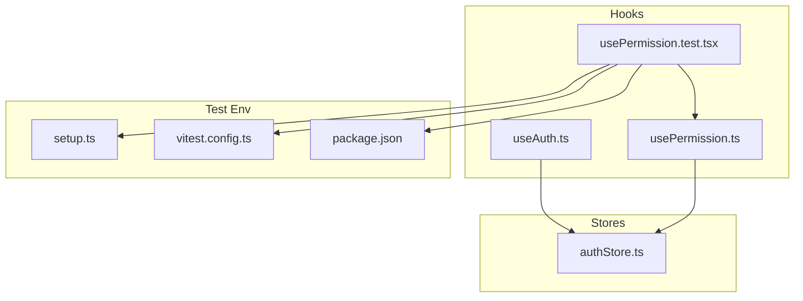
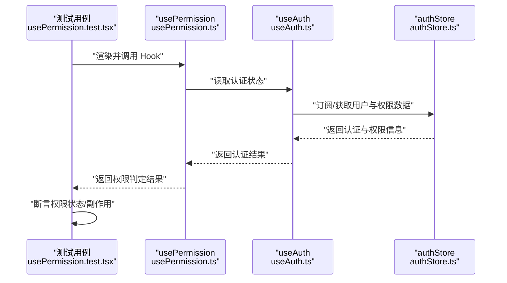
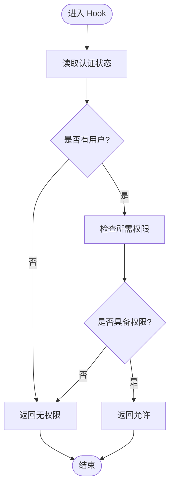
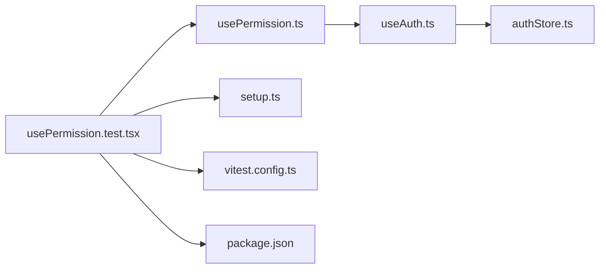

# Hooks测试

<cite>
**本文引用的文件**   
- [useAuth.ts](file://web/src/hooks/useAuth.ts)
- [usePermission.ts](file://web/src/hooks/usePermission.ts)
- [usePermission.test.tsx](file://web/src/hooks/__tests__/usePermission.test.tsx)
- [authStore.ts](file://web/src/stores/authStore.ts)
- [setup.ts](file://web/src/test/setup.ts)
- [vitest.config.ts](file://web/vitest.config.ts)
- [package.json](file://web/package.json)
</cite>

## 目录
1. [简介](#简介)
2. [项目结构](#项目结构)
3. [核心组件](#核心组件)
4. [架构总览](#架构总览)
5. [详细组件分析](#详细组件分析)
6. [依赖分析](#依赖分析)
7. [性能考虑](#性能考虑)
8. [故障排查指南](#故障排查指南)
9. [结论](#结论)
10. [附录](#附录)

## 简介
本指南聚焦于使用 @testing-library/react-hooks 对 React Hooks 进行单元测试，覆盖内置 Hook（useState、useEffect、useContext）与自定义 Hook 的测试方法。文档以仓库中的 useAuth 认证 Hook 与 usePermission 权限 Hook 为例，系统讲解状态管理、副作用处理、异步场景（Promise、定时器、网络请求模拟）以及调试技巧与常见问题解决方案，帮助读者高效构建稳定可靠的 Hook 测试体系。

## 项目结构
本项目采用按功能域组织的方式：
- hooks：存放业务 Hook，如 useAuth、usePermission，并配套 __tests__ 目录放置对应测试用例。
- stores：集中状态存储（例如 authStore），供 Hook 消费。
- test：全局测试环境配置（setup.ts）。
- vitest.config.ts：Vitest 运行配置。
- package.json：依赖声明与脚本入口。

图表来源
- [useAuth.ts:1-200](file://web/src/hooks/useAuth.ts#L1-L200)
- [usePermission.ts:1-200](file://web/src/hooks/usePermission.ts#L1-L200)
- [usePermission.test.tsx:1-200](file://web/src/hooks/__tests__/usePermission.test.tsx#L1-L200)
- [authStore.ts:1-200](file://web/src/stores/authStore.ts#L1-L200)
- [setup.ts:1-200](file://web/src/test/setup.ts#L1-L200)
- [vitest.config.ts:1-200](file://web/vitest.config.ts#L1-L200)
- [package.json:1-200](file://web/package.json#L1-L200)

章节来源
- [useAuth.ts:1-200](file://web/src/hooks/useAuth.ts#L1-L200)
- [usePermission.ts:1-200](file://web/src/hooks/usePermission.ts#L1-L200)
- [usePermission.test.tsx:1-200](file://web/src/hooks/__tests__/usePermission.test.tsx#L1-L200)
- [authStore.ts:1-200](file://web/src/stores/authStore.ts#L1-L200)
- [setup.ts:1-200](file://web/src/test/setup.ts#L1-L200)
- [vitest.config.ts:1-200](file://web/vitest.config.ts#L1-L200)
- [package.json:1-200](file://web/package.json#L1-L200)

## 核心组件
本节围绕两个关键 Hook 展开：
- useAuth：封装认证相关状态与行为，通常基于 authStore 提供登录态、用户信息、登出等能力。
- usePermission：基于当前认证状态与权限模型，提供权限判定能力，常用于路由守卫或按钮级权限控制。

测试要点
- 状态变化：验证初始状态、登录后状态、登出后状态。
- 副作用：监听依赖变化触发副作用（如刷新权限缓存、记录日志）。
- 上下文/外部依赖：通过 mock 替换 authStore 或权限服务，确保可重复性。
- 异步流程：Promise 解析、定时器、网络请求的模拟与断言。

章节来源
- [useAuth.ts:1-200](file://web/src/hooks/useAuth.ts#L1-L200)
- [usePermission.ts:1-200](file://web/src/hooks/usePermission.ts#L1-L200)
- [authStore.ts:1-200](file://web/src/stores/authStore.ts#L1-L200)

## 架构总览
下图展示了认证与权限在 Hook 层与 Store 层的交互关系，以及测试侧如何注入依赖与断言结果。

图表来源
- [usePermission.ts:1-200](file://web/src/hooks/usePermission.ts#L1-L200)
- [useAuth.ts:1-200](file://web/src/hooks/useAuth.ts#L1-L200)
- [authStore.ts:1-200](file://web/src/stores/authStore.ts#L1-L200)
- [usePermission.test.tsx:1-200](file://web/src/hooks/__tests__/usePermission.test.tsx#L1-L200)

## 详细组件分析

### useAuth 认证 Hook 测试
目标
- 验证初始未登录态、成功登录态、失败态、登出态的状态流转。
- 验证副作用（如刷新权限缓存、上报埋点）是否按预期执行。
- 验证异步错误路径（网络异常、服务端错误码）的处理。

建议策略
- 使用 @testing-library/react-hooks 提供的 renderHook 与 act 包装状态更新。
- 通过 mock authStore 暴露的接口，控制用户信息与权限集合。
- 针对 Promise 分支，使用 jest.fn().mockResolvedValue / mockRejectedValue 或等价实现。
- 针对定时器，使用 advanceTimersByTime 或等价机制推进时间并断言。

示例断言方向
- 初始状态为未登录；调用登录成功后，状态切换为已登录且包含用户信息。
- 登出后，状态恢复为未登录，相关缓存清理。
- 登录失败时，错误信息正确设置，UI 可据此提示。

章节来源
- [useAuth.ts:1-200](file://web/src/hooks/useAuth.ts#L1-L200)
- [authStore.ts:1-200](file://web/src/stores/authStore.ts#L1-L200)

### usePermission 权限 Hook 测试
目标
- 验证不同用户角色与权限集合下的权限判定结果。
- 验证当认证状态变化时，权限结果是否正确重新计算。
- 验证权限变更触发的副作用（如刷新菜单、重定向）是否执行。

建议策略
- 通过 mock authStore 注入不同的用户与权限组合。
- 使用 renderHook 传入所需参数，断言返回值中 isAllowed、requiredPermissions 等字段。
- 结合 require-permission 组件（若存在）进行集成式断言，观察渲染差异。

示例断言方向
- 拥有指定权限时，isAllowed 为真；缺失时，为假。
- 切换用户后，权限结果随之更新。
- 无权限时，触发降级逻辑（如隐藏按钮或跳转登录页）。

章节来源
- [usePermission.ts:1-200](file://web/src/hooks/usePermission.ts#L1-L200)
- [usePermission.test.tsx:1-200](file://web/src/hooks/__tests__/usePermission.test.tsx#L1-L200)
- [authStore.ts:1-200](file://web/src/stores/authStore.ts#L1-L200)

### 内置 Hook 测试要点（useState、useEffect、useContext）
- useState
  - 使用 renderHook 获取 setter，调用后断言 state 变化。
  - 使用 act 包裹异步更新，确保状态同步到组件树。
- useEffect
  - 断言副作用的执行时机与清理函数。
  - 通过 mock 外部依赖（如 API、定时器）隔离副作用。
- useContext
  - 使用 Provider 包裹被测 Hook，注入上下文值，断言 Hook 对上下文的响应。

章节来源
- [usePermission.test.tsx:1-200](file://web/src/hooks/__tests__/usePermission.test.tsx#L1-L200)

### 异步 Hooks 测试策略
- Promise 处理
  - 使用 mockResolvedValue/mockRejectedValue 控制成功与失败分支。
  - 使用 flushPromises 或等待 resolve 后再断言。
- 定时器
  - 使用 fake timers 推进时间，断言周期性副作用。
- 网络请求
  - 拦截 fetch/XMLHttpRequest 或使用工具库（如 msw）模拟后端响应。
  - 断言重试、超时、错误码处理路径。

章节来源
- [usePermission.test.tsx:1-200](file://web/src/hooks/__tests__/usePermission.test.tsx#L1-L200)
- [setup.ts:1-200](file://web/src/test/setup.ts#L1-L200)
- [vitest.config.ts:1-200](file://web/vitest.config.ts#L1-L200)

### 流程图：权限判定主流程

图表来源
- [usePermission.ts:1-200](file://web/src/hooks/usePermission.ts#L1-L200)
- [useAuth.ts:1-200](file://web/src/hooks/useAuth.ts#L1-L200)

## 依赖分析
- usePermission 依赖 useAuth 提供的认证状态。
- useAuth 依赖 authStore 的用户与权限数据。
- 测试用例通过 setup.ts 与 vitest.config.ts 初始化测试环境，并通过 package.json 引入依赖与脚本。

图表来源
- [usePermission.test.tsx:1-200](file://web/src/hooks/__tests__/usePermission.test.tsx#L1-L200)
- [usePermission.ts:1-200](file://web/src/hooks/usePermission.ts#L1-L200)
- [useAuth.ts:1-200](file://web/src/hooks/useAuth.ts#L1-L200)
- [authStore.ts:1-200](file://web/src/stores/authStore.ts#L1-L200)
- [setup.ts:1-200](file://web/src/test/setup.ts#L1-L200)
- [vitest.config.ts:1-200](file://web/vitest.config.ts#L1-L200)
- [package.json:1-200](file://web/package.json#L1-L200)

章节来源
- [usePermission.test.tsx:1-200](file://web/src/hooks/__tests__/usePermission.test.tsx#L1-L200)
- [usePermission.ts:1-200](file://web/src/hooks/usePermission.ts#L1-L200)
- [useAuth.ts:1-200](file://web/src/hooks/useAuth.ts#L1-L200)
- [authStore.ts:1-200](file://web/src/stores/authStore.ts#L1-L200)
- [setup.ts:1-200](file://web/src/test/setup.ts#L1-L200)
- [vitest.config.ts:1-200](file://web/vitest.config.ts#L1-L200)
- [package.json:1-200](file://web/package.json#L1-L200)

## 性能考虑
- 避免不必要的重渲染：合理拆分依赖，减少 Hook 返回值粒度。
- 使用 useMemo/useCallback 优化昂贵计算与回调引用稳定性。
- 在测试中尽量最小化渲染范围，仅挂载必要组件或 Hook。
- 批量更新：将多个状态更新合并，减少多次 re-render。
- 异步操作节流/防抖：在高频事件下保护性能。

[本节为通用指导，不直接分析具体文件]

## 故障排查指南
常见问题与定位思路
- 状态未更新
  - 确认是否在 act 中执行了状态更新。
  - 检查 Promise 是否已 resolve，必要时等待或 flush。
- 副作用未触发
  - 确认依赖数组是否包含所有必要依赖。
  - 检查外部依赖是否被正确 mock。
- 定时器问题
  - 确认是否启用 fake timers，并使用 advance 推进时间。
- 网络请求失败
  - 检查拦截器是否正确返回期望响应。
  - 断言错误分支与重试逻辑。

章节来源
- [usePermission.test.tsx:1-200](file://web/src/hooks/__tests__/usePermission.test.tsx#L1-L200)
- [setup.ts:1-200](file://web/src/test/setup.ts#L1-L200)
- [vitest.config.ts:1-200](file://web/vitest.config.ts#L1-L200)

## 结论
通过对 useAuth 与 usePermission 的系统测试设计与实践，可以建立高可信度的 Hook 测试体系。结合 @testing-library/react-hooks 的能力，配合合理的依赖注入与异步处理策略，能够覆盖复杂业务场景，提升代码质量与迭代效率。

[本节为总结性内容，不直接分析具体文件]

## 附录
- 推荐测试清单
  - 初始状态、正常路径、异常路径、边界条件。
  - 副作用执行顺序与清理。
  - 异步分支与并发场景。
- 常用工具与技巧
  - renderHook、act、waitFor、flushPromises、fake timers。
  - 依赖注入与 mock 策略。
  - 可视化断言与快照对比（谨慎使用）。

[本节为补充说明，不直接分析具体文件]