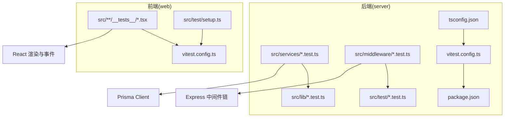
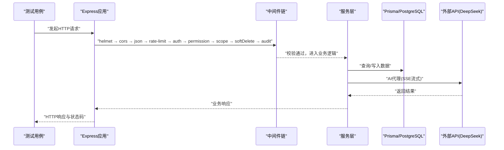
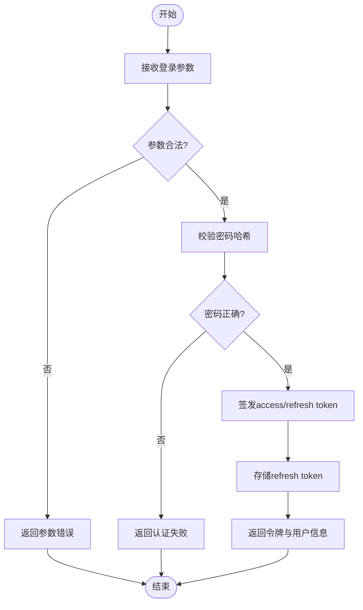
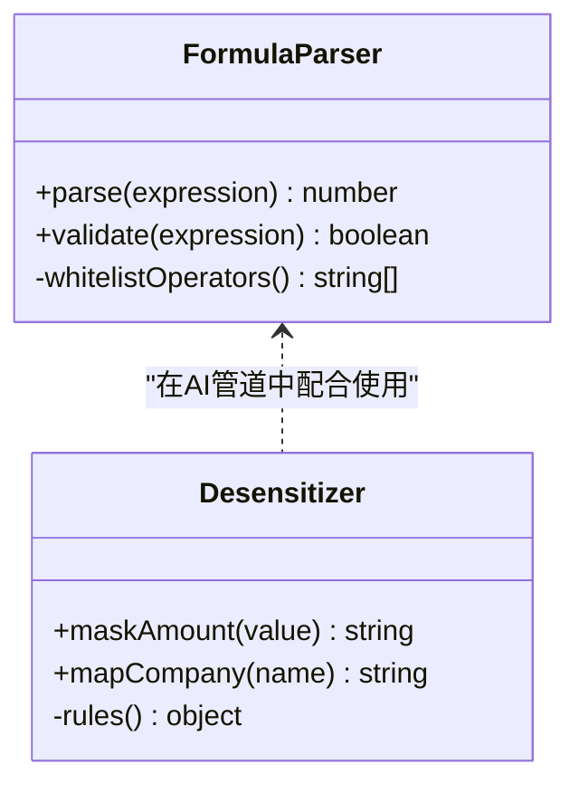
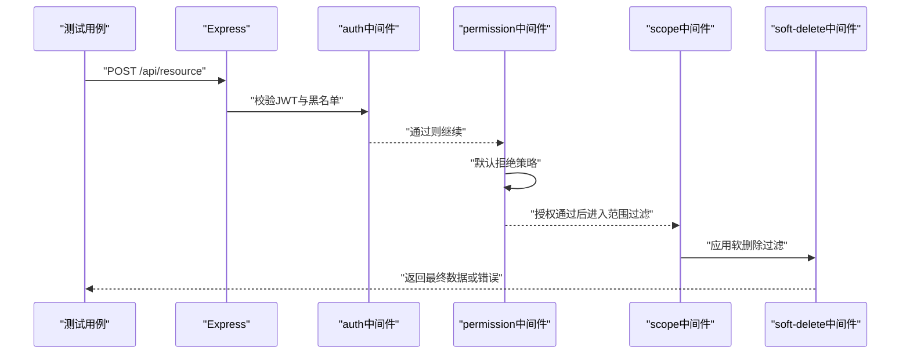
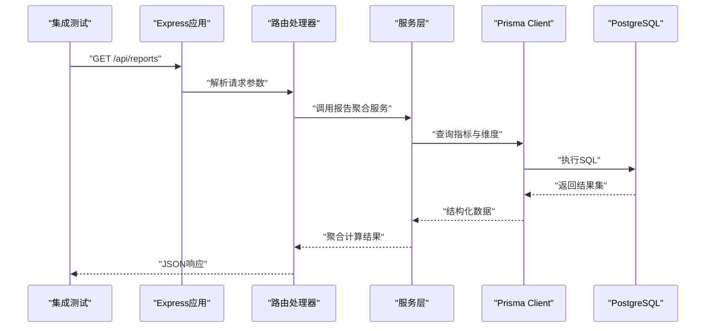
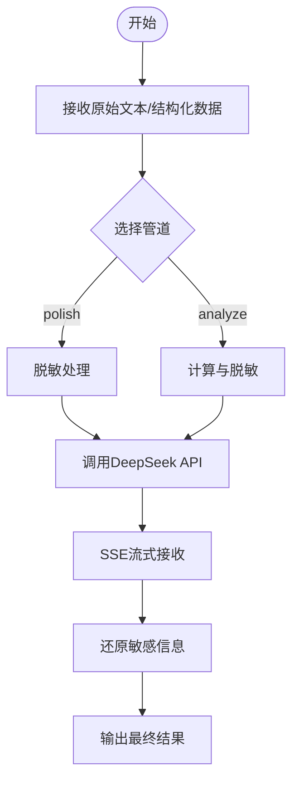
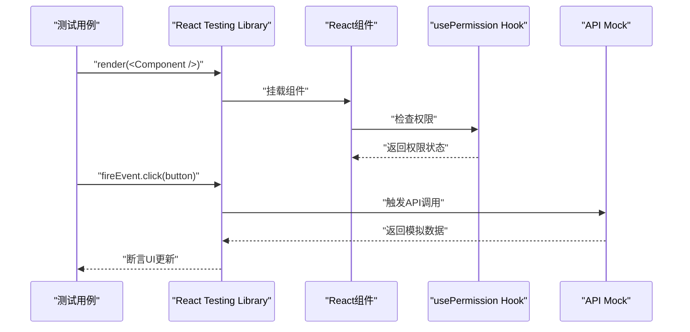
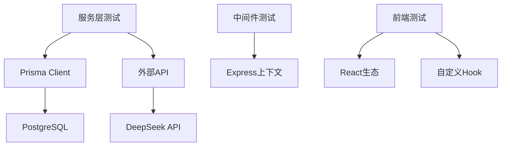

# 单元测试

<cite>
**本文引用的文件**   
- [vitest.config.ts](file://server/vitest.config.ts)
- [package.json](file://server/package.json)
- [tsconfig.json](file://server/tsconfig.json)
- [app.test.ts](file://server/src/app.test.ts)
- [setup.ts](file://server/src/test/setup.ts)
- [integration.test.ts](file://server/src/test/integration.test.ts)
- [integration-crud.test.ts](file://server/src/test/integration-crud.test.ts)
- [reports-http.test.ts](file://server/src/test/reports-http.test.ts)
- [ai-http.test.ts](file://server/src/test/ai-http.test.ts)
- [AuthService.test.ts](file://server/src/services/AuthService.test.ts)
- [DataService.test.ts](file://server/src/services/DataService.test.ts)
- [ImportService.test.ts](file://server/src/services/ImportService.test.ts)
- [ReportService.test.ts](file://server/src/services/ReportService.test.ts)
- [FormulaRuleService.test.ts](file://server/src/services/FormulaRuleService.test.ts)
- [SubjectAnalysisService.test.ts](file://server/src/services/SubjectAnalysisService.test.ts)
- [AggregationService.calc.test.ts](file://server/src/services/AggregationService.calc.test.ts)
- [AggregationService.static.test.ts](file://server/src/services/AggregationService.static.test.ts)
- [AggregationService.ytd.test.ts](file://server/src/services/AggregationService.ytd.test.ts)
- [AIProxyService.test.ts](file://server/src/services/AIProxyService.test.ts)
- [auth.test.ts](file://server/src/middleware/auth.test.ts)
- [permission.test.ts](file://server/src/middleware/permission.test.ts)
- [scope.test.ts](file://server/src/middleware/scope.test.ts)
- [soft-delete.test.ts](file://server/src/middleware/soft-delete.test.ts)
- [desensitize.test.ts](file://server/src/lib/desensitize.test.ts)
- [excel-import.test.ts](file://server/src/lib/excel-import.test.ts)
- [formula.test.ts](file://server/src/lib/formula.test.ts)
- [jwt.test.ts](file://server/src/lib/jwt.test.ts)
- [metric-values.test.ts](file://server/src/lib/metric-values.test.ts)
- [password.test.ts](file://server/src/lib/password.test.ts)
- [period.test.ts](file://server/src/lib/period.test.ts)
- [prompt-guard.test.ts](file://server/src/lib/prompt-guard.test.ts)
- [sanitize.test.ts](file://server/src/lib/sanitize.test.ts)
- [data-table.test.tsx](file://web/src/components/data-table/__tests__/data-table.test.tsx)
- [require-permission.test.tsx](file://web/src/components/layout/__tests__/require-permission.test.tsx)
- [usePermission.test.tsx](file://web/src/hooks/__tests__/usePermission.test.tsx)
- [setup.ts](file://web/src/test/setup.ts)
- [vitest.config.ts](file://web/vitest.config.ts)
</cite>

## 目录
1. [简介](#简介)
2. [项目结构](#项目结构)
3. [核心组件](#核心组件)
4. [架构总览](#架构总览)
5. [详细组件分析](#详细组件分析)
6. [依赖分析](#依赖分析)
7. [性能考虑](#性能考虑)
8. [故障排查指南](#故障排查指南)
9. [结论](#结论)
10. [附录](#附录)

## 简介
本文件面向FY200项目的测试工程师与开发者，系统化阐述如何使用Vitest框架编写高质量的单元测试、集成测试与前端组件测试。内容覆盖：
- 服务层函数、工具类方法与中间件的测试策略
- Mock数据创建与管理（数据库、外部API、文件系统）
- 异步代码测试（Promise、错误处理）
- React组件渲染与用户交互模拟
- 覆盖率要求、命名规范与代码组织模式
- 边界条件、异常场景与性能优化用例示例

后端技术栈为Express + Prisma + PostgreSQL + JWT + DeepSeek API（SSE流式），中间件执行链顺序固定，计算指标采用安全公式解析，AI双管道架构包含脱敏与还原流程。

## 项目结构
FY200项目在后端server与前端web两个子工程内分别配置了Vitest环境，测试文件按功能域与层次组织：
- server/src/**/*.test.ts：服务层、工具库、中间件与HTTP集成测试
- server/src/test/*：端到端与集成测试套件
- web/src/**/__tests__/*：React组件与Hook的单元测试
- vitest.config.ts：前后端测试运行器配置
- setup.ts：测试环境初始化（如Mock、全局钩子）

图表来源
- [vitest.config.ts](file://server/vitest.config.ts)
- [package.json](file://server/package.json)
- [tsconfig.json](file://server/tsconfig.json)
- [vitest.config.ts](file://web/vitest.config.ts)

章节来源
- [vitest.config.ts](file://server/vitest.config.ts)
- [package.json](file://server/package.json)
- [tsconfig.json](file://server/tsconfig.json)
- [vitest.config.ts](file://web/vitest.config.ts)

## 核心组件
- 测试运行器与配置
  - Vitest配置文件用于定义测试环境、匹配规则、覆盖率与Mock策略
  - 前后端各自维护独立的vitest.config.ts与setup.ts
- 测试套件分类
  - 单元层：lib工具方法、服务层函数、中间件逻辑
  - 集成层：HTTP路由与服务协作、数据库交互
  - 前端层：组件渲染、Hook行为、用户交互模拟
- 关键测试文件
  - 服务层：AuthService、DataService、ImportService、ReportService、FormulaRuleService、SubjectAnalysisService、AggregationService、AIProxyService
  - 工具库：desensitize、excel-import、formula、jwt、metric-values、password、period、prompt-guard、sanitize
  - 中间件：auth、permission、scope、soft-delete
  - HTTP集成：reports-http、ai-http、integration、integration-crud
  - 前端：data-table、require-permission、usePermission

章节来源
- [AuthService.test.ts](file://server/src/services/AuthService.test.ts)
- [DataService.test.ts](file://server/src/services/DataService.test.ts)
- [ImportService.test.ts](file://server/src/services/ImportService.test.ts)
- [ReportService.test.ts](file://server/src/services/ReportService.test.ts)
- [FormulaRuleService.test.ts](file://server/src/services/FormulaRuleService.test.ts)
- [SubjectAnalysisService.test.ts](file://server/src/services/SubjectAnalysisService.test.ts)
- [AggregationService.calc.test.ts](file://server/src/services/AggregationService.calc.test.ts)
- [AggregationService.static.test.ts](file://server/src/services/AggregationService.static.test.ts)
- [AggregationService.ytd.test.ts](file://server/src/services/AggregationService.ytd.test.ts)
- [AIProxyService.test.ts](file://server/src/services/AIProxyService.test.ts)
- [desensitize.test.ts](file://server/src/lib/desensitize.test.ts)
- [excel-import.test.ts](file://server/src/lib/excel-import.test.ts)
- [formula.test.ts](file://server/src/lib/formula.test.ts)
- [jwt.test.ts](file://server/src/lib/jwt.test.ts)
- [metric-values.test.ts](file://server/src/lib/metric-values.test.ts)
- [password.test.ts](file://server/src/lib/password.test.ts)
- [period.test.ts](file://server/src/lib/period.test.ts)
- [prompt-guard.test.ts](file://server/src/lib/prompt-guard.test.ts)
- [sanitize.test.ts](file://server/src/lib/sanitize.test.ts)
- [auth.test.ts](file://server/src/middleware/auth.test.ts)
- [permission.test.ts](file://server/src/middleware/permission.test.ts)
- [scope.test.ts](file://server/src/middleware/scope.test.ts)
- [soft-delete.test.ts](file://server/src/middleware/soft-delete.test.ts)
- [reports-http.test.ts](file://server/src/test/reports-http.test.ts)
- [ai-http.test.ts](file://server/src/test/ai-http.test.ts)
- [integration.test.ts](file://server/src/test/integration.test.ts)
- [integration-crud.test.ts](file://server/src/test/integration-crud.test.ts)
- [data-table.test.tsx](file://web/src/components/data-table/__tests__/data-table.test.tsx)
- [require-permission.test.tsx](file://web/src/components/layout/__tests__/require-permission.test.tsx)
- [usePermission.test.tsx](file://web/src/hooks/__tests__/usePermission.test.tsx)

## 架构总览
测试架构围绕“隔离、可重复、快速反馈”的原则构建：
- 单元测试：对纯函数、工具方法、服务内部逻辑进行断言，使用Mock隔离外部依赖
- 集成测试：通过HTTP客户端调用路由，验证中间件链、权限控制、范围过滤与软删除
- 前端测试：基于React Testing Library与Vitest，模拟渲染与用户交互，断言UI状态变化

图表来源
- [integration.test.ts](file://server/src/test/integration.test.ts)
- [reports-http.test.ts](file://server/src/test/reports-http.test.ts)
- [ai-http.test.ts](file://server/src/test/ai-http.test.ts)

章节来源
- [integration.test.ts](file://server/src/test/integration.test.ts)
- [reports-http.test.ts](file://server/src/test/reports-http.test.ts)
- [ai-http.test.ts](file://server/src/test/ai-http.test.ts)

## 详细组件分析

### 服务层测试策略（以AuthService为例）
- 目标：验证JWT签发、刷新、黑名单校验、密码哈希等核心流程
- 策略：
  - 使用Mock替换Prisma Client与第三方库（如bcrypt、jsonwebtoken）
  - 构造不同输入（有效/无效令牌、过期时间、黑名单条目）
  - 断言返回值结构与错误类型
- 典型场景：
  - 成功登录并签发access token与refresh token
  - refresh token轮转与旧token加入黑名单
  - 非法或过期token拒绝访问
  - 密码哈希与比对正确性

图表来源
- [AuthService.test.ts](file://server/src/services/AuthService.test.ts)

章节来源
- [AuthService.test.ts](file://server/src/services/AuthService.test.ts)

### 工具库测试（以formula与desensitize为例）
- formula：安全公式解析（白名单算子+括号），禁止eval；需覆盖边界表达式、非法字符、除零、溢出
- desensitize：金额区间化与公司名动态映射；需覆盖空值、特殊字符、映射缺失

图表来源
- [formula.test.ts](file://server/src/lib/formula.test.ts)
- [desensitize.test.ts](file://server/src/lib/desensitize.test.ts)

章节来源
- [formula.test.ts](file://server/src/lib/formula.test.ts)
- [desensitize.test.ts](file://server/src/lib/desensitize.test.ts)

### 中间件测试（auth、permission、scope、soft-delete）
- 目标：确保中间件链按序执行，权限默认拒绝，范围过滤生效，软删除记录不可见
- 策略：
  - 构造不同请求头（Authorization、Scope、X-Soft-Delete）
  - 断言响应状态码与错误消息
  - 验证Prisma扩展注入是否生效

图表来源
- [auth.test.ts](file://server/src/middleware/auth.test.ts)
- [permission.test.ts](file://server/src/middleware/permission.test.ts)
- [scope.test.ts](file://server/src/middleware/scope.test.ts)
- [soft-delete.test.ts](file://server/src/middleware/soft-delete.test.ts)

章节来源
- [auth.test.ts](file://server/src/middleware/auth.test.ts)
- [permission.test.ts](file://server/src/middleware/permission.test.ts)
- [scope.test.ts](file://server/src/middleware/scope.test.ts)
- [soft-delete.test.ts](file://server/src/middleware/soft-delete.test.ts)

### 集成测试（HTTP路由与数据库交互）
- 目标：验证完整请求链路，包括中间件、服务、Prisma与数据库
- 策略：
  - 使用supertest或内置HTTP客户端发起真实请求
  - 准备测试数据库种子数据（seed）
  - 断言响应体、状态码与数据库变更

图表来源
- [integration.test.ts](file://server/src/test/integration.test.ts)
- [integration-crud.test.ts](file://server/src/test/integration-crud.test.ts)
- [reports-http.test.ts](file://server/src/test/reports-http.test.ts)

章节来源
- [integration.test.ts](file://server/src/test/integration.test.ts)
- [integration-crud.test.ts](file://server/src/test/integration-crud.test.ts)
- [reports-http.test.ts](file://server/src/test/reports-http.test.ts)

### AI代理测试（AIProxyService与SSE流式）
- 目标：验证polish与analyze双管道、脱敏与还原、SSE流式响应
- 策略：
  - Mock外部LLM接口，模拟延迟、错误与流式分片
  - 断言脱敏规则应用与还原逻辑
  - 验证SSE事件序列与终止条件

图表来源
- [AIProxyService.test.ts](file://server/src/services/AIProxyService.test.ts)
- [ai-http.test.ts](file://server/src/test/ai-http.test.ts)

章节来源
- [AIProxyService.test.ts](file://server/src/services/AIProxyService.test.ts)
- [ai-http.test.ts](file://server/src/test/ai-http.test.ts)

### 前端组件测试（React与Hook）
- 目标：验证组件渲染、用户交互、权限控制与Hook状态
- 策略：
  - 使用React Testing Library渲染组件
  - 模拟用户事件（点击、输入、选择）
  - 断言DOM变化与状态更新
  - Mock API调用与权限上下文

图表来源
- [data-table.test.tsx](file://web/src/components/data-table/__tests__/data-table.test.tsx)
- [require-permission.test.tsx](file://web/src/components/layout/__tests__/require-permission.test.tsx)
- [usePermission.test.tsx](file://web/src/hooks/__tests__/usePermission.test.tsx)

章节来源
- [data-table.test.tsx](file://web/src/components/data-table/__tests__/data-table.test.tsx)
- [require-permission.test.tsx](file://web/src/components/layout/__tests__/require-permission.test.tsx)
- [usePermission.test.tsx](file://web/src/hooks/__tests__/usePermission.test.tsx)

## 依赖分析
- 模块耦合度
  - 服务层依赖Prisma与外部API，测试中通过Mock隔离
  - 中间件依赖Express上下文与权限模型，测试中构造最小请求对象
  - 前端组件依赖React生态与自定义Hook，测试中使用RTL与Mock
- 外部依赖
  - PostgreSQL：集成测试使用本地或内存数据库
  - DeepSeek API：AI管道测试使用Mock模拟SSE流
  - JWT与bcrypt：认证测试使用Mock避免真实加密开销

图表来源
- [AuthService.test.ts](file://server/src/services/AuthService.test.ts)
- [AIProxyService.test.ts](file://server/src/services/AIProxyService.test.ts)
- [auth.test.ts](file://server/src/middleware/auth.test.ts)
- [data-table.test.tsx](file://web/src/components/data-table/__tests__/data-table.test.tsx)

章节来源
- [AuthService.test.ts](file://server/src/services/AuthService.test.ts)
- [AIProxyService.test.ts](file://server/src/services/AIProxyService.test.ts)
- [auth.test.ts](file://server/src/middleware/auth.test.ts)
- [data-table.test.tsx](file://web/src/components/data-table/__tests__/data-table.test.tsx)

## 性能考虑
- 测试速度优化
  - 使用内存数据库或SQLite替代PostgreSQL进行单元测试
  - Mock耗时操作（网络IO、加密、文件读写）
  - 并行执行测试套件，合理拆分测试文件
- 资源管理
  - 在beforeEach/afterEach中清理Mock与数据库状态
  - 避免全局状态污染，确保测试独立性
- 覆盖率目标
  - 行覆盖率≥80%，分支覆盖率≥70%
  - 关键路径（认证、权限、公式解析、AI管道）覆盖率≥90%

[本节为通用指导，不直接分析具体文件]

## 故障排查指南
- 常见问题
  - 数据库连接失败：检查测试环境配置与种子数据
  - Mock未生效：确认spyOn或mockImplementation调用时机
  - 异步测试超时：增加timeout或正确处理Promise
  - 前端渲染错误：检查RTL配置与组件依赖Mock
- 调试技巧
  - 使用console.log或日志库输出中间状态
  - 缩小测试范围，定位问题用例
  - 查看Vitest报告中的堆栈与断言失败详情

章节来源
- [setup.ts](file://server/src/test/setup.ts)
- [setup.ts](file://web/src/test/setup.ts)

## 结论
FY200项目的测试体系以Vitest为核心，覆盖后端服务、工具库、中间件与前端组件。通过合理的Mock策略、清晰的测试分层与严格的覆盖率要求，确保代码质量与系统稳定性。建议持续完善边界条件与异常场景用例，优化测试性能，提升开发效率。

[本节为总结性内容，不直接分析具体文件]

## 附录
- 测试命名规范
  - 文件名：*.test.ts或*.test.tsx
  - 描述块：describe("模块名", ...)
  - 用例名：it("应...")或test("应...", ...)
- 代码组织模式
  - 单元层：src/**/*.test.ts
  - 集成层：src/test/*.test.ts
  - 前端层：src/**/__tests__/*.tsx
- 覆盖率配置
  - 在vitest.config.ts中启用coverage选项
  - 设置阈值与排除文件

[本节为通用指导，不直接分析具体文件]