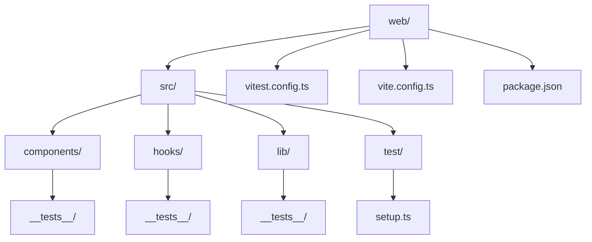
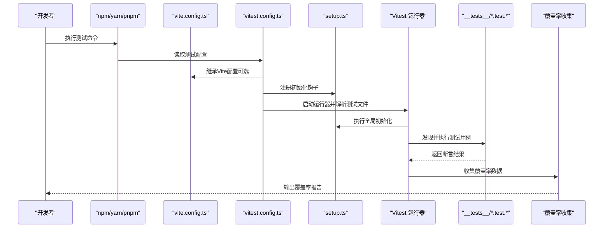
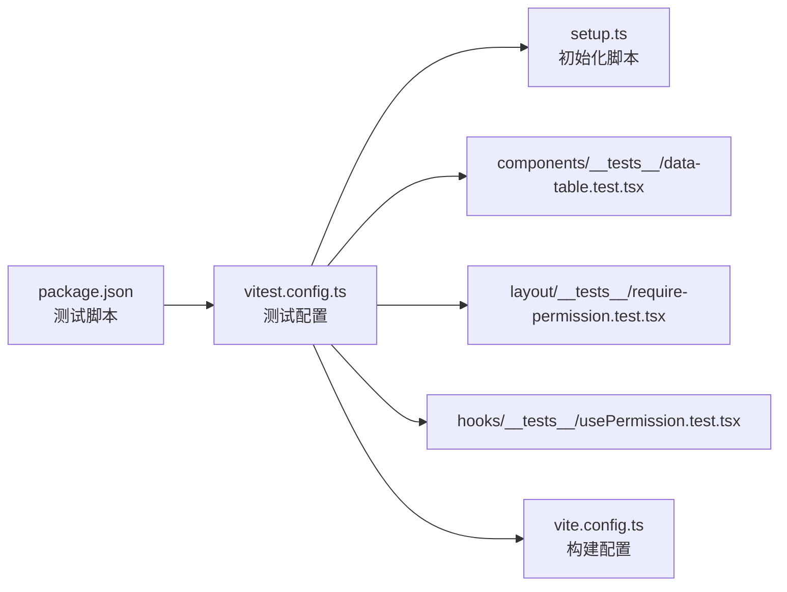

# 单元测试

<cite>
**本文引用的文件**   
- [vitest.config.ts](file://web/vitest.config.ts)
- [setup.ts](file://web/src/test/setup.ts)
- [data-table.test.tsx](file://web/src/components/data-table/__tests__/data-table.test.tsx)
- [require-permission.test.tsx](file://web/src/components/layout/__tests__/require-permission.test.tsx)
- [usePermission.test.tsx](file://web/src/hooks/__tests__/usePermission.test.tsx)
- [package.json](file://web/package.json)
- [vite.config.ts](file://web/vite.config.ts)
</cite>

## 目录
1. [简介](#简介)
2. [项目结构](#项目结构)
3. [核心组件](#核心组件)
4. [架构总览](#架构总览)
5. [详细组件分析](#详细组件分析)
6. [依赖分析](#依赖分析)
7. [性能考虑](#性能考虑)
8. [故障排查指南](#故障排查指南)
9. [结论](#结论)
10. [附录](#附录)

## 简介
本文件面向pj3项目的单元测试实践，聚焦于基于Vitest的前端测试体系。内容涵盖：
- 测试环境设置与初始化
- 断言库选择与使用策略
- 模拟对象（Mock）创建与管理
- 工具函数、业务逻辑与纯函数的测试方法
- 测试文件组织与命名约定（含__tests__目录规范）
- 异步操作、错误处理与边界条件的测试示例思路
- 覆盖率配置与报告生成
- 自动化质量检查机制建议

## 项目结构
本项目采用“就近测试”的组织方式：每个功能模块与其对应的测试文件位于同一目录下，并通过__tests__子目录集中存放该模块的测试用例。根级存在统一的测试配置文件与全局初始化脚本。

图表来源
- [vitest.config.ts](file://web/vitest.config.ts)
- [setup.ts](file://web/src/test/setup.ts)
- [data-table.test.tsx](file://web/src/components/data-table/__tests__/data-table.test.tsx)
- [require-permission.test.tsx](file://web/src/components/layout/__tests__/require-permission.test.tsx)
- [usePermission.test.tsx](file://web/src/hooks/__tests__/usePermission.test.tsx)
- [package.json](file://web/package.json)
- [vite.config.ts](file://web/vite.config.ts)

章节来源
- [vitest.config.ts](file://web/vitest.config.ts)
- [setup.ts](file://web/src/test/setup.ts)
- [data-table.test.tsx](file://web/src/components/data-table/__tests__/data-table.test.tsx)
- [require-permission.test.tsx](file://web/src/components/layout/__tests__/require-permission.test.tsx)
- [usePermission.test.tsx](file://web/src/hooks/__tests__/usePermission.test.tsx)
- [package.json](file://web/package.json)
- [vite.config.ts](file://web/vite.config.ts)

## 核心组件
- Vitest 配置入口：用于定义测试运行器、环境、覆盖率、别名等关键选项。
- 测试初始化脚本：在测试执行前注入全局行为（如DOM环境、自定义匹配器、全局Mock等）。
- 各模块下的__tests__目录：按功能域组织测试用例，便于定位与维护。
- 包管理脚本：在package.json中提供测试命令与覆盖率报告命令。

章节来源
- [vitest.config.ts](file://web/vitest.config.ts)
- [setup.ts](file://web/src/test/setup.ts)
- [package.json](file://web/package.json)

## 架构总览
下图展示了从测试命令到测试执行的端到端流程，包括Vitest配置加载、初始化脚本执行、测试发现与运行、以及覆盖率收集。

图表来源
- [vitest.config.ts](file://web/vitest.config.ts)
- [setup.ts](file://web/src/test/setup.ts)
- [vite.config.ts](file://web/vite.config.ts)
- [package.json](file://web/package.json)

## 详细组件分析

### Vitest 配置（vitest.config.ts）
- 作用：集中管理测试运行参数、环境、覆盖率、路径别名、插件集成等。
- 关键点：
  - 指定测试环境（例如浏览器或Node环境）
  - 启用覆盖率收集与阈值
  - 配置路径别名以简化导入
  - 与Vite配置共享构建能力（如TS、CSS、资源处理）
- 建议：
  - 将覆盖率阈值设置在合理范围，避免阻塞CI
  - 为不同场景（UI/非UI）拆分配置或使用覆盖模式

章节来源
- [vitest.config.ts](file://web/vitest.config.ts)
- [vite.config.ts](file://web/vite.config.ts)

### 测试初始化脚本（setup.ts）
- 作用：在测试执行前统一注入全局行为，确保所有测试具有一致的运行上下文。
- 常见职责：
  - 引入并配置DOM环境（如jsdom）
  - 注册全局Mock或自定义匹配器
  - 清理副作用（定时器、全局状态等）
- 建议：
  - 保持初始化脚本轻量，复杂逻辑下沉至测试专用工具
  - 对第三方库的全局API进行可控Mock，提升稳定性

章节来源
- [setup.ts](file://web/src/test/setup.ts)

### 组件测试（data-table.test.tsx）
- 目标：验证表格组件的渲染、交互与数据绑定是否符合预期。
- 关注点：
  - 列定义与分页控制
  - 排序、筛选、搜索等交互
  - 空数据与异常数据的展示
- 建议：
  - 使用稳定的Mock数据源，隔离外部依赖
  - 针对用户交互事件编写断言，确保可访问性与用户体验

章节来源
- [data-table.test.tsx](file://web/src/components/data-table/__tests__/data-table.test.tsx)

### 权限守卫组件测试（require-permission.test.tsx）
- 目标：验证权限守卫组件在不同权限状态下的渲染与跳转行为。
- 关注点：
  - 无权限时的降级展示或重定向
  - 有权限时的正常渲染
  - 动态权限变更后的响应
- 建议：
  - Mock权限相关上下文或Hook，构造多种权限组合
  - 结合路由变化进行断言

章节来源
- [require-permission.test.tsx](file://web/src/components/layout/__tests__/require-permission.test.tsx)

### Hook 测试（usePermission.test.tsx）
- 目标：验证权限Hook的状态管理与副作用。
- 关注点：
  - 初始状态与更新逻辑
  - 异步权限获取的错误处理
  - 与其他Hook的组合使用
- 建议：
  - 使用测试工具封装Hook调用，减少样板代码
  - 针对边界条件（网络失败、超时、非法输入）编写用例

章节来源
- [usePermission.test.tsx](file://web/src/hooks/__tests__/usePermission.test.tsx)

### 包脚本与命令（package.json）
- 作用：暴露测试与覆盖率命令，便于本地开发与CI集成。
- 常见命令：
  - 运行测试
  - 运行测试并生成覆盖率报告
  - 仅运行失败的测试
- 建议：
  - 在CI中固定Node版本与缓存依赖，提高稳定性
  - 将覆盖率阈值作为质量门禁

章节来源
- [package.json](file://web/package.json)

## 依赖分析
测试体系的关键依赖关系如下：
- package.json中的脚本驱动Vitest运行
- vitest.config.ts决定运行环境与覆盖率策略
- setup.ts提供全局初始化
- __tests__目录下的具体测试文件依赖应用源码与Mock数据

图表来源
- [package.json](file://web/package.json)
- [vitest.config.ts](file://web/vitest.config.ts)
- [setup.ts](file://web/src/test/setup.ts)
- [data-table.test.tsx](file://web/src/components/data-table/__tests__/data-table.test.tsx)
- [require-permission.test.tsx](file://web/src/components/layout/__tests__/require-permission.test.tsx)
- [usePermission.test.tsx](file://web/src/hooks/__tests__/usePermission.test.tsx)
- [vite.config.ts](file://web/vite.config.ts)

章节来源
- [package.json](file://web/package.json)
- [vitest.config.ts](file://web/vitest.config.ts)
- [setup.ts](file://web/src/test/setup.ts)
- [vite.config.ts](file://web/vite.config.ts)

## 性能考虑
- 并行执行：利用Vitest的并发能力缩短测试时间，注意避免共享状态导致的竞态。
- 按需运行：通过文件名过滤或标签分组只运行受影响测试，加速反馈。
- 稳定Mock：优先使用内存Mock与工厂函数，避免I/O与网络开销。
- 快照与断言：合理使用快照，避免过度依赖导致维护成本上升。
- 覆盖率阈值：设置合理的阈值，避免为覆盖率而写冗余用例。

[本节为通用指导，不直接分析具体文件]

## 故障排查指南
- 测试无法找到文件：检查vitest.config.ts中的include/exclude规则与路径别名。
- DOM环境缺失：确认setup.ts已正确引入并配置DOM环境。
- 异步测试不稳定：确保await完成后再断言；必要时增加等待策略或Mock延迟。
- 覆盖率报告为空：检查覆盖率开关与收集范围是否包含目标文件。
- 跨模块Mock冲突：为每个测试准备独立Mock，避免全局污染。

章节来源
- [vitest.config.ts](file://web/vitest.config.ts)
- [setup.ts](file://web/src/test/setup.ts)

## 结论
通过统一的Vitest配置与就近组织的__tests__目录，pj3项目实现了清晰、可维护的测试体系。配合完善的初始化脚本与Mock策略，能够高效覆盖工具函数、业务逻辑与UI组件，并在CI中建立稳定的质量门禁。建议在后续迭代中持续优化覆盖率阈值与测试分层，进一步提升整体质量与开发效率。

[本节为总结性内容，不直接分析具体文件]

## 附录

### 测试文件组织与命名约定
- 位置：与源码同级的__tests__目录内，按模块划分。
- 命名：*.test.ts / *.test.tsx，语义化描述被测单元。
- 结构：每个测试文件聚焦单一模块，内部按场景分块（describe/it）。

章节来源
- [data-table.test.tsx](file://web/src/components/data-table/__tests__/data-table.test.tsx)
- [require-permission.test.tsx](file://web/src/components/layout/__tests__/require-permission.test.tsx)
- [usePermission.test.tsx](file://web/src/hooks/__tests__/usePermission.test.tsx)

### 基础概念速查
- 测试环境设置：在vitest.config.ts中指定环境，在setup.ts中注入全局依赖。
- 断言库选择：使用Vitest内置断言，简洁且与运行器深度集成。
- 模拟对象创建：通过Mock API替换真实实现，保证测试确定性与隔离性。

章节来源
- [vitest.config.ts](file://web/vitest.config.ts)
- [setup.ts](file://web/src/test/setup.ts)

### 异步与错误处理的测试要点
- 异步：确保在断言前等待Promise完成，必要时使用重试或等待工具。
- 错误：构造异常分支，验证错误提示与回退逻辑。
- 边界：覆盖空值、超长输入、极端数值等边界条件。

章节来源
- [usePermission.test.tsx](file://web/src/hooks/__tests__/usePermission.test.tsx)
- [require-permission.test.tsx](file://web/src/components/layout/__tests__/require-permission.test.tsx)

### 覆盖率配置与报告
- 开启覆盖率：在vitest.config.ts中启用并设置阈值。
- 生成报告：通过命令行参数输出HTML或文本报告。
- CI集成：将覆盖率阈值作为质量门禁，未达标则失败。

章节来源
- [vitest.config.ts](file://web/vitest.config.ts)
- [package.json](file://web/package.json)

### Mock数据策略
- 集中管理：在测试目录或公共fixtures中维护稳定数据。
- 工厂函数：根据场景生成最小必要数据，避免耦合。
- 隔离外部：对网络、存储、时间等外部依赖进行可控Mock。

章节来源
- [data-table.test.tsx](file://web/src/components/data-table/__tests__/data-table.test.tsx)
- [require-permission.test.tsx](file://web/src/components/layout/__tests__/require-permission.test.tsx)
- [usePermission.test.tsx](file://web/src/hooks/__tests__/usePermission.test.tsx)