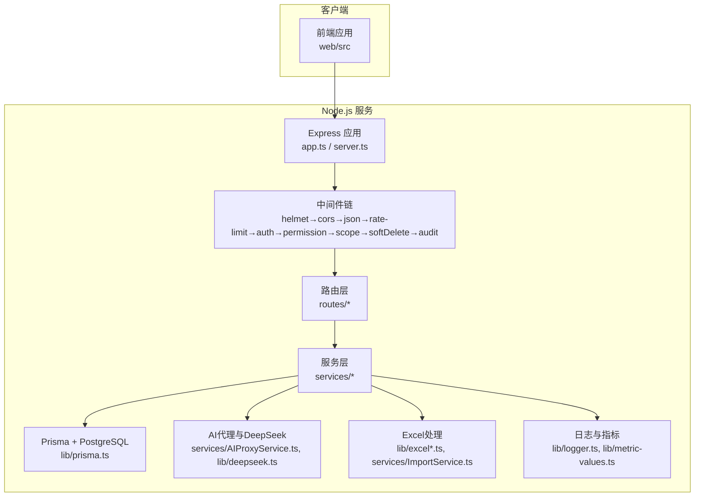
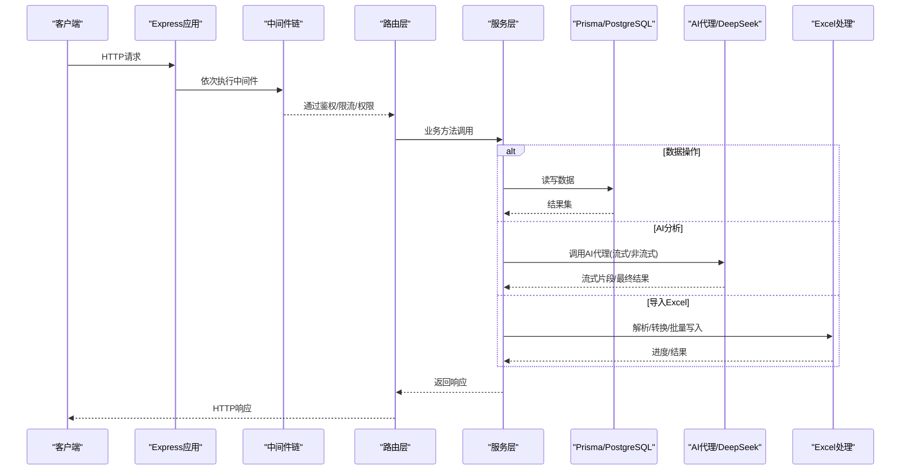
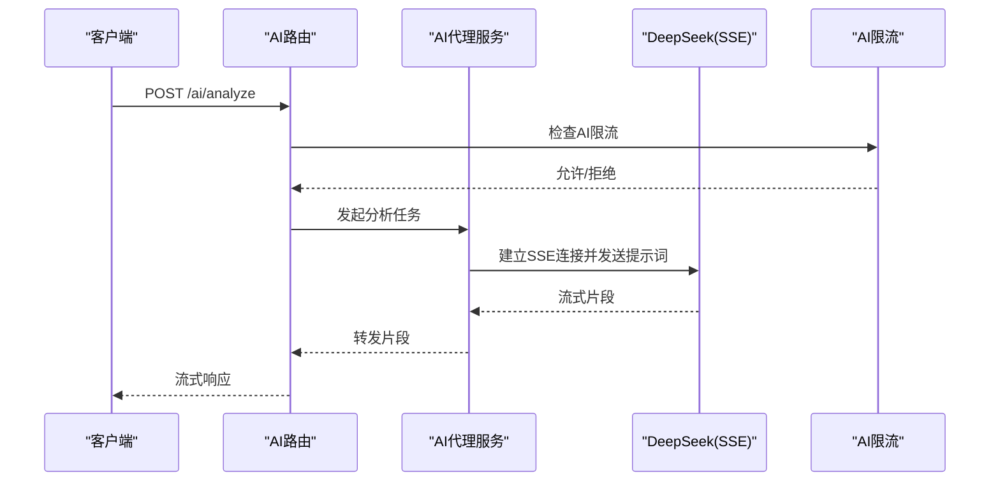
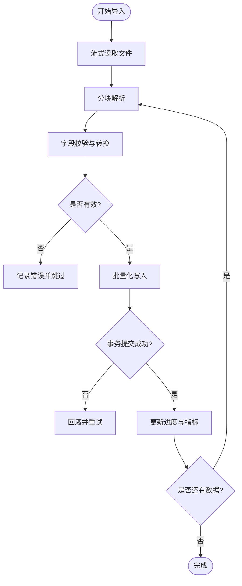
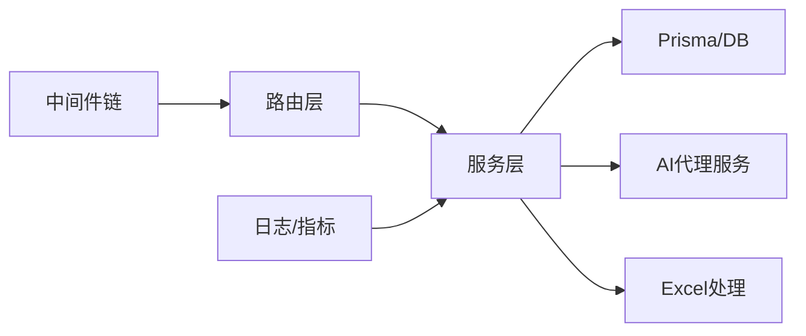

# 性能测试

<cite>
**本文引用的文件**   
- [server/src/app.ts](file://server/src/app.ts)
- [server/src/server.ts](file://server/src/server.ts)
- [server/src/middleware/rate-limit.ts](file://server/src/middleware/rate-limit.ts)
- [server/src/middleware/ai-rate-limit.ts](file://server/src/middleware/ai-rate-limit.ts)
- [server/src/lib/deepseek.ts](file://server/src/lib/deepseek.ts)
- [server/src/services/AIProxyService.ts](file://server/src/services/AIProxyService.ts)
- [server/src/routes/ai.ts](file://server/src/routes/ai.ts)
- [server/src/lib/excel-import.ts](file://server/src/lib/excel-import.ts)
- [server/src/lib/excel.ts](file://server/src/lib/excel.ts)
- [server/src/services/ImportService.ts](file://server/src/services/ImportService.ts)
- [server/src/lib/prisma.ts](file://server/src/lib/prisma.ts)
- [server/src/lib/logger.ts](file://server/src/lib/logger.ts)
- [server/src/lib/metric-values.ts](file://server/src/lib/metric-values.ts)
- [server/scripts/ai-smoke.ts](file://server/scripts/ai-smoke.ts)
- [server/scripts/ai-http-live.ts](file://server/scripts/ai-http-live.ts)
- [server/scripts/cors-check.ts](file://server/scripts/cors-check.ts)
- [server/package.json](file://server/package.json)
- [web/src/lib/ai-stream.ts](file://web/src/lib/ai-stream.ts)
</cite>

## 目录
1. [简介](#简介)
2. [项目结构](#项目结构)
3. [核心组件](#核心组件)
4. [架构总览](#架构总览)
5. [详细组件分析](#详细组件分析)
6. [依赖分析](#依赖分析)
7. [性能考虑](#性能考虑)
8. [故障排查指南](#故障排查指南)
9. [结论](#结论)
10. [附录](#附录)

## 简介
本文件面向FY200项目的性能测试与优化，覆盖负载测试、基准测试、AI服务（DeepSeek SSE流式）性能监控、Excel大文件处理性能优化、关键指标定义与采集、瓶颈识别与回归自动化等。项目为“Excel进、看板/报表出”的内部管理口径财务数据平台，后端采用Express + Prisma + PostgreSQL + JWT + DeepSeek API（SSE流式），中间件执行链顺序固定，计算类指标使用安全公式解析，AI双管道架构包含脱敏与还原流程。

## 项目结构
- 服务端：Express应用入口、路由、中间件、服务层、Prisma数据库访问、日志与指标工具、脚本。
- 前端：AI流式响应处理、API调用封装、导出与导入模板等。
- 文档与参考：可观测性、性能参考文档位于docs/references。

图表来源
- [server/src/app.ts](file://server/src/app.ts)
- [server/src/server.ts](file://server/src/server.ts)
- [server/src/middleware/rate-limit.ts](file://server/src/middleware/rate-limit.ts)
- [server/src/middleware/ai-rate-limit.ts](file://server/src/middleware/ai-rate-limit.ts)
- [server/src/lib/prisma.ts](file://server/src/lib/prisma.ts)
- [server/src/lib/logger.ts](file://server/src/lib/logger.ts)
- [server/src/lib/metric-values.ts](file://server/src/lib/metric-values.ts)
- [server/src/services/AIProxyService.ts](file://server/src/services/AIProxyService.ts)
- [server/src/lib/deepseek.ts](file://server/src/lib/deepseek.ts)
- [server/src/lib/excel-import.ts](file://server/src/lib/excel-import.ts)
- [server/src/lib/excel.ts](file://server/src/lib/excel.ts)
- [server/src/services/ImportService.ts](file://server/src/services/ImportService.ts)

章节来源
- [server/src/app.ts](file://server/src/app.ts)
- [server/src/server.ts](file://server/src/server.ts)
- [server/package.json](file://server/package.json)

## 核心组件
- 中间件链：限流、鉴权、权限、作用域、软删除、审计等，按固定顺序执行，是压测时控制并发与保护后端的关键点。
- AI代理服务：封装DeepSeek SSE流式调用，支持文本抛光与分析双管道，含速率限制与错误重试策略。
- Excel导入服务：大文件读取、解析、转换与入库，关注内存占用与并发写入。
- 数据库访问：Prisma连接池、查询计划与索引对性能影响显著。
- 指标与日志：统一日志格式与指标值收集，便于构建监控面板与告警。

章节来源
- [server/src/middleware/rate-limit.ts](file://server/src/middleware/rate-limit.ts)
- [server/src/middleware/ai-rate-limit.ts](file://server/src/middleware/ai-rate-limit.ts)
- [server/src/services/AIProxyService.ts](file://server/src/services/AIProxyService.ts)
- [server/src/lib/deepseek.ts](file://server/src/lib/deepseek.ts)
- [server/src/lib/excel-import.ts](file://server/src/lib/excel-import.ts)
- [server/src/lib/excel.ts](file://server/src/lib/excel.ts)
- [server/src/services/ImportService.ts](file://server/src/services/ImportService.ts)
- [server/src/lib/prisma.ts](file://server/src/lib/prisma.ts)
- [server/src/lib/logger.ts](file://server/src/lib/logger.ts)
- [server/src/lib/metric-values.ts](file://server/src/lib/metric-values.ts)

## 架构总览
下图展示从请求进入Express到服务层、数据库与AI服务的完整路径，以及限流与审计在链路中的位置。

图表来源
- [server/src/app.ts](file://server/src/app.ts)
- [server/src/server.ts](file://server/src/server.ts)
- [server/src/middleware/rate-limit.ts](file://server/src/middleware/rate-limit.ts)
- [server/src/middleware/ai-rate-limit.ts](file://server/src/middleware/ai-rate-limit.ts)
- [server/src/routes/ai.ts](file://server/src/routes/ai.ts)
- [server/src/services/AIProxyService.ts](file://server/src/services/AIProxyService.ts)
- [server/src/lib/deepseek.ts](file://server/src/lib/deepseek.ts)
- [server/src/lib/excel-import.ts](file://server/src/lib/excel-import.ts)
- [server/src/lib/excel.ts](file://server/src/lib/excel.ts)
- [server/src/services/ImportService.ts](file://server/src/services/ImportService.ts)
- [server/src/lib/prisma.ts](file://server/src/lib/prisma.ts)

## 详细组件分析

### 负载测试实施（JMeter/k6）
- 目标接口：认证、数据查询、报表生成、AI分析、Excel导入导出。
- 场景设计：
  - 登录风暴：模拟多用户并发登录，验证JWT签发与黑名单校验。
  - 数据查询压力：高并发读，关注Prisma连接池与SQL慢查询。
  - 报表聚合：CPU密集型计算，评估安全公式解析与聚合服务吞吐。
  - AI分析：SSE流式调用，关注首字节延迟、吞吐与稳定性。
  - Excel导入：大文件上传与解析，关注内存峰值与写入吞吐。
- 工具建议：
  - k6：适合编写脚本化、可重复的负载用例，便于CI集成。
  - JMeter：图形化编排复杂场景，适合探索性压测与报告输出。
- 关键参数：并发数、RPS、阶梯加压、持续时间、错误率阈值、P95/P99延迟。

章节来源
- [server/package.json](file://server/package.json)
- [server/src/routes/ai.ts](file://server/src/routes/ai.ts)
- [server/src/lib/excel-import.ts](file://server/src/lib/excel-import.ts)

### 基准测试策略（API/DB/内存）
- API响应时间：以P95/P99为核心指标，结合错误率与吞吐；区分冷启动与热缓存。
- 数据库查询性能：关注慢查询、锁等待、连接池耗尽；使用Prisma查询计划与PG统计视图。
- 内存使用监控：Node堆内存、RSS、GC停顿；Excel导入需避免一次性加载全量数据。
- 压测基线：建立不同环境（开发/预发/生产）基线，纳入回归门槛。

章节来源
- [server/src/lib/prisma.ts](file://server/src/lib/prisma.ts)
- [server/src/lib/logger.ts](file://server/src/lib/logger.ts)
- [server/src/lib/metric-values.ts](file://server/src/lib/metric-values.ts)

### AI服务性能测试（DeepSeek SSE）
- 流式响应：首字节延迟（TTFB）、增量片段间隔、端到端耗时、失败重试。
- 双管道：polish（文本→脱敏→LLM→还原）与analyze（结构化→计算→脱敏→LLM→生成）。
- 速率限制：独立AI限流中间件，防止外部API配额耗尽与下游抖动。
- 监控要点：上游超时、降级策略、缓冲大小、背压控制。

图表来源
- [server/src/routes/ai.ts](file://server/src/routes/ai.ts)
- [server/src/services/AIProxyService.ts](file://server/src/services/AIProxyService.ts)
- [server/src/lib/deepseek.ts](file://server/src/lib/deepseek.ts)
- [server/src/middleware/ai-rate-limit.ts](file://server/src/middleware/ai-rate-limit.ts)

章节来源
- [server/src/routes/ai.ts](file://server/src/routes/ai.ts)
- [server/src/services/AIProxyService.ts](file://server/src/services/AIProxyService.ts)
- [server/src/lib/deepseek.ts](file://server/src/lib/deepseek.ts)
- [server/src/middleware/ai-rate-limit.ts](file://server/src/middleware/ai-rate-limit.ts)

### Excel大文件处理性能优化测试
- 读取策略：流式解析、分块处理、避免一次性加载至内存。
- 转换与校验：白名单字段映射、类型转换、批量校验。
- 写入策略：事务分批提交、幂等写入、回滚机制。
- 并发能力：队列化导入任务、限流与背压、资源隔离。

图表来源
- [server/src/lib/excel-import.ts](file://server/src/lib/excel-import.ts)
- [server/src/lib/excel.ts](file://server/src/lib/excel.ts)
- [server/src/services/ImportService.ts](file://server/src/services/ImportService.ts)

章节来源
- [server/src/lib/excel-import.ts](file://server/src/lib/excel-import.ts)
- [server/src/lib/excel.ts](file://server/src/lib/excel.ts)
- [server/src/services/ImportService.ts](file://server/src/services/ImportService.ts)

### 性能监控指标定义与采集
- 关键指标：
  - API：QPS、错误率、P95/P99延迟、连接池使用率。
  - AI：TTFB、片段间隔、成功率、超时率、配额消耗。
  - Excel：解析吞吐、内存峰值、写入延迟、失败重试次数。
  - 数据库：慢查询数量、锁等待、连接池耗尽次数。
- 采集方式：
  - 统一日志：请求ID、耗时、状态码、错误信息。
  - 指标值：基于metric-values进行标准化上报。
  - 告警规则：阈值触发（如错误率>1%、P99>2s、内存>80%）。

章节来源
- [server/src/lib/logger.ts](file://server/src/lib/logger.ts)
- [server/src/lib/metric-values.ts](file://server/src/lib/metric-values.ts)

### 性能瓶颈识别与优化建议
- 常见瓶颈：
  - 连接池不足导致排队与超时。
  - 大对象或全表扫描引发慢查询。
  - AI上游限流或抖动导致抖动放大。
  - Excel导入内存峰值过高导致OOM。
- 优化建议：
  - 调整连接池大小与超时策略。
  - 增加索引与查询改写，减少全表扫描。
  - 引入缓存与异步任务队列。
  - 流式处理与分批提交，降低内存占用。

章节来源
- [server/src/lib/prisma.ts](file://server/src/lib/prisma.ts)
- [server/src/services/AIProxyService.ts](file://server/src/services/AIProxyService.ts)
- [server/src/lib/excel-import.ts](file://server/src/lib/excel-import.ts)

### 回归测试自动化流程
- CI集成：每次PR触发负载与基准测试，对比基线阈值。
- 用例库：k6/JMeter脚本版本化管理，参数与环境分离。
- 门禁策略：错误率、延迟、吞吐不达标则阻断合并。
- 报告归档：生成HTML报告与指标快照，便于回溯。

章节来源
- [server/package.json](file://server/package.json)
- [server/scripts/ai-smoke.ts](file://server/scripts/ai-smoke.ts)
- [server/scripts/ai-http-live.ts](file://server/scripts/ai-http-live.ts)
- [server/scripts/cors-check.ts](file://server/scripts/cors-check.ts)

## 依赖分析
- 模块耦合：
  - 路由层依赖服务层，服务层依赖Prisma与AI代理、Excel处理。
  - 中间件链强顺序约束，限流与鉴权前置。
- 外部依赖：
  - PostgreSQL：连接池、索引与查询计划。
  - DeepSeek API：SSE流式、配额与限流。
- 潜在循环依赖：服务层应避免反向引用中间件或路由。

图表来源
- [server/src/app.ts](file://server/src/app.ts)
- [server/src/server.ts](file://server/src/server.ts)
- [server/src/lib/prisma.ts](file://server/src/lib/prisma.ts)
- [server/src/services/AIProxyService.ts](file://server/src/services/AIProxyService.ts)
- [server/src/lib/excel-import.ts](file://server/src/lib/excel-import.ts)
- [server/src/lib/logger.ts](file://server/src/lib/logger.ts)

章节来源
- [server/src/app.ts](file://server/src/app.ts)
- [server/src/server.ts](file://server/src/server.ts)
- [server/src/lib/prisma.ts](file://server/src/lib/prisma.ts)
- [server/src/services/AIProxyService.ts](file://server/src/services/AIProxyService.ts)
- [server/src/lib/excel-import.ts](file://server/src/lib/excel-import.ts)
- [server/src/lib/logger.ts](file://server/src/lib/logger.ts)

## 性能考虑
- 连接池与超时：合理设置Prisma连接池大小与超时，避免连接耗尽。
- 流式处理：AI与Excel导入均采用流式，降低内存峰值与提升吞吐。
- 限流与降级：全局与AI独立限流，异常时快速失败与降级。
- 缓存策略：热点数据缓存，减少数据库压力。
- 监控与告警：关键指标实时采集与阈值告警，快速定位问题。

[本节为通用指导，无需特定文件来源]

## 故障排查指南
- 常见问题：
  - 连接池耗尽：检查连接池配置与慢查询。
  - AI超时：检查上游限流与网络抖动，启用重试与降级。
  - Excel OOM：检查流式解析与分批写入逻辑。
  - 鉴权失败：检查JWT有效期与黑名单策略。
- 诊断步骤：
  - 查看统一日志与请求ID追踪。
  - 检查指标值与告警事件。
  - 复现压测场景并抓取慢查询与GC日志。

章节来源
- [server/src/lib/logger.ts](file://server/src/lib/logger.ts)
- [server/src/lib/metric-values.ts](file://server/src/lib/metric-values.ts)
- [server/src/middleware/rate-limit.ts](file://server/src/middleware/rate-limit.ts)
- [server/src/middleware/ai-rate-limit.ts](file://server/src/middleware/ai-rate-limit.ts)

## 结论
FY200项目的性能测试应围绕API、数据库、AI服务与Excel导入四大维度展开，结合限流、流式处理与监控告警，形成闭环的性能保障体系。建议在CI中集成基准与回归测试，持续跟踪指标变化，及时识别与修复瓶颈。

[本节为总结性内容，无需特定文件来源]

## 附录
- 参考文档：可观测性与性能参考位于docs/references。
- 脚本示例：AI冒烟、HTTP活路、CORS检查等脚本可用于快速验证。

章节来源
- [server/scripts/ai-smoke.ts](file://server/scripts/ai-smoke.ts)
- [server/scripts/ai-http-live.ts](file://server/scripts/ai-http-live.ts)
- [server/scripts/cors-check.ts](file://server/scripts/cors-check.ts)