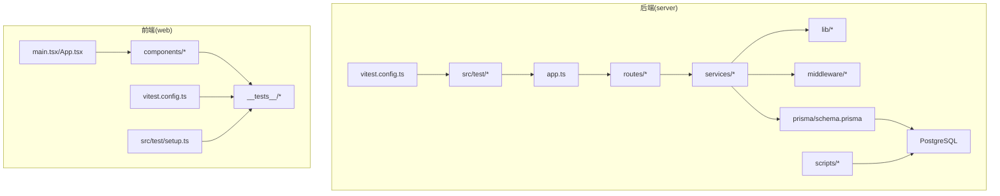
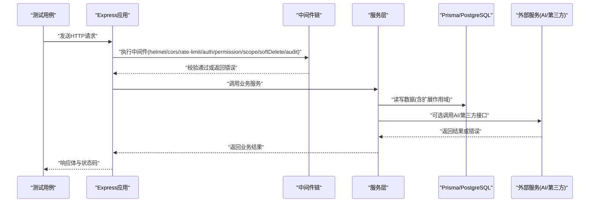
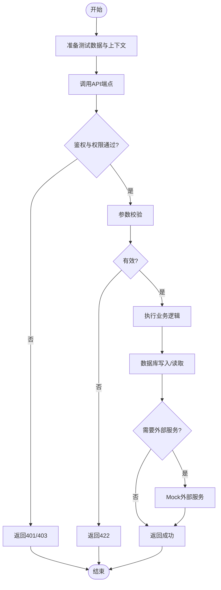
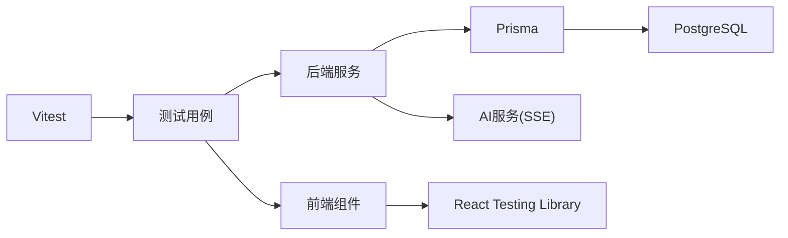

# 测试策略

<cite>
**本文引用的文件**   
- [server/package.json](file://server/package.json)
- [server/vitest.config.ts](file://server/vitest.config.ts)
- [server/src/app.test.ts](file://server/src/app.test.ts)
- [server/src/test/setup.ts](file://server/src/test/setup.ts)
- [server/src/test/integration.test.ts](file://server/src/test/integration.test.ts)
- [server/src/test/integration-crud.test.ts](file://server/src/test/integration-crud.test.ts)
- [server/src/test/ai-http.test.ts](file://server/src/test/ai-http.test.ts)
- [server/src/test/reports-http.test.ts](file://server/src/test/reports-http.test.ts)
- [server/src/lib/desensitize.test.ts](file://server/src/lib/desensitize.test.ts)
- [server/src/lib/excel-import.test.ts](file://server/src/lib/excel-import.test.ts)
- [server/src/lib/formula.test.ts](file://server/src/lib/formula.test.ts)
- [server/src/lib/jwt.test.ts](file://server/src/lib/jwt.test.ts)
- [server/src/lib/metric-values.test.ts](file://server/src/lib/metric-values.test.ts)
- [server/src/lib/password.test.ts](file://server/src/lib/password.test.ts)
- [server/src/lib/period.test.ts](file://server/src/lib/period.test.ts)
- [server/src/lib/prompt-guard.test.ts](file://server/src/lib/prompt-guard.test.ts)
- [server/src/lib/sanitize.test.ts](file://server/src/lib/sanitize.test.ts)
- [server/src/middleware/auth.test.ts](file://server/src/middleware/auth.test.ts)
- [server/src/middleware/permission.test.ts](file://server/src/middleware/permission.test.ts)
- [server/src/middleware/scope.test.ts](file://server/src/middleware/scope.test.ts)
- [server/src/middleware/soft-delete.test.ts](file://server/src/middleware/soft-delete.test.ts)
- [server/src/services/AIProxyService.test.ts](file://server/src/services/AIProxyService.test.ts)
- [server/src/services/AuthService.test.ts](file://server/src/services/AuthService.test.ts)
- [server/src/services/DataService.test.ts](file://server/src/services/DataService.test.ts)
- [server/src/services/FormulaRuleService.test.ts](file://server/src/services/FormulaRuleService.test.ts)
- [server/src/services/ImportService.test.ts](file://server/src/services/ImportService.test.ts)
- [server/src/services/ReportService.test.ts](file://server/src/services/ReportService.test.ts)
- [server/src/services/SubjectAnalysisService.test.ts](file://server/src/services/SubjectAnalysisService.test.ts)
- [server/src/services/AggregationService.calc.test.ts](file://server/src/services/AggregationService.calc.test.ts)
- [server/src/services/AggregationService.static.test.ts](file://server/src/services/AggregationService.static.test.ts)
- [server/src/services/AggregationService.ytd.test.ts](file://server/src/services/AggregationService.ytd.test.ts)
- [server/src/services/formula-validation.test.ts](file://server/src/services/formula-validation.test.ts)
- [web/vitest.config.ts](file://web/vitest.config.ts)
- [web/src/components/data-table/__tests__/data-table.test.tsx](file://web/src/components/data-table/__tests__/data-table.test.tsx)
- [web/src/components/layout/__tests__/require-permission.test.tsx](file://web/src/components/layout/__tests__/require-permission.test.tsx)
- [web/src/hooks/__tests__/usePermission.test.tsx](file://web/src/hooks/__tests__/usePermission.test.tsx)
- [web/src/test/setup.ts](file://web/src/test/setup.ts)
</cite>

## 目录
1. [简介](#简介)
2. [项目结构](#项目结构)
3. [核心组件](#核心组件)
4. [架构总览](#架构总览)
5. [详细组件分析](#详细组件分析)
6. [依赖分析](#依赖分析)
7. [性能考虑](#性能考虑)
8. [故障排查指南](#故障排查指南)
9. [结论](#结论)
10. [附录](#附录)

## 简介
本测试策略面向FY200财年经营数据分析平台，覆盖后端（Express + Prisma + PostgreSQL）与前端（React/Vite）的单元测试、集成测试、端到端测试与性能测试。策略遵循“Excel进、看板/报表出”的业务定位，强调安全公式解析、JWT鉴权与权限控制、AI双管道（脱敏→LLM→还原）以及指标同比/环比实时计算等关键特性。文档提供可执行的测试规范、覆盖率目标、环境配置与持续集成建议，帮助团队在快速迭代中保持质量与稳定性。

## 项目结构
本项目采用前后端分离的双仓库式结构：
- server：后端服务，包含路由、中间件、服务层、工具库、Prisma数据模型与迁移、测试用例与脚本。
- web：前端应用，包含页面、组件、hooks、mock数据、Vitest测试配置与测试用例。

图表来源
- [server/src/app.ts](file://server/src/app.ts)
- [server/vitest.config.ts](file://server/vitest.config.ts)
- [web/vitest.config.ts](file://web/vitest.config.ts)
- [web/src/test/setup.ts](file://web/src/test/setup.ts)

章节来源
- [server/package.json](file://server/package.json)
- [server/vitest.config.ts](file://server/vitest.config.ts)
- [web/vitest.config.ts](file://web/vitest.config.ts)

## 核心组件
- 测试框架与运行器
  - 后端使用 Vitest，配置文件位于 server/vitest.config.ts；测试入口与用例分布在 src/test 与各模块的 *.test.ts。
  - 前端使用 Vitest + React Testing Library，配置文件位于 web/vitest.config.ts，测试入口与用例分布在 __tests__ 与 hooks/__tests__。
- 测试环境与初始化
  - 后端测试初始化位于 server/src/test/setup.ts，用于数据库连接、事务回滚、Mock外部依赖等。
  - 前端测试初始化位于 web/src/test/setup.ts，用于全局DOM模拟、Provider注入、API Mock等。
- 典型测试类型
  - 单元测试：lib/* 下的工具函数与服务方法（如 desensitize、formula、jwt、password、period、prompt-guard、sanitize、metric-values）。
  - 中间件测试：auth、permission、scope、soft-delete 等中间件的边界条件与错误路径。
  - 服务层测试：AuthService、DataService、ImportService、ReportService、AIProxyService、AggregationService、SubjectAnalysisService、FormulaRuleService 及其子场景。
  - 集成测试：HTTP API 调用、数据库操作、AI流式接口、报表导出等。
  - 前端组件测试：数据表格、权限守卫、Hooks行为验证。

章节来源
- [server/src/test/setup.ts](file://server/src/test/setup.ts)
- [web/src/test/setup.ts](file://web/src/test/setup.ts)
- [server/src/lib/desensitize.test.ts](file://server/src/lib/desensitize.test.ts)
- [server/src/lib/formula.test.ts](file://server/src/lib/formula.test.ts)
- [server/src/lib/jwt.test.ts](file://server/src/lib/jwt.test.ts)
- [server/src/lib/password.test.ts](file://server/src/lib/password.test.ts)
- [server/src/lib/period.test.ts](file://server/src/lib/period.test.ts)
- [server/src/lib/prompt-guard.test.ts](file://server/src/lib/prompt-guard.test.ts)
- [server/src/lib/sanitize.test.ts](file://server/src/lib/sanitize.test.ts)
- [server/src/lib/metric-values.test.ts](file://server/src/lib/metric-values.test.ts)
- [server/src/middleware/auth.test.ts](file://server/src/middleware/auth.test.ts)
- [server/src/middleware/permission.test.ts](file://server/src/middleware/permission.test.ts)
- [server/src/middleware/scope.test.ts](file://server/src/middleware/scope.test.ts)
- [server/src/middleware/soft-delete.test.ts](file://server/src/middleware/soft-delete.test.ts)
- [server/src/services/AIProxyService.test.ts](file://server/src/services/AIProxyService.test.ts)
- [server/src/services/AuthService.test.ts](file://server/src/services/AuthService.test.ts)
- [server/src/services/DataService.test.ts](file://server/src/services/DataService.test.ts)
- [server/src/services/FormulaRuleService.test.ts](file://server/src/services/FormulaRuleService.test.ts)
- [server/src/services/ImportService.test.ts](file://server/src/services/ImportService.test.ts)
- [server/src/services/ReportService.test.ts](file://server/src/services/ReportService.test.ts)
- [server/src/services/SubjectAnalysisService.test.ts](file://server/src/services/SubjectAnalysisService.test.ts)
- [server/src/services/AggregationService.calc.test.ts](file://server/src/services/AggregationService.calc.test.ts)
- [server/src/services/AggregationService.static.test.ts](file://server/src/services/AggregationService.static.test.ts)
- [server/src/services/AggregationService.ytd.test.ts](file://server/src/services/AggregationService.ytd.test.ts)
- [server/src/services/formula-validation.test.ts](file://server/src/services/formula-validation.test.ts)
- [web/src/components/data-table/__tests__/data-table.test.tsx](file://web/src/components/data-table/__tests__/data-table.test.tsx)
- [web/src/components/layout/__tests__/require-permission.test.tsx](file://web/src/components/layout/__tests__/require-permission.test.tsx)
- [web/src/hooks/__tests__/usePermission.test.tsx](file://web/src/hooks/__tests__/usePermission.test.tsx)

## 架构总览
测试架构围绕“分层隔离、可控依赖、稳定环境”的原则构建：
- 单元测试：对纯函数、工具类、服务方法进行白盒测试，优先断言输入输出与异常分支。
- 集成测试：通过HTTP客户端调用真实路由，结合事务化测试数据库，确保数据一致性。
- AI与外部服务：使用SSE流式接口测试与Mock策略，保证网络不稳定时的鲁棒性。
- 前端测试：以组件为中心，模拟用户交互与权限状态，验证渲染与副作用。

图表来源
- [server/src/app.ts](file://server/src/app.ts)
- [server/src/middleware/auth.ts](file://server/src/middleware/auth.ts)
- [server/src/middleware/permission.ts](file://server/src/middleware/permission.ts)
- [server/src/middleware/scope.ts](file://server/src/middleware/scope.ts)
- [server/src/middleware/soft-delete.ts](file://server/src/middleware/soft-delete.ts)
- [server/src/services/AIProxyService.ts](file://server/src/services/AIProxyService.ts)

## 详细组件分析

### 单元测试编写规范（服务层、工具类与方法）
- 设计原则
  - 每个公共函数/方法至少一个正向用例与一个异常用例。
  - 针对安全公式解析、脱敏规则、JWT生成/校验、密码哈希、周期计算、Prompt防护等关键逻辑进行充分覆盖。
  - 使用确定性输入与期望输出，避免随机性与时间相关分支未处理。
- 推荐断言维度
  - 返回值结构与字段约束
  - 异常类型与错误消息
  - 副作用（日志、指标上报、缓存更新）
- 示例覆盖范围（按文件）
  - 工具库：desensitize、excel-import、formula、jwt、metric-values、password、period、prompt-guard、sanitize
  - 服务层：AuthService、DataService、ImportService、ReportService、AIProxyService、AggregationService（calc/static/ytd）、SubjectAnalysisService、FormulaRuleService、formula-validation

章节来源
- [server/src/lib/desensitize.test.ts](file://server/src/lib/desensitize.test.ts)
- [server/src/lib/excel-import.test.ts](file://server/src/lib/excel-import.test.ts)
- [server/src/lib/formula.test.ts](file://server/src/lib/formula.test.ts)
- [server/src/lib/jwt.test.ts](file://server/src/lib/jwt.test.ts)
- [server/src/lib/metric-values.test.ts](file://server/src/lib/metric-values.test.ts)
- [server/src/lib/password.test.ts](file://server/src/lib/password.test.ts)
- [server/src/lib/period.test.ts](file://server/src/lib/period.test.ts)
- [server/src/lib/prompt-guard.test.ts](file://server/src/lib/prompt-guard.test.ts)
- [server/src/lib/sanitize.test.ts](file://server/src/lib/sanitize.test.ts)
- [server/src/services/AIProxyService.test.ts](file://server/src/services/AIProxyService.test.ts)
- [server/src/services/AuthService.test.ts](file://server/src/services/AuthService.test.ts)
- [server/src/services/DataService.test.ts](file://server/src/services/DataService.test.ts)
- [server/src/services/FormulaRuleService.test.ts](file://server/src/services/FormulaRuleService.test.ts)
- [server/src/services/ImportService.test.ts](file://server/src/services/ImportService.test.ts)
- [server/src/services/ReportService.test.ts](file://server/src/services/ReportService.test.ts)
- [server/src/services/SubjectAnalysisService.test.ts](file://server/src/services/SubjectAnalysisService.test.ts)
- [server/src/services/AggregationService.calc.test.ts](file://server/src/services/AggregationService.calc.test.ts)
- [server/src/services/AggregationService.static.test.ts](file://server/src/services/AggregationService.static.test.ts)
- [server/src/services/AggregationService.ytd.test.ts](file://server/src/services/AggregationService.ytd.test.ts)
- [server/src/services/formula-validation.test.ts](file://server/src/services/formula-validation.test.ts)

### 集成测试实现（API端点、数据库、外部服务）
- API端点测试
  - 通过HTTP客户端发起请求，验证状态码、响应体结构与业务语义。
  - 覆盖认证失败、权限不足、参数校验失败、限流与审计记录等路径。
- 数据库操作测试
  - 使用事务包裹测试用例，确保每次测试后数据回滚，避免污染。
  - 验证Prisma扩展（scope）与软删除行为是否符合预期。
- 外部服务集成测试
  - AI流式接口（SSE）需模拟网络延迟与分块响应，验证消费者侧的增量处理。
  - 第三方服务失败时，应验证重试与降级策略。

图表来源
- [server/src/test/integration.test.ts](file://server/src/test/integration.test.ts)
- [server/src/test/integration-crud.test.ts](file://server/src/test/integration-crud.test.ts)
- [server/src/test/ai-http.test.ts](file://server/src/test/ai-http.test.ts)
- [server/src/test/reports-http.test.ts](file://server/src/test/reports-http.test.ts)

章节来源
- [server/src/test/integration.test.ts](file://server/src/test/integration.test.ts)
- [server/src/test/integration-crud.test.ts](file://server/src/test/integration-crud.test.ts)
- [server/src/test/ai-http.test.ts](file://server/src/test/ai-http.test.ts)
- [server/src/test/reports-http.test.ts](file://server/src/test/reports-http.test.ts)

### E2E测试策略与工具选择
- 目标
  - 模拟真实用户流程（登录→数据导入→看板查看→报表导出），验证跨模块协作与端到端一致性。
- 工具建议
  - 后端：基于HTTP客户端的E2E套件（可与集成测试复用基础设施）。
  - 前端：Playwright/Cypress，配合浏览器自动化与截图对比。
- 策略要点
  - 使用独立E2E数据库与环境变量隔离。
  - 预置种子数据与固定时间基准，避免时序问题。
  - 对AI流式接口进行录制回放，降低外部依赖波动。

章节来源
- [server/src/test/ai-http.test.ts](file://server/src/test/ai-http.test.ts)
- [server/src/test/reports-http.test.ts](file://server/src/test/reports-http.test.ts)

### 性能测试方法（负载、压力、基准）
- 负载测试
  - 模拟并发用户访问核心API（鉴权、指标查询、报表导出），观察吞吐与延迟分布。
- 压力测试
  - 逐步增加并发直至系统瓶颈（CPU、内存、数据库连接池、AI接口限流）。
- 基准测试
  - 对关键算法（公式解析、聚合计算、同比/环比）建立基准用例，监控回归。
- 工具建议
  - k6/Locust/JMeter，结合Prometheus/Grafana观测指标。

[本节为通用指导，不直接分析具体文件]

### 测试环境配置（数据库、Mock、测试数据）
- 测试数据库
  - 使用独立PostgreSQL实例或容器化部署，通过环境变量切换连接串。
  - 使用Prisma迁移与种子数据初始化，确保表结构与初始数据一致。
- Mock服务
  - AI接口：使用本地Mock服务器或拦截器，模拟SSE分块响应与错误场景。
  - 第三方服务：使用WireMock/Nock等工具进行请求拦截与响应替换。
- 测试数据管理
  - 使用工厂函数与种子脚本生成多样化数据，覆盖边界值与异常组合。
  - 测试前清理与回滚，保证幂等与可重复性。

章节来源
- [server/src/test/setup.ts](file://server/src/test/setup.ts)
- [server/scripts/local-db.ts](file://server/scripts/local-db.ts)

### 前端组件测试与后端API测试最佳实践
- 前端组件测试
  - 使用React Testing Library，聚焦用户可见行为与无障碍属性。
  - 模拟权限状态与路由上下文，验证条件渲染与导航行为。
- 后端API测试
  - 分层断言：状态码、数据结构、业务语义、副作用（日志、审计、指标）。
  - 覆盖鉴权、权限、作用域、软删除、限流、错误处理等中间件路径。

章节来源
- [web/src/components/data-table/__tests__/data-table.test.tsx](file://web/src/components/data-table/__tests__/data-table.test.tsx)
- [web/src/components/layout/__tests__/require-permission.test.tsx](file://web/src/components/layout/__tests__/require-permission.test.tsx)
- [web/src/hooks/__tests__/usePermission.test.tsx](file://web/src/hooks/__tests__/usePermission.test.tsx)
- [server/src/middleware/auth.test.ts](file://server/src/middleware/auth.test.ts)
- [server/src/middleware/permission.test.ts](file://server/src/middleware/permission.test.ts)
- [server/src/middleware/scope.test.ts](file://server/src/middleware/scope.test.ts)
- [server/src/middleware/soft-delete.test.ts](file://server/src/middleware/soft-delete.test.ts)

## 依赖分析
测试依赖关系清晰，核心依赖包括：
- 测试框架：Vitest（前后端统一）
- 运行时：Node.js、PostgreSQL、Prisma
- 外部服务：DeepSeek API（AI流式）
- 前端：React、Testing Library、浏览器环境

图表来源
- [server/vitest.config.ts](file://server/vitest.config.ts)
- [web/vitest.config.ts](file://web/vitest.config.ts)

章节来源
- [server/package.json](file://server/package.json)
- [server/vitest.config.ts](file://server/vitest.config.ts)
- [web/vitest.config.ts](file://web/vitest.config.ts)

## 性能考虑
- 测试执行性能
  - 并行运行测试用例，缩短CI时长。
  - 使用内存数据库或轻量级PostgreSQL镜像加速IO。
- 资源隔离
  - 每个测试套件独立事务，避免锁竞争。
  - 限制并发外部请求，防止触发限流或封禁。
- 指标采集
  - 在关键路径埋点耗时与错误率，便于定位瓶颈。

[本节为通用指导，不直接分析具体文件]

## 故障排查指南
- 常见问题
  - 数据库连接失败：检查环境变量与连接串，确认PostgreSQL服务可用。
  - 鉴权失败：验证JWT签发与黑名单策略，检查中间件顺序。
  - AI接口超时：调整超时与重试策略，使用Mock稳定输出。
  - 前端渲染异常：检查Provider注入与Mock数据完整性。
- 调试技巧
  - 启用详细日志与Trace ID，追踪请求链路。
  - 使用断点与单步调试，缩小问题范围。
  - 复现最小用例，逐步添加依赖。

章节来源
- [server/src/middleware/auth.test.ts](file://server/src/middleware/auth.test.ts)
- [server/src/test/setup.ts](file://server/src/test/setup.ts)

## 结论
本测试策略以分层隔离与可控依赖为核心，覆盖从单元到E2E的全链路质量保障。通过统一的Vitest框架、严格的中间件与权限测试、稳定的AI与数据库Mock，以及完善的性能与故障排查方案，确保FY200项目在快速迭代中保持高可靠性与可维护性。建议团队严格执行覆盖率目标与CI门禁，持续优化测试执行效率与稳定性。

[本节为总结性内容，不直接分析具体文件]

## 附录
- 覆盖率要求
  - 单元测试行覆盖率≥80%，分支覆盖率≥70%。
  - 集成测试覆盖核心API路径与异常分支。
- 持续集成配置
  - 在PR阶段运行全部测试，失败阻断合并。
  - 定期执行性能基准与回归测试，告警阈值设定。
- 参考文档
  - 后端参考：backend.md
  - DevOps参考：devops.md
  - 性能参考：performance.md

章节来源
- [docs/references/backend.md](file://docs/references/backend.md)
- [docs/references/devops.md](file://docs/references/devops.md)
- [docs/references/performance.md](file://docs/references/performance.md)