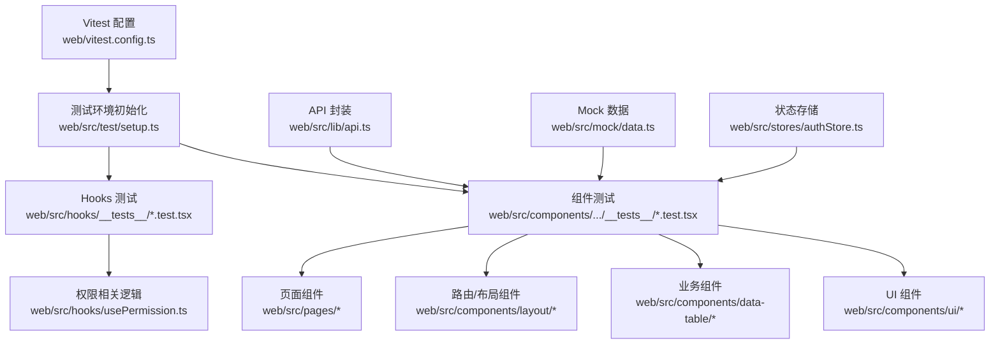
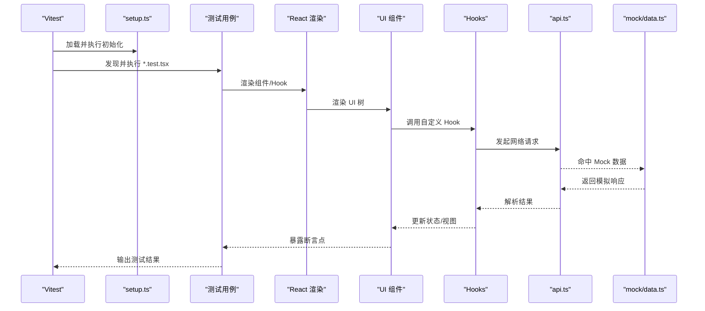
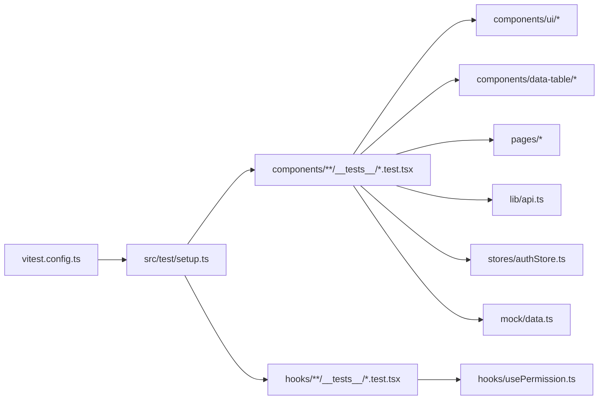

# 测试策略

<cite>
**本文引用的文件**   
- [web/vitest.config.ts](file://web/vitest.config.ts)
- [web/src/test/setup.ts](file://web/src/test/setup.ts)
- [web/package.json](file://web/package.json)
- [web/src/components/data-table/__tests__/data-table.test.tsx](file://web/src/components/data-table/__tests__/data-table.test.tsx)
- [web/src/components/layout/__tests__/require-permission.test.tsx](file://web/src/components/layout/__tests__/require-permission.test.tsx)
- [web/src/hooks/__tests__/usePermission.test.tsx](file://web/src/hooks/__tests__/usePermission.test.tsx)
- [web/src/lib/api.ts](file://web/src/lib/api.ts)
- [web/src/mock/data.ts](file://web/src/mock/data.ts)
- [web/src/stores/authStore.ts](file://web/src/stores/authStore.ts)
- [web/src/pages/login/index.tsx](file://web/src/pages/login/index.tsx)
- [web/src/pages/dashboard/index.tsx](file://web/src/pages/dashboard/index.tsx)
</cite>

## 目录
1. [简介](#简介)
2. [项目结构](#项目结构)
3. [核心组件](#核心组件)
4. [架构总览](#架构总览)
5. [详细组件分析](#详细组件分析)
6. [依赖分析](#依赖分析)
7. [性能考虑](#性能考虑)
8. [故障排查指南](#故障排查指南)
9. [结论](#结论)
10. [附录](#附录)

## 简介
本测试策略面向 pj3 项目的前端工程，目标是以 Vitest 为核心构建覆盖单元、集成与端到端（E2E）的完整测试体系。文档涵盖：
- 基于 Vitest 的单元测试框架配置与使用
- React 组件测试最佳实践（渲染、交互、异步）
- Hooks 测试策略（自定义 Hook、状态变化、副作用）
- E2E 实施方案（用户流程、跨页面导航、真实 API 集成）
- 覆盖率要求与质量门禁
- 测试数据管理与 Mock 服务搭建

## 项目结构
本项目采用“就近测试”的组织方式，将测试文件置于被测模块同级或 __tests__ 子目录中，便于维护与定位。关键测试相关位置如下：
- 测试配置：web/vitest.config.ts
- 测试环境初始化：web/src/test/setup.ts
- 示例测试用例：
  - web/src/components/data-table/__tests__/data-table.test.tsx
  - web/src/components/layout/__tests__/require-permission.test.tsx
  - web/src/hooks/__tests__/usePermission.test.tsx
- 测试数据与模拟：web/src/mock/data.ts
- 网络请求封装：web/src/lib/api.ts
- 状态管理：web/src/stores/authStore.ts
- 页面入口：web/src/pages/login/index.tsx、web/src/pages/dashboard/index.tsx

图表来源
- [web/vitest.config.ts](file://web/vitest.config.ts)
- [web/src/test/setup.ts](file://web/src/test/setup.ts)
- [web/src/components/data-table/__tests__/data-table.test.tsx](file://web/src/components/data-table/__tests__/data-table.test.tsx)
- [web/src/components/layout/__tests__/require-permission.test.tsx](file://web/src/components/layout/__tests__/require-permission.test.tsx)
- [web/src/hooks/__tests__/usePermission.test.tsx](file://web/src/hooks/__tests__/usePermission.test.tsx)
- [web/src/lib/api.ts](file://web/src/lib/api.ts)
- [web/src/mock/data.ts](file://web/src/mock/data.ts)
- [web/src/stores/authStore.ts](file://web/src/stores/authStore.ts)

章节来源
- [web/vitest.config.ts](file://web/vitest.config.ts)
- [web/src/test/setup.ts](file://web/src/test/setup.ts)
- [web/src/components/data-table/__tests__/data-table.test.tsx](file://web/src/components/data-table/__tests__/data-table.test.tsx)
- [web/src/components/layout/__tests__/require-permission.test.tsx](file://web/src/components/layout/__tests__/require-permission.test.tsx)
- [web/src/hooks/__tests__/usePermission.test.tsx](file://web/src/hooks/__tests__/usePermission.test.tsx)
- [web/src/lib/api.ts](file://web/src/lib/api.ts)
- [web/src/mock/data.ts](file://web/src/mock/data.ts)
- [web/src/stores/authStore.ts](file://web/src/stores/authStore.ts)

## 核心组件
本节聚焦测试基础设施与常用能力：
- 测试运行器与断言：以 Vitest 为运行器，默认提供 expect 等断言能力；如需扩展可引入第三方断言库。
- 测试环境：通过 setup.ts 统一注入全局对象、DOM 环境、Polyfill 等。
- 组件渲染与交互：结合 React Testing Library 进行渲染与事件触发。
- 异步与定时器：利用 Vitest 提供的 fake timers 与 async/await 支持。
- 网络层拦截：对 api.ts 的请求进行 mock 或替换实现，确保测试稳定性。
- 状态与上下文：对 authStore 等状态源进行隔离与可控注入。

章节来源
- [web/vitest.config.ts](file://web/vitest.config.ts)
- [web/src/test/setup.ts](file://web/src/test/setup.ts)
- [web/src/lib/api.ts](file://web/src/lib/api.ts)
- [web/src/stores/authStore.ts](file://web/src/stores/authStore.ts)

## 架构总览
下图展示从测试入口到被测代码的关键路径，包括组件、Hooks、API 与 Mock 的协作关系。

图表来源
- [web/vitest.config.ts](file://web/vitest.config.ts)
- [web/src/test/setup.ts](file://web/src/test/setup.ts)
- [web/src/components/data-table/__tests__/data-table.test.tsx](file://web/src/components/data-table/__tests__/data-table.test.tsx)
- [web/src/hooks/__tests__/usePermission.test.tsx](file://web/src/hooks/__tests__/usePermission.test.tsx)
- [web/src/lib/api.ts](file://web/src/lib/api.ts)
- [web/src/mock/data.ts](file://web/src/mock/data.ts)

## 详细组件分析

### 单元测试框架与配置（Vitest）
- 配置文件：在 vitest.config.ts 中定义测试环境、匹配规则、覆盖率、插件与别名等。
- 环境初始化：在 src/test/setup.ts 中完成 DOM 环境、全局变量、浏览器 API Polyfill、自定义匹配器等初始化。
- 脚本命令：在 package.json 中定义 test、coverage 等命令，便于本地与 CI 执行。

建议
- 将测试文件命名规范为 *.test.ts(x)，并按功能域组织。
- 使用 import.meta.glob 或自定义匹配规则提升发现效率。
- 通过 defineConfig 集中管理测试环境差异（如 jsdom、happy-dom）。

章节来源
- [web/vitest.config.ts](file://web/vitest.config.ts)
- [web/src/test/setup.ts](file://web/src/test/setup.ts)
- [web/package.json](file://web/package.json)

### React 组件测试最佳实践
- 渲染测试：验证初始渲染结构与样式类名，避免过度绑定具体实现细节。
- 用户交互测试：通过 fireEvent/userEvent 模拟点击、输入、选择等操作，断言视图与状态变化。
- 异步操作测试：对网络请求、定时器、Promise 链使用 waitFor、findBy* 等工具等待稳定状态。
- 边界条件：空数据、错误响应、权限不足等场景需覆盖。

示例参考
- 数据表格组件测试：[web/src/components/data-table/__tests__/data-table.test.tsx](file://web/src/components/data-table/__tests__/data-table.test.tsx)
- 权限守卫组件测试：[web/src/components/layout/__tests__/require-permission.test.tsx](file://web/src/components/layout/__tests__/require-permission.test.tsx)

章节来源
- [web/src/components/data-table/__tests__/data-table.test.tsx](file://web/src/components/data-table/__tests__/data-table.test.tsx)
- [web/src/components/layout/__tests__/require-permission.test.tsx](file://web/src/components/layout/__tests__/require-permission.test.tsx)

### Hooks 测试策略与方法
- 自定义 Hook 测试：使用 renderHook 渲染 Hook，断言返回值与副作用。
- 状态变化测试：通过 act 包裹状态变更，观察 re-render 后的结果。
- 副作用测试：对 useEffect 中的网络请求、订阅等进行 mock，验证调用次数与参数。
- 权限相关 Hook：结合权限上下文或 store 进行不同角色场景的断言。

示例参考
- 权限 Hook 测试：[web/src/hooks/__tests__/usePermission.test.tsx](file://web/src/hooks/__tests__/usePermission.test.tsx)

章节来源
- [web/src/hooks/__tests__/usePermission.test.tsx](file://web/src/hooks/__tests__/usePermission.test.tsx)

### 端到端测试实施方案
说明：当前仓库未包含 E2E 框架配置与用例。建议在后续迭代中引入 Playwright 或 Cypress，并与现有测试生态整合。

建议方案
- 用户流程测试：登录 -> 仪表盘 -> 数据管理 -> 报表导出。
- 跨页面导航测试：路由跳转、权限校验、重定向。
- 真实 API 集成测试：在独立环境中启动后端或使用 Mock Service Worker 代理真实接口。
- 并行与重试：针对不稳定环节增加重试与截图/视频录制。

章节来源
- [web/src/pages/login/index.tsx](file://web/src/pages/login/index.tsx)
- [web/src/pages/dashboard/index.tsx](file://web/src/pages/dashboard/index.tsx)

### 测试覆盖率与质量门禁
- 覆盖率阈值：建议设置语句、分支、函数、行覆盖率门槛（例如均不低于 80%），并在 vitest.config.ts 中启用 coverage 报告。
- 报告格式：生成 HTML 与 JSON 报告，便于查看与上传至 CI。
- 质量门禁：在 CI 中根据覆盖率阈值决定是否失败，阻止低质量合并。

章节来源
- [web/vitest.config.ts](file://web/vitest.config.ts)
- [web/package.json](file://web/package.json)

### 测试数据管理与 Mock 服务
- 静态数据：在 src/mock/data.ts 中维护典型数据集，供组件与 Hook 测试复用。
- API 层 Mock：对 lib/api.ts 的请求进行替换或拦截，保证测试不依赖外部服务。
- 状态隔离：对 stores/authStore.ts 的状态进行重置或注入，避免用例间污染。

章节来源
- [web/src/mock/data.ts](file://web/src/mock/data.ts)
- [web/src/lib/api.ts](file://web/src/lib/api.ts)
- [web/src/stores/authStore.ts](file://web/src/stores/authStore.ts)

## 依赖分析
下图展示测试相关的依赖关系与耦合度，帮助识别潜在循环依赖与优化点。

图表来源
- [web/vitest.config.ts](file://web/vitest.config.ts)
- [web/src/test/setup.ts](file://web/src/test/setup.ts)
- [web/src/components/data-table/__tests__/data-table.test.tsx](file://web/src/components/data-table/__tests__/data-table.test.tsx)
- [web/src/components/layout/__tests__/require-permission.test.tsx](file://web/src/components/layout/__tests__/require-permission.test.tsx)
- [web/src/hooks/__tests__/usePermission.test.tsx](file://web/src/hooks/__tests__/usePermission.test.tsx)
- [web/src/lib/api.ts](file://web/src/lib/api.ts)
- [web/src/mock/data.ts](file://web/src/mock/data.ts)
- [web/src/stores/authStore.ts](file://web/src/stores/authStore.ts)

章节来源
- [web/vitest.config.ts](file://web/vitest.config.ts)
- [web/src/test/setup.ts](file://web/src/test/setup.ts)
- [web/src/components/data-table/__tests__/data-table.test.tsx](file://web/src/components/data-table/__tests__/data-table.test.tsx)
- [web/src/components/layout/__tests__/require-permission.test.tsx](file://web/src/components/layout/__tests__/require-permission.test.tsx)
- [web/src/hooks/__tests__/usePermission.test.tsx](file://web/src/hooks/__tests__/usePermission.test.tsx)
- [web/src/lib/api.ts](file://web/src/lib/api.ts)
- [web/src/mock/data.ts](file://web/src/mock/data.ts)
- [web/src/stores/authStore.ts](file://web/src/stores/authStore.ts)

## 性能考虑
- 测试并行化：合理设置并发数，缩短整体执行时间。
- 按需渲染：仅渲染必要节点，减少不必要的 re-render。
- 精准断言：避免全量快照，优先断言关键文本与属性。
- 异步等待：使用稳定的查询与等待策略，降低抖动。
- 资源隔离：每个用例前后清理定时器、监听器与全局状态。

## 故障排查指南
常见问题与处理建议：
- 环境不一致：确认 setup.ts 已正确注入 DOM 与全局对象。
- 异步竞态：使用 waitFor 或 findBy* 替代立即断言。
- Mock 失效：检查 api.ts 的拦截是否生效，必要时替换实现。
- 状态污染：在每个用例前重置 authStore 或相关上下文。
- 覆盖率异常：确认 vitest.config.ts 中 include/exclude 与 reporter 配置正确。

章节来源
- [web/src/test/setup.ts](file://web/src/test/setup.ts)
- [web/src/lib/api.ts](file://web/src/lib/api.ts)
- [web/src/stores/authStore.ts](file://web/src/stores/authStore.ts)
- [web/vitest.config.ts](file://web/vitest.config.ts)

## 结论
本策略围绕 Vitest 构建了清晰的测试分层与落地路径：以组件与 Hook 的单元测试为主，辅以 Mock 与数据管理，逐步引入 E2E 与覆盖率门禁。通过统一的配置与最佳实践，可在保证质量的同时提升开发效率与可维护性。

## 附录
- 术语
  - 单元测试：针对最小可测单元的自动化验证
  - 集成测试：验证多个模块协作的正确性
  - 端到端测试：模拟真实用户行为的全链路测试
  - 覆盖率：衡量代码被测试覆盖的比例
- 推荐工具
  - 运行器：Vitest
  - 渲染与交互：React Testing Library
  - E2E：Playwright 或 Cypress（待引入）
  - Mock：MSW 或自定义拦截（结合 api.ts）