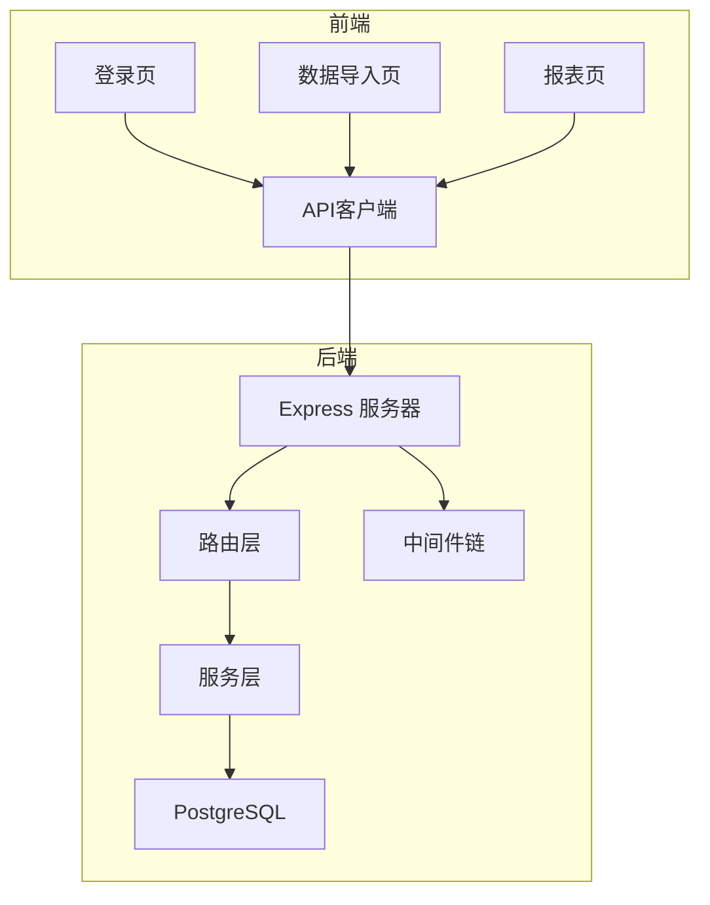
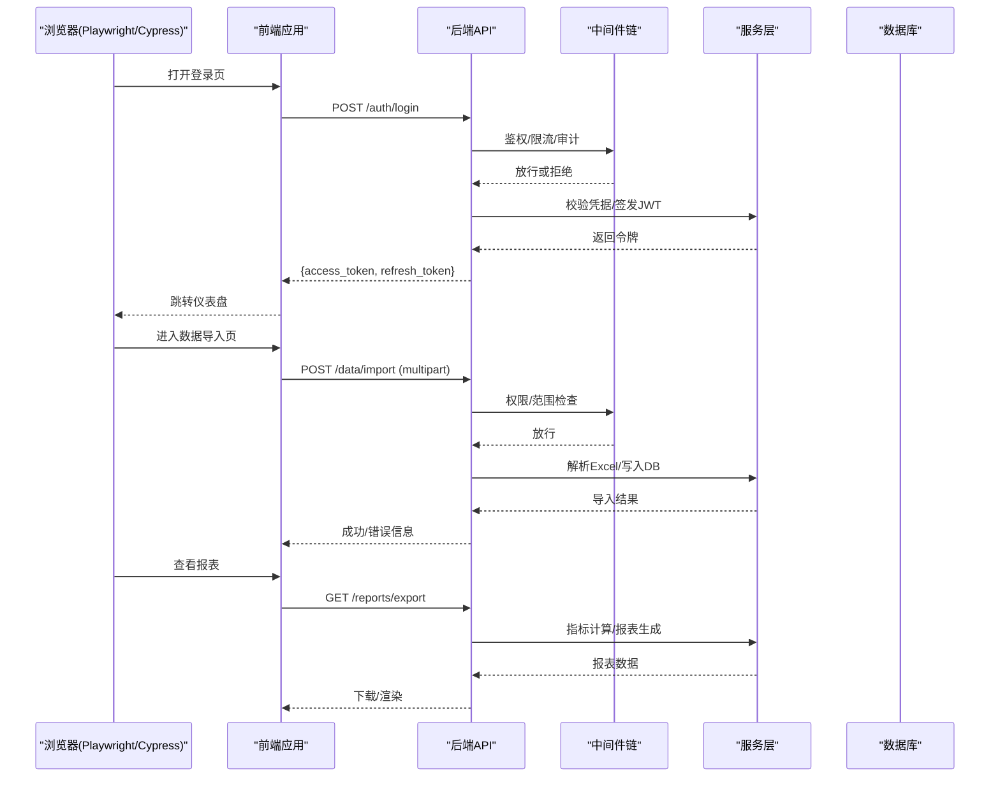
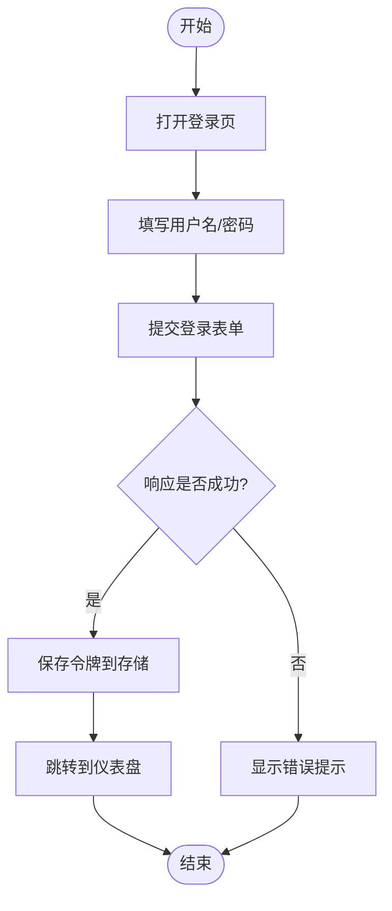
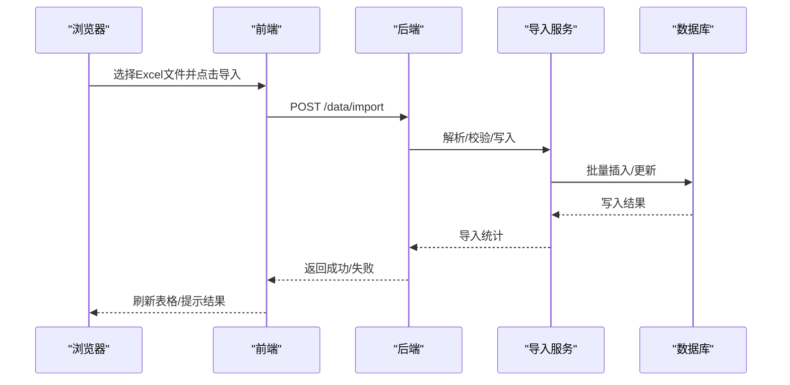
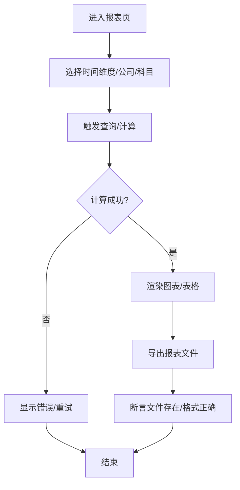
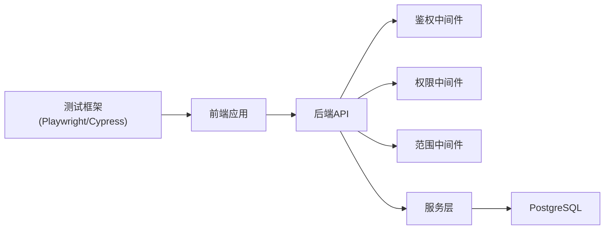

# 端到端测试

<cite>
**本文引用的文件**   
- [server/package.json](file://server/package.json)
- [server/src/app.ts](file://server/src/app.ts)
- [server/src/server.ts](file://server/src/server.ts)
- [server/src/middleware/auth.ts](file://server/src/middleware/auth.ts)
- [server/src/middleware/permission.ts](file://server/src/middleware/permission.ts)
- [server/src/middleware/scope.ts](file://server/src/middleware/scope.ts)
- [server/src/routes/auth.ts](file://server/src/routes/auth.ts)
- [server/src/routes/data.ts](file://server/src/routes/data.ts)
- [server/src/routes/reports.ts](file://server/src/routes/reports.ts)
- [server/src/services/AuthService.ts](file://server/src/services/AuthService.ts)
- [server/src/services/ImportService.ts](file://server/src/services/ImportService.ts)
- [server/src/services/ReportService.ts](file://server/src/services/ReportService.ts)
- [web/package.json](file://web/package.json)
- [web/vite.config.ts](file://web/vite.config.ts)
- [web/src/pages/login/index.tsx](file://web/src/pages/login/index.tsx)
- [web/src/pages/data/index.tsx](file://web/src/pages/data/index.tsx)
- [web/src/pages/reports/index.tsx](file://web/src/pages/reports/index.tsx)
- [web/src/hooks/useAuth.ts](file://web/src/hooks/useAuth.ts)
- [web/src/stores/authStore.ts](file://web/src/stores/authStore.ts)
- [web/src/lib/api.ts](file://web/src/lib/api.ts)
</cite>

## 目录
1. [简介](#简介)
2. [项目结构](#项目结构)
3. [核心组件](#核心组件)
4. [架构总览](#架构总览)
5. [详细组件分析](#详细组件分析)
6. [依赖关系分析](#依赖关系分析)
7. [性能考量](#性能考量)
8. [故障排查指南](#故障排查指南)
9. [结论](#结论)
10. [附录](#附录)

## 简介
本文件面向FY200项目的端到端（E2E）测试，目标是覆盖“Excel进、看板/报表出”的核心业务闭环：登录认证、数据导入、指标分析与报表生成。文档将给出工具选型与配置建议（Playwright/Cypress）、跨页面导航与表单验证策略、实时数据更新与视觉回归方案、测试环境搭建（后端服务、Mock、测试数据）、移动端适配与跨浏览器兼容性实践，以及持续集成中的执行与报告输出。

## 项目结构
FY200采用前后端分离架构：
- 后端：Express + Prisma + PostgreSQL，提供鉴权、数据导入、指标计算与报表导出等API。
- 前端：React/Vite应用，包含登录、数据管理、指标看板与报表编辑等页面。

图表来源
- [server/src/server.ts](file://server/src/server.ts)
- [server/src/app.ts](file://server/src/app.ts)
- [web/src/lib/api.ts](file://web/src/lib/api.ts)

章节来源
- [server/package.json](file://server/package.json)
- [web/package.json](file://web/package.json)

## 核心组件
- 登录认证流程：前端调用鉴权接口，服务端校验JWT并返回令牌；后续请求携带Token通过鉴权中间件。
- 数据导入流程：前端上传Excel，后端解析并写入数据库，支持公式规则与权限控制。
- 指标分析与报表：后端基于安全公式与聚合服务计算同比/环比，前端渲染图表与报表。

章节来源
- [server/src/routes/auth.ts](file://server/src/routes/auth.ts)
- [server/src/services/AuthService.ts](file://server/src/services/AuthService.ts)
- [server/src/routes/data.ts](file://server/src/routes/data.ts)
- [server/src/services/ImportService.ts](file://server/src/services/ImportService.ts)
- [server/src/routes/reports.ts](file://server/src/routes/reports.ts)
- [server/src/services/ReportService.ts](file://server/src/services/ReportService.ts)

## 架构总览
下图展示E2E测试中关键交互路径：从浏览器触发操作到后端处理与数据库落库的完整链路。

图表来源
- [server/src/app.ts](file://server/src/app.ts)
- [server/src/middleware/auth.ts](file://server/src/middleware/auth.ts)
- [server/src/middleware/permission.ts](file://server/src/middleware/permission.ts)
- [server/src/middleware/scope.ts](file://server/src/middleware/scope.ts)
- [server/src/routes/auth.ts](file://server/src/routes/auth.ts)
- [server/src/routes/data.ts](file://server/src/routes/data.ts)
- [server/src/routes/reports.ts](file://server/src/routes/reports.ts)

## 详细组件分析

### 登录认证E2E用例设计
- 目标：验证用户可成功登录并获得有效访问令牌，且受权限与范围控制的资源访问正常。
- 关键断言：
  - 登录成功后重定向至仪表盘或首页。
  - 后续请求头携带有效的access_token。
  - 无权限访问被拒绝（403）。
- 推荐实现要点：
  - 使用浏览器上下文保存Cookie/LocalStorage以便跨页面保持会话。
  - 对失败场景（错误密码、账号锁定）进行负向用例覆盖。

章节来源
- [web/src/pages/login/index.tsx](file://web/src/pages/login/index.tsx)
- [web/src/hooks/useAuth.ts](file://web/src/hooks/useAuth.ts)
- [web/src/stores/authStore.ts](file://web/src/stores/authStore.ts)
- [server/src/routes/auth.ts](file://server/src/routes/auth.ts)
- [server/src/services/AuthService.ts](file://server/src/services/AuthService.ts)
- [server/src/middleware/auth.ts](file://server/src/middleware/auth.ts)

### 数据导入E2E用例设计
- 目标：验证Excel上传、解析、入库与权限控制的全流程。
- 关键断言：
  - 上传成功后列表刷新并显示导入记录。
  - 非法文件格式或内容被拒绝并提示。
  - 越权导入被拦截。
- 推荐实现要点：
  - 使用Multipart上传模拟真实文件选择。
  - 等待后端异步任务完成后再断言UI状态。

图表来源
- [server/src/routes/data.ts](file://server/src/routes/data.ts)
- [server/src/services/ImportService.ts](file://server/src/services/ImportService.ts)

章节来源
- [web/src/pages/data/index.tsx](file://web/src/pages/data/index.tsx)
- [server/src/routes/data.ts](file://server/src/routes/data.ts)
- [server/src/services/ImportService.ts](file://server/src/services/ImportService.ts)

### 指标分析与报表生成E2E用例设计
- 目标：验证指标计算、可视化渲染与报表导出。
- 关键断言：
  - 图表数据与后端计算一致。
  - 报表导出文件可用且内容正确。
- 推荐实现要点：
  - 使用稳定的选择器定位图表容器与数值节点。
  - 对导出文件进行类型与大小断言，必要时校验首行字段。

章节来源
- [web/src/pages/reports/index.tsx](file://web/src/pages/reports/index.tsx)
- [server/src/routes/reports.ts](file://server/src/routes/reports.ts)
- [server/src/services/ReportService.ts](file://server/src/services/ReportService.ts)

### 跨页面导航与表单提交验证策略
- 跨页面导航：
  - 登录后自动跳转，断言URL与页面标题。
  - 菜单点击后断言路由变化与组件加载。
- 表单提交：
  - 必填项缺失时阻止提交并提示。
  - 提交后等待网络请求完成再断言结果。
- 推荐实践：
  - 使用语义化选择器（data-testid）提升稳定性。
  - 对异步操作使用显式等待而非固定sleep。

章节来源
- [web/src/pages/login/index.tsx](file://web/src/pages/login/index.tsx)
- [web/src/pages/data/index.tsx](file://web/src/pages/data/index.tsx)
- [web/src/pages/reports/index.tsx](file://web/src/pages/reports/index.tsx)

### 实时数据更新的测试策略
- 若使用SSE/WebSocket，需监听事件通道并断言UI增量更新。
- 若无实时通道，可通过轮询接口或手动触发刷新按钮进行断言。
- 推荐实践：
  - 捕获网络请求并断言响应结构与耗时阈值。
  - 对高频更新场景使用节流/去抖断言，避免抖动导致不稳定。

章节来源
- [server/src/routes/auth.ts](file://server/src/routes/auth.ts)
- [server/src/routes/data.ts](file://server/src/routes/data.ts)
- [server/src/routes/reports.ts](file://server/src/routes/reports.ts)

### 截图对比与视觉回归测试
- 基线截图：在稳定版本下录制关键页面的截图作为基线。
- 对比策略：允许像素级差异阈值，忽略动态元素（时间戳、随机ID）。
- 推荐实践：
  - 固定视口尺寸与设备像素比。
  - 对动画/过渡先暂停再截图。
  - 分模块维护基线，便于定位变更影响。

章节来源
- [web/src/pages/dashboard/index.tsx](file://web/src/pages/dashboard/index.tsx)
- [web/src/pages/reports/index.tsx](file://web/src/pages/reports/index.tsx)

### 测试环境搭建
- 后端服务：
  - 启动Express服务，连接本地或CI环境的PostgreSQL。
  - 使用Prisma迁移初始化数据库，并执行种子数据脚本准备基础数据。
- Mock服务：
  - 对第三方AI接口（如DeepSeek）使用Mock或本地代理，确保离线可测。
- 前端开发服务器：
  - 使用Vite启动本地前端，设置环境变量指向后端API地址。
- 推荐实践：
  - 使用Docker Compose编排数据库与后端服务。
  - 为每个测试套件隔离数据库事务或Schema前缀。

章节来源
- [server/src/server.ts](file://server/src/server.ts)
- [server/src/app.ts](file://server/src/app.ts)
- [web/vite.config.ts](file://web/vite.config.ts)

### 移动端适配与跨浏览器兼容性
- 移动端适配：
  - 使用不同视口与UA模拟手机/平板设备。
  - 针对触摸交互补充手势操作（长按、滑动）。
- 跨浏览器：
  - 在CI中并行执行Chrome/Firefox/Safari（如可用）。
  - 关注CSS布局差异与字体渲染导致的视觉回归。
- 推荐实践：
  - 使用响应式断点矩阵组织用例。
  - 对关键路径进行多浏览器冒烟测试。

章节来源
- [web/vite.config.ts](file://web/vite.config.ts)

### 持续集成中的E2E执行与报告
- 执行策略：
  - 构建镜像/安装依赖 → 启动数据库与服务 → 运行E2E套件 → 收集报告。
- 报告与产物：
  - 生成HTML报告与截图归档，失败用例自动附日志。
- 推荐实践：
  - 使用并行执行加速，但保证数据隔离。
  - 对不稳定用例进行重试与隔离。

章节来源
- [server/package.json](file://server/package.json)
- [web/package.json](file://web/package.json)

## 依赖关系分析
E2E测试涉及的前后端依赖如下：

图表来源
- [server/src/app.ts](file://server/src/app.ts)
- [server/src/middleware/auth.ts](file://server/src/middleware/auth.ts)
- [server/src/middleware/permission.ts](file://server/src/middleware/permission.ts)
- [server/src/middleware/scope.ts](file://server/src/middleware/scope.ts)
- [server/src/routes/auth.ts](file://server/src/routes/auth.ts)
- [server/src/routes/data.ts](file://server/src/routes/data.ts)
- [server/src/routes/reports.ts](file://server/src/routes/reports.ts)

章节来源
- [server/src/app.ts](file://server/src/app.ts)
- [server/src/middleware/auth.ts](file://server/src/middleware/auth.ts)
- [server/src/middleware/permission.ts](file://server/src/middleware/permission.ts)
- [server/src/middleware/scope.ts](file://server/src/middleware/scope.ts)

## 性能考量
- 网络层：
  - 限制并发请求数，避免压垮后端。
  - 对慢接口增加超时与重试策略。
- UI层：
  - 减少不必要的截图与DOM遍历。
  - 使用稳定的选择器与显式等待降低抖动。
- 数据层：
  - 使用最小必要数据集，缩短导入与查询时间。
  - 对热点查询添加索引（由后端负责）。

[本节为通用指导，不直接分析具体文件]

## 故障排查指南
- 登录失败：
  - 检查JWT签发与黑名单逻辑，确认Token有效期与刷新机制。
- 导入报错：
  - 核对Excel模板与字段映射，检查权限与范围过滤。
- 报表异常：
  - 验证公式解析与聚合计算，确认时间维度与单位换算。
- 常见手段：
  - 启用调试日志与网络抓包。
  - 截取失败时刻的页面与控制台日志。

章节来源
- [server/src/middleware/auth.ts](file://server/src/middleware/auth.ts)
- [server/src/services/AuthService.ts](file://server/src/services/AuthService.ts)
- [server/src/services/ImportService.ts](file://server/src/services/ImportService.ts)
- [server/src/services/ReportService.ts](file://server/src/services/ReportService.ts)

## 结论
通过系统化的E2E测试设计与实现，FY200项目可在登录认证、数据导入、指标分析与报表生成等关键路径上获得高置信度的质量保障。结合截图对比、跨浏览器与移动端适配、以及CI中的自动化执行，可有效降低回归风险并提升交付效率。

[本节为总结性内容，不直接分析具体文件]

## 附录
- 工具选型建议：
  - Playwright：跨浏览器、内置截图与网络拦截、适合复杂工作流。
  - Cypress：开发者友好、调试体验佳，适合前端主导的E2E。
- 最佳实践清单：
  - 使用data-testid稳定选择器。
  - 显式等待网络与UI状态。
  - 隔离测试数据与数据库事务。
  - 维护基线截图与差异阈值。
  - 在CI中并行执行并归档报告。

[本节为通用指导，不直接分析具体文件]