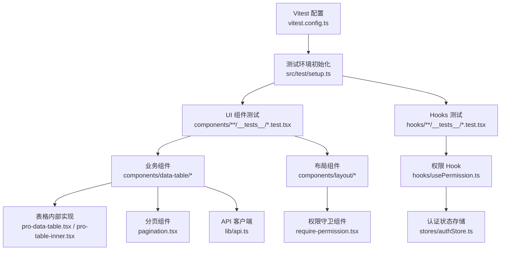
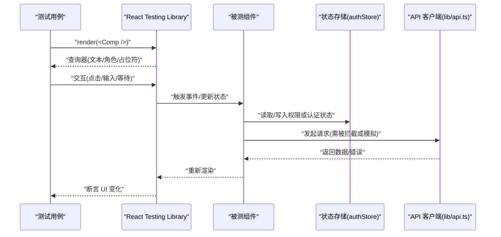
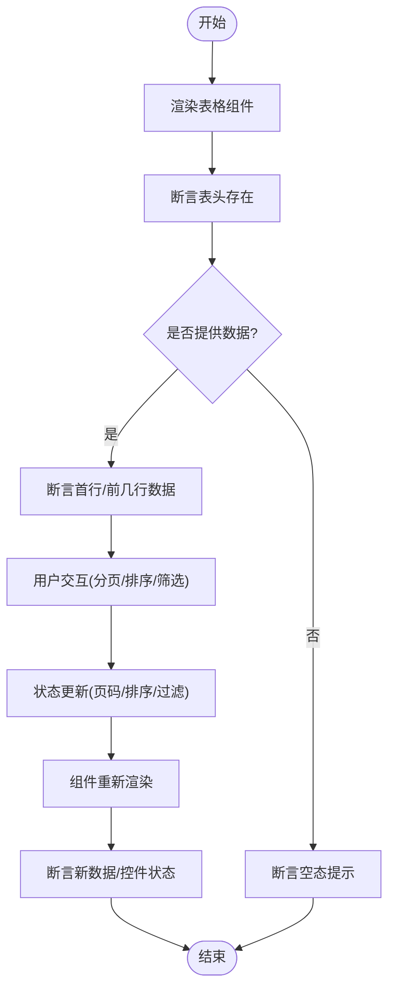
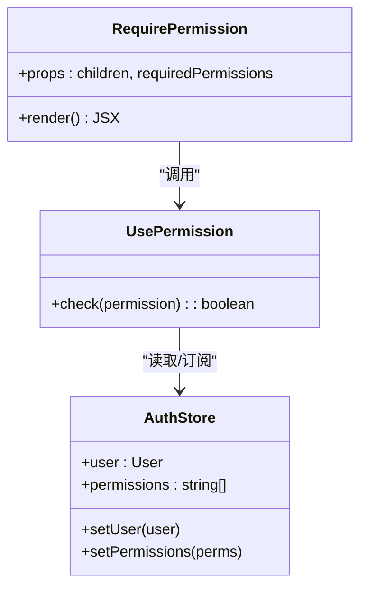
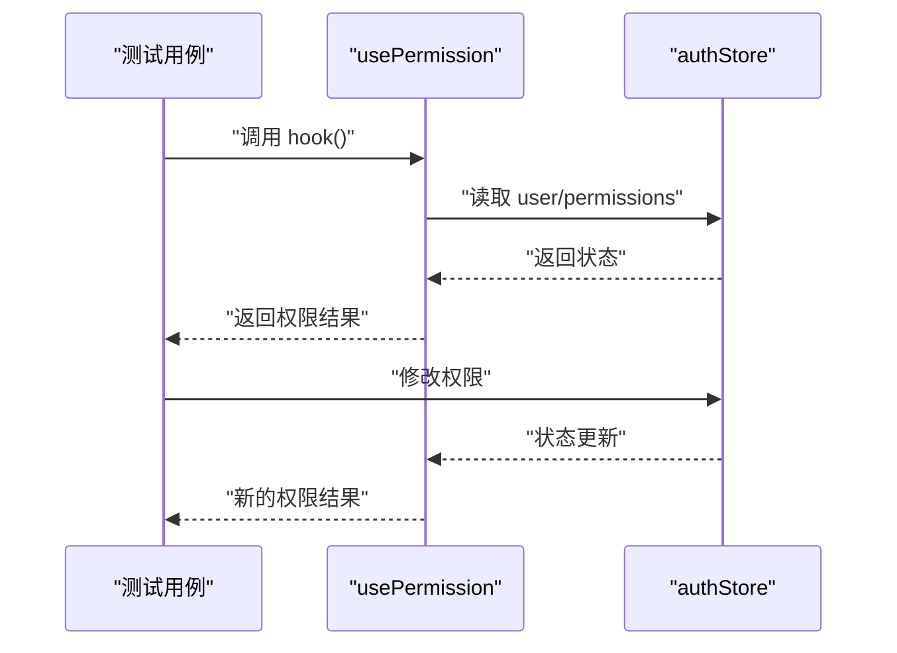
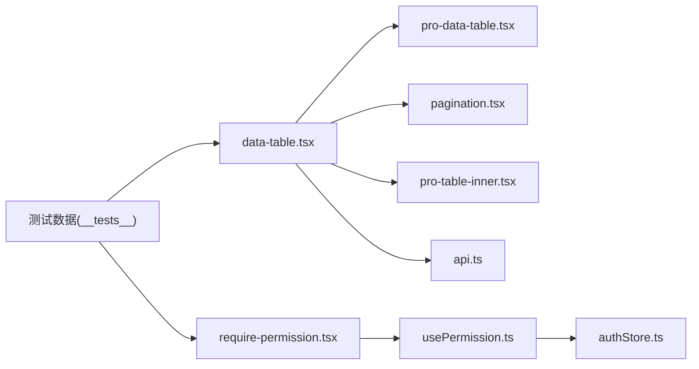

# 组件测试

<cite>
**本文引用的文件**   
- [web/src/components/data-table/__tests__/data-table.test.tsx](file://web/src/components/data-table/__tests__/data-table.test.tsx)
- [web/src/components/layout/__tests__/require-permission.test.tsx](file://web/src/components/layout/__tests__/require-permission.test.tsx)
- [web/src/hooks/__tests__/usePermission.test.tsx](file://web/src/hooks/__tests__/usePermission.test.tsx)
- [web/src/test/setup.ts](file://web/src/test/setup.ts)
- [web/vitest.config.ts](file://web/vitest.config.ts)
- [web/package.json](file://web/package.json)
- [web/src/components/data-table/data-table.tsx](file://web/src/components/data-table/data-table.tsx)
- [web/src/components/data-table/pro-data-table.tsx](file://web/src/components/data-table/pro-data-table.tsx)
- [web/src/components/data-table/pagination.tsx](file://web/src/components/data-table/pagination.tsx)
- [web/src/components/data-table/pro-table-inner.tsx](file://web/src/components/data-table/pro-table-inner.tsx)
- [web/src/components/layout/require-permission.tsx](file://web/src/components/layout/require-permission.tsx)
- [web/src/hooks/usePermission.ts](file://web/src/hooks/usePermission.ts)
- [web/src/stores/authStore.ts](file://web/src/stores/authStore.ts)
- [web/src/lib/api.ts](file://web/src/lib/api.ts)
</cite>

## 目录
1. [简介](#简介)
2. [项目结构](#项目结构)
3. [核心组件](#核心组件)
4. [架构总览](#架构总览)
5. [详细组件分析](#详细组件分析)
6. [依赖分析](#依赖分析)
7. [性能考虑](#性能考虑)
8. [故障排查指南](#故障排查指南)
9. [结论](#结论)
10. [附录](#附录)

## 简介
本指南面向使用 React Testing Library 进行 React 组件测试的工程师，结合仓库中已有的测试与组件实现，系统讲解：
- 组件渲染、用户交互、状态变化等核心场景的测试策略
- 复杂组件的 props 传递、事件处理、副作用行为测试方法
- 组件组合测试（父子通信、Provider 上下文）实践
- 异步组件、错误边界、加载状态等高级场景
- 快照测试的使用与注意事项
- 测试数据模拟与 API 拦截方案，提升测试独立性与可靠性

## 项目结构
本项目采用 Vite + Vitest 的前端工程化方案，测试配置位于 vitest.config.ts，测试环境初始化在 src/test/setup.ts。组件按功能域组织，例如 data-table、layout、ui 等，每个组件可附带 __tests__ 目录下的单测文件。

图表来源
- [web/vitest.config.ts](file://web/vitest.config.ts)
- [web/src/test/setup.ts](file://web/src/test/setup.ts)
- [web/src/components/data-table/data-table.tsx](file://web/src/components/data-table/data-table.tsx)
- [web/src/components/data-table/pro-data-table.tsx](file://web/src/components/data-table/pro-data-table.tsx)
- [web/src/components/data-table/pagination.tsx](file://web/src/components/data-table/pagination.tsx)
- [web/src/components/data-table/pro-table-inner.tsx](file://web/src/components/data-table/pro-table-inner.tsx)
- [web/src/components/layout/require-permission.tsx](file://web/src/components/layout/require-permission.tsx)
- [web/src/hooks/usePermission.ts](file://web/src/hooks/usePermission.ts)
- [web/src/stores/authStore.ts](file://web/src/stores/authStore.ts)
- [web/src/lib/api.ts](file://web/src/lib/api.ts)

章节来源
- [web/vitest.config.ts](file://web/vitest.config.ts)
- [web/src/test/setup.ts](file://web/src/test/setup.ts)
- [web/package.json](file://web/package.json)

## 核心组件
围绕数据表格与权限控制两大核心领域，梳理关键组件及其职责：
- 数据表格族
  - data-table.tsx：对外暴露的表格入口，聚合列定义、数据源、分页与排序等能力
  - pro-data-table.tsx：增强版表格，封装更复杂的交互与展示逻辑
  - pro-table-inner.tsx：内部实现细节，负责行渲染、单元格操作等
  - pagination.tsx：分页控件，支持页码切换、每页条数调整
- 权限控制
  - require-permission.tsx：基于权限的页面/路由级守卫组件
  - usePermission.ts：权限判断 Hook，通常读取认证状态并返回权限结果
  - authStore.ts：认证与权限状态集中管理

章节来源
- [web/src/components/data-table/data-table.tsx](file://web/src/components/data-table/data-table.tsx)
- [web/src/components/data-table/pro-data-table.tsx](file://web/src/components/data-table/pro-data-table.tsx)
- [web/src/components/data-table/pro-table-inner.tsx](file://web/src/components/data-table/pro-table-inner.tsx)
- [web/src/components/data-table/pagination.tsx](file://web/src/components/data-table/pagination.tsx)
- [web/src/components/layout/require-permission.tsx](file://web/src/components/layout/require-permission.tsx)
- [web/src/hooks/usePermission.ts](file://web/src/hooks/usePermission.ts)
- [web/src/stores/authStore.ts](file://web/src/stores/authStore.ts)

## 架构总览
下图展示了测试驱动的关键路径：从测试入口到组件渲染、用户交互、状态更新以及外部依赖（如 API）的隔离方式。

图表来源
- [web/src/components/data-table/data-table.tsx](file://web/src/components/data-table/data-table.tsx)
- [web/src/components/data-table/pro-data-table.tsx](file://web/src/components/data-table/pro-data-table.tsx)
- [web/src/components/data-table/pro-table-inner.tsx](file://web/src/components/data-table/pro-table-inner.tsx)
- [web/src/components/data-table/pagination.tsx](file://web/src/components/data-table/pagination.tsx)
- [web/src/components/layout/require-permission.tsx](file://web/src/components/layout/require-permission.tsx)
- [web/src/hooks/usePermission.ts](file://web/src/hooks/usePermission.ts)
- [web/src/stores/authStore.ts](file://web/src/stores/authStore.ts)
- [web/src/lib/api.ts](file://web/src/lib/api.ts)

## 详细组件分析

### 数据表格组件测试
目标：验证表格渲染、列展示、分页交互、排序与筛选、空态与错误态。

- 渲染测试要点
  - 传入最小 props 集合，断言表头与首行可见
  - 校验空数据时的占位提示
  - 校验错误数据时的错误提示
- 用户交互测试要点
  - 点击分页按钮，断言当前页码与数据变更
  - 输入搜索条件后，断言过滤后的列表
  - 点击排序列头，断言排序方向与数据顺序
- 状态变化测试要点
  - 通过 store 或 context 改变权限，断言操作按钮显隐
  - 切换每页条数，断言分页控件与数据量匹配
- 复杂 props 与组合测试
  - 组合 pro-data-table 与 pagination，验证跨组件状态同步
  - 注入自定义渲染函数，断言单元格内容

图表来源
- [web/src/components/data-table/data-table.tsx](file://web/src/components/data-table/data-table.tsx)
- [web/src/components/data-table/pro-data-table.tsx](file://web/src/components/data-table/pro-data-table.tsx)
- [web/src/components/data-table/pro-table-inner.tsx](file://web/src/components/data-table/pro-table-inner.tsx)
- [web/src/components/data-table/pagination.tsx](file://web/src/components/data-table/pagination.tsx)

章节来源
- [web/src/components/data-table/__tests__/data-table.test.tsx](file://web/src/components/data-table/__tests__/data-table.test.tsx)
- [web/src/components/data-table/data-table.tsx](file://web/src/components/data-table/data-table.tsx)
- [web/src/components/data-table/pro-data-table.tsx](file://web/src/components/data-table/pro-data-table.tsx)
- [web/src/components/data-table/pro-table-inner.tsx](file://web/src/components/data-table/pro-table-inner.tsx)
- [web/src/components/data-table/pagination.tsx](file://web/src/components/data-table/pagination.tsx)

### 权限守卫组件测试
目标：验证不同权限下组件的显示/隐藏与跳转行为。

- 渲染测试要点
  - 无权限时，断言未渲染子组件或显示“无权限”提示
  - 有权限时，断言子组件正常渲染
- 组合与 Provider 测试
  - 使用认证 Provider 包裹被测组件，设置不同用户状态
  - 断言在不同权限状态下，路由或页面内容的差异
- 异步权限检查
  - 若权限判定涉及异步请求，使用等待机制确保最终状态稳定后再断言

图表来源
- [web/src/components/layout/require-permission.tsx](file://web/src/components/layout/require-permission.tsx)
- [web/src/hooks/usePermission.ts](file://web/src/hooks/usePermission.ts)
- [web/src/stores/authStore.ts](file://web/src/stores/authStore.ts)

章节来源
- [web/src/components/layout/__tests__/require-permission.test.tsx](file://web/src/components/layout/__tests__/require-permission.test.tsx)
- [web/src/components/layout/require-permission.tsx](file://web/src/components/layout/require-permission.tsx)
- [web/src/hooks/usePermission.ts](file://web/src/hooks/usePermission.ts)
- [web/src/stores/authStore.ts](file://web/src/stores/authStore.ts)

### 权限 Hook 测试
目标：验证权限判断逻辑在不同用户与权限集下的正确性。

- 单元测试要点
  - 构造不同用户对象与权限数组，断言 check 返回值
  - 模拟权限状态变更，断言 Hook 响应式更新
- 集成测试要点
  - 将 Hook 置于真实 Provider 环境中，断言 UI 层联动

图表来源
- [web/src/hooks/usePermission.ts](file://web/src/hooks/usePermission.ts)
- [web/src/stores/authStore.ts](file://web/src/stores/authStore.ts)

章节来源
- [web/src/hooks/__tests__/usePermission.test.tsx](file://web/src/hooks/__tests__/usePermission.test.tsx)
- [web/src/hooks/usePermission.ts](file://web/src/hooks/usePermission.ts)
- [web/src/stores/authStore.ts](file://web/src/stores/authStore.ts)

### 异步组件与错误边界测试
- 异步组件
  - 使用等待工具确保网络请求完成后再断言
  - 对超时与失败分支编写断言，保证健壮性
- 错误边界
  - 触发子组件抛出异常，断言错误边界捕获并展示降级 UI
  - 验证错误信息中包含必要上下文，便于定位问题

章节来源
- [web/src/components/data-table/__tests__/data-table.test.tsx](file://web/src/components/data-table/__tests__/data-table.test.tsx)
- [web/src/components/layout/__tests__/require-permission.test.tsx](file://web/src/components/layout/__tests__/require-permission.test.tsx)

### 快照测试
- 适用场景
  - 静态 UI 结构一致性保障（如卡片、徽章、标签等基础 UI 组件）
- 注意事项
  - 快照应关注稳定的 DOM 结构，避免包含时间戳、随机 ID 等不稳定值
  - 定期审查快照变更，防止误改导致大量快照失效

章节来源
- [web/src/components/ui/badge.tsx](file://web/src/components/ui/badge.tsx)
- [web/src/components/ui/card.tsx](file://web/src/components/ui/card.tsx)
- [web/src/components/ui/button.tsx](file://web/src/components/ui/button.tsx)

### 测试数据模拟与 API 拦截
- 数据模拟
  - 为表格提供固定数据集，确保断言稳定
  - 使用工厂函数生成不同状态的假数据（空、错误、分页）
- API 拦截
  - 在 vitest 环境下对 fetch/XMLHttpRequest 进行 mock
  - 针对成功与失败两种分支分别断言 UI 表现
  - 对于鉴权相关请求，可在 setup 中统一注入 token 或拒绝访问

章节来源
- [web/src/lib/api.ts](file://web/src/lib/api.ts)
- [web/src/test/setup.ts](file://web/src/test/setup.ts)
- [web/vitest.config.ts](file://web/vitest.config.ts)

## 依赖分析
下图展示组件与测试之间的依赖关系，帮助理解耦合点与优化空间。

图表来源
- [web/src/components/data-table/__tests__/data-table.test.tsx](file://web/src/components/data-table/__tests__/data-table.test.tsx)
- [web/src/components/layout/__tests__/require-permission.test.tsx](file://web/src/components/layout/__tests__/require-permission.test.tsx)
- [web/src/components/data-table/data-table.tsx](file://web/src/components/data-table/data-table.tsx)
- [web/src/components/data-table/pro-data-table.tsx](file://web/src/components/data-table/pro-data-table.tsx)
- [web/src/components/data-table/pagination.tsx](file://web/src/components/data-table/pagination.tsx)
- [web/src/components/data-table/pro-table-inner.tsx](file://web/src/components/data-table/pro-table-inner.tsx)
- [web/src/components/layout/require-permission.tsx](file://web/src/components/layout/require-permission.tsx)
- [web/src/hooks/usePermission.ts](file://web/src/hooks/usePermission.ts)
- [web/src/stores/authStore.ts](file://web/src/stores/authStore.ts)
- [web/src/lib/api.ts](file://web/src/lib/api.ts)

章节来源
- [web/src/components/data-table/__tests__/data-table.test.tsx](file://web/src/components/data-table/__tests__/data-table.test.tsx)
- [web/src/components/layout/__tests__/require-permission.test.tsx](file://web/src/components/layout/__tests__/require-permission.test.tsx)
- [web/src/components/data-table/data-table.tsx](file://web/src/components/data-table/data-table.tsx)
- [web/src/components/data-table/pro-data-table.tsx](file://web/src/components/data-table/pro-data-table.tsx)
- [web/src/components/data-table/pagination.tsx](file://web/src/components/data-table/pagination.tsx)
- [web/src/components/data-table/pro-table-inner.tsx](file://web/src/components/data-table/pro-table-inner.tsx)
- [web/src/components/layout/require-permission.tsx](file://web/src/components/layout/require-permission.tsx)
- [web/src/hooks/usePermission.ts](file://web/src/hooks/usePermission.ts)
- [web/src/stores/authStore.ts](file://web/src/stores/authStore.ts)
- [web/src/lib/api.ts](file://web/src/lib/api.ts)

## 性能考虑
- 减少不必要的重渲染
  - 拆分大组件为小单元，降低测试与运行时的渲染成本
- 合理选择查询器
  - 优先使用语义化查询（文本、角色、占位符），避免脆弱选择器
- 批量断言与等待
  - 合并多次断言，减少重复渲染；使用稳定等待策略避免竞态

[本节为通用建议，不直接分析具体文件]

## 故障排查指南
- 常见问题
  - 异步未等待：使用等待工具确保网络或状态稳定后再断言
  - 快照频繁失效：剔除不稳定值（时间戳、随机 ID），或使用比较忽略策略
  - 权限状态不一致：在测试 setup 中统一初始化认证与权限状态
- 调试技巧
  - 打印组件树或输出关键节点，定位渲染差异
  - 缩小范围，先断言最小可用子树，再逐步扩展

章节来源
- [web/src/test/setup.ts](file://web/src/test/setup.ts)
- [web/vitest.config.ts](file://web/vitest.config.ts)

## 结论
通过以用户行为为中心的测试策略、合理的组件拆分与依赖隔离、完善的模拟与拦截方案，可以构建高可靠、易维护的 React 组件测试体系。建议在项目中持续完善测试覆盖，尤其关注复杂交互与异步流程，确保 UI 一致性与业务稳定性。

[本节为总结性内容，不直接分析具体文件]

## 附录
- 测试环境配置参考
  - vitest.config.ts：全局配置、测试环境、覆盖率等
  - setup.ts：测试前置初始化（如全局 mock、polyfill）
- 包依赖参考
  - package.json：确认已安装 React Testing Library、Vitest 及相关插件

章节来源
- [web/vitest.config.ts](file://web/vitest.config.ts)
- [web/src/test/setup.ts](file://web/src/test/setup.ts)
- [web/package.json](file://web/package.json)