# 集成测试

<cite>
**本文引用的文件**   
- [web/vitest.config.ts](file://web/vitest.config.ts)
- [web/src/test/setup.ts](file://web/src/test/setup.ts)
- [web/src/lib/api.ts](file://web/src/lib/api.ts)
- [web/src/stores/authStore.ts](file://web/src/stores/authStore.ts)
- [web/src/hooks/useAuth.ts](file://web/src/hooks/useAuth.ts)
- [web/src/pages/login/index.tsx](file://web/src/pages/login/index.tsx)
- [web/src/pages/dashboard/index.tsx](file://web/src/pages/dashboard/index.tsx)
- [web/src/components/data-table/__tests__/data-table.test.tsx](file://web/src/components/data-table/__tests__/data-table.test.tsx)
- [web/src/components/layout/__tests__/require-permission.test.tsx](file://web/src/components/layout/__tests__/require-permission.test.tsx)
- [web/src/hooks/__tests__/usePermission.test.tsx](file://web/src/hooks/__tests__/usePermission.test.tsx)
- [web/src/mock/data.ts](file://web/src/mock/data.ts)
- [web/package.json](file://web/package.json)
- [server/src/test/integration-crud.test.ts](file://server/src/test/integration-crud.test.ts)
- [server/src/test/integration.test.ts](file://server/src/test/integration.test.ts)
- [server/src/test/setup.ts](file://server/src/test/setup.ts)
- [server/src/services/ReclassificationService.ts](file://server/src/services/ReclassificationService.ts)
</cite>

## 更新摘要
**变更内容**   
- 新增后端集成测试章节，涵盖CRUD操作和重分类功能的完整测试覆盖
- 扩展API客户端集成测试，包含服务器端测试验证
- 增加数据库集成测试策略，确保数据一致性验证
- 补充Mock服务和测试数据搭建的高级功能说明
- **新增** 基于最新API端点的集成测试用例，增强端到端验证能力

## 目录
1. [简介](#简介)
2. [项目结构](#项目结构)
3. [核心组件](#核心组件)
4. [架构总览](#架构总览)
5. [详细组件分析](#详细组件分析)
6. [后端集成测试](#后端集成测试)
7. [依赖分析](#依赖分析)
8. [性能考虑](#性能考虑)
9. [故障排查指南](#故障排查指南)
10. [结论](#结论)
11. [附录](#附录)

## 简介
本指南面向前后端应用，提供一套完整的"模块间集成测试"实施方案。重点覆盖：
- API 客户端与状态管理的集成验证
- 路由导航与权限控制的端到端流程
- Mock 服务与测试数据（REST、WebSocket）的搭建策略
- 测试数据库与持久化一致性验证
- 测试环境隔离与清理机制
- 并行执行与性能优化
- **新增** 后端CRUD操作和重分类功能的完整测试覆盖
- **新增** 基于最新API端点的集成测试用例验证

目标是帮助团队以最小成本建立稳定、可维护、可扩展的集成测试体系，确保从登录认证到数据操作的完整用户工作流可靠运行。

## 项目结构
本项目采用 Vite + Vitest 的前端工程化方案，测试配置位于 web 子目录。关键路径包括：
- 测试框架与运行配置：vitest.config.ts
- 全局测试初始化：src/test/setup.ts
- 业务逻辑与状态：stores、hooks、pages、components
- 现有单测示例：各模块下的 __tests__ 目录
- Mock 数据：src/mock/data.ts
- 构建与脚本入口：package.json
- **新增** 后端集成测试：server/src/test/ 目录

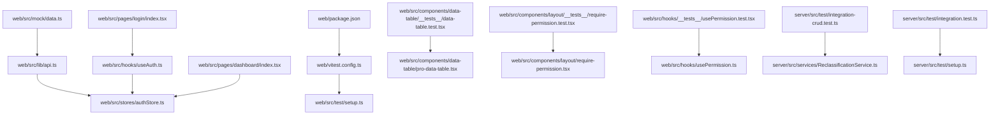

图表来源
- [web/vitest.config.ts](file://web/vitest.config.ts)
- [web/src/test/setup.ts](file://web/src/test/setup.ts)
- [web/src/lib/api.ts](file://web/src/lib/api.ts)
- [web/src/stores/authStore.ts](file://web/src/stores/authStore.ts)
- [web/src/hooks/useAuth.ts](file://web/src/hooks/useAuth.ts)
- [web/src/pages/login/index.tsx](file://web/src/pages/login/index.tsx)
- [web/src/pages/dashboard/index.tsx](file://web/src/pages/dashboard/index.tsx)
- [web/src/components/data-table/__tests__/data-table.test.tsx](file://web/src/components/data-table/__tests__/data-table.test.tsx)
- [web/src/components/layout/__tests__/require-permission.test.tsx](file://web/src/components/layout/__tests__/require-permission.test.tsx)
- [web/src/hooks/__tests__/usePermission.test.tsx](file://web/src/hooks/__tests__/usePermission.test.tsx)
- [web/src/mock/data.ts](file://web/src/mock/data.ts)
- [web/package.json](file://web/package.json)
- [server/src/test/integration-crud.test.ts](file://server/src/test/integration-crud.test.ts)
- [server/src/services/ReclassificationService.ts](file://server/src/services/ReclassificationService.ts)
- [server/src/test/integration.test.ts](file://server/src/test/integration.test.ts)
- [server/src/test/setup.ts](file://server/src/test/setup.ts)

章节来源
- [web/vitest.config.ts](file://web/vitest.config.ts)
- [web/src/test/setup.ts](file://web/src/test/setup.ts)
- [web/package.json](file://web/package.json)
- [server/src/test/integration-crud.test.ts](file://server/src/test/integration-crud.test.ts)
- [server/src/test/integration.test.ts](file://server/src/test/integration.test.ts)

## 核心组件
本节聚焦集成测试的关键基础设施与能力点：
- 测试运行器与全局初始化
  - vitest.config.ts：定义测试环境、覆盖率、浏览器模式等
  - setup.ts：在测试前注入全局桩、Mock、DOM 环境等
- API 客户端与状态管理
  - api.ts：封装 HTTP 请求，统一错误处理与拦截
  - authStore.ts：集中式认证状态与副作用（如刷新令牌）
  - useAuth.ts：认证 Hook，暴露登录、登出、鉴权判断
- 页面与权限控制
  - login/index.tsx：登录表单与提交流程
  - dashboard/index.tsx：受保护页面，依赖认证状态
  - require-permission.tsx：权限守卫组件
  - usePermission.ts：权限校验 Hook
- 现有单测样例
  - data-table.test.tsx、require-permission.test.tsx、usePermission.test.tsx：展示如何组织测试用例与断言
- **新增** 后端服务测试
  - integration-crud.test.ts：CRUD操作完整性测试
  - ReclassificationService.ts：重分类功能服务实现

章节来源
- [web/vitest.config.ts](file://web/vitest.config.ts)
- [web/src/test/setup.ts](file://web/src/test/setup.ts)
- [web/src/lib/api.ts](file://web/src/lib/api.ts)
- [web/src/stores/authStore.ts](file://web/src/stores/authStore.ts)
- [web/src/hooks/useAuth.ts](file://web/src/hooks/useAuth.ts)
- [web/src/pages/login/index.tsx](file://web/src/pages/login/index.tsx)
- [web/src/pages/dashboard/index.tsx](file://web/src/pages/dashboard/index.tsx)
- [web/src/components/layout/require-permission.tsx](file://web/src/components/layout/require-permission.tsx)
- [web/src/hooks/usePermission.ts](file://web/src/hooks/usePermission.ts)
- [web/src/components/data-table/__tests__/data-table.test.tsx](file://web/src/components/data-table/__tests__/data-table.test.tsx)
- [web/src/components/layout/__tests__/require-permission.test.tsx](file://web/src/components/layout/__tests__/require-permission.test.tsx)
- [web/src/hooks/__tests__/usePermission.test.tsx](file://web/src/hooks/__tests__/usePermission.test.tsx)
- [server/src/test/integration-crud.test.ts](file://server/src/test/integration-crud.test.ts)
- [server/src/services/ReclassificationService.ts](file://server/src/services/ReclassificationService.ts)

## 架构总览
下图展示了集成测试中常见的调用链与交互边界，涵盖 API 客户端、状态管理、Hook 与页面组件之间的协作关系。

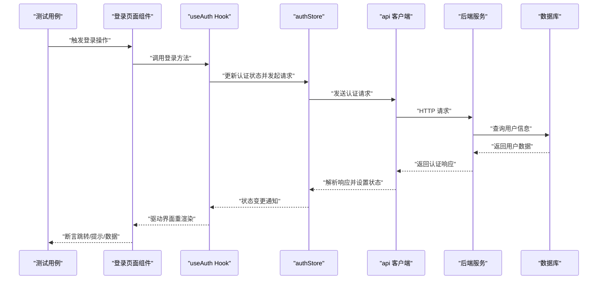

图表来源
- [web/src/pages/login/index.tsx](file://web/src/pages/login/index.tsx)
- [web/src/hooks/useAuth.ts](file://web/src/hooks/useAuth.ts)
- [web/src/stores/authStore.ts](file://web/src/stores/authStore.ts)
- [web/src/lib/api.ts](file://web/src/lib/api.ts)
- [web/src/mock/data.ts](file://web/src/mock/data.ts)

## 详细组件分析

### API 客户端集成测试
目标：验证网络层在真实或模拟环境下的行为，包括请求构造、错误处理、重试与超时。

建议实践
- 使用 vitest 的 fetch/XMLHttpRequest 桩或专用库（如 MSW）对 api.ts 进行拦截
- 针对成功、失败、超时、重复提交等场景编写用例
- 断言请求参数、头部、URL 以及错误分支是否被正确触发

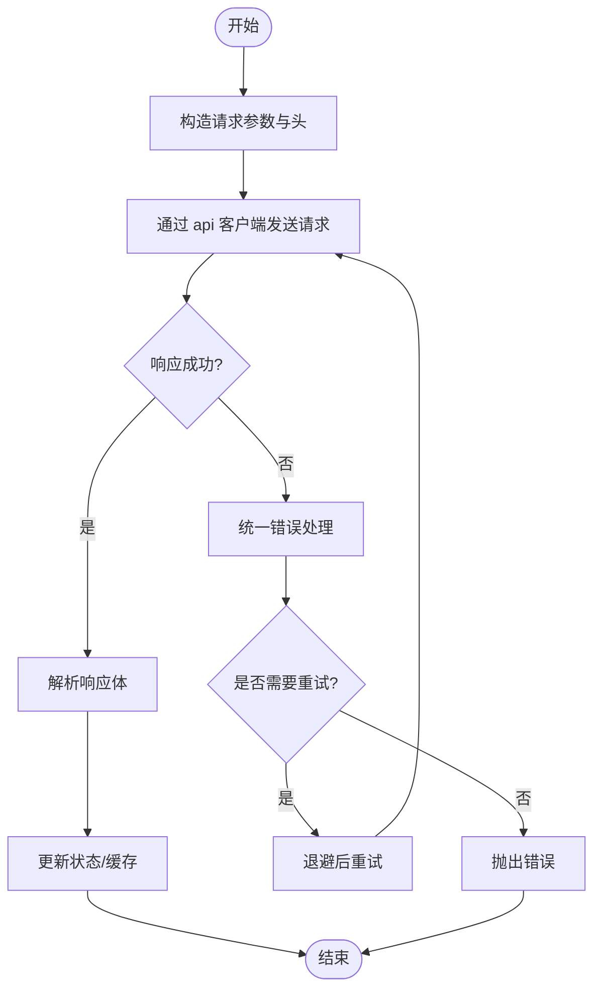

图表来源
- [web/src/lib/api.ts](file://web/src/lib/api.ts)

章节来源
- [web/src/lib/api.ts](file://web/src/lib/api.ts)

### 状态管理集成测试（认证）
目标：验证认证状态在跨组件、跨 Hook 的一致性，以及异步副作用的正确性。

建议实践
- 在测试前重置 authStore 状态，避免用例间污染
- 模拟登录成功/失败，断言 store 字段变化与订阅者回调
- 结合 useAuth Hook 断言登录态切换后的 UI 行为

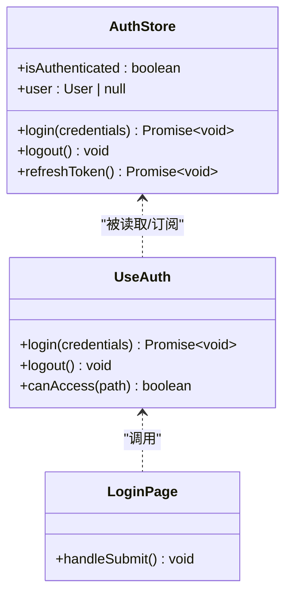

图表来源
- [web/src/stores/authStore.ts](file://web/src/stores/authStore.ts)
- [web/src/hooks/useAuth.ts](file://web/src/hooks/useAuth.ts)
- [web/src/pages/login/index.tsx](file://web/src/pages/login/index.tsx)

章节来源
- [web/src/stores/authStore.ts](file://web/src/stores/authStore.ts)
- [web/src/hooks/useAuth.ts](file://web/src/hooks/useAuth.ts)
- [web/src/pages/login/index.tsx](file://web/src/pages/login/index.tsx)

### 路由导航与权限控制集成测试
目标：验证登录后跳转、未授权访问拦截、动态权限生效。

建议实践
- 使用测试路由容器包裹被测组件，模拟不同路由与查询参数
- 在未登录时访问受保护页面，断言跳转至登录页
- 登录后访问受保护页面，断言渲染内容与权限按钮可见性

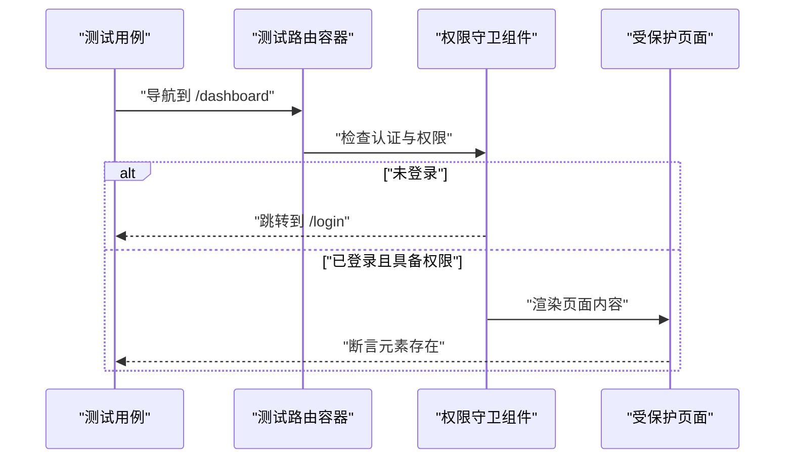

图表来源
- [web/src/pages/dashboard/index.tsx](file://web/src/pages/dashboard/index.tsx)
- [web/src/components/layout/require-permission.tsx](file://web/src/components/layout/require-permission.tsx)
- [web/src/hooks/usePermission.ts](file://web/src/hooks/usePermission.ts)

章节来源
- [web/src/pages/dashboard/index.tsx](file://web/src/pages/dashboard/index.tsx)
- [web/src/components/layout/__tests__/require-permission.test.tsx](file://web/src/components/layout/__tests__/require-permission.test.tsx)
- [web/src/hooks/__tests__/usePermission.test.tsx](file://web/src/hooks/__tests__/usePermission.test.tsx)

### 端到端用户工作流（登录→数据操作）
目标：覆盖从登录到数据查看/编辑的完整链路，确保跨模块协作正确。

建议实践
- 先执行登录流程，等待认证状态稳定
- 进入数据页面，断言表格加载与分页
- 执行新增/修改/删除等操作，断言列表刷新与状态同步
- 异常分支：网络错误、权限不足、表单校验失败

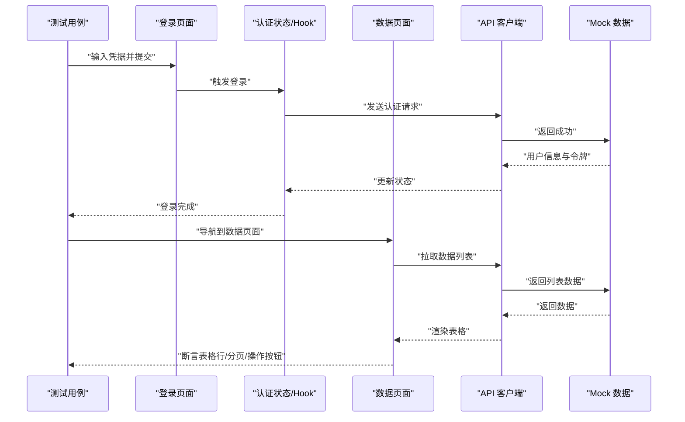

图表来源
- [web/src/pages/login/index.tsx](file://web/src/pages/login/index.tsx)
- [web/src/hooks/useAuth.ts](file://web/src/hooks/useAuth.ts)
- [web/src/stores/authStore.ts](file://web/src/stores/authStore.ts)
- [web/src/pages/dashboard/index.tsx](file://web/src/pages/dashboard/index.tsx)
- [web/src/lib/api.ts](file://web/src/lib/api.ts)
- [web/src/mock/data.ts](file://web/src/mock/data.ts)

章节来源
- [web/src/pages/login/index.tsx](file://web/src/pages/login/index.tsx)
- [web/src/pages/dashboard/index.tsx](file://web/src/pages/dashboard/index.tsx)
- [web/src/stores/authStore.ts](file://web/src/stores/authStore.ts)
- [web/src/hooks/useAuth.ts](file://web/src/hooks/useAuth.ts)
- [web/src/lib/api.ts](file://web/src/lib/api.ts)
- [web/src/mock/data.ts](file://web/src/mock/data.ts)

### Mock 服务与测试数据
目标：为 RESTful API 与 WebSocket 提供稳定、可控的模拟环境。

建议实践
- REST：基于 vitest 的 fetch/XMLHttpRequest 桩或 MSW 拦截请求，集中管理响应模板
- WebSocket：使用轻量库或自定义桩模拟连接、消息收发与断线重连
- 测试数据：将常用样本放入 src/mock/data.ts，按领域拆分，便于复用与维护

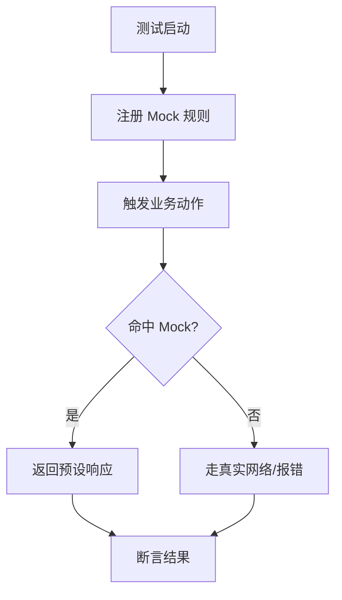

图表来源
- [web/src/mock/data.ts](file://web/src/mock/data.ts)
- [web/src/lib/api.ts](file://web/src/lib/api.ts)

章节来源
- [web/src/mock/data.ts](file://web/src/mock/data.ts)
- [web/src/lib/api.ts](file://web/src/lib/api.ts)

### 测试数据库与持久化一致性
目标：验证本地存储、IndexedDB 或后端数据库写入的一致性与幂等性。

建议实践
- 使用内存数据库或事务回滚保证用例前后一致
- 对写操作进行幂等断言（多次执行结果相同）
- 校验并发写入冲突与补偿逻辑

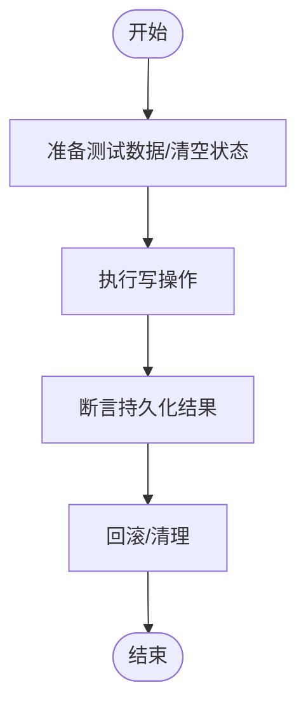

[此图为概念流程图，不直接映射具体源码文件]

### 测试环境隔离与清理
目标：避免用例间相互影响，确保每次运行干净、可重复。

建议实践
- 在 setup.ts 中统一注入 DOM、路由、状态、网络桩
- 每个用例前后执行 beforeAll/afterAll 或 beforeEach/afterEach 进行状态复位
- 使用独立命名空间或随机后缀区分测试数据

章节来源
- [web/src/test/setup.ts](file://web/src/test/setup.ts)

## 后端集成测试

### CRUD操作完整性测试
目标：确保后端服务的增删改查操作具有完整的测试覆盖，包括边界条件和异常处理。

测试策略
- 创建测试：验证数据插入、唯一性约束、必填字段校验
- 读取测试：验证数据查询、过滤、排序、分页功能
- 更新测试：验证数据修改、并发更新、版本控制
- 删除测试：验证软删除、级联删除、权限控制

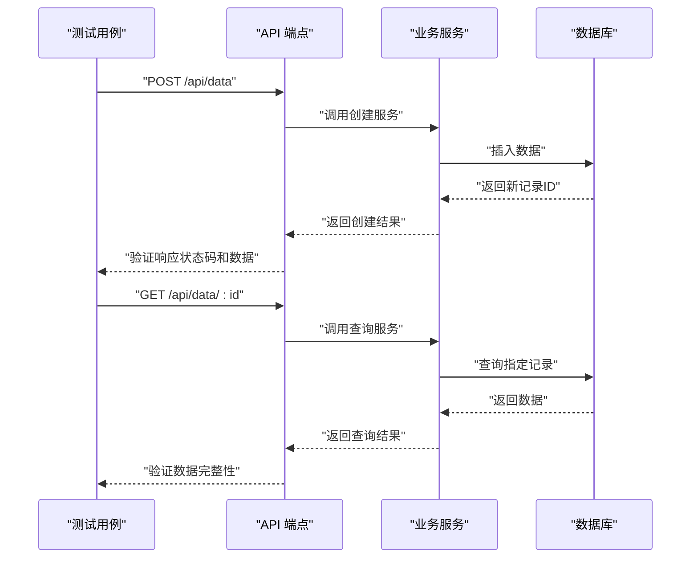

图表来源
- [server/src/test/integration-crud.test.ts](file://server/src/test/integration-crud.test.ts)

章节来源
- [server/src/test/integration-crud.test.ts](file://server/src/test/integration-crud.test.ts)

### 重分类功能测试
目标：验证企业数据重分类功能的完整业务流程，包括日志记录和权限控制。

测试场景
- 基础重分类：科目重分类、公司重分类
- 批量操作：多条目同时重分类
- 权限验证：角色权限控制
- 审计日志：操作记录追踪
- 数据一致性：重分类前后的数据关联验证

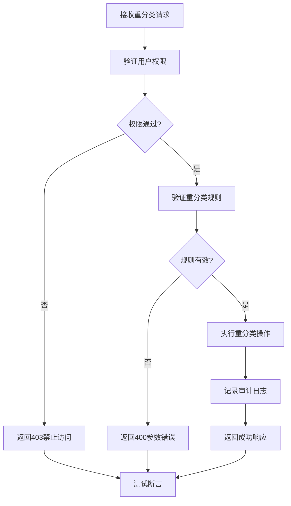

图表来源
- [server/src/services/ReclassificationService.ts](file://server/src/services/ReclassificationService.ts)
- [server/src/test/integration-crud.test.ts](file://server/src/test/integration-crud.test.ts)

章节来源
- [server/src/services/ReclassificationService.ts](file://server/src/services/ReclassificationService.ts)
- [server/src/test/integration-crud.test.ts](file://server/src/test/integration-crud.test.ts)

### 数据库集成测试策略
目标：确保数据库操作的事务性、一致性和性能。

最佳实践
- 使用测试数据库隔离：每个测试套件使用独立的数据库实例
- 事务回滚：测试完成后自动回滚所有数据库变更
- 种子数据管理：预置标准化的测试数据
- 并发测试：验证多线程环境下的数据一致性

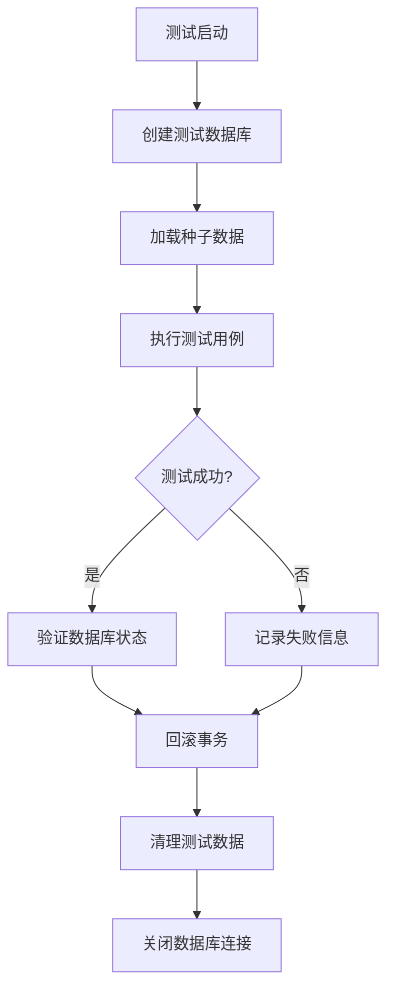

[此图为概念流程图，展示数据库测试的一般流程]

### 新增API端点集成测试
**更新** 基于最新的API端点更新，增强了集成测试的覆盖范围。

测试重点
- 新增API端点的请求验证和响应处理
- 扩展了端到端测试用例，覆盖新的业务逻辑
- 增强了错误处理和边界条件测试
- 优化了测试数据的准备和清理机制

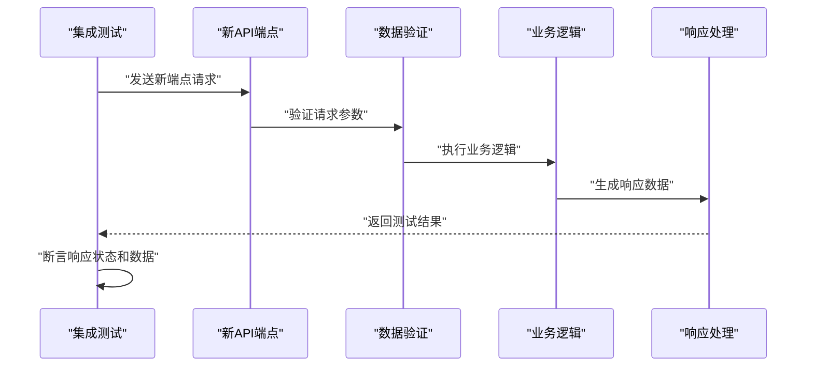

图表来源
- [server/src/test/integration.test.ts](file://server/src/test/integration.test.ts)

章节来源
- [server/src/test/integration.test.ts](file://server/src/test/integration.test.ts)

## 依赖分析
下图展示测试相关文件的依赖关系，有助于理解测试边界与耦合度。

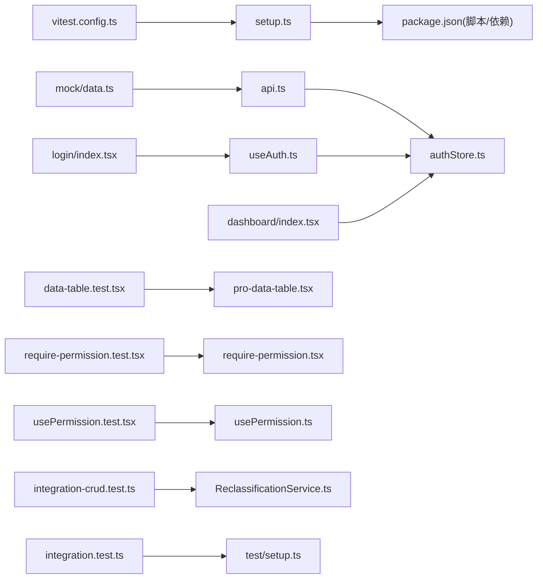

图表来源
- [web/vitest.config.ts](file://web/vitest.config.ts)
- [web/src/test/setup.ts](file://web/src/test/setup.ts)
- [web/package.json](file://web/package.json)
- [web/src/lib/api.ts](file://web/src/lib/api.ts)
- [web/src/stores/authStore.ts](file://web/src/stores/authStore.ts)
- [web/src/hooks/useAuth.ts](file://web/src/hooks/useAuth.ts)
- [web/src/pages/login/index.tsx](file://web/src/pages/login/index.tsx)
- [web/src/pages/dashboard/index.tsx](file://web/src/pages/dashboard/index.tsx)
- [web/src/components/data-table/__tests__/data-table.test.tsx](file://web/src/components/data-table/__tests__/data-table.test.tsx)
- [web/src/components/data-table/pro-data-table.tsx](file://web/src/components/data-table/pro-data-table.tsx)
- [web/src/components/layout/__tests__/require-permission.test.tsx](file://web/src/components/layout/__tests__/require-permission.test.tsx)
- [web/src/components/layout/require-permission.tsx](file://web/src/components/layout/require-permission.tsx)
- [web/src/hooks/__tests__/usePermission.test.tsx](file://web/src/hooks/__tests__/usePermission.test.tsx)
- [web/src/hooks/usePermission.ts](file://web/src/hooks/usePermission.ts)
- [web/src/mock/data.ts](file://web/src/mock/data.ts)
- [server/src/test/integration-crud.test.ts](file://server/src/test/integration-crud.test.ts)
- [server/src/services/ReclassificationService.ts](file://server/src/services/ReclassificationService.ts)
- [server/src/test/integration.test.ts](file://server/src/test/integration.test.ts)
- [server/src/test/setup.ts](file://server/src/test/setup.ts)

章节来源
- [web/vitest.config.ts](file://web/vitest.config.ts)
- [web/src/test/setup.ts](file://web/src/test/setup.ts)
- [web/package.json](file://web/package.json)
- [server/src/test/integration-crud.test.ts](file://server/src/test/integration-crud.test.ts)
- [server/src/services/ReclassificationService.ts](file://server/src/services/ReclassificationService.ts)
- [server/src/test/integration.test.ts](file://server/src/test/integration.test.ts)

## 性能考虑
- 并行执行
  - 启用 Vitest 的 worker 数与线程池，合理分配 CPU 资源
  - 将 IO 密集与 CPU 密集用例混合编排，避免同类型用例扎堆
- 按需加载与懒桩
  - 仅在需要时注册 Mock，减少全局桩开销
  - 对大型组件树使用轻量渲染容器，避免不必要的重渲染
- 数据与状态复用
  - 共享不可变测试数据，避免重复构造
  - 使用快照对比减少复杂对象比较成本
- 网络与 I/O
  - 优先使用内存 Mock，避免真实网络延迟
  - 对 WebSocket 测试限制消息数量与时长
- **新增** 数据库测试优化
  - 使用内存数据库加速测试执行
  - 批量插入测试数据减少数据库往返
  - 合理设计索引提升查询性能
- **新增** API端点测试优化
  - 优化新API端点的测试执行效率
  - 减少不必要的网络请求和数据处理
  - 提高测试用例的并行执行能力

## 故障排查指南
常见问题与定位思路
- 测试不稳定/偶发失败
  - 检查异步竞态：是否缺少 await 或等待条件
  - 确认 Mock 是否被意外覆盖或未正确恢复
  - 增加更细粒度的断言与日志输出
- 状态污染
  - 确认 setup.ts 与用例级清理逻辑是否完备
  - 对全局状态使用命名空间或随机标识隔离
- 网络问题
  - 核对请求 URL、方法与头是否匹配
  - 检查错误码分支与重试逻辑是否被覆盖
- **新增** 数据库测试问题
  - 检查数据库连接配置和环境变量
  - 验证事务是否正确回滚
  - 确认测试数据种子文件完整性
- **新增** API端点测试问题
  - 验证新API端点的请求格式和响应结构
  - 检查端点间的依赖关系和数据流转
  - 确认错误处理和异常情况的覆盖

章节来源
- [web/src/test/setup.ts](file://web/src/test/setup.ts)
- [web/src/lib/api.ts](file://web/src/lib/api.ts)
- [server/src/test/setup.ts](file://server/src/test/setup.ts)

## 结论
通过统一的测试配置、清晰的 Mock 策略、完善的状态与权限集成测试，以及对端到端流程的系统化覆盖，可以显著提升前端应用的稳定性与可维护性。配合并行执行与环境隔离，可在保证质量的同时提升测试效率。

**新增的后端集成测试**进一步确保了CRUD操作和重分类功能的健壮性，形成了前后端完整的测试闭环。**基于最新API端点的测试更新**增强了端到端验证能力，确保新功能的质量和稳定性。通过数据库集成测试策略，保证了数据一致性和事务完整性，为生产环境的稳定运行提供了有力保障。

## 附录
- 快速上手清单
  - 在 vitest.config.ts 中启用浏览器模式与覆盖率
  - 在 setup.ts 中注入全局桩与 DOM 环境
  - 为 API 客户端编写成功/失败/超时用例
  - 为认证流程编写登录/登出/权限守卫用例
  - 为数据页面编写 CRUD 与分页用例
  - 为 WebSocket 场景编写连接/消息/断线重连用例
  - 为持久化写入编写一致性用例
  - 配置并行执行与资源上限，评估耗时与吞吐
  - **新增** 为后端服务编写CRUD操作测试用例
  - **新增** 为重分类功能编写完整业务流程测试
  - **新增** 配置数据库测试环境和种子数据
  - **新增** 实现事务回滚和数据清理机制
  - **新增** 为新API端点编写集成测试用例
  - **新增** 优化API端点测试的执行效率和覆盖率