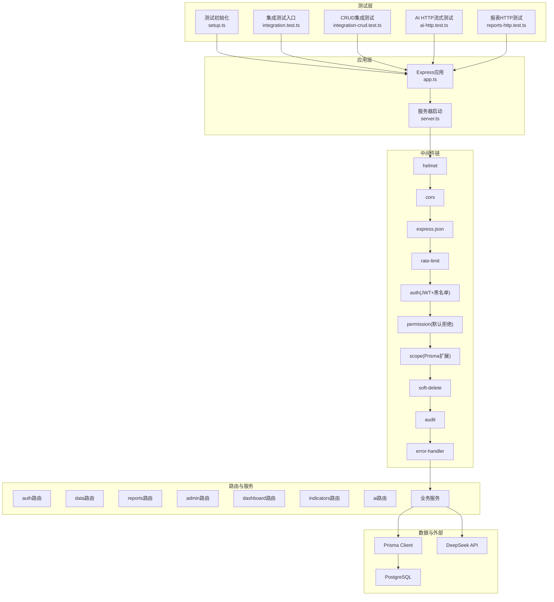
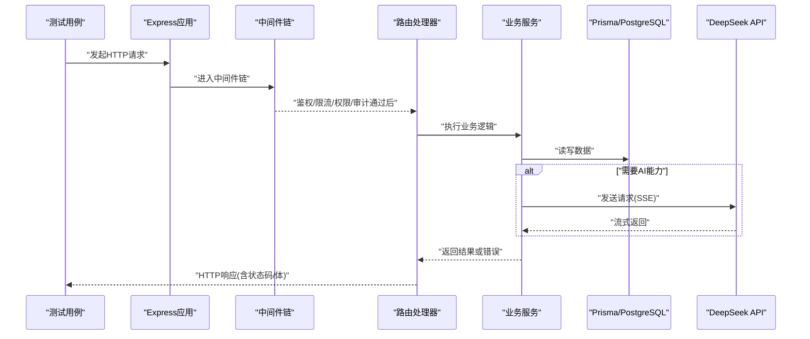
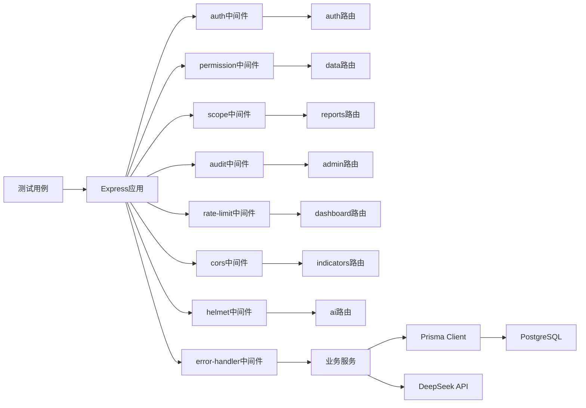

# 集成测试

<cite>
**本文引用的文件**   
- [server/src/test/integration.test.ts](file://server/src/test/integration.test.ts)
- [server/src/test/integration-crud.test.ts](file://server/src/test/integration-crud.test.ts)
- [server/src/test/ai-http.test.ts](file://server/src/test/ai-http.test.ts)
- [server/src/test/reports-http.test.ts](file://server/src/test/reports-http.test.ts)
- [server/src/test/setup.ts](file://server/src/test/setup.ts)
- [server/src/app.ts](file://server/src/app.ts)
- [server/src/server.ts](file://server/src/server.ts)
- [server/src/middleware/auth.ts](file://server/src/middleware/auth.ts)
- [server/src/middleware/permission.ts](file://server/src/middleware/permission.ts)
- [server/src/middleware/scope.ts](file://server/src/middleware/scope.ts)
- [server/src/middleware/audit.ts](file://server/src/middleware/audit.ts)
- [server/src/middleware/rate-limit.ts](file://server/src/middleware/rate-limit.ts)
- [server/src/middleware/cors.ts](file://server/src/middleware/cors.ts)
- [server/src/middleware/helmet.ts](file://server/src/middleware/helmet.ts)
- [server/src/middleware/error-handler.ts](file://server/src/middleware/error-handler.ts)
- [server/src/lib/deepseek.ts](file://server/src/lib/deepseek.ts)
- [server/src/services/AIProxyService.ts](file://server/src/services/AIProxyService.ts)
- [server/src/routes/auth.ts](file://server/src/routes/auth.ts)
- [server/src/routes/data.ts](file://server/src/routes/data.ts)
- [server/src/routes/reports.ts](file://server/src/routes/reports.ts)
- [server/src/routes/admin.ts](file://server/src/routes/admin.ts)
- [server/src/routes/dashboard.ts](file://server/src/routes/dashboard.ts)
- [server/src/routes/indicators.ts](file://server/src/routes/indicators.ts)
- [server/src/routes/ai.ts](file://server/src/routes/ai.ts)
- [server/prisma/schema.prisma](file://server/prisma/schema.prisma)
- [server/prisma/seed.ts](file://server/prisma/seed.ts)
- [server/prisma/seed-companies.ts](file://server/prisma/seed-companies.ts)
- [server/prisma/seed-domain.ts](file://server/prisma/seed-domain.ts)
- [server/prisma/seed-data/subject-trees.ts](file://server/prisma/seed-data/subject-trees.ts)
- [server/scripts/local-db.ts](file://server/scripts/local-db.ts)
</cite>

## 目录
1. [简介](#简介)
2. [项目结构](#项目结构)
3. [核心组件](#核心组件)
4. [架构总览](#架构总览)
5. [详细组件分析](#详细组件分析)
6. [依赖关系分析](#依赖关系分析)
7. [性能考量](#性能考量)
8. [故障排查指南](#故障排查指南)
9. [结论](#结论)
10. [附录](#附录)

## 简介
本文件面向FY200项目的集成测试，覆盖以下关键目标：
- API端点的集成测试策略：HTTP请求模拟、响应体与状态码校验、错误场景。
- 数据库操作的集成测试方法：事务管理、数据清理、测试环境隔离。
- 外部服务集成测试：DeepSeek API模拟、文件上传下载、第三方服务Mock。
- 中间件链的集成测试：认证、权限控制、审计日志验证。
- 测试数据库配置与数据准备：种子数据、测试数据集管理。
- 错误场景、并发与性能基准测试的实现方法。

本项目后端技术栈为Express 4 + Prisma 5 + PostgreSQL 15 + JWT（access 15min + refresh 7day轮转）+ DeepSeek API（SSE流式）。中间件执行顺序固定，确保在集成测试中可稳定复现端到端行为。

## 项目结构
FY200后端的集成测试集中在 server/src/test 目录，包含通用入口、CRUD流程、AI HTTP流式接口、报表HTTP接口等用例；测试启动与数据库初始化由 setup.ts 负责；应用入口与服务器启动分别在 app.ts 与 server.ts；中间件与路由按职责分层组织。

图表来源
- [server/src/test/setup.ts](file://server/src/test/setup.ts)
- [server/src/test/integration.test.ts](file://server/src/test/integration.test.ts)
- [server/src/test/integration-crud.test.ts](file://server/src/test/integration-crud.test.ts)
- [server/src/test/ai-http.test.ts](file://server/src/test/ai-http.test.ts)
- [server/src/test/reports-http.test.ts](file://server/src/test/reports-http.test.ts)
- [server/src/app.ts](file://server/src/app.ts)
- [server/src/server.ts](file://server/src/server.ts)
- [server/src/middleware/helmet.ts](file://server/src/middleware/helmet.ts)
- [server/src/middleware/cors.ts](file://server/src/middleware/cors.ts)
- [server/src/middleware/rate-limit.ts](file://server/src/middleware/rate-limit.ts)
- [server/src/middleware/auth.ts](file://server/src/middleware/auth.ts)
- [server/src/middleware/permission.ts](file://server/src/middleware/permission.ts)
- [server/src/middleware/scope.ts](file://server/src/middleware/scope.ts)
- [server/src/middleware/soft-delete.ts](file://server/src/middleware/soft-delete.ts)
- [server/src/middleware/audit.ts](file://server/src/middleware/audit.ts)
- [server/src/middleware/error-handler.ts](file://server/src/middleware/error-handler.ts)
- [server/src/lib/deepseek.ts](file://server/src/lib/deepseek.ts)
- [server/src/routes/auth.ts](file://server/src/routes/auth.ts)
- [server/src/routes/data.ts](file://server/src/routes/data.ts)
- [server/src/routes/reports.ts](file://server/src/routes/reports.ts)
- [server/src/routes/admin.ts](file://server/src/routes/admin.ts)
- [server/src/routes/dashboard.ts](file://server/src/routes/dashboard.ts)
- [server/src/routes/indicators.ts](file://server/src/routes/indicators.ts)
- [server/src/routes/ai.ts](file://server/src/routes/ai.ts)

章节来源
- [server/src/test/setup.ts](file://server/src/test/setup.ts)
- [server/src/app.ts](file://server/src/app.ts)
- [server/src/server.ts](file://server/src/server.ts)

## 核心组件
- 测试框架与运行器：使用Vitest进行单元测试与集成测试，测试入口与生命周期钩子位于测试目录。
- Express应用装配：app.ts集中注册中间件与路由，server.ts负责监听端口与进程信号处理。
- 中间件链：按固定顺序执行，确保鉴权、权限、范围、软删除、审计、错误处理等行为一致。
- 数据库与迁移：Prisma schema定义数据模型，migrations管理版本演进，seed脚本提供初始数据。
- 外部服务：DeepSeek通过lib/deepseek.ts封装，支持SSE流式响应；AI代理服务在services/AIProxyService.ts中编排。

章节来源
- [server/src/test/setup.ts](file://server/src/test/setup.ts)
- [server/src/app.ts](file://server/src/app.ts)
- [server/src/server.ts](file://server/src/server.ts)
- [server/prisma/schema.prisma](file://server/prisma/schema.prisma)
- [server/src/lib/deepseek.ts](file://server/src/lib/deepseek.ts)
- [server/src/services/AIProxyService.ts](file://server/src/services/AIProxyService.ts)

## 架构总览
下图展示从测试到API、中间件、服务、数据库与外部服务的完整调用链路，便于理解集成测试的断点与验证位置。

图表来源
- [server/src/app.ts](file://server/src/app.ts)
- [server/src/middleware/auth.ts](file://server/src/middleware/auth.ts)
- [server/src/middleware/permission.ts](file://server/src/middleware/permission.ts)
- [server/src/middleware/scope.ts](file://server/src/middleware/scope.ts)
- [server/src/middleware/audit.ts](file://server/src/middleware/audit.ts)
- [server/src/lib/deepseek.ts](file://server/src/lib/deepseek.ts)
- [server/src/services/AIProxyService.ts](file://server/src/services/AIProxyService.ts)

## 详细组件分析

### API端点集成测试策略
- 请求模拟：通过测试框架提供的HTTP客户端对Express应用发起真实HTTP请求，覆盖GET/POST/PUT/DELETE等路径与查询参数、请求体、头部字段。
- 响应验证：校验HTTP状态码、响应体结构、关键字段类型与取值范围、分页元数据、错误信息格式。
- 错误场景：网络超时、非法输入、权限不足、限流触发、第三方服务异常等，均应有明确的错误码与消息。
- 典型用例：
  - 认证登录与令牌刷新流程，验证JWT签发与过期策略。
  - 数据CRUD操作，验证创建、读取、更新、删除及软删除行为。
  - 报表生成与导出，验证数据聚合、计算指标与导出文件格式。
  - AI接口流式响应，验证SSE事件流、中断与重试策略。

章节来源
- [server/src/test/integration.test.ts](file://server/src/test/integration.test.ts)
- [server/src/test/integration-crud.test.ts](file://server/src/test/integration-crud.test.ts)
- [server/src/test/ai-http.test.ts](file://server/src/test/ai-http.test.ts)
- [server/src/test/reports-http.test.ts](file://server/src/test/reports-http.test.ts)
- [server/src/routes/auth.ts](file://server/src/routes/auth.ts)
- [server/src/routes/data.ts](file://server/src/routes/data.ts)
- [server/src/routes/reports.ts](file://server/src/routes/reports.ts)
- [server/src/routes/ai.ts](file://server/src/routes/ai.ts)

### 数据库操作集成测试方法
- 事务管理：每个测试用例应在独立事务中执行，保证原子性与回滚能力，避免污染共享数据。
- 数据清理：测试结束后自动清理插入的数据，或使用事务回滚确保环境干净。
- 环境隔离：使用独立的测试数据库实例或Schema隔离，避免并发冲突。
- 数据准备：通过seed脚本注入基础数据，或在测试内按需构造最小数据集。
- 验证要点：约束检查（唯一性、外键）、索引命中、分页与排序一致性、软删除标记。

章节来源
- [server/src/test/setup.ts](file://server/src/test/setup.ts)
- [server/prisma/schema.prisma](file://server/prisma/schema.prisma)
- [server/prisma/seed.ts](file://server/prisma/seed.ts)
- [server/prisma/seed-companies.ts](file://server/prisma/seed-companies.ts)
- [server/prisma/seed-domain.ts](file://server/prisma/seed-domain.ts)
- [server/prisma/seed-data/subject-trees.ts](file://server/prisma/seed-data/subject-trees.ts)

### 外部服务集成测试策略
- DeepSeek API模拟：通过本地Mock或拦截库替换真实SSE连接，返回预设事件序列，验证解析与渲染逻辑。
- 文件上传下载：构造multipart/form-data请求，校验文件大小、类型、命名规则与存储路径；下载时验证内容完整性与MIME类型。
- 第三方服务Mock：对支付、短信、邮件等外部依赖使用Mock对象或内存实现，确保测试快速稳定。
- 错误与重试：模拟超时、限流、5xx错误，验证重试退避与熔断策略。

章节来源
- [server/src/lib/deepseek.ts](file://server/src/lib/deepseek.ts)
- [server/src/services/AIProxyService.ts](file://server/src/services/AIProxyService.ts)
- [server/src/test/ai-http.test.ts](file://server/src/test/ai-http.test.ts)

### 中间件链集成测试
- 认证（auth）：验证JWT有效性、黑名单拦截、令牌刷新与过期处理。
- 权限（permission）：默认拒绝策略下，需显式授权；验证角色与资源访问矩阵。
- 范围（scope）：基于Prisma扩展的数据范围过滤，验证租户/公司维度隔离。
- 审计（audit）：记录关键操作上下文（用户、IP、时间、资源ID），验证日志写入与脱敏。
- 限流（rate-limit）：模拟高频请求，验证阈值与冷却时间。
- 安全（helmet/cors）：验证安全头与跨域策略是否符合预期。
- 错误处理（error-handler）：统一错误包装、状态码映射与调试信息开关。

章节来源
- [server/src/middleware/auth.ts](file://server/src/middleware/auth.ts)
- [server/src/middleware/permission.ts](file://server/src/middleware/permission.ts)
- [server/src/middleware/scope.ts](file://server/src/middleware/scope.ts)
- [server/src/middleware/audit.ts](file://server/src/middleware/audit.ts)
- [server/src/middleware/rate-limit.ts](file://server/src/middleware/rate-limit.ts)
- [server/src/middleware/cors.ts](file://server/src/middleware/cors.ts)
- [server/src/middleware/helmet.ts](file://server/src/middleware/helmet.ts)
- [server/src/middleware/error-handler.ts](file://server/src/middleware/error-handler.ts)

### 测试数据库配置与数据准备策略
- 数据库配置：通过环境变量或配置文件指定测试数据库连接串，确保与开发/生产隔离。
- 迁移与初始化：在测试前执行prisma migrate以同步schema，再运行seed脚本填充基础数据。
- 种子数据：公司、领域、科目树等基础数据应可重复生成，支持增量更新。
- 测试数据集：按用例需求构造最小必要数据，避免全量导入导致耗时过长。
- 清理策略：每次测试结束回滚事务或清空表，保证幂等与并行安全。

章节来源
- [server/src/test/setup.ts](file://server/src/test/setup.ts)
- [server/prisma/schema.prisma](file://server/prisma/schema.prisma)
- [server/prisma/seed.ts](file://server/prisma/seed.ts)
- [server/prisma/seed-companies.ts](file://server/prisma/seed-companies.ts)
- [server/prisma/seed-domain.ts](file://server/prisma/seed-domain.ts)
- [server/prisma/seed-data/subject-trees.ts](file://server/prisma/seed-data/subject-trees.ts)

### 错误场景测试
- 输入校验失败：缺失必填字段、类型不匹配、枚举值越界，应返回400级错误。
- 鉴权失败：无Token、Token过期、黑名单命中，应返回401/403。
- 权限不足：访问受限资源，应返回403。
- 限流触发：超过阈值，应返回429并附带重试间隔。
- 外部服务异常：DeepSeek超时或5xx，应返回502/504并降级提示。
- 数据库错误：约束冲突、死锁，应返回500并记录追踪ID。

章节来源
- [server/src/middleware/error-handler.ts](file://server/src/middleware/error-handler.ts)
- [server/src/middleware/auth.ts](file://server/src/middleware/auth.ts)
- [server/src/middleware/permission.ts](file://server/src/middleware/permission.ts)
- [server/src/middleware/rate-limit.ts](file://server/src/middleware/rate-limit.ts)

### 并发测试与性能基准测试
- 并发测试：使用并发请求模拟多用户同时操作，验证锁竞争、事务隔离与一致性。
- 压测场景：批量导入、报表聚合、AI流式生成，关注CPU、内存、IO与网络瓶颈。
- 基准指标：P95/P99延迟、吞吐量、错误率、资源利用率。
- 工具建议：使用专用压测工具或测试框架并发能力，结合监控与APM采集指标。

章节来源
- [server/src/test/integration.test.ts](file://server/src/test/integration.test.ts)
- [server/src/test/integration-crud.test.ts](file://server/src/test/integration-crud.test.ts)
- [server/src/test/ai-http.test.ts](file://server/src/test/ai-http.test.ts)
- [server/src/test/reports-http.test.ts](file://server/src/test/reports-http.test.ts)

## 依赖关系分析
下图展示测试、应用、中间件、路由、服务与数据/外部依赖之间的耦合关系，帮助识别潜在循环依赖与优化点。

图表来源
- [server/src/app.ts](file://server/src/app.ts)
- [server/src/middleware/auth.ts](file://server/src/middleware/auth.ts)
- [server/src/middleware/permission.ts](file://server/src/middleware/permission.ts)
- [server/src/middleware/scope.ts](file://server/src/middleware/scope.ts)
- [server/src/middleware/audit.ts](file://server/src/middleware/audit.ts)
- [server/src/middleware/rate-limit.ts](file://server/src/middleware/rate-limit.ts)
- [server/src/middleware/cors.ts](file://server/src/middleware/cors.ts)
- [server/src/middleware/helmet.ts](file://server/src/middleware/helmet.ts)
- [server/src/middleware/error-handler.ts](file://server/src/middleware/error-handler.ts)
- [server/src/routes/auth.ts](file://server/src/routes/auth.ts)
- [server/src/routes/data.ts](file://server/src/routes/data.ts)
- [server/src/routes/reports.ts](file://server/src/routes/reports.ts)
- [server/src/routes/admin.ts](file://server/src/routes/admin.ts)
- [server/src/routes/dashboard.ts](file://server/src/routes/dashboard.ts)
- [server/src/routes/indicators.ts](file://server/src/routes/indicators.ts)
- [server/src/routes/ai.ts](file://server/src/routes/ai.ts)
- [server/src/lib/deepseek.ts](file://server/src/lib/deepseek.ts)

章节来源
- [server/src/app.ts](file://server/src/app.ts)
- [server/src/server.ts](file://server/src/server.ts)

## 性能考量
- 数据库连接池：合理设置最大连接数与超时，避免连接耗尽。
- 查询优化：避免N+1查询，使用Prisma关联加载与索引优化。
- 缓存策略：热点数据缓存（如字典、权限矩阵）减少DB压力。
- 流式处理：AI响应采用SSE分块传输，降低首屏延迟。
- 限流与熔断：保护下游服务，避免雪崩效应。
- 监控与告警：采集关键指标（QPS、延迟、错误率、资源使用）并设置阈值。

[本节为通用指导，无需引用具体文件]

## 故障排查指南
- 常见问题定位：
  - 鉴权失败：检查JWT签名、过期时间与黑名单配置。
  - 权限不足：确认角色与资源映射是否正确。
  - 限流触发：查看阈值与冷却时间设置。
  - 数据库错误：核对迁移状态、约束与索引。
  - AI接口异常：检查SSE事件解析与重试逻辑。
- 调试技巧：
  - 开启详细日志与追踪ID，串联请求链路。
  - 使用数据库慢查询日志定位热点SQL。
  - 借助APM工具分析调用链与瓶颈。

章节来源
- [server/src/middleware/error-handler.ts](file://server/src/middleware/error-handler.ts)
- [server/src/middleware/auth.ts](file://server/src/middleware/auth.ts)
- [server/src/middleware/permission.ts](file://server/src/middleware/permission.ts)
- [server/src/middleware/rate-limit.ts](file://server/src/middleware/rate-limit.ts)
- [server/src/lib/deepseek.ts](file://server/src/lib/deepseek.ts)

## 结论
FY200项目的集成测试覆盖了API、数据库、外部服务与中间件链的关键路径，通过严格的请求模拟、响应验证与环境隔离，确保系统在复杂场景下的稳定性与可维护性。建议持续完善错误场景与并发压测用例，结合监控与APM提升问题定位效率与系统韧性。

[本节为总结性内容，无需引用具体文件]

## 附录
- 测试运行命令：参考项目根目录或server目录的package.json脚本。
- 数据库脚本：使用scripts/local-db.ts辅助本地数据库管理。
- 文档参考：wiki中的API参考、数据库模式与入门指南。

章节来源
- [server/scripts/local-db.ts](file://server/scripts/local-db.ts)
- [server/package.json](file://server/package.json)
- [.wiki/API-Reference.md](file://.wiki/API-Reference.md)
- [.wiki/Database-Schema.md](file://.wiki/Database-Schema.md)
- [.wiki/Getting-Started.md](file://.wiki/Getting-Started.md)