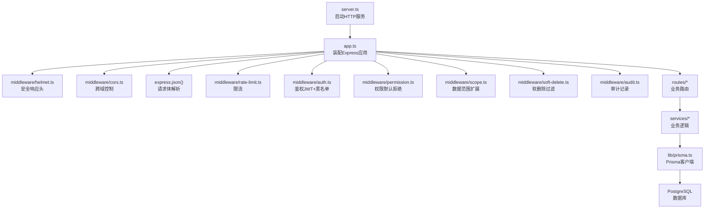
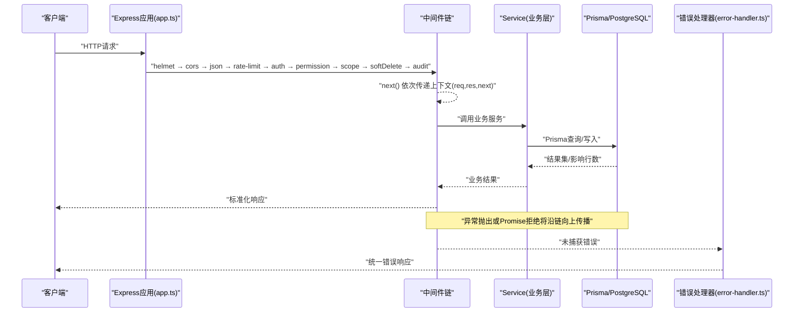
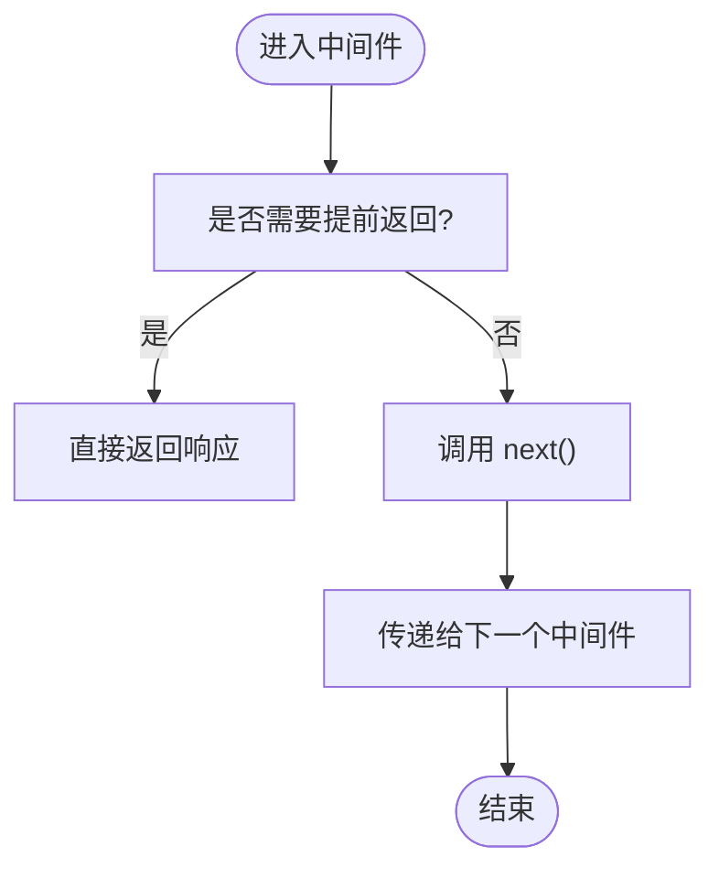
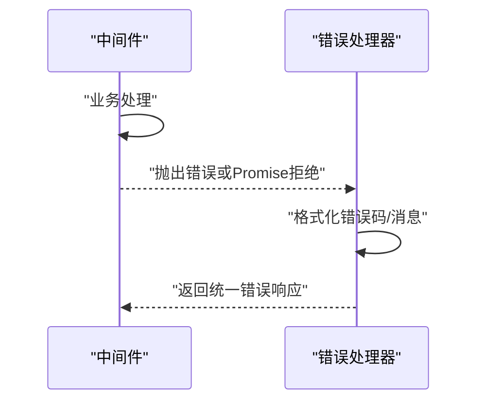
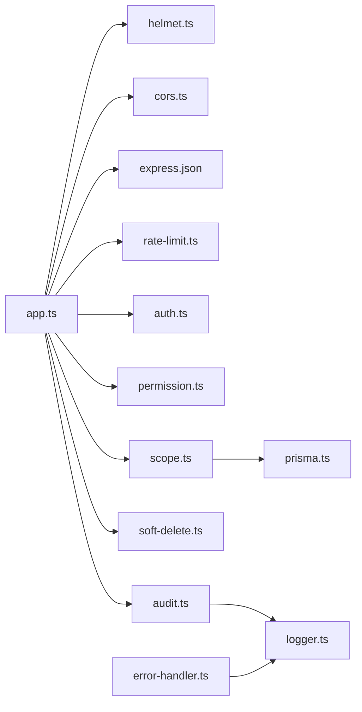

# 中间件执行模型

<cite>
**本文引用的文件**   
- [server.ts](file://server/server.ts)
- [app.ts](file://src/app.ts)
- [helmet.ts](file://src/middleware/helmet.ts)
- [cors.ts](file://src/middleware/cors.ts)
- [rate-limit.ts](file://src/middleware/rate-limit.ts)
- [auth.ts](file://src/middleware/auth.ts)
- [permission.ts](file://src/middleware/permission.ts)
- [scope.ts](file://src/middleware/scope.ts)
- [soft-delete.ts](file://src/middleware/soft-delete.ts)
- [audit.ts](file://src/middleware/audit.ts)
- [error-handler.ts](file://src/middleware/error-handler.ts)
- [prisma.ts](file://src/lib/prisma.ts)
- [env.ts](file://src/config/env.ts)
- [logger.ts](file://src/lib/logger.ts)
- [async-handler.ts](file://src/lib/async-handler.ts)
- [express.d.ts](file://src/types/express.d.ts)
</cite>

## 目录
1. [简介](#简介)
2. [项目结构](#项目结构)
3. [核心组件](#核心组件)
4. [架构总览](#架构总览)
5. [详细组件分析](#详细组件分析)
6. [依赖关系分析](#依赖关系分析)
7. [性能考量](#性能考量)
8. [故障排查指南](#故障排查指南)
9. [结论](#结论)
10. [附录](#附录)

## 简介
本文件系统化阐述 FY200 后端 Express 中间件的执行模型与管道设计，围绕以下目标展开：
- 解释中间件注册顺序与职责边界：helmet → cors → express.json → rate-limit → auth → permission → scope → softDelete → audit → Service → Prisma → PostgreSQL。
- 说明 next() 调用机制、错误传播路径与上下文共享方式。
- 阐述异步处理模式、Promise 处理与错误捕获策略。
- 提供执行流程图、调试技巧与性能监控方法。
- 给出自定义中间件的开发规范与最佳实践。

本项目为浙江壹品慧财年经营数据分析平台，后端技术栈为 Express 4 + Prisma 5 + PostgreSQL 15 + JWT（access 15min + refresh 7day 轮转）+ DeepSeek API（SSE 流式）。计算类指标使用安全公式解析（白名单算子 +-*/()，禁止 eval），同比/环比由后端实时计算不存库。AI 双管道架构：polish（文本→脱敏→LLM→还原）/ analyze（结构化→计算→脱敏→LLM→生成），脱敏规则：绝对金额→区间，公司名→动态映射。

## 项目结构
FY200 后端位于 server/src 目录，关键组织如下：
- src/app.ts：Express 应用装配与全局中间件注册入口。
- src/server.ts：HTTP 服务启动与监听端口。
- src/middleware/*：按职责划分的中间件实现。
- src/lib/prisma.ts：Prisma 客户端初始化与扩展点。
- src/config/env.ts：环境变量加载与校验。
- src/lib/logger.ts：统一日志输出。
- src/lib/async-handler.ts：异步路由处理器封装。
- src/types/express.d.ts：对 req/res/next 的类型扩展。

**图示来源**
- [server.ts](file://server/server.ts)
- [app.ts](file://src/app.ts)
- [helmet.ts](file://src/middleware/helmet.ts)
- [cors.ts](file://src/middleware/cors.ts)
- [rate-limit.ts](file://src/middleware/rate-limit.ts)
- [auth.ts](file://src/middleware/auth.ts)
- [permission.ts](file://src/middleware/permission.ts)
- [scope.ts](file://src/middleware/scope.ts)
- [soft-delete.ts](file://src/middleware/soft-delete.ts)
- [audit.ts](file://src/middleware/audit.ts)
- [prisma.ts](file://src/lib/prisma.ts)

**章节来源**
- [server.ts](file://server/server.ts)
- [app.ts](file://src/app.ts)

## 核心组件
- helmet：设置安全相关响应头，降低常见Web攻击面。
- cors：配置跨域访问策略，允许前端域名与方法。
- express.json：解析 application/json 的请求体。
- rate-limit：基于IP或用户维度的请求频率限制。
- auth：JWT 验证与黑名单检查，注入用户上下文。
- permission：默认拒绝策略，显式授权后放行。
- scope：通过 Prisma extension 注入数据范围过滤。
- softDelete：查询时自动追加 isDeleted=false 条件。
- audit：记录关键操作审计日志。
- Service：业务层服务，编排领域逻辑。
- Prisma：ORM 客户端，负责与 PostgreSQL 交互。
- PostgreSQL：持久化存储。

上述组件以中间件链形式串联，形成“请求进入→横切能力→业务逻辑→数据访问”的清晰分层。

**章节来源**
- [helmet.ts](file://src/middleware/helmet.ts)
- [cors.ts](file://src/middleware/cors.ts)
- [rate-limit.ts](file://src/middleware/rate-limit.ts)
- [auth.ts](file://src/middleware/auth.ts)
- [permission.ts](file://src/middleware/permission.ts)
- [scope.ts](file://src/middleware/scope.ts)
- [soft-delete.ts](file://src/middleware/soft-delete.ts)
- [audit.ts](file://src/middleware/audit.ts)
- [prisma.ts](file://src/lib/prisma.ts)

## 架构总览
下图展示一次典型请求在中间件管道中的流转过程，以及错误如何被统一捕获并返回。

**图示来源**
- [app.ts](file://src/app.ts)
- [error-handler.ts](file://src/middleware/error-handler.ts)
- [prisma.ts](file://src/lib/prisma.ts)

## 详细组件分析

### 中间件注册顺序与职责
- 安全与协议层：helmet、cors、express.json。
- 访问控制层：rate-limit、auth、permission。
- 数据访问增强层：scope、softDelete、audit。
- 业务层：Service。
- 数据层：Prisma → PostgreSQL。

该顺序确保先进行安全与协议处理，再进行访问控制，最后才进入业务与数据层，符合最小权限与纵深防御原则。

**章节来源**
- [app.ts](file://src/app.ts)

### next() 调用机制与上下文共享
- next() 用于将控制权交给下一个中间件或路由处理器。
- 若不调用 next()，请求将被当前中间件拦截并直接返回响应。
- 上下文共享通过 req、res、next 对象完成；可在 req 上挂载用户信息、租户ID、审计信息等。
- 类型扩展见 types/express.d.ts，便于TS类型推导。

**图示来源**
- [express.d.ts](file://src/types/express.d.ts)

**章节来源**
- [express.d.ts](file://src/types/express.d.ts)

### 错误传播路径与统一处理
- 同步错误：throw 抛出后由 Express 错误处理中间件捕获。
- 异步错误：Promise reject 或未 await 的异常需通过 async-handler 包装或 try/catch 捕获。
- 错误处理器 error-handler.ts 统一格式化错误响应，避免泄露敏感信息。

**图示来源**
- [error-handler.ts](file://src/middleware/error-handler.ts)
- [async-handler.ts](file://src/lib/async-handler.ts)

**章节来源**
- [error-handler.ts](file://src/middleware/error-handler.ts)
- [async-handler.ts](file://src/lib/async-handler.ts)

### 异步处理模式与Promise策略
- 所有中间件与路由处理器应支持 Promise 或回调风格。
- 推荐使用 async/await 并在顶层使用 async-handler 包裹，避免未捕获的 Promise 拒绝。
- 对于耗时操作（如AI流式响应），应在 Service 层处理，中间件仅做横切关注点。

**章节来源**
- [async-handler.ts](file://src/lib/async-handler.ts)

### 各中间件详解

#### helmet（安全响应头）
- 作用：设置 CSP、X-Frame-Options、HSTS 等安全头。
- 位置：最外层，尽早生效。
- 注意事项：避免与CORS冲突，必要时调整策略。

**章节来源**
- [helmet.ts](file://src/middleware/helmet.ts)

#### cors（跨域控制）
- 作用：允许指定Origin、Methods、Headers。
- 位置：紧随 helmet，确保响应头正确。
- 注意事项：生产环境严格限制允许的源。

**章节来源**
- [cors.ts](file://src/middleware/cors.ts)

#### express.json（请求体解析）
- 作用：解析 JSON 请求体到 req.body。
- 位置：在鉴权之前，以便后续中间件读取请求体。
- 注意事项：限制最大体积，防止DoS。

**章节来源**
- [app.ts](file://src/app.ts)

#### rate-limit（限流）
- 作用：限制单位时间内的请求次数，可基于IP或用户标识。
- 位置：鉴权前，保护后端资源。
- 配置：参考 env.ts 中速率限制相关环境变量。

**章节来源**
- [rate-limit.ts](file://src/middleware/rate-limit.ts)
- [env.ts](file://src/config/env.ts)

#### auth（鉴权）
- 作用：校验JWT令牌有效性，检查黑名单，注入用户上下文至 req.user。
- 位置：权限控制之前，确保后续中间件可获取用户信息。
- 注意：access token 过期时间短，refresh token 轮转需配合刷新接口。

**章节来源**
- [auth.ts](file://src/middleware/auth.ts)

#### permission（权限）
- 作用：默认拒绝策略，仅在路由级显式授权后放行。
- 位置：鉴权之后，数据访问之前。
- 设计：结合角色与资源粒度控制。

**章节来源**
- [permission.ts](file://src/middleware/permission.ts)

#### scope（数据范围）
- 作用：通过 Prisma extension 注入数据范围过滤条件，如企业/部门维度。
- 位置：权限通过后，确保查询结果受范围约束。
- 实现：扩展 Prisma 客户端，自动附加 where 条件。

**章节来源**
- [scope.ts](file://src/middleware/scope.ts)
- [prisma.ts](file://src/lib/prisma.ts)

#### softDelete（软删除）
- 作用：查询时自动追加 isDeleted=false，避免返回已删除数据。
- 位置：数据访问前，保证数据一致性。
- 注意：写操作需明确是否允许操作已删除数据。

**章节来源**
- [soft-delete.ts](file://src/middleware/soft-delete.ts)

#### audit（审计）
- 作用：记录关键操作的审计日志，包括用户、动作、资源、结果。
- 位置：业务执行前后，确保完整审计轨迹。
- 建议：异步落盘，避免阻塞主流程。

**章节来源**
- [audit.ts](file://src/middleware/audit.ts)

### 错误处理与统一响应
- 错误处理器集中处理异常，返回标准错误格式。
- 区分业务错误与系统错误，避免泄露堆栈信息。
- 结合 logger 输出结构化日志，便于追踪问题。

**章节来源**
- [error-handler.ts](file://src/middleware/error-handler.ts)
- [logger.ts](file://src/lib/logger.ts)

## 依赖关系分析
中间件之间耦合度低、内聚度高，遵循单一职责原则。主要依赖关系如下：
- app.ts 依赖所有中间件模块，按顺序注册。
- auth 依赖 JWT 工具与环境变量。
- scope 依赖 prisma.ts 提供的扩展能力。
- audit 依赖 logger 进行日志记录。
- 错误处理器依赖 logger 与统一响应格式。

**图示来源**
- [app.ts](file://src/app.ts)
- [prisma.ts](file://src/lib/prisma.ts)
- [logger.ts](file://src/lib/logger.ts)

**章节来源**
- [app.ts](file://src/app.ts)

## 性能考量
- 中间件顺序优化：将无状态、快速执行的中间件（如 helmet、cors）置于前端，减少不必要的处理。
- 限流策略：合理设置阈值，避免误伤正常流量。
- 异步审计：审计日志采用异步写入，避免阻塞主流程。
- 数据库查询：通过 scope 与 softDelete 在 ORM 层过滤，减少内存与网络开销。
- 连接池：Prisma 连接池大小根据并发需求调优。

[本节为通用指导，无需特定文件引用]

## 故障排查指南
- 启用详细日志：在开发环境开启 debug 级别日志，观察中间件执行顺序与参数。
- 断点调试：在关键中间件（auth、permission、scope）设置断点，检查上下文变化。
- 错误定位：查看 error-handler 输出的错误码与消息，结合 logger 追踪调用栈。
- 性能瓶颈：使用性能分析工具（如 clinic.js）识别慢中间件或数据库查询。
- 常见问题：
  - CORS 失败：检查 Origin 与 Methods 配置。
  - 鉴权失败：确认 JWT 签名与黑名单状态。
  - 权限不足：检查路由级授权声明。
  - 数据为空：确认 scope 与 softDelete 条件是否正确注入。

**章节来源**
- [error-handler.ts](file://src/middleware/error-handler.ts)
- [logger.ts](file://src/lib/logger.ts)

## 结论
FY200 的中间件执行模型以清晰的顺序与职责划分，实现了安全、鉴权、权限、数据范围、软删除与审计等横切关注点的解耦。通过统一的错误处理与日志体系，提升了系统的可维护性与可观测性。遵循本文档的最佳实践，可有效提升中间件质量与系统稳定性。

[本节为总结性内容，无需特定文件引用]

## 附录

### 自定义中间件开发规范
- 命名与职责：文件名与函数名应体现职责，单一职责原则。
- 参数约定：接收 (req, res, next)，必要时扩展 req 上下文。
- 错误处理：抛出错误或使用 try/catch，交由错误处理器统一处理。
- 异步支持：使用 async/await，并通过 async-handler 包装。
- 配置外部化：通过 env.ts 管理环境变量，避免硬编码。
- 测试覆盖：编写单元测试与集成测试，覆盖正常与异常路径。

### 最佳实践清单
- 中间件顺序：安全 → 协议 → 限流 → 鉴权 → 权限 → 数据增强 → 审计 → 业务。
- 上下文共享：仅在 req 上挂载必要信息，避免污染。
- 错误分类：区分业务错误与系统错误，返回友好提示。
- 性能优化：避免在中间件中执行重逻辑，必要时异步化。
- 可观测性：结构化日志与指标上报，便于监控与告警。

[本节为通用指导，无需特定文件引用]