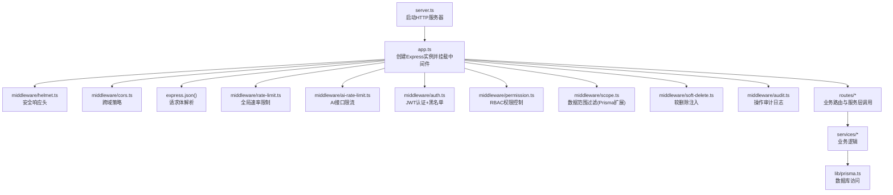
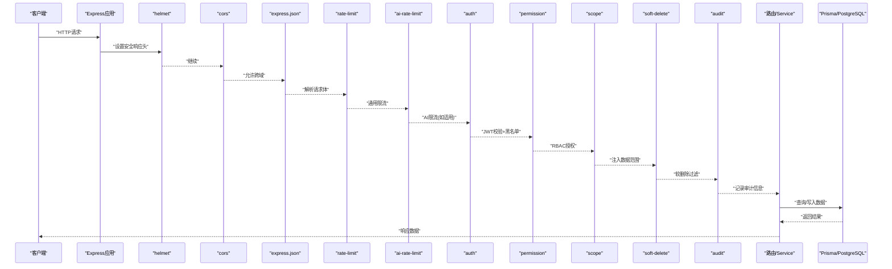
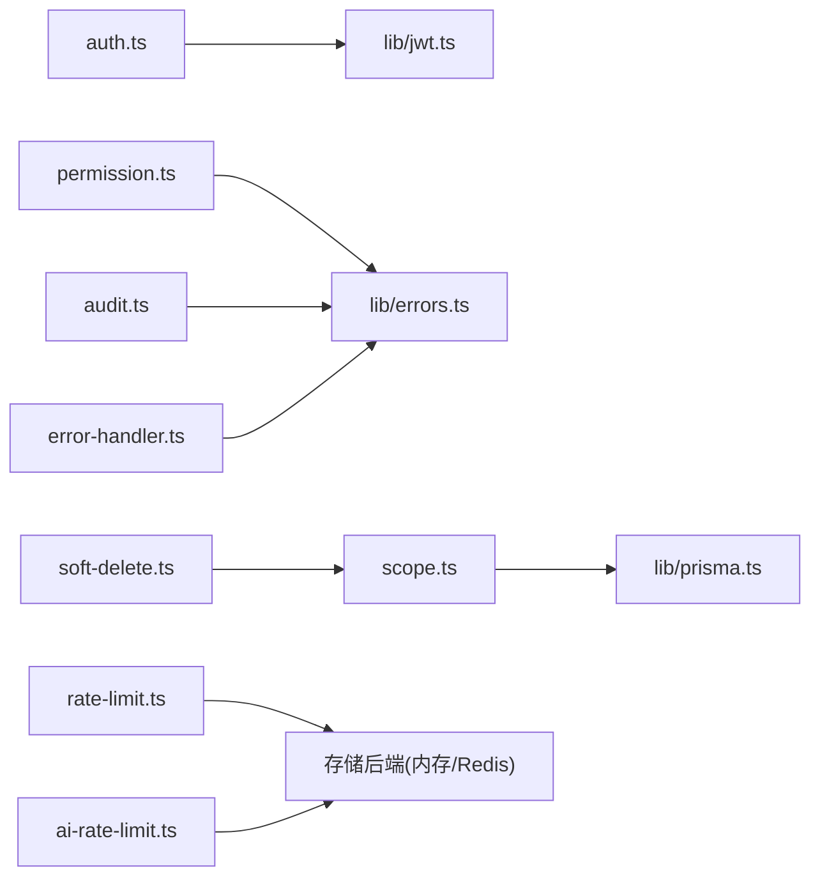
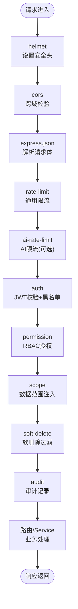

# 中间件机制

<cite>
**本文引用的文件**   
- [app.ts](file://server/src/app.ts)
- [server.ts](file://server/src/server.ts)
- [helmet.ts](file://server/src/middleware/helmet.ts)
- [cors.ts](file://server/src/middleware/cors.ts)
- [rate-limit.ts](file://server/src/middleware/rate-limit.ts)
- [ai-rate-limit.ts](file://server/src/middleware/ai-rate-limit.ts)
- [auth.ts](file://server/src/middleware/auth.ts)
- [permission.ts](file://server/src/middleware/permission.ts)
- [scope.ts](file://server/src/middleware/scope.ts)
- [soft-delete.ts](file://server/src/middleware/soft-delete.ts)
- [audit.ts](file://server/src/middleware/audit.ts)
- [error-handler.ts](file://server/src/middleware/error-handler.ts)
- [trace-id.ts](file://server/src/middleware/trace-id.ts)
- [jwt.ts](file://server/src/lib/jwt.ts)
- [errors.ts](file://server/src/lib/errors.ts)
- [env.ts](file://server/src/config/env.ts)
- [async-handler.ts](file://server/src/lib/async-handler.ts)
</cite>

## 目录
1. [简介](#简介)
2. [项目结构](#项目结构)
3. [核心组件](#核心组件)
4. [架构总览](#架构总览)
5. [详细组件分析](#详细组件分析)
6. [依赖关系分析](#依赖关系分析)
7. [性能考量](#性能考量)
8. [故障排查指南](#故障排查指南)
9. [结论](#结论)
10. [附录](#附录)

## 简介
本文件系统化阐述 FY200 后端 Express 中间件机制，覆盖执行模型、管道设计、各中间件职责与实现要点、注册顺序、错误传播、上下文共享、自定义开发规范与最佳实践，并提供流程图、配置示例与调试技巧。结合项目技术栈（Express 4 + Prisma 5 + PostgreSQL 15 + JWT + DeepSeek API），重点说明安全、鉴权、权限、数据范围、软删除、审计与限流等横切能力如何以中间件形式组合，形成稳定可靠的请求处理流水线。

## 项目结构
FY200 后端将中间件集中于 server/src/middleware，应用初始化在 app.ts 中完成，服务启动入口为 server.ts。关键路径：
- 应用装配：server/src/app.ts
- 服务启动：server/src/server.ts
- 中间件集合：server/src/middleware/*
- 公共库：server/src/lib/*（JWT、错误、异步处理器等）
- 环境配置：server/src/config/env.ts

图表来源
- [server.ts](file://server/src/server.ts)
- [app.ts](file://server/src/app.ts)

章节来源
- [server.ts](file://server/src/server.ts)
- [app.ts](file://server/src/app.ts)

## 核心组件
- helmet：统一设置安全相关响应头，降低常见Web攻击面。
- cors：按环境或白名单配置跨域策略，支持预检与凭证。
- express.json：解析JSON请求体，配合校验与错误处理。
- rate-limit：基于IP或用户维度的通用速率限制，保护API稳定性。
- ai-rate-limit：针对AI接口的专用限流，区分不同通道与配额。
- auth：JWT签发与验证、黑名单检查，建立用户上下文。
- permission：基于角色的访问控制（RBAC），默认拒绝，显式授权。
- scope：通过Prisma扩展注入数据范围过滤条件，保障多租户/组织隔离。
- soft-delete：自动注入软删除过滤条件，避免误删数据泄露。
- audit：记录关键操作的审计日志，满足合规与可追溯性。
- error-handler：集中捕获异常，统一错误响应格式。
- trace-id：生成/透传请求追踪ID，便于链路追踪。

章节来源
- [helmet.ts](file://server/src/middleware/helmet.ts)
- [cors.ts](file://server/src/middleware/cors.ts)
- [rate-limit.ts](file://server/src/middleware/rate-limit.ts)
- [ai-rate-limit.ts](file://server/src/middleware/ai-rate-limit.ts)
- [auth.ts](file://server/src/middleware/auth.ts)
- [permission.ts](file://server/src/middleware/permission.ts)
- [scope.ts](file://server/src/middleware/scope.ts)
- [soft-delete.ts](file://server/src/middleware/soft-delete.ts)
- [audit.ts](file://server/src/middleware/audit.ts)
- [error-handler.ts](file://server/src/middleware/error-handler.ts)
- [trace-id.ts](file://server/src/middleware/trace-id.ts)

## 架构总览
Express 中间件采用洋葱模型，请求自上而下依次进入每个中间件，响应自下而上返回。FY200 的默认执行链顺序如下：
helmet → cors → express.json → rate-limit → auth(JWT+黑名单) → permission(RBAC) → scope(Prisma扩展) → softDelete → audit → Service → Prisma → PostgreSQL

图表来源
- [app.ts](file://server/src/app.ts)
- [helmet.ts](file://server/src/middleware/helmet.ts)
- [cors.ts](file://server/src/middleware/cors.ts)
- [rate-limit.ts](file://server/src/middleware/rate-limit.ts)
- [ai-rate-limit.ts](file://server/src/middleware/ai-rate-limit.ts)
- [auth.ts](file://server/src/middleware/auth.ts)
- [permission.ts](file://server/src/middleware/permission.ts)
- [scope.ts](file://server/src/middleware/scope.ts)
- [soft-delete.ts](file://server/src/middleware/soft-delete.ts)
- [audit.ts](file://server/src/middleware/audit.ts)

## 详细组件分析

### helmet：安全响应头配置
- 职责：设置X-Frame-Options、X-Content-Type-Options、Strict-Transport-Security等安全头，减少点击劫持、MIME嗅探、HTTPS降级风险。
- 关键点：
  - 根据环境变量启用/禁用部分策略（如生产强制HSTS）。
  - 与CORS共存时注意头部冲突。
- 错误处理：通常不抛出业务错误，仅设置响应头。
- 性能影响：极低，仅在响应头写入阶段生效。

章节来源
- [helmet.ts](file://server/src/middleware/helmet.ts)

### cors：跨域处理
- 职责：根据来源域名、方法、头进行跨域放行，支持预检请求与凭据。
- 关键点：
  - 白名单来源列表与环境变量控制。
  - 对敏感接口开启withCredentials，确保Cookie传递。
- 错误处理：非法来源直接拒绝，返回403。
- 性能影响：低，字符串匹配与正则判断开销极小。

章节来源
- [cors.ts](file://server/src/middleware/cors.ts)

### express.json：请求体解析
- 职责：解析application/json请求体到req.body，并处理语法错误。
- 关键点：
  - 限制最大body大小，防止DoS。
  - 与后续校验中间件配合使用。
- 错误处理：返回400并提示JSON格式错误。
- 性能影响：中等，取决于请求体大小与复杂度。

章节来源
- [app.ts](file://server/src/app.ts)

### rate-limit：通用速率限制
- 职责：基于IP或用户标识限制单位时间内的请求次数，保护后端资源。
- 关键点：
  - 内存或Redis存储计数键（可按需扩展）。
  - 支持动态阈值与忽略路径。
- 错误处理：超过阈值返回429，附带重试间隔。
- 性能影响：低到中等，取决于存储后端与命中率。

章节来源
- [rate-limit.ts](file://server/src/middleware/rate-limit.ts)

### ai-rate-limit：AI接口限流
- 职责：针对AI代理接口（DeepSeek SSE）进行独立限流，避免LLM调用风暴。
- 关键点：
  - 区分通道（polish/analyze）与用户配额。
  - 支持滑动窗口或令牌桶算法。
- 错误处理：超限返回429，建议前端退避重试。
- 性能影响：低，主要依赖计数器与时间计算。

章节来源
- [ai-rate-limit.ts](file://server/src/middleware/ai-rate-limit.ts)

### auth：JWT认证与黑名单检查
- 职责：从请求头提取JWT，验签、过期检查、黑名单校验，建立req.user上下文。
- 关键点：
  - access token短期有效（约15分钟），refresh token长期轮转（约7天）。
  - 黑名单存储（内存/缓存/DB）用于即时吊销。
  - 失败统一返回401，携带错误码。
- 错误处理：签名无效、过期、黑名单命中均拒绝访问。
- 性能影响：低，主要哈希校验与缓存读取。

章节来源
- [auth.ts](file://server/src/middleware/auth.ts)
- [jwt.ts](file://server/src/lib/jwt.ts)

### permission：RBAC权限控制
- 职责：基于角色与资源动作的访问控制，默认拒绝，显式授权。
- 关键点：
  - 定义资源-动作映射（如report:view、data:export）。
  - 支持细粒度权限（组织/部门/项目级）。
  - 未授权返回403。
- 错误处理：无权限或权限缺失明确提示。
- 性能影响：低，权限表查询或缓存命中。

章节来源
- [permission.ts](file://server/src/middleware/permission.ts)

### scope：数据范围过滤（Prisma扩展）
- 职责：通过Prisma扩展注入where条件，实现多租户/组织/项目数据隔离。
- 关键点：
  - 从req.scope获取当前用户的数据范围。
  - 自动追加tenantId、orgId、projectId等过滤条件。
  - 与软删除协同，确保不可见已删除数据。
- 错误处理：范围缺失或非法返回400/403。
- 性能影响：低，SQL where条件增加索引友好。

章节来源
- [scope.ts](file://server/src/middleware/scope.ts)

### soft-delete：软删除处理
- 职责：自动注入deletedAt字段过滤，避免返回已删除数据；写操作标记删除而非物理删除。
- 关键点：
  - 读操作自动追加where deletedAt is null。
  - 写操作更新deletedAt而非DELETE。
  - 与scope协同保证隔离。
- 错误处理：非法操作返回400/404。
- 性能影响：低，where条件优化良好。

章节来源
- [soft-delete.ts](file://server/src/middleware/soft-delete.ts)

### audit：操作审计
- 职责：记录关键操作（谁、何时、何资源、何动作、结果），满足合规与审计需求。
- 关键点：
  - 抽取用户、资源、动作、状态码、耗时等元数据。
  - 异步落库，避免阻塞主流程。
  - 敏感字段脱敏（金额区间化、公司名映射）。
- 错误处理：审计失败不影响业务响应。
- 性能影响：低，异步写入与批量化。

章节来源
- [audit.ts](file://server/src/middleware/audit.ts)

### error-handler：统一错误处理
- 职责：捕获未处理异常与业务错误，统一响应格式与状态码。
- 关键点：
  - 区分客户端错误（4xx）与服务端错误（5xx）。
  - 记录堆栈与请求上下文，便于定位。
  - 生产环境隐藏敏感错误详情。
- 错误处理：标准化错误对象，包含code、message、details。
- 性能影响：低，仅在异常路径触发。

章节来源
- [error-handler.ts](file://server/src/middleware/error-handler.ts)
- [errors.ts](file://server/src/lib/errors.ts)

### trace-id：请求追踪
- 职责：生成唯一traceId并注入响应头，贯穿日志与链路追踪。
- 关键点：
  - 若上游传入则复用，否则生成新ID。
  - 所有日志附加traceId，便于聚合分析。
- 错误处理：无业务错误。
- 性能影响：极低，UUID生成与字符串拼接。

章节来源
- [trace-id.ts](file://server/src/middleware/trace-id.ts)

## 依赖关系分析
中间件之间的依赖与协作关系如下：
- auth依赖jwt库进行令牌校验。
- permission依赖用户角色与资源映射。
- scope依赖Prisma扩展与用户上下文。
- soft-delete依赖ORM钩子或查询拦截。
- audit依赖日志与异步队列。
- rate-limit与ai-rate-limit依赖存储后端（内存/Redis）。
- error-handler依赖错误类型定义。

图表来源
- [auth.ts](file://server/src/middleware/auth.ts)
- [jwt.ts](file://server/src/lib/jwt.ts)
- [permission.ts](file://server/src/middleware/permission.ts)
- [scope.ts](file://server/src/middleware/scope.ts)
- [soft-delete.ts](file://server/src/middleware/soft-delete.ts)
- [audit.ts](file://server/src/middleware/audit.ts)
- [rate-limit.ts](file://server/src/middleware/rate-limit.ts)
- [ai-rate-limit.ts](file://server/src/middleware/ai-rate-limit.ts)
- [error-handler.ts](file://server/src/middleware/error-handler.ts)
- [errors.ts](file://server/src/lib/errors.ts)

章节来源
- [app.ts](file://server/src/app.ts)

## 性能考量
- 中间件顺序优化：将轻量且必执行的中间件（helmet、cors、json）置于前端，减少后续开销。
- 限流策略：合理设置阈值与窗口，避免误伤正常流量；AI接口单独限流，避免LLM调用风暴。
- 缓存利用：JWT黑名单、权限映射、速率计数尽量使用内存或Redis，降低延迟。
- 异步审计：审计写入异步化，避免阻塞主流程；批量写入提升吞吐。
- 数据库优化：scope与soft-delete的where条件应配合索引，避免全表扫描。
- 错误路径：错误处理仅在异常分支触发，避免常规路径额外开销。

[本节为通用指导，无需引用具体文件]

## 故障排查指南
- 常见问题
  - 跨域失败：检查cors白名单与预检请求是否放行。
  - 认证失败：确认JWT签名、过期时间与黑名单状态。
  - 权限不足：核对角色-资源-动作映射是否正确配置。
  - 数据范围异常：检查scope注入的条件是否与用户上下文一致。
  - 软删除数据可见：确认ORM扩展是否正确注入deletedAt过滤。
  - 审计缺失：检查异步队列与日志写入是否正常。
  - 限流误伤：调整rate-limit阈值与忽略路径。
- 调试技巧
  - 启用traceId并在日志中打印，便于链路追踪。
  - 临时关闭非关键中间件定位问题。
  - 使用结构化日志记录请求/响应摘要与耗时。
  - 对高频接口添加性能指标（P95/P99）。
- 错误处理
  - 统一错误码与消息，便于前端处理。
  - 生产环境隐藏敏感堆栈，保留必要上下文。

章节来源
- [error-handler.ts](file://server/src/middleware/error-handler.ts)
- [errors.ts](file://server/src/lib/errors.ts)
- [trace-id.ts](file://server/src/middleware/trace-id.ts)

## 结论
FY200 的中间件机制以清晰的洋葱模型组织，将安全、跨域、解析、限流、认证、权限、数据范围、软删除与审计等横切能力解耦为独立模块，既保证了关注点分离，又提升了可维护性与可扩展性。通过合理的注册顺序、统一的错误处理与上下文共享，实现了高内聚、低耦合的请求处理流水线。遵循本文档的开发规范与最佳实践，可快速构建符合企业级要求的中间件。

[本节为总结性内容，无需引用具体文件]

## 附录

### 中间件执行流程图

图表来源
- [app.ts](file://server/src/app.ts)
- [helmet.ts](file://server/src/middleware/helmet.ts)
- [cors.ts](file://server/src/middleware/cors.ts)
- [rate-limit.ts](file://server/src/middleware/rate-limit.ts)
- [ai-rate-limit.ts](file://server/src/middleware/ai-rate-limit.ts)
- [auth.ts](file://server/src/middleware/auth.ts)
- [permission.ts](file://server/src/middleware/permission.ts)
- [scope.ts](file://server/src/middleware/scope.ts)
- [soft-delete.ts](file://server/src/middleware/soft-delete.ts)
- [audit.ts](file://server/src/middleware/audit.ts)

### 配置示例（路径参考）
- 应用装配与中间件注册：[app.ts](file://server/src/app.ts)
- 服务启动与端口监听：[server.ts](file://server/src/server.ts)
- 环境变量与配置项：[env.ts](file://server/src/config/env.ts)
- 异步处理器封装：[async-handler.ts](file://server/src/lib/async-handler.ts)

章节来源
- [app.ts](file://server/src/app.ts)
- [server.ts](file://server/src/server.ts)
- [env.ts](file://server/src/config/env.ts)
- [async-handler.ts](file://server/src/lib/async-handler.ts)

### 自定义中间件开发规范与最佳实践
- 命名与职责：单一职责，命名清晰（如“xxx.ts”），避免复合功能。
- 参数与配置：通过函数工厂模式接收配置，支持环境与运行时覆盖。
- 上下文共享：向req注入安全、用户、范围等上下文，避免重复解析。
- 错误处理：抛出标准错误或使用async-handler包装，交由error-handler统一处理。
- 性能优化：避免同步阻塞I/O，使用缓存与异步队列，减少热路径开销。
- 测试覆盖：编写单元测试与集成测试，覆盖正常与异常路径。
- 文档与注释：提供清晰的JSDoc与使用示例，便于团队协作。

[本节为通用指导，无需引用具体文件]