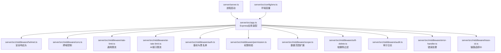
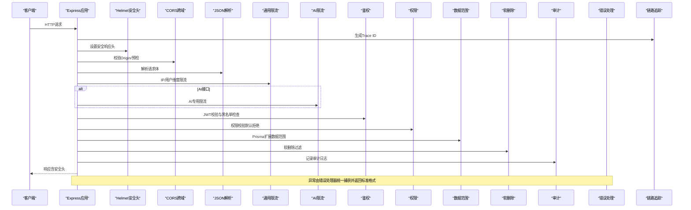
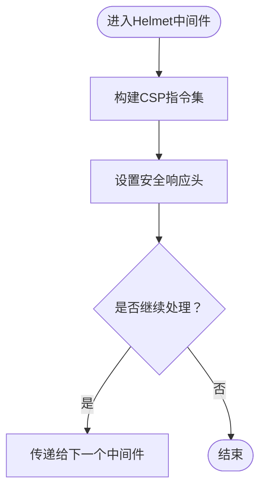
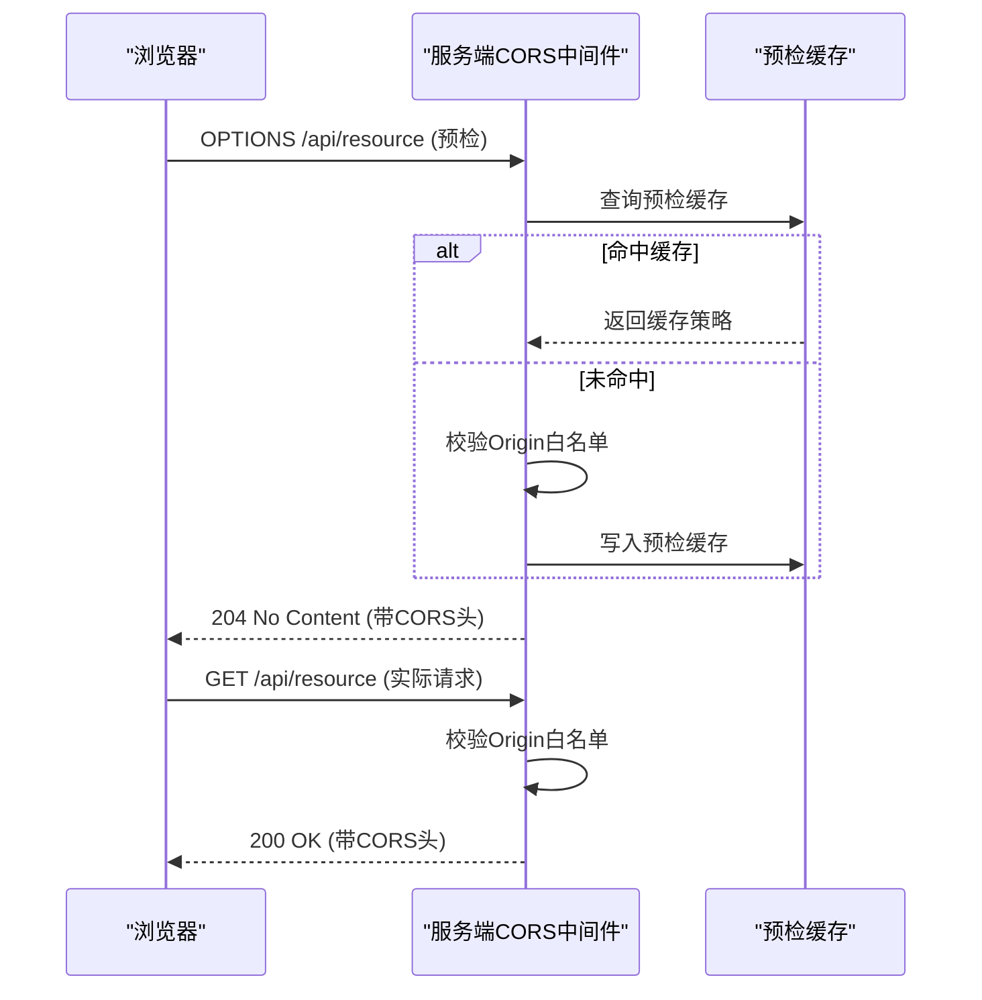
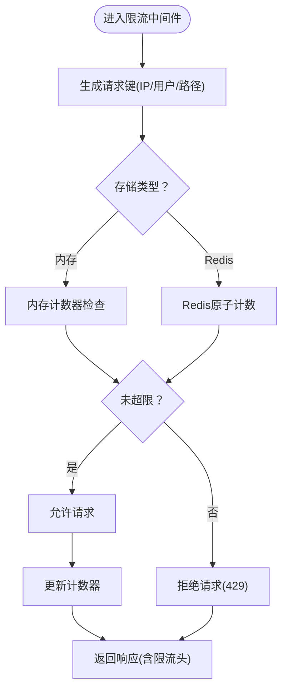
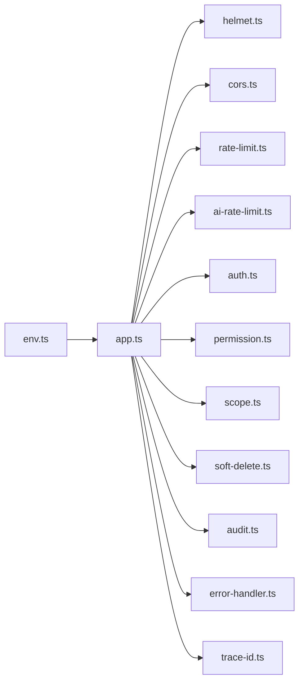

# 安全中间件

<cite>
**本文引用的文件**   
- [server.ts](file://server/server.ts)
- [app.ts](file://server/src/app.ts)
- [helmet.ts](file://server/src/middleware/helmet.ts)
- [cors.ts](file://server/src/middleware/cors.ts)
- [rate-limit.ts](file://server/src/middleware/rate-limit.ts)
- [ai-rate-limit.ts](file://server/src/middleware/ai-rate-limit.ts)
- [auth.ts](file://server/src/middleware/auth.ts)
- [permission.ts](file://server/src/middleware/permission.ts)
- [scope.ts](file://server/src/middleware/scope.ts)
- [soft-delete.ts](file://server/src/middleware/soft-delete.ts)
- [audit.ts](file://server/src/middleware/audit.ts)
- [error-handler.ts](file://server/src/middleware/error-handler.ts)
- [trace-id.ts](file://server/src/middleware/trace-id.ts)
- [env.ts](file://server/src/config/env.ts)
- [cors-check.ts](file://server/scripts/cors-check.ts)
</cite>

## 目录
1. [简介](#简介)
2. [项目结构](#项目结构)
3. [核心组件](#核心组件)
4. [架构总览](#架构总览)
5. [详细组件分析](#详细组件分析)
6. [依赖关系分析](#依赖关系分析)
7. [性能考量](#性能考量)
8. [故障排查指南](#故障排查指南)
9. [结论](#结论)
10. [附录](#附录)

## 简介
本文件面向FY200项目的安全中间件体系，聚焦以下目标：
- 深入解释Helmet安全头配置（CSP、X-Frame-Options、HSTS等）的设置原理与可配置项。
- 详细说明CORS跨域处理机制（预检请求、凭证传递、域名白名单）。
- 阐述Rate Limit速率限制策略（IP级别限流、API端点限流、Redis存储方案）。
- 给出各中间件的配置参数、默认值与自定义扩展方法。
- 提供安全配置示例、常见攻击防护建议与性能优化要点。

本项目后端技术栈为Express 4 + Prisma 5 + PostgreSQL 15 + JWT + DeepSeek API（SSE流式），中间件执行链顺序为：
helmet → cors → express.json → rate-limit → auth(JWT+黑名单) → permission(默认拒绝) → scope(Prisma extension) → softDelete → audit → Service → Prisma → PostgreSQL。

## 项目结构
安全相关代码集中在 server/src/middleware 目录，应用入口在 server/src/app.ts，服务启动在 server/server.ts，环境变量定义在 server/src/config/env.ts。脚本 cors-check.ts 用于验证CORS行为。

**图表来源**
- [server.ts:1-200](file://server/server.ts#L1-L200)
- [app.ts:1-200](file://server/src/app.ts#L1-L200)
- [helmet.ts:1-200](file://server/src/middleware/helmet.ts#L1-L200)
- [cors.ts:1-200](file://server/src/middleware/cors.ts#L1-L200)
- [rate-limit.ts:1-200](file://server/src/middleware/rate-limit.ts#L1-L200)
- [ai-rate-limit.ts:1-200](file://server/src/middleware/ai-rate-limit.ts#L1-L200)
- [auth.ts:1-200](file://server/src/middleware/auth.ts#L1-L200)
- [permission.ts:1-200](file://server/src/middleware/permission.ts#L1-L200)
- [scope.ts:1-200](file://server/src/middleware/scope.ts#L1-L200)
- [soft-delete.ts:1-200](file://server/src/middleware/soft-delete.ts#L1-L200)
- [audit.ts:1-200](file://server/src/middleware/audit.ts#L1-L200)
- [error-handler.ts:1-200](file://server/src/middleware/error-handler.ts#L1-L200)
- [trace-id.ts:1-200](file://server/src/middleware/trace-id.ts#L1-L200)
- [env.ts:1-200](file://server/src/config/env.ts#L1-L200)

**章节来源**
- [server.ts:1-200](file://server/server.ts#L1-L200)
- [app.ts:1-200](file://server/src/app.ts#L1-L200)

## 核心组件
- Helmet安全头：统一设置响应安全头，包括CSP、X-Frame-Options、HSTS、Referrer-Policy、Permissions-Policy等，降低点击劫持、XSS、嗅探等风险。
- CORS跨域：基于白名单的严格跨域控制，支持预检请求缓存、凭证传递、动态Origin校验。
- Rate Limit通用限流：支持按IP或用户标识维度限流，支持内存与Redis两种存储后端，提供滑动窗口与固定窗口策略。
- AI专用限流：针对AI代理接口的高并发场景，采用更严格的配额与退避策略，结合Redis实现分布式计数。
- 鉴权与权限：JWT访问令牌校验、黑名单拦截、默认拒绝的权限模型配合Scope扩展实现细粒度数据访问控制。
- 审计与错误处理：记录关键操作审计日志，集中错误处理与标准化响应。
- 链路追踪：为每个请求注入唯一Trace ID，便于问题定位与性能分析。

**章节来源**
- [helmet.ts:1-200](file://server/src/middleware/helmet.ts#L1-L200)
- [cors.ts:1-200](file://server/src/middleware/cors.ts#L1-L200)
- [rate-limit.ts:1-200](file://server/src/middleware/rate-limit.ts#L1-L200)
- [ai-rate-limit.ts:1-200](file://server/src/middleware/ai-rate-limit.ts#L1-L200)
- [auth.ts:1-200](file://server/src/middleware/auth.ts#L1-L200)
- [permission.ts:1-200](file://server/src/middleware/permission.ts#L1-L200)
- [scope.ts:1-200](file://server/src/middleware/scope.ts#L1-L200)
- [soft-delete.ts:1-200](file://server/src/middleware/soft-delete.ts#L1-L200)
- [audit.ts:1-200](file://server/src/middleware/audit.ts#L1-L200)
- [error-handler.ts:1-200](file://server/src/middleware/error-handler.ts#L1-L200)
- [trace-id.ts:1-200](file://server/src/middleware/trace-id.ts#L1-L200)

## 架构总览
下图展示安全中间件在Express请求生命周期中的位置与交互关系。

**图表来源**
- [app.ts:1-200](file://server/src/app.ts#L1-L200)
- [helmet.ts:1-200](file://server/src/middleware/helmet.ts#L1-L200)
- [cors.ts:1-200](file://server/src/middleware/cors.ts#L1-L200)
- [rate-limit.ts:1-200](file://server/src/middleware/rate-limit.ts#L1-L200)
- [ai-rate-limit.ts:1-200](file://server/src/middleware/ai-rate-limit.ts#L1-L200)
- [auth.ts:1-200](file://server/src/middleware/auth.ts#L1-L200)
- [permission.ts:1-200](file://server/src/middleware/permission.ts#L1-L200)
- [scope.ts:1-200](file://server/src/middleware/scope.ts#L1-L200)
- [soft-delete.ts:1-200](file://server/src/middleware/soft-delete.ts#L1-L200)
- [audit.ts:1-200](file://server/src/middleware/audit.ts#L1-L200)
- [error-handler.ts:1-200](file://server/src/middleware/error-handler.ts#L1-L200)
- [trace-id.ts:1-200](file://server/src/middleware/trace-id.ts#L1-L200)

## 详细组件分析

### Helmet安全头配置
- 功能要点
  - 设置Content-Security-Policy（CSP）以限制资源加载与脚本执行，缓解XSS攻击。
  - 设置X-Frame-Options防止点击劫持。
  - 启用Strict-Transport-Security（HSTS）强制HTTPS传输。
  - 配置Referrer-Policy、Permissions-Policy、X-Content-Type-Options等增强安全性。
- 配置选项
  - CSP策略：指令集合（如default-src、script-src、style-src、img-src、connect-src、frame-ancestors等），可按环境精细化调整。
  - X-Frame-Options：DENY/SAMEORIGIN。
  - HSTS：max-age、includeSubDomains、preload。
  - 其他头部：X-Content-Type-Options、X-DNS-Prefetch-Control、X-Permitted-Cross-Domain-Policies等。
- 默认值与覆盖
  - 默认启用常用安全头；可通过配置对象覆盖具体指令。
  - 生产环境建议开启严格CSP与HSTS预加载。
- 自定义扩展
  - 可按路由或模块动态注入额外指令（如第三方SDK域名）。
  - 支持条件化禁用某些指令（开发调试时放宽CSP）。

**图表来源**
- [helmet.ts:1-200](file://server/src/middleware/helmet.ts#L1-L200)

**章节来源**
- [helmet.ts:1-200](file://server/src/middleware/helmet.ts#L1-L200)

### CORS跨域处理机制
- 功能要点
  - 基于白名单校验请求Origin，仅允许受信任域名访问。
  - 正确处理预检请求（OPTIONS），缓存预检结果以减少重复校验。
  - 支持凭证传递（credentials: true）与敏感Cookie跨域。
  - 暴露必要响应头供前端读取。
- 配置选项
  - allowedOrigins：域名白名单数组，支持通配符或正则匹配。
  - methods：允许的HTTP方法集合。
  - allowedHeaders：允许的请求头集合。
  - exposedHeaders：暴露给前端的响应头集合。
  - credentials：是否允许携带凭证。
  - maxAge：预检请求缓存时间（秒）。
- 默认值与覆盖
  - 默认禁止所有跨域；需显式配置白名单。
  - 开发环境可放宽限制，生产环境严格白名单。
- 自定义扩展
  - 支持动态Origin校验（如从数据库或配置中心加载）。
  - 可按路由差异化配置CORS策略。

**图表来源**
- [cors.ts:1-200](file://server/src/middleware/cors.ts#L1-L200)
- [cors-check.ts:1-200](file://server/scripts/cors-check.ts#L1-L200)

**章节来源**
- [cors.ts:1-200](file://server/src/middleware/cors.ts#L1-L200)
- [cors-check.ts:1-200](file://server/scripts/cors-check.ts#L1-L200)

### Rate Limit速率限制策略
- 功能要点
  - 支持按IP或用户标识维度进行限流，避免恶意刷接口。
  - 提供固定窗口与滑动窗口算法，平衡精度与性能。
  - 支持内存与Redis两种存储后端，满足单机与分布式部署需求。
  - 对AI接口提供专用限流策略，防止LLM调用过载。
- 配置选项
  - windowMs：时间窗口（毫秒）。
  - max：窗口内最大请求数。
  - keyGenerator：请求键生成器（IP、用户ID、API路径等）。
  - store：存储后端（内存或Redis）。
  - redis：Redis连接配置（host、port、db、password等）。
  - skipFailedRequests：失败请求是否计入限流。
  - headers：是否返回剩余配额与重置时间头。
- 默认值与覆盖
  - 默认使用内存存储，适合单实例；多实例需切换Redis。
  - 不同路由可配置不同限流策略（如登录接口更严格）。
- 自定义扩展
  - 支持动态阈值（根据负载或用户等级调整）。
  - 支持告警与熔断联动（达到阈值触发告警或降级）。

**图表来源**
- [rate-limit.ts:1-200](file://server/src/middleware/rate-limit.ts#L1-L200)
- [ai-rate-limit.ts:1-200](file://server/src/middleware/ai-rate-limit.ts#L1-L200)

**章节来源**
- [rate-limit.ts:1-200](file://server/src/middleware/rate-limit.ts#L1-L200)
- [ai-rate-limit.ts:1-200](file://server/src/middleware/ai-rate-limit.ts#L1-L200)

### 鉴权与权限（辅助说明）
- 鉴权中间件负责JWT校验与黑名单检查，确保请求来自合法用户且未被封禁。
- 权限中间件采用“默认拒绝”策略，需显式授权才能访问特定资源。
- Scope扩展通过Prisma扩展实现数据范围过滤，保障多租户或多部门数据隔离。

**章节来源**
- [auth.ts:1-200](file://server/src/middleware/auth.ts#L1-L200)
- [permission.ts:1-200](file://server/src/middleware/permission.ts#L1-200)
- [scope.ts:1-200](file://server/src/middleware/scope.ts#L1-200)

### 审计、错误处理与链路追踪（辅助说明）
- 审计中间件记录关键操作（登录、数据变更、权限变更等），便于合规与追溯。
- 错误处理中间件统一捕获异常，返回标准化错误响应，避免泄露内部细节。
- 链路追踪中间件为每个请求注入Trace ID，贯穿日志与监控。

**章节来源**
- [audit.ts:1-200](file://server/src/middleware/audit.ts#L1-200)
- [error-handler.ts:1-200](file://server/src/middleware/error-handler.ts#L1-200)
- [trace-id.ts:1-200](file://server/src/middleware/trace-id.ts#L1-200)

## 依赖关系分析
安全中间件之间的依赖关系如下：
- app.ts装配所有中间件，决定执行顺序。
- helmet与cors位于最外层，优先设置响应头与跨域策略。
- rate-limit与ai-rate-limit在业务逻辑之前执行，保护后端资源。
- auth与permission在业务逻辑之前执行，确保访问合法性。
- scope、soft-delete、audit在Service层之前执行，保证数据一致性与可审计性。
- error-handler与trace-id贯穿全局，提供错误处理与追踪能力。

**图表来源**
- [app.ts:1-200](file://server/src/app.ts#L1-200)
- [env.ts:1-200](file://server/src/config/env.ts#L1-200)

**章节来源**
- [app.ts:1-200](file://server/src/app.ts#L1-200)
- [env.ts:1-200](file://server/src/config/env.ts#L1-200)

## 性能考量
- Helmet
  - 安全头设置开销极低，建议始终启用。
  - CSP复杂指令可能影响浏览器解析，应精简指令集。
- CORS
  - 预检请求缓存可减少重复校验，合理设置maxAge。
  - 白名单校验应在内存中进行，避免频繁I/O。
- Rate Limit
  - 内存存储适合单实例，Redis适用于分布式但引入网络延迟。
  - 滑动窗口精度高但计算开销大，固定窗口更适合高吞吐场景。
  - 对AI接口采用更严格的限流与退避策略，避免LLM过载。
- 鉴权与权限
  - JWT校验应缓存公钥或签名验证结果，减少重复计算。
  - 黑名单检查可使用Redis或本地缓存，注意过期策略。
- 审计与错误处理
  - 异步写入审计日志，避免阻塞主流程。
  - 错误处理应避免堆栈泄露，仅返回必要信息。

[本节为通用指导，不直接分析具体文件]

## 故障排查指南
- CORS相关问题
  - 现象：浏览器报跨域错误或预检失败。
  - 排查：检查allowedOrigins是否包含请求Origin；确认credentials配置正确；查看预检缓存是否生效。
  - 工具：使用scripts/cors-check.ts进行自动化测试。
- Rate Limit相关问题
  - 现象：接口返回429 Too Many Requests。
  - 排查：检查keyGenerator是否正确区分用户/IP；确认windowMs与max配置；查看Redis连接状态。
  - 优化：调整限流策略或增加配额；考虑分片或降级。
- Helmet相关问题
  - 现象：CSP阻止资源加载或脚本执行。
  - 排查：检查CSP指令是否包含必要域名；确认开发环境与生产环境差异。
  - 优化：逐步收紧CSP，避免过度宽松。
- 鉴权与权限问题
  - 现象：JWT失效或被拉黑导致401/403。
  - 排查：检查Token有效期与刷新机制；确认黑名单更新及时；验证权限配置。
- 审计与错误处理
  - 现象：审计日志缺失或错误响应不规范。
  - 排查：检查异步写入队列；确认错误处理中间件顺序；验证日志格式。

**章节来源**
- [cors-check.ts:1-200](file://server/scripts/cors-check.ts#L1-200)
- [rate-limit.ts:1-200](file://server/src/middleware/rate-limit.ts#L1-200)
- [ai-rate-limit.ts:1-200](file://server/src/middleware/ai-rate-limit.ts#L1-200)
- [helmet.ts:1-200](file://server/src/middleware/helmet.ts#L1-200)
- [auth.ts:1-200](file://server/src/middleware/auth.ts#L1-200)
- [permission.ts:1-200](file://server/src/middleware/permission.ts#L1-200)
- [error-handler.ts:1-200](file://server/src/middleware/error-handler.ts#L1-200)
- [audit.ts:1-200](file://server/src/middleware/audit.ts#L1-200)

## 结论
FY200的安全中间件体系以Helmet、CORS、Rate Limit为核心，辅以鉴权、权限、审计与错误处理，形成完整的安全防护链。通过合理的配置与优化，可有效抵御常见Web攻击（XSS、点击劫持、CSRF、暴力破解、DDoS等），同时保障系统性能与稳定性。建议在生产环境中严格配置CSP与HSTS，启用Redis分布式限流，并结合监控与告警实现主动防御。

[本节为总结，不直接分析具体文件]

## 附录
- 安全配置示例
  - Helmet：启用严格CSP、HSTS预加载、X-Frame-Options SAMEORIGIN。
  - CORS：白名单仅包含前端域名，允许GET/POST，暴露必要响应头。
  - Rate Limit：IP维度限流，100次/分钟，Redis存储，返回剩余配额头。
  - AI限流：用户维度限流，10次/分钟，退避策略与熔断联动。
- 常见攻击防护
  - XSS：通过CSP限制脚本执行与资源加载。
  - 点击劫持：通过X-Frame-Options禁止嵌入。
  - CSRF：结合SameSite Cookie与CORS白名单。
  - 暴力破解：通过Rate Limit限制登录尝试。
  - DDoS：通过Rate Limit与CDN/WAF防护。
- 性能优化建议
  - 精简CSP指令，避免过多第三方域名。
  - 预检请求缓存合理设置maxAge。
  - 使用Redis分布式限流，避免热点键倾斜。
  - 异步审计日志，避免阻塞主流程。
  - 监控关键指标（QPS、延迟、错误率、限流命中率）。

[本节为补充内容，不直接分析具体文件]