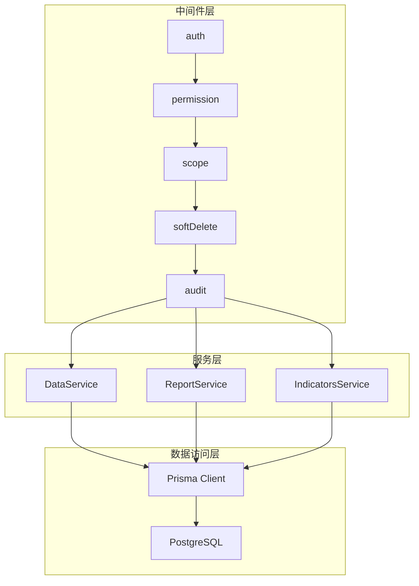
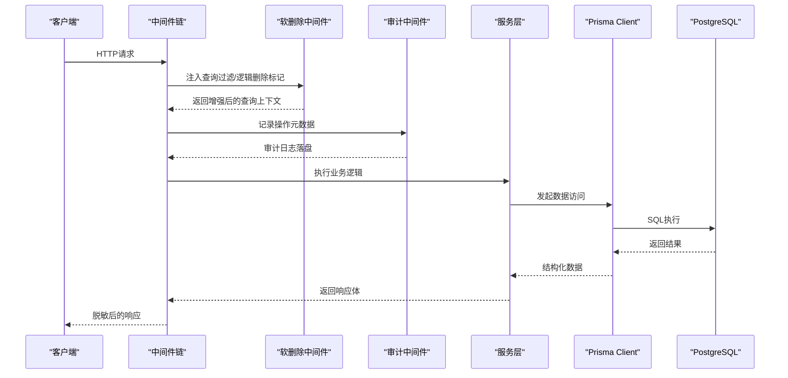
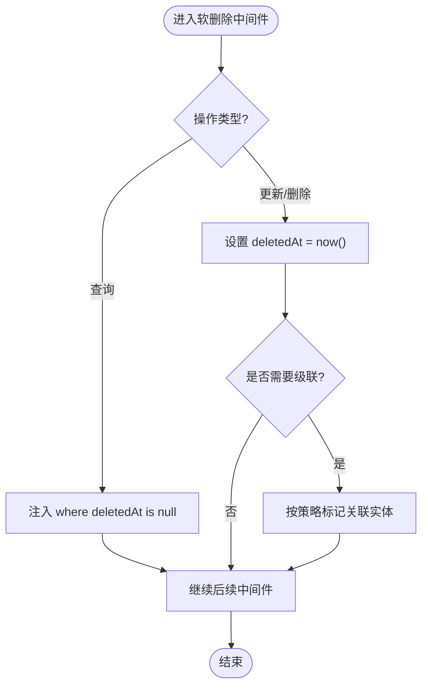
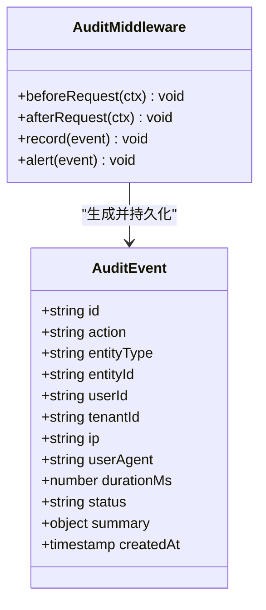
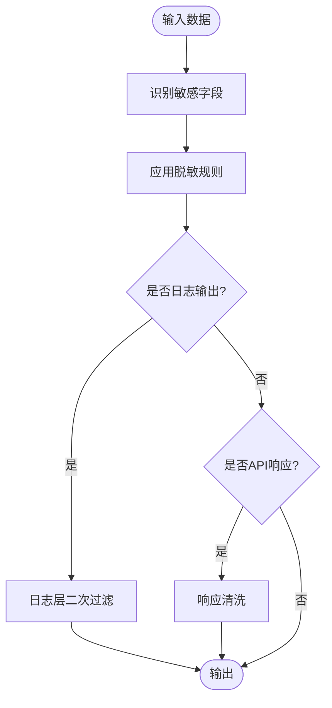
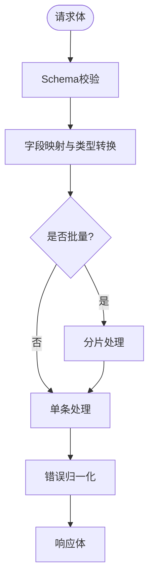
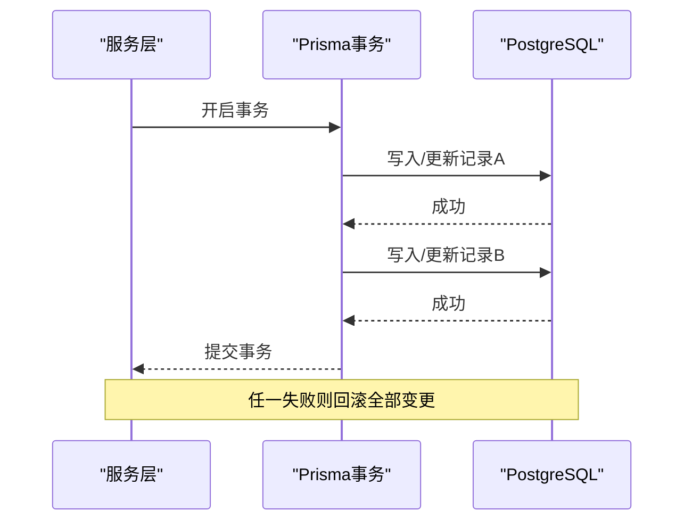
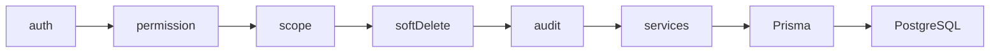

# 数据处理中间件

<cite>
**本文引用的文件**   
- [server/src/middleware/soft-delete.ts](file://server/src/middleware/soft-delete.ts)
- [server/src/middleware/audit.ts](file://server/src/middleware/audit.ts)
- [server/src/lib/desensitize.ts](file://server/src/lib/desensitize.ts)
- [server/src/lib/sanitize.ts](file://server/src/lib/sanitize.ts)
- [server/src/lib/logger.ts](file://server/src/lib/logger.ts)
- [server/src/lib/response.ts](file://server/src/lib/response.ts)
- [server/src/middleware/error-handler.ts](file://server/src/middleware/error-handler.ts)
- [server/src/middleware/auth.ts](file://server/src/middleware/auth.ts)
- [server/src/middleware/permission.ts](file://server/src/middleware/permission.ts)
- [server/src/middleware/scope.ts](file://server/src/middleware/scope.ts)
- [server/src/app.ts](file://server/src/app.ts)
- [server/prisma/schema.prisma](file://server/prisma/schema.prisma)
- [server/prisma/init-audit.sql](file://server/prisma/init-audit.sql)
</cite>

## 目录
1. [简介](#简介)
2. [项目结构](#项目结构)
3. [核心组件](#核心组件)
4. [架构总览](#架构总览)
5. [详细组件分析](#详细组件分析)
6. [依赖关系分析](#依赖关系分析)
7. [性能考量](#性能考量)
8. [故障排查指南](#故障排查指南)
9. [结论](#结论)
10. [附录](#附录)

## 简介
本文件面向FY200数据处理中间件，聚焦以下目标：
- 软删除机制：逻辑删除标记、查询自动过滤与级联删除处理。
- 审计操作：CRUD记录、用户行为追踪、敏感操作告警。
- 数据脱敏策略：敏感字段自动隐藏、日志输出过滤、API响应清洗。
- 数据转换管道、批量操作支持与事务一致性保证。
- 审计日志格式、存储策略与查询分析方法。
- 自定义数据处理器与审计规则配置指南。

后端技术栈为Express 4 + Prisma 5 + PostgreSQL 15，中间件执行链顺序为：helmet → cors → express.json → rate-limit → auth(JWT+黑名单) → permission(默认拒绝) → scope(Prisma extension) → softDelete → audit → Service → Prisma → PostgreSQL。计算类指标使用安全公式解析（白名单算子），同比/环比由后端实时计算不存库。AI双管道采用“脱敏→LLM→还原”的闭环策略。

## 项目结构
本项目将数据处理能力下沉至中间件层，通过扩展Prisma客户端与请求链路拦截实现统一的数据治理。关键目录与职责：
- middleware：软删除、审计、权限、范围等中间件。
- lib：脱敏、日志、响应封装、工具函数。
- prisma：数据库模型与审计表初始化脚本。
- services：业务服务层，调用Prisma并受中间件保护。
- routes：路由定义，挂载中间件链。

图表来源
- [server/src/app.ts](file://server/src/app.ts)
- [server/src/middleware/scope.ts](file://server/src/middleware/scope.ts)
- [server/src/middleware/soft-delete.ts](file://server/src/middleware/soft-delete.ts)
- [server/src/middleware/audit.ts](file://server/src/middleware/audit.ts)

章节来源
- [server/src/app.ts](file://server/src/app.ts)
- [server/src/middleware/scope.ts](file://server/src/middleware/scope.ts)
- [server/src/middleware/soft-delete.ts](file://server/src/middleware/soft-delete.ts)
- [server/src/middleware/audit.ts](file://server/src/middleware/audit.ts)

## 核心组件
- 软删除中间件：在查询时自动注入where条件过滤已删除记录；在更新/删除时切换为逻辑标记；支持级联处理策略。
- 审计中间件：对CRUD操作进行结构化记录，包含用户上下文、资源标识、变更摘要、耗时与结果状态；对敏感操作触发告警。
- 脱敏与清洗：对输入输出进行字段级脱敏与清洗，确保日志与API响应不包含敏感信息。
- 数据转换管道：在服务层与中间件之间提供统一的输入校验、字段映射、批量处理与错误归一化。
- 事务一致性：在批量写入或跨表操作中，通过Prisma事务保证原子性与回滚。

章节来源
- [server/src/middleware/soft-delete.ts](file://server/src/middleware/soft-delete.ts)
- [server/src/middleware/audit.ts](file://server/src/middleware/audit.ts)
- [server/src/lib/desensitize.ts](file://server/src/lib/desensitize.ts)
- [server/src/lib/sanitize.ts](file://server/src/lib/sanitize.ts)
- [server/src/lib/response.ts](file://server/src/lib/response.ts)

## 架构总览
中间件链与数据流如下所示：请求进入后依次经过鉴权、权限、作用域、软删除、审计，再进入服务层调用Prisma访问数据库。审计与脱敏贯穿整个流程，确保可追溯与安全。

图表来源
- [server/src/app.ts](file://server/src/app.ts)
- [server/src/middleware/soft-delete.ts](file://server/src/middleware/soft-delete.ts)
- [server/src/middleware/audit.ts](file://server/src/middleware/audit.ts)
- [server/src/lib/desensitize.ts](file://server/src/lib/desensitize.ts)

## 详细组件分析

### 软删除中间件
- 逻辑删除标记：为实体添加deletedAt字段，所有写操作将时间戳写入该字段而非物理删除。
- 查询自动过滤：通过Prisma扩展或查询钩子，在所有select/list/find中自动追加where deletedAt is null。
- 级联删除处理：当父实体被逻辑删除时，根据策略选择是否级联标记子实体或删除引用，避免孤儿数据。
- 批量支持：对批量更新/删除，按批次注入逻辑标记并记录审计事件。
- 事务一致性：在复杂级联场景中使用Prisma事务，确保多表标记一致。

图表来源
- [server/src/middleware/soft-delete.ts](file://server/src/middleware/soft-delete.ts)
- [server/prisma/schema.prisma](file://server/prisma/schema.prisma)

章节来源
- [server/src/middleware/soft-delete.ts](file://server/src/middleware/soft-delete.ts)
- [server/prisma/schema.prisma](file://server/prisma/schema.prisma)

### 审计中间件
- CRUD记录：对create/update/delete/findOne/findMany等操作记录结构化日志，包含操作类型、资源ID、用户ID、租户/组织、IP、UA、耗时、结果状态。
- 用户行为追踪：结合JWT上下文与权限中间件，记录操作主体与授权范围。
- 敏感操作告警：对高危操作（如批量删除、导出敏感数据、修改权限）触发告警通道（日志级别提升、消息队列或外部通知）。
- 存储策略：审计日志独立表或独立索引分区，支持按时间、用户、资源维度查询与分析。
- 异步写入：为避免阻塞主流程，审计日志采用异步落盘或缓冲队列。

图表来源
- [server/src/middleware/audit.ts](file://server/src/middleware/audit.ts)
- [server/prisma/init-audit.sql](file://server/prisma/init-audit.sql)

章节来源
- [server/src/middleware/audit.ts](file://server/src/middleware/audit.ts)
- [server/prisma/init-audit.sql](file://server/prisma/init-audit.sql)

### 数据脱敏与清洗
- 敏感字段自动隐藏：对金额、公司名、手机号、邮箱等字段按规则替换为区间或映射值。
- 日志输出过滤：在logger层对敏感键值进行掩码处理，防止泄露。
- API响应清洗：在response层对返回体进行遍历清洗，确保不含敏感明文。
- AI管道脱敏：polish/analyze管道在进入LLM前脱敏，出LLM后还原，保持语义完整。

图表来源
- [server/src/lib/desensitize.ts](file://server/src/lib/desensitize.ts)
- [server/src/lib/sanitize.ts](file://server/src/lib/sanitize.ts)
- [server/src/lib/logger.ts](file://server/src/lib/logger.ts)
- [server/src/lib/response.ts](file://server/src/lib/response.ts)

章节来源
- [server/src/lib/desensitize.ts](file://server/src/lib/desensitize.ts)
- [server/src/lib/sanitize.ts](file://server/src/lib/sanitize.ts)
- [server/src/lib/logger.ts](file://server/src/lib/logger.ts)
- [server/src/lib/response.ts](file://server/src/lib/response.ts)

### 数据转换管道与批量操作
- 输入校验：基于schema定义对请求体进行严格校验，失败快速返回。
- 字段映射：将前端字段映射到领域模型，支持别名与类型转换。
- 批量处理：对数组型输入进行分批处理，限制每批大小，避免内存峰值。
- 错误归一化：统一错误码与消息，便于前端处理与监控。

图表来源
- [server/src/lib/response.ts](file://server/src/lib/response.ts)
- [server/src/lib/sanitize.ts](file://server/src/lib/sanitize.ts)

章节来源
- [server/src/lib/response.ts](file://server/src/lib/response.ts)
- [server/src/lib/sanitize.ts](file://server/src/lib/sanitize.ts)

### 事务一致性保证
- 单表事务：对单个实体的多次写入使用事务包裹，保证原子性。
- 跨表事务：涉及多表更新（如软删除级联）使用Prisma事务，失败全量回滚。
- 幂等性：对重复提交通过唯一约束或版本号控制避免副作用。
- 超时与重试：对长事务设置超时阈值，必要时引入重试与补偿机制。

图表来源
- [server/src/middleware/soft-delete.ts](file://server/src/middleware/soft-delete.ts)
- [server/src/middleware/audit.ts](file://server/src/middleware/audit.ts)

章节来源
- [server/src/middleware/soft-delete.ts](file://server/src/middleware/soft-delete.ts)
- [server/src/middleware/audit.ts](file://server/src/middleware/audit.ts)

## 依赖关系分析
中间件之间的耦合与协作关系如下：
- auth与permission负责身份与授权，为后续中间件提供上下文。
- scope通过Prisma扩展注入租户/组织过滤，影响所有查询。
- softDelete在scope之后注入逻辑删除过滤，确保数据可见性。
- audit在softDelete之后记录操作，捕获最终生效的数据视图。

图表来源
- [server/src/app.ts](file://server/src/app.ts)
- [server/src/middleware/auth.ts](file://server/src/middleware/auth.ts)
- [server/src/middleware/permission.ts](file://server/src/middleware/permission.ts)
- [server/src/middleware/scope.ts](file://server/src/middleware/scope.ts)
- [server/src/middleware/soft-delete.ts](file://server/src/middleware/soft-delete.ts)
- [server/src/middleware/audit.ts](file://server/src/middleware/audit.ts)

章节来源
- [server/src/app.ts](file://server/src/app.ts)
- [server/src/middleware/auth.ts](file://server/src/middleware/auth.ts)
- [server/src/middleware/permission.ts](file://server/src/middleware/permission.ts)
- [server/src/middleware/scope.ts](file://server/src/middleware/scope.ts)
- [server/src/middleware/soft-delete.ts](file://server/src/middleware/soft-delete.ts)
- [server/src/middleware/audit.ts](file://server/src/middleware/audit.ts)

## 性能考量
- 查询优化：软删除过滤应利用数据库索引（如deletedAt与主键复合索引），减少扫描成本。
- 审计写入：采用异步写入或缓冲队列，避免阻塞主请求路径。
- 批量处理：合理设置批次大小，避免单次过大导致内存压力。
- 脱敏开销：仅在必要字段上应用脱敏规则，避免全量遍历。
- 事务边界：尽量缩小事务范围，减少锁持有时间。

[本节为通用指导，无需具体文件引用]

## 故障排查指南
- 软删除未生效：检查Prisma扩展是否正确注入deletedAt过滤；确认查询是否绕过扩展。
- 审计缺失：确认audit中间件是否在链中；检查异步写入队列是否堆积；查看错误日志。
- 脱敏异常：核对脱敏规则配置；检查字段命名是否与规则匹配；验证日志与响应清洗是否覆盖所有出口。
- 事务失败：查看数据库错误日志；确认外键约束与唯一约束；检查事务内异常是否被吞掉。
- 权限问题：确认permission中间件默认拒绝策略；检查角色与资源映射。

章节来源
- [server/src/middleware/error-handler.ts](file://server/src/middleware/error-handler.ts)
- [server/src/lib/logger.ts](file://server/src/lib/logger.ts)
- [server/src/middleware/soft-delete.ts](file://server/src/middleware/soft-delete.ts)
- [server/src/middleware/audit.ts](file://server/src/middleware/audit.ts)

## 结论
FY200数据处理中间件通过软删除、审计、脱敏与事务一致性保障，构建了安全、可追溯、高性能的数据处理管线。建议在新增实体时同步启用软删除与审计，并在服务层遵循批量与事务最佳实践，以确保系统稳定与合规。

[本节为总结，无需具体文件引用]

## 附录

### 审计日志格式与存储策略
- 字段建议：id、action、entityType、entityId、userId、tenantId、ip、userAgent、durationMs、status、summary、createdAt。
- 存储策略：独立表或分区表，按createdAt建立索引；支持按用户、实体、时间范围查询。
- 查询方法：提供聚合统计接口（按天/周/月统计操作量、失败率、敏感操作告警数）。

章节来源
- [server/prisma/init-audit.sql](file://server/prisma/init-audit.sql)
- [server/src/middleware/audit.ts](file://server/src/middleware/audit.ts)

### 自定义数据处理器与审计规则配置指南
- 数据处理器：在lib中注册新的脱敏规则与字段映射器，按实体类型加载。
- 审计规则：在audit中间件中扩展action白名单与敏感操作列表，支持动态配置。
- 配置管理：通过环境变量或配置文件注入规则，支持热更新与灰度发布。

章节来源
- [server/src/lib/desensitize.ts](file://server/src/lib/desensitize.ts)
- [server/src/lib/sanitize.ts](file://server/src/lib/sanitize.ts)
- [server/src/middleware/audit.ts](file://server/src/middleware/audit.ts)