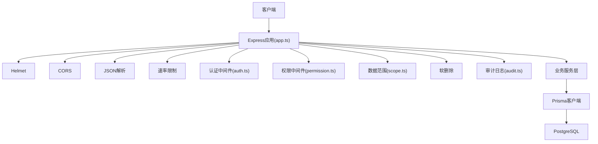
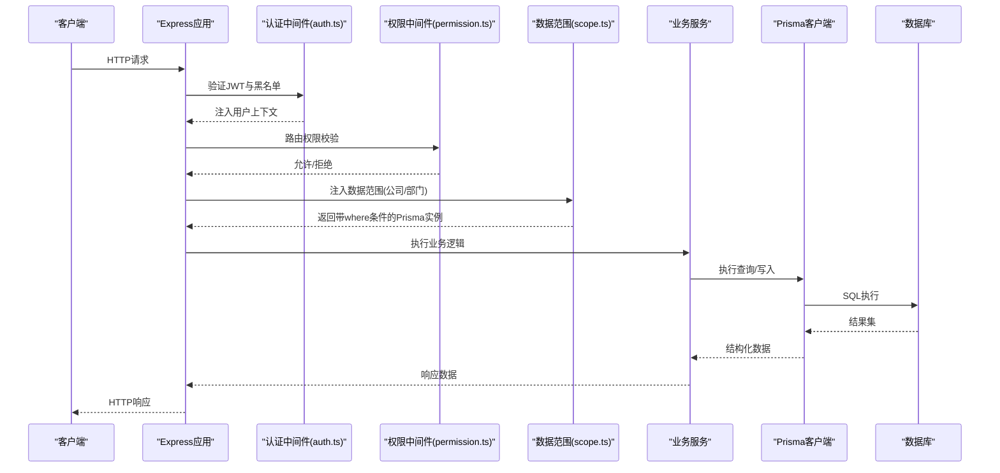
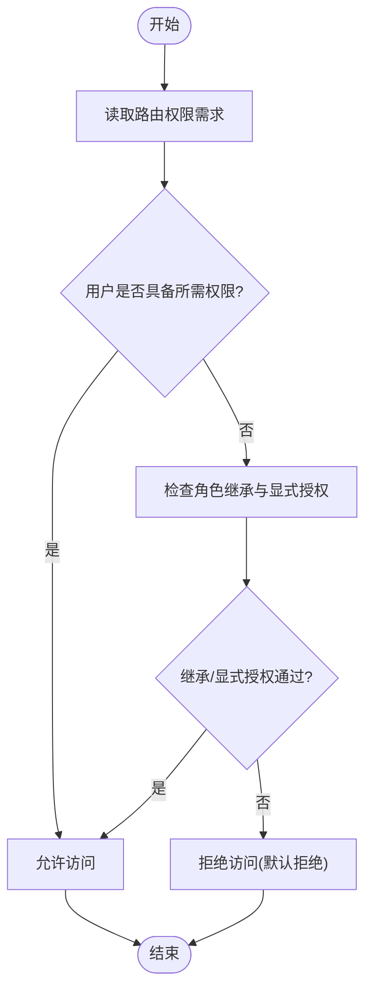
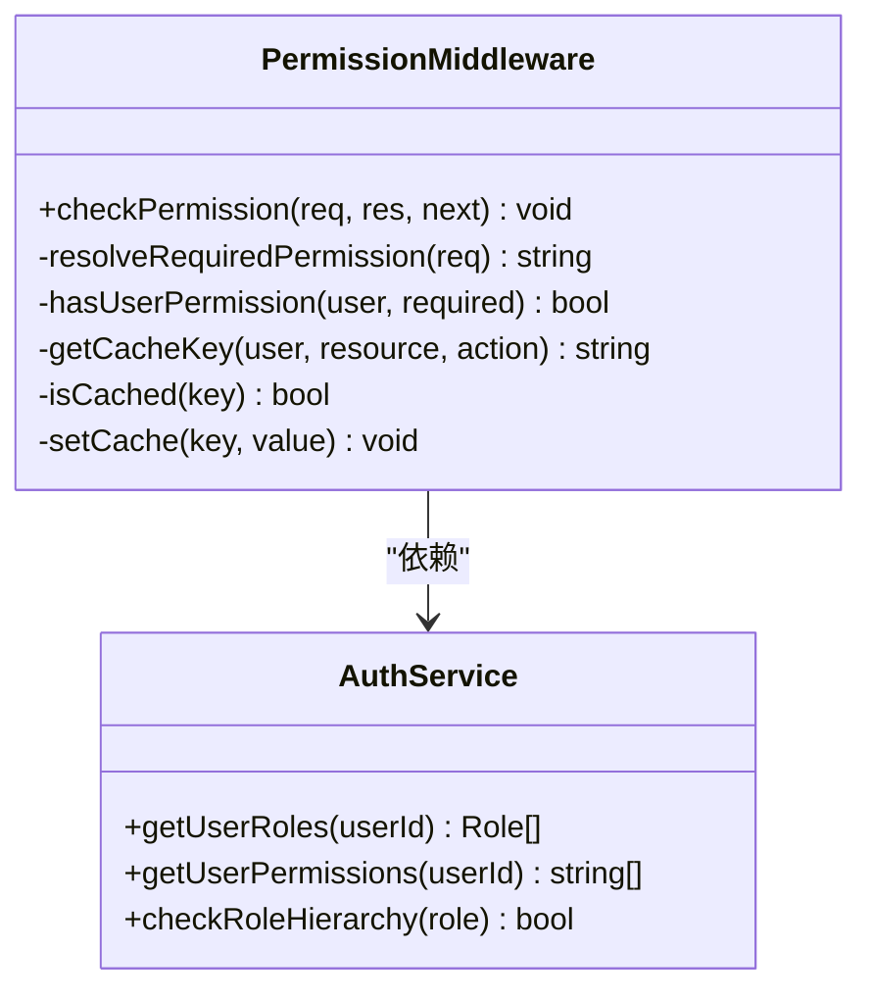
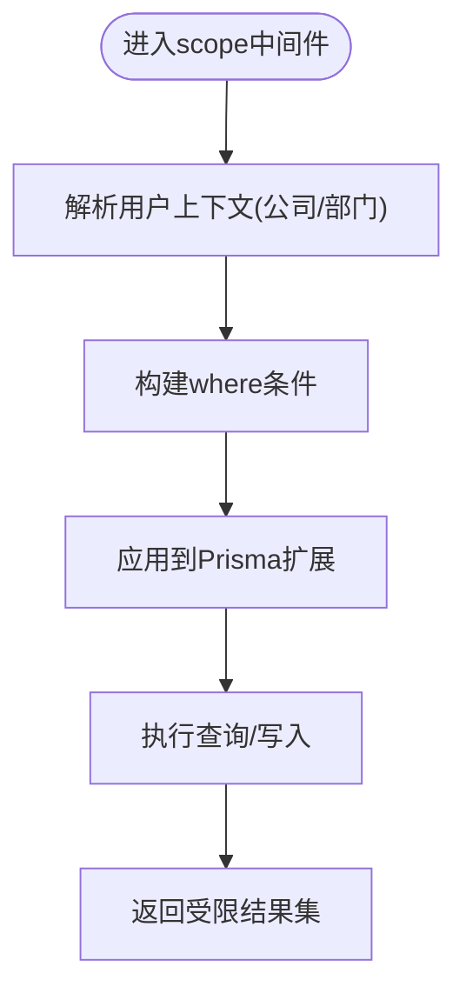
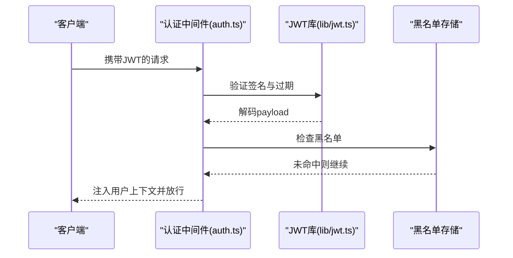
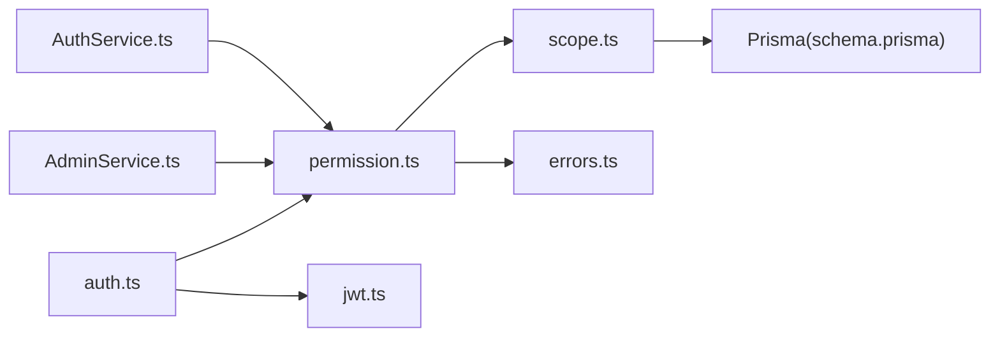

# 权限中间件

<cite>
**本文引用的文件**   
- [permission.ts](file://server/src/middleware/permission.ts)
- [scope.ts](file://server/src/middleware/scope.ts)
- [auth.ts](file://server/src/middleware/auth.ts)
- [app.ts](file://server/src/app.ts)
- [schema.prisma](file://server/prisma/schema.prisma)
- [20260724120000_remove_business_unit_org_scope/migration.sql](file://server/prisma/migrations/20260724120000_remove_business_unit_org_scope/migration.sql)
- [env.ts](file://server/src/config/env.ts)
- [error-handler.ts](file://server/src/middleware/error-handler.ts)
- [audit.ts](file://server/src/middleware/audit.ts)
- [AuthService.ts](file://server/src/services/AuthService.ts)
- [AdminService.ts](file://server/src/services/AdminService.ts)
- [routes/admin.ts](file://server/src/routes/admin.ts)
- [routes/auth.ts](file://server/src/routes/auth.ts)
- [lib/jwt.ts](file://server/src/lib/jwt.ts)
- [lib/errors.ts](file://server/src/lib/errors.ts)
- [middleware/permission.test.ts](file://server/src/middleware/permission.test.ts)
- [middleware/scope.test.ts](file://server/src/middleware/scope.test.ts)
</cite>

## 目录
1. [简介](#简介)
2. [项目结构](#项目结构)
3. [核心组件](#核心组件)
4. [架构总览](#架构总览)
5. [详细组件分析](#详细组件分析)
6. [依赖关系分析](#依赖关系分析)
7. [性能考虑](#性能考虑)
8. [故障排查指南](#故障排查指南)
9. [结论](#结论)
10. [附录](#附录)

## 简介
本文件面向FY200项目的权限中间件，系统性阐述RBAC模型、路由级权限校验、动态权限判断与缓存策略、数据范围过滤（公司维度隔离、部门可见性）、Prisma扩展集成、权限决策树、默认拒绝原则与权限提升防护。文档同时提供配置示例、测试要点与性能优化建议，并给出自定义权限规则的开发指南与常见问题解决方案。

## 项目结构
后端采用Express中间件链：helmet → cors → express.json → rate-limit → auth(JWT+黑名单) → permission(默认拒绝) → scope(Prisma extension) → softDelete → audit → Service → Prisma → PostgreSQL。权限相关代码主要位于server/src/middleware下的permission.ts与scope.ts，并在app.ts中按顺序注册。

图表来源
- [app.ts](file://server/src/app.ts)
- [auth.ts](file://server/src/middleware/auth.ts)
- [permission.ts](file://server/src/middleware/permission.ts)
- [scope.ts](file://server/src/middleware/scope.ts)
- [audit.ts](file://server/src/middleware/audit.ts)

章节来源
- [app.ts](file://server/src/app.ts)
- [auth.ts](file://server/src/middleware/auth.ts)
- [permission.ts](file://server/src/middleware/permission.ts)
- [scope.ts](file://server/src/middleware/scope.ts)
- [audit.ts](file://server/src/middleware/audit.ts)

## 核心组件
- RBAC模型
  - 角色定义：系统内置角色与可配置角色，角色包含一组权限标识。
  - 权限分配：用户通过角色继承权限；支持直接赋予用户权限以覆盖或补充。
  - 继承关系：角色间可存在继承层级，权限合并时遵循“最近生效优先”和“显式允许优先”。
- 权限中间件(permission.ts)
  - 路由级权限校验：在请求进入控制器前，依据路由元数据或路径约定判定所需权限。
  - 动态权限判断：结合上下文（租户/公司、部门、资源类型、操作类型）进行细粒度判断。
  - 缓存策略：对高频且稳定的权限判定结果进行短期缓存，降低重复计算开销。
- 数据范围中间件(scope.ts)
  - 公司维度隔离：所有查询自动附加公司ID过滤条件，防止跨公司数据泄露。
  - 部门数据可见性：基于用户所属部门与组织关系，限定数据行级可见范围。
  - Prisma扩展集成：通过Prisma client扩展注入where条件，确保所有查询均受约束。

章节来源
- [permission.ts](file://server/src/middleware/permission.ts)
- [scope.ts](file://server/src/middleware/scope.ts)
- [schema.prisma](file://server/prisma/schema.prisma)

## 架构总览
权限控制贯穿请求生命周期，从认证到数据访问层层把关。下图展示关键流程与组件交互。

图表来源
- [app.ts](file://server/src/app.ts)
- [auth.ts](file://server/src/middleware/auth.ts)
- [permission.ts](file://server/src/middleware/permission.ts)
- [scope.ts](file://server/src/middleware/scope.ts)
- [Audit.ts](file://server/src/middleware/audit.ts)

## 详细组件分析

### RBAC模型与权限决策树
- 角色与权限
  - 角色：系统管理员、财务主管、普通员工等，每个角色绑定若干权限标识。
  - 权限标识：按资源与动作划分，如“报表:查看”、“指标:编辑”、“导入:执行”。
- 用户与角色
  - 用户可拥有多个角色，权限集合为角色权限的并集，必要时叠加用户直赋权限。
- 权限决策树
  - 入口：路由元数据声明所需权限。
  - 判定：检查用户是否具备该权限；若否，检查是否有更高权限角色或显式授权。
  - 默认拒绝：未明确允许的访问一律拒绝。
  - 防提升：禁止通过参数篡改或越权调用实现权限提升。

章节来源
- [permission.ts](file://server/src/middleware/permission.ts)
- [AuthService.ts](file://server/src/services/AuthService.ts)
- [AdminService.ts](file://server/src/services/AdminService.ts)

### 权限中间件(permission.ts)实现要点
- 路由级权限校验
  - 通过路由元数据或路径约定获取所需权限标识。
  - 校验用户上下文中的角色与权限集合，决定是否放行。
- 动态权限判断
  - 结合上下文变量（公司ID、部门ID、资源类型、操作类型）进行细粒度判断。
  - 支持条件表达式与白名单机制，避免硬编码分支。
- 缓存策略
  - 对稳定判定结果进行短期缓存（内存），键由用户ID、公司ID、资源与动作组成。
  - 设置过期时间，保证一致性；在角色变更或权限更新时主动失效。

图表来源
- [permission.ts](file://server/src/middleware/permission.ts)
- [AuthService.ts](file://server/src/services/AuthService.ts)

章节来源
- [permission.ts](file://server/src/middleware/permission.ts)
- [AuthService.ts](file://server/src/services/AuthService.ts)

### 数据范围中间件(scope.ts)与Prisma扩展
- 公司维度隔离
  - 所有查询自动附加公司ID过滤条件，确保跨公司数据不可见。
- 部门数据可见性
  - 根据用户部门与组织关系，限定数据行级可见范围。
- Prisma扩展集成
  - 通过Prisma client扩展注入where条件，拦截所有查询与写入。
  - 扩展点包括findMany、findUnique、create、update、delete等。

图表来源
- [scope.ts](file://server/src/middleware/scope.ts)
- [schema.prisma](file://server/prisma/schema.prisma)

章节来源
- [scope.ts](file://server/src/middleware/scope.ts)
- [schema.prisma](file://server/prisma/schema.prisma)

### 认证与权限联动(auth.ts)
- JWT鉴权
  - access token有效期短，refresh token轮转，保障会话安全。
- 黑名单管理
  - 登出或强制下线时将token加入黑名单，后续请求被拒绝。
- 用户上下文注入
  - 认证通过后，将用户ID、角色、权限集合注入req.user，供后续中间件使用。

图表来源
- [auth.ts](file://server/src/middleware/auth.ts)
- [lib/jwt.ts](file://server/src/lib/jwt.ts)

章节来源
- [auth.ts](file://server/src/middleware/auth.ts)
- [lib/jwt.ts](file://server/src/lib/jwt.ts)

### 路由与权限配置示例
- 路由级权限声明
  - 在路由文件中声明所需权限标识，例如“报表:查看”、“指标:编辑”。
  - 中间件在请求进入控制器前校验权限。
- 权限配置项
  - 环境变量或配置文件定义默认拒绝策略、缓存TTL、角色映射表等。

章节来源
- [routes/admin.ts](file://server/src/routes/admin.ts)
- [routes/auth.ts](file://server/src/routes/auth.ts)
- [env.ts](file://server/src/config/env.ts)

### 权限提升防护与默认拒绝原则
- 默认拒绝
  - 未明确允许的访问一律拒绝，减少误配风险。
- 权限提升防护
  - 禁止通过参数篡改实现越权；服务端严格校验资源归属与用户上下文。
  - 对敏感操作增加二次确认或审批流。

章节来源
- [permission.ts](file://server/src/middleware/permission.ts)
- [lib/errors.ts](file://server/src/lib/errors.ts)

## 依赖关系分析
- 中间件依赖
  - permission依赖auth提供的用户上下文与权限集合。
  - scope依赖Prisma扩展与用户上下文中的公司/部门信息。
- 服务层依赖
  - AuthService负责用户角色与权限聚合。
  - AdminService用于管理角色与权限配置。
- 外部依赖
  - JWT库用于令牌验证与黑名单检查。
  - Prisma作为ORM，扩展注入数据范围条件。

图表来源
- [auth.ts](file://server/src/middleware/auth.ts)
- [permission.ts](file://server/src/middleware/permission.ts)
- [scope.ts](file://server/src/middleware/scope.ts)
- [schema.prisma](file://server/prisma/schema.prisma)
- [lib/jwt.ts](file://server/src/lib/jwt.ts)
- [lib/errors.ts](file://server/src/lib/errors.ts)
- [AuthService.ts](file://server/src/services/AuthService.ts)
- [AdminService.ts](file://server/src/services/AdminService.ts)

章节来源
- [auth.ts](file://server/src/middleware/auth.ts)
- [permission.ts](file://server/src/middleware/permission.ts)
- [scope.ts](file://server/src/middleware/scope.ts)
- [schema.prisma](file://server/prisma/schema.prisma)
- [lib/jwt.ts](file://server/src/lib/jwt.ts)
- [lib/errors.ts](file://server/src/lib/errors.ts)
- [AuthService.ts](file://server/src/services/AuthService.ts)
- [AdminService.ts](file://server/src/services/AdminService.ts)

## 性能考虑
- 缓存策略
  - 权限判定结果短期缓存，键包含用户、公司与资源动作，TTL合理设置。
  - 角色或权限变更时主动失效缓存，保证一致性。
- 查询优化
  - Prisma扩展仅在必要作用域注入where条件，避免全表扫描。
  - 合理使用索引（公司ID、部门ID、资源类型）。
- 中间件链优化
  - 将高频校验前置，减少不必要的下游处理。
  - 对静态配置进行预加载，避免每次请求重复解析。

[本节为通用指导，不直接分析具体文件]

## 故障排查指南
- 常见错误
  - 401未认证：JWT无效或已过期，检查令牌签发与刷新流程。
  - 403无权限：路由权限缺失或缓存未更新，检查角色与权限配置。
  - 数据为空：scope过滤过严或上下文缺失，检查公司/部门注入是否正确。
- 定位步骤
  - 启用审计日志，记录请求上下文与权限判定结果。
  - 检查错误处理器输出，定位异常堆栈与错误码。
  - 验证Prisma扩展是否成功注入where条件。

章节来源
- [error-handler.ts](file://server/src/middleware/error-handler.ts)
- [audit.ts](file://server/src/middleware/audit.ts)
- [lib/errors.ts](file://server/src/lib/errors.ts)

## 结论
FY200权限中间件以RBAC为核心，结合路由级校验、动态判断与缓存策略，配合scope的数据范围过滤与Prisma扩展，形成端到端的安全访问控制。默认拒绝原则与权限提升防护确保最小权限与安全边界。通过合理的配置与测试，可在复杂组织场景下实现高效、可靠的权限控制。

## 附录

### 权限配置示例
- 环境变量
  - 默认拒绝策略开关、缓存TTL、角色映射表等。
- 路由权限声明
  - 在路由文件中声明所需权限标识，便于中间件校验。

章节来源
- [env.ts](file://server/src/config/env.ts)
- [routes/admin.ts](file://server/src/routes/admin.ts)
- [routes/auth.ts](file://server/src/routes/auth.ts)

### 测试用例要点
- 权限中间件测试
  - 覆盖有权限、无权限、缓存命中、缓存失效等场景。
- 数据范围测试
  - 覆盖公司隔离、部门可见性、Prisma扩展注入正确性。

章节来源
- [middleware/permission.test.ts](file://server/src/middleware/permission.test.ts)
- [middleware/scope.test.ts](file://server/src/middleware/scope.test.ts)

### 自定义权限规则开发指南
- 新增权限标识
  - 在权限配置中定义新标识，并在路由中声明。
- 动态判断逻辑
  - 在permission中间件中扩展判断函数，结合上下文变量。
- 缓存键设计
  - 确保缓存键唯一且稳定，避免冲突与污染。
- 测试与回归
  - 编写单元测试与集成测试，覆盖边界条件。

章节来源
- [permission.ts](file://server/src/middleware/permission.ts)
- [env.ts](file://server/src/config/env.ts)

### 数据迁移与兼容性
- 移除业务单元组织范围
  - 迁移脚本清理历史字段，确保权限与范围逻辑一致。

章节来源
- [20260724120000_remove_business_unit_org_scope/migration.sql](file://server/prisma/migrations/20260724120000_remove_business_unit_org_scope/migration.sql)