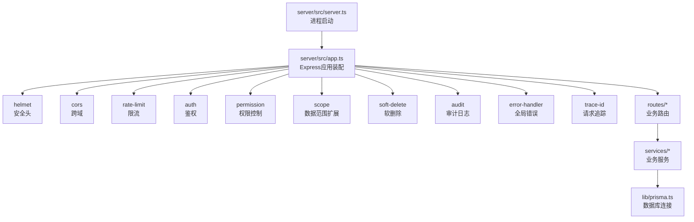
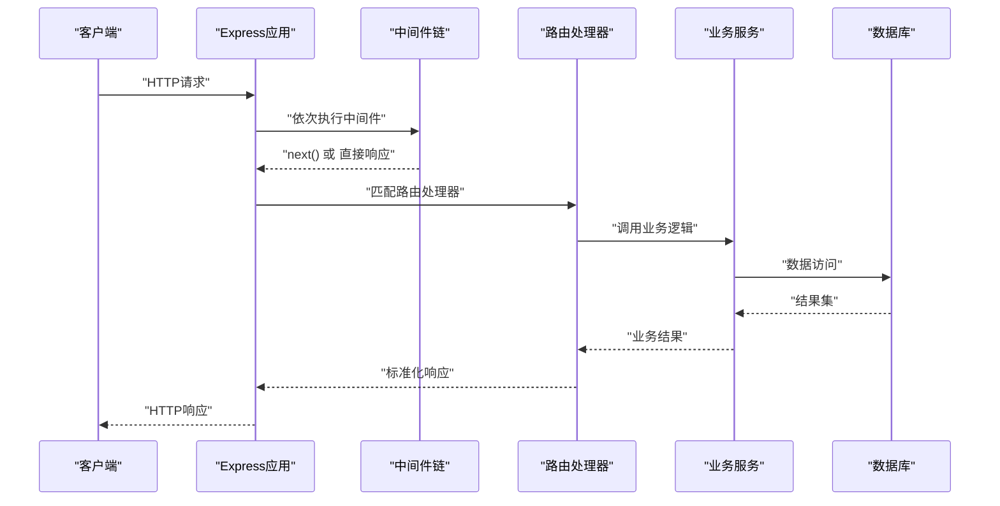
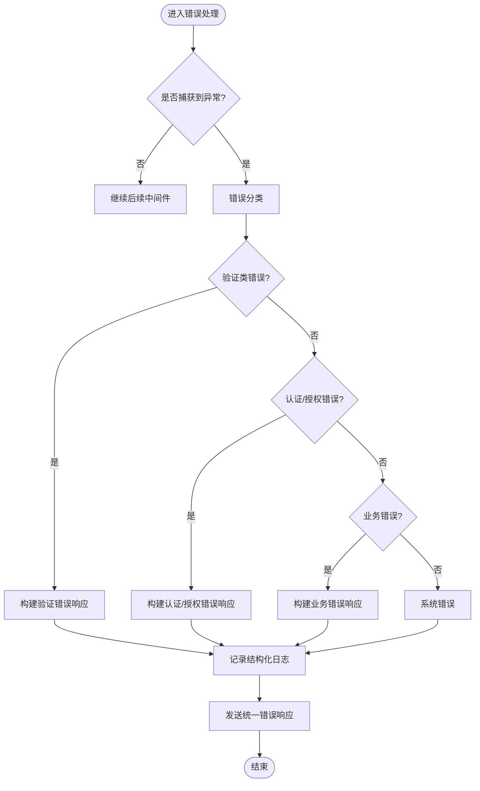
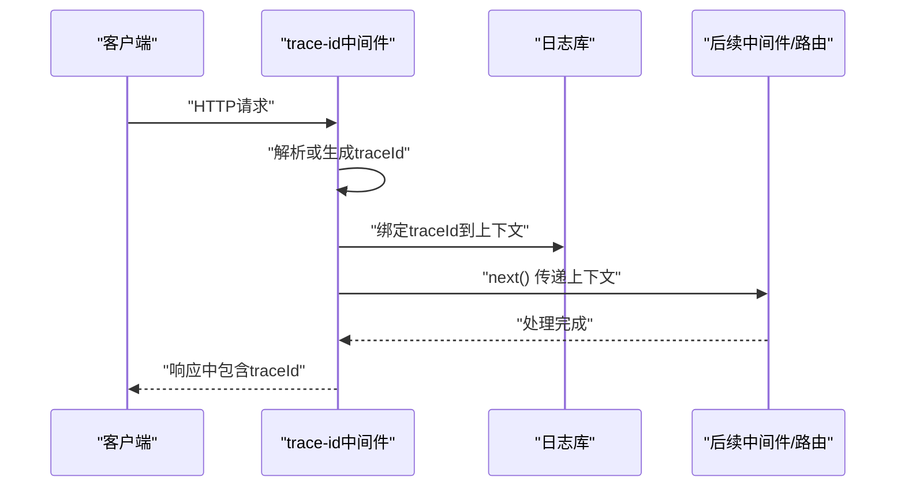
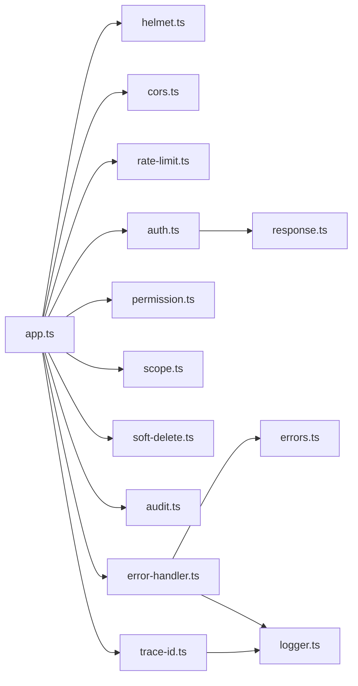

# 自定义中间件开发

<cite>
**本文引用的文件**   
- [server/src/app.ts](file://server/src/app.ts)
- [server/src/server.ts](file://server/src/server.ts)
- [server/src/middleware/error-handler.ts](file://server/src/middleware/error-handler.ts)
- [server/src/middleware/trace-id.ts](file://server/src/middleware/trace-id.ts)
- [server/src/middleware/auth.ts](file://server/src/middleware/auth.ts)
- [server/src/middleware/permission.ts](file://server/src/middleware/permission.ts)
- [server/src/middleware/scope.ts](file://server/src/middleware/scope.ts)
- [server/src/middleware/soft-delete.ts](file://server/src/middleware/soft-delete.ts)
- [server/src/middleware/audit.ts](file://server/src/middleware/audit.ts)
- [server/src/middleware/rate-limit.ts](file://server/src/middleware/rate-limit.ts)
- [server/src/middleware/cors.ts](file://server/src/middleware/cors.ts)
- [server/src/middleware/helmet.ts](file://server/src/middleware/helmet.ts)
- [server/src/lib/errors.ts](file://server/src/lib/errors.ts)
- [server/src/lib/logger.ts](file://server/src/lib/logger.ts)
- [server/src/lib/response.ts](file://server/src/lib/response.ts)
- [server/src/lib/async-handler.ts](file://server/src/lib/async-handler.ts)
- [server/src/types/express.d.ts](file://server/src/types/express.d.ts)
</cite>

## 目录
1. [简介](#简介)
2. [项目结构](#项目结构)
3. [核心组件](#核心组件)
4. [架构总览](#架构总览)
5. [详细组件分析](#详细组件分析)
6. [依赖关系分析](#依赖关系分析)
7. [性能考量](#性能考量)
8. [故障排查指南](#故障排查指南)
9. [结论](#结论)
10. [附录](#附录)

## 简介
本文件面向FY200项目的后端中间件开发者，系统化阐述自定义中间件的规范与最佳实践。内容涵盖：
- 中间件函数签名、参数约定与返回值格式
- 错误处理中间件的实现要点（全局异常捕获、错误分类、用户友好提示）
- trace-id追踪机制（请求链路跟踪、分布式日志关联、性能分析）
- 中间件生命周期管理、资源清理与内存泄漏防护
- 中间件测试策略、Mock数据与单元测试编写
- 完整开发模板、调试技巧与性能监控集成指南

项目采用Express 4，中间件执行链顺序为：helmet → cors → express.json → rate-limit → auth(JWT+黑名单) → permission(默认拒绝) → scope(Prisma extension) → softDelete → audit → Service → Prisma → PostgreSQL。所有中间件需遵循统一的类型定义与响应封装，确保可观测性与一致性。

## 项目结构
中间件位于 server/src/middleware 目录，按职责拆分；通用能力集中在 server/src/lib；应用装配在 server/src/app.ts，服务启动在 server/src/server.ts。类型扩展在 server/src/types/express.d.ts。

图表来源
- [server/src/server.ts](file://server/src/server.ts)
- [server/src/app.ts](file://server/src/app.ts)

章节来源
- [server/src/app.ts](file://server/src/app.ts)
- [server/src/server.ts](file://server/src/server.ts)

## 核心组件
- 错误处理中间件：统一捕获未处理异常与异步错误，分类并输出用户友好的响应体，记录结构化日志。
- Trace-ID中间件：为每个请求生成或透传唯一标识，注入上下文，贯穿日志与指标。
- 鉴权与权限：JWT校验、黑名单检查、基于角色的访问控制。
- 数据范围与软删除：通过Prisma扩展注入租户/组织范围过滤与软删除条件。
- 审计与限流：记录关键操作、限制请求频率。
- 安全与跨域：设置安全响应头、配置CORS。

章节来源
- [server/src/middleware/error-handler.ts](file://server/src/middleware/error-handler.ts)
- [server/src/middleware/trace-id.ts](file://server/src/middleware/trace-id.ts)
- [server/src/middleware/auth.ts](file://server/src/middleware/auth.ts)
- [server/src/middleware/permission.ts](file://server/src/middleware/permission.ts)
- [server/src/middleware/scope.ts](file://server/src/middleware/scope.ts)
- [server/src/middleware/soft-delete.ts](file://server/src/middleware/soft-delete.ts)
- [server/src/middleware/audit.ts](file://server/src/middleware/audit.ts)
- [server/src/middleware/rate-limit.ts](file://server/src/middleware/rate-limit.ts)
- [server/src/middleware/cors.ts](file://server/src/middleware/cors.ts)
- [server/src/middleware/helmet.ts](file://server/src/middleware/helmet.ts)

## 架构总览
下图展示请求从进入Express到返回响应的完整链路，以及中间件之间的调用顺序与关注点。

图表来源
- [server/src/app.ts](file://server/src/app.ts)
- [server/src/lib/response.ts](file://server/src/lib/response.ts)

## 详细组件分析

### 中间件开发规范（函数签名、参数约定、返回值）
- 函数签名
  - 标准形式：(req, res, next) => void
  - 异步支持：使用 async/await 时，建议通过统一包装器捕获异常，避免未处理的Promise拒绝。
- 参数约定
  - req：请求对象，包含headers、body、params、query等；可在req上挂载上下文信息（如traceId、用户信息、权限集合）。
  - res：响应对象，提供统一响应方法（如sendSuccess/sendError），保持返回体一致。
  - next：回调函数，用于将控制权交给下一个中间件或路由处理器；发生错误时应调用 next(err)。
- 返回值格式
  - 成功：使用统一响应封装，包含状态码、消息、数据体等字段。
  - 失败：抛出错误或调用 next(err)，由全局错误处理中间件统一处理。
- 注意事项
  - 不要阻塞事件循环，避免同步I/O。
  - 及时释放资源（如定时器、临时文件句柄）。
  - 对输入进行严格校验，防止注入与越权。

章节来源
- [server/src/lib/async-handler.ts](file://server/src/lib/async-handler.ts)
- [server/src/lib/response.ts](file://server/src/lib/response.ts)
- [server/src/types/express.d.ts](file://server/src/types/express.d.ts)

### 错误处理中间件（全局异常捕获、错误分类、用户友好提示）
- 全局异常捕获
  - 捕获未处理的同步/异步异常，避免进程崩溃。
  - 区分系统级错误与业务级错误，分别记录不同级别日志。
- 错误分类
  - 验证错误：参数缺失、格式错误、约束不满足。
  - 认证/授权错误：令牌无效、过期、权限不足。
  - 业务错误：规则冲突、状态非法、外部依赖失败。
  - 系统错误：数据库连接失败、第三方API超时。
- 用户友好提示
  - 对外仅暴露必要信息，避免泄露内部堆栈与敏感细节。
  - 提供可操作的错误码与消息，便于前端引导修复。
- 日志与追踪
  - 记录结构化日志，包含traceId、请求路径、方法、耗时、错误类别。
  - 结合指标上报，统计错误率与慢请求。

图表来源
- [server/src/middleware/error-handler.ts](file://server/src/middleware/error-handler.ts)
- [server/src/lib/errors.ts](file://server/src/lib/errors.ts)
- [server/src/lib/response.ts](file://server/src/lib/response.ts)

章节来源
- [server/src/middleware/error-handler.ts](file://server/src/middleware/error-handler.ts)
- [server/src/lib/errors.ts](file://server/src/lib/errors.ts)
- [server/src/lib/response.ts](file://server/src/lib/response.ts)

### Trace-ID追踪机制（请求链路跟踪、分布式日志关联、性能分析）
- 生成与透传
  - 若请求头已携带traceId则复用，否则生成唯一ID。
  - 将traceId写入响应头，便于客户端与下游服务关联。
- 上下文注入
  - 在req上挂载traceId，供后续中间件与日志库使用。
  - 与logger绑定，使所有日志自动包含traceId。
- 性能分析
  - 记录请求开始时间，计算耗时，上报指标。
  - 对慢请求进行采样与告警。
- 分布式关联
  - 在调用外部服务时透传traceId，保证跨服务链路可追溯。

图表来源
- [server/src/middleware/trace-id.ts](file://server/src/middleware/trace-id.ts)
- [server/src/lib/logger.ts](file://server/src/lib/logger.ts)

章节来源
- [server/src/middleware/trace-id.ts](file://server/src/middleware/trace-id.ts)
- [server/src/lib/logger.ts](file://server/src/lib/logger.ts)

### 鉴权与权限（auth与permission）
- 鉴权（auth）
  - 校验JWT有效性、黑名单检查、令牌轮转。
  - 将用户信息注入req.user，供后续中间件使用。
- 权限（permission）
  - 基于角色或资源的访问控制，默认拒绝，白名单放行。
  - 支持细粒度权限校验，避免越权访问。

章节来源
- [server/src/middleware/auth.ts](file://server/src/middleware/auth.ts)
- [server/src/middleware/permission.ts](file://server/src/middleware/permission.ts)

### 数据范围与软删除（scope与soft-delete）
- 数据范围（scope）
  - 通过Prisma扩展注入组织/租户范围过滤条件。
  - 确保多租户数据隔离。
- 软删除（soft-delete）
  - 查询与更新时自动附加deletedAt条件。
  - 避免物理删除导致的数据丢失。

章节来源
- [server/src/middleware/scope.ts](file://server/src/middleware/scope.ts)
- [server/src/middleware/soft-delete.ts](file://server/src/middleware/soft-delete.ts)

### 审计与限流（audit与rate-limit）
- 审计（audit）
  - 记录关键操作（增删改）、操作人、IP、时间戳。
  - 支持敏感字段脱敏与摘要存储。
- 限流（rate-limit）
  - 基于IP或用户维度限制请求频率。
  - 超限返回429，并记录告警日志。

章节来源
- [server/src/middleware/audit.ts](file://server/src/middleware/audit.ts)
- [server/src/middleware/rate-limit.ts](file://server/src/middleware/rate-limit.ts)

### 安全与跨域（helmet与cors）
- Helmet
  - 设置安全响应头（X-Frame-Options、Content-Security-Policy等）。
- CORS
  - 配置允许的源、方法、头部与凭据。

章节来源
- [server/src/middleware/helmet.ts](file://server/src/middleware/helmet.ts)
- [server/src/middleware/cors.ts](file://server/src/middleware/cors.ts)

## 依赖关系分析
中间件之间通过Express的next机制串联，形成清晰的依赖链。关键依赖包括：
- 统一响应封装（response.ts）
- 异步错误包装（async-handler.ts）
- 日志与追踪（logger.ts、trace-id.ts）
- 错误分类（errors.ts）
- 类型扩展（express.d.ts）

图表来源
- [server/src/app.ts](file://server/src/app.ts)
- [server/src/lib/response.ts](file://server/src/lib/response.ts)
- [server/src/lib/errors.ts](file://server/src/lib/errors.ts)
- [server/src/lib/logger.ts](file://server/src/lib/logger.ts)

章节来源
- [server/src/app.ts](file://server/src/app.ts)

## 性能考量
- 避免阻塞事件循环：所有I/O操作必须异步化，禁止同步阻塞调用。
- 减少中间件数量：仅在必要时启用中间件，合理分组与按需加载。
- 缓存热点数据：对频繁读取的配置或字典进行内存缓存，注意失效策略。
- 指标与采样：对慢请求与错误进行采样上报，避免全量采集造成开销。
- 资源清理：及时释放定时器、文件句柄、数据库连接等资源，防止内存泄漏。

[本节为通用指导，不直接分析具体文件]

## 故障排查指南
- 定位问题
  - 通过traceId在日志系统中检索完整请求链路。
  - 查看错误分类与堆栈，区分业务错误与系统错误。
- 常见问题
  - JWT校验失败：检查令牌有效期、签名与黑名单。
  - 权限不足：确认角色与资源映射是否正确。
  - 数据库连接失败：检查连接池、网络与权限。
- 调试技巧
  - 启用详细日志级别，但生产环境谨慎开启。
  - 使用Mock数据与沙箱环境复现问题。
  - 结合APM工具进行链路追踪与性能分析。

章节来源
- [server/src/middleware/error-handler.ts](file://server/src/middleware/error-handler.ts)
- [server/src/lib/logger.ts](file://server/src/lib/logger.ts)
- [server/src/lib/errors.ts](file://server/src/lib/errors.ts)

## 结论
通过统一的中间件规范、完善的错误处理与追踪机制，FY200项目实现了高内聚、低耦合的后端架构。开发者应遵循本文档的约定，确保新增中间件与现有体系无缝集成，提升系统的可维护性、可观测性与稳定性。

[本节为总结性内容，不直接分析具体文件]

## 附录
- 中间件开发模板
  - 函数签名：(req, res, next) => void
  - 输入校验：严格校验req.body、req.params、req.query
  - 上下文注入：在req上挂载必要信息（如traceId、用户信息）
  - 错误处理：抛出错误或调用next(err)，由全局错误处理中间件统一处理
  - 资源清理：确保finally块中释放资源
- 测试策略
  - 单元测试：覆盖正常流程与边界条件，使用Mock数据隔离外部依赖
  - 集成测试：模拟真实请求链路，验证中间件组合效果
  - 性能测试：压测关键路径，识别瓶颈与优化点
- 调试技巧
  - 使用console.log与结构化日志结合，快速定位问题
  - 借助浏览器开发者工具与Postman进行接口调试
  - 结合APM工具进行链路追踪与性能分析

[本节为补充说明，不直接分析具体文件]