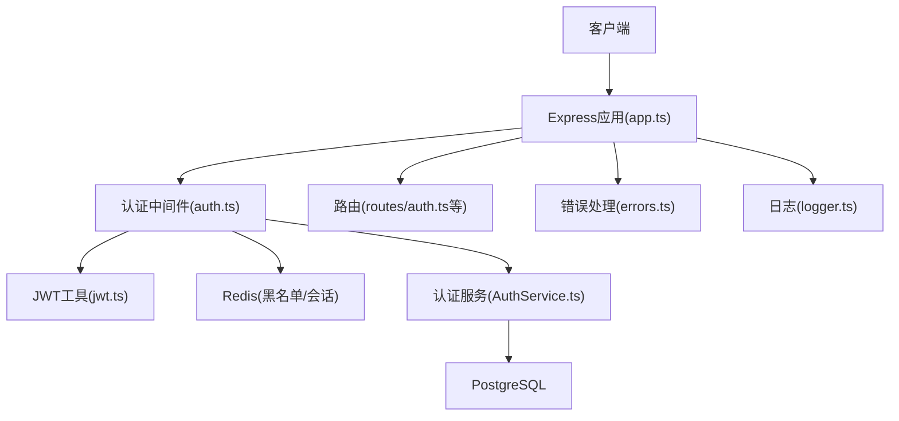
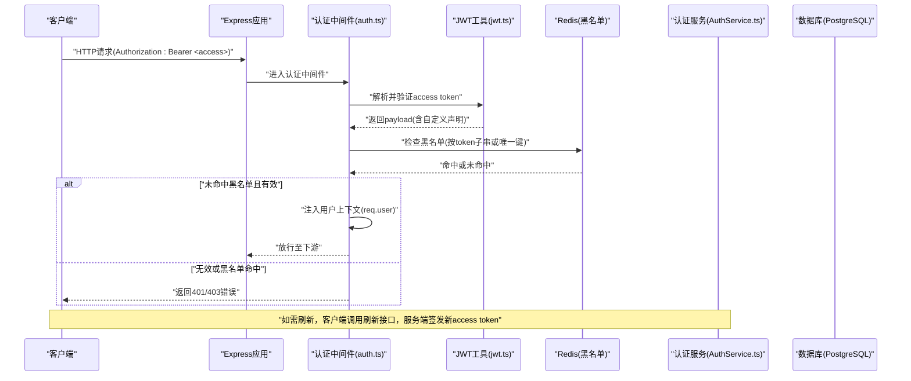
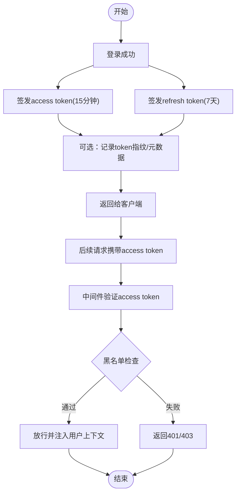
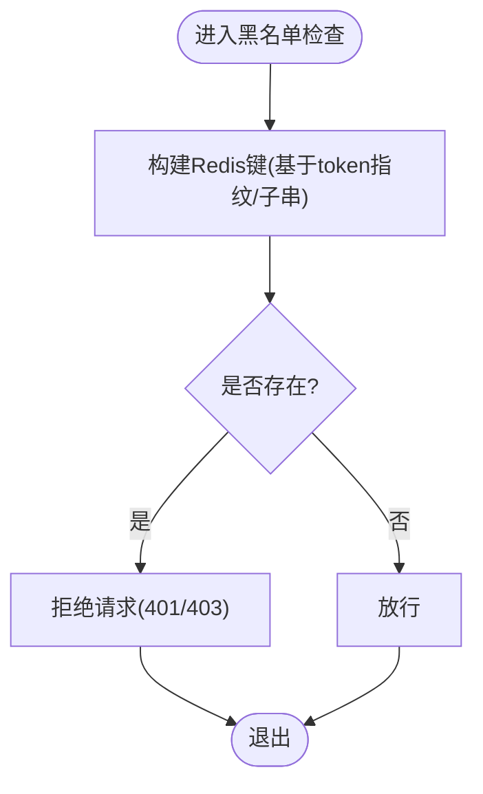
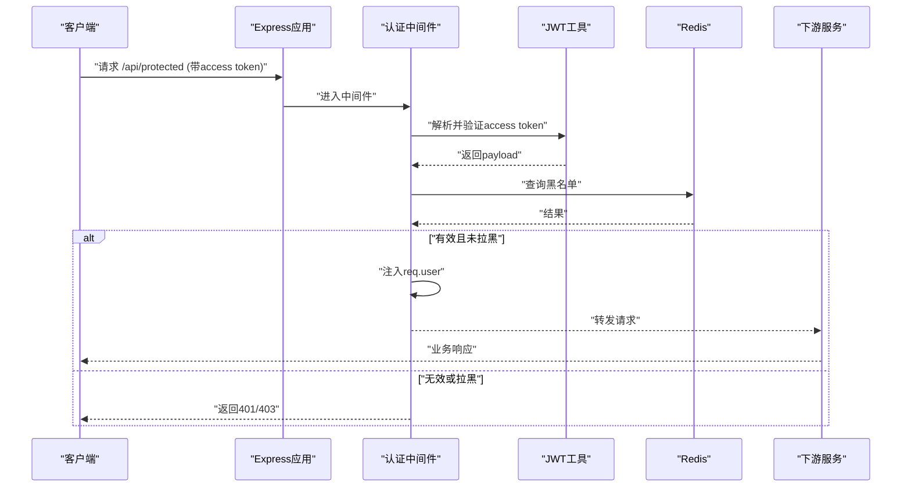
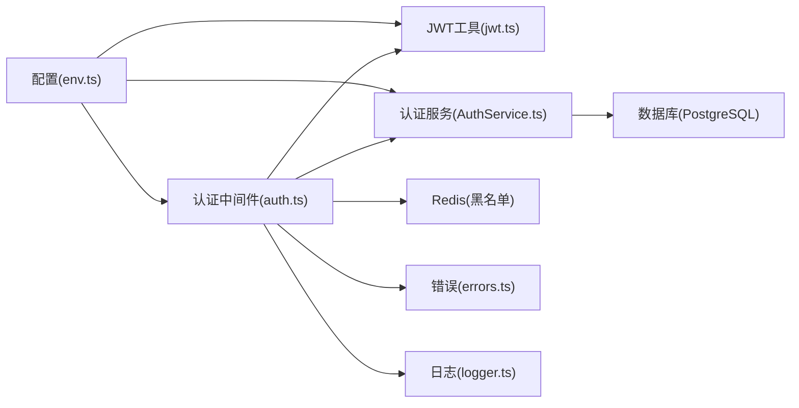

# 认证中间件

<cite>
**本文引用的文件**   
- [server/src/middleware/auth.ts](file://server/src/middleware/auth.ts)
- [server/src/lib/jwt.ts](file://server/src/lib/jwt.ts)
- [server/src/services/AuthService.ts](file://server/src/services/AuthService.ts)
- [server/src/routes/auth.ts](file://server/src/routes/auth.ts)
- [server/src/config/env.ts](file://server/src/config/env.ts)
- [server/src/lib/errors.ts](file://server/src/lib/errors.ts)
- [server/src/lib/logger.ts](file://server/src/lib/logger.ts)
- [server/src/app.ts](file://server/src/app.ts)
</cite>

## 目录
1. [简介](#简介)
2. [项目结构](#项目结构)
3. [核心组件](#核心组件)
4. [架构总览](#架构总览)
5. [详细组件分析](#详细组件分析)
6. [依赖关系分析](#依赖关系分析)
7. [性能考量](#性能考量)
8. [故障排查指南](#故障排查指南)
9. [结论](#结论)
10. [附录](#附录)

## 简介
本文件面向FY200项目的认证中间件，系统性阐述JWT双令牌机制（access token 15分钟、refresh token 7天）的生成、验证与轮转策略；说明token黑名单检查机制（Redis存储、过期清理、并发访问控制）；梳理认证流程（请求拦截、token解析、用户信息注入与会话管理）；解释自定义声明的添加与校验、多租户支持与企微集成要点；并给出认证失败处理、错误码定义、调试日志记录以及客户端集成示例与安全最佳实践。

## 项目结构
后端采用Express中间件链：helmet → cors → express.json → rate-limit → auth(JWT+黑名单) → permission(默认拒绝) → scope(Prisma扩展) → softDelete → audit → Service → Prisma → PostgreSQL。认证中间件位于middleware层，JWT工具在lib层，认证服务在services层，路由在routes层，配置在config层，错误与日志分别在lib/errors.ts与lib/logger.ts中统一处理。

图表来源
- [server/src/app.ts](file://server/src/app.ts)
- [server/src/middleware/auth.ts](file://server/src/middleware/auth.ts)
- [server/src/lib/jwt.ts](file://server/src/lib/jwt.ts)
- [server/src/services/AuthService.ts](file://server/src/services/AuthService.ts)
- [server/src/routes/auth.ts](file://server/src/routes/auth.ts)
- [server/src/config/env.ts](file://server/src/config/env.ts)
- [server/src/lib/errors.ts](file://server/src/lib/errors.ts)
- [server/src/lib/logger.ts](file://server/src/lib/logger.ts)

章节来源
- [server/src/app.ts](file://server/src/app.ts)
- [server/src/middleware/auth.ts](file://server/src/middleware/auth.ts)
- [server/src/lib/jwt.ts](file://server/src/lib/jwt.ts)
- [server/src/services/AuthService.ts](file://server/src/services/AuthService.ts)
- [server/src/routes/auth.ts](file://server/src/routes/auth.ts)
- [server/src/config/env.ts](file://server/src/config/env.ts)
- [server/src/lib/errors.ts](file://server/src/lib/errors.ts)
- [server/src/lib/logger.ts](file://server/src/lib/logger.ts)

## 核心组件
- 认证中间件(auth.ts)
  - 职责：请求拦截、鉴权入口、token解析与校验、黑名单检查、用户上下文注入、刷新token逻辑触发点。
  - 关键点：从请求头提取Authorization Bearer；解析JWT；校验签名与有效期；查询Redis黑名单；将用户信息挂载到req对象供下游使用。
- JWT工具(jwt.ts)
  - 职责：签发access token与refresh token；解析与验证；自定义声明注入；密钥管理与算法选择。
  - 关键点：access token短时效（约15分钟），refresh token长时效（约7天）；支持自定义字段（如租户ID、角色、权限集合）。
- 认证服务(AuthService.ts)
  - 职责：登录凭证校验、用户信息查询、令牌签发与刷新、黑名单操作封装、企业微信授权对接。
  - 关键点：与数据库交互获取用户；与Redis交互维护黑名单；对外暴露统一的认证能力。
- 认证路由(routes/auth.ts)
  - 职责：提供登录、登出、刷新token等HTTP端点；接收并返回标准JSON响应。
- 配置(env.ts)
  - 职责：集中管理JWT密钥、过期时间、Redis连接、企业微信参数等环境变量。
- 错误与日志(errors.ts, logger.ts)
  - 职责：统一错误码与异常类型；结构化日志输出，便于追踪与排障。

章节来源
- [server/src/middleware/auth.ts](file://server/src/middleware/auth.ts)
- [server/src/lib/jwt.ts](file://server/src/lib/jwt.ts)
- [server/src/services/AuthService.ts](file://server/src/services/AuthService.ts)
- [server/src/routes/auth.ts](file://server/src/routes/auth.ts)
- [server/src/config/env.ts](file://server/src/config/env.ts)
- [server/src/lib/errors.ts](file://server/src/lib/errors.ts)
- [server/src/lib/logger.ts](file://server/src/lib/logger.ts)

## 架构总览
下图展示一次受保护API请求的完整认证链路：客户端携带access token进入auth中间件，中间件解析并校验JWT，检查Redis黑名单，通过后注入用户上下文，再交由下游业务处理。若access token即将过期或已失效，客户端应使用refresh token刷新。

图表来源
- [server/src/app.ts](file://server/src/app.ts)
- [server/src/middleware/auth.ts](file://server/src/middleware/auth.ts)
- [server/src/lib/jwt.ts](file://server/src/lib/jwt.ts)
- [server/src/services/AuthService.ts](file://server/src/services/AuthService.ts)

## 详细组件分析

### JWT双令牌机制（access 15min + refresh 7day）
- 签发流程
  - 登录成功后，服务端根据用户信息与自定义声明签发access token（短期）与refresh token（长期）。
  - access token用于快速鉴权，refresh token用于安全地续期。
- 验证流程
  - 每次请求由auth中间件解析access token，校验签名与有效期。
  - 同时检查Redis黑名单，确保被吊销的token立即失效。
- 轮转策略
  - 当access token接近过期或已过期时，客户端使用refresh token调用刷新接口。
  - 服务端验证refresh token后，签发新的access token，并可按需轮换refresh token以增强安全性。
- 自定义声明
  - 在JWT payload中加入租户ID、角色、权限集合等，便于后续权限与多租户隔离。
  - 中间件或下游服务读取这些声明进行细粒度控制。

图表来源
- [server/src/lib/jwt.ts](file://server/src/lib/jwt.ts)
- [server/src/services/AuthService.ts](file://server/src/services/AuthService.ts)
- [server/src/middleware/auth.ts](file://server/src/middleware/auth.ts)

章节来源
- [server/src/lib/jwt.ts](file://server/src/lib/jwt.ts)
- [server/src/services/AuthService.ts](file://server/src/services/AuthService.ts)
- [server/src/middleware/auth.ts](file://server/src/middleware/auth.ts)

### Token黑名单检查机制（Redis存储、过期清理、并发控制）
- 存储设计
  - 使用Redis作为黑名单存储，键名建议包含token指纹或子串，值可包含吊销原因与时间戳。
  - 为提升检索效率，可设置合理的TTL与索引键。
- 过期清理
  - 利用Redis TTL自动过期；必要时配合定时任务清理历史条目，避免内存膨胀。
- 并发访问控制
  - 使用Redis原子操作（如SETNX）保证并发下黑名单写入的一致性。
  - 在高并发场景下，对黑名单查询做本地缓存（短TTL）以降低Redis压力。
- 校验流程
  - 中间件在解析JWT后立即查询黑名单；命中则直接拒绝请求。

图表来源
- [server/src/middleware/auth.ts](file://server/src/middleware/auth.ts)
- [server/src/services/AuthService.ts](file://server/src/services/AuthService.ts)

章节来源
- [server/src/middleware/auth.ts](file://server/src/middleware/auth.ts)
- [server/src/services/AuthService.ts](file://server/src/services/AuthService.ts)

### 认证流程（请求拦截、token解析、用户信息注入与会话管理）
- 请求拦截
  - 所有受保护路由均经过auth中间件；公开路由（如登录、刷新）不经过鉴权。
- token解析
  - 从Authorization头提取Bearer token，调用JWT工具解析与验证。
- 用户信息注入
  - 将用户ID、租户ID、角色、权限等挂载到req.user，供下游中间件与服务使用。
- 会话管理
  - 无状态鉴权为主；如需会话态（如设备绑定、IP白名单），可在Redis中维护轻量会话记录。

图表来源
- [server/src/middleware/auth.ts](file://server/src/middleware/auth.ts)
- [server/src/lib/jwt.ts](file://server/src/lib/jwt.ts)
- [server/src/services/AuthService.ts](file://server/src/services/AuthService.ts)

章节来源
- [server/src/middleware/auth.ts](file://server/src/middleware/auth.ts)
- [server/src/lib/jwt.ts](file://server/src/lib/jwt.ts)
- [server/src/services/AuthService.ts](file://server/src/services/AuthService.ts)

### 自定义声明的添加与验证
- 添加位置
  - 在签发JWT时，将租户ID、角色、权限集合等加入payload。
- 验证位置
  - 中间件或下游权限中间件读取声明进行校验；例如按租户隔离数据、按角色限制功能。
- 最佳实践
  - 避免在JWT中存放敏感信息；保持payload最小化；定期轮换密钥与声明结构。

章节来源
- [server/src/lib/jwt.ts](file://server/src/lib/jwt.ts)
- [server/src/middleware/auth.ts](file://server/src/middleware/auth.ts)

### 多租户支持
- 设计要点
  - 每个租户拥有独立的用户与数据域；JWT中携带tenant_id。
  - 数据访问通过scope扩展（Prisma extension）实现行级隔离。
- 实现路径
  - 中间件解析tenant_id并注入到上下文；下游服务与查询按tenant_id过滤。

章节来源
- [server/src/middleware/auth.ts](file://server/src/middleware/auth.ts)
- [server/src/lib/jwt.ts](file://server/src/lib/jwt.ts)

### 企业微信集成
- 集成方式
  - 支持通过企业微信OAuth获取用户身份，映射到系统用户并签发JWT。
- 关键步骤
  - 前端跳转企业微信授权；后端回调验证code换取用户信息；创建或关联本地用户；签发双令牌。
- 注意事项
  - 安全回调URL配置；防重放攻击；用户映射规则与冲突处理。

章节来源
- [server/src/services/AuthService.ts](file://server/src/services/AuthService.ts)
- [server/src/routes/auth.ts](file://server/src/routes/auth.ts)

### 认证失败处理、错误码定义与调试日志
- 失败场景
  - 缺少Authorization头、token格式错误、签名无效、过期、黑名单命中、用户不存在、权限不足等。
- 错误码
  - 统一在errors.ts中定义错误码与消息，便于前端处理与监控。
- 日志记录
  - 在logger.ts中记录结构化日志，包括请求ID、用户ID、错误堆栈、Redis命中率等。

章节来源
- [server/src/lib/errors.ts](file://server/src/lib/errors.ts)
- [server/src/lib/logger.ts](file://server/src/lib/logger.ts)
- [server/src/middleware/auth.ts](file://server/src/middleware/auth.ts)

### 客户端集成示例（概念性）
- 登录
  - 提交用户名密码或企业微信授权码，服务端返回access与refresh token。
- 发起请求
  - 在Authorization头携带Bearer access token。
- 刷新token
  - access过期前调用刷新接口，传入refresh token，获得新的access token。
- 登出
  - 调用登出接口，服务端将token加入黑名单（或使refresh token失效）。

[本节为概念性说明，不直接分析具体代码文件]

## 依赖关系分析
- 中间件依赖
  - auth.ts依赖jwt.ts进行令牌解析与校验；依赖AuthService进行黑名单与用户信息操作；依赖Redis进行黑名单存储。
- 服务依赖
  - AuthService依赖数据库（Prisma）与企业微信SDK（如有）。
- 配置与环境
  - env.ts集中管理JWT密钥、过期时间、Redis连接参数、企业微信配置。
- 错误与日志
  - errors.ts与logger.ts贯穿各层，保证一致的错误处理与可观测性。

图表来源
- [server/src/middleware/auth.ts](file://server/src/middleware/auth.ts)
- [server/src/lib/jwt.ts](file://server/src/lib/jwt.ts)
- [server/src/services/AuthService.ts](file://server/src/services/AuthService.ts)
- [server/src/config/env.ts](file://server/src/config/env.ts)
- [server/src/lib/errors.ts](file://server/src/lib/errors.ts)
- [server/src/lib/logger.ts](file://server/src/lib/logger.ts)

章节来源
- [server/src/middleware/auth.ts](file://server/src/middleware/auth.ts)
- [server/src/lib/jwt.ts](file://server/src/lib/jwt.ts)
- [server/src/services/AuthService.ts](file://server/src/services/AuthService.ts)
- [server/src/config/env.ts](file://server/src/config/env.ts)
- [server/src/lib/errors.ts](file://server/src/lib/errors.ts)
- [server/src/lib/logger.ts](file://server/src/lib/logger.ts)

## 性能考量
- 减少Redis往返
  - 对黑名单查询增加本地短TTL缓存，降低热点key压力。
- 令牌体积优化
  - JWT payload仅包含必要声明，避免过大导致网络开销。
- 异步与重试
  - 对非关键路径的黑名单写入采用异步；对Redis失败进行限流与降级。
- 监控指标
  - 记录JWT解析耗时、黑名单命中率、刷新成功率等关键指标。

[本节为通用指导，不直接分析具体代码文件]

## 故障排查指南
- 常见问题
  - 401未授权：检查Authorization头格式、token是否过期、是否被拉黑。
  - 403禁止访问：检查用户角色与权限声明是否正确。
  - 刷新失败：检查refresh token有效性、是否已被吊销。
- 定位方法
  - 查看结构化日志中的错误码与堆栈；核对Redis黑名单键是否存在；检查JWT密钥与算法配置。
- 修复建议
  - 修正客户端请求头；在服务端补充必要的声明；调整Redis连接与超时配置。

章节来源
- [server/src/lib/errors.ts](file://server/src/lib/errors.ts)
- [server/src/lib/logger.ts](file://server/src/lib/logger.ts)
- [server/src/middleware/auth.ts](file://server/src/middleware/auth.ts)

## 结论
FY200认证中间件通过JWT双令牌机制与Redis黑名单实现了高效、安全的无状态鉴权体系。结合自定义声明、多租户与企微集成，满足企业内部系统的复杂需求。建议在部署与运维中关注性能与可观测性，持续优化黑名单策略与令牌生命周期管理。

[本节为总结性内容，不直接分析具体代码文件]

## 附录
- 安全最佳实践
  - 使用强随机密钥与合适的算法；定期轮换密钥。
  - 严格校验JWT签名与有效期；避免在JWT中存放敏感信息。
  - 启用HTTPS；限制CORS与CSRF策略。
  - 对刷新token实施一次性使用与轮换策略。
  - 对黑名单与敏感操作进行审计与告警。

[本节为通用指导，不直接分析具体代码文件]