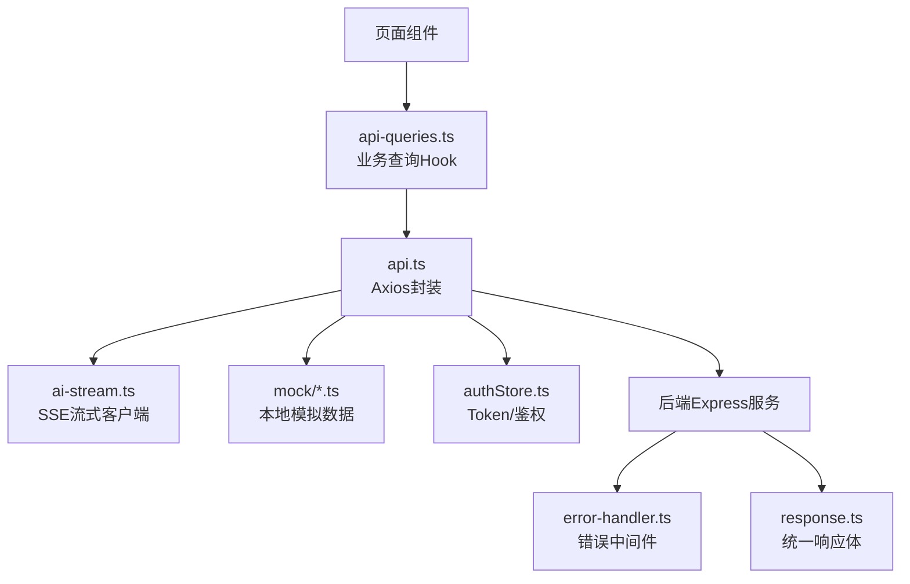
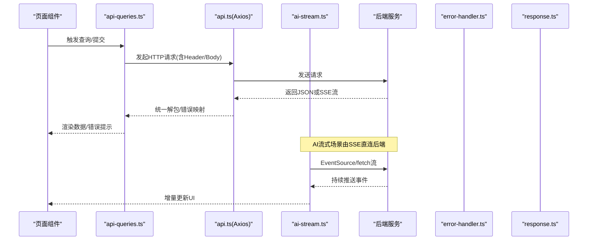
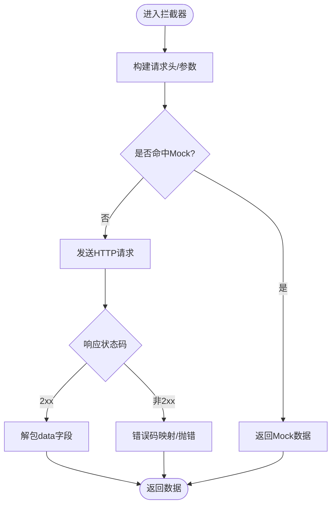
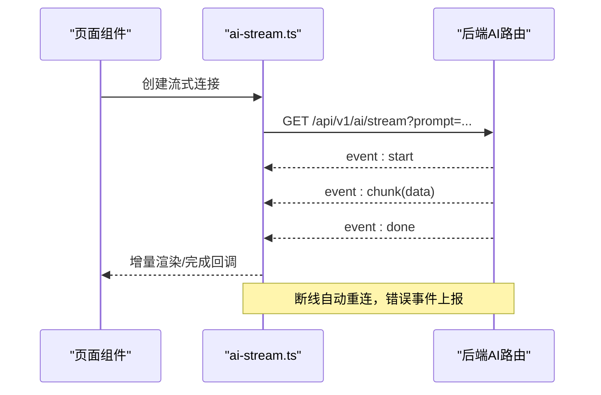
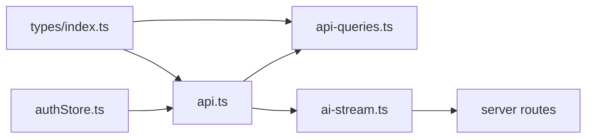

# API集成层

<cite>
**本文引用的文件**   
- [web/src/lib/api.ts](file://web/src/lib/api.ts)
- [web/src/lib/ai-stream.ts](file://web/src/lib/ai-stream.ts)
- [web/src/hooks/api-queries.ts](file://web/src/hooks/api-queries.ts)
- [web/src/mock/data.ts](file://web/src/mock/data.ts)
- [web/src/mock/static-analysis.ts](file://web/src/mock/static-analysis.ts)
- [web/src/mock/operating-analysis.ts](file://web/src/mock/operating-analysis.ts)
- [web/src/types/index.ts](file://web/src/types/index.ts)
- [web/src/stores/authStore.ts](file://web/src/stores/authStore.ts)
- [server/src/middleware/error-handler.ts](file://server/src/middleware/error-handler.ts)
- [server/src/lib/response.ts](file://server/src/lib/response.ts)
- [server/src/routes/ai.ts](file://server/src/routes/ai.ts)
</cite>

## 目录
1. [简介](#简介)
2. [项目结构](#项目结构)
3. [核心组件](#核心组件)
4. [架构总览](#架构总览)
5. [详细组件分析](#详细组件分析)
6. [依赖关系分析](#依赖关系分析)
7. [性能考量](#性能考量)
8. [故障排查指南](#故障排查指南)
9. [结论](#结论)
10. [附录](#附录)

## 简介
本文件面向FY200前端API集成，系统性阐述基于Axios的HTTP客户端封装、请求与响应拦截器、错误处理机制；RESTful调用规范（URL路径约定、参数传递格式、响应标准化）；SSE流式响应在AI功能中的实时数据传输；缓存策略、重试机制与超时处理；API版本管理、Mock数据开发与调试技巧；并提供完整接口调用示例与错误处理最佳实践。目标是帮助前后端开发者快速理解并稳定使用API层。

## 项目结构
前端API相关代码主要位于web/src/lib与web/src/hooks，以及Mock与类型定义：
- HTTP客户端与拦截器：web/src/lib/api.ts
- SSE流式客户端：web/src/lib/ai-stream.ts
- 业务查询Hook封装：web/src/hooks/api-queries.ts
- Mock数据与开关：web/src/mock/*.ts
- 统一类型定义：web/src/types/index.ts
- 认证状态存储：web/src/stores/authStore.ts

图表来源
- [web/src/lib/api.ts](file://web/src/lib/api.ts)
- [web/src/lib/ai-stream.ts](file://web/src/lib/ai-stream.ts)
- [web/src/hooks/api-queries.ts](file://web/src/hooks/api-queries.ts)
- [web/src/mock/data.ts](file://web/src/mock/data.ts)
- [web/src/types/index.ts](file://web/src/types/index.ts)
- [web/src/stores/authStore.ts](file://web/src/stores/authStore.ts)
- [server/src/middleware/error-handler.ts](file://server/src/middleware/error-handler.ts)
- [server/src/lib/response.ts](file://server/src/lib/response.ts)

章节来源
- [web/src/lib/api.ts](file://web/src/lib/api.ts)
- [web/src/lib/ai-stream.ts](file://web/src/lib/ai-stream.ts)
- [web/src/hooks/api-queries.ts](file://web/src/hooks/api-queries.ts)
- [web/src/types/index.ts](file://web/src/types/index.ts)
- [web/src/stores/authStore.ts](file://web/src/stores/authStore.ts)
- [server/src/middleware/error-handler.ts](file://server/src/middleware/error-handler.ts)
- [server/src/lib/response.ts](file://server/src/lib/response.ts)

## 核心组件
- Axios封装（api.ts）
  - 全局实例化与基础配置（baseURL、超时、Content-Type等）
  - 请求拦截器：注入Authorization头、请求ID、防重放、可选Mock开关
  - 响应拦截器：统一解包成功数据、错误码映射、消息提示、加载态控制
  - 错误分类：网络错误、服务端错误、业务错误、超时、取消
- SSE流式客户端（ai-stream.ts）
  - 建立EventSource或fetch流式读取
  - 事件解析与增量渲染
  - 断线重连与错误恢复
- 业务查询Hook（api-queries.ts）
  - 将API调用封装为React Query风格Hook
  - 内置缓存、重试、分页、排序、过滤
  - 错误边界与用户友好提示
- Mock数据（mock/*.ts）
  - 按模块组织静态数据与生成逻辑
  - 通过环境变量或运行时开关切换
- 类型定义（types/index.ts）
  - 统一响应体、分页、错误对象、AI流式事件类型
- 认证存储（authStore.ts）
  - Token存取、刷新、过期处理、黑名单校验

章节来源
- [web/src/lib/api.ts](file://web/src/lib/api.ts)
- [web/src/lib/ai-stream.ts](file://web/src/lib/ai-stream.ts)
- [web/src/hooks/api-queries.ts](file://web/src/hooks/api-queries.ts)
- [web/src/mock/data.ts](file://web/src/mock/data.ts)
- [web/src/mock/static-analysis.ts](file://web/src/mock/static-analysis.ts)
- [web/src/mock/operating-analysis.ts](file://web/src/mock/operating-analysis.ts)
- [web/src/types/index.ts](file://web/src/types/index.ts)
- [web/src/stores/authStore.ts](file://web/src/stores/authStore.ts)

## 架构总览
整体调用链路从页面组件到后端服务，贯穿拦截器、错误处理与统一响应体。

图表来源
- [web/src/hooks/api-queries.ts](file://web/src/hooks/api-queries.ts)
- [web/src/lib/api.ts](file://web/src/lib/api.ts)
- [web/src/lib/ai-stream.ts](file://web/src/lib/ai-stream.ts)
- [server/src/middleware/error-handler.ts](file://server/src/middleware/error-handler.ts)
- [server/src/lib/response.ts](file://server/src/lib/response.ts)

## 详细组件分析

### Axios封装与拦截器（api.ts）
- 设计要点
  - 基础配置：baseURL、超时时间、跨域与内容类型
  - 请求拦截器：自动附加Authorization、traceId、请求去抖/防重、Mock路由匹配
  - 响应拦截器：统一解包{code,data,message}，错误码归一化，失败时抛出结构化错误
  - 错误处理：区分网络异常、超时、服务端错误、业务错误，提供可观测日志
  - 可插拔能力：重试、退避、取消令牌、缓存键生成
- 关键流程
  - 请求前：鉴权、签名、Mock判定、参数序列化
  - 响应后：状态码判断、数据提取、错误转换、通知/Toast
  - 异常捕获：Promise.reject携带错误对象，便于上层统一处理

图表来源
- [web/src/lib/api.ts](file://web/src/lib/api.ts)

章节来源
- [web/src/lib/api.ts](file://web/src/lib/api.ts)

### RESTful调用规范
- URL路径约定
  - 资源名词复数形式，如 /api/v1/reports、/api/v1/indicators
  - 子资源嵌套，如 /api/v1/reports/:id/formulas
  - 操作动词尽量用HTTP方法表达，避免URL中PUT/POST
- 参数传递格式
  - GET：查询参数使用query string，分页参数统一page/pageSize
  - POST/PUT：请求体JSON，字段命名采用小驼峰
  - 文件上传：multipart/form-data，字段名与后端一致
- 响应数据标准化
  - 成功：{ code: 0, data: T, message: "ok" }
  - 失败：{ code: 非0, data: null, message: "错误描述" }
  - 分页：data包含list与pagination（total、page、pageSize）
- 版本管理
  - URL中包含版本号，如 /api/v1/...
  - 兼容策略：向后兼容新增字段，废弃字段保留一段时间并标注

章节来源
- [web/src/types/index.ts](file://web/src/types/index.ts)
- [server/src/lib/response.ts](file://server/src/lib/response.ts)

### SSE流式响应（AI功能）
- 适用场景
  - AI文本润色、分析结果逐步输出
  - 长耗时任务进度反馈
- 实现方式
  - 使用EventSource或fetch流式读取
  - 事件类型：start、chunk、done、error
  - 增量拼接文本，支持撤销/中断
- 可靠性
  - 自动重连指数退避
  - 心跳保活与超时检测
  - 错误事件转为用户可感知的提示

图表来源
- [web/src/lib/ai-stream.ts](file://web/src/lib/ai-stream.ts)
- [server/src/routes/ai.ts](file://server/src/routes/ai.ts)

章节来源
- [web/src/lib/ai-stream.ts](file://web/src/lib/ai-stream.ts)
- [server/src/routes/ai.ts](file://server/src/routes/ai.ts)

### 缓存策略
- 请求级缓存
  - 对GET请求按URL+Query生成缓存键
  - 内存缓存TTL，支持失效与预取
- 组件级缓存
  - React Query风格的key-by-query，自动去重与并发合并
- 离线优先
  - 首次加载成功后缓存，离线时回退至缓存数据
- 缓存一致性
  - 写操作后主动失效相关缓存键
  - 版本化缓存键以适配接口变更

章节来源
- [web/src/hooks/api-queries.ts](file://web/src/hooks/api-queries.ts)
- [web/src/lib/api.ts](file://web/src/lib/api.ts)

### 重试机制与超时处理
- 重试策略
  - 仅对幂等请求（GET/HEAD/OPTIONS）启用
  - 指数退避+抖动，最大重试次数限制
  - 针对特定错误码（如503/429）触发重试
- 超时设置
  - 请求超时：默认N秒，可按接口调整
  - 流式超时：心跳间隔与最长等待时间
- 取消机制
  - AbortController支持取消进行中请求
  - 组件卸载时自动清理

章节来源
- [web/src/lib/api.ts](file://web/src/lib/api.ts)
- [web/src/lib/ai-stream.ts](file://web/src/lib/ai-stream.ts)

### API版本管理与兼容性
- 版本标识
  - URL路径包含v1/v2等
  - 响应头X-API-Version用于追踪
- 兼容策略
  - 新增字段不破坏旧客户端
  - 废弃字段保留过渡期，配合弃用告警
- 灰度发布
  - 通过Header或Query控制版本路由
  - 前端根据环境动态选择baseURL

章节来源
- [web/src/types/index.ts](file://web/src/types/index.ts)
- [server/src/lib/response.ts](file://server/src/lib/response.ts)

### Mock数据开发与调试
- 组织结构
  - 按模块划分Mock文件，便于维护
  - 提供生成器函数构造随机但合理的数据
- 开关与路由
  - 环境变量控制Mock启用
  - 拦截器内匹配Mock路由直接返回
- 调试技巧
  - 打印请求/响应摘要
  - 断点定位拦截器与Hook
  - 使用浏览器Network面板观察真实/模拟流量

章节来源
- [web/src/mock/data.ts](file://web/src/mock/data.ts)
- [web/src/mock/static-analysis.ts](file://web/src/mock/static-analysis.ts)
- [web/src/mock/operating-analysis.ts](file://web/src/mock/operating-analysis.ts)
- [web/src/lib/api.ts](file://web/src/lib/api.ts)

### 错误处理最佳实践
- 错误分类
  - 网络错误：断网、DNS失败、CORS
  - 服务端错误：5xx、业务错误码
  - 客户端错误：4xx、参数校验失败
  - 超时与取消
- 统一处理
  - 拦截器内转换为标准错误对象
  - 上层Hook捕获并展示用户友好提示
- 可观测性
  - 记录traceId、请求摘要、错误堆栈
  - 上报监控平台

章节来源
- [web/src/lib/api.ts](file://web/src/lib/api.ts)
- [server/src/middleware/error-handler.ts](file://server/src/middleware/error-handler.ts)

## 依赖关系分析
- 组件耦合
  - api.ts依赖authStore获取Token
  - ai-stream.ts独立于api.ts，专注流式协议
  - api-queries.ts依赖api.ts与类型定义
- 外部依赖
  - Axios用于HTTP
  - EventSource/fetch用于SSE
  - React Query或自定义Hook管理状态
- 潜在循环依赖
  - 确保Hook不反向导入api.ts内部实现细节

图表来源
- [web/src/types/index.ts](file://web/src/types/index.ts)
- [web/src/lib/api.ts](file://web/src/lib/api.ts)
- [web/src/hooks/api-queries.ts](file://web/src/hooks/api-queries.ts)
- [web/src/lib/ai-stream.ts](file://web/src/lib/ai-stream.ts)
- [web/src/stores/authStore.ts](file://web/src/stores/authStore.ts)

章节来源
- [web/src/types/index.ts](file://web/src/types/index.ts)
- [web/src/lib/api.ts](file://web/src/lib/api.ts)
- [web/src/hooks/api-queries.ts](file://web/src/hooks/api-queries.ts)
- [web/src/lib/ai-stream.ts](file://web/src/lib/ai-stream.ts)
- [web/src/stores/authStore.ts](file://web/src/stores/authStore.ts)

## 性能考量
- 减少重复请求
  - 请求去抖与合并
  - 相同Key的请求共享Promise
- 缓存命中率
  - 合理设置TTL与失效策略
  - 预取热点数据
- 流式传输
  - 分块渲染降低首屏延迟
  - 背压控制避免UI卡顿
- 资源优化
  - 按需加载Hook与组件
  - 压缩与CDN加速静态资源

[本节为通用指导，无需引用具体文件]

## 故障排查指南
- 常见问题
  - 401未授权：检查Token有效性、刷新流程、黑名单
  - 403权限不足：确认权限模型与scope扩展
  - 500服务端错误：查看后端日志与错误中间件输出
  - 超时：检查网络、后端处理耗时、SSE心跳
- 定位步骤
  - 打开浏览器Network面板，观察请求/响应
  - 在拦截器与Hook处添加日志
  - 使用Mock隔离问题范围
- 修复建议
  - 完善错误映射与提示
  - 增加重试与降级策略
  - 优化超时与心跳配置

章节来源
- [server/src/middleware/error-handler.ts](file://server/src/middleware/error-handler.ts)
- [web/src/lib/api.ts](file://web/src/lib/api.ts)

## 结论
本API集成层通过Axios封装、统一拦截器、标准化响应与错误处理，结合SSE流式传输与完善的缓存/重试/超时策略，为FY200前端提供了稳定高效的HTTP交互能力。配合Mock与类型定义，显著提升了开发效率与可维护性。建议在生产环境中严格遵循RESTful规范与版本管理策略，持续优化性能与用户体验。

[本节为总结，无需引用具体文件]

## 附录
- 接口调用示例（概念性说明）
  - 列表查询：GET /api/v1/reports?page=1&pageSize=20
  - 详情获取：GET /api/v1/reports/:id
  - 创建资源：POST /api/v1/reports，body为JSON
  - 更新资源：PUT /api/v1/reports/:id，body为JSON
  - 删除资源：DELETE /api/v1/reports/:id
  - AI流式：GET /api/v1/ai/stream?prompt=...，接收SSE事件
- 错误处理最佳实践
  - 统一错误对象结构，避免分散处理
  - 对用户可见的错误进行友好提示
  - 对系统错误进行埋点与告警
- 调试清单
  - 启用Mock验证前端逻辑
  - 使用浏览器控制台与Network面板
  - 在后端开启详细日志与traceId

[本节为补充信息，无需引用具体文件]